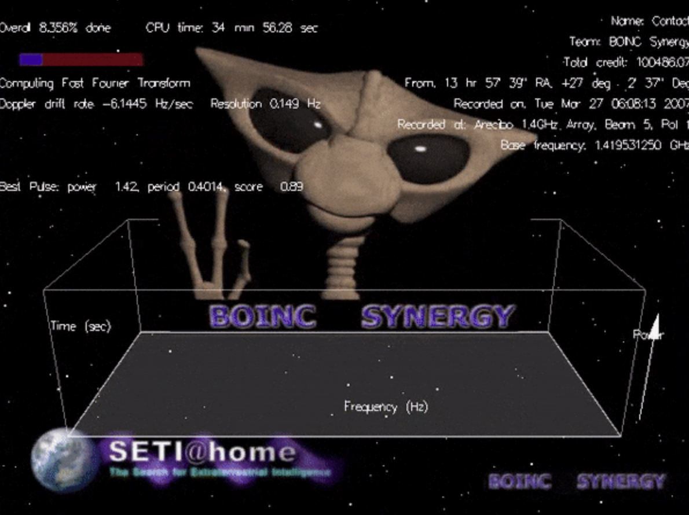
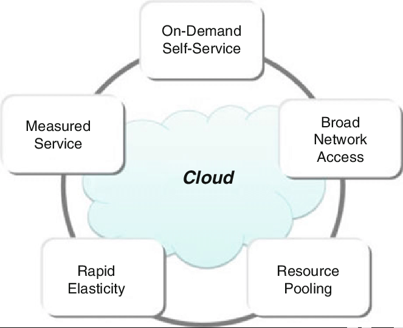
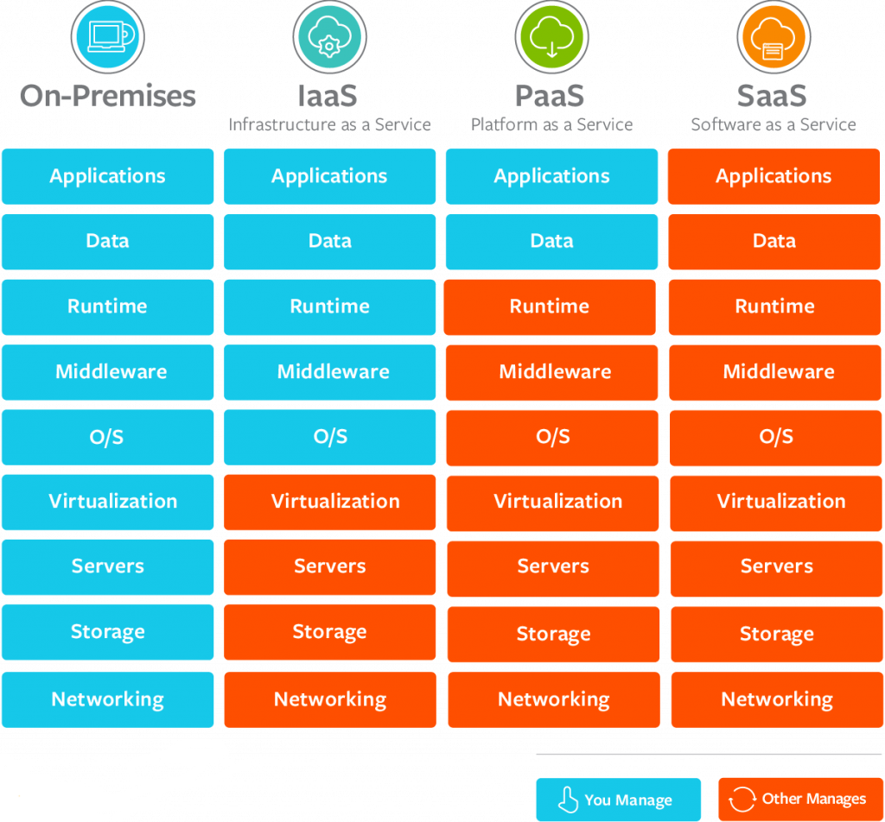
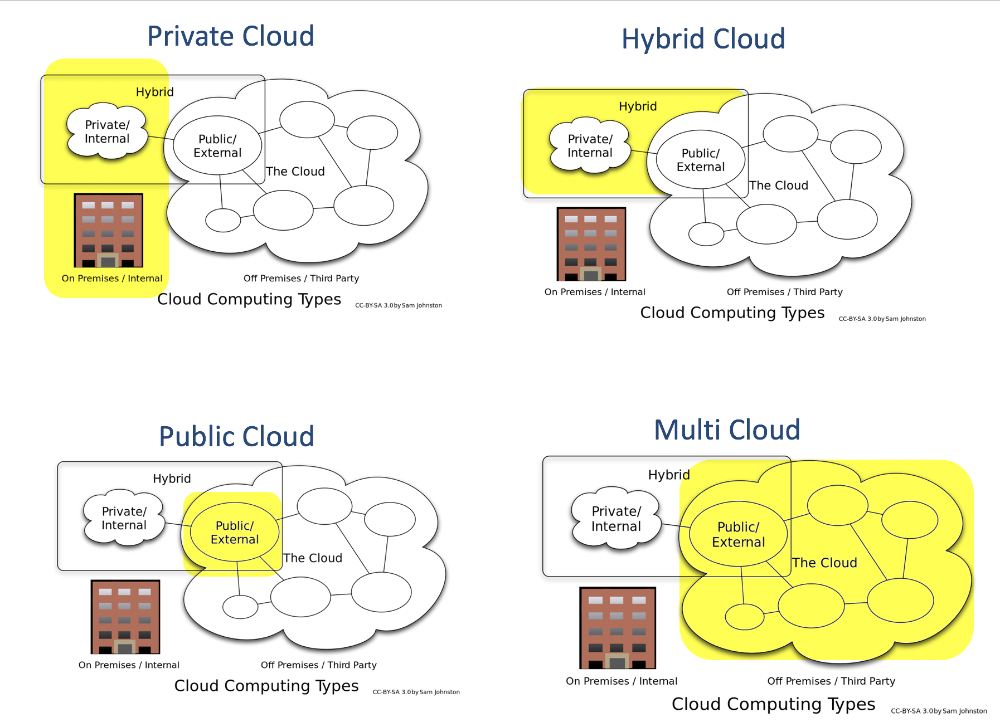
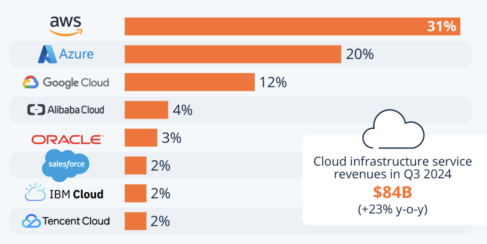

# Введение в облачные вычисления

<i>
В тот вечер город стоял в сизом мареве: фонари лениво мигали, ветер приносил запах озона и пыли с пустыря. Эмма и Джон, два студента университета, сидели на крыше старого общежития — там, где всегда можно было поймать бесплатный Wi-Fi из соседнего кафе.

— Смотри, — сказала Эмма, указывая на небо, — похоже, будто все облака сговорились и медленно плывут в одну сторону. Интересно, куда?

Джон хмыкнул, поправив потерянный шнурок на кроссовке:
— Может, к какому-то огромному хранилищу? Представь: миллионы облаков собирают свои капли в одну гигантскую чашу. Как сервера — когда их соединяют в кластеры.

— Ты всегда выдумываешь, — улыбнулась Эмма. — Но знаешь… в этом что-то есть. Мы тоже храним всё по-разному: на флешках, на дисках, в памяти телефонов. А вдруг и вправду всё когда-нибудь соберётся в одно общее?

Ветер усилился. Где-то вдали загрохотал поезд, а из окна соседней комнаты пробился свет монитора — чей-то сервер снова засветился, перегруженный задачами. Эмма задумчиво посмотрела на Джона:

— Думаешь, в будущем компьютеры будут такие огромные, что заменят нам всё?

— Нет, — ответил он, щурясь на огни города. — Я думаю, они будут везде. Как облака над нами: каждый по отдельности не удержит много, но если собрать вместе, получится целое море. Вот так и компьютеры: каждый телефон или сервер мал, а вместе они могут хранить и обрабатывать всё, что угодно.

Эмма улыбнулась, хотя сама до конца не поняла, что он имеет в виду.

В тот момент они ещё не знали, что эта случайная беседа о ночных облаках станет началом их собственного путешествия в странный и загадочный мир.
</i>

## Вопросы для самопроверки

После прохождения данной темы, вы сможете ответить на следующие вопросы:

1. В чем заключаются основные отличия традиционной локальной ИТ-инфраструктуры от облачной?
2. Как эволюционировали подходы к вычислениям от концепции _Grid Computing_ и _Utility Computing_ до современных облаков?
3. Какие характеристики определяют облачные вычисления и отличают их от других моделей предоставления ресурсов?
4. Что такое _SLA_ и _QoS_ в контексте облачных услуг и почему они важны для пользователей?
5. Какие роли специалистов существуют в сфере облачных технологий и почему навыки работы с облаком востребованы на рынке?

## История эволюции вычислительных технологий

Что вы представляете, когда слышите слово "облако"? Вероятно, вы вспоминаете облака на небе в виде лошадок, замков или других причудливых фигур. На самом деле, если рассматривать абстрактно, то это не так уж далеко от истины.

Развитие облачных технологий стоит рассматривать в контексте общей эволюции вычислительных подходов. Идея предоставлять вычислительные ресурсы как сервис возникла не сразу - ей предшествовала долгая эволюция от крупных локальных машин до распределенных сетей и, наконец, облака.

### От локальных вычислений к кластерам и Grid Computing

#### Локальные вычисления

В ранний период (вторая половина XX века) вычисления строились вокруг крупных централизованных машин, которые назывались _мейнфреймами_. Организации содержали собственные серверы в вычислительных залах, и вся обработка данных выполнялась локально. Пользователи подключались к таким мощным серверам через терминалы. Этот подход давал полный контроль над оборудованием, но требовал огромных инвестиций в аппаратное обеспечение, обслуживание, кондиционирование, электроэнергию, большой штат инженеров и администраторов. Масштабирование вычислительной мощности означало покупку новых дорогих серверов и занимало много времени.

_Рисунок 1. Компьютерный зал с мэйнфреймом 1950-1960-х годов: оператор работает за панелью управления_

#### Кластерные вычисления

Чтобы повысить производительность и надежность, появилась идея объединять много более дешевых машин в один комплекс. То есть не один мощный сервер, а множество менее мощных, но более дешевых и легко заменяемых. Так возникли _кластеры_.

_Кластерные вычисления_ - это группа связанных серверов, совместно выполняющих задачи. В 1980-х такие кластеры стали альтернативой дорогим мэйнфреймам [^1]. Кластеры решали задачу удешевления вычислений: добавление нового узла обходилось дешевле, чем апгрейд мэйнфрейма. Однако кластеры поначалу требовали, чтобы все машины находились в одном месте (например, в одном дата-центре) и были связаны высокоскоростной локальной сетью. Это ограничивало географическую распределенность системы, что накладывало ограничения на отказоустойчивость и масштабируемость.

#### Grid Computing

Следующим шагом эволюции стали распределенные вычислительные сети (конец 1990-х - 2000-е), известные, как _Grid Computing_. Идея _грид-вычислений_ заключалась в том, что вычислительные ресурсы разных организаций и локаций объединяются через Интернет в виртуальный сверхкомпьютер. В грид-системах множество узлов, разбросанных географически, совместно решают крупные задачи. Такой подход снял географическое ограничение кластеров - теперь машины могли находиться где угодно по миру.

Рост вычислительных мощностей и резкое снижение стоимости оборудования стали ключевым фактором, сделавшим возможным грид-проекты. Например, средняя стоимость одного мегабайта памяти за несколько десятилетий снизилась с десятков тысяч долларов до тысячных долей цента, а объёмы накопителей выросли от сотен килобайт до терабайтов.

_Таблица 1. Динамика снижения стоимости памяти и роста ёмкости накопителей_

| Год  | Стоимость (\$/MB) | Средняя ёмкость |
| ---- | ----------------- | --------------- |
| 1977 | \$32,000          | 16 KB           |
| 1987 | \$250             | 640 KB - 2 MB   |
| 1997 | \$2               | 64-256 MB       |
| 2007 | \$0.06            | 512 MB - 2 GB+  |
| 2014 | \$0.0091          | 8 GB → …        |
| 2024 | \~\$0.000…        | 32 GB →         |

Это приводило к экспоненциальному росту производительности и снижению цены вычислений, открыв путь для распределённых инициатив.

Грид-технологии успешно применялись в научных проектах (например, обработки данных коллайдера, астрономии), позволяя организациям делиться неиспользуемой мощностью друг с другом. Однако появились новые проблемы: в 1990-е глобальная интернет-инфраструктура еще не обеспечивала достаточно высокой пропускной способности и надежности связи для безупречной работы грид-систем [^1]. Тем не менее, именно грид-вычисления часто называют прямым предшественником облачных технологий.

Одним из самых знаменитых примеров грид-вычислений был проект [SETI@home](https://setiathome.berkeley.edu/), запущенный в 1999 году. Это проект распределенных вычислений из Университета Беркли, где добровольцы устанавливали на свои домашние компьютеры программу-скринсейвер, которая в периоды простоя обрабатывала небольшие фрагменты радиоастрономических данных в поисках признаков внеземных сигналов. По сути, миллионы персональных компьютеров превращались в один огромный виртуальный кластер. Важно, что пользователи оплачивали электричество и предоставляли собственные машины, а центральная система лишь координировала задачи и собирала результаты.

_Рисунок 2. Логотип проекта SETI@home, одного из первых примеров распределённых вычислений_

#### Utility Computing

Параллельно с развитием грид-концепции возникла идея предоставлять вычисления по аналогии с коммунальными услугами - по запросу, с оплатой по факту потребления. Данный подход получил название _Utility Computing_. Простыми словами, пользователи могли арендовать вычислительные ресурсы (процессорное время, память, хранилище) у провайдера и платить только за то, что они реально использовали. То есть вычислительные мощности и хранение данных начало рассматриваться как услуга, вроде электроэнергии или воды, а не товар.

Ещё в 1961 году Джон Маккарти, один из пионеров информатики, предсказал: «_Вычисления могут однажды быть организованы как коммунальная услуга, подобно телефонной системе…_». Это высказывание стало своего рода философским основанием будущего utility computing.

Провайдер же берет на себя поддержание всей необходимой инфраструктуры. В конце 1990-х - начале 2000-х модель utility computing еще только зарождалась, но именно она концептуально подготовила бизнес к идее аренды вычислений вместо владения оборудованием.

#### Переход к облачным вычислениям

Современное понятие облачные вычисления оформилось в середине 2000-х годов, когда сошлись воедино несколько технологических и экономических предпосылок.

Во-первых, массово внедрилась _виртуализация серверов_ - технология, позволяющая запускать на одном физическом сервере несколько виртуальных машин с полной изоляцией, представьте, что один мощный сервер можно разделить на десятки или сотни "виртуальных" серверов с разными операционными системами, которые не мешают друг другу. Виртуализация стала ключевым техническим фундаментом облака: с ее помощью провайдеры могут динамически выделять клиентам виртуальные серверы на общем физическом пуле машин.

Во-вторых, значительно подешевело оборудование и выросла производительность процессоров, что сделало экономически выгодным строить крупные дата-центры с тысячами серверов.

В-третьих, широкое распространение Интернета и веб-технологий (особенно эры Web 2.0) обеспечило практически повсеместный сетевой доступ. К середине 2000-х пользователи уже были привычны к тому, что приложения работают через веб-интерфейс, а данные хранятся удаленно - от почтовых сервисов до социальных сетей. Это создало благодатную почву для принятия облачных сервисов. Показательно, что сама метафора «облако» для обозначения удаленных ресурсообщих сервисов укрепилась именно в эти годы (существует версия, что термин cloud computing стал широко известен после упоминания в бизнес-плане компании Compaq в 1996 году [^2]).

Ключевой вехой стало появление первых масштабных коммерческих облачных платформ. В 2006 году Amazon запустила сервис хранения данных и облачные виртуальные серверы - по сути, предоставив сторонним разработчикам возможность арендовать вычислительные мощности. Это ознаменовало рождение облака в современном понимании. Облачные вычисления быстро эволюционировали из нишевого предложения для стартапов в доминирующую модель ИТ: уже к началу 2010-х многие компании осознали преимущества облака и начали переносить свои приложения и данные в облачные среды.

Таким образом, облако стало логичным итогом развития идей разделения ресурсов и сервисной модели потребления вычислительной мощности. В отличие от грид-вычислений, облачные платформы обеспечили более высокий уровень абстракции (пользователю не нужно управлять отдельными узлами), _эластичность_ (мгновенное масштабирование по запросу) и удобство доступа через веб-интерфейсы.

> Исторически облако можно рассматривать как «наследника» подхода Grid, но с важным отличием: если грид-системы часто строились как совместные проекты организаций, то облако в первую очередь развивается коммерческими провайдерами, предлагающими мощность любым клиентам на рыночных условиях.

## Определение облачных вычислений

Сам термин облачные вычисления (_cloud computing_) имеет несколько определений с разных точек зрения. Чтобы их понять, полезно сначала уточнить, что вообще значит слово вычисления.

### Что такое вычисления?

Когда вы слышите слово «вычисления», возможно, первым делом представляете калькулятор или компьютер, решающий арифметические задачи. Но в информатике понятие шире. Согласно определению из компьютерных наук, computing означает любую целенаправленную деятельность, которая требует, использует или создаёт вычислительные машины.

Таким образом, вычисления — это не только арифметика, но и работа с данными, моделирование, симуляции, анализ, хранение и передача информации. Именно в этом широком смысле термин используется, когда мы говорим об облачных вычислениях.

### Что такое облачные вычисления?

В общем смысле под _облаком_ понимают модель использования удаленных вычислительных ресурсов через сеть на основе аренды. Иначе говоря, облачные вычисления - это способ арендовать ИТ-ресурсы вместо того, чтобы владеть ими, благодаря чему можно гибко масштабировать мощности и платить только за фактическое потребление [^3]. Например, если я пользовался услугой всего 5 минут, то и заплачу только за эти 5 минут.

С _технической точки зрения_, Национальный институт стандартов и технологий США (NIST) дал следующее официальное определение: «_облачные вычисления - это модель, обеспечивающая удобный сетевой доступ по требованию к общей пулу настраиваемых вычислительных ресурсов (например, сетей, серверов, хранилищ, приложений и сервисов), которые могут быть оперативно предоставлены и освобождены с минимальными управленческими усилиями или обращениями к провайдеру_» [^2]. Иными словами, облако предоставляет вычислительные мощности как услугу по запросу через интернет. Международные стандартизирующие организации (например, ISO/IEC) также придерживаются сходных формулировок.

С _точки зрения конечного пользователя или бизнеса_, облачные вычисления можно определить проще: это использование чужой инфраструктуры и программного обеспечения удаленно, как _сервиса_. Пользователь обращается к удаленным серверам через интернет, чтобы хранить данные или запускать приложения, и оплачивает эту услугу подобно коммунальной - в зависимости от объема потребленных ресурсов или по подписке. Облачные платформы скрывают всю сложность управления физическим оборудованием и низкоуровневым ПО: для клиента облако выглядит как бесконечный запас ресурсов, который всегда доступен, расширяется по мере надобности и за который платишь по мере использования.

Важно отметить, что понятие «облако» охватывает не только аренду виртуальных серверов или хранения. В облачных вычислениях предлагается целый спектр сервисов - от базовой инфраструктуры до готовых приложений - о разновидностях которых мы поговорим ниже.

> Облако — это не просто вычисления, а сервисная модель доставки ресурсов. Пользователь получает доступ не к «железу» как таковому, а к сервисам, которые скрывают за собой всю сложность инфраструктуры.

## Ключевые характеристики облачных вычислений

Специалисты и стандартизующие органы выделяют ряд основных характеристик облачных систем. Эти свойства отличают облако от традиционного подхода и позволяют определить, является ли та или иная платформа «облачной». Согласно определению Национального института стандартов и технологий США (NIST, документ SP 800-145), к ключевым характеристикам относят:

- Самообслуживание по запросу (On-demand self-service)
- Широкий сетевой доступ (Broad network access)
- Объединение ресурсов и мультиарендность (Resource pooling and multi-tenancy)
- Быстрая эластичность (Rapid elasticity)
- Измеряемые услуги (Measured service)

_Рисунок 3. Ключевые характеристики облачных вычислений по NIST (SP 800-145)_

### Самообслуживание по запросу (On-demand self-service)

Пользователь облака может самостоятельно, без участия персонала провайдера, получить необходимые ему вычислительные ресурсы - например, запустить виртуальный сервер, увеличить объем хранилища или развернуть приложение. Все происходит автоматически по запросу через веб-интерфейс или API.

_Самообслуживание по запросу (On-demand self-service)_ означает, что обращение за ресурсами осуществляется по мере потребности, в режиме реального времени. Нет необходимости делать долгосрочные заказы на оборудование - достаточно нескольких кликов, и нужный ресурс предоставляется практически мгновенно.

### Широкий сетевой доступ (Broad network access)

Облачные сервисы доступны через сеть (как правило, интернет) с использованием стандартных механизмов доступа. Ресурсы облака можно использовать с самых разных устройств и платформ - будь то настольный компьютер, ноутбук, смартфон или планшет. Это кардинально отличает облако от локальных систем, привязанных к одной локальной сети или устройству.

### Объединение ресурсов и мултиарендность (Resource pooling and multi-tenancy)

Облачный провайдер формирует большой пул вычислительных ресурсов (серверы, хранилища, каналы передачи данных), который динамически распределяется между множеством пользователей. Эта модель называется multi-tenancy (многоклиентская архитектура): один физический сервер может обслуживать десятки виртуальных машин разных клиентов, данные разных арендаторов могут храниться на одном массиве с разделением по логическим пространствам и т.д.

Пул ресурсов автоматически перераспределяется в зависимости от текущего спроса, при этом пользователи обычно не знают и не контролируют, на каком именно оборудовании выполняются их задачи - им представляется абстракция бесконечного ресурса.

Важный аспект - изоляция: несмотря на совместное использование инфраструктуры, облачные системы обеспечивают логическую изоляцию данных и вычислений разных клиентов. Объединение ресурсов дает масштабную экономию за счет эффекта масштаба и более высокой загрузки оборудования.

### Эластичность и масштабируемость (Elasticity and Scalability)

Облако предоставляет быстрое масштабирование ресурсов - как увеличение, так и уменьшение - практически в режиме реального времени.

_Быстрая эластичность (Rapid elasticity)_ означает, что по запросу пользователя или автоматически система способна мгновенно выделить дополнительные мощности (например, запустить десятки новых серверов под возросшую нагрузку) или, напротив, освободить избыточные ресурсы, когда потребность отпала.

Эластичность позволяет приложениям в облаке переживать резкие всплески трафика без предварительного резервирования огромных мощностей: облако само “растягивается” и “сжимается” под фактическую нагрузку.

### Измеряемый сервис и оплата по факту (Measured service)

Облачные платформы автоматически учитывают потребление ресурсов каждым пользователем с высокой точностью. Встроенные механизмы метеринга (metering) измеряют, сколько процессорного времени, памяти, объема хранилища, сетевого трафика и т.д. израсходовано.

Благодаря этому облако поддерживает модель оплаты *pay-as-you-go* - клиент платит именно за те ресурсы, которые были использованы за расчетный период (час, день, месяц) [^4]. Такой подход напоминает оплату электроэнергии по счетчику: нет необходимости делать крупные авансовые вложения, расходы прозрачно масштабируются вместе с уровнем потребления.

### Отказоустойчивость (Fault Tolerance)

Помимо пяти официальных характеристик, которые определяет NIST, в литературе и практике часто выделяют и дополнительные свойства облачных платформ. Одним из них является *отказоустойчивость (fault tolerance)*.

Отказоустойчивость означает способность облака продолжать работу даже при сбоях отдельных компонентов. В облачной архитектуре это достигается за счёт репликации данных, дублирования сервисов в нескольких зонах доступности и автоматического переключения на резервные узлы. Например, если один сервер или даже целый дата-центр выйдет из строя, приложение продолжит работать без заметных перебоев для пользователя.

Формально *fault tolerance* не входит в список пяти обязательных характеристик по NIST. Однако на практике это свойство считается неотъемлемым для промышленных облаков, так как напрямую связано с доступностью и надёжностью сервисов, которые фиксируются в SLA.

### Вывод

Перечисленные характеристики были признаны как “пять столпов” облачных вычислений. Если система или сервис обладают всеми этими свойствами, их можно уверенно называть облачными. Например, корпоративный дата-центр, где для получения сервера нужно ждать недели и оформлять заявки к ИТ-отделу, не соответствует критерию самообслуживания по требованию - значит, это еще не облако. С другой стороны, виртуальный хостинг-сервис в интернете, позволяющий мгновенно развернуть нужную конфигурацию, оплачиваемую почасово, - вполне облачная модель.

## Локальная инфраструктура vs облако: основные различия

Переход от традиционной модели собственного ИТ-хозяйства (on-premises) к облачным сервисам знаменует серьезную смену парадигмы. Многие крупные компании уже успели перейти на облачные решения. Сравним эти подходы, чтобы понять мотивацию, по которой организации массово мигрируют в облако.

### Контроль и ответственность

При классическом подходе вся инфраструктура (серверы, диски, сети) находится в собственности и под управлением организации. Это дает полный контроль - можно тонко настраивать оборудование, программное окружение, политики безопасности. Однако вместе с контролем приходит и полная ответственность: поддержание работоспособности, замена вышедшего из строя железа, резервное копирование, обновления софта - все ложится на плечи ИТ-службы компании.

В облаке же инфраструктура принадлежит провайдеру, а клиенту она предоставляется как абстракция. В итоге часть ответственности переносится на провайдера: например, облако самостоятельно заботится о замене неисправного сервера, обеспечении электропитания и охлаждения, физической безопасности, патчах ОС и т.д. Пользователь фокусируется на своей прикладной задаче (разработке приложения, обработке данных), не тратя ресурсы на рутинную эксплуатацию железа.

### Стоимость и модель затрат

Локальная инфраструктура требует крупных капитальных затрат (_CAPEX_) заранее: компании покупают серверы, сетевое оборудование, строят дата-центры или арендуют площадки, приобретают лицензии - и эти инвестиции рассчитаны на годы вперед. Дополнительно несутся постоянные расходы на персонал, электроэнергию, замену оборудования, лицензирование ПО.

Облако кардинально меняет модель на _операционные затраты_ (_OPEX_) по мере использования. Нет больших первоначальных вложений - ресурсы берутся в аренду по необходимости. Это снижает порог входа для новых проектов: даже стартап с минимальным бюджетом может получить доступ к мощнейшим вычислительным ресурсам, платя понемногу за фактическую загрузку.

Прогнозируемость затрат также меняется: on-premises инфраструктура имеет фиксированные расходы вне зависимости от того, насколько эффективно используется оборудование (сервер может простаивать, но деньги уже вложены), а в облаке затраты пропорциональны активности.

> Контроль над расходами в облаке тоже требует внимания - бесконтрольное масштабирование может привести к “сюрпризам” в счете, если не настроить ограничения и мониторинг.

### Масштабируемость и гибкость

В локальном дата-центре масштабирование ограничено приобретенным оборудованием. Если неожиданно нагрузка выросла сверх расчетной - приходится спешно закупать новые сервера, ждать доставки, настраивать. Это может занять недели или месяцы, и все это время система будет работать на пределе или хуже.

В облаке масштабируемость заложена по умолчанию: ресурсы можно увеличить практически мгновенно. Например, веб-приложение в облаке способно автоматически запустить дополнительные экземпляры серверов при всплеске трафика и так же автоматически их выключить, когда наплыв пользователей спадет [^4].

### Доступность и надежность

Организация, эксплуатирующая собственные сервера, вынуждена самостоятельно решать задачи резервирования и отказоустойчивости. В случае аварии (например, отключения электроэнергии, пожара) - ответственность за восстановление лежит на внутренней команде, и простои могут быть значительными, если не были продуманы планы _disaster recovery_ (восстановление после катастроф).

Крупные облачные провайдеры изначально строят инфраструктуру с высокой отказоустойчивостью: данные могут автоматически реплицироваться в несколько дата-центров, сервисы разворачиваются в разных зонах доступности. Кроме того, облака предоставляют готовые инструменты резервного копирования, аварийного переключения и мониторинга.

### Безопасность и соответствие требованиям

Этот аспект более тонкий. С одной стороны, передача данных и вычислений в чужое облако вызывает у организаций опасения за безопасность и конфиденциальность - особенно в отраслях с строгими регуляторными требованиями.

С другой стороны, крупные облачные провайдеры вкладывают колоссальные средства в кибербезопасность, найм экспертов, сертификацию по международным стандартам (ISO 27001, SOC 2 и пр.).

Для многих компаний уровень защищенности инфраструктуры у ведущих облачных платформ выше, чем они могли бы обеспечить самостоятельно. Тем не менее, контроль над безопасностью в облаке разделен: провайдер отвечает за _безопасность “облака”_ (физическую, сети, гипервизора и т.п.), а клиент - за _безопасность “в облаке”_ (настройка прав доступа, шифрование данных, защита аккаунтов). Этот принцип называется *модель разделенной ответственности* (Shared Responsibility Model).

### Скорость развертывания и обновления

В традиционной среде установка нового сервера или внедрение нового приложения - длительный цикл: закупка - установка ОС - настройка окружения - деплой ПО. В облаке этот процесс может быть автоматизирован и сокращен до минут.

Существуют готовые образы систем, оркестрация, инфраструктура как код. В результате компании в облаке могут быстрее внедрять новые функции и обновления, масштабировать сервисы под акции или кампании, не беспокоясь о ручном предоставлении ресурсов. Это повышает общую _агильность_ ИТ-операций.

### Вывод

Подводя итог, ключевое различие - облако превращает ИТ-инфраструктуру в сервис, подобный подрядчику или поставщику услуг, тогда как on-premises - это владение и самостоятельное управление.Мотивация перехода на облако обычно связана с желанием сократить ИТ-издержки, повысить гибкость и скорость, сфокусироваться на своем основном бизнесе, а не на эксплуатации железа.

Несмотря на это компании не всегда полностью отказываются от локальных систем. Часто используется гибридный подход, когда часть критичных данных или приложений остается on-premises, а менее чувствительные или требующие масштабирования задачи переносятся в облако.

## Модели сервисов в облаке: IaaS, PaaS, SaaS

Когда мы говорим, что «облако предоставляет ресурсы как сервис», возникает вопрос: *а на каком уровне предоставляются эти ресурсы*? На практике существует три базовые модели сервисов:

### Infrastructure as a Service (IaaS)

Наиболее низкий уровень абстракции. Провайдер даёт пользователю в аренду *инфраструктуру*: виртуальные машины, диски, сети. Всё физическое оборудование и его обслуживание остаётся на стороне облака, а клиент сам решает, какие операционные системы, программы и конфигурации ему нужны.

*Пример*: представьте, что вы арендовали пустую квартиру. Стены, проводка, отопление — это провайдер (облако). Но мебель, техника и порядок вы обеспечиваете сами.

- Пользователь управляет: ОС, приложениями, данными.
- Провайдер управляет: физическим железом, виртуализацией, дата-центрами.
- Примеры: Amazon EC2, Microsoft Azure Virtual Machines, Google Compute Engine.

### PaaS (Platform as a Service)

Средний уровень абстракции. Здесь облако предоставляет *готовую платформу* для разработки и запуска приложений. Вам не нужно заботиться о серверах, ОС или масштабировании — всё это делает провайдер. Вы фокусируетесь только на коде.

Пример: это похоже на аренду квартиры с мебелью и техникой. Вам остаётся лишь жить — готовить, отдыхать, заниматься своими делами, не думая про ремонт или покупку мебели.

- Пользователь управляет: приложениями и данными.
- Провайдер управляет: инфраструктурой, ОС, средой выполнения.
- Примеры: Google App Engine, Heroku, Microsoft Azure App Service.

### SaaS (Software as a Service)

Наивысший уровень абстракции. Пользователь получает *готовое приложение* через интернет. Здесь не нужно думать ни про сервера, ни про код — вы просто пользуетесь сервисом через браузер или мобильное приложение.

Пример: это как гостиница. Вам не нужно заботиться о ремонте, мебели или еде — всё уже готово, вы только пользуетесь услугами.

- Пользователь управляет: только самим использованием (данные, настройки профиля).
- Провайдер управляет: приложением, платформой, инфраструктурой.
- Примеры: Gmail, Microsoft 365, Salesforce, Dropbox.

> В этой главе мы ограничимся только обзором базовых моделей. Во второй главе курса мы более подробно рассмотрим, как они реализуются на практике, какие есть плюсы и минусы, а также разберём дополнительные модели

*Рисунок 4. Модели сервисов в облаке: IaaS, PaaS, SaaS*

## Модели развертывания облаков: public, private, hybrid, community, multi-cloud

Облачные вычисления можно классифицировать по модели развертывания, то есть по тому, кому принадлежат облачные ресурсы и как они используются. Существует несколько типов облаков по развертыванию:

_Публичное облако (public cloud)_ - это облачная инфраструктура, принадлежащая стороннему провайдеру, ресурсы которой предоставляются широкому кругу пользователей через интернет. Проще говоря, это “облако для всех желающих”. В публичном облаке ресурсы общие (мультиарендные), и каждый клиент арендует свою долю. Примеры публичных облаков: Amazon Web Services, Microsoft Azure, Google Cloud Platform.

_Частное облако (private cloud)_ - это облачная инфраструктура, используемая эксклюзивно одной организацией. При этом физически инфраструктура может находиться как у самой организации (в ее дата-центре), так и у внешнего провайдера, но ресурсы не разделяются с другими клиентами. Частное облако стремится дать те же преимущества (автоматизация, эластичность, самообслуживание), но в рамках огороженного периметра.

_Гибридное облако (hybrid cloud)_ - комбинация публичного и частного облаков, связанных между собой и работающих совместно. В гибридной модели часть сервисов/данных работает в частном облаке (или локально), а часть - в публичном, и они интегрированы. Идея гибридного подхода - использовать лучшее из обоих миров: чувствительные данные держать локально для безопасности, а публичное облако привлекать для пиковой нагрузки или менее критичных задач.

_Мультиоблачность (multi-cloud)_ - это использование нескольких облачных провайдеров одновременно для разных задач. В отличие от гибридного, здесь речь обычно идет о нескольких публичных облаках (или в сочетании с частным). Например, организация может параллельно пользоваться AWS и Azure, либо AWS и Google Cloud, и развертывать разные части своих систем в том облаке, где это более эффективно или надежно.

_Облако сообщества (community cloud)_ - инфраструктура, которую совместно используют несколько организаций с общими интересами или требованиями (например, университеты или госучреждения для совместных проектов и общих политик безопасности). Такой вариант сочетает повышенное доверие и гибкость с распределением затрат между участниками.

_Рисунок 5. Модели развертывания облаков_

## Service Level Agreement (SLA) и Quality of Service (QoS) 

### SLA

При использовании облачных (да и любых IT-) сервисов крайне важны понятия соглашения об уровне услуг (SLA, _Service Level Agreement_) и качества обслуживания (QoS, Quality of Service).

_Service Level Agreement (SLA)_ - это формальный документ-соглашение между поставщиком услуги (в нашем случае облачным провайдером) и потребителем, определяющий гарантированный уровень качества сервиса.

Проще говоря, SLA описывает, что именно провайдер обязуется предоставить клиенту и с какими характеристиками. В контексте облака SLA обычно включает такие параметры, как

- _Доступность (Availability)_. Процент времени, когда сервис работает. Например, 99.9% означает не более ~43 минут простоя в месяц.
- _Время реакции (Response Time)_ - Максимальное время отклика на запрос. Например, время ответа API не более 200 мс.
- _Время восстановления (Recovery time)_. Сколько займет восстановление после сбоя (mean time to recover, MTTR).
- _Реакция на инциденты (Incident Response)_. Обязательство устранять критические неполадки в течение определенного времени.

В SLA также оговариваются действия при нарушении - обычно это компенсации клиенту (кредиты, скидки) в случае, если провайдер не выдержал заявленных метрик качества. SLA может содержать и описания обязанностей клиента (например, использовать сервис согласно определенным правилам), процедуры уведомления о сбоях, ответственность сторон и пр.

SLA нужен прежде всего, для установления чётких взаимопониманий и ожиданий между клиентом и провайдером. Покупая облачный сервис, особенно для критически важных бизнес-задач, компания должна быть уверена, что получит определенный минимум качества.

Все вышеописанные показатели в совокупности характеризуют качество сервиса.

### QoS

_Quality of Service (QoS)_ - термин, обозначающий качественные характеристики работы системы с точки зрения пользователя. В контексте облака QoS включает доступность, производительность, надежность, безопасность - все, что формирует опыт использования сервиса. SLA, по сути, является формализованным выражением требуемого QoS. Например, если облако предоставляет виртуальные машины, QoS для клиента - это насколько стабильно эти ВМ работают, не падают ли, достаточно ли быстро диск отзывается, не превышены ли задержки сети и т.д.

Для облачных провайдеров поддержание высокого QoS - часть репутации и обязательное условие удержания клиентов. Они инвестируют в избыточность инфраструктуры, мониторинг и поддержку 24×7, центры обработки с резервированием, чтобы обеспечить заявленный QoS. Многие провайдеры публикуют метрики своей надежности (например, панели статуса сервисов, отчеты об инцидентах) - это повышает доверие.

## Роли и профессии в сфере облачных технологий

Перед началом изучения курса Cloud Computing у вас, возможно, возникнет вопрос: «Зачем мне это нужно и кем я могу стать?». Краткий ответ прост: сегодня практически все специалисты в сфере информационных технологий должны быть знакомы с облачными вычислениями. Очень многие вакансии требуют этих навыков — от разработчиков и тестировщиков до администраторов и инженеров.

В то же время существуют и специализированные роли, напрямую связанные с облачными технологиями:

- _Облачный разработчик (Cloud Developer)_. По сути это разработчик программного обеспечения, специализирующийся на создании приложений с использованием облачных сервисов. Он хорошо знает, как устроены облачные платформы, умеет писать код, оптимизированный для облака.
- _Облачный инженер / инженер по инфраструктуре (Cloud Engineer)_. Это более инфраструктурная роль. Облачный инженер занимается развертыванием, настройкой и поддержкой облачной инфраструктуры для компаний. Его задачи: настроить сети в облаке, обеспечить безопасность, реализовать автоматическое масштабирование, мониторинг, мигрировать существующие системы в облако.
- _Облачный архитектор (Cloud Architect)_. Одна из наиболее высокоуровневых и востребованных позиций. Облачный архитектор проектирует архитектуру систем в облаке: какие сервисы использовать, как их связать, как обеспечить надежность и безопасность. Он должен глубоко понимать возможности облачных платформ, знать типовые архитектурные паттерны. Облачный архитектор работает на стыке технологий и бизнеса - его решения должны учитывать и технические требования (нагрузку, задержки, совместимость), и экономические (стоимость использования облачных ресурсов, оптимизация затрат).
- _DevOps-инженер (Cloud/DevOps Engineer)_. Хотя DevOps - более широкое понятие, в контексте облака DevOps-инженер играет ключевую роль в автоматизации процессов разработки и эксплуатации. Он настраивает конвейеры CI/CD, автоматические тестирования и развертывания. В облачной среде DevOps-инженер отвечает за то, чтобы, например, при росте нагрузки автоматически добавлялись новые серверы, а при снижении - удалялись.
- _Инженер по безопасности облака (Cloud Security Engineer)_. Специалист, фокусирующийся на аспектах информационной безопасности в облачных средах. Он разрабатывает политики доступа, настраивает шифрование, контролирует соблюдение стандартов. Также его сфера - аудит конфигураций на предмет уязвимостей, управление ключами шифрования, реагирование на инциденты в облаке.
- _Site Reliability Engineer (SRE)_. Профессия, родившаяся в Google и схожая с DevOps, но акцентирующая надежность и эксплуатацию масштабных облачных систем. SRE применяет принципы программирования к задачам администрирования (создает инструменты для автоматизации операционных задач), следит за SLO (service level objectives) - конкретными метриками надежности сервисов, и работает над их выполнением.
- _Другая смежная специализация_. Облако охватывает многие сферы, поэтому есть и более специфические роли: архитектор по данным в облаке (Cloud Data Architect) - проектирует хранилища данных и pipelines в облаке; специалист по облачному машинному обучению (Cloud ML Engineer) - разворачивает ML решения на сервисах вроде AWS SageMaker или GCP AI Platform; администратор облачных затрат (Cloud Cost Manager) - оптимизирует расходы, ищет неэффективности.

Для студентов технических направлений ответ очевиден: рынок труда показывает огромный спрос. Уже в 2020 году облачные навыки были признаны одними из наиболее дефицитных: Indeed называл Cloud Computing навыком №1 среди наиболее востребованных [^7].

Кроме того, облачные технологии часто стоят на стыке разных дисциплин - это отличный способ расширить кругозор. Изучая облако, вы погрузитесь и в сети, и в базы данных, и в безопасность, и в разработку - облако дает целостное понимание современной ИТ-инфраструктуры. Даже если ваша специализация - разработка ПО, знание облачных сервисов позволит создавать более инновационные и масштабируемые приложения.

## Примеры облачных платформ

Чтобы закрепить понятия, обсудим конкретных ведущих игроков рынка облачных услуг и то, какие платформы вы, вероятно, встретите на практике. На сегодняшний день тройкой крупнейших публичных облачных провайдеров в мире являются _Amazon Web Services (AWS)_, _Microsoft Azure_ и _Google Cloud Platform (GCP)_ - на их долю приходится порядка 60-65% мирового рынка облачных инфраструктурных сервисов. Эти компании называют _гиперскейлерами_ из-за огромного масштаба их дата-центров и широты сервисов.

_Рисунок 6. Рыночные доли крупнейших облачных провайдеров (2024 Q3)_

_Amazon Web Services (AWS)_ - пионер облачного рынка и крупнейший его игрок (около трети рынка IaaS/PaaS). AWS начал в 2006 с 2 услуг, а сегодня предоставляет свыше 200 различных сервисов - от базовых (виртуальные машины, облачные базы данных, хранилища) до высокоуровневых (аналитика данных, искусственный интеллект, IoT, безсерверные вычисления). AWS оперирует десятками дата-центров по всему миру. Многие концепции облака во многом сформированы AWS.

_Microsoft Azure_ - облачная платформа от Microsoft, занимающая второе место по доле рынка. Azure быстро набрал популярность благодаря интеграции с корпоративными продуктами Microsoft (Windows Server, SQL Server, .NET, Active Directory и др.). Компании, у которых уже были Microsoft-ориентированные ИТ, легко переходили в Azure.

_Google Cloud Platform (GCP)_ - облако от Google, третье по масштабам. Исторически Google немного отставал в гонке облаков, но выделяется своими технологиями обработки больших данных и машинного обучения.

Помимо “большой тройки”, есть и другие заметные игроки:

- _IBM Cloud_. Облако IBM, исторически сильное в enterprise-сегменте.
- _Oracle Cloud_. Облачная платформа Oracle, акцент на базе данных Oracle и бизнес-приложения.
- _Alibaba Cloud_. Крупнейший облачный провайдер в Китае с растущим международным присутствием.

## Резюме

- _Облачные вычисления:_ модель предоставления ИТ-ресурсов как сервисов по сети, с гибким масштабированием и оплатой за использование. Облако сформировалось на основе идей грид- и utility-компьютинга, став их эволюционным продолжением.
- _Историческая эволюция_: от централизованных мэйнфреймов к распределенным кластерам, затем к межорганизационным grid-сетям и концепции utility (вычисления как коммунальная услуга). Ключевые технологии (виртуализация, высокоскоростной интернет, веб-интерфейсы) и экономические факторы подготовили почву для появления облака в mid-2000-х.
- _Ключевые свойства облака_: самообслуживание по запросу, доступ через интернет отовсюду, общий пул ресурсов с мультиарендностью, эластичное масштабирование под нагрузку и автоматический учет потребления (pay-as-you-go). Эти характеристики отличают облако от традиционного хостинга или дата-центра.
- _Преимущества облака перед on-premises_: отсутствие капитальных затрат, быстрая масштабируемость, сокращение времени вывода продуктов, передача части операционной нагрузки провайдеру, глобальная доступность.
- _Модели развертывания_: публичное облако (ресурсы у провайдера, доступны всем), частное облако (ресурсы выделены одной организации), гибридное (комбинация публичного и частного) и мультиоблачное (использование нескольких провайдеров).
- _SLA и качество услуг_: облачные провайдеры заключают с клиентами соглашения об уровне сервиса (SLA), где гарантируют определенные показатели надежности и производительности (uptime, реакция и т.д.).
- _Роли специалистов_: Облачные технологии породили большой спрос на cloud developers, cloud architects, DevOps/SRE, cloud security engineers и других. Эти специалисты обеспечивают разработку, архитектурное проектирование, автоматизацию, надежность и безопасность облачных систем.
- _Основные платформы_: лидерами облачного рынка являются AWS, Azure и Google Cloud, предлагающие схожий набор базовых сервисов (ВМ, хранилища, БД, функции, аналитика и т.д.) и конкурирующие в продвинутых областях (AI, IoT, enterprise integration).

[^1]: _Evolution of Cloud Computing_. geeksforgeeks.org [online]. Available at: https://www.geeksforgeeks.org/cloud-computing/evolution-of-cloud-computing/ [Accessed 10.05.2025]
[^2]: _Cloud Computing_. wikipedia.org [online]. Available at: https://en.wikipedia.org/wiki/Cloud_computing [Accessed 10.05.2025]
[^3]: _Cloud Computing as a Career for Software Developers_. testrigor.com [online]. Available at: https://testrigor.com/blog/cloud-computing-as-a-career-for-software-developers/ [Accessed 10.05.2025]
[^4]: _On-Premises vs Cloud_. red-gate.com [online]. Available at: https://www.red-gate.com/simple-talk/blogs/on-premises-vs-cloud/ [Accessed 10.05.2025]
[^5]: _Public Cloud vs Private Cloud vs Hybrid Cloud_. geeksforgeeks.org [online]. Available at: https://www.geeksforgeeks.org/devops/public-cloud-vs-private-cloud-vs-hybrid-cloud/ [Accessed 10.05.2025]
[^6]: _cloud SLA (cloud service-level agreement)_. techtarger.com [online]. Available at: https://www.techtarget.com/searchstorage/definition/cloud-storage-SLA [Accessed 10.05.2025]
[^7]: _Cloud computing roles_. campus.datacamp.com [online]. Available at: https://campus.datacamp.com/courses/understanding-cloud-computing/cloud-deployment [Accessed 10.05.2025]
