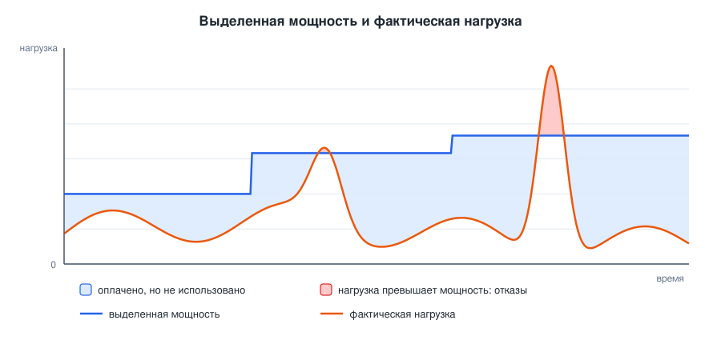
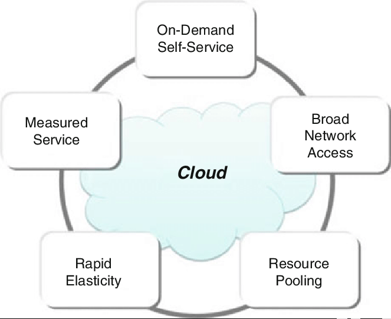
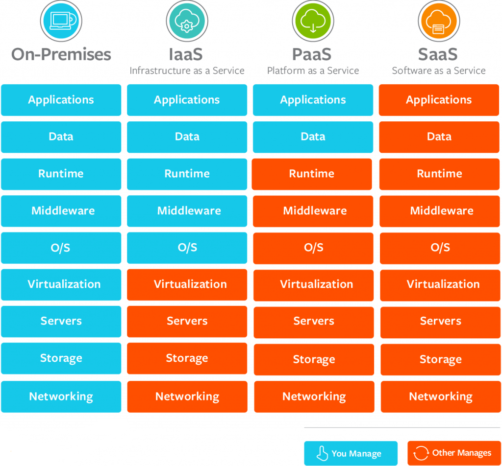
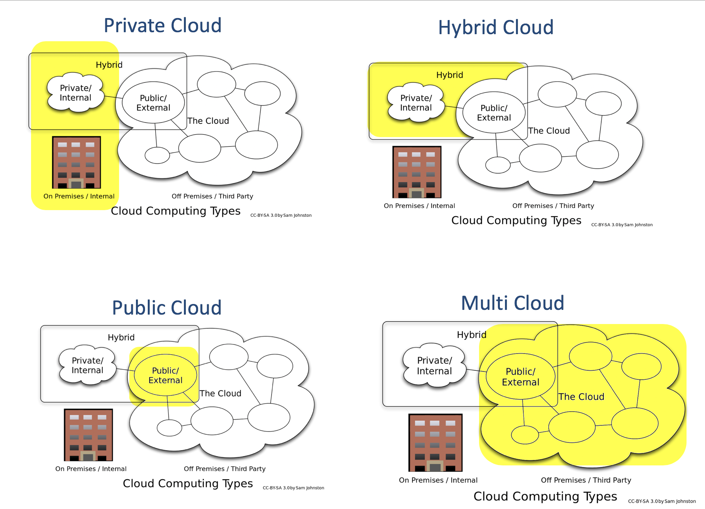
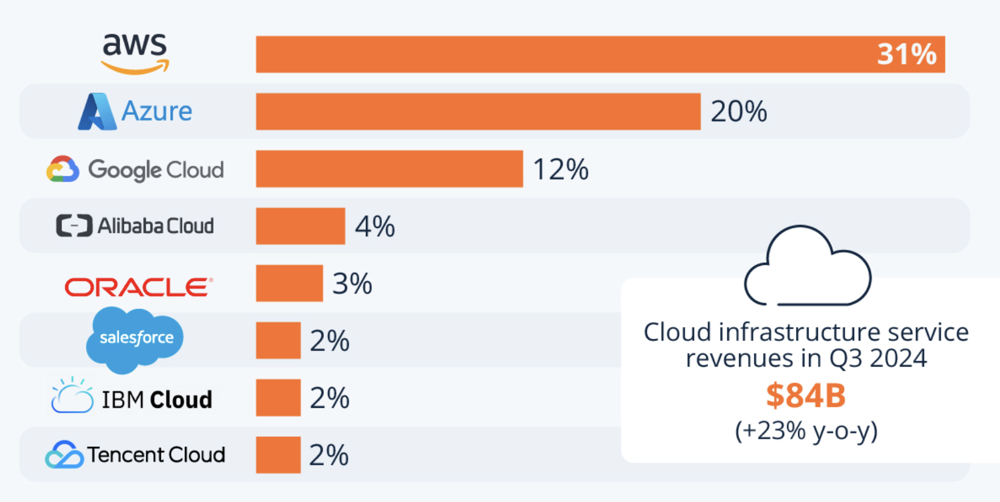

# Введение в облачные вычисления

<i>
В тот вечер город стоял в сизом мареве: фонари лениво мигали, ветер приносил запах озона и пыли с пустыря. Эмма и Джон, два студента университета, сидели на крыше старого общежития - там, где всегда можно было поймать бесплатный Wi-Fi из соседнего кафе.
– Смотри, - сказала Эмма, указывая на небо, - похоже, будто все облака сговорились и медленно плывут в одну сторону. Интересно, куда?

Джон хмыкнул, поправив потерянный шнурок на кроссовке: – Может, к какому-то огромному хранилищу? Представь: миллионы облаков собирают свои капли в одну гигантскую чашу. Как сервера - когда их соединяют в кластеры.

– Ты всегда выдумываешь, - улыбнулась Эмма. - Но знаешь… в этом что-то есть. Мы тоже храним всё по-разному: на флешках, на дисках, в памяти телефонов. А вдруг и вправду всё когда-нибудь соберётся в одно общее?

Ветер усилился. Где-то вдали загрохотал поезд, а из окна соседней комнаты пробился свет монитора - чей-то сервер снова засветился, перегруженный задачами. Эмма задумчиво посмотрела на Джона:

– Думаешь, в будущем компьютеры будут такие огромные, что заменят нам всё?

– Нет, - ответил он, щурясь на огни города. - Я думаю, они будут везде. Как облака над нами: каждый по отдельности не удержит много, но если собрать вместе, получится целое море. Вот так и компьютеры: каждый телефон или сервер мал, а вместе они могут хранить и обрабатывать всё, что угодно.

Эмма улыбнулась, хотя сама до конца не поняла, что он имеет в виду.

В тот момент они ещё не знали, что эта случайная беседа о ночных облаках станет началом их собственного путешествия в странный и загадочный мир.
</i>

## Содержание

- [Введение в облачные вычисления](#введение-в-облачные-вычисления)
  - [Содержание](#содержание)
  - [Вопросы для самопроверки](#вопросы-для-самопроверки)
  - [Результаты обучения](#результаты-обучения)
  - [Введение в курс](#введение-в-курс)
  - [Что такое вычисления?](#что-такое-вычисления)
  - [Проблема: сколько серверов нужно вашему приложению](#проблема-сколько-серверов-нужно-вашему-приложению)
    - [Что стоит за словом "сервер"](#что-стоит-за-словом-сервер)
    - [Задача планирования мощности](#задача-планирования-мощности)
    - [Капитальные и операционные затраты](#капитальные-и-операционные-затраты)
  - [Предпосылки возникновения облачных вычислений](#предпосылки-возникновения-облачных-вычислений)
    - [Вычисления как коммунальная услуга](#вычисления-как-коммунальная-услуга)
    - [Кластерные вычисления](#кластерные-вычисления)
    - [Grid computing](#grid-computing)
    - [Utility computing](#utility-computing)
    - [Сравнение предшествующих подходов](#сравнение-предшествующих-подходов)
    - [Появление первых коммерческих облачных платформ](#появление-первых-коммерческих-облачных-платформ)
  - [Определение облачных вычислений](#определение-облачных-вычислений)
  - [Существенные характеристики облачных вычислений](#существенные-характеристики-облачных-вычислений)
    - [Самообслуживание по требованию (on-demand self-service)](#самообслуживание-по-требованию-on-demand-self-service)
    - [Широкий сетевой доступ (broad network access)](#широкий-сетевой-доступ-broad-network-access)
    - [Объединение ресурсов в пул (resource pooling)](#объединение-ресурсов-в-пул-resource-pooling)
    - [Быстрая эластичность (rapid elasticity)](#быстрая-эластичность-rapid-elasticity)
    - [Измеряемость услуги (measured service)](#измеряемость-услуги-measured-service)
    - [Применение критериев на практике](#применение-критериев-на-практике)
  - [Традиционная инфраструктура и облако](#традиционная-инфраструктура-и-облако)
  - [Распространённые заблуждения об облачной модели](#распространённые-заблуждения-об-облачной-модели)
  - [Модели обслуживания: IaaS, PaaS и SaaS](#модели-обслуживания-iaas-paas-и-saas)
    - [Infrastructure as a Service (IaaS)](#infrastructure-as-a-service-iaas)
    - [Platform as a Service (PaaS)](#platform-as-a-service-paas)
    - [Software as a Service (SaaS)](#software-as-a-service-saas)
    - [Сочетание моделей обслуживания в одной системе](#сочетание-моделей-обслуживания-в-одной-системе)
  - [Модели развёртывания облачных систем](#модели-развёртывания-облачных-систем)
  - [Соглашение об уровне обслуживания](#соглашение-об-уровне-обслуживания)
    - [Назначение и структура SLA](#назначение-и-структура-sla)
    - [Quality of Service (QoS)](#quality-of-service-qos)
  - [Примеры облачных платформ](#примеры-облачных-платформ)
  - [Резюме](#резюме)
  - [Библиография](#библиография)

## Вопросы для самопроверки

1. Какую практическую проблему решает облако такого, что нельзя решить покупкой более мощного сервера?
2. Чем аренда виртуального сервера у хостинг-провайдера по годовому тарифу отличается от использования облака?
3. Почему в определении облачных вычислений подчёркивается возможность не только быстро получить ресурсы, но и быстро их освободить?
4. Что означает утверждение, что облачные ресурсы находятся в общем пуле, и какие последствия это имеет для безопасности?
5. Чем масштабируемость отличается от эластичности?
6. По какому признаку можно отличить IaaS от PaaS, если оба варианта позволяют развернуть веб-приложение?
7. В каких ситуациях организация сознательно выбирает частное облако, несмотря на его более высокую стоимость?
8. Означает ли размещение приложения в облаке, что оно автоматически становится отказоустойчивым?

## Результаты обучения

После изучения этой лекции вы сможете:

- Объяснить, какие ограничения традиционной инфраструктуры привели к появлению облачной модели.
- Сформулировать определение облачных вычислений по NIST и разобрать его по составным частям.
- Проверить конкретный сервис на соответствие пяти существенным характеристикам облака.
- Различать понятия масштабируемости и эластичности, облака и облачных вычислений.
- Сравнить модели обслуживания IaaS, PaaS и SaaS по границе ответственности между провайдером и клиентом.
- Выбрать подходящую модель развёртывания для заданных требований и назвать компромисс, который при этом принимается.
- Объяснить, почему облачная модель экономически выгодна провайдеру, и в каких случаях она невыгодна клиенту.

## Введение в курс

Любое веб-приложение, которым вы пользуетесь, где-то выполняется. У него есть процессор, оперативная память, диск, сетевой адрес и человек, отвечающий за то, чтобы всё это продолжало работать в три часа ночи в субботу. Курс Cloud Computing посвящён тому, как устроена эта часть современных систем: где именно живёт код, кто отвечает за оборудование, как приложение переживает рост нагрузки и отказ отдельных компонентов.

Курс разделен на три основных модуля:

- _Введение в облачные вычисления_ - знакомство с понятием облачных вычислений, их основными характеристиками, преимуществами и влиянием на развитие современной IT-индустрии.
- _Облачные сервисы и архитектура AWS_ - изучение принципов работы облачных сервисов на примере Amazon Web Services (AWS) — одной из наиболее распространенных облачных платформ. Это позволит сформировать понимание базовых принципов организации и использования облачной инфраструктуры.
- _Разработка и развертывание приложений в облаке_ - изучение процесса создания, тестирования и развертывания приложений в облачной среде, а также лучших практик обеспечения безопасности, отказоустойчивости и масштабируемости облачных решений.

Перед тем как углубиться в тему, важно понять, что представляют собой вычисления и как появилось понятие облачных вычислений. Оно не всегда было таким популярным и востребованным, как сегодня. Поэтому, прежде чем приступить к изучению облачных технологий, необходимо разобраться, что такое облачные вычисления и что понимается под термином облако.

## Что такое вычисления?

Когда люди впервые слышат слово "вычисления", они часто представляют сложные математические операции, выполняемые компьютером. Это связано с тем, что в повседневной жизни вычисления обычно ассоциируются с калькулятором, который помогает складывать числа, вычислять проценты или находить среднее значение. Однако в контексте информационных технологий термин вычисления имеет гораздо более широкое значение.

_Вычисления (Computing)_ - это процесс обработки данных с использованием компьютерных систем и программного обеспечения. Он включает выполнение различных операций, таких как хранение, обработка, анализ и передача информации.

Таким образом, _вычисления — это не только арифметические операции_, но и работа с данными, моделирование, симуляция, анализ, хранение и передача информации. Именно в таком широком смысле это понятие используется, когда речь идет об облачных вычислениях.

> [!TIP]
> Когда в рамках курса мы будем говорить о вычислениях, то будем иметь в виду именно это широкое понятие, охватывающее все аспекты обработки данных и взаимодействия с информацией в цифровой среде.

## Проблема: сколько серверов нужно вашему приложению

Начнём не с определений, а с задачи, которую придётся решать любому, кто выводит информационную систему в эксплуатацию.

Представим учебный сценарий. Университет разрабатывает систему записи студентов на курсы по выбору. Требования выглядят скромно: веб-интерфейс, база данных, вход по учётной записи, выгрузка отчётов для деканата. В обычный день систему открывают несколько сотен человек, и нагрузка практически незаметна. Но два раза в год, в день открытия записи, в систему одновременно заходят десять тысяч студентов. Все они пытаются занять ограниченное число мест на популярных курсах в течение первых пятнадцати минут. Дальше система снова полгода почти не используется.

Вопрос, на который нужно ответить до закупки оборудования: сервер какой мощности нам нужен?

### Что стоит за словом "сервер"

Прежде чем отвечать, полезно вспомнить, что покупка сервера - это далеко не только покупка сервера. Полный список работ в традиционной модели выглядит примерно так:

1. Оценить требуемую производительность и выбрать конфигурацию.
2. Пройти закупочную процедуру, которая в университете или крупной компании занимает недели, а иногда и месяцы.
3. Дождаться поставки, установить оборудование в стойку, обеспечить питание, резервное питание, охлаждение и подключение к сети.
4. Установить и настроить операционную систему, среду выполнения, базу данных, средства наблюдения за системой и резервного копирования.
5. Развернуть приложение.
6. Эксплуатировать всё это годами: ставить обновления безопасности, менять вышедшие из строя диски, продлевать лицензии, разбираться с инцидентами.
7. Если система важная, повторить пункты 1-6 ещё раз, чтобы получить резервный экземпляр, желательно в другом здании и на другом канале связи.

Такая модель называется **локальной инфраструктурой (on-premises)**: организация владеет оборудованием, размещает его на своей или арендованной площадке и полностью отвечает за его работу.

> [!TIP]
>
> **Инфраструктура** - это совокупность оборудования, программного обеспечения и сетевых ресурсов, необходимых для работы приложений и сервисов. Например, серверы, маршрутизаторы, коммутаторы, системы хранения данных и программные платформы для их управления.

### Задача планирования мощности

Возвращаясь к нашему вопросу. Мощность нужно выбрать заранее, на несколько лет вперёд, ориентируясь на прогноз нагрузки. Эта задача называется **планированием мощности (capacity planning)**, и у неё есть неприятное свойство: ошибиться можно в обе стороны, и обе ошибки стоят денег.

- Если выбрать мощность по пиковой нагрузке, то 363 дня в году оборудование будет загружено на несколько процентов. Деньги потрачены, оборудование стареет, электричество расходуется, а полезной работы почти нет. Это **избыточное выделение ресурсов (over-provisioning)**.

- Если выбрать мощность по средней нагрузке, то в день открытия записи система перестанет отвечать. Студенты будут обновлять страницу, нагрузка вырастет ещё сильнее, и в деканат пойдут жалобы. Это **недостаточное выделение ресурсов (under-provisioning)**.

У задачи есть неприятное свойство: ошибиться можно в обе стороны, и обе ошибки стоят денег.

Если выбрать мощность по пиковой нагрузке, то 363 дня в году оборудование будет загружено на несколько процентов. Деньги потрачены, оборудование стареет, электричество расходуется, полезной работы почти нет. Это **избыточное выделение ресурсов (over-provisioning)**.

Если выбрать мощность по средней нагрузке, то в день открытия записи система перестанет отвечать. Студенты начнут обновлять страницу, нагрузка вырастет ещё сильнее, и в деканат пойдут жалобы. Это **недостаточное выделение ресурсов (under-provisioning)**.

_1.1. Выделенная мощность и фактическая нагрузка_

На рисунке 1.1 показаны обе ошибки сразу. Синяя линия отражает выделенную мощность, которая меняется редко и ступенчато, потому что каждая ступень - это отдельная закупка. Оранжевая линия отражает реальную нагрузку. Голубая область между ними - ресурсы, которые оплачены и не использованы. Красная область под пиком - момент, когда нагрузка превысила выделенную мощность и часть пользователей получила ошибку вместо страницы.

Обе ошибки неприятны, но они несимметричны. Потери от избыточных ресурсов ограничены и легко считаются: вы знаете, сколько переплатили. Потери от нехватки ресурсов оценить труднее, потому что часть пользователей уходит и не возвращается, а испорченная репутация в счёте не отражается[^2]. Именно эта несимметричность заставляет организации систематически покупать запас мощности.

### Капитальные и операционные затраты

У данной проблемы есть и финансовая сторона.

- Покупка оборудования относится к **капитальным затратам (capital expenditure, CAPEX)**: крупная сумма расходуется один раз, а купленное служит несколько лет.

- Аренда ресурсов относится к **операционным затратам (operational expenditure, OPEX)**: расход возникает регулярно и зависит от того, сколько вы потребили.

Для небольшой команды разница принципиальна. Капитальные затраты требуют денег до того, как появится первый пользователь, и превращают техническое решение в финансовое обязательство на годы вперёд. Ошибка в оценке спроса означает, что оборудование куплено зря, и вернуть его уже нельзя.

Теперь сформулируем мысль, из которой выросло облако. Что изменится, если вычислительный ресурс можно получить за две минуты, вернуть через час и заплатить только за этот час?

Изменится сама природа задачи. Планирование мощности перестанет быть прогнозом на годы вперёд и станет обычным рабочим решением, которое можно принять утром и отменить вечером. Не потому, что вы научились предсказывать нагрузку, а потому, что цена ошибки упала с сотен тысяч до нескольких долларов.

> [!IMPORTANT]
> Облако не отменяет планирование мощности. Оно снижает цену ошибки в этом планировании и позволяет корректировать решение непрерывно, а не раз в несколько лет.

## Предпосылки возникновения облачных вычислений

Прежде чем разбирать облако, полезно посмотреть на подходы, которые пытались решить ту же задачу раньше. Так становится понятнее, что именно в облаке новое, а что унаследовано. История облачных вычислений интересна тем, что идея в ней сильно старше технологии.

### Вычисления как коммунальная услуга

В 1960-е годы компьютер стоил как небольшое здание, и покупать его на каждого сотрудника никто не мог. Появились системы разделения времени: одна машина обслуживала десятки терминалов, быстро переключаясь между задачами пользователей. Каждому казалось, что машина работает только на него.

Экономическая логика здесь ровно та же, что и у современного облака: дорогой ресурс выгоднее делить между многими, чем оставлять простаивать у одного. Тогда же прозвучала мысль, что вычисления когда-нибудь будут продаваться как электричество: подключился, потребил, заплатил по счётчику. Авторы одной из наиболее цитируемых работ об облачных вычислениях прямо называют облако давней мечтой о вычислениях как коммунальной услуге, которая наконец стала реальностью[^2].

Ограничение разделения времени очевидно, вычислительнаямашина одна, она стоит в конкретном здании и принадлежит конкретной организации. Разделять можно только то, что уже куплено.

### Кластерные вычисления

К 1990-м годам ситуация изменилась. Обычные серверы подешевели настолько, что стало выгоднее купить сто дешёвых машин, чем одну очень дорогую.

**Кластер (cluster)** - группа компьютеров, соединённых быстрой сетью и работающих как единый вычислительный ресурс.

Кластер решает две задачи:

- Во-первых, _производительность_: задачу можно разбить на части и считать их параллельно.
- Во-вторых, _устойчивость_: отказ одного узла не останавливает работу, потому что его нагрузку подхватывают остальные.

Кластер стал техническим фундаментом всего, что появилось позже. Но экономическую задачу он не решил вообще: кластер по-прежнему покупается заранее, целиком, одной организацией, и стоит в одном помещении. Проблема планирования мощности никуда не делась, просто теперь ошибаться приходилось в масштабе ста машин вместо одной.

### Grid computing

Следующий шаг сделали учёные, и по вполне понятной причине: их задачи росли быстрее, чем бюджеты: обработка данных с ускорителей частиц, моделирование климата, расшифровка геномов, обработка изображений с телескопов. Каждая такая задача требует больше вычислительной мощности, чем есть у любого отдельного института. Строить каждому свой суперкомпьютер нереально. Отсюда появилась модель **Grid computing**.

**Grid computing** - модель, в которой вычислительные ресурсы нескольких независимых организаций объединяются в общую распределённую систему, чтобы совместно решать задачи, непосильные для одного участника.

Устроено это примерно так. Каждый участник подключает свои серверы к общей системе и получает право отправлять в неё задания. Специальный слой программного обеспечения, который называют промежуточным (middleware), решает несколько задач: находит свободные узлы, ставит задания в очередь, переносит данные туда, где будет считаться задача, и проверяет, что пользователь из института A имеет право занимать машины института B.

Отдельная разновидность этой идеи - добровольные вычисления, когда мощность отдают не институты, а обычные люди. Самый известный пример - платформа BOINC и работавший на ней проект SETI@home, в котором домашние компьютеры добровольцев анализировали данные радиотелескопов, чтобы искать сигналы внеземных цивилизаций. Задача довольно простая: пользователь скачивает специальное программное обеспечение, которое использует свободные ресурсы его компьютера для выполнения частей большой задачи.

Grid показал, что распределённое совместное использование ресурсов работает. Но он остался инструментом для научных расчётов, а не для запуска обычных приложений[^3].

### Utility computing

Параллельно с grid развивалась другая идея, уже не техническая, а экономическая.

**Utility computing** - модель, в которой вычислительные ресурсы предоставляются и оплачиваются так же, как коммунальные услуги: по фактическому потреблению, без покупки собственного оборудования.

Английское слово utility означает именно коммунальную услугу: электричество, вода, газ. Аналогия здесь настолько прямая, что её стоит проговорить до конца: вы не покупаете собственную электростанцию или водопровод, вы просто платите за потреблённые ресурсы. Utility computing предлагает точно такую же модель для вычислительных ресурсов.

В начале 2000-х крупные производители оборудования всерьёз пробовали продавать процессорное время по часам.

### Сравнение предшествующих подходов

| Признак                  | Кластер                   | Grid computing             | Utility computing | Облако                     |
| ------------------------ | ------------------------- | -------------------------- | ----------------- | -------------------------- |
| Кому принадлежат ресурсы | Одной организации         | Нескольким организациям    | Провайдеру        | Провайдеру                 |
| Как получить ресурс      | Купить заранее            | Договориться с участниками | Заключить договор | Самостоятельно, за минуты  |
| Как рассчитываются       | Капитальные затраты       | Обмен мощностями           | По потреблению    | По потреблению             |
| Однородность ресурсов    | Высокая                   | Низкая                     | Средняя           | Высокая                    |
| Типичные задачи          | Расчёты одной организации | Крупные научные расчёты    | Пакетные расчёты  | Любые, включая веб-сервисы |

Из таблицы видно, что каждый предшественник решал свою часть задачи. Кластеры дали техническую основу. Grid показал, как разделять распределённые ресурсы между независимыми потребителями. Utility computing предложил модель оплаты. Не хватало главного: возможности получить ресурс самостоятельно, немедленно и без разговора с человеком

### Появление первых коммерческих облачных платформ

К середине 2000-х собрались несколько условий сразу.

- _Оборудование подешевело настолько_, что стало осмысленно строить центры обработки данных на десятки тысяч машин.
- _Широкополосный доступ_ (т.е. высокоскоростной интернет) распространился настолько, что база данных в другой стране перестала быть безумием.
- _Технология виртуализации_ позволила программно делить один физический сервер на несколько независимых виртуальных, создавая и удаляя их за минуты.
- _Веб-технологии стандартизовались_ настолько, что ресурсами стало возможно управлять программно, из собственного кода.

В марте 2006 года Amazon запустила сервис хранения файлов Amazon S3, а в августе того же года сервис виртуальных машин Amazon EC2[^4].

> [!NOTE]
> Виртуализация в этой истории играет роль технического фундамента, но не является сутью облака. Мы разберём её отдельно в лекции об архитектуре облачных платформ, вместе с контейнерами. Пока достаточно помнить, что именно она позволяет провайдеру нарезать физические серверы на части и выдавать их клиентам за секунды.

> [!NOTE]
> Метафора облака пришла со схем компьютерных сетей, где облачком рисовали участок сети, детали которого для данной схемы не важны. Обозначение оказалось удачным: облако как модель тоже прячет детали, оставляя видимым только то, чем можно пользоваться.

## Определение облачных вычислений

Формальное определение, на которое ссылаются и стандарты, и учебники, и регуляторы, дано Национальным институтом стандартов и технологий США в документе SP 800-145[^1]. Оно короткое, и его стоит разобрать по частям.

**Облачные вычисления (cloud computing)** - модель, обеспечивающая повсеместный и удобный сетевой доступ по требованию к общему пулу настраиваемых вычислительных ресурсов (сетей, серверов, хранилищ, приложений и сервисов), которые могут быть быстро предоставлены и освобождены при минимальных управленческих усилиях и минимальном взаимодействии с поставщиком услуг.

Разберём формулировку:

- _"Модель"_. Не технология, не продукт и не оборудование. Облако определяется через способ предоставления и потребления ресурсов, а не через то, что стоит в машинном зале. Поэтому организация может построить облако у себя, а провайдер с огромным центром обработки данных может продавать услуги, которые облаком не являются.
- _"По требованию"_. Ресурс выдаётся в момент запроса. Не после согласования, не в следующий понедельник.
- _"Общий пул"_. Ресурсы не закреплены за клиентом навсегда. Они принадлежат провайдеру и распределяются между многими потребителями.
- _"Быстро предоставлены и освобождены"_. Обратите внимание на вторую половину. Возможность быстро получить ресурсы полезна, но именно возможность быстро от них отказаться делает модель осмысленной с точки зрения денег. Если ресурс нельзя вернуть, вы снова платите за пиковую мощность круглый год.
- _"Минимальные управленческие усилия и минимальное взаимодействие с поставщиком"_. Между вашим запросом и полученным ресурсом нет человека. Есть автоматика, доступная через веб-интерфейс или командную строку.

Если говорить простыми словами, **облачные вычисления** - это способ получать и использовать вычислительные ресурсы через интернет по мере необходимости, без необходимости владеть и управлять физической инфраструктурой.

Полезно также различать два близких термина, которые часто путают.

**Облако (cloud)** - инфраструктура провайдера: дата-центры, серверы, сети и системы хранения, скрытые за уровнем абстракции.

_Облачные вычисления - это модель_ использования такой инфраструктуры. Облако можно потрогать, если вас пустят в дата-центр. Облачные вычисления потрогать нельзя, это способ организации отношений между потребителем и ресурсом.

## Существенные характеристики облачных вычислений

Определение, которое дал NIST довольно сложное и многословное, поэтому для практических целей удобнее ориентироваться на пять существенных характеристик облачных вычислений, которые сформулировал сам NIST.

Чтобы система считалась облачной, она должна обладать всеми пятью характеристиками одновременно:

- Самообслуживание по требованию
- Широкий сетевой доступ
- Объединение ресурсов в пул
- Быстрая эластичность
- Измеряемость услуги

_1.2. Пять существенных характеристик облачных вычислений по NIST SP 800-145_

### Самообслуживание по требованию (on-demand self-service)

Потребитель получает вычислительную мощность, место в хранилище или другой ресурс самостоятельно, автоматически, без участия сотрудника провайдера.

На практике это выглядит буквально так:

1. Заходите на веб-интерфейс провайдера облачных услуг.
2. Выбираете нужный ресурс, например виртуальную машину или хранилище.
3. Указываете параметры ресурса, такие как размер, тип.
4. Нажимаете кнопку "Создать" или аналогичную.
5. Через несколько секунд или минут ресурс становится доступен для использования.

### Широкий сетевой доступ (broad network access)

Ресурсы доступны по сети интернет через стандартные механизмы, пригодные для разных типов устройств:

- компьютерам
- планшетам
- смартфонам
- и даже смарт-устройствам, таким как умные часы и телевизоры.

Речь не столько про интернет как таковой, сколько про отсутствие требования физически находиться рядом с оборудованием или сидеть в конкретной корпоративной сети.

### Объединение ресурсов в пул (resource pooling)

Вычислительные ресурсы провайдера собраны в общий пул и обслуживают множество потребителей одновременно, а распределение ресурсов между ними меняется в зависимости от спроса. Эта схема называется **мультиарендностью (multi-tenancy)**.

> [!TIP]
>
> **Пул** - это объединение ресурсов провайдера в общий набор, из которого они динамически распределяются между потребителями в зависимости от спроса. Можно представить это, как общий склад, из которого каждый клиент берёт то, что ему нужно, когда ему нужно.

**Мультиарендностью (multi-tenancy)** называется ситуация, когда на одном физическом сервере могут работать виртуальные машины нескольких независимых клиентов.

Отсюда следует важное свойство: потребитель обычно не знает и не выбирает точное физическое расположение своих ресурсов. Он может указать страну или регион, но не конкретную стойку в конкретном зале.

> [!IMPORTANT]
> Мультиарендность означает, что вы делите физическое оборудование с незнакомыми вам организациями. Изоляция между арендаторами обеспечивается уровнем виртуализации и является одним из центральных требований к безопасности облачной платформы.

### Быстрая эластичность (rapid elasticity)

Ресурсы выделяются и освобождаются быстро, в некоторых случаях автоматически, так что с точки зрения потребителя объём доступных ресурсов выглядит практически неограниченным.

Здесь необходимо развести два понятия, которые в разговорной речи используются как синонимы, но означают разное.

**Масштабируемость (scalability)** - способность системы справляться с возрастающей нагрузкой за счёт добавления ресурсов.

**Эластичность (elasticity)** - способность системы автоматически добавлять и убирать ресурсы вслед за изменением нагрузки.

Различие практическое:

- Система, которая работает быстрее, если вы вручную добавите ещё четыре сервера, _масштабируема, но не эластична_.
- Система, которая сама добавляет серверы в час пик и сама убирает их ночью, эластична.

Масштабируемость - свойство архитектуры, эластичность - свойство эксплуатации, и второе невозможно без первого.

### Измеряемость услуги (measured service)

Облачные системы автоматически измеряют потребление ресурсов на уровне, подходящем для конкретной услуги: часы работы виртуальной машины, гигабайты хранения, число обработанных запросов, объём переданных данных. Потребление видно и провайдеру, и клиенту.

Из этой характеристики следует модель оплаты **по факту потребления (pay-as-you-go)**. Она же обеспечивает то, о чём говорилось в начале лекции: цена ошибки в планировании мощности падает, потому что неудачное решение можно отменить, и счёт перестанет расти.

Эта характеристика делает возможным то, о чём говорилось в начале лекции: цена ошибки в планировании мощности падает, потому что неверное решение можно отменить, и счёт перестанет расти.

### Применение критериев на практике

Список из пяти характеристик - рабочий инструмент, а не набор слов для заучивания. NIST даже выпустил отдельный документ с методикой проверки конкретных сервисов на соответствие определению[^5]. Попробуем применить его к нескольким примерам.

_Корпоративный дата-центр, где виртуальную машину выдают по заявке через тикет-систему за две недели._ Не проходит по самообслуживанию: между запросом и ресурсом стоит человек и процесс согласования.

_Виртуальный хостинг с фиксированным годовым тарифом и жёстко заданными ресурсами._ Проходит по сетевому доступу и пулу ресурсов, но не проходит по эластичности и измеряемости: изменить объём ресурсов быстро нельзя, а платите вы одинаково независимо от потребления.

_Сервис хранилища, где вы создаёте контейнер за секунду через интерфейс и платите за фактически занятые гигабайты._ Проходит по всем пяти пунктам.

> [!IMPORTANT]
>
> "Идеальная" облачная система - это система, которая соответствует всем пяти характеристикам, _хотя на практике редко встречается полностью идеальная реализация_, иногда отдельные характеристики могут быть реализованы частично или с ограничениями, и это нормально.

## Традиционная инфраструктура и облако

Теперь мы можем сравнить традиционную инфраструктуру и облачную, чтобы понять, какие изменения происходят в подходах к управлению ресурсами, затратами и безопасностью.

| Характеристика                  | Традиционная инфраструктура                                                                                                                                                   | Облачная инфраструктура                                                                                                                                                                         |
| ------------------------------- | ----------------------------------------------------------------------------------------------------------------------------------------------------------------------------- | ----------------------------------------------------------------------------------------------------------------------------------------------------------------------------------------------- |
| Способ получения ресурсов       | Сервер нужно заказывать, устанавливать и настраивать вручную. Виртуальную машину, хранилище и другие ресурсы также нужно запрашивать и настраивать через внутренние процессы. | Ресурсы можно получить через веб-интерфейс или API за считанные минуты.                                                                                                                         |
| Модель оплаты                   | Требует вложений в оборудование и его обслуживание, расходы фиксированы и не зависят от фактического потребления ресурсов.                                                    | Оплата происходит по фактическому использованию ресурсов, что позволяет гибко масштабировать расходы в зависимости от потребностей.                                                             |
| Ответственность за оборудование | Организация отвечает за покупку, установку, настройку, и самое главное, обслуживание оборудования.                                                                            | Провайдер отвечает за всю физическую инфраструктуру, включая серверы, хранилища и сети.                                                                                                         |
| Реакция на изменение нагрузки   | Собственная инфраструктура должна быть расчитана на пиковую нагрузку, и изменение нагрузки требует ручного вмешательства и возможного приобретения нового оборудования.       | Облачная инфраструктура позволяет автоматически масштабировать ресурсы в зависимости от текущей нагрузки в течение короткого времени, например дня или часа.                                    |
| Изменение системы               | Со своим оборудованием и программным обеспечением организация несёт полную ответственность за обновления, миграции и изменения в системе.                                     | В облаке провайдер управляет базовой инфраструктурой, а клиент может изменять и обновлять свои ресурсы и приложения через интерфейсы без необходимости вмешательства в физическое оборудование. |

Пять характеристик описывают облако формально. Теперь посмотрим на то же самое с практической стороны: что конкретно меняется в работе, когда организация переходит от собственного оборудования к облаку.

> [!IMPORTANT]
> Перенос системы в облако без изменения архитектуры не даёт большинства перечисленных преимуществ. Если приложение по-прежнему работает на одной машине и не умеет запускаться в нескольких копиях, вы получите ту же систему, только с ежемесячным счётом. Такой перенос называют lift and shift, и он бывает оправдан как первый шаг, но останавливаться на нём не стоит.

## Распространённые заблуждения об облачной модели

Зафиксируем несколько ожиданий, которые не оправдываются. Об них регулярно спотыкаются команды, впервые переходящие в облако.

_Облако не делает систему надёжной автоматически._ Провайдер отвечает за работоспособность своей инфраструктуры, а не за архитектуру вашего приложения. Приложение, запущенное на одной виртуальной машине, остановится вместе с этой машиной.

_Дешевизна не появляется сама._ Облако делает расходы пропорциональными потреблению. Если потребление организовано плохо, расходы будут пропорционально плохими.

_Безопасность разделена между вами и провайдером._ Здесь действует **модель разделённой ответственности (shared responsibility model)**: провайдер отвечает за безопасность самой облачной инфраструктуры, а клиент - за безопасность того, что он в этой инфраструктуре разместил и как это настроил[^7]. Где именно проходит граница, зависит от модели обслуживания, к которой мы сейчас перейдём.

_Знание сетей, операционных систем и баз данных всё ещё нужно._ Абстракция скрывает детали, но не отменяет их. Когда что-то работает не так, разбираться приходится на том уровне, где возникла проблема.

> [!WARNING]
> Один из самых частых источников утечек персональных данных - облачное хранилище, случайно открытое всему интернету. Провайдер даёт средства управления доступом и по умолчанию закрывает файлы, но решение о том, кому и что открыть, принимает клиент. Ошибка в настройке доступа находится целиком на стороне клиента.

## Модели обслуживания: IaaS, PaaS и SaaS

Когда мы говорим, что "облако предоставляет ресурсы, возникает вопрос: а на каком уровне предоставляются эти ресурсы? На практике существует три базовые модели сервисов:

Чтобы ответить, разложим систему на слои. Между зданием дата-центра и данными пользователя находится довольно длинная цепочка:

1. Здание, электропитание, охлаждение, физическая безопасность.
2. Серверы, диски, сетевое оборудование.
3. Виртуализация.
4. Операционная система.
5. Среда выполнения, библиотеки, промежуточное программное обеспечение.
6. Приложение.
7. Данные и конфигурация.

Модели обслуживания различаются ровно одним: где проходит граница между тем, чем управляет провайдер, и тем, чем управляете вы.

### Infrastructure as a Service (IaaS)

**IaaS (infrastructure as a service)** - модель, в которой провайдер предоставляет вычислительные мощности, хранилища и сеть, а потребитель сам устанавливает и обслуживает операционные системы и приложения.

Вы получаете виртуальную машину с чистой операционной системой, диск и сетевые настройки. Дальше всё как на обычном сервере: подключаетесь, ставите пакеты, настраиваете веб-сервер. Провайдер гарантирует, что машина существует и подключена к сети. _Он не будет обновлять на ней ядро и не заметит, что ваш процесс упал ночью_.

_Пример_: представьте, что вы арендовали пустую квартиру. Стены, проводка, отопление - это провайдер (облако). Но мебель, техника и порядок вы обеспечиваете сами.

- _Пользователь управляет_: ОС, приложениями, данными.
- _Провайдер управляет_: физическим железом, виртуализацией, дата-центрами.
- _Примеры_: Amazon EC2, Microsoft Azure Virtual Machines, Google Compute Engine.

### Platform as a Service (PaaS)

**PaaS (platform as a service)** - модель, в которой провайдер предоставляет готовую среду выполнения, а потребитель управляет только своим приложением и его настройками.

Вы передаёте платформе код и указываете, какая среда нужна. Операционная система, обновления, установка среды выполнения, а часто и масштабирование остаются на стороне провайдера. К этой же категории относятся управляемые базы данных. Вы получаете работающий экземпляр СУБД с настроенным резервным копированием и репликацией, но доступа к машине, на которой он работает, у вас нет.

_Пример_: это похоже на аренду квартиры с мебелью и техникой. Вам остаётся лишь жить - готовить, отдыхать, заниматься своими делами, не думая про ремонт или покупку мебели.

- _Пользователь управляет_: приложениями и данными.
- _Провайдер управляет_: инфраструктурой, ОС, средой выполнения.
- _Примеры_: Google App Engine, Heroku, Microsoft Azure App Service.

### Software as a Service (SaaS)

**SaaS (software as a service)** - модель, в которой провайдер предоставляет готовое приложение, а потребитель управляет только своими данными и пользовательскими настройками.

Почтовый сервис, система управления задачами, корпоративный мессенджер, система учёта клиентов. Вы не знаете и не хотите знать, на чём это работает. Вы заводите учётные записи и работаете.

_Пример_: это как гостиница. Вам не нужно заботиться о ремонте, мебели или еде - всё уже готово, вы только пользуетесь услугами.

- _Пользователь управляет_: только самим использованием (данные, настройки профиля).
- _Провайдер управляет_: приложением, платформой, инфраструктурой.
- _Примеры_: Gmail, Microsoft 365, Salesforce, Dropbox.

_1.3. Модели облачных сервисов_

### Сочетание моделей обслуживания в одной системе

Настоящая система редко относится целиком к одной модели. Возьмём учебный сценарий интернет-магазина.

Фотографии товаров лежат в объектном хранилище. База данных заказов работает как управляемая услуга. Само приложение развёрнуто на виртуальных машинах, потому что использует библиотеку, которой нет в готовых средах выполнения. Письма о статусе заказа отправляются через готовый почтовый сервис. Отчёты для руководства строятся в готовой системе аналитики.

В одной системе используются ресурсы всех трёх уровней:

- _IaaS_: виртуальные машины для приложения.
- _PaaS_: управляемая база данных.
- _SaaS_: почтовый сервис и система аналитики.

И это нормально.

> [!TIP]
> Не тратьте время на споры, к какой модели относится конкретный сервис. Границы размыты, и практической пользы в таком споре мало. Полезный вопрос звучит иначе: что в случае поломки буду чинить я, а что провайдер?

Помимо трёх базовых моделей в индустрии используется собирательное обозначение **XaaS (anything as a service)** для любых услуг, предоставляемых по той же схеме:

- _DBaaS_ для баз данных,
- _FaaS_ для запуска отдельных функций,
- _DaaS_ для виртуальных рабочих мест.

Это не отдельные уровни абстракции, а маркетинговые названия для конкретных категорий сервисов.

## Модели развёртывания облачных систем

Вторая классификация отвечает на другой вопрос:

- _кому принадлежит инфраструктура_ и
- _кто ей пользуется_.

NIST выделяет четыре модели развёртывания[^1].

**Публичное облако (public cloud)** - инфраструктура принадлежит провайдеру и предоставляется широкому кругу потребителей.
Это то, что обычно подразумевают под словом "облако": AWS, Google Cloud, Microsoft Azure. Ресурсы разделяются между множеством независимых клиентов, порог входа минимален, начать можно сегодня с нулевыми вложениями.

**Частное облако (private cloud)** - инфраструктура используется одной организацией. Физически она может находиться в собственном центре обработки данных или у внешнего провайдера, но не разделяется с другими клиентами.

> _Частное облако - это не просто собственный центр обработки данных_. Чтобы называться облаком, оно должно обеспечивать те же пять признаков внутри организации: подразделение получает виртуальную машину самостоятельно за минуты, с учётом потребления и возможностью её вернуть. Если ресурс выдаётся по заявке за неделю, это не частное облако. Это обычный машинный зал, которому сделали ребрендинг.

**Гибридное облако (hybrid cloud)** - сочетание двух или более разных инфраструктур, которые остаются самостоятельными, но связаны так, что данные и приложения могут переноситься между ними.

> Типичный сценарий: критичные данные и системы, на которые распространяются регуляторные требования, остаются в частном контуре, а нагрузки, требующие эластичности, выносятся в публичное облако.

**Общественное облако (community cloud)** - инфраструктура, которую совместно используют несколько организаций с общими требованиями: отраслевыми, регуляторными или связанными с безопасностью. _Примеры_, государственные облака для ведомств одной страны и научные вычислительные объединения. Идейно это ближайший родственник grid computing из исторического раздела: несколько организаций договариваются об общих правилах и общей среде.

Отдельно упомянем понятие, которого в классификации NIST нет, но которое постоянно встречается на практике. **Мультиоблако (multi-cloud)** - использование сервисов нескольких публичных провайдеров одновременно.

_1.4. Модели развёртывания облаков_

## Соглашение об уровне обслуживания

Мы разобрались, что облако предоставляет и в каких формах. Остался вопрос доверия. Вы переносите систему университета к провайдеру, которого никогда не видели. Что произойдёт, если завтра он не будет работать полдня?

### Назначение и структура SLA

**SLA (service level agreement)** - соглашение об уровне обслуживания, документ, в котором провайдер фиксирует измеримые обязательства по качеству услуги и последствия их невыполнения.

Ключевое слово здесь - измеримые. SLA не говорит, что сервис будет "надёжным" или "быстрым". Он говорит, какой показатель считается, как именно он считается, и что случится, если значение окажется хуже обещанного.

Типичный облачный SLA содержит четыре части.

- _Показатель._ Чаще всего это доля времени за расчётный месяц, в течение которого услуга была доступна.
- _Метод измерения._ Что именно считается недоступностью, как измеряется время, за какой период берётся среднее.
- _Исключения._ Случаи, на которые обязательство не распространяется: плановые работы, действия самого клиента, обстоятельства непреодолимой силы.
- _Компенсация._ Что клиент получит, если обязательство нарушено.

Например, Amazon обещает для виртуальных машин, развёрнутых сразу в нескольких регионах, месячную доступность не ниже _99,99 %_ (максимально допустимое время простоя не более ~4,38 минут в месяц). Если фактическое значение оказывается ниже, клиент имеет право на возврат части оплаты в виде кредита на счёт: 10 %, 30 % или 100 % в зависимости от того, насколько сильно нарушено обязательство[^11].

В SLA также оговариваются действия при нарушении - обычно это компенсации клиенту (кредиты, скидки) в случае, если провайдер не выдержал заявленных метрик качества. SLA может содержать и описания обязанностей клиента (например, использовать сервис согласно определенным правилам), процедуры уведомления о сбоях, ответственность сторон и пр.

SLA нужен прежде всего, для установления чётких взаимопониманий и ожиданий между клиентом и провайдером. Покупая облачный сервис, особенно для критически важных бизнес-задач, компания должна быть уверена, что получит определенный минимум качества.

Все вышеописанные показатели в совокупности характеризуют качество сервиса.

### Quality of Service (QoS)

**Quality of Service (QoS)** - качество обслуживания, совокупность фактически наблюдаемых характеристик сервиса: доступность, задержка ответа, пропускная способность, доля ошибок.

Разница между SLA и QoS в том, что SLA фиксирует конкретные обязательства провайдера и последствия их невыполнения, тогда как QoS описывает общие характеристики качества сервиса без привязки к конкретным обязательствам. Например,

- _SLA_ напишет: "Доступность сервиса за расчётный месяц составляет не менее 99,95 %. Недоступной считается минута, в течение которой все попытки подключения завершились ошибкой. Плановые работы, о которых сообщено за 72 часа, в расчёт не включаются. При доступности ниже 99,95 % клиент получает кредит в размере 10 % месячной оплаты, при доступности ниже 99 % - 30 %"
- _QoS_ напишет: "За октябрь наблюдаемая доступность составила 99,98 %, средняя задержка ответа 4 мс, 99-й процентиль 21 мс. Зафиксированы два всплеска задержки до 300 мс продолжительностью около минуты каждый"

> [!IMPORTANT]
>
> Архитектурные решения принимаются по SLA, а не по наблюдаемому QoS. То, что сервис последние полгода работал без сбоев, не является обязательством и может измениться завтра. Планируйте систему исходя из того, что провайдер обещал, а не из того, к чему вы привыкли.

## Примеры облачных платформ

Чтобы закрепить понятия, обсудим конкретных ведущих игроков рынка облачных услуг и то, какие платформы вы, вероятно, встретите на практике. На сегодняшний день тройкой крупнейших публичных облачных провайдеров в мире являются Amazon Web Services (AWS), Microsoft Azure и Google Cloud Platform (GCP) - на их долю приходится порядка 60-65% мирового рынка облачных инфраструктурных сервисов. Эти компании называют гиперскейлерами из-за огромного масштаба их дата-центров и широты сервисов.

_1.5. Примеры облачных платформ_

_Amazon Web Services (AWS)_ - пионер облачного рынка и крупнейший его игрок (около трети рынка IaaS/PaaS). AWS начал в 2006 с 2 услуг, а сегодня предоставляет свыше 200 различных сервисов - от базовых (виртуальные машины, облачные базы данных, хранилища) до высокоуровневых (аналитика данных, искусственный интеллект, IoT, безсерверные вычисления). AWS оперирует десятками дата-центров по всему миру. Многие концепции облака во многом сформированы AWS.

_Microsoft Azure_ - облачная платформа от Microsoft, занимающая второе место по доле рынка. Azure быстро набрал популярность благодаря интеграции с корпоративными продуктами Microsoft (Windows Server, SQL Server, .NET, Active Directory и др.). Компании, у которых уже были Microsoft-ориентированные ИТ, легко переходили в Azure.

_Google Cloud Platform (GCP)_ - облако от Google, третье по масштабам. Исторически Google немного отставал в гонке облаков, но выделяется своими технологиями обработки больших данных и машинного обучения.

Помимо “большой тройки”, есть и другие заметные игроки:

- IBM Cloud. Облако IBM, исторически сильное в enterprise-сегменте.
- Oracle Cloud. Облачная платформа Oracle, акцент на базе данных Oracle и бизнес-приложения.
- Alibaba Cloud. Крупнейший облачный провайдер в Китае с растущим международным присутствием.

## Резюме

- Облако решает задачу планирования мощности: оно не помогает точнее предсказать нагрузку, а снижает цену ошибки в прогнозе, позволяя менять объём ресурсов непрерывно.
- Облачные вычисления - это модель предоставления и потребления ресурсов, а не тип оборудования. Облако - это инфраструктура, облачные вычисления - способ её использования.
- Определение NIST требует одновременного выполнения пяти характеристик: самообслуживание по требованию, широкий сетевой доступ, объединение ресурсов в пул, быстрая эластичность и измеряемость услуги.
- Список из пяти характеристик работает как практический тест: сервис, в котором ресурс выдаётся по заявке или оплачивается фиксированным тарифом, облаком не является.
- Масштабируемость - способность справляться с ростом нагрузки за счёт добавления ресурсов, эластичность - способность делать это автоматически в обе стороны.
- Модели обслуживания IaaS, PaaS и SaaS различаются положением границы между зоной ответственности провайдера и зоной ответственности клиента. Чем выше уровень абстракции, тем меньше операционной работы и меньше контроля.
- Модели развёртывания public, private, hybrid и community отвечают на вопрос о том, кому принадлежит инфраструктура и кто ей пользуется. Частное облако должно обеспечивать те же пять характеристик, иначе это просто дата-центр.
- SLA задаёт измеримое обязательство провайдера перед клиентом по уровню доступности, производительности и другим характеристикам услуги.
- Одни и те же концепции реализованы у всех крупных провайдеров под разными названиями, поэтому понимание концепции важнее знания конкретного каталога сервисов.

## Библиография

[^1]: Mell, P. and Grance, T. (2011). _The NIST Definition of Cloud Computing_. NIST Special Publication 800-145. Gaithersburg: National Institute of Standards and Technology. Available at: https://doi.org/10.6028/NIST.SP.800-145

[^2]: Armbrust, M., Fox, A., Griffith, R., Joseph, A.D., Katz, R., Konwinski, A., Lee, G., Patterson, D., Rabkin, A., Stoica, I. and Zaharia, M. (2010). A View of Cloud Computing. _Communications of the ACM_, 53(4), pp. 50-58. Available at: https://doi.org/10.1145/1721654.1721672

[^3]: Foster, I., Zhao, Y., Raicu, I. and Lu, S. (2008). Cloud Computing and Grid Computing 360-Degree Compared. In: _2008 Grid Computing Environments Workshop (GCE '08)_. Austin, TX: IEEE, pp. 1-10. Available at: https://doi.org/10.1109/GCE.2008.4738445

[^4]: Amazon Web Services (2026). _Twenty Years of Amazon S3 and Building What's Next_. AWS News Blog. Available at: https://aws.amazon.com/blogs/aws/twenty-years-of-amazon-s3-and-building-whats-next/

[^5]: National Institute of Standards and Technology (2018). _Evaluation of Cloud Computing Services Based on NIST SP 800-145_. NIST Special Publication 500-322. Available at: https://doi.org/10.6028/NIST.SP.500-322

[^6]: Liu, F., Tong, J., Mao, J., Bohn, R., Messina, J., Badger, M. and Leaf, D. (2011). _NIST Cloud Computing Reference Architecture_. NIST Special Publication 500-292. Gaithersburg: National Institute of Standards and Technology. Available at: https://doi.org/10.6028/NIST.SP.500-292

[^7]: Amazon Web Services (2026). _Shared Responsibility Model_. AWS Cloud Security. Available at: https://aws.amazon.com/compliance/shared-responsibility-model/

[^8]: Amazon Web Services (2026). _AWS Well-Architected Framework_. AWS Documentation. Available at: https://docs.aws.amazon.com/wellarchitected/latest/framework/welcome.html

[^9]: Barroso, L.A., Hölzle, U. and Ranganathan, P. (2018). _The Datacenter as a Computer: Designing Warehouse-Scale Machines_. 3rd ed. San Rafael: Morgan & Claypool.

[^10]: Google Cloud (2026). _Google Cloud Architecture Framework_. Google Cloud Documentation. Available at: https://cloud.google.com/architecture/framework

[^11]: Amazon Web Services (2026). _Amazon Compute Service Level Agreement_. Available at: https://aws.amazon.com/compute/sla/
