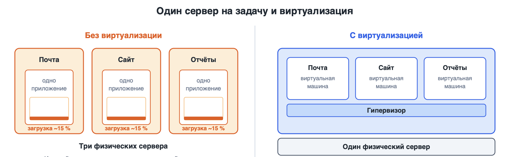
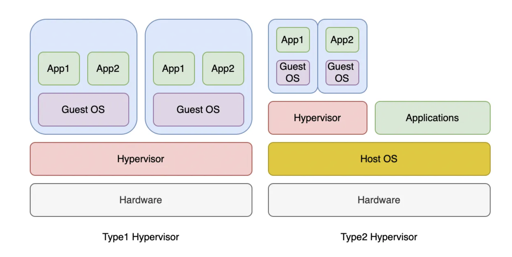
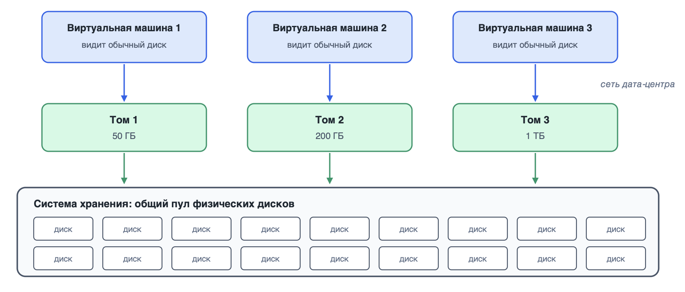
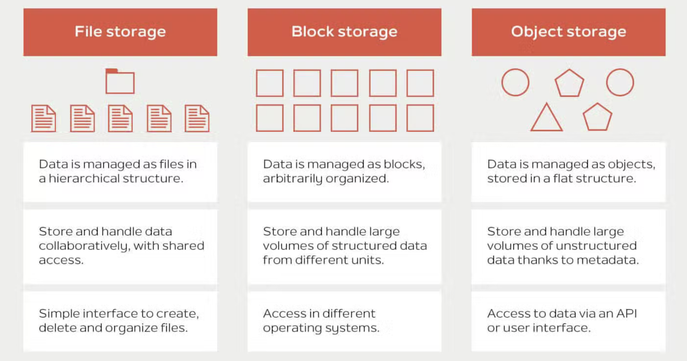
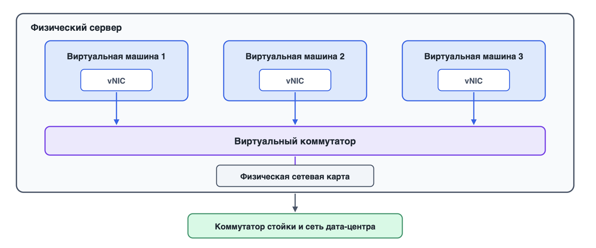
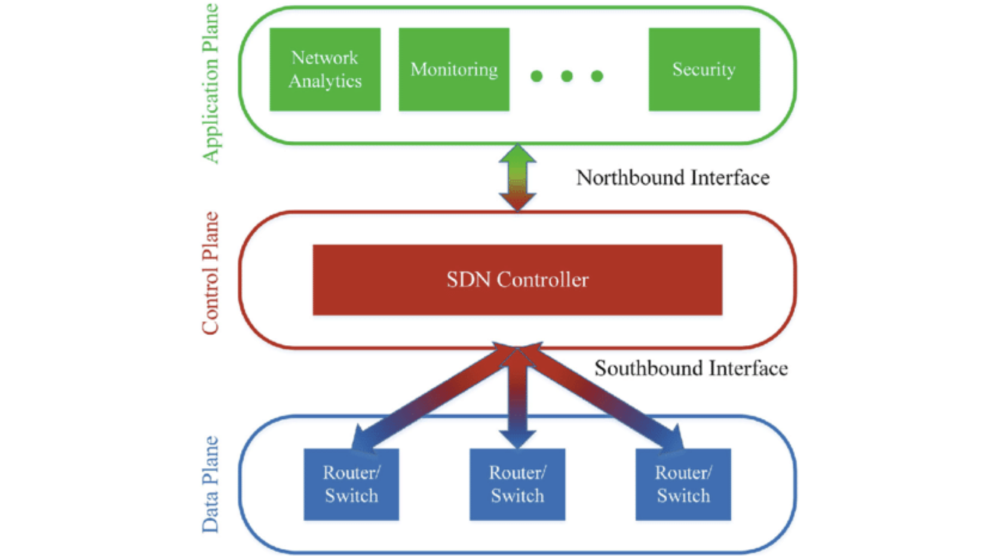
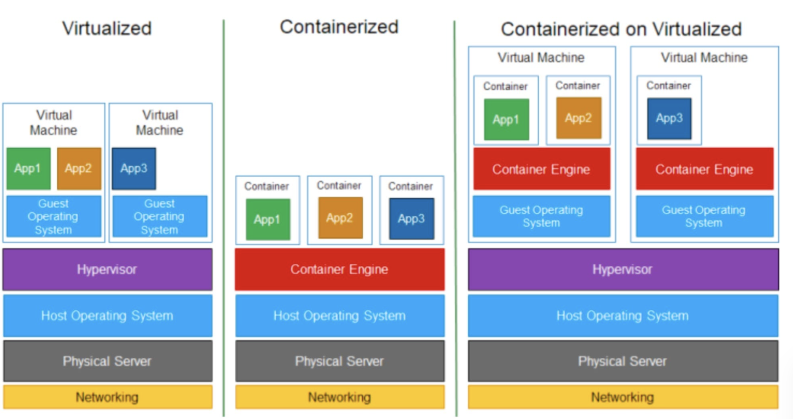

# Архитектура облачных систем и основы виртуализации

<i>
Прошло несколько недель. Октябрь, автобус номер шесть, окраина города, где заканчиваются жилые кварталы и начинаются склады. Эмма и Джон ехали с пары и смотрели в мутное окно.

– Смотри, - Джон постучал пальцем по стеклу. - Вон то здание.

Здание было скучное: серая коробка без единого окна, за забором ряд серебристых ящиков, чуть дальше что-то похожее на цистерну. Из стены торчали решётки, и даже сквозь стекло автобуса было слышно ровное гудение.

– Похоже на фабрику, - сказала Эмма.

– Это дата-центр. Внутри тысячи серверов. То самое облако, о котором мы говорили тогда на крыше.

Эмма помолчала полминуты.

– Подожди. Ты сказал, что облака будут везде. А оно, получается, вот здесь? В этой коробке у дороги?

– Ну... да, - Джон почесал затылок. - Здесь и ещё в нескольких сотнях таких коробок по всему миру.

– А что там гудит?

– Вентиляторы. Серверы греются, их нужно охлаждать. Говорят, на охлаждение уходит едва ли не столько же электричества, сколько на сами вычисления.

Вечером в общежитии Джон открыл ноутбук, что-то поставил и развернул экран к Эмме. На экране, в обычном окне, работал ещё один компьютер. Со своим рабочим столом, своими папками, своей загрузкой.

– Это что? - спросила Эмма.

– Компьютер внутри компьютера. Он думает, что у него есть свой процессор и свой диск. А на самом деле я ему их одолжил.

– И сколько таких можно?

– На моём ноутбуке два, может быть три. А на тех серверах в серой коробке, наверное, десятки.

Эмма смотрела на окно внутри окна и понимала, что теперь ей придётся разобраться сразу в двух вещах: что стоит в том здании у дороги и каким образом один компьютер притворяется многими.
</i>

## Содержание

- [Архитектура облачных систем и основы виртуализации](#архитектура-облачных-систем-и-основы-виртуализации)
  - [Содержание](#содержание)
  - [Вопросы для самопроверки](#вопросы-для-самопроверки)
  - [Результаты обучения](#результаты-обучения)
  - [Ретроспектива](#ретроспектива)
  - [Дата-центр: что находится за словом "облако"](#дата-центр-что-находится-за-словом-облако)
    - [Что такое дата-центр](#что-такое-дата-центр)
    - [Стойка, юнит и машинный зал](#стойка-юнит-и-машинный-зал)
    - [Электропитание](#электропитание)
    - [Охлаждение](#охлаждение)
    - [Сеть дата-центра](#сеть-дата-центра)
    - [Физическая безопасность и мониторинг](#физическая-безопасность-и-мониторинг)
  - [Основы виртуализации](#основы-виртуализации)
    - [Проблема неэффективного использования серверов](#проблема-неэффективного-использования-серверов)
    - [Что делает виртуализация](#что-делает-виртуализация)
    - [Хост и гость](#хост-и-гость)
    - [Что виртуализация дала облаку](#что-виртуализация-дала-облаку)
  - [Гипервизор](#гипервизор)
    - [Что делает гипервизор](#что-делает-гипервизор)
    - [Сравнение типов](#сравнение-типов)
    - [Полная виртуализация и паравиртуализация](#полная-виртуализация-и-паравиртуализация)
  - [Виртуализация вычислительных ресурсов](#виртуализация-вычислительных-ресурсов)
    - [Виртуальный процессор](#виртуальный-процессор)
    - [Виртуальная память](#виртуальная-память)
    - [Виртуальный диск](#виртуальный-диск)
    - [Оверподписка (Overcommitment)](#оверподписка-overcommitment)
    - [Накладные расходы виртуализации](#накладные-расходы-виртуализации)
  - [Виртуализация хранилища](#виртуализация-хранилища)
    - [Что такое виртуализация хранения](#что-такое-виртуализация-хранения)
    - [На чём построена виртуализация хранения](#на-чём-построена-виртуализация-хранения)
    - [Типы облачных хранилищ](#типы-облачных-хранилищ)
  - [Виртуализация сети](#виртуализация-сети)
    - [Задача: одна сетевая карта на десять машин](#задача-одна-сетевая-карта-на-десять-машин)
    - [Виртуальный адаптер и виртуальный коммутатор](#виртуальный-адаптер-и-виртуальный-коммутатор)
    - [Как разделяют сети разных клиентов](#как-разделяют-сети-разных-клиентов)
    - [Software-defined networking (SDN)](#software-defined-networking-sdn)
  - [Контейнеры и их роль в облаке](#контейнеры-и-их-роль-в-облаке)
    - [Проблема "дорогих" виртуальных машин](#проблема-дорогих-виртуальных-машин)
    - [Что такое контейнер](#что-такое-контейнер)
    - [Как устроена изоляция: namespaces и cgroups](#как-устроена-изоляция-namespaces-и-cgroups)
    - [Образ контейнера](#образ-контейнера)
    - [Чего контейнер не даёт](#чего-контейнер-не-даёт)
    - [Сравнение контейнеров и виртуальных машин](#сравнение-контейнеров-и-виртуальных-машин)
  - [Резюме](#резюме)
  - [Библиография](#библиография)

## Вопросы для самопроверки

1. Почему в дата-центре на охлаждение уходит заметная доля всей потребляемой энергии?
2. Что произойдёт с виртуальными машинами, если гипервизор выделит клиентам больше виртуальных процессоров, чем есть физических ядер?
3. Чем гипервизор первого типа отличается от гипервизора второго типа и почему в дата-центрах используют первый?
4. Что видит операционная система внутри виртуальной машины, когда обращается к своему диску?
5. Зачем внутри одного физического сервера нужен программный коммутатор?
6. Что такое накладные расходы виртуализации и откуда они берутся?
7. Почему контейнер запускается за доли секунды, а виртуальная машина за десятки секунд?
8. Почему провайдеры не размещают контейнеры разных клиентов на одном ядре операционной системы?

## Результаты обучения

После изучения этой лекции вы сможете:

- Перечислить основные подсистемы дата-центра и объяснить назначение каждой.
- Объяснить, какую задачу решает виртуализация и почему без неё облачная модель не работает.
- Сравнить гипервизоры первого и второго типа и выбрать подходящий для заданной ситуации.
- Объяснить, как физические процессор, память и диск превращаются в виртуальные.
- Описать, как устроена сеть внутри физического сервера и зачем нужны виртуальные коммутаторы.
- Оценить накладные расходы виртуализации и назвать способы их уменьшения.
- Сравнить виртуальные машины и контейнеры по уровню изоляции, скорости запуска и области применения.

## Ретроспектива

В первой лекции мы выяснили, что облако это модель, а не оборудование. Мы разобрали пять признаков облачной услуги и договорились, что главный из них это самообслуживание: ресурс выдаётся за минуты, без переговоров и без человека на другой стороне.

Но за этой минутой что-то происходит. Где-то стоит настоящий сервер, у него настоящий процессор, диски и сетевая карта. Кто-то отрезал от него кусок и отдал вам. Эта лекция о том, как именно это делается.

Мы пойдём сверху вниз. Сначала посмотрим на здание, в котором стоят серверы, и разберём, из каких подсистем оно состоит. Затем перейдём к главной технологии, без которой облако было бы невозможно: к виртуализации. Разберём, что такое гипервизор и какие гипервизоры бывают, как один процессор превращается в десяток виртуальных, как делятся диски и сеть и сколько всё это стоит с точки зрения производительности. В конце познакомимся с контейнерами, вторым способом делить один компьютер между многими задачами, и сравним оба подхода.

## Дата-центр: что находится за словом "облако"

### Что такое дата-центр

Когда вы нажимаете кнопку "Создать" в веб-интерфейсе провайдера, где-то в мире включается процесс на настоящем оборудовании. Это оборудование стоит не в подсобке и не под столом. Оно стоит в специально построенном здании.

**Дата-центр (data center), или центр обработки данных** - здание или помещение, специально оборудованное для размещения серверов, систем хранения и сетевого оборудования, с непрерывным электропитанием, охлаждением и контролем доступа.

Разговор о дата-центре нужен не для общего развития. Почти все свойства облака, о которых говорилось в первой главе, объясняются устройством этого здания. Эластичность возможна потому, что в зале стоит запас свободных серверов. Оплата по счётчику возможна потому, что провайдер измеряет потребление на уровне отдельного процесса. А отказоустойчивость, о которой мы будем говорить дальше, начинается с двух независимых вводов электропитания.

### Стойка, юнит и машинный зал

Серверы в дата-центре не лежат на полках. Они устанавливаются в **стойку (rack)** - металлический шкаф стандартной ширины, в который оборудование вставляется горизонтальными слоями.

Высота оборудования измеряется в юнитах. **Юнит (unit, U)** - стандартная единица высоты монтируемого оборудования, около 4,4 см. Обычный сервер занимает один или два юнита, а полноразмерная стойка вмещает несколько десятков юнитов.

Стойки выстраиваются в ряды, ряды образуют **машинный зал** - основное помещение дата-центра.

### Электропитание

Сервер перестаёт работать через долю секунды после исчезновения напряжения. Поэтому питание в дата-центре организовано так, чтобы напряжение не исчезало никогда.

Цепочка обычно выглядит так:

1. Один или несколько независимых вводов от городской электросети.
2. **Источники бесперебойного питания (ИБП)** - батареи, которые удерживают нагрузку в момент пропадания напряжения. Они рассчитаны на минуты, а не на часы.
3. Дизельные или газовые генераторы, которые запускаются за эти минуты и дальше питают здание сколько потребуется.
4. Распределительные щиты, которые доводят питание до каждой стойки, обычно по двум независимым линиям.

### Охлаждение

Вся энергия, которую потребляет сервер, в итоге превращается в тепло. Зал с тысячами серверов без охлаждения нагрелся бы до отказа оборудования за считанные минуты. Именно эти вентиляторы и слышали Эмма с Джоном из автобуса.

Классическое решение это разделение потоков воздуха. Стойки ставят рядами лицом к лицу и спиной к спине. Между "лицами" получается **холодный коридор**, куда подаётся охлаждённый воздух. Серверы засасывают его спереди и выбрасывают нагретый воздух назад, в **горячий коридор**, откуда его забирает система кондиционирования.

Насколько экономно устроен дата-центр, показывает отношение всей потребляемой зданием энергии к энергии, которая уходит непосредственно на вычисления. Этот показатель называют **PUE (power usage effectiveness)**. Если бы вся энергия доставалась серверам, он был бы равен единице. На практике часть уходит на охлаждение и освещение, поэтому значение всегда больше. Чем оно ближе к единице, тем эффективнее объект, и у крупного дата-центра оно заметно лучше, чем у серверной комнаты в офисе[^1].

> [!NOTE]
> На охлаждение приходится значительная часть всей энергии дата-центра. Поэтому крупные операторы строят объекты в холодном климате или рядом с дешёвыми источниками энергии. Это не забота об экологии, а прямая экономика: чем меньше энергии уходит на охлаждение, тем дешевле обходится каждый час работы виртуальной машины.

### Сеть дата-центра

Сеть внутри дата-центра строится уровнями. В каждой стойке стоит свой коммутатор, к которому короткими кабелями подключены все серверы этой стойки. Такие коммутаторы называют **коммутаторами уровня стойки (top-of-rack)**.

Коммутаторы стоек соединяются с коммутаторами следующего уровня, а те с самыми мощными коммутаторами, через которые дата-центр выходит наружу, в интернет.

Важная особенность: значительная часть трафика в дата-центре идёт не наружу, а между серверами внутри здания. Веб-сервер обращается к базе данных, база данных к системе хранения, система резервного копирования читает и то и другое. Поэтому внутренняя сеть проектируется быстрой и с запасом.

### Физическая безопасность и мониторинг

В дата-центре есть контроль доступа, видеонаблюдение и системы пожаротушения, которые не заливают оборудование водой. Отдельная система непрерывно следит за температурой, влажностью, состоянием питания, загрузкой серверов и работой дисков.

Для нас важен один вывод. Когда мы говорим, что в облачной модели провайдер отвечает за физическую инфраструктуру, речь идёт именно об этом списке: питание, охлаждение, сеть, охрана, замена сгоревших дисков. Это и есть та часть модели разделённой ответственности, которая лежит на стороне провайдера.

## Основы виртуализации

Теперь спустимся внутрь стойки, к отдельному серверу.

### Проблема неэффективного использования серверов

Долгое время в организациях действовало простое правило: одна задача, один сервер. Почтовая система на своей машине, сайт на своей, отчёты на своей.

Такое правило появилось не от глупости. Если поставить два приложения на одну машину, они начинают мешать друг другу:

- конфликтуют версии библиотек,
- одно приложение съедает всю память,
- сбой одного роняет всё вместе с операционной системой.

Разделить их проще всего физически.

Но у этого правила есть цена, которую мы уже считали в первой главе:

- каждый сервер покупается под пиковую нагрузку своей задачи, а работает большую часть времени почти вхолостую;
- свободные ресурсы есть, но воспользоваться ими нельзя: они заперты внутри чужих серверов.

В типичной серверной комнате можно было увидеть десяток машин с загрузкой процессора в несколько процентов и при этом полное отсутствие места под новую задачу, потому что новая задача требует нового сервера.

### Что делает виртуализация

**Виртуализация (virtualization)** - технология, которая позволяет программно разделить один физический компьютер на несколько независимых виртуальных, каждый из которых работает так, как будто он отдельная машина.

**Виртуальная машина (virtual machine, VM)** - программно созданный компьютер со своим процессором, памятью, диском и сетевым адаптером, на котором устанавливается собственная операционная система.

Ключевое слово здесь "_как будто_". Операционная система внутри виртуальной машины не знает, что она виртуальная. Она видит процессор, обращается к диску, настраивает сеть и ведёт себя ровно так же, как на обычном компьютере.

_2.1. Один сервер на задачу и виртуализация._

На рисунке 2.1 слева показана традиционная схема: три задачи, три сервера, каждый загружен на несколько процентов. Справа те же три задачи работают как три виртуальные машины на одном физическом сервере.

### Хост и гость

В виртуализации различают два ключевых понятия: хост и гость.

**Хост (host)** - физический сервер, на котором всё это работает.

**Гость (guest)** - виртуальная машина и её операционная система.

Разделять их важно потому, что у хоста и гостя разные операционные системы, разные диски и разные сетевые настройки, хотя работают они на одном железе.

### Что виртуализация дала облаку

Виртуализация дала облаку несколько ключевых преимуществ:

- _Скорость выдачи_. Создать виртуальную машину это скопировать файл образа и запустить процесс. Это занимает секунды, а не недели. Без этого невозможно самообслуживание по требованию.
- _Изоляция_. Виртуализация не даёт одной виртуальной машине читать память другой. Именно это делает возможной мультиарендность, о которой шла речь в первой лекции.
- _Переносимость_. Виртуальная машина не привязана к конкретному железу. Её можно перенести на другой физический сервер, иногда даже без остановки. Такая операция называется **живой миграцией (live migration)** и позволяет провайдеру обслуживать оборудование, не выключая клиентские машины.
- _Снимки состояния_. Состояние виртуальной машины можно сохранить целиком и вернуться к нему позже. Это делает возможным и резервное копирование, и быстрое создание одинаковых машин из готового образа.
- _Стандартизация_. Клиенту не нужно знать, какой именно сервер ему достался. Он выбирает тип машины из каталога, и получает предсказуемый набор ресурсов.

> [!IMPORTANT]
> Виртуализация не является облаком и не делает инфраструктуру облачной сама по себе. Организация может виртуализировать все свои серверы и по-прежнему выдавать виртуальные машины по заявке за две недели. Виртуализация это техническая основа, на которой облачная модель становится возможной, но не более того.

## Гипервизор

### Что делает гипервизор

**Гипервизор (hypervisor)** - программа, которая создаёт виртуальные машины, распределяет между ними ресурсы физического сервера и следит, чтобы они не мешали друг другу.

Это главное действующее лицо всей лекции, поэтому разберём его отдельно и подробно.

Работу гипервизора удобно представлять как работу диспетчера. _Гостевые системы_ постоянно обращаются к оборудованию: одна хочет процессорное время, другая записывает данные на диск, третья отправляет пакет в сеть. Гипервизор принимает эти обращения и:

- решает, чьё обслужить сейчас,
- выдаёт каждому ровно тот кусок ресурса, который ему положен,
- следит, чтобы никто не залез в чужую память.

Гипервизоры делятся на два типа по тому, где именно они работают.

**Гипервизор типа 1 (bare-metal hypervisor)** - гипервизор, который устанавливается непосредственно на физический сервер и сам выполняет роль операционной системы для виртуальных машин. _Примеры_: VMware ESXi, Microsoft Hyper-V, Xen.

Между оборудованием и гипервизором нет ничего лишнего, и это даёт две вещи сразу:

- выше производительность, потому что меньше промежуточных слоёв,
- меньше поверхности для атаки, потому что в системе нет полноценной операционной системы с браузером и офисными программами.

Поэтому в дата-центрах используют именно первый тип.

**Гипервизор типа 2 (hosted hypervisor)** - гипервизор, который работает как обычная программа внутри уже установленной операционной системы. _Примеры_: VirtualBox, VMware Workstation.

Вы запускаете его на своём ноутбуке так же, как запускаете текстовый редактор. Он просит у операционной системы память и процессорное время и раздаёт их виртуальным машинам.

Плата за удобство это лишний слой. Каждое обращение гостевой системы к диску проходит сначала через гипервизор, потом через операционную систему хоста, и только потом достигает устройства.

### Сравнение типов

| Признак             | Тип 1                           | Тип 2                                     |
| ------------------- | ------------------------------- | ----------------------------------------- |
| Где работает        | Прямо на оборудовании           | Поверх операционной системы хоста         |
| Производительность  | Выше                            | Ниже из-за лишнего слоя                   |
| Сложность установки | Требует выделенного сервера     | Устанавливается как обычная программа     |
| Типичное применение | Дата-центры, облачные платформы | Рабочие компьютеры, лаборатории, обучение |

_2.2. Гипервизор 1 типа и 2 типа_

### Полная виртуализация и паравиртуализация

Есть ещё одно деление, с которым вы столкнётесь в документации.

**Полная виртуализация (full virtualization)** - подход, при котором гостевая операционная система не знает, что работает в виртуальной машине, и обращается к виртуальному оборудованию как к настоящему.

**Паравиртуализация (paravirtualization)** - подход, при котором гостевая операционная система знает, что она виртуальная, и обращается к гипервизору напрямую через специальный интерфейс.

Разница в удобстве и скорости. _При полной виртуализации_ подходит любая гостевая система и менять её не нужно, но гипервизору приходится изображать настоящие устройства, а это отнимает время. _При паравиртуализации_ изображать ничего не надо, гостевая система прямо говорит, что ей требуется, зато в неё нужно поставить специальные драйверы.

На практике используют смешанный вариант: процессор и память виртуализуют полностью, а для дисков и сети ставят в гостевую систему паравиртуальные драйверы, потому что именно там разница в скорости заметнее всего.

## Виртуализация вычислительных ресурсов

Теперь разберём, что происходит с каждым видом ресурса по отдельности.

### Виртуальный процессор

**vCPU (virtual CPU)** - виртуальный процессор, который гипервизор предоставляет виртуальной машине.

Здесь легко ошибиться. vCPU это не отдельный физический процессор и не половина процессора. Это право получать процессорное время. Гипервизор ведёт очередь: он поочерёдно даёт каждому виртуальному процессору поработать на реальном ядре в течение короткого промежутка, затем переключается на следующий.

### Виртуальная память

Оперативная память делится похожим образом. Гостевая система считает, что ей досталась память подряд, одним куском, начиная с нулевого адреса. На самом деле её данные разбросаны по памяти сервера вперемешку с данными других машин.

Чтобы это работало, гипервизор ведёт таблицу: какому адресу внутри гостевой системы какой настоящий адрес соответствует. Каждое обращение к памяти проходит через эту таблицу. Раньше пересчёт делала программа и он обходился дорого, сейчас его выполняет сам процессор.

Гипервизор при этом следит, чтобы одна машина не могла заглянуть в память другой. _Это и есть та изоляция, на которой держится мультиарендность_.

### Виртуальный диск

**Виртуальный диск** - файл или выделенная область в системе хранения, которую гостевая операционная система видит как обычный жёсткий диск.

Гостевая система считывает и записывает данные на виртуальный диск так же, как на обычный жёсткий диск. При этом на стороне хоста это может быть обычный файл или блоки в сетевом хранилище.

Отсюда следует несколько практических вещей. Виртуальный диск можно скопировать целиком и получить точную копию машины. Его можно увеличить, не открывая сервер. Его можно отключить от одной машины и подключить к другой. В облаке диски обычно вообще не находятся внутри того же сервера, что и виртуальная машина: они лежат в отдельной системе хранения и подключаются по сети. Именно поэтому машину можно удалить, а диск с данными сохранить.

### Оверподписка (Overcommitment)

Одной из ключевых особенностей виртуализации в облаке является возможность оверподписки ресурсов.

**Оверподписка (overcommitment)** - ситуация, когда провайдер выделяет виртуальным машинам суммарно больше ресурсов, чем физически есть на сервере.

Схема работает по той же причине, по которой работает вся облачная экономика: клиенты не выходят на пик одновременно. Пока средняя загрузка машин остаётся невысокой, каждая получает процессор тогда, когда он ей нужен.

> [!WARNING]
>
> Если несколько машин на одном сервере одновременно выйдут на пиковую нагрузку, ресурсов на всех не хватит. Виртуальные машины не остановятся, но начнут ждать очереди на процессор и работать заметно медленнее. Для клиента это выглядит как непонятное замедление приложения без всякой видимой причины. Провайдеры ограничивают степень оверподписки и следят за загрузкой серверов, но полностью исключить такую ситуацию нельзя.

### Накладные расходы виртуализации

За удобство приходится платить производительностью.

**Накладные расходы виртуализации (overhead)** - потери производительности и ресурсов из-за того, что между приложением и оборудованием находится дополнительный слой.

Складываются они из трёх источников:

- _Работа самого гипервизора_. Он занимает память и процессорное время, чтобы вести очереди, таблицы памяти и виртуальные коммутаторы.
- _Копии операционных систем_. На сервере работает десять виртуальных машин, значит в памяти лежит десять ядер и десять наборов системных служб, даже если полезной работы мало.
- _Обращения к устройствам_. Запрос к диску или сетевой карте проходит через лишний слой. Если программа в основном считает, потеря почти незаметна. Если она много читает и пишет, потеря становится заметной[^3].

Есть и отдельный эффект, который прямо следует из того, что сервер общий. **Шумный сосед (noisy neighbour)** - ситуация, когда одна виртуальная машина создаёт такую нагрузку, что соседние машины на том же сервере начинают работать медленнее. Вы ничего не меняли, ваше приложение не виновато, а замедление реальное.

Уменьшают накладные расходы так: работу с сетью и дисками перекладывают с процессора сервера на отдельные платы, сделанные специально для этого, а сам гипервизор делают как можно проще. Так устроена, например, платформа Nitro в AWS[^4].

## Виртуализация хранилища

С дисками поступают так же, как с процессором и памятью: физические устройства объединяют в общую кучу, а пользователю выдают ровно столько места, сколько он попросил.

### Что такое виртуализация хранения

**Виртуализация хранения (storage virtualization)** - объединение физических устройств хранения в единый логический пул, из которого пользователям выдаются виртуальные диски нужного размера.

Пользователь видит одно хранилище нужного объёма и не знает, на скольких и на каких именно дисках лежат его данные. Более того, один виртуальный диск может быть физически размазан по нескольким дискам и даже нескольким серверам дата-центра.

Пример. Облачное хранилище состоит из десятков дисковых шкафов, а вам оно выдаёт один диск на 100 гигабайт. Где именно лягут ваши блоки, решает система. Она же может перекладывать данные с места на место и делать дополнительные копии, а вы этого не видите.

_2.3. Виртуализация хранения_

Представьте большой склад, заставленный коробками. Без виртуализации вам пришлось бы помнить, в какой именно коробке лежит ваша вещь. С виртуализацией появляется кладовщик с учётной системой: "Скажи, сколько места тебе нужно и как быстро ты хочешь его получать, а куда положить, я решу сам". Для вас склад превращается в одно большое пространство.

Обратите внимание, что диски виртуальной машины при этом обычно не находятся внутри того сервера, где она работает. Они лежат в отдельной системе хранения и подключаются по сети дата-центра. Именно поэтому машину можно удалить, а диск с данными оставить, или перенести машину на другой сервер, не трогая данные.

### На чём построена виртуализация хранения

Виртуализация хранения не одна технология, а несколько, работающих вместе.

- _SAN (Storage Area Network)_ и _NAS (Network Attached Storage)_ - это способы предоставлять хранилище по сети. В SAN сервер видит удалённое хранилище как обычный диск. В NAS - как сетевую папку.
- _RAID и распределённые файловые системы_ позволяют объединять несколько дисков в одно хранилище и хранить данные с запасом. Поэтому поломка одного диска не обязательно приводит к потере данных.
- _Программно-определяемое хранилище (SDS)_ - управление хранилищем выполняется программно и не зависит от конкретного оборудования. Такое хранилище можно собрать из обычных серверов и дисков и управлять им централизованно. Идея похожа на SDN, о котором пойдёт речь дальше.

### Типы облачных хранилищ

В облаках есть разные сервисы хранения, использующие виртуализацию:

- _Блочное хранилище (block storage)_. Данные разбиваются на блоки и выдаются в виде виртуального диска. Вы сами размечаете его и создаёте файловую систему, как на обычном жёстком диске.
- _Файловое хранилище (file storage)_. Доступ идёт через сетевую файловую систему. Несколько серверов могут работать с одним хранилищем одновременно, что удобно для совместной работы.
- _Объектное хранилище (object storage)_. Данные хранятся как объекты с уникальными именами. Папок и файловой системы нет, вы кладёте файл целиком и получаете его по имени.

_2.4. Типы хранилищ_

## Виртуализация сети

Виртуальная машина без сети бесполезна. Значит, сеть тоже нужно уметь делить.

### Задача: одна сетевая карта на десять машин

Представьте физический сервер, на котором работают десять виртуальных машин восьми разных клиентов. Сетевых карт у сервера одна или две. Нужно, чтобы:

- у каждой машины был свой сетевой адрес;
- машины одного клиента общались между собой;
- машины разных клиентов друг друга не видели.

Перекладыванием кабелей это не решить. Значит, сеть внутри сервера нужно построить программно.

### Виртуальный адаптер и виртуальный коммутатор

**Виртуальный сетевой адаптер (vNIC)** - программно созданная сетевая карта, которую видит гостевая операционная система.

Для гостевой системы это обычный сетевой интерфейс со своим адресом. Она не знает, что карты на самом деле нет.

**Виртуальный коммутатор (virtual switch)** - программный коммутатор внутри гипервизора, который соединяет виртуальные адаптеры между собой и с физической сетевой картой сервера.

_2.5. Виртуальная сеть внутри физического сервера_

### Как разделяют сети разных клиентов

Одного коммутатора мало: нужно, чтобы клиенты не видели трафик друг друга.

Самый известный способ вы уже встречали в курсе сетей. **VLAN (virtual LAN)** - способ разделить одну физическую сеть на несколько логических.

Технология довольно банальная и простая: каждый кадр сети получает некоторую метку, например "VLAN 10" или "VLAN 20". Коммутатор внутри сервера смотрит на метку и решает, куда отправить кадр. В результате трафик одного клиента не смешивается с трафиком другого, хотя все они используют одну физическую сетевую карту.

У VLAN есть ограничение: разных номеров всего около четырёх тысяч. Для крупного облака, где клиентов гораздо больше, этого не хватает, и нужен другой способ разделения.

**Оверлейная сеть (overlay network)** - виртуальная сеть, построенная поверх физической: пакет клиента упаковывают внутрь обычного пакета дата-центра, а на принимающем сервере распаковывают.

Физическая сеть дата-центра работает как почта, а оверлей это конверт. Почта видит только конверт и его адрес, а что внутри, её не касается. Поэтому машины двух разных клиентов могут иметь одинаковые адреса и не мешать друг другу: они лежат в разных конвертах [^2].

### Software-defined networking (SDN)

Виртуальных коммутаторов в дата-центре тысячи, и настраивать каждый вручную невозможно.

В обычной сети каждый коммутатор устроен так: он сам решает, куда отправить пакет, и сам его отправляет. Пока устройств десяток, это удобно. Когда их тысячи, изменить одно правило сразу везде становится очень трудно.

**Software-Defined Networking (SDN)** - подход, при котором решения о работе сети принимает отдельная программа, а сетевые устройства только выполняют её указания.

_2.6. Software-defined networking (SDN)_

Работу сети делят на две части[^8]:

- _Плоскость управления (control plane)_. Решает, куда какой пакет должен идти. В SDN её выносят в отдельную программу, которую называют _контроллером_.
- _Плоскость данных (data plane)_. Просто передаёт пакеты по уже полученным правилам. Это сами коммутаторы.

Выглядит это так:

1. На коммутатор приходит пакет, для которого у него нет правила.
2. Коммутатор спрашивает контроллер.
3. Контроллер отвечает правилом вида "пакеты с такого-то адреса отправлять на такой-то порт".
4. Коммутатор запоминает правило и дальше работает сам, больше не спрашивая.

Можно провести аналогию со светофорами: в обычном городе каждый светофор переключается сам и видит только свой перекрёсток. SDN это единый пульт управления всеми светофорами города: он видит пробки целиком и перенастраивает режимы сразу везде.

Для облака это означает главное: когда клиент нажимает кнопку и создаёт сеть, контроллер сам раздаёт нужные правила всем задействованным устройствам. Ни один человек к оборудованию не подходит.

Сам клиент всей этой механики не видит. Он видит другое: возможность создать собственную сеть, задать в ней диапазон адресов, разбить её на подсети и описать правила доступа. Понятия при этом остаются теми же, что и в курсе компьютерных сетей: адреса, маски подсетей, порты. Облако не придумало новую сетевую модель, оно сделало привычную модель программно управляемой.

## Контейнеры и их роль в облаке

### Проблема "дорогих" виртуальных машин

Виртуальная машина изолирует хорошо, но дорого. Если вам нужно запустить двадцать небольших сервисов, придётся поднять двадцать операционных систем. Каждая займёт память, каждую придётся обновлять, каждая будет стартовать десятки секунд.

Есть и вторая проблема, знакомая любому, кто передавал свой код другому человеку. Приложение отлично работает на компьютере разработчика и не запускается на сервере, потому что там другая версия библиотеки. Фраза "у меня всё работает" стала профессиональной шуткой именно из-за этого.

Оба вопроса решает одна идея: упаковать приложение вместе со всем, что ему нужно для работы, но не тащить с собой целую операционную систему.

### Что такое контейнер

**Контейнер (container)** - изолированная среда выполнения, в которой приложение работает вместе со своими библиотеками и настройками, используя ядро операционной системы хоста совместно с другими контейнерами.

Ключевое отличие от виртуальной машины именно в последних словах. У виртуальной машины своё ядро, а у контейнера своего ядра нет: он пользуется общим ядром хоста. Полный образ операционной системы ему не нужен.

Отсюда все его свойства. Контейнер по сути обычный процесс операционной системы, только сильно ограниченный в том, что он видит и сколько может потребить. Поэтому он занимает мало памяти, ведь копии ядра нет, и запускается за доли секунды, ведь запускать нужно только само приложение.

Самый распространённый инструмент для работы с контейнерами это платформа _Docker_, появившаяся в 2013 году и фактически задавшая нынешний стандарт. Docker упростил создание, распространение и запуск контейнеров, и после него контейнеры быстро разошлись по индустрии.

Виртуальные машины и контейнеры при этом не соперничают. Чаще всего контейнеры запускают внутри виртуальных машин и получают оба преимущества сразу: гипервизор отделяет клиентов друг от друга, а контейнеры разделяют сервисы одного клиента. Такую схему называют контейнеризацией поверх виртуализации.

_2.7. Сравнение архитектур: виртуализированная среда, контейнеризированная среда и контейнеризация поверх виртуализации_

### Как устроена изоляция: namespaces и cgroups

Изоляция контейнеров держится на двух механизмах ядра Linux.

**Пространства имён (namespaces)** - механизм, который ограничивает то, что процесс видит: свой набор процессов, свою файловую систему, свои сетевые интерфейсы, своё имя хоста[^5].

Контейнер запускается в собственном пространстве имён. Внутри он видит себя единственным процессом с номером 1 и не знает о существовании других контейнеров и самого хоста.

**Контрольные группы (cgroups)** - механизм, который ограничивает то, сколько ресурсов процесс может потребить: процессорное время, память, скорость обращения к диску[^6].

Если виртуальную машину ограничивает гипервизор снаружи, то контейнер ограничивает ядро операционной системы изнутри. Оба механизма существуют в Linux сами по себе, а программы для работы с контейнерами лишь удобно ими управляют.

### Образ контейнера

Для работы с контейнерами вводится понятие **образ контейнера** (container image).

**Образ контейнера** - шаблон, из которого запускаются контейнеры. Он включает всё необходимое: саму программу, её библиотеки и зависимости, системные утилиты, настройки окружения. Например, образ может содержать веб-сервер Nginx с определённой конфигурацией и набором модулей.

Аналогия простая: образ это рецепт, а контейнер это блюдо, приготовленное по нему. Из одного образа можно запустить сколько угодно одинаковых контейнеров, так же как по одному рецепту можно приготовить много порций.

Образ обычно состоит из _нескольких слоёв_. Внизу базовый слой с минимальной операционной системой, без ядра, но с основными библиотеками. Сверху слой с библиотеками вашего приложения, ещё выше слой с самим приложением. Каждый слой это просто набор файлов. Такая структура позволяет переиспользовать части образов: если у десяти образов один и тот же базовый слой, на диске он хранится один раз.

Запомнить стоит одно: образ содержит всё, кроме ядра. Ядро контейнер берёт у хоста, когда запускается.

Отсюда и решение проблемы, с которой начинался раздел. Образ можно запустить везде, где есть среда выполнения контейнеров: на ноутбуке разработчика, на сервере в дата-центре, в облаке. Приложение будет работать одинаково, потому что везёт с собой ровно то окружение, в котором его тестировали. Фраза "у меня работало" перестаёт быть аргументом.

Готовые образы хранятся в **реестрах образов (container registries)** - хранилищах, откуда их можно скачивать. Самый известный публичный реестр это Docker Hub, где лежат тысячи готовых образов, собственные реестры есть и у облачных провайдеров.

Реестры бывают _публичные_ и _приватные_. Из публичного вы берёте готовый образ, например официальный образ Nginx. В приватном компания держит образы собственных приложений, чтобы они не были доступны посторонним.

### Чего контейнер не даёт

> [!IMPORTANT]
> Контейнеры изолируют слабее виртуальных машин, потому что ядро операционной системы у них общее. Уязвимость в ядре потенциально затрагивает все контейнеры на сервере сразу. Именно поэтому облачные провайдеры не размещают контейнеры разных клиентов на одном ядре: контейнеры каждого клиента работают внутри выделенной ему виртуальной машины[^7].

Стоит помнить и о том, что контейнер сам по себе не является средством безопасности. Он ограничивает то, что процесс видит, но настроить его небезопасно вполне возможно, и тогда изоляция перестаёт работать.

### Сравнение контейнеров и виртуальных машин

Соберём различия в одну таблицу.

| Признак                       | Виртуальная машина                 | Контейнер                             |
| ----------------------------- | ---------------------------------- | ------------------------------------- |
| Ядро операционной системы     | Своё у каждой машины               | Общее для всех контейнеров            |
| Уровень изоляции              | Сильный, на уровне оборудования    | Слабее, на уровне ядра                |
| Время запуска                 | Десятки секунд                     | Доли секунды                          |
| Расход памяти                 | Гигабайты, включая ядро            | Мегабайты, только приложение          |
| Размер образа                 | Гигабайты                          | Десятки и сотни мегабайт              |
| Какие системы можно запускать | Любые, в том числе Windows и Linux | Только те, что работают на ядре хоста |
| Типичный масштаб              | Десятки машин на сервер            | Сотни контейнеров на сервер           |

Правильный вопрос здесь не "что лучше", а "что подходит для этой задачи". Виртуальная машина уместна, когда нужна другая операционная система, чем на хосте, когда требуется сильная изоляция между разными клиентами или когда переносится готовая система, которую не хотят переписывать. Контейнер уместен, когда сервисов много и они небольшие, когда важна скорость запуска и когда приложение нужно одинаково запускать в разных окружениях.

## Резюме

- Дата-центр это здание с независимым электропитанием, охлаждением, многоуровневой сетью и контролем доступа. Именно эта часть инфраструктуры лежит на стороне провайдера в модели разделённой ответственности.
- Показатель PUE показывает, какая доля энергии дата-центра уходит непосредственно на вычисления, а какая на его обслуживание.
- Виртуализация позволяет программно разделить один физический сервер на несколько независимых виртуальных машин, каждая со своей операционной системой.
- Без виртуализации невозможно самообслуживание по требованию: именно она позволяет выдавать и возвращать ресурсы за минуты.
- Гипервизор типа 1 работает прямо на оборудовании и применяется в дата-центрах, гипервизор типа 2 работает поверх обычной операционной системы и удобен для учёбы и разработки.
- vCPU это не отдельный физический процессор, а право получать процессорное время в общей очереди, которую ведёт гипервизор.
- Оверподписка позволяет выдать клиентам больше ресурсов, чем есть физически, потому что пики нагрузки разных машин не совпадают. Цена этого решения проявляется, когда пики всё же совпадают.
- Виртуализация хранения объединяет физические диски в общий пул и выдаёт из него виртуальные диски. Пользователь не знает, где именно лежат его данные, и это его не касается.
- Блочное хранилище даёт пустой диск, файловое общую папку, объектное хранение объектов по именам. Выбор зависит от того, чем вы оперируете.
- Сеть внутри сервера строится программно: виртуальные адаптеры соединяются виртуальным коммутатором, а сети разных клиентов разделяются метками или оверлейными протоколами.
- Управление облачной сетью строится по принципу SDN: решения принимает отдельный контроллер, а коммутаторы только выполняют его правила.
- Виртуализация имеет накладные расходы: работа гипервизора, копии операционных систем, потери на обращениях к устройствам и эффект шумного соседа.
- Контейнер использует общее ядро операционной системы и потому запускается за доли секунды и занимает мало памяти, но изолирует слабее виртуальной машины. В облаке контейнеры обычно работают внутри виртуальных машин.

## Библиография

[^1]: Barroso, L.A., Hölzle, U. and Ranganathan, P. (2018). _The Datacenter as a Computer: Designing Warehouse-Scale Machines_. 3rd ed. San Rafael: Morgan & Claypool.

[^2]: Mahalingam, M., Dutt, D., Duda, K., Agarwal, P., Kreeger, L., Sridhar, T., Bursell, M. and Wright, C. (2014). _Virtual eXtensible Local Area Network (VXLAN)_. RFC 7348. Internet Engineering Task Force. Available at: https://doi.org/10.17487/RFC7348

[^3]: Felter, W., Ferreira, A., Rajamony, R. and Rubio, J. (2015). An Updated Performance Comparison of Virtual Machines and Linux Containers. In: _2015 IEEE International Symposium on Performance Analysis of Systems and Software (ISPASS)_. Philadelphia, PA: IEEE, pp. 171-172. Available at: https://doi.org/10.1109/ISPASS.2015.7095802

[^4]: Amazon Web Services (2026). _AWS Nitro System_. Available at: https://aws.amazon.com/ec2/nitro/

[^5]: Linux man-pages project (2026). _namespaces(7)_. Available at: https://man7.org/linux/man-pages/man7/namespaces.7.html

[^6]: Linux man-pages project (2026). _cgroups(7)_. Available at: https://man7.org/linux/man-pages/man7/cgroups.7.html

[^7]: Souppaya, M., Morello, J. and Scarfone, K. (2017). _Application Container Security Guide_. NIST Special Publication 800-190. Gaithersburg: National Institute of Standards and Technology. Available at: https://doi.org/10.6028/NIST.SP.800-190

[^8]: Haleplidis, E., Pentikousis, K., Denazis, S., Hadi Salim, J., Meyer, D. and Koufopavlou, O. (2015). _Software-Defined Networking (SDN): Layers and Architecture Terminology_. RFC 7426. Internet Research Task Force. Available at: https://doi.org/10.17487/RFC7426
