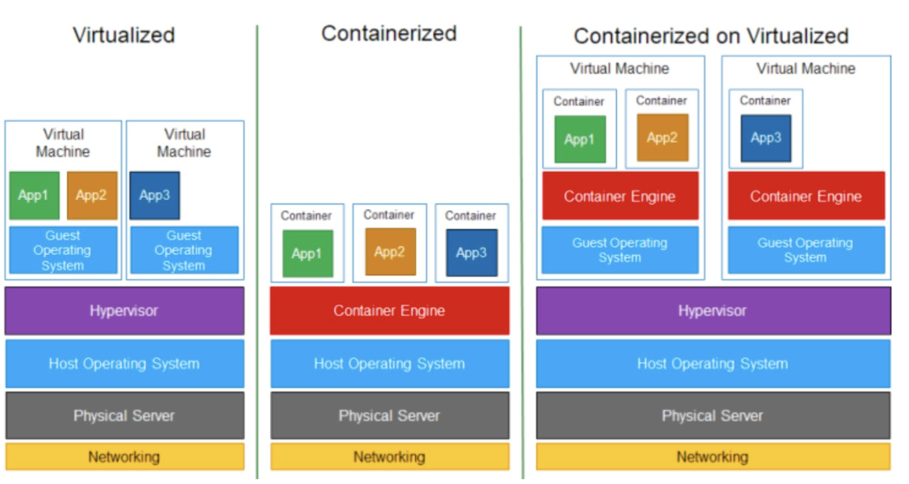

# Архитектура облачных систем и основы виртуализации

<i>
Следующим вечером Джон и Эмма сидели в пустой университетской компьютерной лаборатории. Лампы за окнами отбрасывали длинные тени по стенам, и сервер в углу мерно гудел, словно большое спящее животное. Эмма устало потянулась: сегодня они вдвоём пытались запускать на старом сервере сразу несколько проектов, и очередь из задач росла, как тени в комнате. Джон задумчиво барабанил пальцами по столу.

– Представь, – тихо сказал он, – если бы этот одинокий сервер мог раздвоиться… или даже разделиться на десяток маленьких серверов. Каждый занялся бы своей задачей – и нам не пришлось бы ждать.

Эмма усмехнулась: – Разделиться? Как клетка под микроскопом?

Джон пожал плечами: – Почему нет? Будто фокусник достаёт из шляпы бесконечный поток кроликов. Был бы один компьютер, а мы из него – бац! – сделали много. Каждому студенту – по "фантомному" компьютеру…

Он замолчал, представив эту картину. В полумраке лаборатории ему почудилось, что сервер улыбнулся огоньками индикаторов, словно услышав их. Эмма покачала головой, но в глубине души тоже ощутила странное волнение, будто в воздухе пахнет чудом. За окном медленно плыл ночной туман, и Джону привиделось, будто это сами облака опустились послушать их разговор…

Этой ночью ребята ещё не знали, что вскоре на лекции им раскроется секрет такого "волшебства" – технология, позволяющая одному физическому компьютеру превратиться в множество виртуальных. Но пока Джон и Эмма просто сидели рядом в тишине лаборатории, да мечтали о чудесах, которые творятся в облаках...
</i>

## Вопросы для самопроверки

После изучения этой главы вы сможете ответить на следующие вопросы:

1. Чем физическая архитектура облака отличается от виртуальной модели облачной архитектуры?
2. Что такое виртуализация и какие виды виртуализации используются в облачных системах?
3. В чём смысл принципов resource pooling и multi-tenancy и как они обеспечивают работу облака?
4. Что такое контейнер и чем он отличается от виртуальной машины? Какую роль играют образы контейнеров?
5. Какие существуют модели облачных сервисов (IaaS, PaaS, SaaS) и что подразумевается под концепцией XaaS ("всё как услуга")?

## Архитектура облачных систем: физическая vs виртуальная модель

Архитектуру облачных систем можно рассматривать с двух точек зрения: физической и виртуальной.

_Физическая архитектура_ - это реальные датацентры с серверами, дисковыми хранилищами и сетевым оборудованием, разбросанные по миру. Эти физические ресурсы составляют основу облака: тысячи серверов, подключённые через высокоскоростные сети, снабжённые системой питания и охлаждения. Однако, обычному пользователю облака вся эта физическая инфраструктура невидима.

Пользователь взаимодействует с _виртуальной моделью_ облачной архитектуры. Это означает, что пользователи взаимодействуют не с конкретным физическим сервером, а с абстракцией - виртуальными ресурсами. Например, когда вы запускаете сервер в облачном сервисе, на самом деле он может работать на любом из множества физически существующих серверов, но для вас он выглядит как отдельная машина, которую вы можете настроить и использовать по своему усмотрению. Проще говоря, облако - это совокупность виртуализованных вычислительных мощностей, хранилищ и сетей, которыми управляет специальное ПО. Такой набор ресурсов часто называют _"пулом"_ (от англ. pool - "пруд", "бассейн"), Пользователь запрашивает, например, сервер или хранилище через веб-интерфейс - а облако автоматически находит свободные ресурсы в своих датацентрах и “создаёт” для пользователя запрошенный виртуальный ресурс.

В виртуальной модели архитектуры ключевую роль играет слой виртуализации (о нём подробно поговорим далее). Именно он обеспечивает изоляцию и абстракцию: физические особенности серверов скрыты от пользователя - вместо этого пользователь видит только виртуальные характеристики (количество виртуальных процессоров, объём памяти, размер диска и т.д.). Такая архитектура даёт огромный выигрыш в гибкости. Например, если физический сервер выходит из строя, облако может автоматически “переключить” его виртуальные машины на другие серверы, и пользователь даже не заметит сбоя. Кроме того, виртуальная архитектура позволяет масштабировать ресурсы по запросу: если приложению вдруг нужно больше мощности, облако просто выделит дополнительные виртуальные ресурсы из пула.

Итак, _физическая архитектура облака_ - это про "железо" (hardware): реальные машины, кабели, диски. _Виртуальная архитектура_ - про "иллюзию" (software-defined): программное представление этих ресурсов, которое получает пользователь. Переход от физического к виртуальному - основа облачных технологий, потому что без этого облако не смогло бы быть эластичным и управляемым.

## Виртуализация: понятие и роль в облаке

_Виртуализация_ - это технология, позволяющая создавать абстрактные (виртуальные) версии вычислительных ресурсов, отделяя их от физической основы. В облачных системах она означает, что реальные серверы, хранилища и сети преобразуются с помощью программных средств в логические ресурсы, которыми можно гибко и эффективно управлять. Иными словами, виртуализация скрывает аппаратную часть за программным слоем: пользователь работает с виртуальными машинами и дисками, не задумываясь о том, какие конкретные процессоры или накопители используются в дата-центре.

Если без виртуализации на одном физическом сервере обычно работает только одна операционная система и приложение, то с помощью виртуализации этот один сервер можно “разрезать” на несколько _виртуальных машин_ (Virtual Machines, VM) - каждая со своей ОС, своим окружением. Каждая виртуальная машина "верит", что она - полноценный компьютер, хотя в реальности они все разделяют ресурсы одного физического сервера.

Виртуализация обеспечивает несколько ключевых преимуществ для облачных систем:

- _Эффективное использование ресурсов_. Вместо того чтобы выделять отдельный сервер под каждое приложение, которое будет использовать ресурсы не полностью, виртуализация позволяет запускать несколько виртуальных машин, которые изолируются на одном физическом сервере, максимально используя его мощность.
- _Изоляция и безопасность_. Каждая виртуальная машина изолирована. Если на одной происходит сбой или атака, это не влияет на другие. Изоляцию обеспечивает специальное программное обеспечение - гипервизор. Это как жить в многоквартирном доме: у каждого жильца своя квартира, и проблемы одного не затрагивают другого (при условии хорошей звукоизоляции и безопасности дверей).
- _Гибкость и масштабируемость_. Виртуальные ресурсы можно быстро создать, удалить, скопировать или перенести с одного физического сервера на другой, допустим если тот выходит из строя - всё это делается программно, без необходимости физического вмешательства. А если приложению нужно больше ресурсов, облако может просто выделить дополнительные ресурсы для виртуальной машины.
- _Удобство управления_. Автоматизация управления виртуальными ресурсами намного проще: администраторы пишут скрипты, которые развертывают десятки виртуальных машин по шаблону, следят за их состоянием, переносят их между узлами. Облако, наполненное виртуальными машинами, можно администрировать централизованно, не бегая к каждому серверу с отверткой.

Таким образом, виртуализация - фундаментальный кирпичик облачной модели. Недаром говорят: “облако без виртуализации - не облако, а просто аренда железа”. В классическом определении, _облако_ - это инфраструктура, где мощности абстрагированы и виртуализированы, масштабируются динамически и предоставляются множеству потребителей по запросу [^1].

## Гипервизор и виртуальные машины

Основной инструмент виртуализации - _гипервизор_ (англ. _hypervisor_). Это программный слой, который устанавливается на физический сервер или на операционную систему и берёт на себя роль управляющего ресурса: он создаёт, запускает и управляет виртуальными машинами. Он распределяет физическую память, CPU, доступ к диску между несколькими виртуальными машинами и следит, чтобы они друг другу не мешали [^1]. По сути, гипервизор - как диспетчер, решающий, какой виртуальной машине дать кусочек процессорного времени в следующий момент или сколько памяти отдать.

Существует _два типа гипервизоров_:

- _Type 1. Bare-Metal_ (ru. "голое железо"). Устанавливается прямо на аппаратное обеспечение сервера, без промежуточной ОС. Такой гипервизор работает максимально эффективно, так как имеет прямой доступ к ресурсам железа. Примеры: VMware ESXi, Microsoft Hyper-V, Xen.
- _Type 2. Hosted_. Запускается как приложение поверх обычной операционной системы. Например, VirtualBox или VMware Workstation, которые вы можете поставить на свой ноутбук. Они удобны для разработки и учебных целей, но в датацентрах используются реже из-за некоторого снижения производительности (ведь сверху ещё работает хост-ОС).

Каждая виртуальная машина работает как отдельный компьютер на _операционной системе физического компьютера_ (_Host OS_) и имеет:

- Собственную операционную систему, которая называется _гостевой ОС_ (_guest OS_). Это может быть Linux, Windows, или любая другая ОС.
- Свои виртуальные устройства: виртуальные процессоры, память, сетевые адаптеры, диски, которые эмулируются гипервизором.

Гостевая ОС не замечает подвоха и считает, что у неё свой собственный процессор и память. В этом и состоит _full virtualization (полная виртуализация)_ - гипервизор предоставляет гостю полностью эмулированное аппаратное окружение, и гость даже не подозревает, что на самом деле разделяет ресурсы с другими ВМ. В полной виртуализации гипервизор выполняет “перевод” команд гостевой ОС в команды к физическому железу.

_Рисунок 1. Типы гипервизоров_

## Resource Pooling и Multi-Tenancy

Облачные провайдеры стремятся максимально эффективно задействовать своё "железо" и одновременно обслуживать много клиентов. Именно для этого служит концепция _resource pooling_ (объединение ресурсов) и _multi-tenancy_ (многопользовательскость, букв. "многоарендность"). Данные принципы были рассмотрены в предыдущей главе,

_Resource Pooling_ означает, что все физические ресурсы объединяются провайдером в единый пул, из которого динамически выделяются виртуальные ресурсы по запросам пользователей. Пользователю не важно (и зачастую неизвестно), на каком именно сервере крутится его виртуальная машина - важно, что облако даёт необходимую мощность. Такое объединение даёт эффект “_большого котла_”: из него можно черпать столько ресурсов, сколько нужно, не заботясь о конкретной печке, в которой горят угли.

_Multi-tenancy (мультиарендность)_ - это модель, при которой одним и тем же набором физического оборудования и приложений могут одновременно пользоваться несколько независимых потребителей (тенантов, от англ. tenant - арендатор). Каждый клиент облака как бы “снимает квартиру” в большом доме: он получает свой виртуальный участок ресурсов, изолированный от других, но физически эти ресурсы могут находиться на тех же серверах. _Мультиарендность делает облако экономически выгодным и масштабным_. Провайдер, обслуживая сотни клиентов на единой платформе, достигает эффекта масштаба: большое совместное облако проще поддерживать, дешевле в расчёте на одного пользователя, чем сотни отдельных маленьких инфраструктур. При этом каждый потребитель ощущает себя единственным: его данные и программы изолированы программно (через механизмы виртуализации, настройки доступа и т.д.).

## Виртуализация сети (SDN) и хранилищ

Виртуализация в облаках распространяется не только на вычислительные машины, но и на _сети_ и _хранилища данных_. Чтобы облачная архитектура была полной, нужно абстрагировать и эти компоненты, сделав их гибкими, программно управляемыми.

### Виртуализация сети и Software-Defined Networking

_Виртуализация сети_ - это подход, при котором сеть (или несколько сетей) представляются в виде программно управляемых логических объектов, независимо от физической топологии. По сути, так же как гипервизор делит сервер на виртуальные машины, сеть можно _“разделить” на несколько виртуальных сетей_ или, наоборот, _объединить географически разнесённые узлы_ в одну виртуальную сеть поверх интернета. Несколько виртуальных сетей могут сосуществовать на одном физическом сетевом оборудовании, не влияя друг на друга.

Простейшие примеры сетевой виртуализации известны давно: VLAN (Virtual LAN) - виртуальные локальные сети, которые позволяют логически сегментировать сеть на уровне коммутаторов и VPN (Virtual Private Network) - защищённые каналы поверх общедоступных сетей. Эти технологии позволяют несколько разных сетевых сообществ пользоваться одной физической инфраструктурой, но логически быть отделёнными.

В облачных системах используется более продвинутый подход - _Software-Defined Networking (SDN)_. Это концепция, при которой управление сетью отделено от физического оборудования и реализуется программно. В SDN центральный контроллер программно управляет поведением всей сети: маршрутизацией, политиками безопасности, качеством обслуживания. Администраторы могут динамически создавать, изменять и удалять виртуальные сети, настраивать правила трафика и обеспечивать изоляцию между клиентами облака.

SDN разделяет сеть на два основных слоя:

- _Control Plane_ (плоскость управления) - отвечает за принятие решений о маршрутизации и политике. В SDN этот слой централизован и реализуется контроллером.
- _Data Plane_ (плоскость данных) - отвечает за фактическую передачу пакетов. Это физические устройства (коммутаторы, маршрутизаторы), которые выполняют указания контроллера.

В обычной сети каждый маршрутизатор имеет и _control plane_, и _data plane_ внутри себя: он сам принимает решения и сам же пересылает пакеты. В SDN же делается хитрость: плоскость управления выносят в отдельный централизованный компонент - контроллер. А коммутаторы и маршрутизаторы становятся “глупыми” устройствами, которые просто выполняют команды контроллера. Это позволяет программно управлять всей сетью из одного места, быстро адаптироваться к изменениям и создавать сложные сетевые топологии по запросу.

Один из простых сценариев работы SDN:

1. Приходит пакет на маршрутизатор (*Data Plane*).
2. Маршрутизатор не знает, куда его отправить, и обращается к контроллеру.
3. Контроллер (_Control Plane_) анализирует (например, политика безопасности) и отправляет правило: «все пакеты с IP X перенаправлять на порт Y».
4. Маршрутизатор записывает это правило в свою таблицу и дальше обрабатывает трафик локально, без постоянных запросов.

_Рисунок 2. Типовая SDN-архитектура_

Это дает _гибкость и программируемость_. Администратор, имея SDN-контроллер, может программно задать правила для всей сети сразу (“на весь этот сегмент ограничить полосу до 100 Мбит/с для видео” или “все пакеты от IP X направлять через шлюз Y”). Контроллер сам распространит эти правила на оборудование. Можно динамически перенастраивать маршруты, балансировать нагрузку, включать сложные политики - и всё программно из одного места. В больших облачных датацентрах SDN позволяет эффективно управлять тысячами сетевых устройств как единым целым [^3].

В контексте облака SDN помогает _легко создавать и управлять виртуальными сетями_. Например, когда вы в облаке определяете сетевые политики (маршруты, ACL, балансировку нагрузки), под капотом SDN-контроллеры конфигурируют все задействованные узлы. Также SDN тесно связан с понятием NFV (_Network Functions Virtualization_) - переноса сетевых функций (маршрутизаторов, файрволов, балансировщиков) на программные модули, часто запускаемые на обычных серверах. Вместо дорогого сетевого “железа” провайдер использует виртуальные сетевые функции, которые можно запускать как сервисы в облаке.

Приведём простую аналогию: традиционная сеть - это город, где каждый светофор сам по себе настроен и переключается, глядя только на свою перекрёсток. SDN - это как если бы появился центральный пульт управления всеми светофорами города, куда стекается информация о пробках по всем улицам, и который может в реальном времени перенастраивать режимы светофоров по всему городу, оптимизируя трафик сразу глобально.

Главное понимать, что _виртуализация сети в облаке означает, что вы можете получать сетевые ресурсы (“виртуальные маршрутизаторы”, “подсети”, “брандмауэры”) так же, как получаете виртуальные серверы_. А SDN - это технология, которая делает сети гибкими и управляемыми программно, что идеально сочетается с идеологией облака. С помощью SDN облачные провайдеры добиваются высокой автоматизации сети, изолированности клиентов друг от друга на уровне трафика и возможности быстро строить сложные сетевые топологии по запросу.

### Виртуализация хранилищ

_Виртуализация хранения_ (_Storage Virtualization_) означает, что физические устройства хранения (жесткие диски, SSD, ленточные библиотеки и т.д.) объединяются в единый логический пул, из которого пользователям предоставляются виртуальные тома, хранилища или файлы. Пользователь видит как бы одно большое хранилище или нужное количество дискового пространства, не зная, на скольких и каких именно физических дисках лежат его данные. То есть возможно такое, что один виртуальный диск пользователя физически распределён по нескольким серверам и дискам в датацентре.

Облачный сервис хранения данных может состоять из десятков дисковых шкафов, но вам он выдаёт один виртуальный диск на 100 ГБ. Где именно на этих шкафах будут лежать ваши блоки - решает система, она же может переставлять данные, дублировать их для отказоустойчивости и т.д., а вы этого не видите. _Storage virtualization_ скрывает от пользователя сложность подсистемы хранения, предоставляя ему простой интерфейс: хранилище определённого объёма, с определённой скоростью ввода-вывода.

_Рисунок 3. Виртуализация хранилища: физические диски объединяются через слой виртуализации в единый пул, из которого серверам предоставляются виртуальные тома_

Для достижения виртуализации хранения используются разные технологии:

- _SAN (Storage Area Network)_ и _NAS (Network Attached Storage)_. Это сетевые технологии, которые позволяют объединять дисковые устройства в общую сеть хранения. SAN работает на уровне блоков (как локальный диск), а NAS - на уровне файлов (как файловый сервер).
- _RAID-массивы и распределённые файловые системы_. Они позволяют объединять несколько физических дисков в один логический том, обеспечивая избыточность и производительность.
- _Программно-определяемое хранилище (SDS)_. Это концепция, при которой управление хранилищем отделено от физического оборудования и реализуется программно. SDS позволяет создавать виртуальные хранилища поверх обычных серверов с дисками, управляя ими централизованно.

По определению, “_Storage virtualization is a technique that abstracts physical storage resources into a virtualized pool, streamlining management and provisioning_” [^4]. То есть виртуализация хранения упрощает управление дисковыми ресурсами, позволяя быстро выделять, изменять и масштабировать хранилища по запросу. Это повышает гибкость: администратор может добавлять новые физические диски в общий пул на ходу, и сразу увеличивается доступный объём для всех. Или, наоборот, можно разбивать один большой пул на многие тома для разных пользователей, не думая о конкретных коробках.

Представьте большой склад, заставленный коробками. Без виртуализации вам бы пришлось помнить, в какой конкретно коробке лежит ваш предмет. С виртуализацией приходит кладовщик с компьютерной системой, который говорит: “Не беспокойся, я знаю, где что лежит. Просто скажи, сколько места тебе нужно и какой скорости доступа, а я сам размещу твои вещи на полках и выдам тебе номер секции.” Для вас склад становится единым бесконечным пространством.

В облаках есть разные сервисы хранения, использующие виртуализацию:

- _Блочное хранилище_ (Block Storage). Виртуальные диски, которые можно подключать к виртуальным машинам, как обычные жёсткие диски.
- _Файловое хранилище_ (File Storage). Виртуальные файловые системы, доступные по сетевым протоколам (NFS, SMB).
- _Объектное хранилище_ (Object Storage). Хранение данных в виде объектов с уникальными идентификаторами, доступных через API. То есть вы просто сохраняете объекты (файлы) через API, а система сама решает, на каких серверах и дисках их держать, обеспечивая масштабируемость и отказоустойчивость. Разработчик оперирует только логическими сущностями (бакеты, объекты), совсем не думая о носителях.

Виртуализация хранения предоставляет преимущества в масштабируемости и доступности данных. Например, система может автоматически перемещать часто запрашиваемые данные на SSD, а менее востребованные - на HDD или ленту, не прерывая работу приложения (_archive tiering_). Также виртуализация позволяет легко создавать резервные копии, реплики и обеспечивать _отказоустойчивость_, распределяя данные по разным физическим узлам. Для пользователя же всё выглядит как один диск.

Резюмируя, _виртуализация сети и хранения - логичное продолжение общей идеи виртуализации в облаке_. Облако стремится предоставить каждому пользователю его собственную “виртуальную инфраструктуру” полностью - compute, storage, network - и для этого все слои должны быть абстрагированы от железа.

- SDN позволяет гибко управлять сетями и изолировать клиентов.
- Виртуализация хранения позволяет эффективно обращаться с данными, обеспечивая высокую надёжность и масштаб.

## Контейнеры и их роль в облаке

В последние годы в облачных системах огромную популярность получили _контейнеры_. _Контейнеры_ - это тоже технология изоляции и упаковки приложений, но более “лёгкого веса” по сравнению с традиционными ВМ.

_Контейнер_ - это изолированная среда, которая содержит всё необходимое для запуска приложения: код, библиотеки, зависимости. В отличие от виртуальной машины, контейнеры не включают в себя отдельную операционную систему. Вместо этого они используют ядро хостовой ОС, что делает их гораздо более компактными и быстрыми в запуске, но при этом они имеют собственные пространства имён для процессов, файловой системы, сети и т.д.

Контейнеры часто описывают как форму виртуализации на уровне ОС: вместо эмуляции целого железа контейнеризация изолирует приложения в пределах одной ОС, позволяя запускать несколько приложений, каждый в своём контейнере, на одном ядре.

Если _виртуальная машина - это имитация отдельного компьютера со своей ОС (гость)_, то _контейнер - это скорее “изолированный процесс” на общем ядре хоста_. Контейнеру не нужен полный образ операционной системы - он использует ядро хостовой ОС. В результате контейнер гораздо легче (ему не нужен свой kernel) и запускается мгновенно.

Один из наиболее распространённых инструментов контейнеризации - платформа _Docker_, появившаяся в 2013 году и фактически задавшая стандарт современной контейнерной эры [^5]. Docker упростил создание, распространение и запуск контейнеров, благодаря чему контейнеры завоевали мир облачных разработок.

Основные отличия контейнеров от виртуальных машин:

| Характеристика | Виртуальная машина (VM)                                                                     | Контейнер                                                                                                                                                                                                                               |
| -------------- | ------------------------------------------------------------------------------------------- | --------------------------------------------------------------------------------------------------------------------------------------------------------------------------------------------------------------------------------------- |
| Легкость       | Тяжёлые (включают ОС). Внутри ВМ вы запускаете полноценную ОС, что требует больше ресурсов. | Лёгкие (используют ядро хоста). Не содержат в себе отдельную ОС и используют ядро хоста. Согласно IBM, контейнеры “small, fast, and portable” именно потому, что не везут с собой каждую раз гостевую ОС, а пользуются функциями хоста. |
| Время запуска  | Минуты (загрузка ОС). Требуется время на загрузку гостевой ОС.                              | Секунды (запуск процесса). Контейнер запускается мгновенно. Это позволяет быстрее масштабировать приложения и уменьшать время простоя.                                                                                                  |
| Плотность      | Меньшая плотность на одном хосте из-за больших требований к ресурсам.                       | Высокая плотность: на одном сервере можно запустить сотни контейнеров, так как они легче и используют общие ресурсы.                                                                                                                    |
| Изоляция       | Полная изоляция (каждая ВМ - отдельный компьютер).                                          | Изоляция на уровне процессов и файловой системы, но общий доступ к ядру хоста. Если ядро хоста "упадёт", то все контейнеры, использующие это ядро, также прекратят работу.                                                              |

В целом безопасность контейнеров исторически считалась чуть ниже, чем у VM, из-за разделяемого ядра - однако современные механизмы (AppArmor, SELinux, seccomp) позволяют достичь очень высокой изоляции и в контейнерах.

В техническом плане, _контейнеры полагаются на функциональность ядра ОС_: _namespace_ (пространства имён) и _cgroups_ (контроль групп ресурсов) в Linux.

- _Namespaces_ создают изоляцию (каждый контейнер видит свой набор процессов, свою файловую систему, свою сеть с “виртуальными” интерфейсами).
- _Cgroups_ ограничивают, сколько CPU/RAM/Disk может съесть каждый контейнер, чтобы они не задавили друг друга.

Таким образом, контейнеры достигают цели, похожей на виртуализацию, - изолировать среды, - но более лёгким способом. Это не значит, что контейнеры лучше во всем. Иногда нужна жёсткая изоляция ВМ, особенно если запускаются разные операционные системы или требуется строгая безопасность уровня ядра. Но для множества приложений, особенно микросервисной архитектуры, контейнеры стали стандартом.

В современных облачных системах широко используется модель _Container-as-a-Service (CaaS)_, которая предоставляет возможность запускать контейнеры без необходимости управлять серверами вручную. Пользователь лишь описывает, какие контейнеры требуется развернуть, а облако автоматически распределяет их по доступным физическим ресурсам. Такой подход нередко называют "_containerization on virtualization_", поскольку контейнеры могут запускаться внутри виртуальных машин, объединяя преимущества обоих методов: гибкость и изоляцию виртуализации с лёгкостью и скоростью контейнеров.

_Рисунок 4. Сравнение архитектур: виртуализированная среда, контейнеризированная среда и контейнеризация поверх виртуализации._

## Образы контейнеров

Для работы с контейнерами вводится понятие *образ контейнера (container image)*.

*Образ контейнер*а - это, по сути, шаблон, из которого запускаются контейнеры. Он включает в себя все необходимые файлы: саму программу, её библиотеки, зависимости, системные утилиты, настройки окружения - всё, чтобы приложение могло запуститься в контейнере и работать одинаково где угодно. Наприер, образ может содержать веб-сервер Nginx с определённой конфигурацией и набором модулей.

Можно провести аналогию: если *контейнер - запущенный процесс (как работающая программа)*, то образ контейнера - это исполняемый файл, из которого этот процесс стартует. *Более бытовая аналогия*: образ - это рецепт или слепок, а контейнер - блюдо, приготовленное по этому рецепту. Из одного образа вы можете “настругать” множество идентичных контейнеров, так же как по одному рецепту можно приготовить много порций блюда.

Образ контейнера обычно состоит из ряда слоёв. Например, у вас есть базовый слой с операционной системой (минимальный, без ядра, но с некоторыми библиотеками), сверху слой с нужными библиотеками вашего приложения, сверху слой с самим приложением. Каждый слой - набор файлов. Такая слоистая структура позволяет эффективно переиспользовать части образов: если у десяти образов один и тот же базовый слой Ubuntu, то он хранится на диске единожды и шарится между ними.

По определению, “*container image is a fixed, static file that includes executable code to run an isolated process. Image is composed of system libraries, system tools and other settings required to run an application on a container platform*. То есть образ содержит всё, кроме ядра: программы, библиотеки, конфиги - но когда из него делается контейнер, контейнер задействует ядро хостовой ОС.

Если приложение упаковано в образ, этот образ можно запустить в любом месте, где есть контейнерный runtime (будь то ваш ноутбук, сервер в датацентре или облако) – и приложение будет работать совершенно одинаково. Уже нет проблемы “*на моём компьютере работало, а на сервере – нет*”, потому что образ содержит именно то окружение, в котором приложение тестировалось.

Образы хранятся в _реестрах образов_ (_container registries_) - специальных хранилищах, откуда их можно скачивать. Например,

- _Docker Hub_. Популярный публичный реестр с тысячами готовых образов.
- _Google Container Registry (GCR)_. Реестр от Google Cloud.
- _Amazon Elastic Container Registry (ECR)_. Реестр от AWS.
- _GitHub Container Registry_. Реестр от GitHub.

Я могу использовать публичные образы (например, официальный образ Nginx из Docker Hub) или создавать свои собственные образы с нужным ПО и загружать их в приватный реестр, чтобы использовать в своих проектах.

Образы контейнеров *можно сравнить с шаблонами виртуальных машин*, но образы обычно намного компактнее и специфичнее под приложение. Если образ VM часто включает целую ОС и может использоваться для разных целей, то контейнерный образ, как правило, предназначен под одно приложение или сервис.

Под капотом *образ - это файл*, хранящий файловую систему контейнера и метаданные (например, какую команду выполнять при старте контейнера). Когда контейнер запускается, Docker (или другая контейнерная платформа) монтирует этот образ как файловую систему и запускает процесс внутри.

Стоит упомянуть, что образы бывают *публичные* и *приватные*. Компании часто держат свои *приватные* реестры с образами, где хранят собственные приложения. Есть также официальные образы (например, от создателей Linux-дистрибутивов или популярных СУБД), которые регулярно обновляются и проверяются на безопасность.

## Модели облачных сервисов

### Основные модели облачных сервисов: IaaS, PaaS, SaaS

В прошлой главе мы подробно рассмотрели основные модели облачных сервисов: _IaaS (Infrastructure as a Service)_, _PaaS (Platform as a Service)_ и _SaaS (Software as a Service)_. Напомним кратко:

- *IaaS (Infrastructure as a Service)*. Инфраструктура как услуга.
- *PaaS (Platform as a Service)*. Платформа как услуга.
- *SaaS (Software as a Service)*. Программное обеспечение как услуга.

Эти модели различаются степенью ответственности между провайдером и пользователем, а также уровнем абстракции.

*IaaS* даёт вам “кирпичи” для строительства (серверы, сети) - стройте что хотите. *PaaS* даёт уже “фундамент и каркас дома” - вам остаётся только завезти мебель (свой код). *SaaS* - это уже полностью построенный и обставленный “дом”, заходи и живи (просто начните пользоваться приложением).

### Концепция XaaS (Anything as a Service)

Современные облачные провайдеры идут дальше классических моделей и предлагают концепцию _XaaS (Anything as a Service)_ ("все как услуга"),- практически любой компонент ИТ или даже бизнес-процесс может быть предоставлен “по подписке” через облако. Если три упомянутых модели - это базовые уровни, то XaaS - это расширение этой идеи на всё, что можно виртуализировать и автоматизировать. Сегодня существует множество сервисов “*as a Service*”, которые расшифровываются различными буквами вместо X:

- _DBaaS (Database as a Service)_. База данных как услуга. Пользователи получают доступ к управляемым базам данных (SQL, NoSQL) без необходимости администрировать серверы и СУБД.
- _FaaS (Function as a Service)_. Функция как услуга. Позволяет запускать отдельные функции или куски кода в ответ на события, без управления серверами.
- _STaaS (Storage as a Service)_. Хранение как услуга. Предоставление дискового пространства и файловых систем по запросу.
- _DaaS (Desktop as a Service)_. Рабочий стол как услуга - виртуальные рабочие столы, доступные из любого места.
- _CaaS (Container as a Service)_. Контейнеры как услуга - управление и оркестрация контейнеров в облаке.
- _NaaS (Network as a Service)_. Сеть как услуга - виртуальные сети, VPN, балансировщики нагрузки.
- _AIaaS (AI as a Service)_. Искусственный интеллект как услуга - доступ к моделям машинного обучения и ИИ через API.
- _MLaaS (Machine Learning as a Service)_. Машинное обучение как услуга - платформы для разработки, обучения и развертывания моделей машинного обучения.
- _GaaS (Gaming as a Service)_. Игры как услуга - облачные игровые платформы, позволяющие играть в требовательные игры на слабом устройстве.

По сути, XaaS это термин, отражающий тренд: *всё, что можно, будет вынесено в облако и предоставляться по подписке с гибкой оплатой*. Для бизнеса модель “as a Service” привлекательна тем, что нет крупных разовых затрат (_CAPEX_), а есть операционные (_OPEX_) - плати по мере потребления.

Например, раньше компания строила свой центр обработки данных, покупала серверы, хранилища, сетевое оборудование (традиционный подход). Потом пришёл IaaS: “не покупай сервер - арендуй виртуальный”. Затем: “не ставь СУБД на сервер - вот тебе DBaaS, нажми кнопку и получи базу”. Дальше: “не пиши свой движок аналитики - вот тебе Machine Learning as a Service, загрузи данные и получи модель”. В пределе, “Anything as a Service” - когда абсолютно все ИТ-решения можно взять как готовый сервис.

Конечно, на практике не всё можно и нужно выносить, но спектр XaaS-услуг растёт. Появляются даже экзотические “... as a Service”. Например, есть понятие BaaS (Backend as a Service) - облачные бекенды для мобильных приложений, где разработчик использует готовый облачный бэкенд с аутентификацией, базой данных, хранилищем и т.д., не заботясь о серверной части.

> Для нас важно сейчас понять общее направление: облака расширяются по вертикали (от инфраструктуры к софту) и по горизонтали (охватывая новые домены). 

Таким образом, XaaS - своего рода обобщение, которое удобно использовать, говоря о современных облачных экосистемах. Для архитектора облачных систем понимание модели XaaS важно, чтобы мыслить масштабно: не ограничиваться виртуалками, а видеть, что любая часть архитектуры может прийти “как услуга” от внешнего провайдера. 

[^1]: _What's the difference between cloud and virtualization?_. redhat.com [online]. Available at: https://www.redhat.com/en/topics/cloud-computing/cloud-vs-virtualization [Accessed 15.05.2025]
[^2]: _What is Software Defined Networking (SDN)?_. geeksforgeeks.org [online]. Available at: https://www.geeksforgeeks.org/computer-networks/software-defined-networking/ [Accessed 15.05.2025]
[^3]: _What is SDN?_. ibm.com [online]. Available at: https://www.ibm.com/think/topics/sdn [Accessed 15.05.2025]
[^4]: _Storage Virtualization in Cloud Computing_. knowledgehut.com [online]. Available at: https://www.knowledgehut.com/blog/cloud-computing/storage-virtualization [Accessed 15.05.2025]
[^5]: _Everything you need to know to understand the containers versus VMs debate and why containers are growing in popularity._. ibm.com [online]. Available at: https://www.ibm.com/think/topics/containers-vs-vms [Accessed 15.05.2025]
[^6]: _XaaS (anything as a service)_. ibm.com [online]. Available at: https://www.ibm.com/think/topics/xaas [Accessed 15.05.2025]
[^7]: _What is a container image?_. techtarget.com [online]. Available at: https://www.techtarget.com/searchitoperations/definition/container-image [Accessed 15.05.2025]