# Введение в Amazon Web Services (AWS). Глобальная архитектура AWS

<i>
Поздним вечером Джон и Эмма снова сидели в лаборатории. Сервер в углу гудел, но теперь он уже не казался им центром вселенной. После разговора о виртуализации они начали понимать: один компьютер — лишь крошечный остров, а впереди целый континент возможностей.

– Но ведь мы не можем сами построить сотни дата-центров, – заметила Эмма.

– И не нужно, – ответил Джон. – Это уже сделал Amazon Web Services.

На экране ноутбука загорелась карта с точками по всему миру.

– Это регионы и зоны доступности. Каждый регион — как город дата-центров, а зоны внутри — независимые кварталы. Если один выйдет из строя, другие продолжат работу.

Эмма всмотрелась в карту: – Значит, мы можем выбрать регион ближе к нашим пользователям и строить системы, которые выдержат сбой целого дата-центра?

– Да, – кивнул Джон. – А ещё у каждого есть аккаунт AWS — как собственная квартира, куда никто не войдёт без ключа. Ключи мы раздаём через IAM, и важно давать каждому ровно те права, что нужны.

Эмма усмехнулась: – Как если бы библиотекарю дали доступ только к книгам, а сторожу — только к замкам.

– И ещё одно, – добавил Джон. – Чтобы не разориться, AWS предлагает Free Tier и оповещения о бюджете. Так мы сможем учиться и экспериментировать, не боясь счёта в конце месяца.

Сервер в углу всё так же мерно шумел, но для них он уже стал символом прошлого. Впереди открывался новый мир — глобальная сеть AWS, где ресурсы распределены по регионам и зонам, а доступ к ним управляется аккуратно и безопасно.
</i>

## Вопросы для самопроверки

После изучения этой главы вы сможете ответить на следующие вопросы:

1. Что такое AWS и какие основные категории сервисов она предлагает?
2. Чем отличаются регионы и зоны доступности (AZ), и как их использование влияет на задержки и отказоустойчивость?
3. В чём разница между региональными и глобальными сервисами AWS? 
4. Что такое AWS аккаунт и как он обеспечивает изоляцию ресурсов? Зачем нужна организация нескольких аккаунтов?
5. Какие сущности включает сервис IAM (пользователь, группа, роль, политика) и зачем нужен root-пользователь?
6. Что такое AWS Free Tier и как работает модель on-demand billing? Чем отличаются Reserved и Spot Instances?
7. Как с помощью AWS Budgets и Zero-Spend Alerts можно контролировать расходы?
8. Какие существуют способы взаимодействия с AWS (Management Console, CLI, SDK) и для каких задач каждый из них подходит?

## Почему мы изучаем AWS и как он связан с курсом Cloud Computing?

Вы помните, что в лекции по введению в облачные вычисления мы обсуждали, что такое облачные вычисления и какие у них характеристики. Мы также упомянули, что облачные вычисления предоставляют доступ к вычислительным ресурсам по требованию через интернет с оплатой по мере использования. AWS - это крупнейший и наиболее широко используемый облачный провайдер в мире, предлагающий широкий спектр услуг, которые позволяют организациям быстро и эффективно развертывать и управлять своими приложениями и инфраструктурой, не инвестируя в физическое оборудование.

## Обзор платформы AWS

*Amazon Web Services (AWS)* - это крупнейшая облачная платформа, предлагающая более 200 различных сервисов для вычислений, хранения данных, сетей, баз данных и многого другого, доступных из дата-центров по всему миру [^1]. Идея облака AWS состоит в том, что разработчики, компании и организации могут использовать готовую ИТ-инфраструктуру по запросу (on-demand), оплачивая только потребленные ресурсы (модель pay-as-you-go) вместо того, чтобы закупать и содержать собственные серверы и оборудование. Миллионы клиентов - от стартапов до правительственных учреждений - используют AWS, чтобы снизить затраты, быстрее внедрять инновации и легко масштабировать свои приложения [^2].

Главные преимущества облачной платформы AWS:

- _Гибкость и масштабируемость_. Вы можете запустить сотни серверов за минуты и так же быстро их остановить, адаптируясь под нагрузку.
- _Экономия_. Отсутствуют капитальные затраты на оборудование: вы платите только за ресурсы, которые действительно использовали (например, за часы работы виртуальной машины или объём хранилища).
- _Богатый выбор сервисов_. AWS предоставляет самый широкий набор функций среди облачных провайдеров, включая базовые инфраструктурные сервисы (серверы, хранилища, базы данных) и передовые технологии (машинное обучение, IoT, аналитика и др.).
- _Глобальная доступность и надежность_. Инфраструктура AWS распределена по всему миру, что позволяет размещать приложения ближе к пользователям и добиваться высокой отказоустойчивости.

### Основные категории сервисов AWS

AWS охватывает практически все области ИТ и включает сервисы в различных категориях. Ниже перечислены основные категории AWS с примерами сервисов [^2]:

| Категория | Описание | Примеры сервисов |
|-----------|----------|------------------|
| *Compute* (Вычисления) | Сервисы для запуска приложений и обработки данных. Они позволяют запускать ваш код или виртуальные машины в облаке. | Compute (Вычисления): Сервисы для запуска приложений и обработки данных. Примеры: *Amazon EC2* (аренда виртуальных серверов), *AWS Lambda* (безсерверное выполнение кода), *Amazon ECS/EKS* (управление контейнерами) | 
| *Storage* (Хранение данных) | Сервисы для хранения файлов, резервных копий и данных. Они обеспечивают надежное хранение больших объемов данных с возможностью масштабирования. | *Amazon S3* (объектное хранилище для файлов), *Amazon EBS* (блочное хранилище для дисков EC2), *Amazon EFS*     (сетевое файловое хранилище) |
| *Database* (Базы данных) | Управляемые баз данных под различные задачи. | *Amazon RDS* (реляционные базы данных, поддержка MySQL, PostgreSQL, Oracle и др.), *Amazon DynamoDB* (NoSQL база данных ключ-значение), *Amazon Aurora* (высокопроизводительная реляционная БД от AWS) |
| *Networking & Content Delivery* (Сети и доставка контента) | Сервисы для построения изолированных сетей, маршрутизации трафика и ускорения доставки данных. Сеть AWS позволяет безопасно соединять компоненты вашей системы и обеспечивать минимальные задержки для пользователей. | *Amazon VPC* (виртуальная облачная сеть для ваших ресурсов), *Elastic Load Balancing* (распределение нагрузки между серверами), *Amazon Route 53* (глобальная DNS-служба), *Amazon CloudFront* (глобальная CDN для кеширования и быстрой доставки контента) |
| *Security & Identity* (Безопасность и идентификация) | Сервисы для управления доступом и защиты ресурсов. | *AWS IAM* (управление учетными записями и правами доступа пользователей), *AWS KMS* (управление ключами шифрования), *AWS Shield* (защита от DDoS) |
| *Analytics, ML, IoT и прочие* | AWS предлагает и специализированные сервисы для больших данных и аналитики, машинного обучения, интернета вещей и других передовых технологий. | *Amazon Redshift* (хранилище данных для аналитики), *AWS Glue* (ETL-сервис для подготовки данных), *Amazon SageMaker* (платформа для разработки и развертывания моделей машинного обучения), *AWS IoT Core* (платформа для подключения и управления устройствами IoT) |

Обилие сервисов AWS позволяет построить практически любую ИТ-систему в облаке.

## Глобальная инфраструктура AWS. Регионы и зоны доступности

### Структура глобальной инфраструктуры AWS

AWS располагает своей инфраструктурой по всему миру, разделяя ее на *регионы* и *зоны доступности*. Этот принцип глобальной архитектуры лежит в основе высокой надежности и гибкости AWS.

*AWS регион* - это физический географический регион мира (например, Восточное побережье США, Европа (Франкфурт), Азия (Сингапур)), в котором AWS располагает несколько изолированных объектов дата-центров. В каждом регионе развёрнуто по нескольку дата-центров, объединённых в отдельные *зоны доступности* (Availability Zones, AZ).

*Зона доступности* - это один или несколько независимых дата-центров внутри региона, с собственным резервным питанием, охлаждением и сетевой инфраструктурой, расположенные отдельно друг от друга. Все зоны в регионе соединены между собой высокоскоростными и дублированными каналами связи с минимальной задержкой [^4].

Ключевые свойства такой архитектуры:


- *Изоляция отказов*. Каждая зона доступности автономна - сбой в одном дата-центре (например, отключение электричества или проблема с сетью) не затрагивает другие зоны. Это позволяет строить отказоустойчивые приложения, развернув ресурсы в нескольких зонах одного региона. Например, база данных может реплицироваться на несколько AZ, чтобы пережить выход из строя одной из них.
- *Низкие задержки внутри региона*. Зоны близки географически (обычно в пределах ~100 км) и связаны быстрыми каналами, поэтому взаимодействие ресурсов внутри одного региона происходит с минимальными задержками (обычно единицы миллисекунд).
- *Независимость регионов*. Каждый регион AWS изолирован от других - ресурсы по умолчанию не реплицируются между регионами, что обеспечивает географическую независимость и повышенную устойчивость в масштабах всего мира. Сбой в одном регионе, хотя крайне маловероятен, не влияет на работу других регионов.

На 2025 год облако AWS охватывает более 37 регионов и 117+ зон доступности по всему миру (и продолжает быстро расширяться). Каждый регион имеет как минимум три зоны доступности, и AWS регулярно анонсирует запуск новых регионов в разных странах для приближения к клиентам.

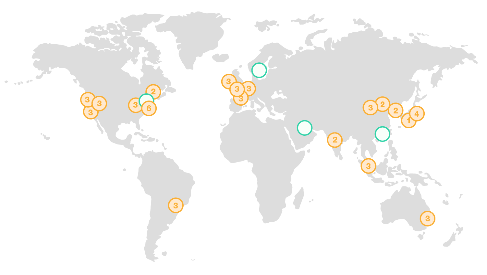

_Рисунок 1. Карта глобальной инфраструктуры AWS с указанием регионов и зон доступности_

Разработчики при развертывании приложения в AWS выбирают регион, в котором будут созданы их ресурсы. От выбора региона зависят:

- _Близость к пользователям_. Чтобы снизить сетевые задержки и обеспечить быстрый отклик приложения, обычно выбирают регион, наиболее близкий географически к конечным пользователям или к корпоративному дата-центру. Чем ближе сервер к пользователю, тем меньше времени занимают сетевые запросы. Например, для аудитории в Европе логично выбрать европейский регион (*например*, eu-central-1 во Франкфурте).
- _Соответствие законодательству и требованиям_. Данные иногда должны храниться в определенной стране или регионе из-за требований законодательства о суверенитете данных (например, GDPR в ЕС). AWS предоставляет выбор региона для соответствия таким требованиям - данные не покидают выбранный регион без явной необходимости.
- _Стоимость и доступность сервисов_. Цены AWS немного варьируются между регионами - некоторые регионы могут быть дешевле в эксплуатации, чем другие. Кроме того, не все новые сервисы сразу доступны во всех регионах: крупные, давно открытые регионы часто первыми получают новые сервисы и функции. Поэтому при планировании инфраструктуры стоит проверить, есть ли нужные сервисы в предполагаемом регионе.

### Архитектура с несколькими регионами

Хотя внутри региона вы уже можете достичь высокой надежности с помощью множественных AZ, для критичных приложений иногда реализуют *Multi-Region архитектуру*.

*Multi-Region архитектура* подразумевает использование ресурсов в нескольких географически разнесенных регионах AWS. Это защищает от катастрофического сбоя всего региона (например, стихийное бедствие). *Multi-Region* позволяет также обслуживать пользователей, разнесенных по разным континентам, из ближайших к ним регионов, сокращая задержки. Однако мульти-региональная архитектура увеличивает сложность: требует синхронизации данных между регионами и учитывания стоимости межрегионального трафика (передача данных между регионами платная) [^5].

Например, компания может держать основной сервер в регионе Восток США и резервный в регионе Запад США: в случае проблем в одном регионе DNS автоматически переключит пользователей на резервный регион (это стратегия *Disaster Recovery*). Другой пример - глобальное приложение (например, онлайн-игра) может обслуживать европейских пользователей из европейского региона, а азиатских - из азиатского, сохраняя данные в обоих (с репликацией) для локально быстрых чтений.

## Глобальные vs. региональные сервисы AWS

Большинство сервисов AWS привязаны к конкретному региону, однако некоторые работают глобально. В AWS важно понимать разницу между *региональными сервисами* и *глобальными сервисами*.

*Региональный сервис* - ресурс этого сервиса создается в определенном регионе и обычно изолирован в его пределах. Примеры: виртуальные машины, базы данных, хранилища. Все данные сервисы создаются в конкретном регионе (например, EC2 instance в `us-east-1`) и находятся именно там. Если вам нужен аналогичный ресурс в другом регионе, его надо развернуть отдельно.

*Глобальный сервис* - сервис, охватывающий сразу все регионы или использующий глобальную распределенную инфраструктуру AWS. Для таких сервисов обычно нет привязки к конкретному региону при настройке (или есть одна глобальная конфигурация на аккаунт). *Примеры*: AWS Identity and Access Management (IAM) - управляет пользователями и правами во всем аккаунте AWS.

Чтоб вам было легче ориентироваться, есть признаки данных типов сервисов.

_Признаки глобального сервиса_: 

1. Отсутствует выбор региона в консоли для данного сервиса.
2. Ресурсы сервиса доступны из любых регионов. 
3. Часто глобальные сервисы относятся *к управлению или облегчению работы распределенных систем*.

_Признаки регионального сервиса_:

1. Требуется выбрать регион при создании ресурса, и ресурс имеет привязку к этому региону.
2. Поведение сервиса изолировано в рамках региона.  

При работе в AWS вы обычно выбираете регион в верхнем правом углу консоли AWS. Если сервис глобальный, консоль может сообщить, что выбран определенный регион, но сервис все равно действует глобально. Например, IAM в консоли отображается с меткой *«Global»* - у него нет привязки к региону.

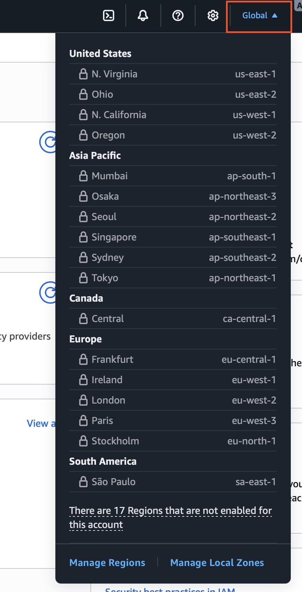

_Рисунок 2. Пример глобального сервиса AWS (IAM) в консоли_

Знание различий помогает планировать архитектуру: например, если вы создаете пользователей IAM, они сразу действуют во всех регионах вашего аккаунта. А вот запущенная в одном регионе EC2 виртуальная машина не может «переехать» в другой регион без специального копирования образов или миграции. Также учет региональности важен в расчетах стоимости: трафик внутри региона зачастую дешевле (или бесплатен) по сравнению с трафиком между регионами.

## AWS аккаунты и изоляция ресурсов

*AWS аккаунт* - это *логическая изолированная* единица в AWS, предоставляющая грань безопасности и разграничения ресурсов. Можно думать об аккаунте AWS как о полном «контейнере» для ваших облачных ресурсов: все ресурсы (виртуальные машины, базы, и проч.) существуют внутри какого-то аккаунта и изолированы от ресурсов в других аккаунтах, если не настроен специальный общий доступ.

Когда вы регистрируете новый аккаунт AWS, для вас создается отдельное пространство: по умолчанию ни один другой клиент AWS (другой аккаунт) не имеет доступа к вашим ресурсам, и наоборот. Такое разделение гарантирует высокую степень безопасности и контроля. *AWS аккаунты образуют жёсткую границу безопасности* - это рекомендованный AWS подход к изоляции разных проектов и сред (production, testing, development) друг от друга.

Организации могут иметь множество AWS аккаунтов. Для управления несколькими аккаунтами AWS предоставляет сервис *AWS Organizations*, позволяющий объединить аккаунты в иерархию, централизованно управлять политиками (например, накладывать ограничения на уровне всей организации) и включать сквозной биллинг. С помощью Organizations можно, например, создать отдельные аккаунты для каждой команды (или каждого продукта) и применять общие правила безопасности ко всем через Service Control Policies (SCP).

*Пример*: Представьте компанию с несколькими продуктами: веб-сайт и мобильное приложение. Чтобы обеспечить изоляцию, компания создает два AWS аккаунта - один для инфраструктуры веб-сайта, другой для бэкенда мобильного приложения. Даже если разработчики мобильного приложения сделают ошибку в настройках, это не даст им доступа к серверам веб-сайта, так как они в другом аккаунте. Более того, затраты считаются раздельно, что облегчает расчёт бюджета по продуктам.

Можно также использовать аккаунты для разделения сред разработки. Например, аккаунт A - для разработки и тестирования, аккаунт B - для боевого окружения (production). В тестовом аккаунте разработчики свободно экспериментируют, зная, что даже если что-то пойдет не так, продакшн не затронут.

### Управление пользователями и доступом. Использование сервиса IAM

Управление доступом и безопасностью - ключевой аспект работы с AWS. 

Первый сервис, с которым вы столкнетесь в AWS, - это *AWS Identity and Access Management (IAM)*. Это глобальный сервис управления идентификацией и доступом. IAM позволяет безопасно управлять учетными записями пользователей, их правами (разрешениями) и аутентификацией в вашем аккаунте AWS.

### IAM-пользователь

*IAM-пользователь* (IAM user) - учетная запись в вашем AWS-аккаунте, которая представляет отдельного  человека или приложение. Это как создаваемая вами учетная запись внутри AWS для сотрудника или сервиса. У каждого IAM-пользователя есть свои учетные данные: пароль для входа в веб-консоль и/или ключи доступа для программного взаимодействия с AWS через API.

По умолчанию новый IAM-пользователь не имеет никаких прав, кроме как самому менять свой пароль - все остальное ему должно быть явно разрешено политиками. Обычно IAM-пользователей заводят для сотрудников, которым нужен доступ к облаку, или для приложений, которым нужно взаимодействовать с ресурсами AWS.

### IAM-группы

*IAM-группа* (IAM groups) - логическое объединение нескольких IAM-пользователей. Группа упрощает управление правами: вы прикрепляете политики (права) к группе, и все пользователи в этой группе наследуют эти права. 

Например, можно создать группу *Developers* с доступом к определенным ресурсам, и добавить туда всех разработчиков - вместо назначения прав каждому разработчику вручную. Пользователь может состоять в нескольких группах.


### IAM-роли

*IAM-роли* (IAM roles) - особый тип идентичности в IAM, не привязанный к конкретному пользователю. Роль содержит набор прав, которые могут быть временно “примерены” каким-то субъектом (пользователем или сервисом) для выполнения определенных действий.  


Роли обычно используются в двух сценариях:

- *Для сервисов AWS*. Например, вы запускаете виртуальную машину и хотите дать ему права читать из хранилища. Вместо создания IAM-пользователя и хранения ключей на сервере, вы создаете IAM-роль с нужными правами и назначаете эту роль виртуальной машине. Под капотом, виртуальная машина, получит временные креденшиалы и будет обращаться к хранилищу с правами этой роли.
- *Для межаккаунтного доступа и федерации*. Роли позволяют одному аккаунту доверять пользователям другого аккаунта временно. Пользователь может принять роль из другого аккаунта, получив временный доступ.

### Политики IAM

_Политика (Policy)_ - документ, который определяет, *какие действия разрешены или запрещены* и на каких ресурсах. Например, "пользователю X разрешено запускать и останавливать виртуальные машины". Политики в IAM обычно записываются в формате JSON и содержат описание: кто (какая идентичность или ресурс) может совершать какие действия над какими ресурсами, при каких условиях.

Политики бывают нескольких видов:

- _identity-based_. Прикрепляются к пользователю, группе или роли и дают им права. 
- _resource-based_. Прикрепляются к ресурсу.

В большинстве случаев вы будете иметь дело с identity-based политиками IAM, назначая их пользователям/группам/ролям [^7]. Например, есть готовая политика *AdministratorAccess* - дает полный доступ ко всем ресурсам AWS, её можно прикрепить IAM-пользователю (или роли), и он станет администратором. 

Если пользователь имеет прикрепленную политику, которая разрешает действие, то при обращении в AWS API это действие будет выполнено, иначе будет отказ (если только другое правило не разрешает). *По умолчанию всё запрещено*, кроме явно разрешенного. Политики - мощный инструмент для принципа наименьших привилегий: *давайте пользователям только необходимые минимальные права*.

### Корневой пользователь (root user)

При создании AWS-аккаунта вы указываете email и пароль - это создает учетную запись владельца аккаунта, называемую *root user* (корневой пользователь). *Root-пользователь* привязан к самому аккаунту AWS и обладает неограниченными правами на все ресурсы в аккаунте по умолчанию. Это *самая привилегированная учетная запись, которую рекомендуется использовать только для самых важных действий настройки* (например, привязка банковской карты, изменение платежных настроек, первоначальная настройка безопасности).

В повседневной работе *небезопасно входить под root*: лучше создать отдельного IAM-пользователя с администраторскими правами и выполнять задачи от его имени. Root же хранить в безопасности (включить MFA, сложный пароль).

_Пример использования IAM_. Допустим, у вас в команде 3 разработчика. Вы создаете IAM-пользователей: *alice*, *bob*, *carol*. Вы: 

1. Создаете IAM-группу *Developers* и даете ей политику, разрешающую управление определенным набором ресурсов. 
2. Добавляете всех трех пользователей в группу *Developers*.

Все пользователи теперь имеют одинаковые права, определенные группой. Если придет новый разработчик, вы просто заводите для него IAM-пользователя и добавляете в группу - он автоматически получит те же доступы.

## Основы биллинга AWS. Free Tier и модели оплаты

Понимание принципов оплаты в AWS поможет избежать неожиданных счетов и оптимизировать расходы. Модели ценообразования AWS отличаются от традиционного хостинга - они гибкие и зависят от потребления. Во время работы с AWS, как разработчики, скорее всего вы не будете заниматься детальным расчетом стоимости, но важно знать основы.

Сервис, который отвечает за биллинг и управление затратами, называется *AWS Billing and Cost Management*. Он позволяет отслеживать расходы, просматривать детализированные отчеты и анализировать использование ресурсов.

### AWS Free Tier. Бесплатный уровень 

*AWS Free Tier* - это программа AWS, позволяющая новым клиентам попробовать облачные сервисы бесплатно в течение ограниченного времени или объема использования. На 2025 год условия Free Tier обновились: все новые аккаунты AWS получают бонус $100 кредитов при регистрации + до $100 дополнительно за активное освоение ключевых сервисов.

Free Tier предоставляет несколько категорий бесплатного использования:

- _Кредиты $200_. При регистрации нового аккаунта вы получаете $100 кредитов на использование любых сервисов AWS в течение первых 30 дней + до $100 дополнительно за активное освоение ключевых сервисов. Эти кредиты действуют до 6 месяцев.
- _Всегда бесплатно (Always Free)_. Некоторые сервисы имеют бесплатный уровень, который действует постоянно, даже после окончания первых 6 месяцев. Например, 1 миллион запросов в месяц на AWS Lambda или 5 ГБ хранилища в Amazon S3.
- _Краткосрочные пробные периоды_. Некоторые сервисы предлагают бесплатный пробный период на 30 или 60 дней с определенными лимитами.

> Через 6 месяцев новый аккаунт переводится на Paid Plan, то есть бесплатные кредиты уже не предоставляются.

### On-Demand. Модель оплаты по требованию

*On-Demand* - основная модель оплаты AWS. Это значит, что вы оплачиваете ресурсы *помесячно, почасово или даже посекундно* в зависимости от фактического использования, без долгосрочных обязательств.

On-Demand цены тарифицируются по-разному для разных сервисов, но общий принцип: нет предоплаты, нет минимального срока - *вы можете в любой момент отключить ресурс и перестать платить за него*.

Однако за гибкость On-Demand приходится платить более высокой ставкой в длительной перспективе. Если вы знаете, что будете пользоваться ресурсом постоянно, AWS предлагает способы сэкономить, используя модель *Reserved Instances*.

### Reserved Instances. Резервирование с предоплатой

*Reserved Instances* - модель, при которой вы бронируете ресурс на длительный срок (1 или 3 года) и взамен получаете значительную скидку (до 72%).

Как это работает:

- Вы решаете, что вам нужен определенный ресурс (например, виртуальная машина) на длительный срок. Вместо оплаты On-Demand каждый час, вы можете купить Reserved Instance на 1 год для этого региона.
- При покупке вы можете выбрать опцию оплаты:
  - _Оплата всего сразу_ (All Upfront). Платите всю сумму сразу и получаете максимальную скидку.
  - _Частичная предоплата_ (Partial Upfront). Платите часть суммы сразу, остальное - помесячно.
  - _Без предоплаты_ (No Upfront). Платите помесячно, но с меньшей скидкой. Берете на себя обязательство.
- После покупки вы получаете скидку на использование этого ресурса в течение срока бронирования. Если вы используете ресурс меньше, чем зарезервировали, вы все равно платите за него.

В последнее время AWS также предлагает *Savings Plans* - более гибкую альтернативу Reserved Instances, позволяющую экономить на широком спектре ресурсов при обязательстве по ежемесячным расходам. Вы просто обязуетесь тратить `N долларов в час` на определенные ресурсы, и получаете скидку, при этом более гибко можете менять типы ресурсов. Тем не менее, идея та же: *длительное обязательство в обмен на скидку*.

> Reserved Instances и Savings Plans работают только для определенных сервисов (например, EC2, RDS) и не покрывают все ресурсы AWS.


### Spot Instances. Вычислительные ресурсы по сниженной цене

*Spot Instances* - это модель, позволяющая использовать неиспользуемые вычислительные ресурсы AWS по значительно сниженной цене (до 90% дешевле On-Demand), *но без гарантии непрерывной работы*. Такой ресурс может быть забран обратно, когда он понадобится другим клиентам (On-Demand или Reserved).

AWS может остановить ваш Spot-инстанс в любой момент, когда потребуется ресурсы для обычных покупателей. Вам дается уведомление за 2 минуты до завершения инстанса.

Spot Instances идеально подходят для задач, которые могут быть прерваны и возобновлены без потери данных, например:

- Обработка больших данных (batch processing)
- Аналитика
- Тестирование и разработка

## Практическая часть. Начальные шаги в AWS

Для работы с AWS вам необходимо будет сделать несколько первоначальных шагов:

1. Создать AWS аккаунт.
2. Настроить бюджет и оповещения о расходах, чтобы не выйти за рамки бесплатного уровня.
3. Создать IAM-пользователя с нужными правами.

### Создание AWS аккаунта

Для создания root-аккаунта выполните следующие шаги:

1. Перейдите на [https://aws.amazon.com/](https://aws.amazon.com/) и нажмите кнопку *Create Account* в правом верхнем углу.
2. Введите _Root user email address_ и _AWS account name_. Затем нажмите *Continue*. Вам придет письмо для подтверждения email.
3. Следуйте инструкциям в письме, чтобы подтвердить email и продолжить регистрацию. 
4. После подтверждения email задайте надежный пароль для root-пользователя и введите его дважды для подтверждения. Нажмите *Create Account*. 
5. Выберите _Free Plan (6 месяцев)_, чтобы получить доступ к AWS Free Tier. Для выбора плана нажмите _"Choose free plan"_.
6. Введите ваши контактные данные (имя, адрес, телефон) и выберите тип аккаунта - _Personal_ (личный). Нажмите *Agree and Continue*.
7. Введите *дополнительные данные, которые потребует AWS*. После чего ваш аккаунт будет создан.

### Вход в AWS Management Console

*AWS Management Console* - это веб-интерфейс (GUI) для управления всеми сервисами AWS через браузер. Консоль предоставляет удобный визуальный доступ к ресурсам, настройкам и биллингу вашего аккаунта. Для новичков консоль - основной способ взаимодействия с AWS, поскольку не требует знания команд или программирования.

Для входа в консоль:

1. Перейдите на [https://aws.amazon.com/](https://aws.amazon.com/) и нажмите *Sign In to the Console*.
2. На странице входа вам предложат ввести email и пароль IAM-пользователя. Если вы используете root-пользователя, то переключитесь на страницу _"Sign in using root account"_ (1).
3. Введите email, связанный с вашим AWS аккаунтом (2) и нажмите *Next*.
4. Введите пароль (3) и нажмите *Sign In*.
5. После успешного входа вы попадете на главную страницу консоли AWS, где сможете управлять своими ресурсами.

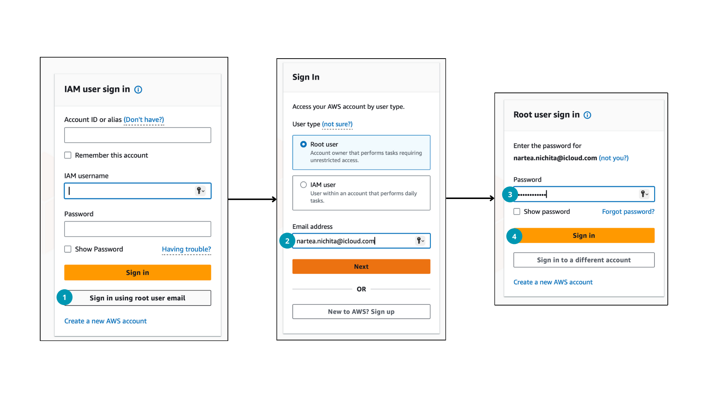

_Рисунок 7. Вход в AWS Management Console_

После входа в консоль вы увидите панель управления с обзором аккаунта, доступными сервисами.

1. Для поиска сервисов используйте строку поиска вверху (1). Введите название сервиса, например, "EC2", и выберите его из выпадающего списка.
2. Для выбора региона используйте селектор в правом верхнем углу (2). Выберите регион, в котором хотите работать с ресурсами, обычно это регион, ближайший к вашим пользователям (_например, Europe (Frankfurt)_).
3. На дэшборде консоли можно увидеть разные виджеты с информацией о ресурсах. Например, один из виджетов показывает количество кредитов Free Tier, которые вы использовали (3). Это помогает отслеживать, сколько бесплатных ресурсов вы уже израсходовали.

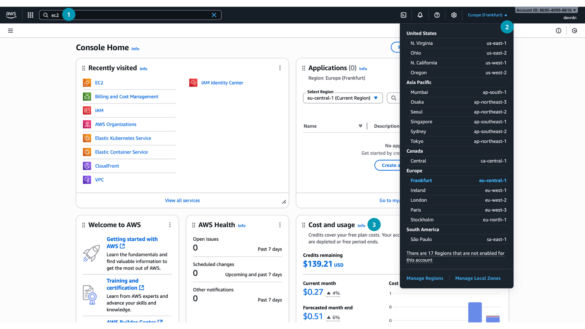

### Планирование бюджета и оповещения о расходах

После регистрации, важно настроить бюджет и оповещения о расходах, чтобы избежать неожиданных затрат. Для студентов желательно установить бюджет нулевых затрат (Zero-Spend Budget), который уведомит вас, если вы начнете использовать платные ресурсы сверх Free Tier.

*Zero-Spend Budget* (Бюджет нулевых затрат): специально для новых аккаунтов существует шаблон бюджета, который сигнализирует, если вы начали генерировать какой-либо платный расход сверх Free Tier. По сути, он уведомляет, когда ваши траты превышают $0 (то есть появилась хоть какая-то платная нагрузка) или когда использование превысило бесплатные лимиты AWS Free. Это помогает новичкам не пропустить момент, когда они начинают платить.

Для настройки бюджета нулевых затрат:

1. Зайдите в консоль AWS.
2. Перейдите в сервис *Billing and Cost Management*.
   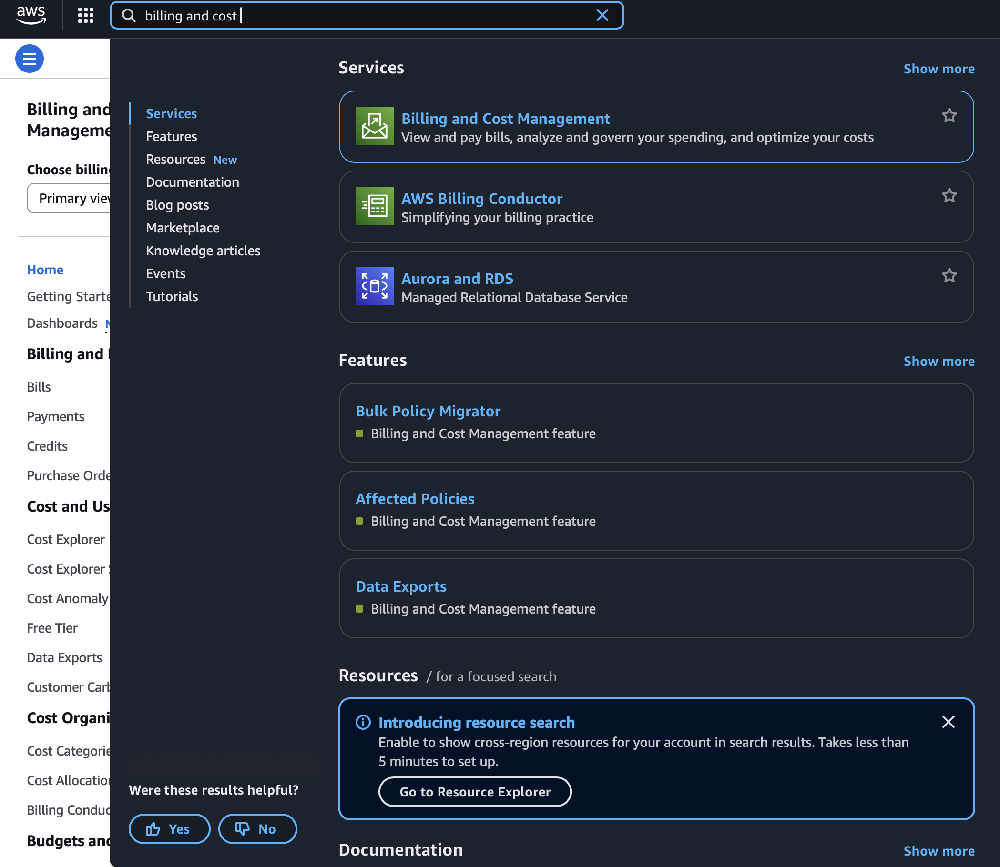

   _Рисунок 3. Переход в Billing and Cost Management_
3. Перейдите в раздел *Budgets*.
   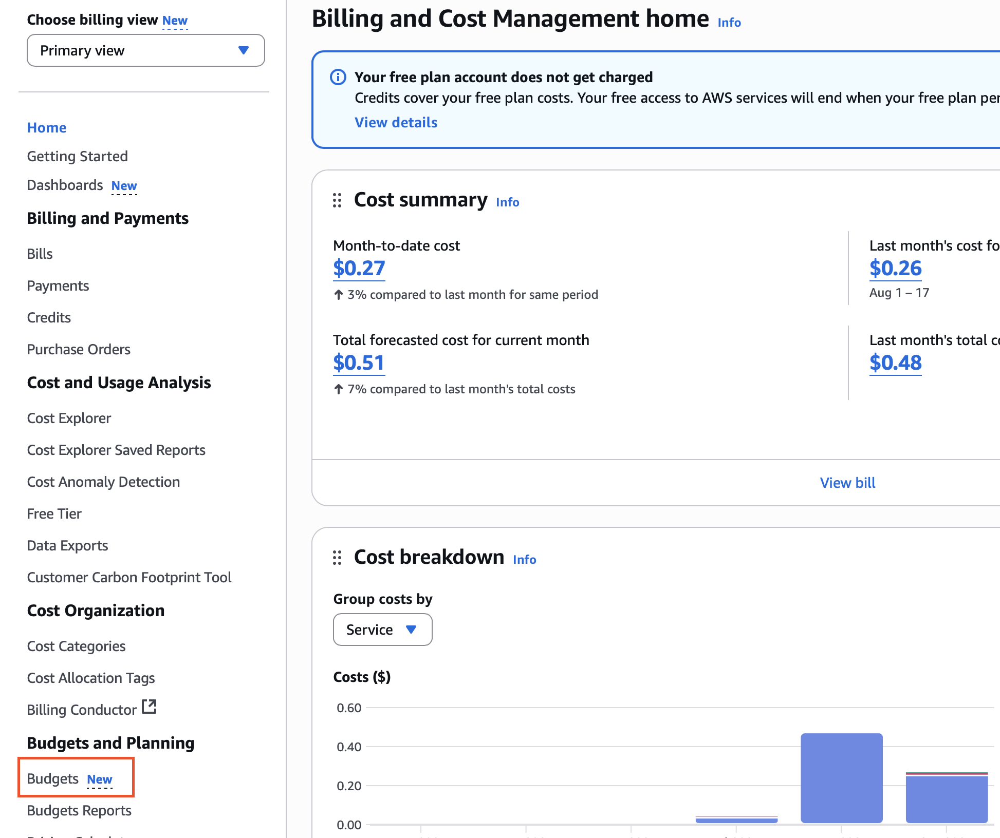

   _Рисунок 4. Раздел Budgets в Billing and Cost Management_
4. Создайте новый бюджет, нажав на кнопку *Create budget*.
   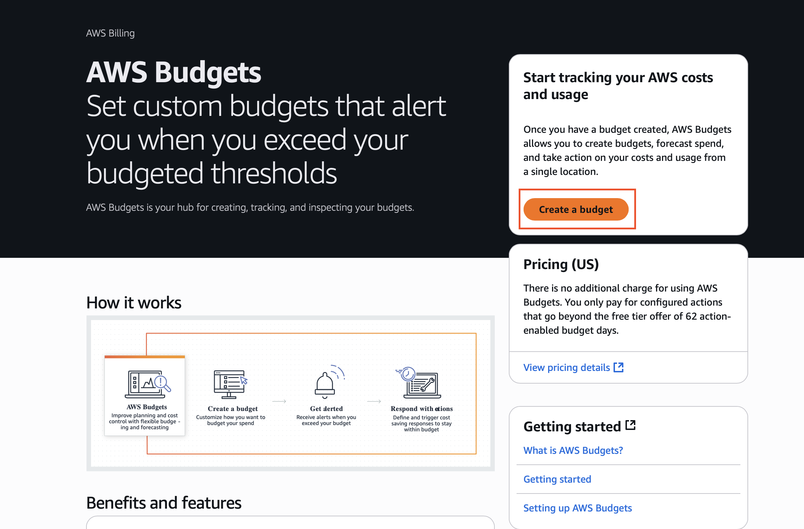

   _Рисунок 5. Создание нового бюджета_
5. В разделе _"Budget Setup"_ выберите тип _"Use a template simplified"_, это позволит использовать преднастроенные параметры бюджета (1).
6. Выберите шаблон _"Zero-Spend Budget"_ (2). Этот шаблон настроен на отслеживание любых расходов сверх $0.
7. Введите имя бюджета (например, "My Zero-Spend Budget") (3).
8. Введите email-адреса, на которые будут отправляться уведомления при превышении бюджета (4), можно указать до 10 адресов.
   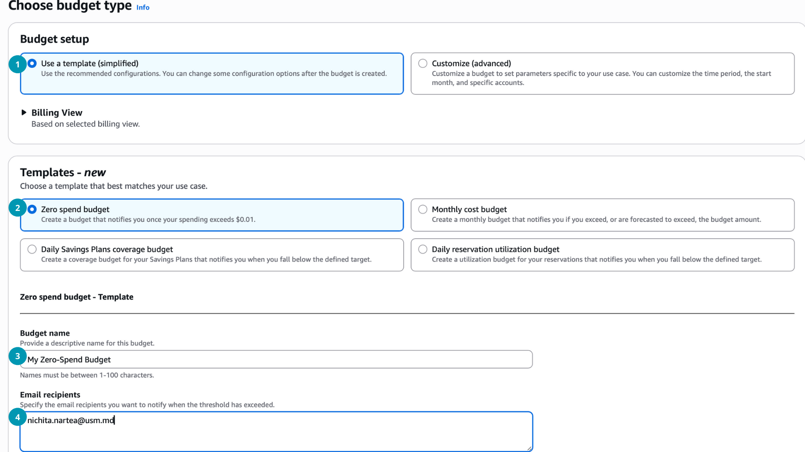

    _Рисунок 6. Настройка параметров бюджета_
9. Нажмите *Create budget* для сохранения настроек.

После создания бюджета вы будете получать уведомления на указанные email, если ваши расходы превысят $0 или если использование выйдет за рамки бесплатных лимитов Free Tier. Это поможет вам контролировать расходы и не допустить неожиданных счетов.

Также можно создавать и обычные бюджеты:

- Например, бюджет $10 в месяц: вы получите оповещение, когда потратите 50% ($5), 80% ($8) и 100% ($10) бюджета (порог оповещений настраивается).
- Бюджеты можно делать как по общим расходам аккаунта, так и по отдельным сервисам или проектам (с использованием тегов ресурсов).
- Кроме email, поддерживаются уведомления через SNS (SMS, мессенджеры) или AWS Chatbot в Slack/Teams для команд.

Чтобы случайно не выйти за рамки бюджета и Free Tier, то *следуйте принципам финансовой гигиены*:

- Всегда удаляйте неиспользуемые ресурсы (забытые EC2-инстансы, диски, IP-адреса - они могут тихо стоить денег).
- Настройте хотя бы один бюджет оповещения, чтобы получать уведомления о расходах.
- Следите за Free Tier usage - AWS на панели покажет вам, сколько процентов бесплатного лимита вы уже использовали по ключевым сервисам.

AWS - мощная платформа, но требующая ответственности: провайдер дает много способов контролировать ситуацию, воспользуйтесь ими, чтобы учиться без неожиданных трат.

### Создание IAM-пользователя

Работать с root-пользователем небезопасно, поэтому сразу после создания аккаунта рекомендуется создать отдельного IAM-пользователя с нужными правами для повседневной работы.

Как было сказано ранее, можно создать IAM-пользователя и напрямую выдать ему права, но удобнее создать группу с нужными правами и добавить пользователя в эту группу.

Для создания IAM-группы выполните следующие шаги:

1. В консоли AWS перейдите в сервис *IAM* (Identity and Access Management).
2. В меню слева выберите *User Groups* (Группы пользователей) (1), затем нажмите *Create group* (Создать группу) (2).
   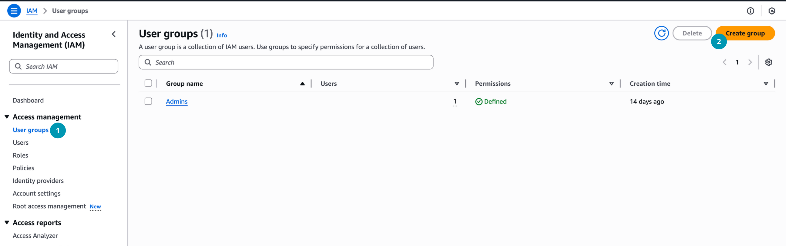

   _Рисунок 9. Создание группы пользователей в IAM_
3. Введите имя группы, например, "Admins" (3), выберите политику *AdministratorAccess* (4) из списка доступных политик, чтобы дать группе полные права администратора. Нажмите *Create user group*.
   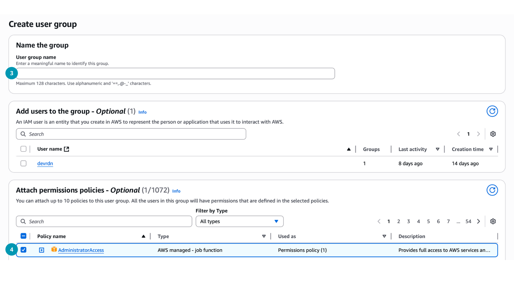

   _Рисунок 10. Настройка группы и прикрепление политики_

Для создания IAM-пользователя и добавления его в группу выполните следующие шаги:

1. В IAM-консоли слева выберите *Users* (Пользователи), затем нажмите *Add users* (Добавить пользователя).
2. Введите имя пользователя, например, "admin" (1).
3. Нажмите галочку *"Provide user access to the AWS Management Console - optional"* (2). Это позволит пользователю входить в веб-консоль, а не только использовать API.
4. После чего необходимо поставить галочку на *"I want to create an IAM user"*, чтобы создать нового IAM-пользователя (3).
5. Задайте пароль для входа в консоль (4). Можно выбрать:
   1. `Autogenerated password` - система сгенерирует пароль автоматически.
   2. `Custom password` - вы зададите пароль вручную.
6. Перейдите к следующему шагу, нажав *Next*.
   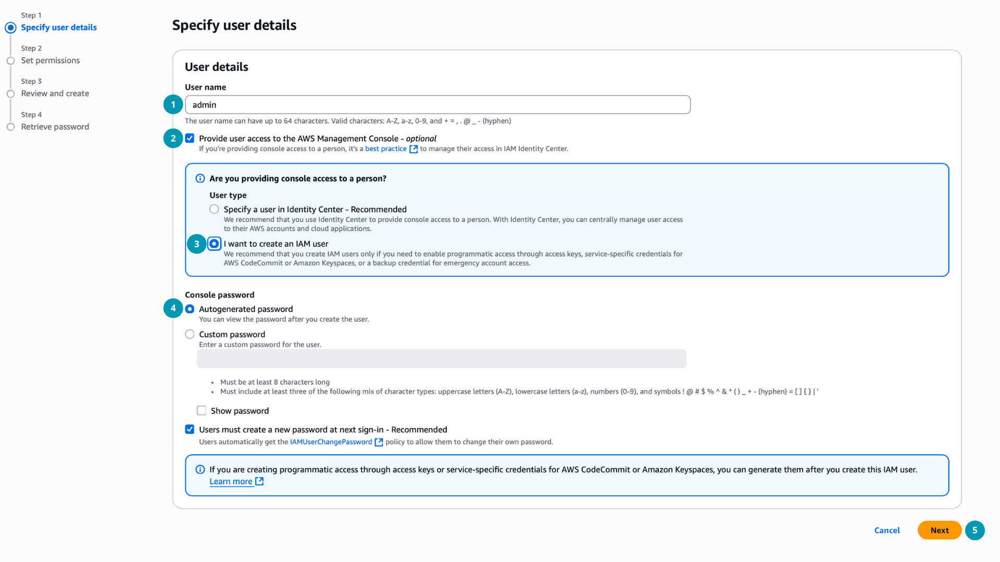

   _Рисунок 11. Создание IAM-пользователя_
7. На следующем шаге выберите *Add user to group* (1) и отметьте группу "Admins" (2), чтобы добавить пользователя в эту группу с правами администратора. После добавления пользователя в группу, у него появятся все права, определенные в политике группы. В данном случае, так как группа "Admins" имеет политику *AdministratorAccess*, пользователь "admin" получит полный доступ ко всем ресурсам AWS в вашем аккаунте.
8. Нажмите *Next* и затем *Create user*.
    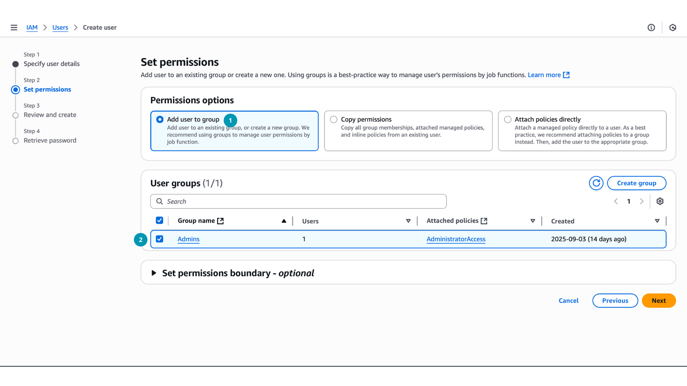
  
    _Рисунок 12. Добавление пользователя в группу_
9. На странице _"Review and create"_ проверьте все настройки и нажмите *Create user* для завершения создания пользователя.
10. После создания пользователя вы увидите страницу с его учетными данными:
    1.  URL для входа в консоль (1) - сохраните его, чтобы пользователь мог войти.
    2.  Имя пользователя (2).
    3.  Пароль (3) - если вы выбрали автоматическую генерацию
11. Сохраните эти данные (например, скачайте CSV-файл) (4) и передайте пользователю, чтобы он мог войти в AWS Management Console.
    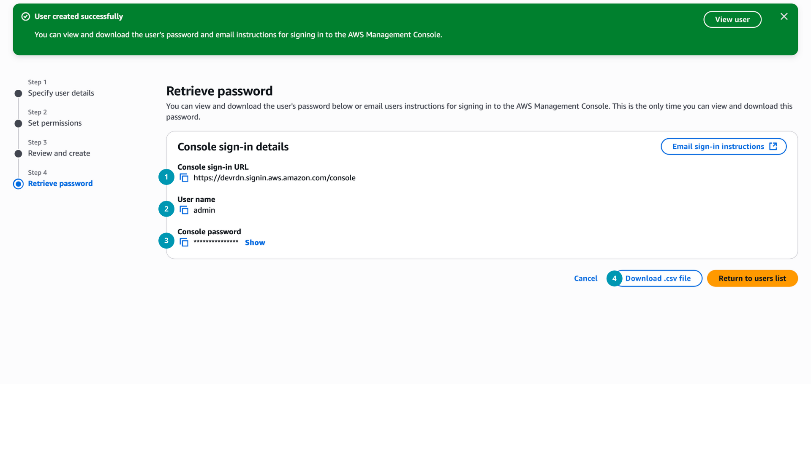

    _Рисунок 13. Учетные данные нового IAM-пользователя_
  
Теперь для входа в консоль используйте соответствующий URL, имя пользователя и пароль нового IAM-пользователя, а не root-пользователя. Это повысит безопасность вашего аккаунта.

## Взаимодействие с ресурсами AWS

AWS предоставляет несколько способов взаимодействия с ресурсами и управления ими. Вы можете использовать:

- *AWS Management Console*. Веб-интерфейс для управления ресурсами AWS. Подходит для новичков и для разовых операций.
- *AWS Command Line Interface (CLI)*. Инструмент командной строки для управления ресурсами через терминал. Позволяет автоматизировать задачи с помощью скриптов.
- *AWS SDKs*. Библиотеки для различных языков программирования (Python, Java, JavaScript и др.), позволяющие интегрировать AWS в ваши приложения.

### AWS Management Console

Вы уже знакомы с *AWS Management Console* - это основной веб-интерфейс для управления ресурсами AWS. Консоль предоставляет удобный визуальный доступ ко всем сервисам и настройкам вашего аккаунта. Вы можете создавать, настраивать и удалять ресурсы, просматривать отчеты и управлять безопасностью.

Простыми словами *AWS Console* это графический интерфейс, который позволяет вам работать с AWS через браузер или другое устройство с интернетом, не требуя знания команд или программирования. Консоль интуитивно понятна и подходит для новичков, так как все действия выполняются через клики и формы.

### AWS Command Line Interface (CLI)

*AWS CLI* - это инструмент командной строки, который позволяет управлять ресурсами AWS из терминала. CLI особенно полезен для автоматизации задач, написания скриптов и работы в средах без графического интерфейса. 

При работе с AWS могут возникать ситуации, когда у вас не будет доступа к веб-консоли, например:

- Работа на сервере без GUI.
- Автоматизация развертывания через скрипты.
- Использования localstack - эмулятора AWS на локальной машине.
- и т.д.

CLI позволяет выполнять те же действия, что и в консоли, но через команды. Например, чтобы запустить виртуальную машину (EC2 instance) через CLI, вы можете использовать команду:

```bash
# Запуск виртуальной машины сервиса EC2

aws ec2 run-instances
  --image-id ami-0abcdef1234567890
  --count 1
  --instance-type t2.micro
  --key-name MyKeyPair
  --security-groups MySecurityGroup
```

Любая команда CLI строится по шаблону:

```
aws <service> <operation> [options and parameters]
```

где, 

- `<service>` - имя сервиса AWS (например, `ec2`, `s3`, `lambda`).
- `<operation>` - конкретная операция или действие (например, `run-instances`, `create-bucket`).
- `[options and parameters]` - дополнительные параметры, такие как идентификаторы ресурсов, конфигурации и т.д.

Для установки AWS CLI следуйте официальной инструкции: [Installing the AWS CLI](https://docs.aws.amazon.com/cli/latest/userguide/getting-started-install.html).

Для взаимодействия с AWS через CLI вам понадобятся *ключи доступа* (Access Key ID и Secret Access Key) вашего IAM-пользователя, эти ключи позволяют CLI аутентифицироваться и авторизоваться в вашем аккаунте AWS, то есть простыми словами связать CLI (консоль) с вашим аккаунтом AWS. После создания ключей вы получите два значения:

- *Access Key ID* - публичный идентификатор ключа.
- *Secret Access Key* - секретный ключ, который нужно хранить в безопасности.

После установки AWS CLI, выполните команду:

```bash
aws configure

# Введите Access Key ID
# Введите Secret Access Key
# Введите регион по умолчанию (например, us-east-1). Данный регион будет использоваться по умолчанию для всех команд CLI, если не указан другой.
# Введите формат вывода по умолчанию (например, json). Данный формат будет использоваться для отображения результатов команд CLI.
```

Если вы хотите использовать CLI с другим аккаунтом, просто выполните `aws configure` снова и введите новые ключи.

### AWS SDKs

*AWS SDKs* - это набор библиотек для различных языков программирования, которые позволяют интегрировать AWS в ваши приложения. SDK упрощают работу с AWS API, предоставляя удобные методы и классы для взаимодействия с сервисами. Например, если вы разрабатываете приложение на JavaScript, вы можете использовать *AWS SDK for JavaScript* для создания и управления ресурсами AWS прямо из вашего кода.

Например, для *создания виртуальной машины (EC2 instance) с помощью AWS SDK for JavaScript*, вы можете использовать следующий код:

```javascript
// Перед использованием установите пакет AWS SDK for JavaScript
// npm install @aws-sdk/client-ec2

import { EC2Client, RunInstancesCommand } from "@aws-sdk/client-ec2";

const ec2 = new EC2Client({ region: "us-east-1" });

async function createInstance() {
  const params = {
    ImageId: "ami-0abcdef1234567890",      // Замените на реальный AMI ID
    InstanceType: "t3.micro",
    KeyName: "my-key-pair",               // Замените на ваш key pair
    SecurityGroupIds: ["sg-0123456789abcdef0"], // Замените на ваш security group
    SubnetId: "subnet-12345678",          // Замените на ваш subnet
    MinCount: 1,
    MaxCount: 1
  };

  try {
    const result = await ec2.send(new RunInstancesCommand(params));
    const instanceId = result.Instances[0].InstanceId;
    
    console.log(`Instance created: ${instanceId}`);
    return instanceId;
    
  } catch (error) {
    console.error("Error:", error.message);
    throw error;
  }
}

// Запуск
createInstance();
```

## Резюме

- *AWS как платформа*. AWS — крупнейший провайдер облака с моделью pay-as-you-go и более чем 200 сервисами для вычислений, хранения, сетей, БД, аналитики и др.
- *Категории сервисов*. Ключевые группы: Compute (EC2, Lambda, ECS/EKS), Storage (S3, EBS, EFS), Database (RDS, DynamoDB, Aurora), Networking & CDN (VPC, ELB, Route 53, CloudFront), Security & Identity (IAM, KMS, Shield), а также аналитика, ML и IoT.
- *Глобальная инфраструктура*. AWS имеет регионы (Regions) и зоны доступности (AZs) по всему миру для высокой доступности и отказоустойчивости.
- *Выбор региона и основы Multi-Region*. Выбор региона зависит от близости к пользователям, стоимости, соответствия требованиям и доступности сервисов. Multi-Region архитектуры повышают отказоустойчивость.
- *Глобальные vs региональные сервисы*. Региональные сервисы привязаны к конкретному региону (например, EC2), а глобальные (например, IAM) охватывают все регионы.
- *Аккаунт AWS как граница изоляции*. Аккаунт — логически изолированный контейнер ресурсов, удобный для разделения сред и биллинга; узнали о AWS Organizations и SCP.
- *IAM и безопасность доступа*. Управление пользователями, группами и ролями через IAM; политики определяют права доступа. Root-пользователь имеет все права, но для безопасности лучше использовать IAM-пользователей.
- *Биллинг и стоимость*. Существуют следующие модели оплаты: On-Demand (гибко, но дороже), Reserved Instances и Savings Plans (дешевле при долгосрочном использовании), Spot Instances (очень дешево, но без гарантии). Free Tier позволяет новичкам бесплатно использовать многие сервисы в течение первых 6 месяцев.
- *Контроль затрат*. Настройка бюджетов и оповещений в AWS Billing помогает избежать неожиданных расходов.
- *Интерфейсы работы с AWS*. AWS Management Console (веб-интерфейс), AWS CLI (командная строка) и AWS SDKs (библиотеки для кода) предоставляют разные способы взаимодействия с ресурсами AWS.

[^1]: _Overview of Amazon Web Services_. docs.aws.amazon.com [online]. Available at: https://docs.aws.amazon.com/whitepapers/latest/aws-overview/introduction.html
[^2]: _Cloud computing with AWS_. aws.amazon.com [online]. Available at: https://aws.amazon.com/what-is-aws/
[^3]: _AWS Infrastructure Offerings_. aws.amazon.com [online]. Available at: https://aws.amazon.com/about-aws/global-infrastructure/regions_az/
[^4]: _Global infrastructure_. docs.aws.amazon.com [online]. Available at: https://docs.aws.amazon.com/whitepapers/latest/aws-overview/global-infrastructure.html
[^5]: _What to Consider when Selecting a Region for your Workloads_. aws.amazon.com [online]. Available at: https://aws.amazon.com/blogs/architecture/what-to-consider-when-selecting-a-region-for-your-workloads/
[^6]: _IAM Identities_. docs.aws.amazon.com [online]. Available at: https://docs.aws.amazon.com/IAM/latest/UserGuide/id.html
[^7]: _Policies and permissions in AWS Identity and Access Management_. docs.aws.amazon.com [online]. Available at: https://docs.aws.amazon.com/IAM/latest/UserGuide/access_policies.html