# Облачная платформа AWS и организация облачных сервисов

<i>
Прошла неделя после той поездки в автобусе. Серая коробка у дороги никак не шла у Эммы из головы.

– Слушай, – сказала она, когда они снова сидели в читальном зале. – Получается, чтобы мой сайт работал нормально, мне нужна своя такая коробка? С генератором и вентиляторами?

– Не нужна, – Джон развернул к ней ноутбук. – Их уже построили. Несколько сотен.

На экране крутился глобус, усыпанный точками.

– Вот это регионы. Каждый регион это город из дата-центров, а внутри него несколько независимых кварталов. Отключится один квартал, остальные работают. Ты просто выбираешь, в каком городе поселиться.

– И сколько стоит там поселиться?

– Заводи аккаунт, сейчас увидим.

Эмма открыла сайт, ввела почту, придумала пароль. На третьем шаге у неё попросили номер банковской карты.

– Зачем карта? Я же ничего не покупаю.

– Чтобы убедиться, что ты живой человек. Там есть бесплатный план, но карту всё равно спрашивают.

Через пару минут открылась консоль. В правом верхнем углу висел список городов: Франкфурт, Огайо, Токио, Сан-Паулу.

– А какой из них мой?

– Любой. Но если выберешь Токио, твой сайт из Кишинёва будет открываться заметно медленнее.

Эмма выбрала Франкфурт, нажала несколько кнопок и создала виртуальную машину. Ту самую, устройство которой они разбирали неделю назад. Потом отвлеклась на сообщение, случайно переключила город на Ирландию и снова открыла список машин. Список был пуст.

– Джон. Она пропала.

Джон посмотрел на экран и засмеялся.

– Ничего не пропало. Регион это как этаж в общежитии. Ты оставила вещи на третьем, а ищешь на пятом.

Эмма вернула Франкфурт, машина оказалась на месте. Она помолчала, потом спросила:

– Слушай, а почему я захожу сюда тем же логином, которым регистрировалась? Это же как работать в базе данных под суперпользователем.

– Вот, – Джон отставил кружку. – Это правильный вопрос. И исправлять это надо прямо сегодня.
</i>

## Содержание

- [Облачная платформа AWS и организация облачных сервисов](#облачная-платформа-aws-и-организация-облачных-сервисов)
  - [Содержание](#содержание)
  - [Вопросы для самопроверки](#вопросы-для-самопроверки)
  - [Ретроспектива](#ретроспектива)
  - [Что такое AWS](#что-такое-aws)
    - [Как появилась AWS](#как-появилась-aws)
    - [Почему в этом курсе именно AWS](#почему-в-этом-курсе-именно-aws)
    - [Что такое облачный сервис](#что-такое-облачный-сервис)
  - [Глобальная инфраструктура](#глобальная-инфраструктура)
    - [Регион](#регион)
    - [Зона доступности](#зона-доступности)
    - [Edge-локации](#edge-локации)
    - [Как инфраструктура связана с доступностью](#как-инфраструктура-связана-с-доступностью)
    - [Как выбрать регион](#как-выбрать-регион)
    - [Региональные и глобальные сервисы](#региональные-и-глобальные-сервисы)
  - [Аккаунт AWS](#аккаунт-aws)
    - [Регистрация](#регистрация)
    - [Бесплатный уровень](#бесплатный-уровень)
    - [Консоль](#консоль)
  - [Кто вы в облаке: IAM](#кто-вы-в-облаке-iam)
    - [Root-пользователь](#root-пользователь)
    - [Что такое IAM: Identity and Access Management](#что-такое-iam-identity-and-access-management)
    - [Пользователь IAM](#пользователь-iam)
    - [Группы](#группы)
    - [Роли](#роли)
    - [Политики](#политики)
  - [Контроль расходов](#контроль-расходов)
    - [Где смотреть, сколько потрачено: AWS Billing and Cost Management](#где-смотреть-сколько-потрачено-aws-billing-and-cost-management)
    - [AWS Budgets](#aws-budgets)
  - [Организация ресурсов](#организация-ресурсов)
    - [Что такое ресурс](#что-такое-ресурс)
    - [Имя ресурса](#имя-ресурса)
    - [Теги](#теги)
  - [Способы взаимодействия с AWS](#способы-взаимодействия-с-aws)
    - [Взаимодействие черезAWS Management Console](#взаимодействие-черезaws-management-console)
    - [Командная строка](#командная-строка)
    - [SDK](#sdk)
    - [Ключи доступа и конфигурация CLI](#ключи-доступа-и-конфигурация-cli)
    - [Что выбирать](#что-выбирать)
  - [Как выбирать сервисы](#как-выбирать-сервисы)
  - [Резюме](#резюме)
  - [Библиография](#библиография)

## Вопросы для самопроверки

1. Чем регион отличается от зоны доступности?
2. Почему приложение, размещённое в одной зоне доступности, нельзя считать отказоустойчивым?
3. Зачем нужны edge-локации, если у AWS и так регионы по всему миру?
4. По каким признакам выбирают регион для нового проекта?
5. Почему не рекомендуется работать под тем пользователем, которым вы регистрировали аккаунт?
6. Чем ключ доступа отличается от пароля и кто им пользуется?
7. Откуда командная строка AWS узнаёт, что ей разрешено делать?
8. Что общего у веб-консоли, командной строки и SDK?
9. Чем отличаются глобальный, региональный и зональный сервисы?

## Ретроспектива

В первой главе мы разобрались, что такое облако как модель. Во второй спустились внутрь дата-центра и посмотрели, как один физический сервер превращается в десяток виртуальных машин.

Теперь пора выйти на уровень выше и посмотреть на всё это глазами клиента. У клиента нет доступа в машинный зал, он не видит ни стоек, ни гипервизора. Он видит сайт, на котором можно нажать кнопку и получить ресурс. Эта глава о том, как устроен этот сайт и что стоит за ним.

Мы начнём с самого простого: что такое AWS и почему мы изучаем именно её. Потом посмотрим, как оборудование AWS разбросано по планете и почему это разбросано именно так. Разберёмся, как заводится аккаунт и почему первым делом в нём нужно навести порядок с пользователями. И закончим четырьмя способами разговаривать с облаком: мышкой, командой, из своего кода и напрямую.

## Что такое AWS

### Как появилась AWS

**Amazon Web Services (AWS)** - облачная платформа компании Amazon, предоставляющая вычислительные ресурсы, хранилища, сети и множество других сервисов по требованию.

История уже знакома вам из первой главы. В марте 2006 года Amazon запустила хранилище Amazon S3, в августе того же года сервис виртуальных машин Amazon EC2. Технологически ничего нового в этом не было, новым был способ: ресурс выдавался за минуты, без договора и без переговоров.

С тех пор каталог вырос с двух услуг до более чем двухсот. AWS остаётся крупнейшим публичным провайдером по доле рынка, и многие понятия, которыми пользуется вся индустрия, пришли именно оттуда.

### Почему в этом курсе именно AWS

Для данного курса была выбрана одна основная облачная платформа - _AWS_. У такого выбора есть несколько причин:

- _Она самая большая_. Больше клиентов, больше документации, больше ответов на вопросы в интернете.
- _Она задала терминологию_. Регионы, зоны доступности, объектное хранилище: это понятия, которые потом появились и у других провайдеров.
- _Она доступна для учёбы_. Есть бесплатный уровень, на котором можно потрогать руками почти всё, о чём мы говорим.

> [!IMPORTANT]
> Курс не про AWS, курс про облачные вычисления. _AWS это площадка для примеров_. Понятия, которые мы разбираем, одинаковы у всех крупных провайдеров, а названия отличаются. Если вы поняли, что такое зона доступности, вы поймёте её и в Google Cloud, где она называется так же, и в Azure, где она называется почти так же.

### Что такое облачный сервис

Слово "сервис" в облаке используется постоянно, поэтому договоримся о нём сразу.

**Облачный сервис** - отдельная услуга провайдера, решающая одну конкретную задачу, например:

- хранить файлы,
- запускать виртуальные машины,
- рассылать письма,
- вести базу данных.

Сервисов у AWS несколько сотен, и это пугает на первых порах. Но пугаться не нужно по двум причинам.

- _Во-первых_, в реальном проекте используется два-три десятка, не больше.
- _Во-вторых_, сервисы делятся на понятные группы, и, зная группу, вы примерно представляете, чего ждать.

| Категория    | Какой вопрос решает                                  | Примеры                       |
| ------------ | ---------------------------------------------------- | ----------------------------- |
| Вычисления   | Где выполняется мой код                              | Amazon EC2, AWS Lambda        |
| Хранение     | Где лежат файлы и диски                              | Amazon S3, Amazon EBS         |
| Базы данных  | Где лежат данные приложения                          | Amazon RDS, Amazon DynamoDB   |
| Сети         | Как части системы связаны между собой и с интернетом | Amazon VPC, Amazon CloudFront |
| Безопасность | Кто и что может делать                               | AWS IAM                       |
| Наблюдение   | Что сейчас происходит с системой                     | Amazon CloudWatch             |

Большинство этих сервисов мы разберём во втором модуле курса. Пока достаточно понимать сам принцип: у каждой задачи есть своя полка в каталоге.

## Глобальная инфраструктура

Оборудование AWS не стоит в одном месте. Оно разбросано по планете, и разбросано не случайно.

### Регион

**Регион (region)** - географическая область, в которой находится группа дата-центров AWS. Это буквально область в стране, где сосредоточено оборудование провайдера. _Например_, Франкфурт, Токио, Вирджиния.

У каждого региона есть название для людей и код для машин. Например, _Франкфурт_ это `eu-central-1`, _Северная Вирджиния_ это `us-east-1`, _Токио_ это `ap-northeast-1`.

Регионов у AWS несколько десятков, и их число растёт: на момент сентября 2026 года их 39. Запомнить все не нужно, достаточно знать, что они есть и как их использовать. Актуальные значения всегда есть на официальной странице глобальной инфраструктуры.

Ключевое свойство региона: _регионы независимы друг от друга_. Данные, которые вы положили во Франкфурте, сами по себе не появятся в Ирландии. Ресурс, созданный в одном регионе, в другом просто не виден.

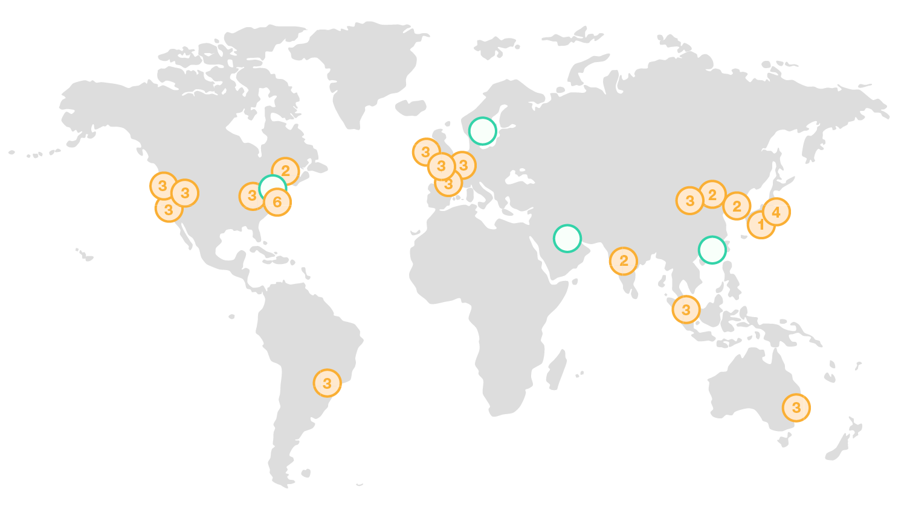

_3.1. Карта регионов AWS_

### Зона доступности

**Зона доступности (availability zone, AZ)** - _изолированная группа дата-центров внутри региона_, имеющая независимое электропитание, охлаждение и сетевое подключение. То есть, внутри одного региона может быть несколько зон доступности.

AWS проектирует регионы так, _чтобы в каждом было не менее трёх зон_, изолированных и физически разнесённых[^1]. У каждой свой код (обычно буква в конце обозначает конкретную зону): `eu-central-1a`, `eu-central-1b`, `eu-central-1c`.

Здесь важно понять две вещи сразу.

- Зоны _независимы_. Пожар, отключение электричества или авария в одной зоне не затрагивают соседнюю. Для того их и разносят физически: это разные здания, разные вводы электропитания, разные каналы связи.

- Зоны _близко_. Их соединяют быстрыми каналами, поэтому обмен данными между зонами одного региона происходит почти так же быстро, как внутри одной зоны. Именно это позволяет держать копии приложения в разных зонах и не терять в скорости.

### Edge-локации

Регионы решают задачу размещения. Но есть отдельная задача: доставить данные пользователю быстро, где бы он ни находился.

**Edge-локация (edge location)** - точка присутствия AWS, расположенная близко к пользователям и хранящая копии часто запрашиваемых данных.

Таких точек больше семисот, то есть на порядок больше, чем регионов[^1]. В них не запускают виртуальные машины и не держат базы данных. Их задача другая: _отдать пользователю картинку, видео или страницу с ближайшей точки, вместо того чтобы каждый раз тянуть её через полмира_.

Механизм, который этим занимается, называется **CDN (content delivery network), сеть доставки содержимого**. У AWS это сервис Amazon CloudFront[^2]. Подробно мы разберём его позже, пока достаточно понять идею на примере.

Допустим, ваш сайт лежит во Франкфурте, а пользователь открывает его из Бразилии. Без edge-локаций каждая картинка едет через Атлантику. С edge-локациями первая картинка едет через Атлантику один раз, остаётся в бразильской точке, и все следующие пользователи получают её оттуда. Сайт открывается заметно быстрее, а нагрузка на ваши серверы падает.

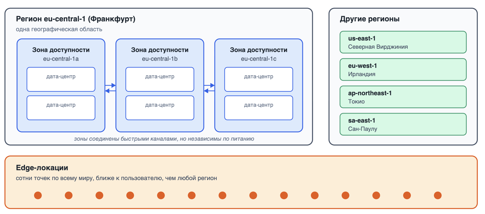

_3.2. Регионы, зоны доступности и edge-локации_

_Запомнить иерархию просто_: планета делится на регионы, регион делится на зоны доступности, зона состоит из дата-центров. Edge-локации стоят отдельно от этой иерархии и существуют ради скорости.

> [!TIP]
> У AWS есть интерактивная карта всей глобальной инфраструктуры, где можно посмотреть каждый регион, число зон в нём и год запуска[^1].

### Как инфраструктура связана с доступностью

Теперь соберём всё вместе и ответим на практический вопрос: _зачем студенту знать про зоны?_

Любой ресурс, который вы создаёте, живёт в конкретной зоне доступности. Виртуальная машина стоит в зоне A, её диск лежит в зоне A. Если зона A отключится, ваша машина остановится.

Отсюда простое правило, на котором держится вся отказоустойчивость в облаке: _не держите всё в одной зоне_.

Например, если база данных и веб-сервер находятся в одной зоне, и эта зона выходит из строя, то весь сервис становится недоступным. Размещение копий в разных зонах позволяет избежать полной остановки приложения и обеспечивает его отказоустойчивость.

> [!IMPORTANT]
> Вспомните первую лекцию: облако не делает приложение отказоустойчивым автоматически. AWS даёт вам зоны доступности, но решение размещать копии в разных зонах принимаете вы. Если вы этого не сделали, ваше приложение остановится вместе с одной зоной, и SLA провайдера тут не поможет: провайдер свои обязательства выполнил, отказала только одна зона из трёх.

### Как выбрать регион

Регион выбирают один раз, а живут с этим выбором долго, поэтому лучше подумать заранее. Смотрят обычно на четыре вещи.

- _Близость к пользователям_. Чем дальше регион, тем больше задержка. Для сайта, которым пользуются в Молдове, разумный выбор это Франкфурт или Ирландия, а не Сидней.
- _Требования закона_. Персональные данные граждан некоторых стран нельзя вывозить за пределы страны или союза. Это решает вопрос выбора региона жёстче любых технических соображений.
- _Цена_. Один и тот же сервис в разных регионах стоит по-разному. Разница между дорогим и дешёвым регионом бывает заметной.
- _Наличие сервисов_. Новые сервисы появляются сначала в крупных регионах и только потом в остальных. Если вам нужен конкретный сервис, стоит проверить, есть ли он там, куда вы собрались.

Разберём эти признаки на учебном сценарии:

> Департамент делает сайт расписания. Пользователи это студенты и преподаватели, все они находятся в Румынии. Данные содержат фамилии и группы, то есть персональные данные. Из сервисов нужны только виртуальная машина, база данных и хранилище файлов.

Какой регион выбрать для данного сайта?

- По близости подходят европейские регионы, Франкфурт или Ирландия.
- По закону данные необходимо держать в ЕС.
- По цене европейские регионы дороже американских, но разница на таком масштабе несущественная.
- По набору сервисов вопросов нет: виртуальные машины и базы данных есть везде.

_Вывод_: Франкфурт.

Теперь изменим одно условие, пусть тот же сайт делают для филиала в Токио. Первый же признак меняет ответ: задержка от Токио до Франкфурта сделает сайт заметно медленнее, и разумнее взять японский регион.

> [!TIP]
> Для учебных проектов в рамках курса берите ближайший европейский регион и не переключайте его. Половина проблем начинающих в AWS это созданный ресурс, который "пропал", потому что человек работает не в том регионе.

### Региональные и глобальные сервисы

Сервисы AWS делятся на три уровня по тому, насколько широко они действуют.

- _Глобальные_. Общие для всего аккаунта, регион для них не выбирается. Это IAM и сеть доставки содержимого CloudFront, что логично: её точки разбросаны по всему миру.
- _Региональные_. Живут в выбранном регионе, но внутри него AWS сама распределяет данные между зонами. Так работает, например, хранилище S3.

Отличить одно от другого просто:

- Если при создании ресурса консоль требует выбрать регион, сервис региональный.
- Если вместо региона написано `Global`, сервис глобальный.

## Аккаунт AWS

### Регистрация

Чтобы начать работать, нужен аккаунт. Регистрация выглядит так:

1. Указать адрес электронной почты и придумать пароль. Войти можно и через существующую учётную запись Google, GitHub, Apple или Amazon.
2. Выбрать план аккаунта: бесплатный или платный. Разницу разберём в следующем подразделе.
3. Заполнить контактные данные.
4. Указать способ оплаты. Карту просят даже для бесплатного плана, чтобы подтвердить, что вы реальный человек. С карты не списывают деньги, но временно удерживают один доллар на три-пять дней для проверки[^4].
5. Подтвердить номер телефона кодом.

Базовая техническая поддержка включена и стоит ноль. Отдельно выбирать её не нужно.

**Аккаунт AWS** - учётная запись, к которой привязаны все ваши ресурсы и счета за них.

Аккаунт это ещё и граница. Ресурсы одного аккаунта по умолчанию не видны из другого, и счёт выставляется тоже на аккаунт целиком. Крупные организации заводят несколько аккаунтов: _отдельный для разработки_, _отдельный для эксплуатации_, _отдельный для экспериментов_. Так проще и считать деньги, и ограничивать доступ.

### Бесплатный уровень

**AWS Free Tier** - программа, позволяющая новым клиентам знакомиться с сервисами AWS бесплатно.

В июле 2025 года AWS заметно её изменила, и старые инструкции в интернете теперь вводят в заблуждение[^5]. Сейчас всё устроено так.

При регистрации необходимо выбрать один из двух планов:

- _Бесплатный план_. Действует до шести месяцев или до того, как закончатся выданные кредиты, что наступит раньше. _Пока вы на нём, счёт вам не выставляют вообще: когда кредиты заканчиваются, аккаунт просто закрывается_.
- _Платный план_. Доступны все сервисы. Пока есть кредиты, тратятся они, дальше начинается обычная оплата по факту потребления.

Кредиты выдают обоим. При открытии аккаунта начисляют 100 долларов, ещё до 100 можно получить за выполнение нескольких заданий в консоли, итого максимум 200. Сами кредиты действуют двенадцать месяцев с момента открытия аккаунта.

Помимо кредитов есть больше тридцати сервисов, у которых всегда остаётся бесплатный месячный объём, независимо от плана и возраста аккаунта.

### Консоль

После того, как вы зарегистрировались и вошли в аккаунт, основной инструмент для работы с AWS - это **консоль**.

**Консоль AWS (AWS Management Console)** - веб-интерфейс, через который можно управлять всеми сервисами мышкой в браузере.

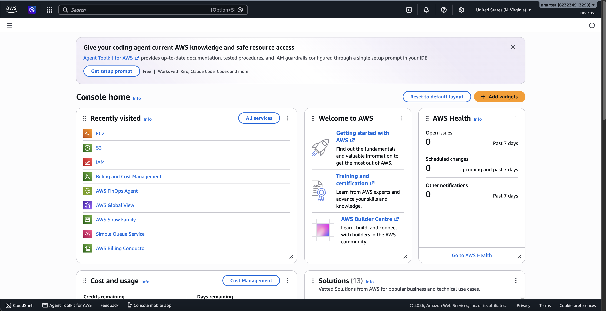

_3.3. Консоль AWS_

На что смотреть в первую очередь:

- _Строка поиска сверху_ (_1_). Самый быстрый способ найти сервис (_2_). Названий сотни, и листать меню бессмысленно: проще набрать "S3" или "EC2".

  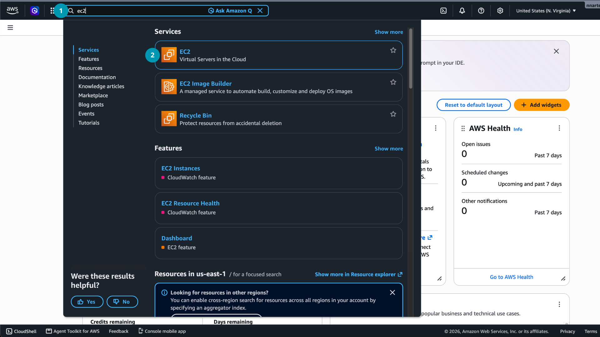

  _3.3. Строка поиска в консоли AWS_

- _Переключатель региона в правом верхнем углу_ (_3_). Показывает, в каком регионе вы сейчас работаете и в каком будут создаваться новые ресурсы.

  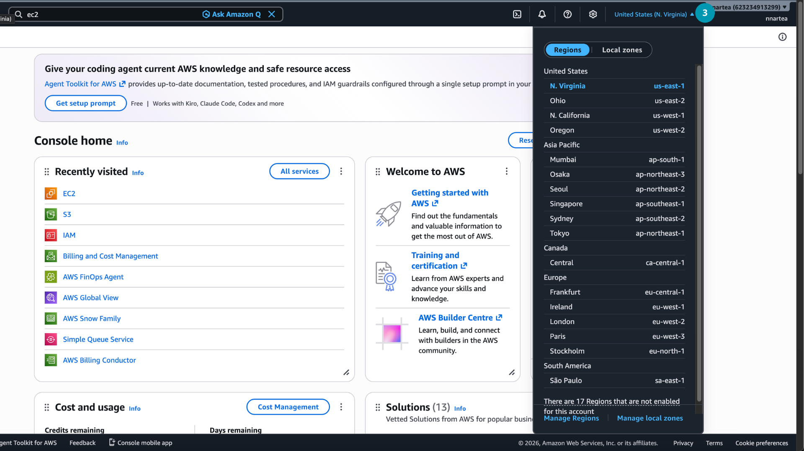

  _3.4. Переключатель региона в консоли AWS_

- _Меню учётной записи рядом с ним_ (_4_). Показывает, под кем вы вошли и номер вашего аккаунта.

  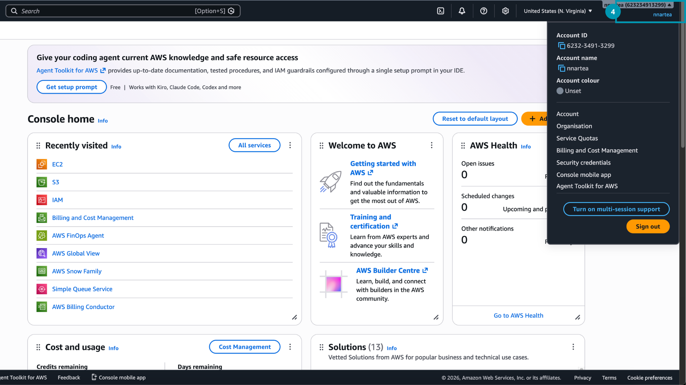

  _3.5. Меню учётной записи в консоли AWS_

- _Раздел с расходами_ (_5_). Там видно, сколько уже потрачено в текущем месяце.

  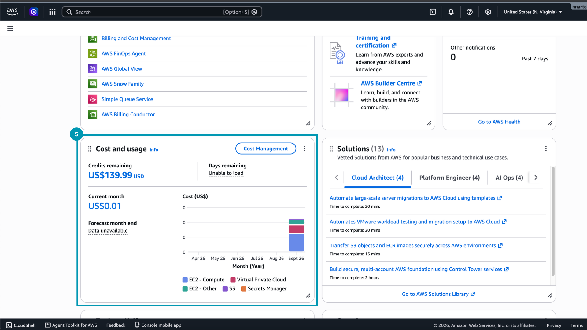

  _3.6. Раздел с расходами в консоли AWS_

> [!NOTE]
>
> В разделе расходов на главной странице консоли AWS не показаны все детали затрат. Также у новых аккаунтов может быть задержка в отображении информации о расходах.

Две вещи справа вверху, регион и учётная запись, влияют на всё, что вы видите на экране, и обе очень легко переключить случайно. Если что-то "пропало", проверьте сначала их.

## Кто вы в облаке: IAM

### Root-пользователь

**Root-пользователь (root user)** - учётная запись, созданная при регистрации аккаунта, обладающая полными правами на всё, включая закрытие аккаунта и изменение платёжных данных. _Это аккаунт, который имеет полный контроль над всеми ресурсами и настройками в аккаунте AWS._

У root нет ограничений. Он может удалить любой ресурс, поменять карту, закрыть аккаунт. Если пароль от root попадёт в чужие руки, вы потеряете не отдельный сервер, а всё сразу.

Поэтому правило простое: под root не работают[^7]. Им пользуются один раз при настройке аккаунта и потом только для нескольких редких операций, которые больше никому не доступны.

### Что такое IAM: Identity and Access Management

Первый сервис, с которым мы познакомимся в контексте AWS - **IAM (Identity and Access Management)**.

**AWS IAM (Identity and Access Management)** - сервис AWS, отвечающий за то, кто может войти в аккаунт и что ему разрешено делать[^8]. Данный сервис является _глобальным_, то есть его настройки применяются ко всему аккаунту, независимо от выбранного региона.

Обратите внимание: _IAM это такой же сервис, как хранилище или виртуальные машины_. У него есть своя страница в консоли, своя документация и свой набор операций. Разница только в том, что он управляет не вычислениями и не данными, а доступом.

Чтобы его открыть, наберите `IAM` в строке поиска консоли (_6_). Внутри вы увидите разделы для пользователей, групп, ролей и политик.

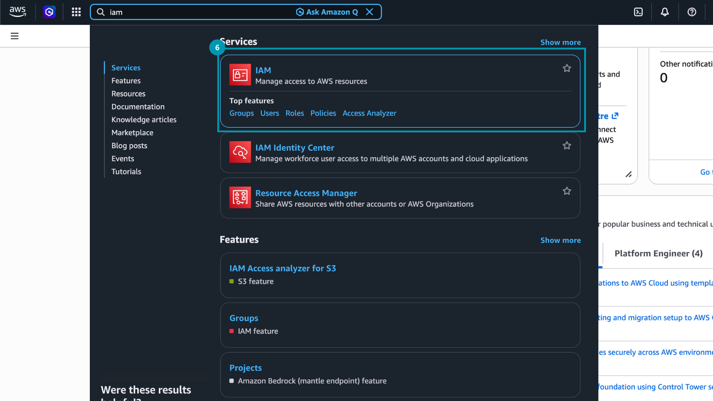

_3.7. Страница сервиса IAM в консоли AWS_

Как было сказано ранее IAM относится к глобальным сервисам, поэтому переключатель региона для него показывает `Global`. Пользователь, созданный однажды, работает во всех регионах сразу, и создавать его отдельно для Франкфурта и для Ирландии не нужно.

### Пользователь IAM

**Пользователь IAM (IAM user)** - учётная запись внутри аккаунта AWS, у которой есть собственный логин и собственный набор прав. _Это основной способ предоставления доступа отдельным людям к ресурсам AWS без использования root-пользователя._

Создадим такого пользователя.

1.  Откройте консоль IAM, выберите `IAM users` в левом меню (_7_) и нажмите `Create user` (_8_).

    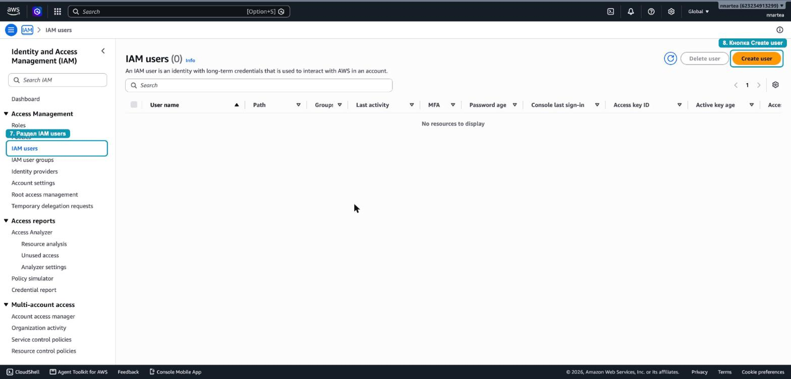

    _3.11. Создание пользователя IAM. Часть 1_

2.  Укажите имя пользователя, задайте параметры входа и нажмите `Next` (_11_).
    - `Provide user access to the AWS Management Console` (_9_), если пользователь должен входить в консоль.
    - `Autogenerated password` (_10_), если пароль должен создаться автоматически.
    - Остальные пункты понятны по описанию в самой консоли.

    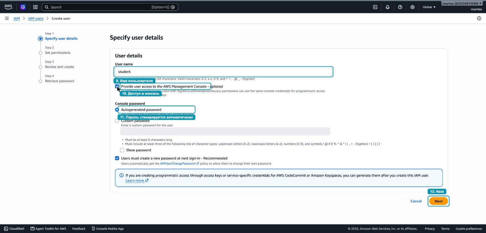

    _3.12. Создание пользователя IAM. Часть 2_

3.  Откроется страница назначения прав. Есть 3 основных способа:
    - `Add user to group` добавляет пользователя в существующую группу с готовыми правами. К этому варианту вернёмся дальше.
    - `Copy permissions` копирует права с другого пользователя.
    - `Attach policies directly` (_13_) выдаёт права пользователю напрямую, из списка ниже.

    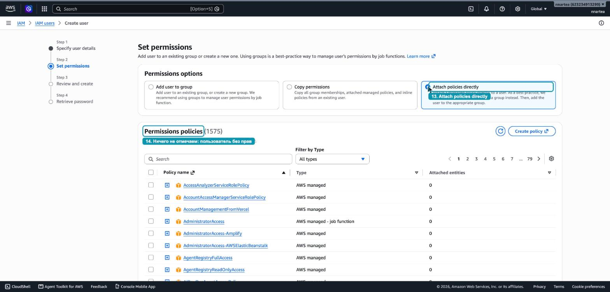

    _3.13. Назначение прав пользователю IAM_

4.  Мы создадим пользователя вообще без прав: выберите `Attach policies directly` и не отмечайте ничего в списке. Нажмите `Next`.

    > [!NOTE]
    > Строки в этом списке называются _политиками_. Это готовые наборы прав, из которых собирается доступ. Что они собой представляют, разберём в конце раздела, а пока нам достаточно ничего из них не выбирать.

5.  На следующей странице проверьте сводку: имя, способ входа и выданные права.

    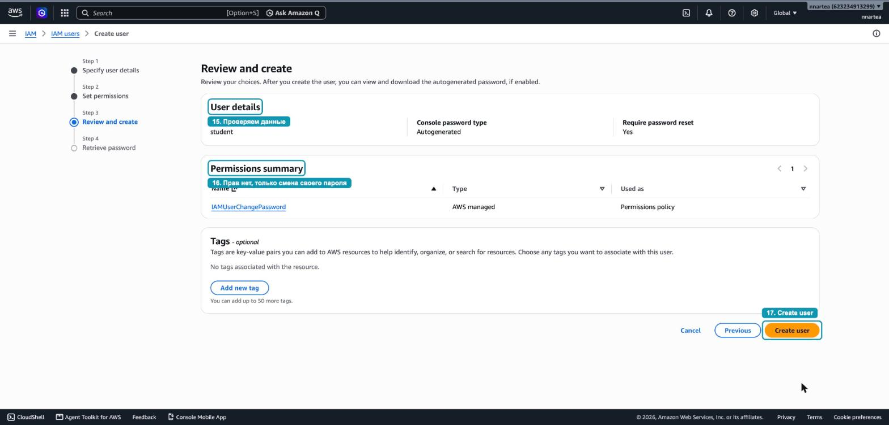

    _3.14. Сводка по создаваемому пользователю_

6.  После создания пользователя будет показан экран с подтверждением, где можно скачать CSV-файл (_21_) с данными для входа пользователя.

    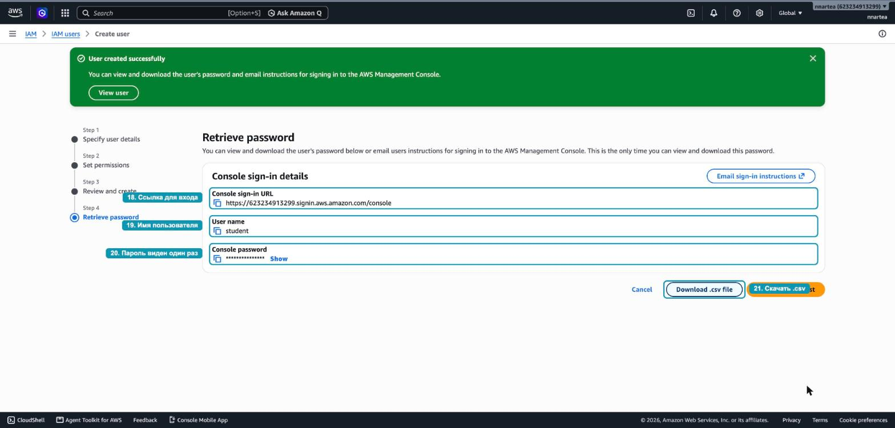

    _3.15. Экран с подтверждением создания пользователя IAM в консоли AWS_

Пользователь успешно создан, теперь используя ссылку и данные для входа из CSV-файла, можно войти в консоль AWS под этим пользователем.

У данного пользователя нет прав, так как мы не назначали ему никаких политик доступа. Этот принцип называется **наименьших привилегий**: пользователю предоставляются только те права, которые ему действительно необходимы для работы.

> [!WARNING]
> Пароль на экране с данными для входа показывается один раз. Не закрывайте страницу, пока не скачали CSV-файл или не записали пароль: восстановить его нельзя, можно только сбросить и выдать новый.

### Группы

Выдавать права каждому человеку по отдельности удобно, пока людей трое. Когда их тридцать, начинается путаница: кому-то забыли выдать, у кого-то остались лишние права с прошлого проекта.

**Группа IAM (IAM group)** - именованный набор пользователей, которым выдаются одинаковые права.

Работает это так. Вы создаёте группу, например `Admins`, и даёте права не людям, а ей. Дальше нового студента достаточно добавить в группу, и он сразу получает всё, что группе положено. Уходит студент из проекта, вы убираете его из группы, и доступ пропадает.

Создадим группу и сразу положим в неё пользователя, которого только что завели.

1.  В сервисе `IAM` выберите `IAM user groups` (_22_) и нажмите `Create group` (_23_).

    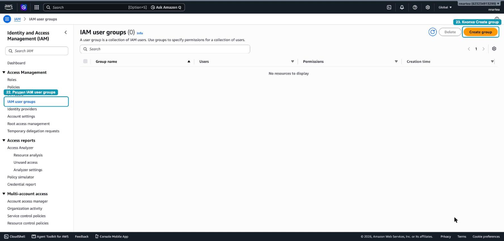

    _3.16. Создание группы IAM_

2.  Введите имя группы, например `Admins` (_24_).

3.  Ниже отметьте пользователей, которых нужно добавить в группу. Отметьте созданного ранее пользователя.

4.  Ещё ниже выберите права для группы. Найдите и отметьте `AdministratorAccess` (_25_): этот набор прав даёт всем участникам группы полный доступ к аккаунту.

    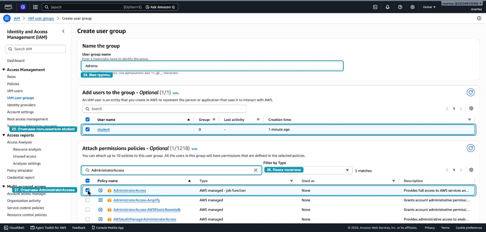

    _3.17. Добавление пользователя и прав группе_

5.  Нажмите `Create group`.

    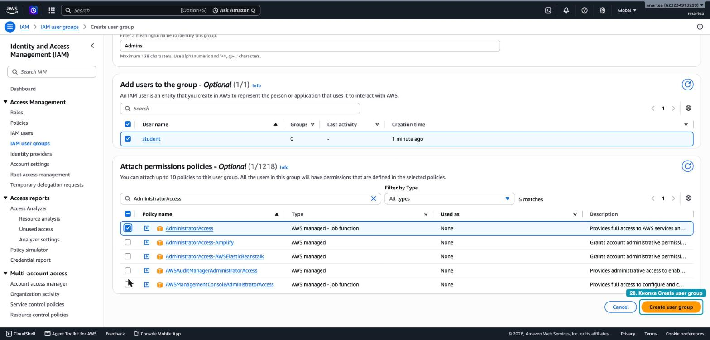

    _3.18. Завершение создания группы_

Теперь у пользователя появились права, хотя ему лично мы ничего не выдавали: он получил их через группу.

> [!WARNING]
> Полный доступ в учебном аккаунте приемлем, потому что вы сами себе администратор. В рабочем проекте так не делают: там группе выдают ровно те права, которые нужны её участникам для работы.

- Один пользователь может состоять сразу в нескольких группах, и тогда он получает права всех своих групп.
- Группа не является учётной записью: под группой нельзя войти, у неё нет пароля и ключей.
- Группы не вкладываются друг в друга: группы внутри группы не бывает.

> [!NOTE]
> В крупных компаниях сотрудникам чаще заводят учётные записи не в самом AWS, а в централизованной системе входа, общей для всех рабочих инструментов. В курсе мы этого не касаемся: для учебных задач пользователей IAM более чем достаточно.

### Роли

У пользователя и группы есть общая черта: они принадлежат конкретному человеку или набору людей. Но доступ к ресурсам нужен не только людям.

**Роль IAM (IAM role)** - набор прав, который не привязан к конкретному пользователю, а временно выдаётся тому, кому он нужен.

Роль не имеет ни пароля, ни постоянных ключей. Её нельзя "иметь", её можно только "принять" на время, и вместе с ней выдаются временные учётные данные, которые сами перестают работать через несколько часов.

Мы рассмотрим роли в следующей главе, так как обычно они выдаются сервису.

### Политики

Мы всё время говорили, что у пользователя, группы или роли есть права. Осталось сказать, в каком виде они записаны.

**Политика (policy)** - документ, в котором перечислено, какие действия и с какими ресурсами разрешены или запрещены.

Разница между двумя словами простая:

- **Права** это то, что человек или программа может делать.
- **Политика** это документ, в котором это записано. Права не существуют сами по себе: чтобы кому-то что-то разрешить, к нему прикрепляют политику.

Три правила, которые стоит запомнить.

- _По умолчанию запрещено всё_. Новый пользователь не может ничего, пока ему явно не разрешили. Именно поэтому созданный нами `student` без единой политики умел только сменить свой пароль.
- _Политику прикрепляют_ к пользователю, к группе или к роли. Дальше AWS при каждом запросе сверяется с ней.
- _Писать политики самому не обязательно_. У AWS есть готовые, и для учебных задач их хватает. Например, `AdministratorAccess`, которую мы выдали группе, даёт полные права в пределах аккаунта.

Сама политика это текстовый документ в формате JSON. Его устройство мы будем разбирать походу из изучения практических примеров. Пока достаточно знать, что права это не абстракция, а файл, который можно открыть и прочитать.

## Контроль расходов

Про деньги в облаке легко забыть, пока не придёт первый счёт. Поэтому в AWS есть отдельная группа сервисов, которая занимается только расходами.

### Где смотреть, сколько потрачено: AWS Billing and Cost Management

**AWS Billing and Cost Management** - сервис, в котором собраны счета, история расходов и настройки оплаты. Данный сервис является _глобальным_, то есть не привязан к конкретному региону.

Найти его можно через строку поиска по слову `Billing` или через меню учётной записи в правом верхнем углу консоли. Внутри вас интересуют три вещи:

- _Текущий счёт_. Сколько уже потрачено в этом месяце и на какие сервисы.
- _История_. Те же данные за прошлые месяцы.
- _Использование бесплатных возможностей_. Сколько осталось от кредитов и от всегда бесплатных объёмов.

> [!IMPORTANT]
> По умолчанию данные о счетах видит только root-пользователь. Чтобы их увидел обычный пользователь IAM, root должен один раз разрешить это в настройках аккаунта. Если вы зашли под своим пользователем и раздел с расходами пуст или недоступен, дело почти всегда в этом.

### AWS Budgets

Смотреть счёт руками каждый день никто не будет. Поэтому есть сервис, который следит за расходами вместо вас.

**AWS Budgets** - сервис, позволяющий задать предел расходов и получать уведомления при его приближении или превышении[^14].

Бюджет это не ограничение, а сторож. Он не мешает вам тратить, он сообщает, что вы тратите. Останавливать ничего он по умолчанию не будет.

Настраивается бюджет за пару минут:

1. Открыть Billing and Cost Management и перейти в раздел Budgets.
2. Создать бюджет по расходам и указать сумму, например 5 долларов в месяц.
3. Задать порог уведомления, например 80 процентов от суммы.
4. Указать адрес электронной почты, на который придёт письмо.

Для студентов у AWS есть готовый шаблон, который подходит лучше всего.

**Zero-Spend Budget (бюджет нулевых затрат)** - готовый шаблон бюджета, который присылает письмо, как только по аккаунту появился хоть какой-нибудь платный расход.

Смысл в том, что вам не нужно угадывать сумму. Пока всё, что вы делаете, укладывается в бесплатные возможности, писем нет. Пришло письмо значит вы что-то создали сверх бесплатного и стоит разобраться, что именно. Как его настроить, разберём в практической части.

> [!NOTE]
>
> Само наблюдение за бюджетом и уведомления бесплатны[^15]. Платить приходится только за дополнительные возможности, которые мы в курсе не используем: за автоматические действия при превышении порога и за регулярные отчёты по электронной почте.

Помимо бюджетов есть ещё два инструмента, о которых полезно знать:

- _AWS Cost Explorer_ строит графики расходов и помогает понять, какой сервис съедает больше всего.
- _AWS Cost anomaly detection_ сам замечает необычные всплески трат и предупреждает о них. Подробно мы их не разбираем, но в консоли они лежат рядом с бюджетами.

## Организация ресурсов

### Что такое ресурс

**Ресурс (resource)** - любой объект, созданный вами в AWS: виртуальная машина, диск, хранилище файлов, сеть, пользователь.

У ресурса есть жизненный цикл. Вы его создаёте, он работает и за него идёт оплата, потом вы его удаляете и оплата прекращается. Звучит очевидно, но на этом месте начинающие теряют деньги: удаление виртуальной машины не всегда удаляет её диск, а диск тарифицируется отдельно и продолжает лежать в аккаунте.

Ресурсов в аккаунте быстро становится много. Через месяц работы вы уже не помните, зачем создавали машину с непонятным именем. Поэтому в AWS есть несколько способов навести порядок.

### Имя ресурса

У каждого ресурса есть полное имя, одинаковое по форме для всех сервисов.

**ARN (Amazon Resource Name)** - уникальное имя ресурса в AWS, по которому его можно однозначно найти[^9].

Выглядит оно так:

```text
arn:aws:s3:::my-photos/cat.jpg
arn:aws:ec2:eu-central-1:123456789012:instance/i-0abc123
```

Читается слева направо: это ARN, платформа AWS, сервис, регион, номер аккаунта, сам ресурс:

- `arn` - указывает, что это ARN.
- `aws` - платформа AWS.
- `ec2` - сервис, к которому относится ресурс (в данном случае виртуальная машина EC2). _Мы еще не изучали виртуальные машины, поэтому пока просто запомним, что это сервис._
- `eu-central-1` - регион, в котором находится ресурс (в данном случае Франкфурт, Германия).
- `123456789012` - номер аккаунта AWS, к которому относится ресурс.
- `instance/i-0abc123` - сам ресурс (виртуальная машина с идентификатором i-0abc123).

Запоминать формат наизусть не нужно. Нужно узнавать его в документации и понимать, что это адрес конкретной вещи в вашем аккаунте. Мы будем использовать ARN всякий раз, когда нужно однозначно указать ресурс.

### Теги

**Тег (tag)** - произвольная пара "имя и значение", которую можно прикрепить к ресурсу.

Например, `Project = lab3`, `Owner = emma`, `Environment = dev`. AWS никак не использует эти надписи, они нужны только вам. Зато потом по ним можно отфильтровать список ресурсов или посмотреть, сколько денег потратил каждый проект.

> [!TIP]
> Заведите привычку помечать учебные ресурсы тегом с номером лабораторной работы. В конце семестра вы найдёте всё, что забыли удалить, за одну минуту вместо получаса.

## Способы взаимодействия с AWS

С AWS можно взаимодействовать несколькими способами. Есть 3 основных метода, с которыми вы будете сталкиваться чаще всего:

1. **AWS Management Console** - веб-интерфейс, через который можно создавать и управлять ресурсами.
2. **AWS CLI (Command Line Interface)** - инструмент командной строки для взаимодействия с AWS.
3. **AWS SDKs** - набор библиотек для различных языков программирования, позволяющий управлять ресурсами из кода.

### Взаимодействие черезAWS Management Console

Самый простой способ, с которого начинают все. Открыли браузер, нашли сервис, нажали кнопки.

У консоли два преимущества:

1. Ничего не нужно устанавливать
2. Всё подписано словами.

И один недостаток: действия, сделанные мышкой, невозможно повторить в точности. Если вы настраивали машину полчаса, вторую такую же вы будете настраивать примерно столько же и наверняка что-нибудь забудете.

### Командная строка

**CLI (command line interface), интерфейс командной строки** - программа, которая позволяет управлять AWS текстовыми командами из терминала.

Любая команда строится по одному шаблону:

```text
aws <сервис> <операция> [параметры]
```

- `<сервис>` - имя сервиса AWS, с которым вы хотите взаимодействовать (например, `ec2` для виртуальных машин EC2).
- `<операция>` - конкретное действие, которое вы хотите выполнить (например, `describe-instances` для получения списка виртуальных машин).
- `[параметры]` - дополнительные параметры команды (например, фильтры или идентификаторы ресурсов).

Например, чтобы получить список всех виртуальных машин EC2, можно использовать команду:

```bash
aws ec2 describe-instances
```

Главное преимущество командной строки в том, что команду можно сохранить в файл, положить в репозиторий и повторить через полгода слово в слово.

### SDK

**SDK (software development kit)** - библиотека для конкретного языка программирования, позволяющая обращаться к сервисам облака прямо из вашего кода.

AWS предоставляет такие библиотеки для Python, JavaScript, Java, Go, C++ и других языков[^11]. Вместо того чтобы составлять запрос вручную, вы вызываете обычную функцию.

Например, на JavaScript загрузка файла в хранилище выглядит примерно так:

```javascript
const client = new S3Client({ region: "eu-central-1" });

await client.send(
  new PutObjectCommand({
    Bucket: "my-photos",
    Key: "cat.jpg",
    Body: fileContent,
  }),
);
```

> [!NOTE]
>
> Вы пока можете не обращать внимание на детали сервисов и команд SDK, главное понять сам принцип работы.

Ни ключей, ни подписей в коде нет: библиотека берёт их из того же файла, который создала команда `aws configure`.

### Ключи доступа и конфигурация CLI

Командная строка и SDK работают на вашем компьютере, а ресурсы находятся у AWS. Значит, им нужно как-то доказать, что они действуют от вашего имени. Человек для этого вводит логин и пароль, а программа так не умеет. Для этого используются ключи доступа.

**Ключ доступа (access key)** - пара из идентификатора и секретной строки, которой программа подтверждает, что действует от имени определённого пользователя IAM.

Идентификатор работает как логин, секретная строка как пароль. Разница в том, что эта пара предназначена для программ, а не для людей.

Порядок действий такой:

_Шаг 1. Установите командную строку._ Инструкция для Windows, macOS и Linux есть в документации AWS[^10]. После установки проверьте, что всё работает корректно, выполнив команду:

```bash
aws --version
```

_Шаг 2. Создайте ключ доступа для своего пользователя IAM_

1. Откройте `IAM`, зайдите в `IAM users` и выберите нужного пользователя. Перейдите на вкладку `Security credentials` (_29_), найдите раздел `Access keys` (_30_) и нажмите `Create access key` (_31_)

   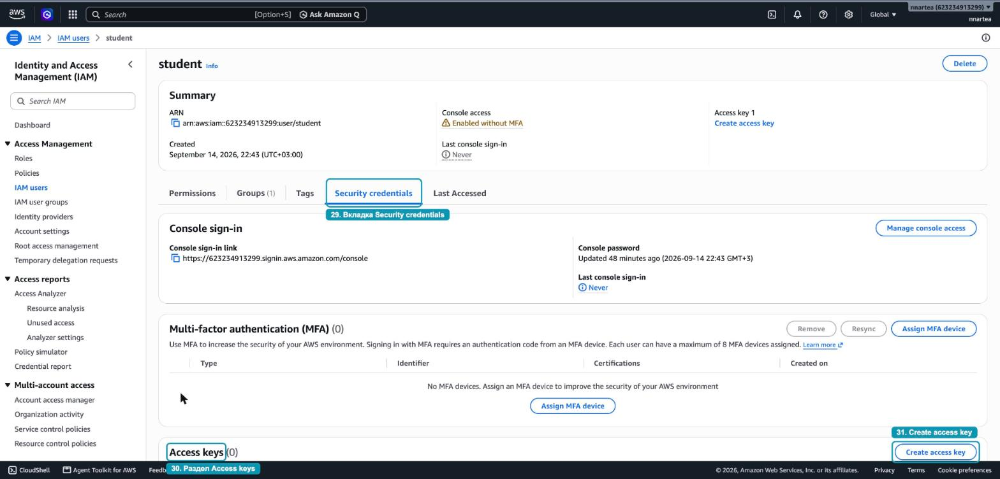

   _3.20. Создание ключа доступа. Часть 1_

2. AWS спросит, для чего нужен ключ. Выберите `Command Line Interface (CLI)` (_32_). Есть и другие варианты, но для командной строки подходит именно этот.

   Ниже консоль покажет предупреждение о том, что у этого способа есть более безопасные альтернативы (_33_), и попросит подтвердить, что вы его прочитали (_34_).

   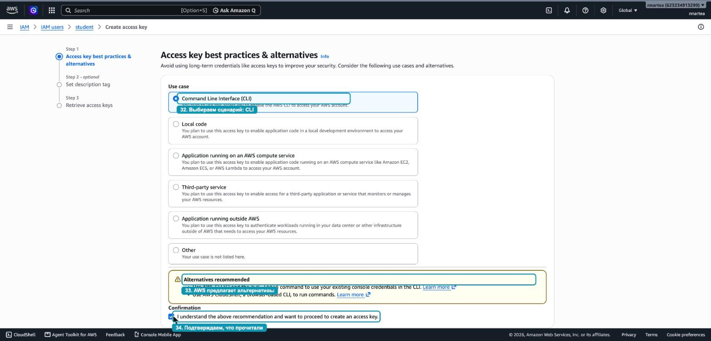

   _3.21. Создание ключа доступа. Часть 2_

3. Укажите описание, чтобы потом вспомнить, откуда этот ключ и зачем он нужен (_35_), например `cli-laptop`. Нажмите `Create access key` (_36_).

   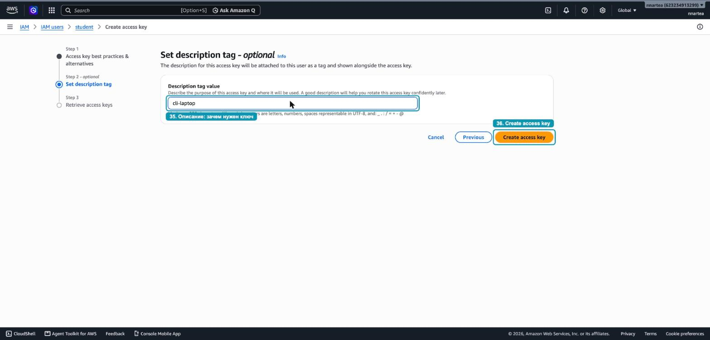

   _3.22. Создание ключа доступа. Часть 3_

4. Готово. `Access key ID` (_38_) это логин, `Secret access key` (_39_) это пароль. Секрет показывается один раз (_37_), поэтому скачайте CSV-файл (_41_) или скопируйте значения прямо сейчас.

   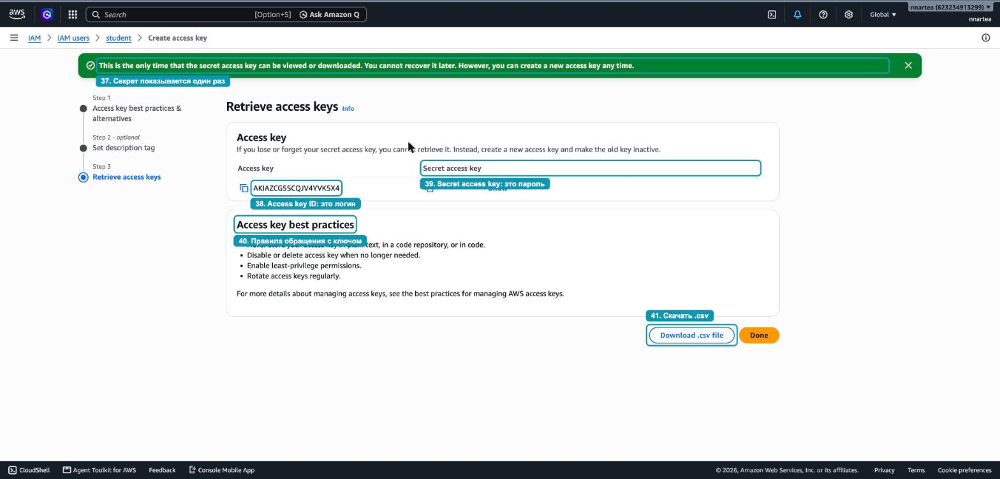

   _3.23. Создание ключа доступа. Часть 4_

_Шаг 3. Пропишите ключ в командной строке._

```bash
aws configure
```

```text
AWS Access Key ID [None]: AKIA...
AWS Secret Access Key [None]: ...
Default region name [None]: eu-central-1
Default output format [None]: json
```

_Шаг 4. Проверьте, что всё работает._

Выполните следующую команду, чтобы проверить, что всё работает:

```bash
aws sts get-caller-identity
```

Команда покажет, от чьего имени вы сейчас обращаетесь к AWS. Если в ответе видно имя вашего пользователя, настройка закончена.

### Что выбирать

Простое правило на первое время:

- _Консоль_, когда вы делаете что-то впервые и хотите посмотреть, какие вообще есть настройки.
- _Командная строка_, когда действие нужно повторять или встраивать в скрипт.
- _SDK_, когда обращаться к облаку должно ваше приложение во время работы.

| Способ  | Кто им пользуется | Можно ли повторить в точности | Когда удобен                                 |
| ------- | ----------------- | ----------------------------- | -------------------------------------------- |
| Консоль | Человек           | Нет                           | Первое знакомство, разовые действия          |
| CLI     | Человек и скрипты | Да                            | Повторяемые операции, автоматизация          |
| SDK     | Ваше приложение   | Да                            | Обращение к облаку во время работы программы |

## Как выбирать сервисы

Вопрос, которые начинающие разработчики задают себе чаще всего: какой сервис выбрать? Сервисов сотни, как понять, какой нужен именно вам?

Порядок действий тот же, что мы обсуждали в первой лекции: сначала требования, потом решение.

1. _Сформулируйте задачу словами_, без названий сервисов. "Нужно хранить фотографии и отдавать их пользователям". "Нужно место, где будет работать веб-приложение на Node.js".
2. _Определите категорию_. Хранение файлов, вычисления, база данных, сеть. Каталог AWS разбит по этим же категориям.
3. _Решите, сколько работы вы берёте на себя_. Это тот самый выбор между IaaS и PaaS из первой лекции. Поставить базу данных на виртуальную машину самому дешевле по счёту, но обновления, резервные копии и репликация станут вашей заботой.
4. _Проверьте доступность и цену в вашем регионе_. Не все сервисы есть везде, и цены отличаются.

> [!TIP]
> Не начинайте с вопроса "какой сервис взять". Начинайте с вопроса "что должно получиться и при каких условиях". Половина архитектурных ошибок это правильно настроенный, но неверно выбранный сервис.

## Резюме

- AWS это облачная платформа Amazon, крупнейшая по доле рынка. В курсе она служит площадкой для примеров, а изучаем мы облачные вычисления, а не каталог одной компании.
- Глобальная инфраструктура устроена иерархически: планета делится на регионы, регион на зоны доступности, зона состоит из дата-центров.
- Зоны доступности одного региона независимы по питанию и охлаждению, но соединены быстрыми каналами. Поэтому копии приложения размещают в разных зонах.
- Edge-локации стоят отдельно от этой иерархии. Их сотни, и они существуют ради скорости доставки данных пользователю.
- Регион выбирают по четырём признакам: близость к пользователям, требования закона, цена и наличие нужных сервисов.
- Сервисы бывают глобальные, региональные и зональные. Виртуальная машина зональная, поэтому отказ зоны останавливает именно её.
- Ресурс всегда создаётся в конкретном регионе, и в другом регионе он не виден. Большинство сервисов региональные, но есть и глобальные, например IAM.
- Root-пользователь может всё, поэтому под ним не работают. Для повседневной работы создают пользователей IAM с ограниченными правами.
- Многофакторная аутентификация добавляет ко входу второй фактор. Для root-пользователя AWS требует её обязательно.
- Ключ доступа это логин и пароль для программы. Командная строка подписывает им запросы, а права определяются пользователем IAM, которому ключ принадлежит.
- Роль IAM это набор прав без постоянного владельца. Программе внутри AWS права выдают ролью, а не ключами доступа.
- Моделей оплаты несколько: On-Demand гибкая и дорогая, Reserved и Savings Plans дешевле в обмен на обязательство, Spot самая дешёвая, но ресурс могут забрать.
- Группы IAM позволяют выдавать права не людям, а наборам людей, и переносить человека между группами вместо переписывания политик.
- Контролем расходов занимается отдельная группа сервисов: Billing and Cost Management показывает счёт, AWS Budgets предупреждает о превышении заданной суммы.
- Консоль, командная строка и SDK это разные способы отправить один и тот же запрос в API AWS.
- Сервис выбирают от требований, а не от названия: сначала задача, потом категория, потом граница ответственности, потом цена и доступность.

## Библиография

[^1]: Amazon Web Services (2026). _Global Infrastructure: Regions and Availability Zones_. Available at: https://aws.amazon.com/about-aws/global-infrastructure/regions_az/

[^2]: Amazon Web Services (2026). _Amazon CloudFront_. Available at: https://aws.amazon.com/cloudfront/

[^3]: Amazon Web Services (2026). _AWS Well-Architected Framework_. Available at: https://docs.aws.amazon.com/wellarchitected/latest/framework/welcome.html

[^4]: Amazon Web Services (2026). _Sign up for AWS_. AWS Account Management Reference Guide. Available at: https://docs.aws.amazon.com/accounts/latest/reference/sign-in-new.html

[^5]: Amazon Web Services (2026). _Explore AWS services with AWS Free Tier_. AWS Billing User Guide. Available at: https://docs.aws.amazon.com/awsaccountbilling/latest/aboutv2/free-tier.html

[^6]: Amazon Web Services (2025). _AWS IAM now enforces MFA for root users across all account types_. Available at: https://aws.amazon.com/about-aws/whats-new/2025/06/aws-iam-mfa-root-users-across-all-account-types

[^7]: Amazon Web Services (2026). _Security Best Practices in IAM_. AWS Identity and Access Management User Guide. Available at: https://docs.aws.amazon.com/IAM/latest/UserGuide/best-practices.html

[^8]: Amazon Web Services (2026). _What is IAM?_ AWS Identity and Access Management User Guide. Available at: https://docs.aws.amazon.com/IAM/latest/UserGuide/introduction.html

[^9]: Amazon Web Services (2026). _Amazon Resource Names (ARNs)_. AWS Identity and Access Management User Guide. Available at: https://docs.aws.amazon.com/IAM/latest/UserGuide/reference-arns.html

[^10]: Amazon Web Services (2026). _AWS Command Line Interface User Guide_. Available at: https://docs.aws.amazon.com/cli/latest/userguide/cli-chap-welcome.html

[^11]: Amazon Web Services (2026). _Tools to Build on AWS_. Available at: https://aws.amazon.com/developer/tools/

[^12]: Amazon Web Services (2026). _AWS Architecture Icons_. Available at: https://aws.amazon.com/architecture/icons/

[^13]: Amazon Web Services (2026). _AWS Trademark Guidelines_. Available at: https://aws.amazon.com/trademark-guidelines/

[^14]: Amazon Web Services (2026). _AWS Budgets_. Available at: https://aws.amazon.com/aws-cost-management/aws-budgets/

[^15]: Amazon Web Services (2026). _AWS Budgets Pricing_. Available at: https://aws.amazon.com/aws-cost-management/aws-budgets/pricing/

[^16]: Amazon Web Services (2026). _What to Consider when Selecting a Region for your Workloads_. AWS Architecture Blog. Available at: https://aws.amazon.com/blogs/architecture/what-to-consider-when-selecting-a-region-for-your-workloads/

[^17]: Amazon Web Services (2026). _Policies and Permissions in AWS Identity and Access Management_. Available at: https://docs.aws.amazon.com/IAM/latest/UserGuide/access_policies.html

[^18]: Amazon Web Services (2026). _Overview of Amazon Web Services_. AWS Whitepaper. Available at: https://docs.aws.amazon.com/whitepapers/latest/aws-overview/introduction.html
