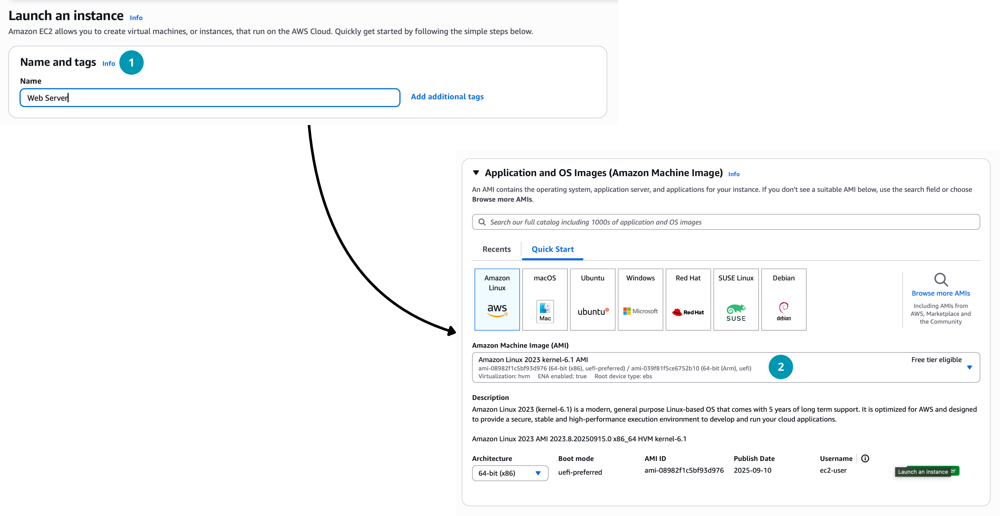
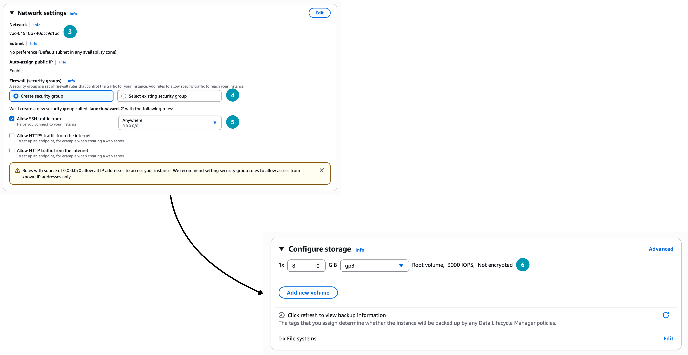
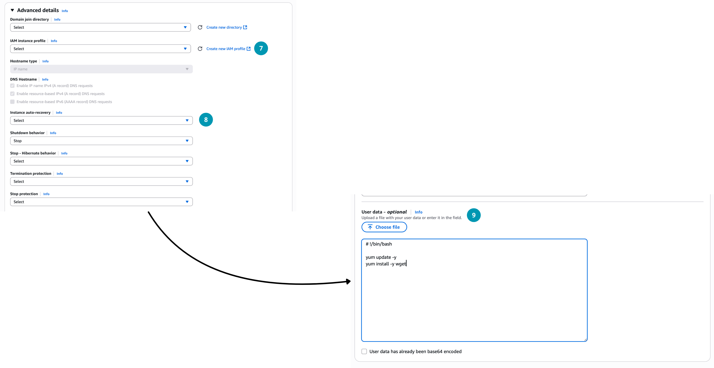

# Введение в вычислительные сервисы (Compute). AWS Elastic Compute Cloud (EC2)

<i>
Утро было тихим. Джон и Эмма сидели в кампусном кафе с ноутбуками, глядя на список сервисов AWS, открытый на экране. Пар из кружек с кофе тянулся вверх, словно облака, и в этом было что-то символичное.

– Представь, – сказал Джон, – что у нас есть стартап, и нам нужно запустить сайт. Мы можем купить сервер, поставить его в подвал университета и самим настраивать, охлаждать, чинить…

Эмма рассмеялась: – Или можем просто арендовать сервер в облаке и начать работать уже сегодня.

Джон кивнул: – Вот именно. Но сервер в облаке может быть разным. Иногда тебе дают полный контроль – это как арендовать целую квартиру с ключами от всех комнат. Иногда – только готовую кухню, где можно сразу готовить, но стены менять нельзя. А иногда – просто приносят готовое блюдо, и тебе остаётся лишь его есть.

Эмма прищурилась: – Это как IaaS, PaaS и SaaS, да?

– Да, – улыбнулся Джон. – Но в AWS есть ещё больше вариантов. Смотри: EC2, Lambda, Beanstalk… каждый из них решает задачу по-своему.

Она задумалась: – Значит, мы будем учиться выбирать правильный инструмент, чтобы не платить лишнего и не тратить время?

– Именно, – сказал Джон. – Сегодня мы начнём с EC2. Это как фундамент: виртуальные серверы, которые мы можем запускать, останавливать, настраивать. А дальше уже будем разбирать, когда стоит использовать другие сервисы.

Эмма вздохнула и улыбнулась: – Кажется, нас ждёт целая карта новых миров.

Они допили кофе, открыли консоль AWS и нажали на кнопку «Launch Instance». Так началось их первое настоящее путешествие в вычислительные облака.
</i>

## Содержание

- [Введение в вычислительные сервисы (Compute). AWS Elastic Compute Cloud (EC2)](#введение-в-вычислительные-сервисы-compute-aws-elastic-compute-cloud-ec2)
  - [Содержание](#содержание)
  - [Вопросы для самопроверки](#вопросы-для-самопроверки)
  - [Введение в облачные вычислительные сервисы](#введение-в-облачные-вычислительные-сервисы)
  - [Что такое Amazon EC2?](#что-такое-amazon-ec2)
  - [Запуск EC2 экземпляра](#запуск-ec2-экземпляра)
    - [1. Выбор Amazon Machine Image (AMI)](#1-выбор-amazon-machine-image-ami)
    - [2. Выбор типа экземпляра (Instance Type)](#2-выбор-типа-экземпляра-instance-type)
    - [3. Хранилище для экземпляра (Storage)](#3-хранилище-для-экземпляра-storage)
    - [4. Ключи доступа (SSH-ключи) и подключение](#4-ключи-доступа-ssh-ключи-и-подключение)
    - [5. Сетевые настройки (Network Settings)](#5-сетевые-настройки-network-settings)
    - [6. Группы безопасности (Security Groups)](#6-группы-безопасности-security-groups)
    - [7. Теги (Tags)](#7-теги-tags)
    - [8. IAM роли для экземпляров (IAM Roles for EC2) (опционально)](#8-iam-роли-для-экземпляров-iam-roles-for-ec2-опционально)
    - [9. Пользовательские данные (User Data) (опционально)](#9-пользовательские-данные-user-data-опционально)
    - [Запуск экземпляра](#запуск-экземпляра)
    - [Примеры запуска EC2 через AWS CLI и SDK](#примеры-запуска-ec2-через-aws-cli-и-sdk)
  - [Жизненный цикл EC2 экземпляра](#жизненный-цикл-ec2-экземпляра)
  - [Подключение к EC2 экземпляру](#подключение-к-ec2-экземпляру)
  - [Метаданные экземпляра](#метаданные-экземпляра)
  - [Мониторинг виртуальных машин при помощи CloudWatch](#мониторинг-виртуальных-машин-при-помощи-cloudwatch)
  - [Оптимизация затрат AWS EC2](#оптимизация-затрат-aws-ec2)
  - [Практическая часть. Создание экземпляра EC2](#практическая-часть-создание-экземпляра-ec2)
  - [Резюме](#резюме)

## Вопросы для самопроверки

После изучения этой главы вы сможете ответить на следующие вопросы:

1. Что такое вычислительные сервисы (Compute Services) и зачем они нужны?
2. Чем EC2 отличается от других сервисов AWS Compute (Lambda, Beanstalk, Fargate)?
3. Какие решения необходимо принять при запуске экземпляра EC2 (AMI, тип, хранилище, сеть, безопасность и т.д.)?
4. Какие типы экземпляров EC2 существуют и под какие задачи они оптимизированы?
5. Чем отличается EBS от Instance Store и какие сценарии у них?
6. Какие бывают модели оплаты EC2 и когда их использовать?
7. Как устроен жизненный цикл экземпляра EC2?
8. Что такое Security Groups и какую роль они играют?

## Введение в облачные вычислительные сервисы

Первая категория облачных сервисов, с которой логично начать знакомство, — это _вычислительные сервисы_ (Compute Services).

_Вычислительные сервисы (Compute Services)_ предоставляют мощность процессоров, память и базовые ресурсы для запуска приложений. Вместо того чтобы закупать собственные вычислительные ресурсы, можно «арендовать» виртуальные серверы в облаке [^1]. Одним из наиболее распространённых примеров таких сервисов является аренда виртуальных машин (VM), которые имитируют работу физических серверов и позволяют устанавливать на них операционные системы и прикладное программное обеспечение.

В AWS к вычислительным сервисам относятся:

- _AWS EC2 (Elastic Compute Cloud)_ — сервис для аренды виртуальных машин с возможностью гибкой настройки ресурсов.
- _AWS Lambda_ — сервис для запуска кода без управления серверами (serverless).
- _AWS Elastic Beanstalk_ — платформа как сервис (PaaS) для развертывания и управления приложениями. Вы используете Beanstalk, когда хотите сосредоточиться на коде, а не на инфраструктуре.
- _Amazon ECS/EKS_ — сервисы для управления контейнерами.
- _AWS LightSail_ — упрощённый сервис для быстрого развертывания виртуальных серверов и приложений.
- _AWS Fargate_ — сервис для запуска контейнеров без управления серверами.

Данные сервисы различаются уровнем абстракции и управляемости: EC2 даёт в ваше распоряжение целый виртуальный сервер, требуя управления ОС и окружением, тогда как Lambda исполняет код без управления сервером, а Beanstalk автоматизирует развертывание приложений, управляя инфраструктурой за вас (вы не управляете ОС напрямую, а просто загружаете код).

Обычно перед новичками возникает вопрос: _«Когда использовать тот или иной сервис?»_. Выбор зависит от нескольких факторов:

- архитектура приложения (application design);
- шаблоны использования (usage patterns), то есть как часто и в каком объёме будут использоваться ресурсы;
- уровень контроля, который вы хотите иметь над конфигурацией (which configuration settings will you want to manage?).

Неправильный выбор (например, использование EC2 там, где подойдет Lambda) может привести к избыточным затратам и потерям в производительности, так как вы будете платить за ресурсы, которые не используете эффективно.

В контексте данной лекции мы сосредоточимся на _Amazon EC2_ — одном из самых популярных и универсальных вычислительных сервисов AWS.

## Что такое Amazon EC2?

_Amazon Elastic Compute Cloud (EC2)_ – это облачный сервис AWS, позволяющий арендовать виртуальные выделенные серверы («экземпляры») по модели инфраструктуры как сервиса (IaaS). EC2 предоставляет пользователям гибкость в создании, запуске, остановке и удалении виртуальных машин по запросу с оплатой только за фактическое время работы (эластичность облака). Иными словами, EC2 – это не физические серверы, а масштабируемые виртуальные машины в облаке, полностью настраиваемые под нужды пользователя.

При использовании EC2 вы получаете полный доступ к гостевой ОС (Windows или Linux), как если бы это был физический сервер.

Amazon EC2 можно использовать для различных целей:

- Веб-серверы. Размещение веб-сайтов и веб-приложений.
- Прокси-серверы. Обработка и маршрутизация запросов.
- Серверы приложений. Запуск бизнес-логики и обработка данных.
- Серверы баз данных. Хранение и управление данными.
- Вычислительные серверы для научных расчетов. Выполнение сложных вычислений.
- Игровые серверы. Хостинг многопользовательских игр.
- И многое другое.

Как было сказано ранее, запустить виртуальную машину в EC2 можно используя консоль, командную строку или SDK. В следующем разделе рассмотрим ключевые решения, которые необходимо принять при запуске.

## Запуск EC2 экземпляра

_EC2 экземляр_ - это виртуальная машина, запущенная в облаке AWS. Каждый экземпляр имеет свою конфигурацию: операционную систему, тип процессора, объём памяти, хранилище и сетевые настройки. Часто экземпляры называют _инстансами_ (instances). В данном теме мы будем использовать слово "экземпляр".

Запустить EC2-экземпляр виртуальной машины можно несколькими способами:

- через _AWS Management Console_ (веб-интерфейс),
- с помощью _AWS CLI_ (командная строка),
- используя _AWS SDK_ (например, библиотеку Boto3 для Python).

Для начала рассмотрим запуск с использованием AWS Management Console, так как этот способ наиболее нагляден и удобен для пользователей, которые только начинают работать с AWS.

<center>


_Рисунок 1. Меню создания нового EC2 экземпляра в AWS Management Console_

</center>

При запуске EC2 экземпляра необходимо принять 9 ключевых решений.

### 1. Выбор Amazon Machine Image (AMI)

_Amazon Machine Image (AMI)_ – шаблон (образ) для создания экземпляров. AMI содержит предустановленную операционную систему и, при необходимости, дополнительное программное обеспечение. При запуске экземпляра вы выбираете AMI, на основе которой будет развернута ваша виртуальная машина [^2]. AMI определяет, какая ОС (Linux, Windows, etc.) и стартовый набор ПО будет на экземпляре при запуске.

AWS предлагает базовые образы популярных систем:

- Amazon Linux
- Red Hat Enterprise Linux
- Mac OS
- CentOS
- Ubuntu
- Windows Server
- другие...

При выборе AMI можно использовать:

1. _Quick Start AMIs_ – стандартные образы от AWS, описанные выше.
2. _My AMIs_ – созданные вами образы.
3. _AWS Marketplace AMIs_ – образы с предустановленным ПО от сторонних поставщиков.
4. _Community AMIs_ – образы, созданные сообществом AWS.

Выбор AMI зависит от ваших потребностей – например, для веб-сервера может подойти _Amazon Linux_ или _Ubuntu_.

> Amazon Linux это оптимизированный для AWS дистрибутив Linux, предоставляемый бесплатно и поддерживаемый AWS. Он регулярно обновляется и включает интеграцию с сервисами AWS, что делает его популярным выбором для запуска приложений в облаке.

Чтобы создать собственный AMI, сначала необходимо запустить и настроить экземпляр виртуальной машины (установить программное обеспечение, задать параметры), а затем создать из него AMI. При этом AWS автоматически создаёт AMI Snapshot — снимок тома хранения, содержащий все настройки и данные. Этот образ можно затем использовать для запуска новых экземпляров с уже предустановленным и настроенным ПО. На рисунке 2 представлена схема процесса создания нового Amazon Machine Image (AMI) в облаке AWS.

<center>


_Рисунок 2. Процесс создания и распространения Amazon Machine Image (AMI) в AWS_

</center>

Также AWS предоставляет инструменты для импорта существующих виртуальных машин из on-premise среды в виде AMI. Например, вы переходите с физического сервера на облако и хотите сохранить текущее состояние системы.

### 2. Выбор типа экземпляра (Instance Type)

_Тип экземпляра (Instance Type)_ – аппаратная конфигурация, которую получит запущенный EC2-экземпляр. AWS предлагает множество типов, которые различаются количеством vCPU (виртуальных ядер процессора), объёмом оперативной памяти, пропускной способностью сети, а также доступными вариантами хранилища (SSD/HDD, сеть или локальный диск) и другими характеристиками.

Каждый тип экземпляра имеет название, например, `t2.micro`, `m5.large`, `c5.xlarge`. Название состоит из трёх частей:

- Семейство (Family) – обозначается первой буквой (t, m, c, r, i и т.д.), указывающей на основное назначение экземпляра.
- Поколение (Generation) – цифра после буквы (например, 2, 3, 4, 5), обозначающая поколение экземпляра.
- Размер (Size) – указывает на размер экземпляра (micro, small, medium, large, xlarge и т.д.), что влияет на количество ресурсов.

Семейства экземпляров сгруппированы по типичным сценариям использования:

| Семейство                                                         | Назначение                                                                                                                                     | Примеры использования                                                                                                                                                                       | Примечание                                                                                                                                                                                                                                                                                                                                                                                                                                      |
| ----------------------------------------------------------------- | ---------------------------------------------------------------------------------------------------------------------------------------------- | ------------------------------------------------------------------------------------------------------------------------------------------------------------------------------------------- | ----------------------------------------------------------------------------------------------------------------------------------------------------------------------------------------------------------------------------------------------------------------------------------------------------------------------------------------------------------------------------------------------------------------------------------------------- |
| Общего назначения (General Purpose) (`t`, `m`)                    | Сбалансированные по CPU/RAM, подходят для многих задач.                                                                                        | Веб-серверы, базы данных, приложения общего назначения.                                                                                                                                     | Особо стоит упомянуть T-серию (t2, t3, t4g) – это burstable экземпляры, которые предназначены для нагрузок с переменными всплесками активности. Они предоставляют базовый уровень производительности CPU с возможностью «взрывного» увеличения мощности при необходимости. Простыми словами, если ваше приложение не требует постоянной высокой производительности, а имеет периоды интенсивной работы, T-серия может быть экономичным выбором. |
| Оптимизированные для вычислений (Compute Optimized) (`c`)         | Обладают повышенной вычислительной мощностью CPU при относительно меньшем объёме памяти.                                                       | Подходят для задач, требовательных к производительности процессора: высокопроизводительная обработка данных, рендеринг, научные расчёты, транзакционные серверы, некоторые игровые серверы. | Например, `c5.xlarge` имеет больше ядер CPU при меньшей памяти, оптимизируя стоимость за вычислительный ресурс                                                                                                                                                                                                                                                                                                                                  |
| Оптимизированные для памяти (Memory Optimized) (`r`, `x`, `z`)    | Обеспечивают большой объём RAM на ядро CPU.                                                                                                    | Идеальны для приложений, требующих интенсивной работы с памятью: базы данных в памяти (in-memory databases), аналитика больших данных, кэширование, высокопроизводительные базы данных.     | Например, `r5.large` предлагает больше памяти на ядро CPU, что полезно для приложений с большими объёмами данных в памяти                                                                                                                                                                                                                                                                                                                       |
| Оптимизированные для хранения (Storage Optimized) (`i`, `d`, `h`) | Предлагают высокопроизводительное локальное хранилище (SSD/HDD) с низкой задержкой.                                                            | Идеально для задач, интенсивно работающих с диском: распределённые файловые системы, системы анализа больших данных (Hadoop, Spark), NoSQL СУБД, требующие низких задержек к хранилищу.     | Например, `i3.4xlarge` имеет несколько NVMe-SSD на борту для экстремально быстрого доступа к данным.                                                                                                                                                                                                                                                                                                                                            |
| Ускоренные вычисления (Accelerated Computing) (`p`, `g`, `f`)     | Семейства с аппаратным ускорением: `p` (GPU для машинного обучения и графики), `g` (GPU для графики), `f` (FPGA для специализированных задач). | Подходят для задач, требующих параллельных вычислений: машинное обучение, рендеринг видео, научные симуляции, криптография.                                                                 | Такие экземпляры оснащены либо графическими процессорами NVIDIA (как p3, g4dn и др.) для тренировки нейронных сетей. Это узкоспециализированные и дорогие ресурсы, используемые когда требуется аппаратное ускорение.                                                                                                                                                                                                                           |
| Высокопроизводительные вычисления (HPC) (`hpc6a`, `hpc6id`)       | Оптимизированы для высокопроизводительных вычислений с низкой задержкой и высокой пропускной способностью сети.                                | Используются в научных исследованиях, моделировании, финансовом анализе, биоинформатике.                                                                                                    | -                                                                                                                                                                                                                                                                                                                                                                                                                                               |

На рисунке 3 представлена таблица с примерами типов экземпляров семейства t3 в Amazon EC2. В таблице указаны ключевые параметры для каждого типа: количество виртуальных процессоров (vCPU), объём оперативной памяти (Memory, GB) и тип доступного хранилища (Storage). Все приведённые варианты используют только блочное хранилище EBS (Elastic Block Store).

<center>


_Рисунок 3. Таблица с характеристиками экземпляров семейства t3 в Amazon EC2_

</center>

### 3. Хранилище для экземпляра (Storage)

В AWS EC2 доступны несколько вариантов хранения данных:

_Amazon EBS (Elastic Block Store)_ – сетевое блочное хранилище. EBS-том представляет собой сетевой «_виртуальный диск_», который можно подключить к экземпляру (аналогично подключению физического диска к серверу). _Важное свойство EBS – долговременность_: данные на EBS томе сохраняются независимо от жизненного цикла экземпляра. Даже если экземпляр остановлен, то данные на EBS сохраняются. EBS поддерживает создание снимков (snapshots) для резервного копирования и восстановления данных.

_Instance Store (Ephemeral Storage)_ - эфемерное локальное хранилище, которое предоставляется некоторыми типами экземпляров и связано с физическим хостом, на котором запущен экземпляр. Это, как правило, локальный SSD или HDD, непосредственно подключённый к серверу. Instance Store обеспечивает очень высокую скорость I/O и низкие задержки, но не является постоянным: данные на нём существуют только пока работает данный экземпляр на конкретном хосте. Если экземпляр останавливается или завершается, _данные instance store теряются_ (также они не переносятся при миграции экземпляра на другой хост). Поэтому instance store подходит только для временных данных – кешей, буферов, промежуточных результатов вычислений.

Можно использовать _другие типы хранилищ_, но на них будут храниться только данные, а не ОС:

- _Amazon S3 (Simple Storage Service)_ – объектное хранилище для хранения и извлечения любых объёмов данных. S3 не является блочным хранилищем, поэтому его нельзя использовать как диск для ОС, но можно использовать для хранения файлов, резервных копий, статического контента.
- _Amazon EFS (Elastic File System)_ – сетевое файловое хранилище, которое можно монтировать на несколько экземпляров одновременно. EFS подходит для совместного доступа к файлам между несколькими экземплярами.

При запуске экземпляра EC2 необходимо выбрать:

- Тип хранилища (EBS или Instance Store).
- Корневой том (_root volume_) – том, на котором установлена ОС. Обычно это EBS-том.
- Дополнительные тома (если нужны) – можно добавить дополнительные EBS-тома

_Для каждого тома можно указать_:

- Размер (в ГБ).
- Тип тома (SSD, HDD и т.д.).
- Будет ли том удалён при завершении экземпляра.
- Будет ли том зашифрован. Шифрование обеспечивает безопасность данных на уровне хранения.

На рисунке 4 показаны варианты подключения хранилища к экземплярам Amazon EC2. _Слева изображено блочное хранилище Amazon Elastic Block Store (EBS)_, где могут быть тома различного размера (например, 20 ГБ или 500 ГБ). _Справа изображено Instance Store_ — временное локальное хранилище, физически связанное с хост-компьютером.

<center>


_Рисунок 4. Варианты использования Amazon EBS и Instance Store для экземпляров EC2_

</center>

### 4. Ключи доступа (SSH-ключи) и подключение

EC2 не использует пароли для входа на Linux-экземпляры по соображениям безопасности. Вместо этого используется пара ключей SSH (Secure Shell):

- _Приватный ключ_ (private key) – _хранится у вас на локальной машине_ и используется для аутентификации.
- _Публичный ключ_ (public key) – _хранится в AWS_. Загружается на экземпляр при его создании.

При создании экземпляра вы выбираете существующую _ключевую пару_ или создаёте новую. Приватный ключ скачивается в виде файла `.pem`, который нужно хранить в безопасности, а открытый ключ регистрируется в AWS и автоматически добавляется в файл авторизованных ключей на вновь запущенном экземпляре (например, в `~/.ssh/authorized_keys`).

Для подключения по SSH к экземпляру пользователь использует приватный ключ – таким образом проходит аутентификация. _Без приватного ключа получить доступ к экземпляру невозможно_, поэтому его надо хранить надёжно. AWS не хранит приватные ключи – только открытые. При запуске экземпляра указывается имя Key Pair, которая будет использоваться для доступа.

В Windows-экземплярах схема похожая: ключевая пара применяется для дешифровки автоматически сгенерированного пароля администратора в системе. Простыми словами, при первом запуске Windows-экземпляра AWS генерирует пароль администратора, шифрует его с помощью публичного ключа из выбранной Key Pair и сохраняет в системе. Пользователь скачивает приватный ключ и использует его для дешифровки пароля администратора через консоль AWS. Таким образом, доступ к Windows-экземпляру также защищён с помощью ключевой пары.

### 5. Сетевые настройки (Network Settings)

Каждый EC2-экземпляр запускается в определённой виртуальной сети AWS – VPC (Virtual Private Cloud) – и в конкретной подсети внутри этой VPC (привязанной к зоне доступности, одна подсеть - одна зона доступности).

По умолчанию AWS предоставляет _Default VPC_ в каждом регионе – это готовая виртуальная сеть, в которой можно сразу запускать экземпляры. Вы можете выбрать default VPC и одну из её подсетей (например, подсеть, расположенную в конкретной Availability Zone). Сетевые настройки определяют, будет ли экземпляриметь публичный IP-адрес (для доступа из интернета) или только внутренний адрес, и в какой сегмент сети он попадёт. Например, можно указать _Auto-assign Public IP = Enable_, чтобы AWS автоматически выдала экземпляру публичный IP для доступа извне, или отключить это, если экземплярдолжен быть доступен только внутри приватной сети.

Однако при перезапуске экземпляра ему назначается новый публичный IP-адрес (если эта опция была включена). Чтобы закрепить за экземпляром постоянный внешний адрес, используется _Elastic IP_ — статический IP-адрес, который можно привязать к любому экземпляру. _На один акаунт AWS выделяется до 5 Elastic IP бесплатно_, но если вы не используете его (не привязываете к экземпляру), то за него взимается плата.

Тема виртуальных сетей (VPC) и подсетей (Subnets) будет рассмотрена отдельно, так как она достаточно обширна и требует детального изучения.

> Чтобы легче понять концепцию, Virtual Private Cloud (VPC) можно представить как обычную физическую сеть в вашем собственном дата-центре. Она объединяет серверы, маршрутизаторы и другие устройства. Разница лишь в том, что в AWS эта сеть полностью виртуальная, но принципы работы — такие же, как в привычной локальной сети, подключённой к вашему компьютеру.

На рисунке 5 показано размещение экземпляра EC2 внутри виртуальной сети VPC:

- _Public Subnet_ — подсеть с доступом в интернет, обычно используется для веб-серверов и приложений, которые должны быть доступны пользователям.
- _Private Subnet_ — подсеть без прямого доступа в интернет, чаще применяется для баз данных или внутренних сервисов.

<center>


_Рисунок 5. Размещение EC2-экземпляра в VPC и подсетях (Public и Private)_

</center>

### 6. Группы безопасности (Security Groups)

_Security Group_ важнейшний компонент безопасности в AWS, действующий как виртуальный файрвол для управления входящим и исходящим трафиком к вашим EC2-экземплярам.

Каждому экземпляру можно назначить одну или несколько групп безопасности. Каждая группа безопасности содержит набор правил, определяющих, какой трафик разрешён или запрещён.

Правила групп безопасности бывают двух типов:

- _Inbound rules_ – правила для входящего трафика (какие порты и протоколы разрешены для доступа к экземпляру извне).
- _Outbound rules_ – правила для исходящего трафика (какие порты и протоколы разрешены для выхода из экземпляра в интернет или другие ресурсы).

Правила групп безопасности состоят из следующих параметров:

- Port Number (номер порта, например, 22 для SSH, 80 для HTTP, 443 для HTTPS).
- Protocol (протокол, например, TCP, UDP, ICMP).
- Source/Destination (источник или назначение трафика, например, IP-адрес, диапазон IP-адресов или другая группа безопасности).

Например, чтобы разрешить доступ по SSH к Linux-экземпляру, нужно добавить правило в Inbound Rules:

| Type | Protocol | Port Range | Source    |
| ---- | -------- | ---------- | --------- |
| SSH  | TCP      | 22         | 0.0.0.0/0 |

> 0.0.0.0/0 – это специальный адрес, обозначающий "все IP-адреса". Это значит, что доступ по SSH разрешён с любого IP-адреса в интернете. Такой подход удобен для тестирования, но небезопасен для продакшн-среды. В реальных условиях рекомендуется ограничивать доступ только доверенными IP-адресами или диапазонами (например, вашим офисным IP).

По умолчанию, группы безопасности блокируют весь входящий трафик и разрешают весь исходящий. Это обеспечивает базовый уровень безопасности, и вы можете настраивать правила по мере необходимости. То есть если не указывать никаких правил, то к вашему экземпляру никто не сможет подключиться извне ни по какому порту.

### 7. Теги (Tags)

_Теги (Tags)_ – это метаданные в виде пар «ключ-значение», которые можно присваивать ресурсам AWS, включая EC2-экземпляры. Тег, который всегда рекомендуется добавлять при создании экземпляра, — это `Name`, позволяющий задать удобочитаемое имя для ресурса.

Теги полезны для: фильтрации ресурсов в консоли, автоматизации процессов, распределения затрат (cost allocation) и контроля доступа (access control). Например, можно использовать теги для группировки ресурсов по проектам, окружениям (production, staging, development).

### 8. IAM роли для экземпляров (IAM Roles for EC2) (опционально)

_IAM роли_ позволяют предоставлять EC2-экземплярам временные права доступа к другим сервисам AWS без необходимости хранения долгосрочных учетных данных (паролей или ключей) на самом экземпляре (что является плохой практикой безопасности).

Например, если вашему приложению на экземпляре нужно читать данные из другого сервиса AWS, например, базы данных или хранилища, то вы можете создать IAM роль с необходимыми правами, например, `разрешить-только-чтение`, и назначить эту роль вашему экземпляру. AWS автоматически предоставит временные учетные данные для доступа к сервисам, когда приложение на экземпляре будет их запрашивать.

Если роль не назначена, экземплярпо умолчанию не имеет прав для доступа к ресурсам AWS. Поэтому для production-сценариев, где EC2 взаимодействует с другими сервисами (БД, хранилища, очереди и т.д.), шаг назначения IAM-ролей важен для обеспечения безопасности и удобства.

### 9. Пользовательские данные (User Data) (опционально)

Перед финальным запуском AWS Console предлагает раздел Advanced Details, где, среди прочего, есть поле _User Data_.

_User Data_ – это скрипт или данные, которые передаются экземпляру и выполняются при первом старте (boot) виртуальной машины. Обычно туда помещают bash-скрипт (для Linux) или PowerShell (для Windows) с инструкциями автоматической настройки сервера. Например, в User Data можно прописать установку необходимых пакетов, настройку окружения, запуск приложений и т.д.

Данный скрипт выполняется только один раз (_с повышенными привилегиями root_) при первом запуске экземпляра. Это позволяет автоматизировать процесс настройки и избежать необходимости вручную настраивать каждый новый экземпляр. _Пример_: можно указать User Data, который устанавливает веб-сервер Apache и запускает его.

> Если вы перезапустите экземпляр, скрипт не выполнится повторно (если не задать специальные флаги cloud-init).

На рисунке 6 показан пример использования User Data при запуске экземпляра EC2. Этот скрипт выполняет обновление системы и устанавливает утилиту _wget_.

<center>


_Рисунок 6. Использование User Data для автоматической настройки EC2-экземпляра при запуске_

</center>

### Запуск экземпляра

После того как все параметры выбраны, можно запустить экземпляр, нажав кнопку _Launch_. AWS создаст виртуальную машину с заданными характеристиками и запустит её. В консоли появится новый экземплярсо статусом _running_.

### Примеры запуска EC2 через AWS CLI и SDK

Выше мы рассмотрели запуск через графическую консоль. Однако, EC2-экземпляры можно создавать и программно – с помощью инструментов, что важно для автоматизации (Infrastructure as Code, скрипты деплоя и т.д.). Рассмотрим кратко, как запустить тот же экземпляриспользуя AWS CLI и AWS SDK для Node.js.

_AWS CLI (Command Line Interface)_ – это утилита, позволяющая управлять AWS-сервисами через командную строку. Предположим, мы хотим программно создать экземплярс параметрами, аналогичными описанным выше (AMI, тип, сеть, ключ, security group). Минимальный набор параметров для команды запуска включает:

- ID AMI,
- Тип экземпляра,
- Security group,
- Пара ключей.

Пример команды AWS CLI для запуска экземпляра:

```bash
aws ec2 run-instances \
    --image-id ami-0123456789abcdef0 \
    --instance-type t2.micro \
    --count 1 \
    --security-group-ids sg-0abc12d345ef67890 \
    --key-name MyKeyPair
```

Эта команда создаст и запустит один экземпляр `t2.micro` с указанным AMI, в заданной security group и с ключевой парой `MyKeyPair`.

Для остановки и удаления экземпляра используются команды `stop-instances` и `terminate-instances` соответственно.

```bash
# Остановка экземпляра
aws ec2 stop-instances --instance-ids i-0123456789abcdef0

# Удаление экземпляра
aws ec2 terminate-instances --instance-ids i-0123456789abcdef0
```

Для просмотра дополнительных параметров и опций можно использовать команду `aws ec2 help`.

Еще один способ программного управления EC2 – использование _AWS SDK_ для различных языков программирования. Рассмотрим пример на Node.js с использованием библиотеки `aws-sdk`.

Предположим, у нас настроены AWS креденшалы и регион, и мы хотим программно создать экземпляр. Для этого используется метод runInstances из класса EC2. Пример кода:

```javascript
const AWS = require("aws-sdk");

// Инициализируем регион (например, us-east-1)
AWS.config.update({ region: "us-east-1" });

// Создаем объект EC2
const ec2 = new AWS.EC2({ apiVersion: "2016-11-15" });

// Параметры запуска экземпляра
const params = {
  ImageId: "ami-0123456789abcdef0", // ID AMI
  InstanceType: "t2.micro", // тип экземпляра
  KeyName: "MyKeyPair", // ключевая пара для доступа
  MinCount: 1,
  MaxCount: 1, // запускаем 1 экземпляр
  SecurityGroupIds: ["sg-0abc12d345ef67890"], // группа безопасности
  SubnetId: "subnet-1a2b3c4d", // подсеть VPC
  UserData: Buffer.from("#!/bin/bash\nsudo yum update -y").toString("base64"),
  // (опционально) скрипт user-data, закодированный Base64
};

// Вызываем запуск экземпляра
ec2.runInstances(params, function (err, data) {
  if (err) {
    console.error("Ошибка запуска EC2:", err);
  } else {
    const instanceId = data.Instances[0].InstanceId;
    console.log("экземплярзапущен, ID:", instanceId);

    // Далее можно, например, назначить теги к экземпляру:
    const tagParams = {
      Resources: [instanceId],
      Tags: [{ Key: "Name", Value: "MyServer" }],
    };
    ec2.createTags(tagParams, (err) => {
      if (err) console.log("Не удалось добавить тег:", err);
      else console.log("Тег Name добавлен для", instanceId);
    });
  }
});
```

## Жизненный цикл EC2 экземпляра

После того, как экземпляр запущен, он проходит через несколько состояний в своём жизненном цикле [^4]:

| Состояние       | Описание                                                                      |
| --------------- | ----------------------------------------------------------------------------- |
| `pending`       | Экземпляр создаётся и запускается.                                            |
| `running`       | Экземпляр запущен и работает.                                                 |
| `stopping`      | Экземпляр останавливается (останавливается работа ОС).                        |
| `stopped`       | Экземпляр остановлен, но ресурсы (EBS тома) сохраняются. Можно перезапустить. |
| `shutting-down` | Экземпляр завершается (удаляется).                                            |
| `terminated`    | Экземпляр удалён, ресурсы освобождены. Данные на Instance Store теряются.     |
| `rebooting`     | Экземпляр перезагружается (перезапуск ОС без изменения состояния).            |

На рисунке 6 показан жизненный цикл экземпляра EC2 и его возможные состояния.

- После выбора AMI и запуска экземплярпереходит в состояние `pending` (инициализация).
- Когда экземпляр готов к работе, он переходит в состояние `running`.
- Из состояния `running` можно:
  - выполнить Reboot (перезапуск),
  - выполнить Stop или Hibernate, при этом экземплярперейдёт в состояния `stopping` → `stopped`,
  - либо завершить работу полностью (Terminate), тогда он проходит через состояние `shutting-down` и переходит в `terminated`.

Блок справа с пунктирной рамкой указывает на то, что состояния `stopping` и `stopped` доступны только для экземпляров, использующих Amazon Elastic Block Store (EBS) как корневой том.

Это означает:

- Если экземпляр основан на EBS, его можно останавливать и снова запускать без потери данных на диске.
- Если же используется _Instance Store_ (временное локальное хранилище), то остановка недоступна — при завершении экземпляра данные будут потеряны.

<center>


_Рисунок 7. Жизненный цикл EC2-экземпляра и поддержка остановки для экземпляров с Amazon EBS_

</center>

## Подключение к EC2 экземпляру

После запуска экземпляра можно подключиться к нему для управления и настройки. Способ подключения зависит от операционной системы экземпляра. Рассмотрим операционную систему Linux, так как она наиболее распространена для серверных задач.

Для подключения к Linux-экземпляру используется протокол SSH (Secure Shell). Когда вы создавали экземпляр, вы указали ключевую пару (Key Pair) для доступа и сохранили приватный ключ на локальной машине (файл `.pem`).

_Шаги для подключения_:

1. Убедитесь, что у вас установлен SSH-клиент (выполните команду `ssh` в терминале).
2. Проверьте права доступа к файлу с приватным ключом. Он должен быть доступен только для чтения владельцем:
   ```bash
    chmod 400 MyKeyPair.pem
   ```
3. Подключитесь к экземпляру, используя команду:
   ```bash
   ssh -i /path/to/MyKeyPair.pem ec2-user@<Public-IP-Address>
   ```
   Здесь:
   - `/path/to/MyKeyPair.pem` – путь к вашему приватному ключу.
   - `ec2-user` – имя пользователя по умолчанию для Amazon Linux. Для других дистрибутивов могут использоваться другие имена (например, `ubuntu` для Ubuntu, `centos` для CentOS).
   - `<Public-IP-Address>` – публичный IP-адрес вашего экземпляра (можно найти в консоли AWS).

Если всё настроено правильно, вы подключитесь к вашему экземпляру и попадёте в командную строку Linux.

> Если соединение не удаётся, проверьте настройки Security Group – убедитесь, что в _Inbound Rules_ разрешён доступ по SSH (порт 22).

## Метаданные экземпляра

Каждый EC2-экземпляримеет служебные данные (метаданные), доступные по специальному внутреннему адресу `http://169.254.169.254/latest/meta-data/`. Там можно посмотреть ID экземпляра, VPC, подсеть, публичный/приватный IP, привязанные security-groups и многое другое.

Например, из ОС можно выполнить `curl http://169.254.169.254/latest/meta-data/instance-id` и получить ID.

Часто метаданные используются приложениями для получения информации о среде выполнения, например, для настройки подключения к другим сервисам AWS.

> Важно: доступ к этому адресу возможен только изнутри самого экземпляра, что обеспечивает безопасность.

## Мониторинг виртуальных машин при помощи CloudWatch

AWS предоставляет встроенные инструменты для мониторинга экземпляров EC2. Один из основных сервисов – _Amazon CloudWatch_, который собирает и отображает метрики производительности, такие как загрузка CPU, использование памяти, сетевой трафик, дисковая активность и другие параметры.

Данный сервис позволяет настраивать оповещения (alarms) при достижении определённых порогов, что помогает своевременно реагировать на проблемы с производительностью или доступностью.

Для просмотра метрик необходимо зайти в консоль CloudWatch и выбрать соответствующий EC2-экземпляр. Там можно увидеть графики с историей изменений метрик и настроить уведомления по email или SMS.

## Оптимизация затрат AWS EC2

EC2 предлагает различные модели оплаты, позволяющие оптимизировать затраты в зависимости от сценариев использования, основные методы оплаты были рассмотрены в предыдущих лекциях. Вспомним основные из них:

1. _On-Demand Instances_ – оплата за фактическое время работы по почасовой или поминутной ставке.
2. _Reserved Instances (RI)_ – покупка экземпляров на длительный срок (1 или 3 года) с существенной скидкой (до 75%) по сравнению с On-Demand.
3. _Spot Instances_ – использование неиспользуемых ресурсов AWS по значительно сниженной цене (до 90% дешевле).

Есть еще два типа оплаты, которые менее распространены:

1. _Dedicated Hosts_ – выделенные физические серверы для запуска экземпляров. Позволяют использовать существующие лицензии ПО и обеспечивают изоляцию на уровне оборудования. Подходит для специфических требований безопасности и соответствия.
2. _Dedicated instances_ - экземпляры запускаются на выделенном оборудовании, но не предоставляют полный контроль над хостом, как Dedicated Hosts. Подходит для тех, кто хочет изоляцию на уровне оборудования без необходимости управления самим хостом.

Выбор модели оплаты зависит от характера нагрузки и требований к доступности:

| On-Demand (По требованию)                                                                                    | Spot (Спотовые)                                                                                                                                                                                               | Reserved (Резервированные)                                                                                                                                                                                               | Dedicated Hosts (Выделенные хосты)                                                                                                                                |
| ------------------------------------------------------------------------------------------------------------ | ------------------------------------------------------------------------------------------------------------------------------------------------------------------------------------------------------------- | ------------------------------------------------------------------------------------------------------------------------------------------------------------------------------------------------------------------------ | ----------------------------------------------------------------------------------------------------------------------------------------------------------------- |
| • Краткосрочные, всплескообразные или непредсказуемые нагрузки <br> • Разработка или тестирование приложений | • Приложения с гибкими временем запуска и завершения <br> • Приложения, выгодные только при очень низкой цене вычислений <br> • Пользователи с срочной потребностью в больших объёмах дополнительной мощности | • Постоянные или предсказуемые нагрузки <br> • Приложения, которым требуется зарезервированная мощность, включая аварийное восстановление <br> • Пользователи, готовые внести авансовый платёж для снижения общих затрат | • Использование собственных лицензий (BYOL) <br> • Соответствие требованиям регуляторов <br> • Учёт использования и лицензий <br> • Контроль размещения экземпляров |

Сам AWS выделяет четыре столпа оптимизации стоимости:

1. _Right-Size - Правильный выбор размеров ресурсов_. Подбирайте тип и число экземпляров, соответствующие реальным потребностям: CPU, память, диск и сеть. Используйте метрики CloudWatch, чтобы оценить загрузку: если экземплярпростаивает, имеет смысл его «понизить» или использовать спотовые опции. Затем, после выравнивания нагрузки, рассмотрите покупку Reserved-экземпляров для предсказуемой нагрузки.
2. _Increase Elasticity - Повышение эластичности_. Останавливайте или гиберните экземпляры, которые не используются постоянно (например, окружения разработки). Настраивайте автоматическое масштабирование (Auto Scaling), чтобы динамически добавлять/убирать экземпляры в зависимости от нагрузки. Это означает, что вы платите только за ресурсы в моменты высокой нагрузки.
3. _Optimal Pricing Model - Комбинируйте типы экземпляров_. On-Demand для непредсказуемых пиков, Spot для фоновых/гибких задач, Reserved для постоянной нагрузки. Используйте графики, чтобы выбрать правильный вариант оплаты для каждого сценария. Например, для долгосрочного проекта выгодны Reserved с оплатой вперёд, а для краткосрочных тестов – On-Demand.
4. _Optimize Storage Choices - Оптимизация хранилищ_. Подбирайте наиболее экономичные типы хранилища, уменьшая размер дисков по необходимости и удаляя ненужные снапшоты. Например, для редко используемых данных можно пересмотреть класс EBS (перейти со SSD на HDD) или перенести старые файлы в архивное хранилище.

## Практическая часть. Создание экземпляра EC2

Для создания и запуска экземпляра EC2 выполните следующие шаги:

1. Войдите в AWS Management Console и перейдите в сервис EC2.
2. Нажмите кнопку _Launch Instance_ для создания нового экземпляра.
3. В поле `Name` задайте имя экземпляра (например, "Web Server"). Это имя удобно использовать для идентификации в консоли (1).
4. Выберите Amazon Machine Image (AMI) — шаблон с предустановленной операционной системой и программным окружением. В примере выбран Amazon Linux 2023 (2).

    

    _Рисунок 8. Задание имени и выбор AMI для нового EC2-инстанса_

5. Определите *Network (VPC)* и *Subnet*, где будет развернут инстанс. Можно включить автоматическое назначение публичного IP (3).
6. Создайте или выберите *Security Group* — набор правил брандмауэра (4).
   1. В примере открыт доступ по SSH (порт 22) из любых источников (0.0.0.0/0). Для реальных проектов рекомендуется ограничивать доступ только доверенными IP-адресами (5).
7. Выберите EBS в качестве типа хранилища и укажите необходимый размер (например, 8 ГБ) (6). 

    

    _Рисунок 9. Настройка сети, групп безопасности и хранилища для EC2-экземпляра_

8. Создайте Key Pair для доступа по SSH. Скачайте приватный ключ и сохраните его в безопасном месте. Рекомендуется сохранить ключ в директории `~/.ssh`.
9. (Опционально) Укажите IAM-роль для доступа к другим сервисам AWS (7).
10. (Опционально) Укажите дополнительные параметры, некоторые из них (8):
    1. *Instance auto-recovery*. Автоматическое восстановление при сбоях.
    2. *Shutdown behavior*. По умолчанию при остановке экземпляра он переходит в состояние `stopped`, но можно изменить на `terminate`, чтобы экземпляр удалялся при остановке.
    3. *Termination protection*. Защита от случайного удаления экземпляра. При попытке завершить экземпляр появится предупреждение.
    4. *Stop protection*. Защита от случайной остановки экземпляра. При попытке остановить экземпляр появится предупреждение.
11. (Опционально) В поле *User Data* можно указать скрипт для автоматической настройки экземпляра при первом запуске (например, установка утилиты wget) (9).

    

    _Рисунок 10. Расширенные настройки и использование User Data для автоматизации конфигурации_

## Резюме

1. _Compute в AWS_ — это “процессор+память как сервис”. Вы выбираете уровень абстракции: от виртуальных машин (EC2) с полным контролем до контейнеров (ECS/EKS/Fargate) и безсерверного кода (Lambda).
2. _EC2 = виртуальные серверы (IaaS)_. Полный доступ к ОС, гибкий старт/стоп/терминация, масштабирование под нагрузку; подходит для веб-серверов, приложений, БД, вычислений и т.д.
3. _Запуск EC2 требует ряда решений_. Выбрать образ AMI, тип экземпляра (семейство/поколение/размер), хранилище (EBS/Instance Store), ключевую пару SSH/пароль (Windows), сеть (VPC/подсеть/Public IP/Elastic IP), Security Group, теги, IAM-роль и (опционально) User Data.
4. _Типы экземпляров под задачу_. Семейства: Общего назначения (t, m), Вычислительные (c), Памяти (r, x, z), Хранилища (i, d, h), Ускоренные (p, g, f), HPC (hpc6a, hpc6id). Каждый тип оптимизирован под разные нагрузки.
5. _Хранилище_. EBS – долговременное сетевое блочное хранилище, Instance Store – временное локальное хранилище. EBS сохраняет данные при остановке, Instance Store теряет данные при остановке/завершении.
6. _Сеть и безопасность_. Экземпляры запускаются в VPC/подсети, можно назначить публичный IP или Elastic IP. Security Groups – виртуальный файрвол с правилами входящего/исходящего трафика.
7. _Жизненный цикл_. Состояния: pending → running → (stopping → stopped) или (shutting-down → terminated). Остановка доступна только для EBS-экземпляров.
8. _Оптимизация затрат_. Модели оплаты: On-Demand, Reserved, Spot, Dedicated Hosts. Выбор зависит от характера нагрузки (постоянная, переменная, гибкая). Используйте Right-Sizing, эластичность, комбинирование моделей и оптимизацию хранилищ для снижения затрат.

[^1]: _AWS Compute Services - Learn All About Amazon Compute Services_. geeksforgeeks.org [online]. Available at: https://www.geeksforgeeks.org/devops/aws-compute-services/
[^2]: _What is Amazon EC2?_. docs.aws.amazon.com [online]. Available at: https://docs.aws.amazon.com/AWSEC2/latest/UserGuide/concepts.html
[^3]: _Amazon EC2 instance types_. docs.aws.amazon.com [online]. Available at: https://docs.aws.amazon.com/AWSEC2/latest/UserGuide/instance-types.html
[^4]: _Stop and start Amazon EC2 instances_. docs.aws.amazon.com [online]. Available at: https://docs.aws.amazon.com/AWSEC2/latest/UserGuide/Stop_Start.html
