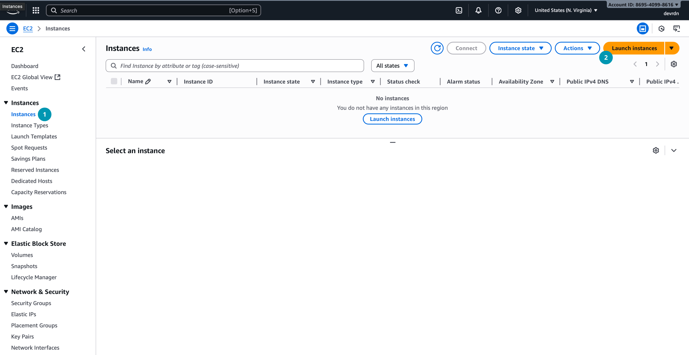
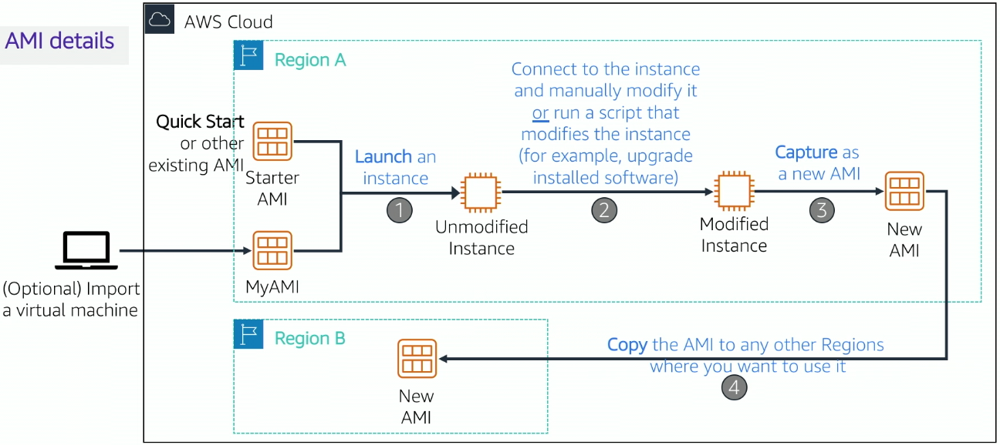
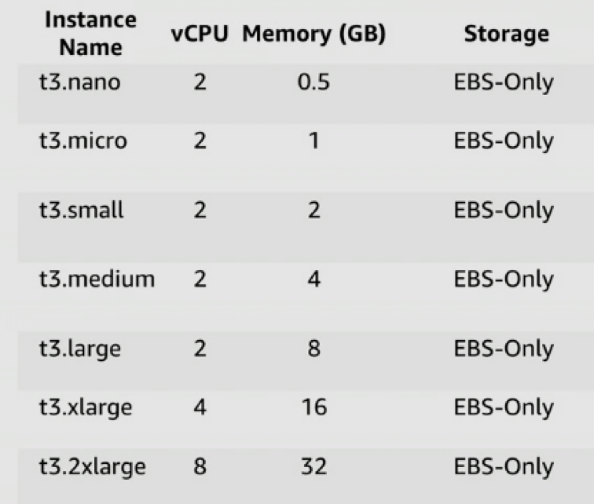
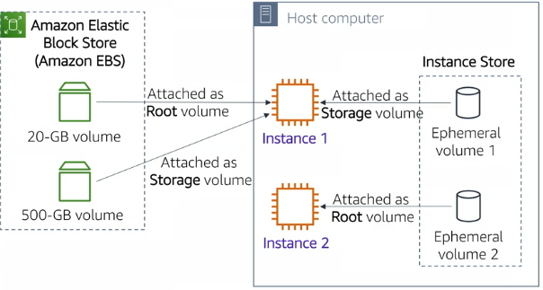
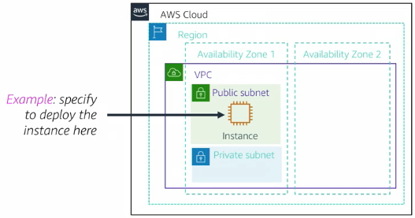
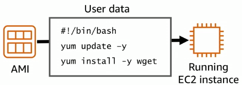
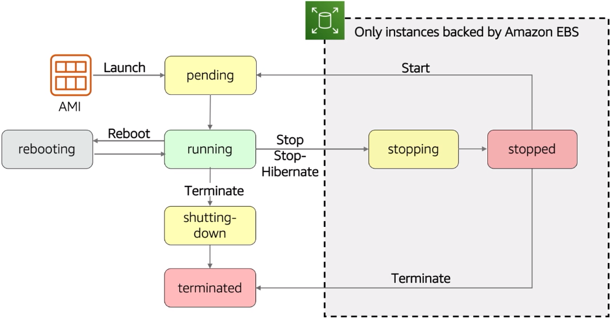

# Введение в вычислительные сервисы (Compute). AWS Elastic Compute Cloud (EC2)

## Введение в облачные вычислительные сервисы

Первая категория облачных сервисов, с которой логично начать знакомство, — это *вычислительные сервисы* (Compute Services).

*Вычислительные сервисы (Compute Services)* предоставляют мощность процессоров, память и базовые ресурсы для запуска приложений. Вместо того чтобы закупать собственные вычислительные ресурсы, можно «арендовать» виртуальные серверы в облаке [^1]. Одним из наиболее распространённых примеров таких сервисов является аренда виртуальных машин (VM), которые имитируют работу физических серверов и позволяют устанавливать на них операционные системы и прикладное программное обеспечение.

В AWS к вычислительным сервисам относятся:

- *AWS EC2 (Elastic Compute Cloud)* — сервис для аренды виртуальных машин с возможностью гибкой настройки ресурсов.
- *AWS Lambda* — сервис для запуска кода без управления серверами (serverless).
- *AWS Elastic Beanstalk* — платформа как сервис (PaaS) для развертывания и управления приложениями. Вы используете Beanstalk, когда хотите сосредоточиться на коде, а не на инфраструктуре.
- *Amazon ECS/EKS* — сервисы для управления контейнерами.
- *AWS LightSail* — упрощённый сервис для быстрого развертывания виртуальных серверов и приложений.
- *AWS Fargate* — сервис для запуска контейнеров без управления серверами.

Данные сервисы различаются уровнем абстракции и управляемости: EC2 даёт в ваше распоряжение целый виртуальный сервер, требуя управления ОС и окружением, тогда как Lambda исполняет код без управления сервером, а Beanstalk автоматизирует развертывание приложений, управляя инфраструктурой за вас (вы не управляете ОС напрямую, а просто загружаете код).

Обычно перед новичками возникает вопрос: *«Когда использовать тот или иной сервис?»*. Выбор зависит от нескольких факторов:

- архитектура приложения (application design);
- шаблоны использования (usage patterns), то есть как часто и в каком объёме будут использоваться ресурсы;
- уровень контроля, который вы хотите иметь над конфигурацией (which configuration settings will you want to manage?).

Неправильный выбор (например, использование EC2 там, где подойдет Lambda) может привести к избыточным затратам и потерям в производительности, так как вы будете платить за ресурсы, которые не используете эффективно. 

В контексте данной лекции мы сосредоточимся на *Amazon EC2* — одном из самых популярных и универсальных вычислительных сервисов AWS.

## Что такое Amazon EC2?

*Amazon Elastic Compute Cloud (EC2)* – это облачный сервис AWS, позволяющий арендовать виртуальные выделенные серверы («экземпляры») по модели инфраструктуры как сервиса (IaaS). EC2 предоставляет пользователям гибкость в создании, запуске, остановке и удалении виртуальных машин по запросу с оплатой только за фактическое время работы (эластичность облака). Иными словами, EC2 – это не физические серверы, а масштабируемые виртуальные машины в облаке, полностью настраиваемые под нужды пользователя.

При использовании EC2 вы  получаете полный доступ к гостевой ОС (Windows или Linux), как если бы это был физический сервер.

Amazon EC2 можно использовать для различных целей:

- Веб-серверы. Размещение веб-сайтов и веб-приложений.
- Прокси-серверы. Обработка и маршрутизация запросов.
- Серверы приложений. Запуск бизнес-логики и обработка данных.
- Серверы баз данных. Хранение и управление данными.
- Вычислительные серверы для научных расчетов. Выполнение сложных вычислений.
- Игровые серверы. Хостинг многопользовательских игр.
- И многое другое.

Как было сказано ранее, запустить виртуальную машину в EC2 можно используя консоль, командную строку или SDK. В следующем разделе рассмотрим ключевые решения, которые необходимо принять при запуске.

## Запуск EC2 экземпляра

Запустить EC2-экземпляр виртуальной машины можно несколькими способами:

- через _AWS Management Console_ (веб-интерфейс),
- с помощью _AWS CLI_ (командная строка),
- используя _AWS SDK_ (например, библиотеку Boto3 для Python).

Для начала рассмотрим запуск с использованием AWS Management Console, так как этот способ наиболее нагляден и удобен для пользователей, которые только начинают работать с AWS.

<center>



_Рисунок 1. Меню создания нового EC2 экземпляра в AWS Management Console_

</center>

При запуске EC2 экземпляра необходимо принять 9 ключевых решений.

### 1. Выбор Amazon Machine Image (AMI)

*Amazon Machine Image (AMI)* – шаблон (образ) для создания экземпляров. AMI содержит предустановленную операционную систему и, при необходимости, дополнительное программное обеспечение. При запуске экземпляра вы выбираете AMI, на основе которой будет развернута ваша виртуальная машина [^2]. AMI определяет, какая ОС (Linux, Windows, etc.) и стартовый набор ПО будет на экземпляре при запуске.

AWS предлагает базовые образы популярных систем: 

- Amazon Linux
- Red Hat Enterprise Linux
- Mac OS
- CentOS
- Ubuntu
- Windows Server
- другие...

При выборе AMI можно использовать:

1. _Quick Start AMIs_ – стандартные образы от AWS, описанные выше.
2. _My AMIs_ – созданные вами образы.
3. _AWS Marketplace AMIs_ – образы с предустановленным ПО от сторонних поставщиков.
4. _Community AMIs_ – образы, созданные сообществом AWS.

Выбор AMI зависит от ваших потребностей – например, для веб-сервера может подойти *Amazon Linux* или *Ubuntu*.

> Amazon Linux это оптимизированный для AWS дистрибутив Linux, предоставляемый бесплатно и поддерживаемый AWS. Он регулярно обновляется и включает интеграцию с сервисами AWS, что делает его популярным выбором для запуска приложений в облаке.

Чтобы создать собственный AMI, сначала необходимо запустить и настроить экземпляр виртуальной машины (установить программное обеспечение, задать параметры), а затем создать из него AMI. При этом AWS автоматически создаёт AMI Snapshot — снимок тома хранения, содержащий все настройки и данные. Этот образ можно затем использовать для запуска новых экземпляров с уже предустановленным и настроенным ПО. На рисунке 1 представлена схема процесса создания нового Amazon Machine Image (AMI) в облаке AWS.

<center>



_Рисунок 1. Процесс создания и распространения Amazon Machine Image (AMI) в AWS_

</center>

Также AWS предоставляет инструменты для импорта существующих виртуальных машин из on-premise среды в виде AMI. Например, вы переходите с физического сервера на облако и хотите сохранить текущее состояние системы.

### 2. Выбор типа экземпляра (Instance Type)

*Тип экземпляра (Instance Type)* – аппаратная конфигурация, которую получит запущенный EC2-экземпляр. AWS предлагает множество типов, которые различаются количеством vCPU (виртуальных ядер процессора), объёмом оперативной памяти, пропускной способностью сети, а также доступными вариантами хранилища (SSD/HDD, сеть или локальный диск) и другими характеристиками.

Каждый тип экземпляра имеет название, например, `t2.micro`, `m5.large`, `c5.xlarge`. Название состоит из трёх частей:

- Семейство (Family) – обозначается первой буквой (t, m, c, r, i и т.д.), указывающей на основное назначение экземпляра.
- Поколение (Generation) – цифра после буквы (например, 2, 3, 4, 5), обозначающая поколение экземпляра.
- Размер (Size) – указывает на размер экземпляра (micro, small, medium, large, xlarge и т.д.), что влияет на количество ресурсов.

Семейства экземпляров сгруппированы по типичным сценариям использования:

| Семейство | Назначение | Примеры использования | Примечание |
|-----------|------------|-----------------------|------------|
| Общего назначения (General Purpose) (`t`, `m`) | Сбалансированные по CPU/RAM, подходят для многих задач. | Веб-серверы, базы данных, приложения общего назначения. | Особо стоит упомянуть T-серию (t2, t3, t4g) – это burstable экземпляры, которые предназначены для нагрузок с переменными всплесками активности. Они предоставляют базовый уровень производительности CPU с возможностью «взрывного» увеличения мощности при необходимости. Простыми словами, если ваше приложение не требует постоянной высокой производительности, а имеет периоды интенсивной работы, T-серия может быть экономичным выбором. |
| Оптимизированные для вычислений (Compute Optimized) (`c`) | Обладают повышенной вычислительной мощностью CPU при относительно меньшем объёме памяти. | Подходят для задач, требовательных к производительности процессора: высокопроизводительная обработка данных, рендеринг, научные расчёты, транзакционные серверы, некоторые игровые серверы. | Например, `c5.xlarge` имеет больше ядер CPU при меньшей памяти, оптимизируя стоимость за вычислительный ресурс |
| Оптимизированные для памяти (Memory Optimized) (`r`, `x`, `z`) | Обеспечивают большой объём RAM на ядро CPU. | Идеальны для приложений, требующих интенсивной работы с памятью: базы данных в памяти (in-memory databases), аналитика больших данных, кэширование, высокопроизводительные базы данных. | Например, `r5.large` предлагает больше памяти на ядро CPU, что полезно для приложений с большими объёмами данных в памяти |
| Оптимизированные для хранения (Storage Optimized) (`i`, `d`, `h`) | Предлагают высокопроизводительное локальное хранилище (SSD/HDD) с низкой задержкой. | Идеально для задач, интенсивно работающих с диском: распределённые файловые системы, системы анализа больших данных (Hadoop, Spark), NoSQL СУБД, требующие низких задержек к хранилищу. | Например, `i3.4xlarge` имеет несколько NVMe-SSD на борту для экстремально быстрого доступа к данным. |
| Ускоренные вычисления (Accelerated Computing) (`p`, `g`, `f`) | Семейства с аппаратным ускорением: `p` (GPU для машинного обучения и графики), `g` (GPU для графики), `f` (FPGA для специализированных задач). | Подходят для задач, требующих параллельных вычислений: машинное обучение, рендеринг видео, научные симуляции, криптография. | Такие экземпляры оснащены либо графическими процессорами NVIDIA (как p3, g4dn и др.) для тренировки нейронных сетей. Это узкоспециализированные и дорогие ресурсы, используемые когда требуется аппаратное ускорение. |
| Высокопроизводительные вычисления (HPC) (`hpc6a`, `hpc6id`) | Оптимизированы для высокопроизводительных вычислений с низкой задержкой и высокой пропускной способностью сети. | Используются в научных исследованиях, моделировании, финансовом анализе, биоинформатике. | - |

На рисунке 2 представлена таблица с примерами типов экземпляров семейства t3 в Amazon EC2. В таблице указаны ключевые параметры для каждого типа: количество виртуальных процессоров (vCPU), объём оперативной памяти (Memory, GB) и тип доступного хранилища (Storage). Все приведённые варианты используют только блочное хранилище EBS (Elastic Block Store).

<center>



_Рисунок 2. Таблица с характеристиками экземпляров семейства t3 в Amazon EC2_

</center>

### 3. Хранилище для экземпляра (Storage)

В AWS EC2 доступны несколько вариантов хранения данных:

*Amazon EBS (Elastic Block Store)* – сетевое блочное хранилище. EBS-том представляет собой сетевой «*виртуальный диск*», который можно подключить к экземпляру (аналогично подключению физического диска к серверу). *Важное свойство EBS – долговременность*: данные на EBS томе сохраняются независимо от жизненного цикла экземпляра. Даже если экземпляр остановлен, то данные на EBS сохраняются. EBS поддерживает создание снимков (snapshots) для резервного копирования и восстановления данных.

*Instance Store (Ephemeral Storage)* - эфемерное локальное хранилище, которое предоставляется некоторыми типами экземпляров и связано с физическим хостом, на котором запущен экземпляр. Это, как правило, локальный SSD или HDD, непосредственно подключённый к серверу. Instance Store обеспечивает очень высокую скорость I/O и низкие задержки, но не является постоянным: данные на нём существуют только пока работает данный экземпляр на конкретном хосте. Если экземпляр останавливается или завершается, *данные instance store теряются* (также они не переносятся при миграции экземпляра на другой хост). Поэтому instance store подходит только для временных данных – кешей, буферов, промежуточных результатов вычислений.

Можно использовать *другие типы хранилищ*, но на них будут храниться только данные, а не ОС:

- *Amazon S3 (Simple Storage Service)* – объектное хранилище для хранения и извлечения любых объёмов данных. S3 не является блочным хранилищем, поэтому его нельзя использовать как диск для ОС, но можно использовать для хранения файлов, резервных копий, статического контента.
- *Amazon EFS (Elastic File System)* – сетевое файловое хранилище, которое можно монтировать на несколько экземпляров одновременно. EFS подходит для совместного доступа к файлам между несколькими экземплярами.

При запуске экземпляра EC2 необходимо выбрать:

- Тип хранилища (EBS или Instance Store).
- Корневой том (_root volume_) – том, на котором установлена ОС. Обычно это EBS-том.
- Дополнительные тома (если нужны) – можно добавить дополнительные EBS-тома

*Для каждого тома можно указать*:

- Размер (в ГБ).
- Тип тома (SSD, HDD и т.д.).
- Будет ли том удалён при завершении экземпляра.
- Будет ли том зашифрован. Шифрование обеспечивает безопасность данных на уровне хранения.

На рисунке 3 показаны варианты подключения хранилища к экземплярам Amazon EC2. *Слева изображено блочное хранилище Amazon Elastic Block Store (EBS)*, где могут быть тома различного размера (например, 20 ГБ или 500 ГБ). *Справа изображено Instance Store* — временное локальное хранилище, физически связанное с хост-компьютером. 

<center>



_Рисунок 3. Варианты использования Amazon EBS и Instance Store для экземпляров EC2_

</center>

### 4. Ключи доступа (SSH-ключи) и подключение

EC2 не использует пароли для входа на Linux-экземпляры по соображениям безопасности. Вместо этого используется пара ключей SSH (Secure Shell): 

- *Приватный ключ* (private key) – *хранится у вас на локальной машине* и используется для аутентификации.
- *Публичный ключ* (public key) – *хранится в AWS*. Загружается на экземпляр при его создании.

При создании экземпляра вы выбираете существующую *ключевую пару* или создаёте новую. Приватный ключ скачивается в виде файла `.pem`, который нужно хранить в безопасности, а открытый ключ регистрируется в AWS и автоматически добавляется в файл авторизованных ключей на вновь запущенном инстансе (например, в `~/.ssh/authorized_keys`).

Для подключения по SSH к инстансу пользователь использует приватный ключ – таким образом проходит аутентификация. *Без приватного ключа получить доступ к инстансу невозможно*, поэтому его надо хранить надёжно. AWS не хранит приватные ключи – только открытые. При запуске инстанса указывается имя Key Pair, которая будет использоваться для доступа.

В Windows-экземплярах схема похожая: ключевая пара применяется для дешифровки автоматически сгенерированного пароля администратора в системе. Простыми словами, при первом запуске Windows-экземпляра AWS генерирует пароль администратора, шифрует его с помощью публичного ключа из выбранной Key Pair и сохраняет в системе. Пользователь скачивает приватный ключ и использует его для дешифровки пароля администратора через консоль AWS. Таким образом, доступ к Windows-экземпляру также защищён с помощью ключевой пары.

### 5. Сетевые настройки (Network Settings)

Каждый EC2-экземпляр запускается в определённой виртуальной сети AWS – VPC (Virtual Private Cloud) – и в конкретной подсети внутри этой VPC (привязанной к зоне доступности, одна подсеть - одна зона доступности).

По умолчанию AWS предоставляет *Default VPC* в каждом регионе – это готовая виртуальная сеть, в которой можно сразу запускать инстансы. Вы можете выбрать default VPC и одну из её подсетей (например, подсеть, расположенную в конкретной Availability Zone). Сетевые настройки определяют, будет ли инстанс иметь публичный IP-адрес (для доступа из интернета) или только внутренний адрес, и в какой сегмент сети он попадёт. Например, можно указать *Auto-assign Public IP = Enable*, чтобы AWS автоматически выдала инстансу публичный IP для доступа извне, или отключить это, если инстанс должен быть доступен только внутри приватной сети.

Однако при перезапуске экземпляра ему назначается новый публичный IP-адрес (если эта опция была включена). Чтобы закрепить за инстансом постоянный внешний адрес, используется *Elastic IP* — статический IP-адрес, который можно привязать к любому экземпляру. *На один акаунт AWS выделяется до 5 Elastic IP бесплатно*, но если вы не используете его (не привязываете к инстансу), то за него взимается плата.

Тема виртуальных сетей (VPC) и подсетей (Subnets) будет рассмотрена отдельно, так как она достаточно обширна и требует детального изучения.

> Чтобы легче понять концепцию, Virtual Private Cloud (VPC) можно представить как обычную физическую сеть в вашем собственном дата-центре. Она объединяет серверы, маршрутизаторы и другие устройства. Разница лишь в том, что в AWS эта сеть полностью виртуальная, но принципы работы — такие же, как в привычной локальной сети, подключённой к вашему компьютеру. 

На рисунке 4 показано размещение экземпляра EC2 внутри виртуальной сети VPC:

- *Public Subnet* — подсеть с доступом в интернет, обычно используется для веб-серверов и приложений, которые должны быть доступны пользователям.
- *Private Subnet* — подсеть без прямого доступа в интернет, чаще применяется для баз данных или внутренних сервисов.

<center>



_Рисунок 4. Размещение EC2-экземпляра в VPC и подсетях (Public и Private)_

</center>

### 6. Группы безопасности (Security Groups)

_Security Group_ важнейшний компонент безопасности в AWS, действующий как виртуальный файрвол для управления входящим и исходящим трафиком к вашим EC2-экземплярам. 

Каждому экземпляру можно назначить одну или несколько групп безопасности. Каждая группа безопасности содержит набор правил, определяющих, какой трафик разрешён или запрещён. 

Правила групп безопасности бывают двух типов:

- *Inbound rules* – правила для входящего трафика (какие порты и протоколы разрешены для доступа к экземпляру извне).
- *Outbound rules* – правила для исходящего трафика (какие порты и протоколы разрешены для выхода из экземпляра в интернет или другие ресурсы).

Правила групп безопасности состоят из следующих параметров:

- Port Number (номер порта, например, 22 для SSH, 80 для HTTP, 443 для HTTPS).
- Protocol (протокол, например, TCP, UDP, ICMP).
- Source/Destination (источник или назначение трафика, например, IP-адрес, диапазон IP-адресов или другая группа безопасности).

Например, чтобы разрешить доступ по SSH к Linux-экземпляру, нужно добавить правило в Inbound Rules:

| Type  | Protocol | Port Range | Source        |
|-------|----------|------------|---------------|
| SSH   | TCP      | 22         | 0.0.0.0/0     |

> 0.0.0.0/0 – это специальный адрес, обозначающий "все IP-адреса". Это значит, что доступ по SSH разрешён с любого IP-адреса в интернете. Такой подход удобен для тестирования, но небезопасен для продакшн-среды. В реальных условиях рекомендуется ограничивать доступ только доверенными IP-адресами или диапазонами (например, вашим офисным IP).

По умолчанию, группы безопасности блокируют весь входящий трафик и разрешают весь исходящий. Это обеспечивает базовый уровень безопасности, и вы можете настраивать правила по мере необходимости. То есть если не указывать никаких правил, то к вашему инстансу никто не сможет подключиться извне ни по какому порту.

### 7. Теги (Tags)

*Теги (Tags)* – это метаданные в виде пар «ключ-значение», которые можно присваивать ресурсам AWS, включая EC2-экземпляры. Тег, который всегда рекомендуется добавлять при создании экземпляра, — это `Name`, позволяющий задать удобочитаемое имя для ресурса.

Теги полезны для: фильтрации ресурсов в консоли, автоматизации процессов, распределения затрат (cost allocation) и контроля доступа (access control). Например, можно использовать теги для группировки ресурсов по проектам, окружениям (production, staging, development).

### 8. IAM роли для экземпляров (IAM Roles for EC2) (опционально)

*IAM роли* позволяют предоставлять EC2-экземплярам временные права доступа к другим сервисам AWS без необходимости хранения долгосрочных учетных данных (паролей или ключей) на самом экземпляре (что является плохой практикой безопасности).

Например, если вашему приложению на экземпляре нужно читать данные из другого сервиса AWS, например, базы данных или хранилища, то вы можете создать IAM роль с необходимыми правами, например, `разрешить-только-чтение`, и назначить эту роль вашему экземпляру. AWS автоматически предоставит временные учетные данные для доступа к сервисам, когда приложение на экземпляре будет их запрашивать.

Если роль не назначена, инстанс по умолчанию не имеет прав для доступа к ресурсам AWS. Поэтому для production-сценариев, где EC2 взаимодействует с другими сервисами (БД, хранилища, очереди и т.д.), шаг назначения IAM-ролей важен для обеспечения безопасности и удобства.

### 9. Пользовательские данные (User Data) (опционально)

Перед финальным запуском AWS Console предлагает раздел Advanced Details, где, среди прочего, есть поле *User Data*. 

*User Data* – это скрипт или данные, которые передаются инстансу и выполняются при первом старте (boot) виртуальной машины. Обычно туда помещают bash-скрипт (для Linux) или PowerShell (для Windows) с инструкциями автоматической настройки сервера. Например, в User Data можно прописать установку необходимых пакетов, настройку окружения, запуск приложений и т.д. 

Данный скрипт выполняется только один раз (*с повышенными привилегиями root*) при первом запуске инстанса. Это позволяет автоматизировать процесс настройки и избежать необходимости вручную настраивать каждый новый экземпляр.  *Пример*: можно указать User Data, который устанавливает веб-сервер Apache и запускает его. 

> Если вы перезапустите инстанс, скрипт не выполнится повторно (если не задать специальные флаги cloud-init).

На рисунке 5 показан пример использования User Data при запуске экземпляра EC2. Этот скрипт выполняет обновление системы и устанавливает утилиту *wget*.

<center>



_Рисунок 5. Использование User Data для автоматической настройки EC2-инстанса при запуске_

</center>

### Запуск экземпляра

После того как все параметры выбраны, можно запустить экземпляр, нажав кнопку *Launch*. AWS создаст виртуальную машину с заданными характеристиками и запустит её. В консоли появится новый инстанс со статусом *running*.

### Примеры запуска EC2 через AWS CLI и SDK

Выше мы рассмотрели запуск через графическую консоль. Однако, EC2-инстансы можно создавать и программно – с помощью инструментов, что важно для автоматизации (Infrastructure as Code, скрипты деплоя и т.д.). Рассмотрим кратко, как запустить тот же инстанс используя AWS CLI и AWS SDK для Node.js.

*AWS CLI (Command Line Interface)* – это утилита, позволяющая управлять AWS-сервисами через командную строку. Предположим, мы хотим программно создать инстанс с параметрами, аналогичными описанным выше (AMI, тип, сеть, ключ, security group). Минимальный набор параметров для команды запуска включает: 

- ID AMI,
- Тип инстанса, 
- Security group,
- Пара ключей.

Пример команды AWS CLI для запуска инстанса:

```bash
aws ec2 run-instances \
    --image-id ami-0123456789abcdef0 \
    --instance-type t2.micro \
    --count 1 \
    --security-group-ids sg-0abc12d345ef67890 \
    --key-name MyKeyPair
```

Эта команда создаст и запустит один экземпляр `t2.micro` с указанным AMI, в заданной security group и с ключевой парой `MyKeyPair`. 

Для остановки и удаления инстанса используются команды `stop-instances` и `terminate-instances` соответственно.

```bash
# Остановка инстанса
aws ec2 stop-instances --instance-ids i-0123456789abcdef0

# Удаление инстанса
aws ec2 terminate-instances --instance-ids i-0123456789abcdef0
```

Для просмотра дополнительных параметров и опций можно использовать команду `aws ec2 help`.

Еще один способ программного управления EC2 – использование *AWS SDK* для различных языков программирования. Рассмотрим пример на Node.js с использованием библиотеки `aws-sdk`.

Предположим, у нас настроены AWS креденшалы и регион, и мы хотим программно создать инстанс. Для этого используется метод runInstances из класса EC2. Пример кода:

```javascript
const AWS = require('aws-sdk');

// Инициализируем регион (например, us-east-1)
AWS.config.update({ region: 'us-east-1' });

// Создаем объект EC2
const ec2 = new AWS.EC2({ apiVersion: '2016-11-15' });

// Параметры запуска инстанса
const params = {
  ImageId: 'ami-0123456789abcdef0',       // ID AMI
  InstanceType: 't2.micro',              // тип инстанса
  KeyName: 'MyKeyPair',                 // ключевая пара для доступа
  MinCount: 1, 
  MaxCount: 1,                         // запускаем 1 инстанс
  SecurityGroupIds: ['sg-0abc12d345ef67890'],  // группа безопасности
  SubnetId: 'subnet-1a2b3c4d',          // подсеть VPC
  UserData: Buffer.from("#!/bin/bash\nsudo yum update -y").toString('base64') 
  // (опционально) скрипт user-data, закодированный Base64
};

// Вызываем запуск инстанса
ec2.runInstances(params, function(err, data) {
  if (err) {
    console.error("Ошибка запуска EC2:", err);
  } else {
    const instanceId = data.Instances[0].InstanceId;
    console.log("Инстанс запущен, ID:", instanceId);

    // Далее можно, например, назначить теги к инстансу:
    const tagParams = {
      Resources: [instanceId],
      Tags: [{ Key: 'Name', Value: 'MyServer' }]
    };
    ec2.createTags(tagParams, (err) => {
      if (err) console.log("Не удалось добавить тег:", err);
      else console.log("Тег Name добавлен для", instanceId);
    });
  }
});
```

## Жизненный цикл EC2 экземпляра

После того, как экземпляр запущен, он проходит через несколько состояний в своём жизненном цикле [^4]:

| Состояние       | Описание                                                                 |
|-----------------|--------------------------------------------------------------------------|
| pending         | Экземпляр создаётся и запускается.                                       |
| running         | Экземпляр запущен и работает.                                            |
| stopping        | Экземпляр останавливается (останавливается работа ОС).                   |
| stopped         | Экземпляр остановлен, но ресурсы (EBS тома) сохраняются. Можно перезапустить. |
| shutting-down   | Экземпляр завершается (удаляется).                                   |
| terminated      | Экземпляр удалён, ресурсы освобождены. Данные на Instance Store теряются. |
| rebooting       | Экземпляр перезагружается (перезапуск ОС без изменения состояния).        |

На рисунке 6 показан жизненный цикл экземпляра EC2 и его возможные состояния.

- После выбора AMI и запуска инстанс переходит в состояние `pending` (инициализация).
- Когда экземпляр готов к работе, он переходит в состояние `running`.
- Из состояния `running` можно:
  - выполнить Reboot (перезапуск),
  - выполнить Stop или Hibernate, при этом инстанс перейдёт в состояния `stopping` → `stopped`,
  - либо завершить работу полностью (Terminate), тогда он проходит через состояние `shutting-down` и переходит в `terminated`.

Блок справа с пунктирной рамкой указывает на то, что состояния `stopping` и `stopped` доступны только для инстансов, использующих Amazon Elastic Block Store (EBS) как корневой том.

Это означает: 

- Если экземпляр основан на EBS, его можно останавливать и снова запускать без потери данных на диске.
- Если же используется *Instance Store* (временное локальное хранилище), то остановка недоступна — при завершении экземпляра данные будут потеряны.

<center>



_Рисунок 6. Жизненный цикл EC2-инстанса и поддержка остановки для инстансов с Amazon EBS_

</center>

## Метаданные инстанса

Каждый EC2-инстанс имеет служебные данные (метаданные), доступные по специальному внутреннему адресу `http://169.254.169.254/latest/meta-data/`. Там можно посмотреть ID инстанса, VPC, подсеть, публичный/приватный IP, привязанные security-groups и многое другое.

Например, из ОС можно выполнить `curl http://169.254.169.254/latest/meta-data/instance-id` и получить ID. 

Часто метаданные используются приложениями для получения информации о среде выполнения, например, для настройки подключения к другим сервисам AWS.

> Важно: доступ к этому адресу возможен только изнутри самого экземпляра, что обеспечивает безопасность.


[^1]: _AWS Compute Services - Learn All About Amazon Compute Services_. geeksforgeeks.org [online]. Available at: https://www.geeksforgeeks.org/devops/aws-compute-services/
[^2]: _What is Amazon EC2?_. docs.aws.amazon.com [online]. Available at: https://docs.aws.amazon.com/AWSEC2/latest/UserGuide/concepts.html
[^3]: _Amazon EC2 instance types_. docs.aws.amazon.com [online]. Available at: https://docs.aws.amazon.com/AWSEC2/latest/UserGuide/instance-types.html
[^4]: _Stop and start Amazon EC2 instances_. docs.aws.amazon.com [online]. Available at: https://docs.aws.amazon.com/AWSEC2/latest/UserGuide/Stop_Start.html