# Hands-on 4.1. Первый экземпляр EC2

В этом практическом занятии вы запустите свою первую виртуальную машину в AWS, установите на неё веб-сервер без единой ручной команды и подключитесь к ней по SSH. Все решения, которые мы будем принимать, разобраны в лекции 4, в разделе «Из чего собирается экземпляр».

## Что получится в конце

- Работающий экземпляр `web-server` типа `t3.micro` с Amazon Linux 2023 в регионе Франкфурт.
- Веб-страница, которая открывается в браузере по публичному IP-адресу экземпляра.
- Подключение к экземпляру по SSH из терминала на вашем компьютере.

## Перед началом

- Вы вошли в консоль AWS под своим пользователем IAM, а не под root (лекция 3).
- В аккаунте настроен бюджет с оповещением (лекция 3).
- На компьютере есть терминал: в macOS и Linux это Terminal, в Windows 10 и 11 это PowerShell. Программа `ssh` в них уже установлена.

> [!WARNING]
> Экземпляр `t3.micro` входит в бесплатный план, но только пока кредиты не закончились. Не оставляйте экземпляр работать без необходимости: в конце Hands-on 4.3 мы его удалим.

## Шаг 1. Откройте мастер запуска

Откройте сервис `EC2`. В правом верхнем углу проверьте, что выбран регион `Europe (Frankfurt)` (_1_). Затем нажмите `Launch instance` (_2_).

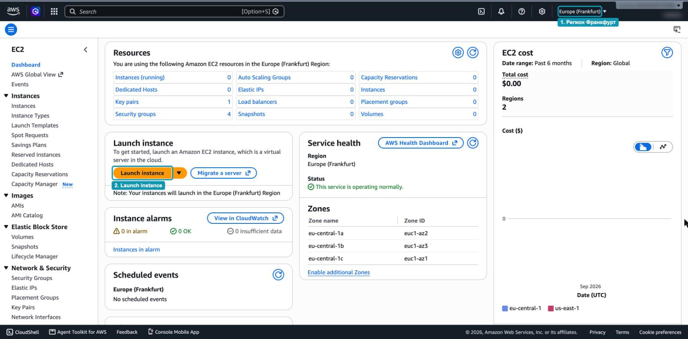

_4.1.1. Главная страница EC2_

## Шаг 2. Задайте имя и выберите образ

1. В поле `Name` введите `web-server` (_3_). Консоль создаст тег `Name` с этим значением.
2. В разделе `Application and OS Images` выберите `Amazon Linux` (_4_).
3. В списке `Amazon Machine Image (AMI)` оставьте образ `Amazon Linux 2023` (_5_). Он помечен как `Free tier eligible`.

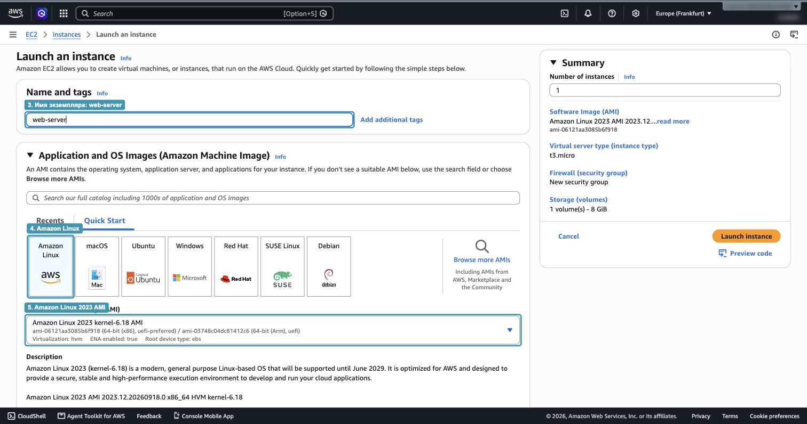

_4.1.2. Имя экземпляра и выбор AMI_

## Шаг 3. Выберите тип экземпляра и создайте ключ

1. В разделе `Instance type` оставьте `t3.micro` (_6_): 2 vCPU и 1 ГиБ памяти. Под названием типа консоль показывает цену за час.
2. В разделе `Key pair (login)` нажмите `Create new key pair` (_7_).

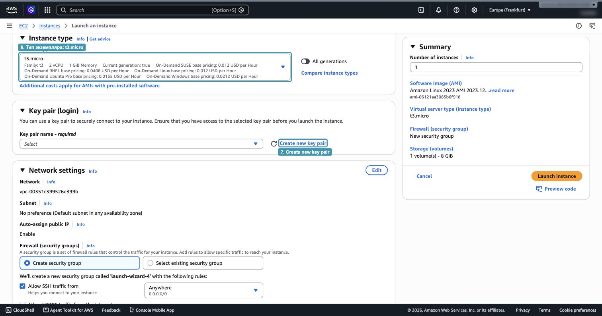

_4.1.3. Тип экземпляра и раздел Key pair_

3. В открывшемся окне укажите имя `student-key` (_8_), тип `ED25519` (_9_) и формат `.pem` (_10_). Нажмите `Create key pair` (_11_).

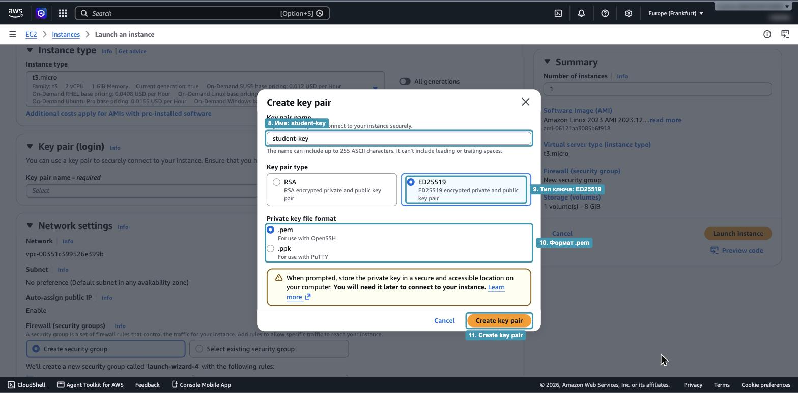

_4.1.4. Создание пары ключей_

4. Браузер сразу скачает файл `student-key.pem`. Это ваш приватный ключ, и второй раз скачать его нельзя. Переложите файл в папку `.ssh` в домашней папке:
   - macOS и Linux: `~/.ssh/student-key.pem`;
   - Windows: `C:\Users\<ваше имя>\.ssh\student-key.pem`.

> [!WARNING]
> Файл `.pem` нельзя класть в репозиторий, отправлять в мессенджер и хранить в папке проекта. Любой, у кого есть этот файл, сможет войти на ваш сервер.

## Шаг 4. Настройте Security Group

После создания ключа он автоматически выбран в поле `Key pair name` (_12_).

В разделе `Network settings` консоль уже выбрала default VPC и включила публичный IP-адрес. Остаётся настроить правила Security Group:

1. Оставьте `Create security group`.
2. Для `Allow SSH traffic from` выберите `My IP` (_13_). Консоль подставит адрес вашего компьютера, и подключаться по SSH сможете только вы.
3. Отметьте `Allow HTTP traffic from the internet` (_14_), чтобы веб-страницу мог открыть любой пользователь.

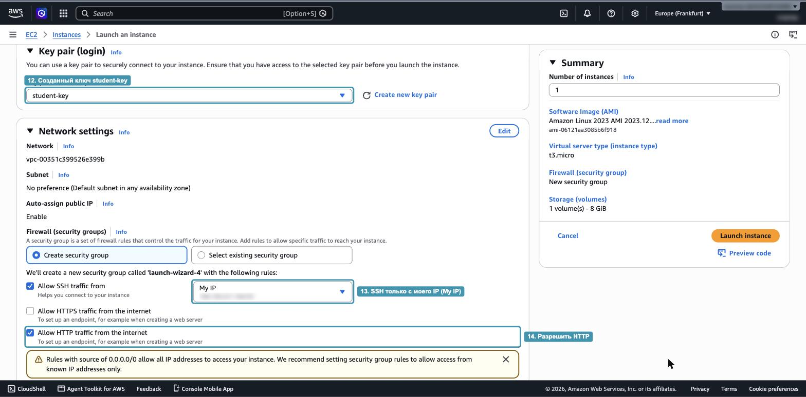

_4.1.5. Ключ и правила Security Group_

> [!NOTE]
> Жёлтое предупреждение под правилами относится к HTTP: источник `0.0.0.0/0` означает «любой адрес в интернете». Для веб-сервера это нормально, ведь сайт и должен быть доступен всем. Для SSH мы такой источник не используем.

Если вы подключитесь к другой сети (например, из дома, а не из университета), ваш IP изменится и правило SSH придётся обновить.

## Шаг 5. Проверьте хранилище

В разделе `Configure storage` оставьте корневой том EBS по умолчанию: 8 ГиБ, тип `gp3` (_15_). Затем раскройте раздел `Advanced details` (_16_).

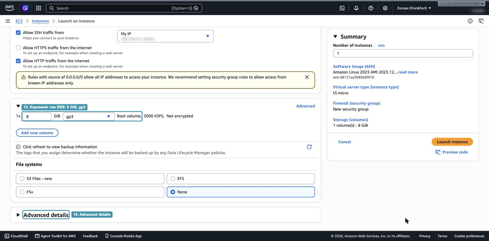

_4.1.6. Корневой том и дополнительные настройки_

## Шаг 6. Добавьте user data и запустите экземпляр

Прокрутите раздел `Advanced details` до самого низа. В поле `User data` вставьте скрипт (_17_):

```bash
#!/bin/bash
dnf install -y nginx
echo "<h1>Hello from $(hostname)</h1>" > /usr/share/nginx/html/index.html
systemctl enable --now nginx
```

Скрипт выполнится один раз при первом запуске: установит веб-сервер nginx, запишет простую страницу с именем сервера и запустит nginx.

Проверьте итог в панели `Summary` справа и нажмите `Launch instance` (_18_).

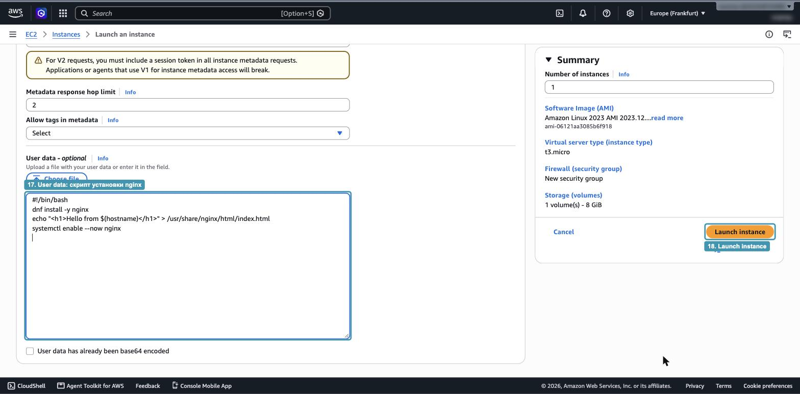

_4.1.7. User data и запуск_

Через несколько секунд появится сообщение об успешном запуске с идентификатором экземпляра вида `i-0...` (_19_).

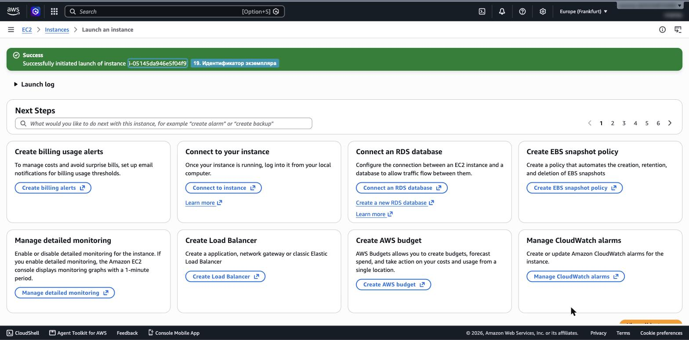

_4.1.8. Экземпляр запущен_

## Шаг 7. Найдите публичный IP-адрес

Перейдите в `Instances` и отметьте экземпляр `web-server`. Обратите внимание на три вещи:

- состояние `Running` (_20_);
- зону доступности, в которой работает экземпляр (_21_);
- публичный IP-адрес в нижней панели `Details` (_22_).

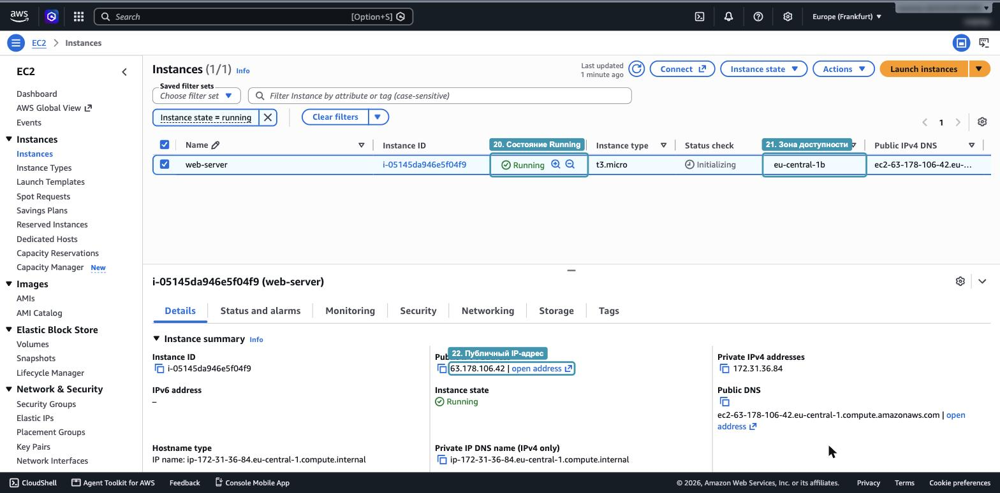

_4.1.9. Экземпляр в списке и его публичный IP_

> [!NOTE]
> Пока в колонке `Status check` написано `Initializing`, экземпляр ещё загружается и выполняет user data. Обычно на это уходит одна-две минуты.

## Шаг 8. Откройте веб-страницу

Скопируйте публичный IP-адрес и откройте в браузере адрес `http://<публичный-IP>`, например `http://63.178.106.42`. Обратите внимание: именно `http`, а не `https`, ведь порт 443 мы не открывали.

Вы увидите страницу, которую создал скрипт user data (_23_). В ней указано внутреннее имя сервера.


_4.1.10. Страница веб-сервера_

Если страница не открывается, подождите минуту: nginx мог ещё не установиться. Если не помогло, проверьте, что в Security Group открыт HTTP, а в адресе стоит `http://`.

## Шаг 9. Подключитесь по SSH

1. Вернитесь в `Instances`, отметьте экземпляр и нажмите `Connect` (_24_).

   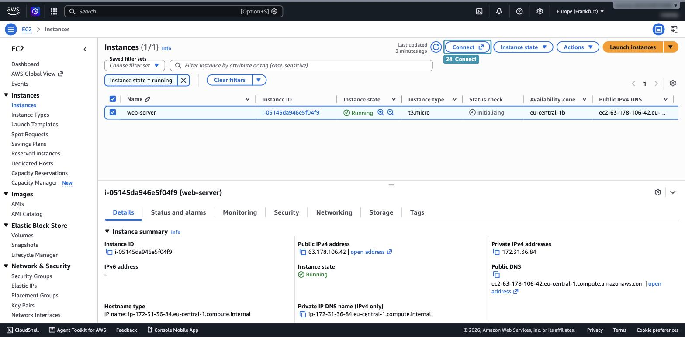

   _4.1.11. Кнопка Connect_

2. Откройте вкладку `In SSH client` (_25_). AWS сама показывает команды для подключения: изменение прав на файл ключа (_26_) и готовую команду `ssh` (_27_).

   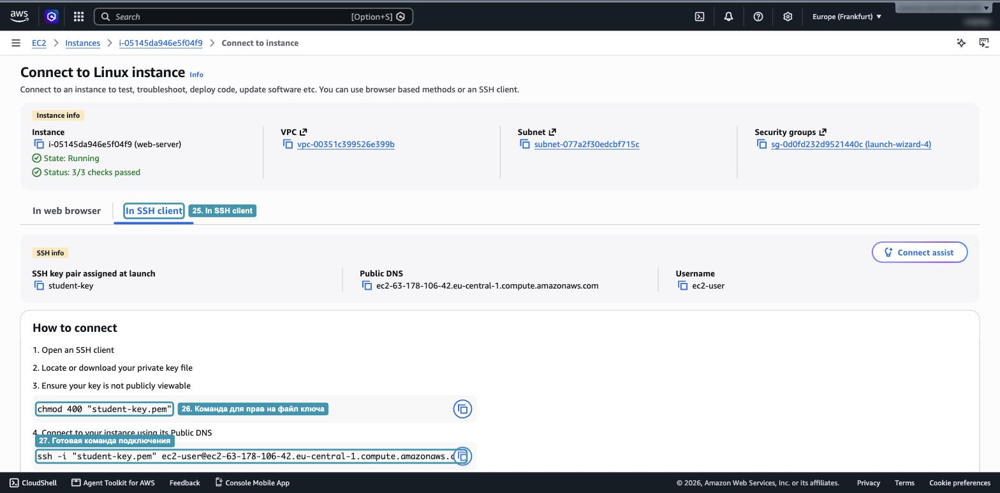

   _4.1.12. Инструкция по подключению через SSH-клиент_

3. Откройте терминал на своём компьютере и закройте файл ключа от других пользователей. В macOS и Linux:

   ```bash
   chmod 400 ~/.ssh/student-key.pem
   ```

   В Windows этот шаг обычно не нужен.

4. Подключитесь, подставив публичный IP своего экземпляра:

   ```bash
   ssh -i ~/.ssh/student-key.pem ec2-user@<публичный-IP>
   ```

   В Windows PowerShell вместо `~` используйте `$HOME`: `ssh -i $HOME\.ssh\student-key.pem ec2-user@<публичный-IP>`.

5. При первом подключении ответьте `yes` на вопрос `Are you sure you want to continue connecting`.

6. Если всё прошло успешно, приглашение терминала изменится примерно на такое:

   ```text
   [ec2-user@ip-172-31-36-84 ~]$
   ```

Теперь вы на сервере. Выполните несколько команд и посмотрите на результат:

```bash
hostname                     # имя сервера
systemctl status nginx       # nginx запущен скриптом user data
cat /var/log/cloud-init-output.log | tail -n 20   # журнал выполнения user data
```

Чтобы вернуться на свой компьютер, наберите `exit`.

> [!TIP]
> Если подключиться не удаётся, сверьтесь с таблицей «Если не получается» в разделе «Вход на сервер» лекции 4. Чаще всего причина в правиле Security Group (изменился ваш IP) или в неверном имени пользователя.

## Вопросы для самопроверки

1. Зачем для SSH мы выбрали `My IP`, а для HTTP оставили `0.0.0.0/0`?
2. Где сейчас хранится публичный ключ из пары `student-key`, а где приватный?
3. Что произойдёт со скриптом user data, если перезагрузить экземпляр?
4. Почему страница открывается по `http://`, но не по `https://`?

Экземпляр пока не удаляйте: он понадобится в Hands-on 4.2 и 4.3.
