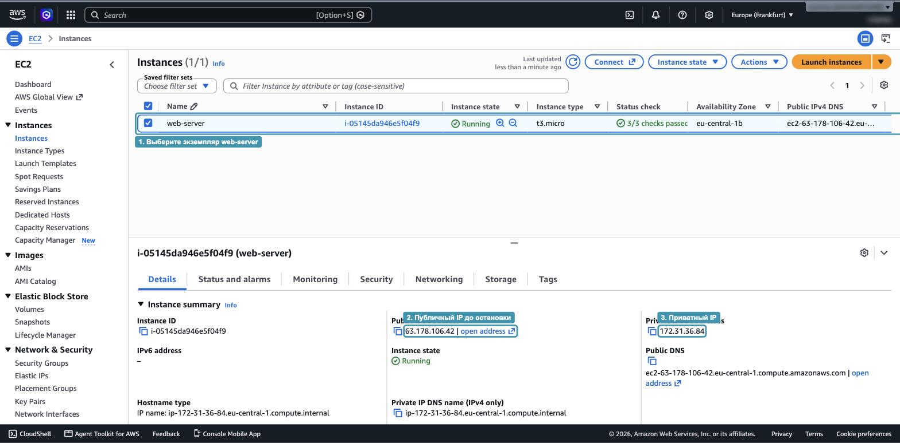
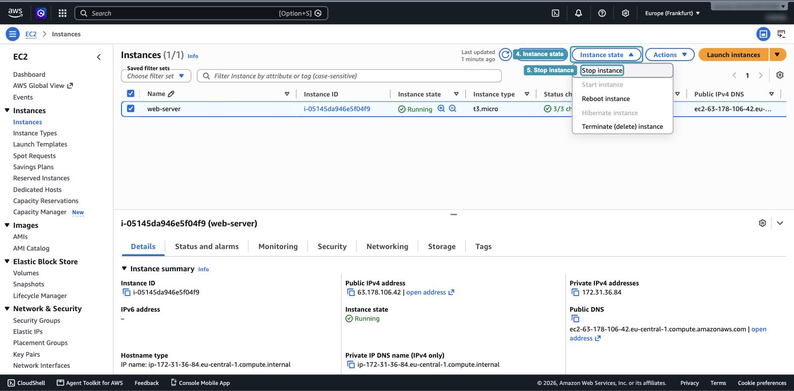
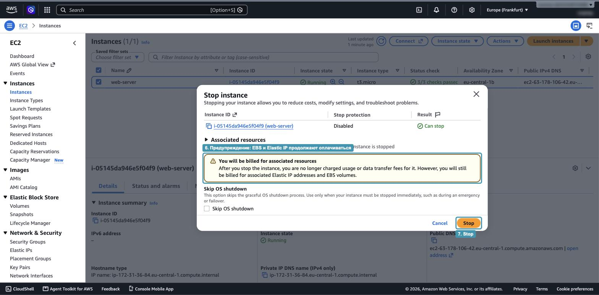
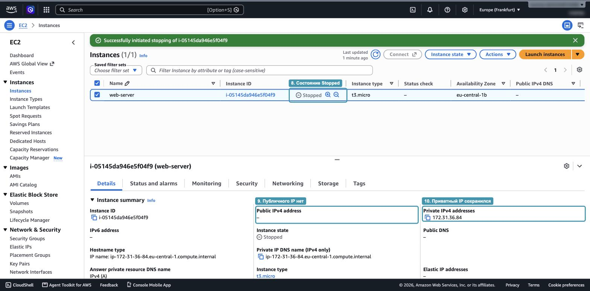
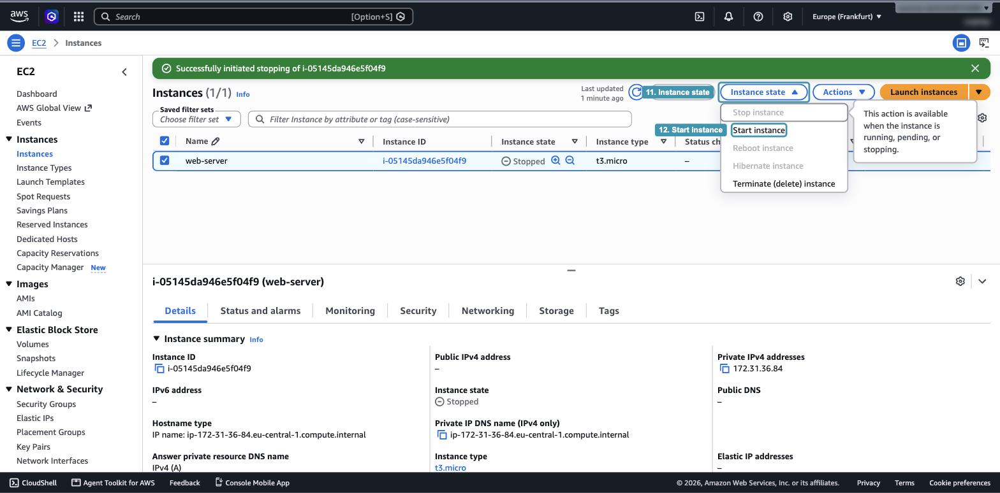
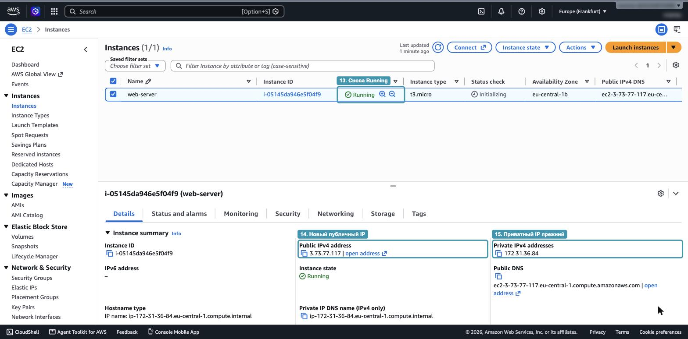

# Hands-on 4.2. Остановка и запуск экземпляра

В лекции 4 мы разобрали, что происходит с экземпляром при остановке: какие данные сохраняются, какие теряются и за что продолжают брать деньги. В этом занятии вы проверите это на практике на экземпляре `web-server` из Hands-on 4.1.

## Что получится в конце

- Вы остановите и снова запустите экземпляр.
- Увидите, что публичный IP-адрес изменился, а приватный остался прежним.
- Убедитесь, что файлы на корневом томе EBS пережили остановку.

## Перед началом

- Экземпляр `web-server` из Hands-on 4.1 запущен и находится в состоянии `Running`.
- Вы умеете подключаться к нему по SSH.

## Шаг 1. Оставьте след на диске

Подключитесь к экземпляру по SSH, как в Hands-on 4.1, и создайте файл в домашней папке:

```bash
echo "Файл создан до остановки" > ~/note.txt
cat ~/note.txt
exit
```

После остановки мы проверим, сохранился ли этот файл.

## Шаг 2. Запишите IP-адреса

Откройте `EC2`, затем `Instances`. Если в строке фильтра стоит `Instance state = running`, уберите этот фильтр крестиком, иначе остановленный экземпляр пропадёт из списка.

Отметьте экземпляр `web-server` (_1_) и запишите два адреса из нижней панели:

- публичный IP-адрес (_2_);
- приватный IP-адрес (_3_).



_4.2.1. Адреса экземпляра до остановки_

## Шаг 3. Остановите экземпляр

1. Нажмите `Instance state` (_4_) и выберите `Stop instance` (_5_).

   

   _4.2.2. Меню Instance state_

2. Консоль попросит подтвердить действие. Прочитайте жёлтое предупреждение (_6_): после остановки плата за сам экземпляр прекращается, но диски EBS и Elastic IP продолжают оплачиваться. Это ровно то, что мы обсуждали в разделе «За что вы платите». Нажмите `Stop` (_7_).

   

   _4.2.3. Подтверждение остановки_

3. Экземпляр пройдёт через состояние `Stopping` и через некоторое время перейдёт в `Stopped` (_8_). Обновите список кнопкой со стрелкой, если состояние не меняется.

Посмотрите на нижнюю панель: публичного IP-адреса больше нет (_9_), а приватный остался на месте (_10_).



_4.2.4. Остановленный экземпляр_

## Шаг 4. Запустите экземпляр снова

Снова нажмите `Instance state` (_11_) и выберите `Start instance` (_12_). Подтверждение здесь не требуется.



_4.2.5. Запуск экземпляра_

Через несколько секунд экземпляр вернётся в состояние `Running` (_13_). Сравните адреса с теми, что вы записали в шаге 2:

- публичный IP-адрес стал другим (_14_);
- приватный IP-адрес остался прежним (_15_).



_4.2.6. Адреса после повторного запуска_

## Шаг 5. Проверьте, что сохранилось

1. Откройте в браузере старый адрес `http://<старый-публичный-IP>`. Страница не откроется: этот адрес больше не принадлежит вашему экземпляру.
2. Откройте новый адрес `http://<новый-публичный-IP>`. Страница снова на месте. Скрипт user data при этом не выполнялся повторно: nginx запустился сам, потому что команда `systemctl enable` добавила его в автозагрузку.
3. Подключитесь по SSH, указав новый IP-адрес, и проверьте файл:

   ```bash
   cat ~/note.txt
   ```

   Файл на месте: корневой том EBS пережил остановку вместе со всеми данными.

> [!NOTE]
> При первом подключении по новому адресу `ssh` снова спросит `Are you sure you want to continue connecting`. Для вашего компьютера это новый адрес, хотя сервер тот же.

## Итог

| Что                     | До остановки     | После запуска                      |
| ----------------------- | ---------------- | ---------------------------------- |
| Публичный IP-адрес      | Один             | Другой                             |
| Приватный IP-адрес      | Один             | Тот же                             |
| Файл `~/note.txt` на EBS | Есть            | Есть                               |
| Процессы в памяти       | Работают         | Запущены заново при загрузке       |

## Вопросы для самопроверки

1. Почему публичный IP-адрес изменился, а приватный нет?
2. Что нужно сделать, чтобы у экземпляра был постоянный публичный адрес, и что за это придётся платить?
3. Сохранился бы файл `note.txt`, если бы он лежал на диске instance store?
4. За что вы платили, пока экземпляр был в состоянии `Stopped`?

Экземпляр не удаляйте: он понадобится в Hands-on 4.3.
