# Hands-on 4.3. Роль IAM для экземпляра

В лекции 4 мы разобрали, как экземпляр EC2 получает права без постоянных ключей: роль IAM прикрепляется через instance profile, а программы на сервере забирают временные ключи из Instance Metadata Service (IMDS). В этом занятии вы пройдёте весь путь сами: создадите роль, прикрепите её к экземпляру `web-server` и увидите временные ключи своими глазами.

## Что получится в конце

- Роль `photo-app-role`, которая разрешает только чтение Amazon S3.
- Экземпляр `web-server`, к которому эта роль прикреплена.
- Команды AWS CLI, которые работают на сервере без единого сохранённого ключа.
- Отказ в доступе при попытке сделать то, что роль не разрешает.

## Перед началом

- Экземпляр `web-server` из Hands-on 4.1 запущен и находится в состоянии `Running`.
- Вы умеете подключаться к нему по SSH.
- Ваш пользователь IAM имеет право создавать роли. Если консоль IAM отвечает ошибкой доступа, обратитесь к преподавателю.

## Часть 1. Создайте роль

### Шаг 1. Откройте список ролей

Откройте сервис `IAM`. В меню слева выберите `Roles` (_1_) и нажмите `Create role` (_2_).

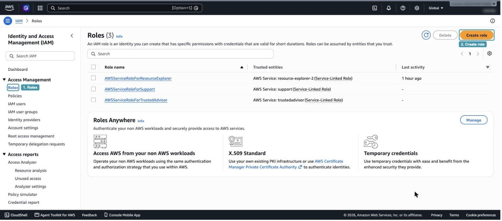

_4.3.1. Список ролей IAM_

В списке уже есть несколько ролей с пометкой `Service-Linked Role`. Их создал сам AWS для своих сервисов, трогать их не нужно.

### Шаг 2. Укажите, кто будет пользоваться ролью

На первом шаге мастер спрашивает, кому будет разрешено принимать роль. Это и есть trust policy из лекции.

1. В разделе `Trusted entity type` выберите `AWS service` (_3_).
2. В поле `Service or use case` выберите `EC2` (_4_).
3. В списке `Use case` оставьте вариант `EC2` (_5_) и нажмите `Next` внизу страницы.

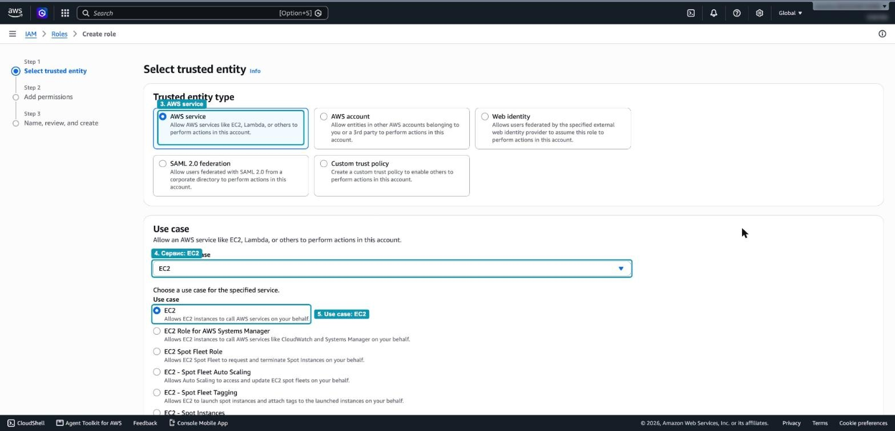

_4.3.2. Выбор доверенной стороны_

### Шаг 3. Выберите права

Теперь нужно решить, что роль будет разрешать. Это permissions policy.

1. В строке поиска введите `AmazonS3ReadOnlyAccess` (_6_).
2. Отметьте найденную политику галочкой (_7_). Это управляемая политика AWS: она разрешает читать объекты и списки бакетов, но не разрешает ничего создавать, изменять или удалять.
3. Нажмите `Next` (_8_).

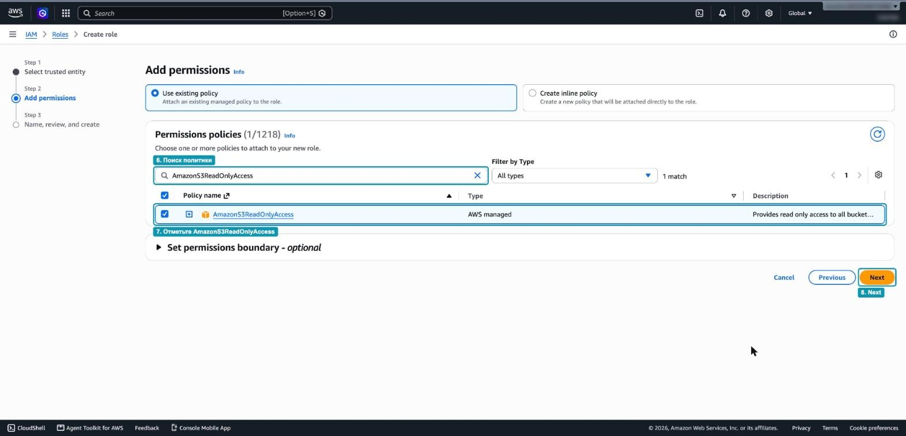

_4.3.3. Выбор политики прав_

> [!WARNING]
> Не выбирайте `AdministratorAccess` или `AmazonS3FullAccess` «чтобы точно заработало». Любой, кто получит контроль над сервером, получит и все права его роли. Давайте роли ровно те права, которые нужны приложению.

### Шаг 4. Назовите роль и проверьте trust policy

1. В поле `Role name` введите `photo-app-role` (_9_). Описание можно оставить по умолчанию.
2. Прокрутите страницу к разделу `Step 1: Select trusted entities` и посмотрите на сгенерированный JSON (_10_). Найдите в нём две строки:
   - `"Action": "sts:AssumeRole"` означает «разрешено принять роль»;
   - `"Service": "ec2.amazonaws.com"` означает «принять роль может только сервис EC2».

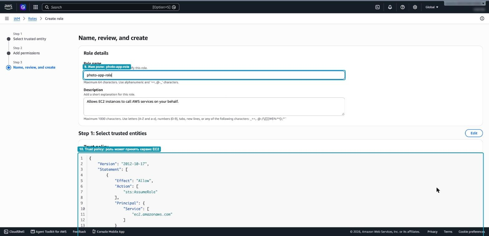

_4.3.4. Имя роли и trust policy_

3. Ниже, в разделе `Step 2: Add permissions`, убедитесь, что к роли подключена политика `AmazonS3ReadOnlyAccess` (_11_). Нажмите `Create role` (_12_).

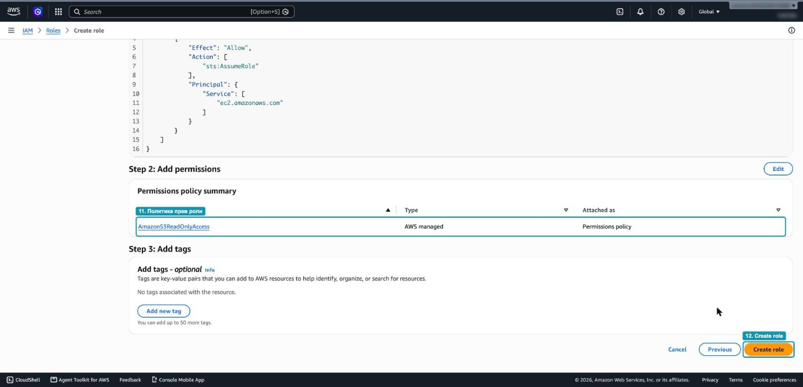

_4.3.5. Итоговая проверка перед созданием_

Роль появится в списке `Roles`. Обратите внимание: у неё две политики с разными задачами. Trust policy отвечает на вопрос «кто может стать этой ролью», permissions policy отвечает на вопрос «что эта роль может делать».

> [!NOTE]
> Когда роль для EC2 создаётся через консоль, AWS автоматически создаёт и instance profile с тем же именем `photo-app-role`. Именно instance profile, а не сама роль, прикрепляется к экземпляру.

## Часть 2. Прикрепите роль к экземпляру

### Шаг 5. Откройте настройку роли экземпляра

Откройте `EC2`, затем `Instances`.

1. Отметьте экземпляр `web-server` (_13_).
2. Нажмите `Actions` (_14_), выберите `Security` (_15_), затем `Modify IAM role` (_16_).

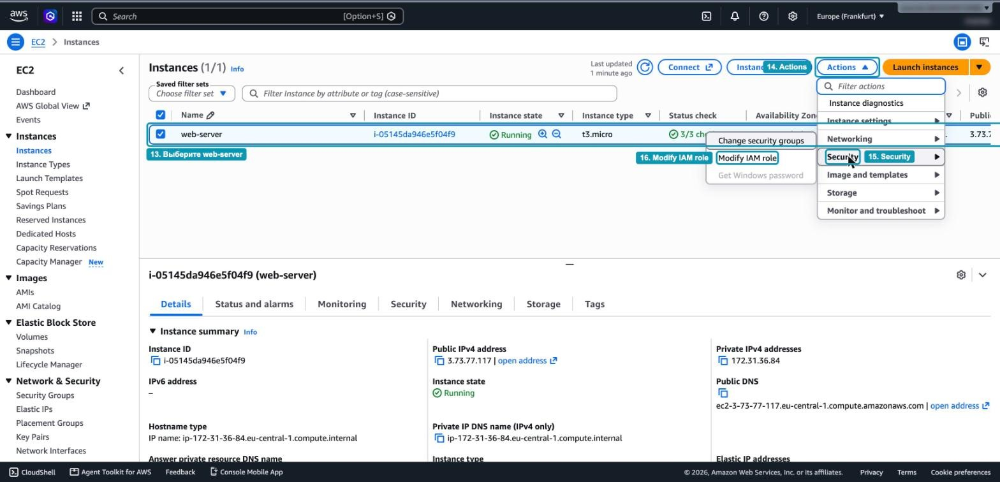

_4.3.6. Меню Modify IAM role_

Экземпляр для этого не нужно останавливать: роль можно прикрепить и заменить на работающем сервере.

### Шаг 6. Выберите роль

1. Раскройте список `IAM role`. Сейчас там выбрано `No IAM Role`. Найдите в списке `photo-app-role` (_17_). Строго говоря, в этом списке перечислены instance profiles, но их имена совпадают с именами ролей.

   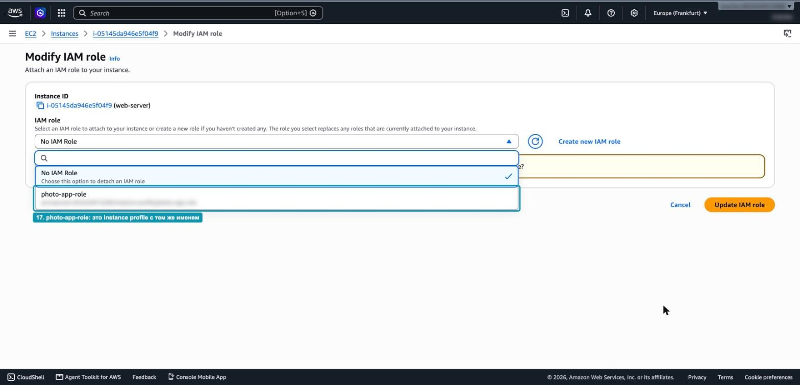

   _4.3.7. Список доступных ролей_

2. Убедитесь, что в поле выбрана `photo-app-role` (_18_), и нажмите `Update IAM role` (_19_).

   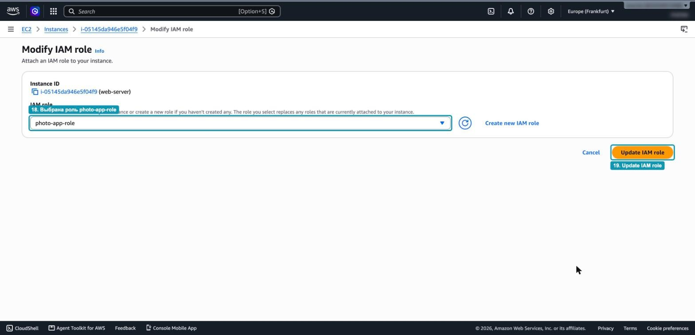

   _4.3.8. Подтверждение выбора роли_

### Шаг 7. Проверьте, что роль прикреплена

Вверху страницы появится зелёное сообщение `Successfully attached photo-app-role to instance` (_20_). Отметьте экземпляр, откройте в нижней панели вкладку `Security` (_21_) и найдите поле `IAM role` (_22_): там теперь указана `photo-app-role`.

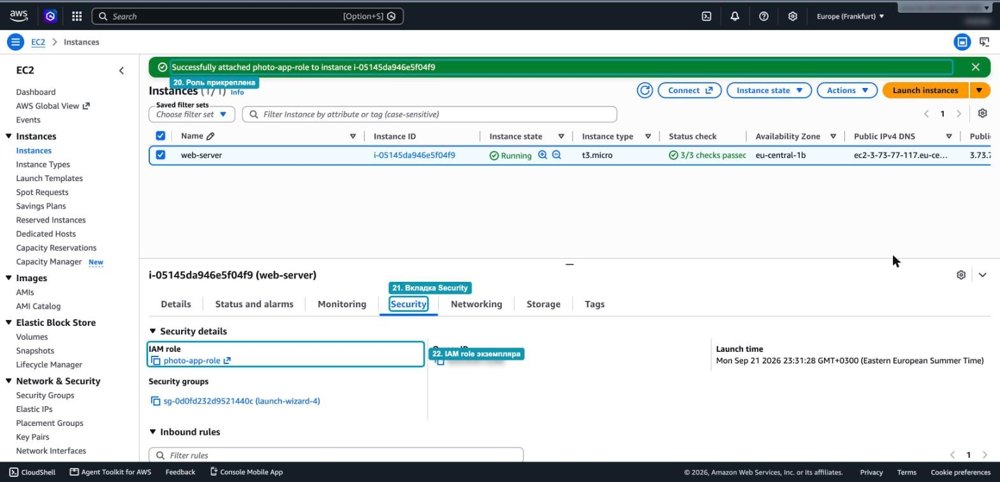

_4.3.9. Роль прикреплена к экземпляру_

## Часть 3. Посмотрите на роль изнутри сервера

Подключитесь к экземпляру по SSH, как в Hands-on 4.1. Все команды ниже выполняются уже на сервере.

> [!NOTE]
> Скриншоты этой части сделаны в браузерном терминале EC2 Instance Connect, поэтому вверху видна шапка консоли AWS. В вашем терминале с SSH команды и результаты будут такими же, отличаться будут только IP-адреса, идентификаторы и время.

### Шаг 8. Обратитесь к IMDS

Сначала попробуем обратиться к IMDS по старой схеме IMDSv1, без токена:

```bash
curl -s -o /dev/null -w "%{http_code}\n" http://169.254.169.254/latest/meta-data/
```

Эта команда печатает только HTTP-код ответа. Вы получите `401` (_23_): Amazon Linux 2023 по умолчанию требует IMDSv2, и запросы без токена отклоняются. Именно эта защита помешала бы атаке, которую мы разбирали на примере Capital One.

Теперь сделаем всё правильно. Сначала получим токен запросом `PUT` и сохраним его в переменную `TOKEN`:

```bash
TOKEN=$(curl -s -X PUT "http://169.254.169.254/latest/api/token" \
  -H "X-aws-ec2-metadata-token-ttl-seconds: 21600")
```

С этим токеном узнаем зону доступности экземпляра и имя прикреплённой роли:

```bash
curl -s -H "X-aws-ec2-metadata-token: $TOKEN" \
  http://169.254.169.254/latest/meta-data/placement/availability-zone; echo

curl -s -H "X-aws-ec2-metadata-token: $TOKEN" \
  http://169.254.169.254/latest/meta-data/iam/security-credentials/; echo
```

Первая команда вернёт зону, например `eu-central-1b` (_24_). Вторая вернёт имя роли `photo-app-role` (_25_). Команда `echo` в конце нужна только для перевода строки, чтобы приглашение терминала не склеилось с ответом.

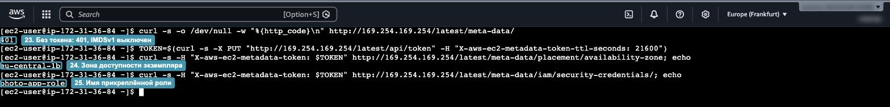

_4.3.10. Запросы к IMDS_

### Шаг 9. Посмотрите на временные ключи

Добавьте имя роли в конец адреса:

```bash
curl -s -H "X-aws-ec2-metadata-token: $TOKEN" \
  http://169.254.169.254/latest/meta-data/iam/security-credentials/photo-app-role; echo
```

IMDS вернёт JSON с временными ключами, которые выдал AWS STS:

- `AccessKeyId` начинается с `ASIA`. Это признак временного ключа, у постоянных ключей пользователя IAM префикс `AKIA`.
- `SecretAccessKey` и `Token` вместе с `AccessKeyId` образуют полный набор для подписи запросов.
- `Expiration` показывает, когда ключи перестанут действовать (_26_). До этого момента AWS выдаст новые, и программы на сервере заберут их сами.

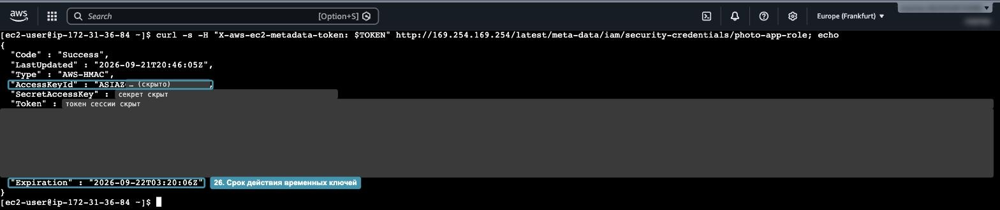

_4.3.11. Временные ключи роли_

> [!WARNING]
> Это настоящие действующие ключи. На скриншоте они закрыты. Не копируйте их в чат, отчёт или репозиторий: до истечения срока любой, у кого они есть, сможет действовать от имени роли.

### Шаг 10. Выполните команды AWS CLI

AWS CLI уже установлен в Amazon Linux 2023. Сначала убедимся, что на сервере нет никаких сохранённых ключей:

```bash
ls ~/.aws 2>&1; env | grep AWS_ACCESS || echo "no AWS_ACCESS* variables"
```

Нет ни папки `~/.aws` с файлом `credentials`, ни переменных окружения с ключами (_27_). Тем не менее спросим AWS, от чьего имени мы работаем:

```bash
aws sts get-caller-identity
```

В поле `Arn` вы увидите `assumed-role/photo-app-role/i-...` (_28_): запрос выполнен от имени роли, а в конце указан идентификатор вашего экземпляра. AWS CLI нашёл ключи сам: он прошёл по цепочке поиска учётных данных (credential provider chain), не нашёл ни переменных, ни файла и на последнем шаге обратился к IMDS.

Теперь проверим права роли. Чтение S3 разрешено:

```bash
aws s3 ls
```

Команда выполнится без ошибки (_29_). Если в аккаунте есть бакеты, вы увидите их список, если нет, вывод будет пустым.

> [!TIP]
> Если после команды `aws` вывод открылся в режиме просмотра и терминал перестал принимать команды, нажмите `q`. Чтобы AWS CLI больше не открывал такой просмотр, выполните `export AWS_PAGER=""`.

## Итог

| Что проверили                          | Результат                                |
| -------------------------------------- | ---------------------------------------- |
| Запрос к IMDS без токена               | `401`, IMDSv1 отключён                   |
| Имя роли в IMDS                        | `photo-app-role`                         |
| Префикс временного ключа               | `ASIA`, есть срок действия               |
| Сохранённые ключи на сервере           | Нет                                      |
| `aws sts get-caller-identity`          | `assumed-role/photo-app-role/i-...`      |
| `aws s3 ls`                            | Разрешено                                |
| `aws s3 mb`                            | `AccessDenied`                           |

## Вопросы для самопроверки

1. Чем trust policy роли `photo-app-role` отличается от её permissions policy? Что написано в каждой из них?
2. Откуда AWS CLI на сервере взял ключи, если на диске их нет?
3. Почему запрос к IMDS без токена вернул `401` и от какой атаки это защищает?
4. Что произойдёт с ключами, когда наступит время из поля `Expiration`?
5. Что нужно изменить, чтобы сервер смог создавать бакеты? Почему не стоит сразу давать роли `AmazonS3FullAccess`?

## Уборка

Это последнее практическое занятие лекции 4. Удалите созданные ресурсы, чтобы они не тратили кредиты бесплатного плана.

1. *Экземпляр*. В `EC2` → `Instances` отметьте `web-server`, нажмите `Instance state` → `Terminate (delete) instance` и подтвердите. Вместе с экземпляром удалится и его корневой том EBS, потому что для него включён `Delete on termination`.
2. *Роль*. В `IAM` → `Roles` найдите `photo-app-role`, отметьте её, нажмите `Delete` и введите имя роли для подтверждения. Instance profile с тем же именем удалится вместе с ролью.
3. *Security Group*. Дождитесь, пока экземпляр перейдёт в состояние `Terminated`. Затем в `EC2` → `Security Groups` отметьте группу `launch-wizard-...`, созданную в Hands-on 4.1, и выберите `Actions` → `Delete security groups`. Группу `default` не удаляйте.
4. *Пара ключей*. Пару `student-key` можно оставить для следующих занятий. Если она больше не нужна, удалите её в `EC2` → `Key Pairs` и удалите файл `student-key.pem` со своего компьютера.

> [!IMPORTANT]
> Удаление экземпляра необратимо. Перед удалением убедитесь, что на нём не осталось нужных вам файлов.
