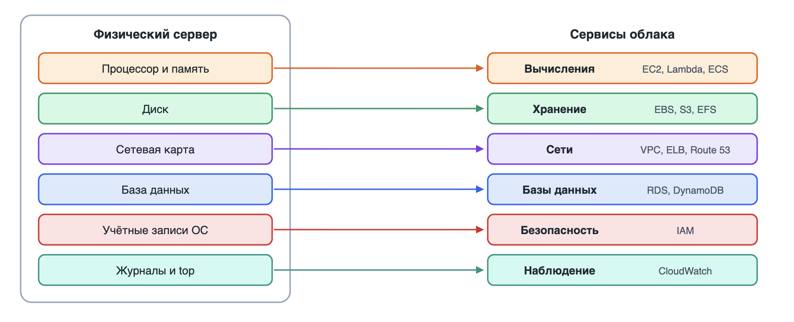
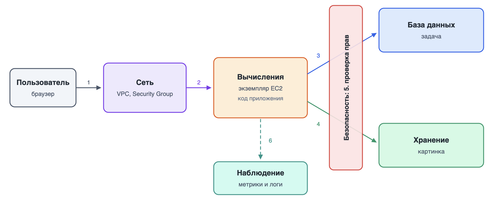
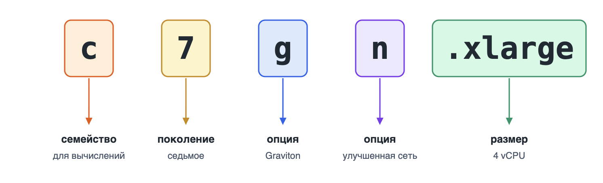
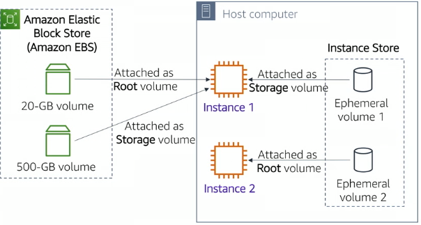
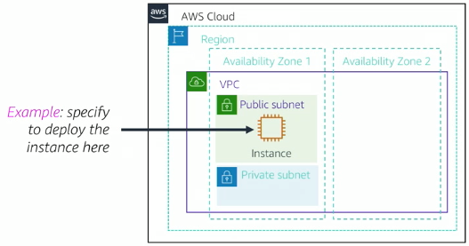
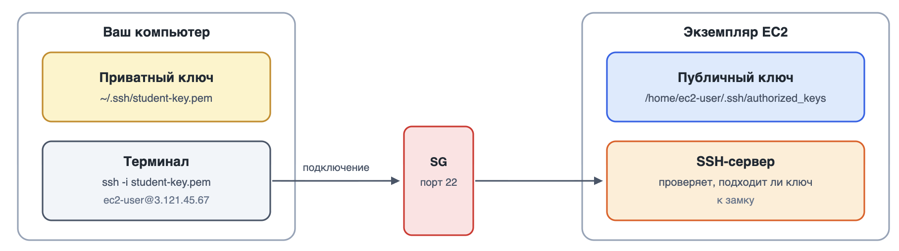
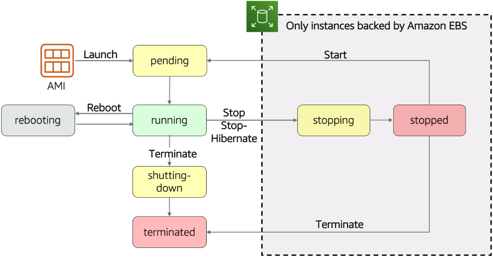

# Вычислительные сервисы. Amazon EC2 и machine identity

<i>
В пятницу вечером Джон наконец запустил сервер для их с Эммой проекта. Настоящий, в облаке, во Франкфурте. Приложение открывалось по IP-адресу, и Джон минут десять просто обновлял страницу.

Приложению нужно было сохранять картинки в облачное хранилище, а для этого нужны права. Джон решил вопрос быстро: взял ключ доступа, который создал себе на прошлой неделе, вписал его в файл `.env` на сервере, а заодно и в репозиторий на GitHub, чтобы Эмме не пришлось ничего настраивать.

В субботу утром ему пришло письмо от AWS. Тема начиналась со слов "Your AWS Access Key is exposed". К его пользователю была прикреплена политика с пугающим словом `Quarantine` в названии.

– Кто-то за ночь нашёл наш ключ? – Эмма пролистала письмо. – Репозиторий же никто не смотрит.

– Люди не смотрят, – мрачно сказал Джон. – А программы смотрят все репозитории подряд.

Ключ пришлось удалить, создать новый и долго проверять, не успел ли кто-нибудь запустить в их аккаунте что-нибудь дорогое.

– Слушай, – сказала Эмма, когда всё закончилось. – А зачем вообще серверу твой ключ? Сервер это не ты. Он живёт в AWS, AWS его сама создала и знает про него всё. Неужели нельзя просто сказать: "этому серверу можно писать в хранилище"?

Джон открыл рот, чтобы ответить, и понял, что ответа у него нет.
</i>

## Содержание

- [Вычислительные сервисы. Amazon EC2 и machine identity](#вычислительные-сервисы-amazon-ec2-и-machine-identity)
  - [Содержание](#содержание)
  - [Ретроспектива](#ретроспектива)
  - [Строительные блоки облачного приложения](#строительные-блоки-облачного-приложения)
    - [Из чего состоит сервер](#из-чего-состоит-сервер)
    - [Как блоки работают вместе](#как-блоки-работают-вместе)
    - [Почему мы начинаем с вычислений](#почему-мы-начинаем-с-вычислений)
  - [Вычисления в облаке](#вычисления-в-облаке)
    - [Определение вычислительных сервисов](#определение-вычислительных-сервисов)
  - [Обзор сервиса Amazon EC2](#обзор-сервиса-amazon-ec2)
    - [Определение Amazon EC2](#определение-amazon-ec2)
    - [Экземпляр живёт в зоне доступности](#экземпляр-живёт-в-зоне-доступности)
  - [Из чего состоит "экземпляр" в EC2](#из-чего-состоит-экземпляр-в-ec2)
    - [1. Выбор Amazon Machine Image (AMI)](#1-выбор-amazon-machine-image-ami)
    - [2. Выбор типа экземпляра (Instance Type)](#2-выбор-типа-экземпляра-instance-type)
    - [3. Выбор хранилища (Storage)](#3-выбор-хранилища-storage)
    - [4. Выбор сети](#4-выбор-сети)
    - [6. Группы безопасности (Security Groups)](#6-группы-безопасности-security-groups)
    - [7. Получение удалённого доступа к экземпляру. SSH-ключи](#7-получение-удалённого-доступа-к-экземпляру-ssh-ключи)
      - [Почему не пароль](#почему-не-пароль)
      - [Как устроены ключи](#как-устроены-ключи)
      - [Управление SSH-ключами](#управление-ssh-ключами)
      - [Как подключиться: пошагово](#как-подключиться-пошагово)
    - [8. Теги (Tags)](#8-теги-tags)
    - [9. User data](#9-user-data)
    - [10. Запуск экземпляра](#10-запуск-экземпляра)
  - [Жизненный цикл экземпляра](#жизненный-цикл-экземпляра)
    - [Состояния](#состояния)
    - [За что вы платите](#за-что-вы-платите)
  - [Подключение к EC2 экземпляру](#подключение-к-ec2-экземпляру)
    - [Подключение к Linux-экземпляру по SSH](#подключение-к-linux-экземпляру-по-ssh)
      - [Если не получается подключиться по SSH](#если-не-получается-подключиться-по-ssh)
    - [Другие способы подключения к экземпляру EC2](#другие-способы-подключения-к-экземпляру-ec2)
  - [Machine identity: как серверу получить права](#machine-identity-как-серверу-получить-права)
    - [Проблема: ключи на сервере](#проблема-ключи-на-сервере)
    - [Human identity и machine identity](#human-identity-и-machine-identity)
    - [Роль для экземпляра](#роль-для-экземпляра)
    - [Временные учётные данные](#временные-учётные-данные)
    - [Instance profile](#instance-profile)
    - [Instance Metadata Service](#instance-metadata-service)
    - [IMDSv1, IMDSv2 и история Capital One](#imdsv1-imdsv2-и-история-capital-one)
  - [Модели оплаты EC2](#модели-оплаты-ec2)
  - [Проектируем первый сервер проекта](#проектируем-первый-сервер-проекта)
  - [Резюме](#резюме)

## Ретроспектива

_Во второй главе_ мы разобрали, как один физический сервер превращается в десяток виртуальных машин: гипервизор делит процессор, память, диск и сеть между гостями, и каждый гость уверен, что работает на своём собственном компьютере.

_В третьей главе_ мы посмотрели на облако глазами клиента. Разобрали регионы и зоны доступности, завели аккаунт, создали пользователя IAM и выдали командной строке ключ доступа. Там же мы коротко упомянули роли: наборы прав, которые не принадлежат конкретному человеку и выдаются программе на время.

Эта глава соединяет обе темы. Сначала мы посмотрим на облако как на набор строительных блоков, из которых собирается любое приложение, и выберем, с какого блока начать. Затем запустим ту самую виртуальную машину из второй главы, только теперь как клиенты AWS, и разберём каждое решение, которое приходится принимать при её создании. А в конце ответим на вопрос Эммы: как выдать права не человеку, а серверу, и сделать это так, чтобы никакой ключ нельзя было украсть из репозитория.

## Строительные блоки облачного приложения

### Из чего состоит сервер

Вспомните обычный компьютер, на котором работает веб-приложение. У него есть процессор и память, на которых выполняется код. Есть диск, на котором лежат операционная система и файлы. Есть сетевая карта, через которую приходят запросы. И почти всегда на нём же запущена база данных, в которой приложение хранит свои записи.

Во второй главе мы видели, как гипервизор превращает каждую из этих частей в виртуальную. Облачный провайдер делает следующий шаг: он превращает каждую часть в _отдельный сервис_. Процессор и память вы арендуете в одном сервисе, диски в другом, сеть настраиваете в третьем, а базу данных можете вообще не устанавливать, а получить готовой.

Соответствие частей сервера и групп сервисов показано на рисунке 4.1.

Это разделение не случайно. Когда части разделены, их можно менять независимо, например,

- увеличить диск, не трогая процессор,
- добавить второй сервер к той же базе данных,
- перенести файлы в хранилище.



_4.1. От частей сервера к строительным блокам облака_

**Строительный блок (building block)** - группа облачных сервисов, решающих одну и ту же базовую задачу, из которых собирается приложение.

В третьей главе мы уже видели таблицу категорий сервисов.

| Строительный блок       | Какую задачу решает                                        | Основные сервисы AWS                                |
| ----------------------- | ---------------------------------------------------------- | --------------------------------------------------- |
| Вычисления (compute)    | Где выполняется код                                        | Amazon EC2, AWS Lambda, Amazon ECS                  |
| Сети (networking)       | Как части системы связаны друг с другом и с пользователями | Amazon VPC, Elastic Load Balancing, Amazon Route 53 |
| Хранение (storage)      | Где лежат диски и файлы                                    | Amazon EBS, Amazon S3, Amazon EFS                   |
| Базы данных (databases) | Где лежат данные приложения                                | Amazon RDS, Amazon DynamoDB                         |
| Безопасность (security) | Кто и что может делать                                     | AWS IAM                                             |
| Наблюдение (monitoring) | Что сейчас происходит с системой                           | Amazon CloudWatch                                   |

Есть и седьмой блок, _интеграция_: очереди и события, через которые части системы обмениваются сообщениями (Amazon SQS, Amazon SNS, Amazon EventBridge). Он понадобится, когда в приложении станет больше одного сервиса, и мы вернёмся к нему во второй половине курса.

### Как блоки работают вместе

Возьмём учебный сценарий:

> Веб-приложение для списка задач, в котором пользователь может прикрепить к задаче картинку. Проследим, через какие блоки проходит один запрос "сохранить задачу с картинкой". Весь путь показан на рисунке 4.2.

1. Запрос из браузера пользователя приходит в облако через _сеть_. Сеть решает, на какой сервер его отправить, и пропускает только разрешённый трафик.
2. Запрос обрабатывает код приложения, который выполняется в блоке _вычислений_.
3. Приложение записывает задачу в _базу данных_.
4. Картинку приложение кладёт в _хранилище_ файлов.
5. Перед каждым обращением к базе и хранилищу AWS проверяет права: это блок _безопасности_.
6. Всё это время сервер отправляет метрики и логи в блок _наблюдения_, чтобы вы узнали о проблеме раньше пользователя.



_4.2. Путь одного запроса через строительные блоки приложения_

> [!NOTE]
>
> Данная схема очень банальна и упрощена, в реальных приложениях блоков может быть больше, и они могут взаимодействовать сложнее. Мы будем учиться с вами делать более сложные архитектуры в следующих главах.

### Почему мы начинаем с вычислений

Курс можно было бы начать с любого блока, но у вычислений есть три преимущества.

1. _Это самое знакомое понятие_. Сервер вы уже видели во второй главе в виде виртуальной машины. В облаке это та же машина, только создаётся она кнопкой.

2. _Остальные блоки подключаются к вычислениям_. Диск монтируется к серверу, сеть соединяет серверы, база данных обслуживает приложение, которое где-то выполняется. Без сервера остальным блокам почти нечего делать.

3. _Первый сервер можно запустить уже сегодня_. В каждом регионе у вас есть готовая сеть по умолчанию, поэтому для запуска достаточно минимальных знаний о сетях. Глубоко в сети мы погрузимся в отдельной главе, когда станет понятно, что именно мы соединяем.

## Вычисления в облаке

### Определение вычислительных сервисов

Любое приложение это программа, а программе для работы нужен компьютер: процессор, память, операционная система. Пока вы пишете код, этим компьютером служит ваш ноутбук, и приложение запускается командой вроде `node app.js`. Но ноутбук вы закрываете, уносите домой, а его адрес не виден из интернета. Чтобы приложением могли пользоваться другие люди, оно должно работать на компьютере, который включён круглосуточно и доступен по сети.

**Вычислительный сервис (compute service)** - облачный сервис, который предоставляет процессорное время и память для выполнения вашего кода.

Самый простой способ представить аренду вычислений: вам дают компьютер, который стоит не у вас. Но "дать компьютер" можно по-разному:

- Можно выдать пустую виртуальную машину, на которую вы сами поставите всё, что нужно.
- А можно взять у вас только код и самому решать, где и на чём его запускать.

Различие здесь не в технологии, а в _границе ответственности_. Чем выше уровень абстракции, тем больше забот провайдер забирает себе и тем меньше у вас свободы. Эту идею вы уже видели в первой главе на примере IaaS, PaaS и SaaS. Теперь посмотрим, как она выглядит внутри одной категории сервисов.

В данной главе мы рассмотрим самый распространённый тип вычислительных сервисов - виртуальные машины.

## Обзор сервиса Amazon EC2

### Определение Amazon EC2

**Amazon EC2 (Elastic Compute Cloud)** - сервис AWS для создания и управления виртуальными машинами с оплатой по факту использования[^2].

Коротко о сервисе:

| Характеристика      | Amazon EC2                                                                                                     |
| ------------------- | -------------------------------------------------------------------------------------------------------------- |
| Категория           | Вычисления (compute)                                                                                           |
| Что делает          | Создаёт виртуальные машины и управляет ими                                                                     |
| Для чего нужен      | Запускать приложения и любое ПО на сервере, которым вы управляете полностью                                    |
| Где используют      | Веб-серверы и API, серверы приложений, базы данных под своим управлением, пакетная обработка, среды разработки |
| Модель обслуживания | IaaS                                                                                                           |
| Область действия    | Региональный сервис, каждый экземпляр зональный                                                                |
| Как оплачивается    | Время работы экземпляра <br/> _диски и публичные IPv4-адреса оплачиваются отдельно_                            |
| Как работать        | Консоль, CLI `aws ec2 ...`, SDK                                                                                |
| Появился            | Август 2006 года как бета-версия, полноценный сервис с октября 2008 года[^3]                                   |
| Аналоги             | Google Compute Engine, Azure Virtual Machines                                                                  |

**Экземпляр (instance)** - одна виртуальная машина, запущенная в EC2.

В документации и в разговорах инженеров чаще звучит английское _инстанс_, в этом курсе мы будем говорить _экземпляр_. Это одно и то же.

Экземпляр это та самая виртуальная машина из второй главы, у нее есть:

- виртуальные процессоры
- оперативная память
- дисковое пространство
- сетевой интерфейс

А под ней работает гипервизор, который делит физический сервер между несколькими клиентами. Разница только в том, что физический сервер стоит в дата-центре AWS, а вместо установщика гипервизора у вас кнопка `Launch instance`.

Слово _Elastic_ в названии тоже не случайное. Экземпляр можно создать за минуту, остановить, изменить ему размер и удалить. Этим он отличается от физического сервера, который после покупки остаётся с вами на годы, нужен он вам или нет.

### Экземпляр живёт в зоне доступности

В третьей главе мы разделили сервисы на глобальные, региональные и зональные. EC2 как сервис региональный: в каждом регионе свой список экземпляров, и, переключив регион в консоли, вы своих машин не увидите. А каждый отдельный экземпляр _зональный_: он физически работает на сервере в одной конкретной зоне доступности.

Отсюда простое, но важное следствие. Если зона доступности отключится, отключится и ваш экземпляр. Один экземпляр, каким бы мощным он ни был, не делает приложение отказоустойчивым. Как это исправить, мы будем разбирать в главе о сетях и масштабировании. Пока запомните: _один экземпляр это одна точка отказа_.

## Из чего состоит "экземпляр" в EC2

При запуске экземпляра консоль задаёт вам десяток вопросов. Удобнее думать о них не как о форме, которую надо заполнить, а как о _паспорте будущей машины_:

- что на ней будет установлено,
- насколько она мощная,
- где лежат её данные,
- кто может до неё достучаться,
- что она сделает при первом включении.

Далее мы разберём каждый пункт подробнее.

### 1. Выбор Amazon Machine Image (AMI)

**AMI (Amazon Machine Image)** - шаблон, из которого создаётся экземпляр. Он содержит образ корневого диска с операционной системой и, при необходимости, предустановленным ПО, а также настройки, нужные для запуска.шаблон (образ) для создания экземпляров. AMI содержит предустановленную операционную систему и, при необходимости, дополнительное программное обеспечение. При запуске экземпляра вы выбираете AMI, на основе которой будет развернута ваша виртуальная машина. AMI определяет, какая ОС (Linux, Windows, etc.) и стартовый набор ПО будет на экземпляре при запуске.

Если вы когда-нибудь ставили Linux с флешки, представьте, что установка уже прошла, а результат сохранили в файл. AMI и есть такой файл, и из одного AMI можно запустить сколько угодно одинаковых экземпляров.

AWS предлагает базовые образы популярных систем:

- Amazon Linux
- Red Hat Enterprise Linux
- Mac OS
- CentOS
- Ubuntu
- Windows Server
- другие...

AMI бывают нескольких видов:

- _AMI от AWS_. Amazon Linux, Ubuntu, Windows Server, Red Hat и другие популярные системы. С них начинают почти всегда.
- _Ваши собственные AMI_. Вы настраиваете экземпляр, а затем сохраняете его диск как новый образ. Такой образ с уже установленным и настроенным приложением называют _золотым образом (golden image)_: новые серверы из него готовы к работе сразу после запуска.
- _AMI из AWS Marketplace_. Образы от сторонних компаний с их ПО. Часть из них платные.
- _Community AMI_. Образы, которые опубликовали другие пользователи. Их стоит использовать осторожно: вы не знаете, что внутри.

Amazon, кстати, предлагает свою операционную систему **Amazon Linux** - дистрибутив Linux, который AWS поддерживает специально для работы в своём облаке. Актуальная версия называется Amazon Linux 2023, и в этом курсе мы будем использовать именно её. Пользователь по умолчанию в ней называется `ec2-user`, а пакеты ставятся командой `dnf`.

Также AWS предоставляет инструменты для импорта существующих виртуальных машин из on-premise среды в виде AMI. Например, вы переходите с физического сервера на облако и хотите сохранить текущее состояние системы.

### 2. Выбор типа экземпляра (Instance Type)

**Тип экземпляра (instance type)** - готовая конфигурация виртуального оборудования:

- количество vCPU,
- объём памяти,
- пропускная способность сети,
- доступные варианты хранилища: SSD, HDD, NVMe.

Задать произвольную комбинацию, например 3 vCPU и 5 ГБ памяти, нельзя. Вы выбираете из списка готовых типов, и в этом списке их сотни. Разобраться в нём помогает то, что у имён типов строгая структура.

Каждый тип экземпляра имеет название, например, `m7g.large` или `t3.micro`. Название состоит из трёх частей:

- **Семейство (Family)** - обозначается первой буквой (t, m, c, r, i и т.д.), указывающей на основное назначение экземпляра.
- **Поколение (Generation)** - цифра после буквы (например, 2, 3, 4, 5), обозначающая поколение экземпляра.
- **Дополнительные опции** - дополнительные характеристики экземпляра, такие как тип процессора, наличие улучшенной сети и т.д.
- **Размер (Size)** - указывает на размер экземпляра (micro, small, medium, large, xlarge и т.д.), что влияет на количество ресурсов.

Семейства экземпляров сгруппированы по типичным сценариям использования.

| Семейство                                                         | Назначение                                                                                                                                     | Примеры использования                                                                                                                                                                       | Примечание                                                                                                                                                                                                                                                                                                                                                                                                                                      |
| ----------------------------------------------------------------- | ---------------------------------------------------------------------------------------------------------------------------------------------- | ------------------------------------------------------------------------------------------------------------------------------------------------------------------------------------------- | ----------------------------------------------------------------------------------------------------------------------------------------------------------------------------------------------------------------------------------------------------------------------------------------------------------------------------------------------------------------------------------------------------------------------------------------------- |
| Общего назначения (General Purpose) (`t`, `m`)                    | Сбалансированные по CPU/RAM, подходят для многих задач.                                                                                        | Веб-серверы, базы данных, приложения общего назначения.                                                                                                                                     | Особо стоит упомянуть T-серию (t2, t3, t4g) – это burstable экземпляры, которые предназначены для нагрузок с переменными всплесками активности. Они предоставляют базовый уровень производительности CPU с возможностью "взрывного" увеличения мощности при необходимости. Простыми словами, если ваше приложение не требует постоянной высокой производительности, а имеет периоды интенсивной работы, T-серия может быть экономичным выбором. |
| Оптимизированные для вычислений (Compute Optimized) (`c`)         | Обладают повышенной вычислительной мощностью CPU при относительно меньшем объёме памяти.                                                       | Подходят для задач, требовательных к производительности процессора: высокопроизводительная обработка данных, рендеринг, научные расчёты, транзакционные серверы, некоторые игровые серверы. | Например, `c5.xlarge` имеет больше ядер CPU при меньшей памяти, оптимизируя стоимость за вычислительный ресурс                                                                                                                                                                                                                                                                                                                                  |
| Оптимизированные для памяти (Memory Optimized) (`r`, `x`, `z`)    | Обеспечивают большой объём RAM на ядро CPU.                                                                                                    | Идеальны для приложений, требующих интенсивной работы с памятью: базы данных в памяти (in-memory databases), аналитика больших данных, кэширование, высокопроизводительные базы данных.     | Например, `r5.large` предлагает больше памяти на ядро CPU, что полезно для приложений с большими объёмами данных в памяти                                                                                                                                                                                                                                                                                                                       |
| Оптимизированные для хранения (Storage Optimized) (`i`, `d`, `h`) | Предлагают высокопроизводительное локальное хранилище (SSD/HDD) с низкой задержкой.                                                            | Идеально для задач, интенсивно работающих с диском: распределённые файловые системы, системы анализа больших данных (Hadoop, Spark), NoSQL СУБД, требующие низких задержек к хранилищу.     | Например, `i3.4xlarge` имеет несколько NVMe-SSD на борту для экстремально быстрого доступа к данным.                                                                                                                                                                                                                                                                                                                                            |
| Ускоренные вычисления (Accelerated Computing) (`p`, `g`, `inf`)   | Семейства с аппаратным ускорением: `p` (GPU для машинного обучения и графики), `g` (GPU для графики), `f` (FPGA для специализированных задач). | Подходят для задач, требующих параллельных вычислений: машинное обучение, рендеринг видео, научные симуляции, криптография.                                                                 | Такие экземпляры оснащены либо графическими процессорами NVIDIA (как p3, g4dn и др.) для тренировки нейронных сетей. Это узкоспециализированные и дорогие ресурсы, используемые когда требуется аппаратное ускорение.                                                                                                                                                                                                                           |
| Высокопроизводительные вычисления (HPC) (`hpc6a`, `hpc6id`)       | Оптимизированы для высокопроизводительных вычислений с низкой задержкой и высокой пропускной способностью сети.                                | Используются в научных исследованиях, моделировании, финансовом анализе, биоинформатике.                                                                                                    | -                                                                                                                                                                                                                                                                                                                                                                                                                                               |

> [!NOTE]
>
> Запоминать все семейства не нужно. Достаточно знать основные группы и первую букву их самых популярных представителей.

После поколения могут идти и _дополнительные опции_, например буквы `g` в `m7g.large`, самые частые из опций:

| Буква | Что означает                             |
| ----- | ---------------------------------------- |
| `a`   | Процессор AMD                            |
| `g`   | Процессор AWS Graviton                   |
| `i`   | Процессор Intel                          |
| `d`   | Есть локальный диск instance store       |
| `n`   | Улучшенная сеть                          |
| `e`   | Больше памяти или дискового пространства |

> [!NOTE]
>
> Процессор _AWS Graviton_ это процессор, разработанный Amazon на архитектуре ARM, обеспечивающий высокую производительность и энергоэффективность для облачных вычислений.

Теперь вы можете полностью прочитать название и характеристики экземпляров, а также понимать, какие диски и опции они поддерживают.



_4.3. Как читать имя типа экземпляра_

### 3. Выбор хранилища (Storage)

У экземпляра должен быть хотя бы один диск, на котором стоит операционная система. Этот диск называется _корневым томом (root volume)_. Дисков бывает два принципиально разных вида.

**Amazon EBS (Elastic Block Store)** - сетевое блочное хранилище: виртуальный диск, который подключается к экземпляру по сети и существует независимо от него.

**Instance store** - временный локальный диск, физически установленный в том сервере, на котором работает экземпляр. _Данные на этом диске теряются при остановке или завершении работы экземпляра_.

| Свойство                                          | EBS                                           | Instance store                                  |
| ------------------------------------------------- | --------------------------------------------- | ----------------------------------------------- |
| Где физически находится                           | В отдельной системе хранения, доступ по сети  | Внутри того же физического сервера              |
| Переживает остановку экземпляра                   | Да                                            | Нет, данные стираются                           |
| Можно отключить и подключить к другому экземпляру | Да, в той же зоне доступности                 | Нет                                             |
| Резервные копии                                   | Снимки (snapshots)                            | Только ваши собственные средства                |
| Есть у любого типа                                | Да                                            | Только у типов с буквой `d` и некоторых других  |
| Для чего                                          | Корневой том, данные, которые нужно сохранить | Кеши, временные файлы, промежуточные результаты |

При запуске экземпляра EC2 необходимо выбрать:

- Тип хранилища (EBS или Instance Store).
- Корневой том (_root volume_) – том, на котором установлена ОС. Обычно это EBS-том.
- Дополнительные тома (если нужны) – можно добавить дополнительные EBS-тома

_Для каждого тома можно указать_:

- Размер (в ГБ).
- Тип тома (SSD, HDD и т.д.).
- Будет ли том удалён при завершении экземпляра.
- Будет ли том зашифрован. Шифрование обеспечивает безопасность данных на уровне хранения.

Можно использовать _другие типы хранилищ_, но на них будут храниться только данные, а не ОС:

- _Amazon S3 (Simple Storage Service)_ – объектное хранилище для хранения и извлечения любых объёмов данных. S3 не является блочным хранилищем, поэтому его нельзя использовать как диск для ОС, но можно использовать для хранения файлов, резервных копий, статического контента.
- _Amazon EFS (Elastic File System)_ – сетевое файловое хранилище, которое можно монтировать на несколько экземпляров одновременно. EFS подходит для совместного доступа к файлам между несколькими экземплярами.

На рисунке 4 показаны варианты подключения хранилища к экземплярам Amazon EC2. _Слева изображено блочное хранилище Amazon Elastic Block Store (EBS)_, где могут быть тома различного размера (например, 20 ГБ или 500 ГБ). _Справа изображено Instance Store_.



_4.4. Варианты использования Amazon EBS и Instance Store для экземпляров EC2_

### 4. Выбор сети

Сетям в курсе посвящена отдельная глава, поэтому здесь только то, без чего не запустить первую машину.

Каждый EC2-экземпляр запускается в определённой виртуальной сети AWS – **VPC (Virtual Private Cloud)** – и в конкретной подсети внутри этой VPC (привязанной к зоне доступности, одна подсеть - одна зона доступности).

По умолчанию AWS предоставляет _Default VPC_ в каждом регионе – это готовая виртуальная сеть, в которой можно сразу запускать экземпляры. Вы можете выбрать default VPC и одну из её подсетей (например, подсеть, расположенную в конкретной Availability Zone). Сетевые настройки определяют, будет ли экземпляриметь публичный IP-адрес (для доступа из интернета) или только внутренний адрес, и в какой сегмент сети он попадёт. Например, можно указать _Auto-assign Public IP = Enable_, чтобы AWS автоматически выдала экземпляру публичный IP для доступа извне, или отключить это, если экземплярдолжен быть доступен только внутри приватной сети.

Однако при перезапуске экземпляра ему назначается новый публичный IP-адрес (если эта опция была включена). Чтобы закрепить за экземпляром постоянный внешний адрес, используется _Elastic IP_ - статический IP-адрес, который можно привязать к любому экземпляру. _На один акаунт AWS выделяется до 5 Elastic IP бесплатно_, но если вы не используете его (не привязываете к экземпляру), то за него взимается плата.

> [!TIP]
>
> Чтобы легче понять концепцию, Virtual Private Cloud (VPC) можно представить как обычную физическую сеть в вашем собственном дата-центре. Она объединяет серверы, маршрутизаторы и другие устройства. Разница лишь в том, что в AWS эта сеть полностью виртуальная, но принципы работы - такие же, как в привычной локальной сети, подключённой к вашему компьютеру.

На рисунке 5 показано размещение экземпляра EC2 внутри виртуальной сети VPC:

- _Public Subnet_ - подсеть с доступом в интернет, обычно используется для веб-серверов и приложений, которые должны быть доступны пользователям.
- _Private Subnet_ - подсеть без прямого доступа в интернет, чаще применяется для баз данных или внутренних сервисов.

<center>



_Рисунок 5. Размещение EC2-экземпляра в VPC и подсетях (Public и Private)_

</center>

### 6. Группы безопасности (Security Groups)

**Security Group** - виртуальный межсетевой экран (firewall) на уровне экземпляра, который определяет, какой входящий и исходящий трафик разрешён.

Правила групп безопасности бывают двух типов:

- _Inbound rules_ – правила для входящего трафика (какие порты и протоколы разрешены для доступа к экземпляру извне).
- _Outbound rules_ – правила для исходящего трафика (какие порты и протоколы разрешены для выхода из экземпляра в интернет или другие ресурсы).

Security Group работает по нескольким простым правилам:

- _Разрешено только то, что явно разрешено_. Правил запрета нет. Новая группа без правил не пропускает ни одного входящего соединения.
- _Исходящий трафик по умолчанию разрешён весь_. Сервер может сам обращаться куда угодно, например, чтобы скачать обновления.
- _Группа запоминает соединения (stateful)_. _Если входящий запрос разрешён, ответ на него пройдёт обратно автоматически_, отдельное правило для ответа не нужно.

Правила групп безопасности состоят из следующих параметров:

- _Port Number_ (номер порта, например, 22 для SSH, 80 для HTTP, 443 для HTTPS).
- _Protocol_ (протокол, например, TCP, UDP, ICMP).
- _Source/Destination_ (источник или назначение трафика, например, IP-адрес, диапазон IP-адресов или другая группа безопасности).

Для простого веб-сервера правила выглядят так:

| Протокол | Порт | Источник            | Зачем                        |
| -------- | ---- | ------------------- | ---------------------------- |
| TCP      | 22   | Ваш IP-адрес, `/32` | IP адрес вашего компьютера   |
| TCP      | 80   | `0.0.0.0/0`         | HTTP для всех пользователей  |
| TCP      | 443  | `0.0.0.0/0`         | HTTPS для всех пользователей |

> [!TIP]
>
> Запись `0.0.0.0/0` означает "любой адрес в интернете". Для портов веб-сервера это нормально, ведь сайт и должен быть доступен всем. А вот для порта 22 это плохая идея.

Одну Security Group можно прикрепить к нескольким экземплярам, а к одному экземпляру несколько групп. Подробно, вместе с сетевыми списками доступа, мы разберём их в главе о сетях.

### 7. Получение удалённого доступа к экземпляру. SSH-ключи

Экземпляр запущен, но у него нет ни монитора, ни клавиатуры: он стоит в дата-центре за сотни километров от вас. Работают с таким сервером через сеть, из терминала на своём компьютере.

**SSH (Secure Shell)** - протокол защищённого подключения к удалённому компьютеру: вы набираете команды в терминале у себя, а выполняются они на сервере.

#### Почему не пароль

Самый очевидный способ войти на сервер это логин и пароль. Но сервер с публичным адресом виден всему интернету, и боты круглосуточно перебирают пароли на всех серверах подряд. Короткий пароль рано или поздно подберут, а длинный никто не хочет набирать.

Поэтому на серверы в облаке входят не по паролю, а по ключу. На экземплярах Linux в AWS вход по паролю по умолчанию вообще выключен.

#### Как устроены ключи

Проще всего представить пару ключей как навесной замок и ключ от него.

- _Публичный ключ_ это замок. Его не страшно показать кому угодно и повесить на любую дверь: открыть замок он не поможет.
- _Приватный ключ_ это ключ от замка. Он есть только у вас, и только им можно открыть дверь с вашим замком.

**Пара ключей (key pair)** - два связанных между собой файла, публичный и приватный ключ: сервер хранит публичный ключ и пускает только того, у кого есть подходящий к нему приватный.

При подключении сервер проверяет, что у вас действительно есть приватный ключ, подходящий к его замку. Сам приватный ключ при этом по сети не передаётся, поэтому перехватить его невозможно.

| Что                  | Публичный ключ                               | Приватный ключ                            |
| -------------------- | -------------------------------------------- | ----------------------------------------- |
| Аналогия             | Замок                                        | Ключ от замка                             |
| Где хранится         | На сервере, в файле `~/.ssh/authorized_keys` | Только на вашем компьютере                |
| Можно ли показывать  | Да                                           | Никогда и никому                          |
| Что будет при утечке | Ничего страшного                             | Любой, у кого есть файл, войдёт на сервер |



_4.6. Вход на сервер по SSH-ключу_

#### Управление SSH-ключами

Для того, чтобы подключиться к вашему EC2-экземпляру по SSH, необходимо сначала создать и настроить пару ключей:

1. _Создайте пару ключей._ При запуске экземпляра в разделе `Key pair (login)` нажмите `Create new key pair`. Укажите:
   - имя, например `student-key`,
   - тип `ED25519` или `RSA`
   - формат файла `.pem`. Формат `.pem` подходит для программы `ssh`, которая встроена в macOS, Linux и Windows 10 и 11.
2. _Сохраните скачанный файл._ Браузер сразу скачает файл `student-key.pem`. Это и есть ваш приватный ключ. _AWS хранит только публичную часть, поэтому второй раз скачать этот файл нельзя_. Переложите его в папку `.ssh` в своей домашней папке:
   - macOS и Linux: `~/.ssh/student-key.pem`;
   - Windows: `C:\Users\<ваше имя>\.ssh\student-key.pem`.

   Если папки `.ssh` нет, создайте её.

3. _Закройте файл от других пользователей._ Программа `ssh` откажется работать с приватным ключом, который могут прочитать другие пользователи компьютера. В macOS и Linux выполните:

   ```bash
   chmod 400 ~/.ssh/student-key.pem
   ```

В дальнейшем с помощью приватного ключа `student-key.pem` вы сможете подключаться к вашему EC2-экземпляру.

#### Как подключиться: пошагово

### 8. Теги (Tags)

О тегах мы говорили в третьей главе: **теги (tags)** - это метаданные в виде пар "ключ-значение", которые можно присваивать ресурсам AWS, включая EC2-экземпляры. Тег, который всегда рекомендуется добавлять при создании экземпляра, - это `Name`, позволяющий задать удобочитаемое имя для ресурса.

Теги полезны для:

- фильтрации ресурсов в консоли,
- автоматизации процессов,
- распределения затрат (cost allocation) и контроля доступа (access control).

Например, можно использовать теги для группировки ресурсов по проектам, окружениям (production, staging, development).

### 9. User data

Перед финальным запуском AWS Console предлагает раздел Advanced Details, где, среди прочего, есть поле _User Data_.

**User data** - скрипт, который экземпляр выполняет автоматически при первом запуске, только один раз. С его помощью можно, например, установить и настроить веб-сервер, не делая это вручную на каждой машине.

Например, такой скрипт установит и запустит веб-сервер nginx:

```bash
#!/bin/bash
dnf install -y nginx
systemctl enable --now nginx
```

Выполняет его программа `cloud-init` от имени root, один раз, при первой загрузке. При перезагрузках и повторных запусках скрипт по умолчанию больше не выполняется. Если скрипт с ошибкой, экземпляр всё равно запустится, просто без нужного ПО, а искать причину придётся в журнале `/var/log/cloud-init-output.log`.

### 10. Запуск экземпляра

Теперь мы знаем всё, что нужно для первого запуска. Соберём решения вместе.

| Решение        | Выбор для учебного веб-сервера           |
| -------------- | ---------------------------------------- |
| AMI            | Amazon Linux 2023                        |
| Тип экземпляра | `t3.micro`, доступный в бесплатном плане |
| Хранилище      | Корневой EBS-том по умолчанию            |
| Сеть           | Default VPC, публичный IP включён        |
| Security Group | SSH со своего IP, HTTP для всех          |
| Вход           | Новая key pair                           |
| User data      | Скрипт установки nginx                   |
| Теги           | `Name=web-server`                        |

> [!NOTE]
>
> _Hands-on 4.1. Первый экземпляр EC2._ Запуск экземпляра через консоль по этой таблице, проверка веб-сервера в браузере и подключение по SSH. Пошаговая инструкция со снимками экрана находится в отдельном практическом материале.

Всё, что вы сделаете в консоли, можно сделать одной командой. Это та же операция, только параметры записаны не в форме, а в строке:

```bash
aws ec2 run-instances \
    --image-id ami-0123456789abcdef0 \
    --instance-type t3.micro \
    --count 1 \
    --security-group-ids sg-0abc12d345ef67890 \
    --key-name MyKeyPair
```

Эта команда создаст и запустит один экземпляр `t3.micro` с указанным AMI, в заданной security group и с ключевой парой `MyKeyPair`.

Для остановки и удаления экземпляра используются команды `stop-instances` и `terminate-instances` соответственно.

```bash
# Остановка экземпляра
aws ec2 stop-instances --instance-ids i-0123456789abcdef0

# Удаление экземпляра
aws ec2 terminate-instances --instance-ids i-0123456789abcdef0
```

Для просмотра дополнительных параметров и опций можно использовать команду `aws ec2 help`.

## Жизненный цикл экземпляра

### Состояния

После того, как экземпляр запущен, он проходит через несколько состояний в своём жизненном цикле[^10]:

| Состояние       | Описание                                                                      |
| --------------- | ----------------------------------------------------------------------------- |
| `pending`       | Экземпляр создаётся и запускается.                                            |
| `running`       | Экземпляр запущен и работает.                                                 |
| `stopping`      | Экземпляр останавливается (останавливается работа ОС).                        |
| `stopped`       | Экземпляр остановлен, но ресурсы (EBS тома) сохраняются. Можно перезапустить. |
| `shutting-down` | Экземпляр завершается (удаляется).                                            |
| `terminated`    | Экземпляр удалён, ресурсы освобождены. Данные на Instance Store теряются.     |
| `rebooting`     | Экземпляр перезагружается (перезапуск ОС без изменения состояния).            |

Переходы между состояниями показаны на рисунке 4.6. Кроме того, экземпляр можно перезагрузить (`reboot`). Это обычная перезагрузка операционной системы, после которой машина остаётся на том же физическом сервере.



_4.5. Жизненный цикл экземпляра EC2_

- После выбора AMI и запуска экземплярпереходит в состояние `pending` (инициализация).
- Когда экземпляр готов к работе, он переходит в состояние `running`.
- Из состояния `running` можно:
  - выполнить Reboot (перезапуск),
  - выполнить Stop или Hibernate, при этом экземплярперейдёт в состояния `stopping` → `stopped`,
  - либо завершить работу полностью (Terminate), тогда он проходит через состояние `shutting-down` и переходит в `terminated`.

Блок справа с пунктирной рамкой указывает на то, что состояния `stopping` и `stopped` доступны только для экземпляров, использующих Amazon Elastic Block Store (EBS) как корневой том.

Это означает:

- Если экземпляр основан на EBS, его можно останавливать и снова запускать без потери данных на диске.
- Если же используется _Instance Store_ (временное локальное хранилище), то остановка недоступна - при завершении экземпляра данные будут потеряны.

Что при этом происходит с разными частями экземпляра, удобно свести в таблицу[^10]:

| Что                   | Reboot      | Stop        | Hibernate          | Terminate                           |
| --------------------- | ----------- | ----------- | ------------------ | ----------------------------------- |
| Оперативная память    | Стирается   | Стирается   | Сохраняется на EBS | Стирается                           |
| Данные на EBS         | Сохраняются | Сохраняются | Сохраняются        | Корневой том удаляется по умолчанию |
| Данные instance store | Сохраняются | Стираются   | Стираются          | Стираются                           |
| Приватный IP          | Сохраняется | Сохраняется | Сохраняется        | Освобождается                       |
| Публичный IP          | Сохраняется | Меняется    | Меняется           | Освобождается                       |

> [!NOTE]
>
> _Hands-on 4.2. Остановка и запуск экземпляра._ Остановите экземпляр, созданный в Hands-on 4.1, запустите его снова и сравните публичный IP-адрес до и после. Проверьте, пережил ли остановку файл, созданный в домашней папке.

### За что вы платите

Типичная история первого месяца в облаке: студент добросовестно останавливает экземпляр после каждого занятия, а в конце месяца в счёте всё равно оказываются деньги за EC2. Почему?

Плата за сам экземпляр берётся только в состоянии `running`[^10]. В состояниях `pending`, `stopping`, `stopped` и `terminated` за экземпляр вы не платите. Единственное исключение: при гибернации оплачивается и состояние `stopping`, пока память записывается на диск.

Но экземпляр это не только процессор и память. У остановленного экземпляра остаются ресурсы, которые продолжают существовать:

- _EBS-тома_. Диск хранит ваши данные, даже когда машина выключена, и оплачивается за каждый гигабайт, пока он существует.
- _Elastic IP_. Закреплённый за аккаунтом публичный адрес оплачивается, даже если он ни к чему не привязан.
- _Снимки EBS и собственные AMI_. Они тоже занимают место в хранилище.

Получается, что остановленный экземпляр обходится дёшево, но не бесплатно. Если машина больше не нужна, её удаляют, а не останавливают.

## Подключение к EC2 экземпляру

После запуска экземпляра можно подключиться к нему для управления и настройки. Способ подключения зависит от операционной системы экземпляра. Рассмотрим операционную систему Linux, так как она наиболее распространена для серверных задач.

Как было сказано ранее, для подключения к Linux-экземпляру используется протокол SSH (Secure Shell). Когда вы создавали экземпляр, вы указали ключевую пару (Key Pair) для доступа и сохранили приватный ключ на локальной машине (файл `.pem`).

### Подключение к Linux-экземпляру по SSH

Для подключения:

1. _Узнайте адрес сервера._ В консоли EC2 выберите экземпляр и скопируйте значение `Public IPv4 address`, например `3.121.45.67`.
2. _Подключитесь к серверу._ Откройте терминал и выполните команду ниже, заменив `<публичный-IP>` на адрес вашего сервера:

   ```bash
   ssh -i ~/.ssh/student-key.pem ec2-user@<публичный-IP>
   ```

   например,

   ```bash
    ssh -i ~/.ssh/student-key.pem ec2-user@3.121.45.67
   ```

   Разберём команду по частям:
   - `ssh` это программа, которая устанавливает соединение;
   - `-i ~/.ssh/student-key.pem` говорит, каким приватным ключом пользоваться;
   - `ec2-user` это имя пользователя на сервере. В Amazon Linux он называется `ec2-user`, в Ubuntu `ubuntu`;
   - `3.121.45.67` это публичный адрес экземпляра.

3. _Подтвердите первое подключение._ При первом подключении к новому серверу `ssh` спросит:

   ```text
   Are you sure you want to continue connecting (yes/no/[fingerprint])?
   ```

   Это нормально: ваш компьютер видит этот сервер впервые и просит подтвердить, что вы подключаетесь туда, куда хотели. Наберите `yes`. Компьютер запомнит сервер и больше спрашивать не будет.

4. _Вы на сервере._ Приглашение терминала изменится примерно на такое:

   ```text
   [ec2-user@ip-172-31-20-15 ~]$
   ```

Теперь все команды выполняются на экземпляре. Например, `hostname` покажет имя сервера, а не вашего ноутбука. Чтобы вернуться на свой компьютер, наберите `exit`.

#### Если не получается подключиться по SSH

Почти все ошибки при первом подключении сводятся к четырём случаям.

| Сообщение                       | Что оно означает                            | Что сделать                                                                                                |
| ------------------------------- | ------------------------------------------- | ---------------------------------------------------------------------------------------------------------- |
| `Connection timed out`          | До сервера не доходят пакеты                | Проверьте, что в Security Group открыт порт 22 для вашего IP, и что вы используете текущий публичный адрес |
| `Permission denied (publickey)` | Сервер не принял ключ                       | Проверьте имя пользователя (`ec2-user` или `ubuntu`) и что указан правильный файл ключа                    |
| `UNPROTECTED PRIVATE KEY FILE!` | Файл ключа могут читать другие пользователи | Выполните `chmod 400` для файла ключа                                                                      |
| `No such file or directory`     | `ssh` не нашёл файл ключа                   | Проверьте путь после `-i`                                                                                  |

### Другие способы подключения к экземпляру EC2

Два других способа избавляют от хранения постоянного ключа:

- _EC2 Instance Connect_. Вы нажимаете кнопку `Connect` в консоли, AWS создаёт временный ключ и кладёт его на экземпляр всего на 60 секунд, а терминал открывается прямо в браузере[^9]. Порт 22 при этом всё равно должен быть открыт для сервиса Instance Connect.
- _AWS Systems Manager Session Manager_. Терминал тоже открывается в браузере, но соединение устанавливает агент на самом экземпляре. Входящие порты не нужны вообще, можно не открывать даже 22. Но агенту нужны права, а выдавать права экземпляру мы научимся только в конце главы.

## Machine identity: как серверу получить права

### Проблема: ключи на сервере

Нашей виртуальной машине в дальнейшем придётся общаться с другими системами от своего имени. Например, приложение на экземпляре будет сохранять картинки в облачном хранилище. Для этого ей нужны права. Один из вариантов, который был рассмотрен в третьей главе, это ключ доступа пользователя IAM: создать ключ, как мы делали для командной строки, и положить его на сервер.

Этот вариант работает, но у него сразу несколько проблем.

- _Ключ живёт вечно_. Постоянный ключ доступа действует, пока его не удалят. Если он утёк, злоумышленник может пользоваться им месяцами.
- _Ключ расползается_. Он попадает в файл , в репозиторий, в резервные копии, в золотой образ, из которого потом запустят сотню машин. Каждая копия это ещё одно место, откуда ключ можно украсть.
- _Ключ несёт чужие права_. Приложению нужен доступ к одной папке в хранилище, а ключ пользователя разрешает всё, что разрешено самому пользователю.
- _Ключ трудно менять_. Чтобы заменить ключ, нужно обновить его на каждом сервере, и обязательно какой-нибудь забудут.

Утечки ключей случаются постоянно. Исследование 2019 года, в котором изучили миллиарды файлов на GitHub, обнаружило утёкшие секреты более чем в 100 000 репозиториев, причём тысячи новых секретов публикуются каждый день[^12]. AWS тоже следит за публичными репозиториями: если ключ AWS обнаружен в открытом доступе, к пользователю автоматически прикрепляется политика `AWSCompromisedKeyQuarantineV3`, которая запрещает самые опасные действия, а владельцу аккаунта приходит письмо[^13].

> [!WARNING]
> Приватный репозиторий не решает проблему. Его могут случайно сделать публичным, его клонируют на ноутбуки, которые теряются, к нему добавляют новых людей. Постоянного ключа не должно быть ни в коде, ни в репозитории, ни на сервере.

### Human identity и machine identity

Возникает вопрос: сервер это не человек, зачем ему ключ человека? Чтобы ответить, разделим тех, кто обращается к AWS, на две группы.

**Human identity (идентичность человека)** - учётная запись, от имени которой в облаке действует конкретный человек: входит в консоль, запускает команды CLI.

**Machine identity (идентичность машины)** - учётные данные, от имени которых в облако обращается программа: приложение на сервере, функция, скрипт в конвейере сборки.

В третьей главе мы работали только с human identity: пользователь IAM с паролем для консоли и ключом доступа для CLI. Для людей это нормально. Человек один, он сам отвечает за свой ноутбук и может пройти многофакторную аутентификацию.

У программ другая жизнь. Серверов может быть сто, их создают и удаляют автоматически, ввести код MFA они не могут. И главное, AWS и так знает про свой экземпляр всё: кто его создал, в каком он аккаунте, какой у него идентификатор. Незачем доказывать ей личность сервера ключом, который можно украсть. Достаточно сказать: "этому экземпляру разрешено вот это".

### Роль для экземпляра

Инструмент для этого вы уже видели в третьей главе.

**IAM role (роль IAM)** - идентичность в IAM с набором прав, которая не принадлежит конкретному человеку и не имеет постоянных ключей; её временно принимает тот, кому она нужна.

У роли есть два документа, и важно не путать, за что отвечает каждый.

- _Политика доверия (trust policy)_ отвечает на вопрос "_кто_ может принять роль". Для роли экземпляра в ней написано: роль может принять сервис EC2.
- _Политика прав (permissions policy)_ отвечает на вопрос "_что_ разрешено тому, кто принял роль". Например, читать и записывать объекты в хранилище.

Политика _доверия_ для экземпляра выглядит так:

```json
{
  "Version": "2012-10-17",
  "Statement": [
    {
      "Effect": "Allow",
      "Principal": { "Service": "ec2.amazonaws.com" },
      "Action": "sts:AssumeRole"
    }
  ]
}
```

Читается она почти как обычный текст:

> Разрешить (`Allow`) сервису EC2 (`ec2.amazonaws.com`) принимать эту роль (`sts:AssumeRole`). Писать такой документ руками не придётся: когда в консоли вы создаёте роль и выбираете `AWS service` и `EC2`, консоль составляет его сама.

Политику прав на этом этапе мы тоже не пишем, а прикрепляем готовую, как в третьей главе прикрепляли `AdministratorAccess` к группе. Например, `AmazonS3ReadOnlyAccess` разрешает только читать хранилище S3. Как писать собственные политики с точным списком действий и ресурсов, мы разберём в главе о хранилищах, где это понадобится для настройки доступа к конкретному хранилищу.

### Временные учётные данные

Если у роли нет постоянных ключей, чем тогда подписывает запросы приложение? Временными ключами.

**AWS STS (Security Token Service)** - сервис AWS, который выдаёт временные учётные данные тому, кому разрешено принять роль.

Временные учётные данные состоят из трёх частей:

- `AccessKeyId`. Идентификатор. У временных ключей он начинается с `ASIA`, а у постоянных ключей пользователя с `AKIA`, поэтому их легко различить.
- `SecretAccessKey`. Секрет, которым подписываются запросы.
- `SessionToken`. Токен сессии, без которого временный ключ не работает.

И у них есть срок действия (`Expiration`), обычно несколько часов. После него ключ перестаёт работать сам, удалять его не нужно. Для экземпляров EC2 AWS обновляет временные ключи автоматически, заранее, до истечения старых[^14]. Приложение просто всегда получает свежие.

Сравните с постоянным ключом пользователя. Даже если временный ключ украдут, через несколько часов он превратится в бесполезную строку.

### Instance profile

Осталась техническая деталь: как именно роль прикрепляется к экземпляру.

**Instance profile** - контейнер для роли IAM, через который роль передаётся экземпляру EC2[^14].

Экземпляру назначают не саму роль, а instance profile, внутри которого лежит роль. Звучит как лишний уровень, но в консоли вы его почти не заметите: при создании роли для EC2 консоль автоматически создаёт instance profile с тем же именем. В выпадающем списке `IAM instance profile` при запуске экземпляра вы увидите имя своей роли.

Несколько правил:

- К одному экземпляру можно прикрепить только одну роль. Но одну роль можно прикрепить к любому количеству экземпляров.
- Роль можно прикрепить или заменить у уже работающего экземпляра, перезапускать его не нужно.
- В CLI и SDK роль и instance profile создаются двумя отдельными командами, это частая причина ошибок у тех, кто привык к консоли.

### Instance Metadata Service

**Instance Metadata Service (IMDS)** - служба, доступная изнутри каждого экземпляра по адресу `169.254.169.254`, которая сообщает экземпляру сведения о нём самом: идентификатор, зону доступности, IP-адреса и временные учётные данные роли.

Это адрес из специального диапазона, который не выходит за пределы машины. Запрос к нему не уходит в интернет, его обрабатывает сама платформа EC2. Приложение на экземпляре может спросить у этого адреса, где оно работает и под какой ролью.

```bash
TOKEN=$(curl -s -X PUT "http://169.254.169.254/latest/api/token" \
  -H "X-aws-ec2-metadata-token-ttl-seconds: 21600")
```

Затем спрашиваем, в какой зоне доступности работает экземпляр:

```bash
curl -s -H "X-aws-ec2-metadata-token: $TOKEN" \
  http://169.254.169.254/latest/meta-data/placement/availability-zone
```

```text
eu-central-1a
```

А теперь самое интересное, временные ключи роли:

```bash
curl -s -H "X-aws-ec2-metadata-token: $TOKEN" \
  http://169.254.169.254/latest/meta-data/iam/security-credentials/photo-app-role
```

```json
{
  "Code": "Success",
  "Type": "AWS-HMAC",
  "AccessKeyId": "ASIA...",
  "SecretAccessKey": "...",
  "Token": "...",
  "Expiration": "2026-09-21T18:42:10Z"
}
```

Теперь попробуем обобщить данный процесс:

1. _Создание роли_. Сначала в IAM создаётся роль, в политике которой перечислены разрешённые действия, например чтение объектов из хранилища. Если назначить роли политику `AdministratorAccess`, виртуальная машина получит полный доступ ко всем ресурсам AWS, что крайне нежелательно с точки зрения безопасности.
2. _Прикрепление роли к экземпляру_. Роль прикрепляется к экземпляру при его создании или позже, когда он уже работает. На этом шаге вы не создаёте ключей и ничего не копируете на сервер.
3. _Выдача временных ключей_. AWS самостоятельно выдаёт экземпляру временные ключи роли и размещает их в по адресу `169.254.169.254`. Этот адрес доступен только изнутри самого экземпляра.
4. _Использование ключей_. Когда приложению нужно обратиться к AWS, SDK забирает ключи из IMDS и подписывает ими запрос. AWS проверяет, разрешено ли запрошенное действие политикой роли, и либо выполняет запрос, либо отвечает отказом.
5. _Обновление ключей_. Временные ключи действуют несколько часов. До окончания срока AWS выдаёт новые, а SDK подхватывает их автоматически, так что приложение продолжает работать без перезапуска.

Главное, что стоит запомнить: права экземпляру выдаёт роль, ключи для неё AWS создаёт сама, и живут эти ключи всего несколько часов. Даже если их украдут, скоро они станут бесполезны.

### IMDSv1, IMDSv2 и история Capital One

Раз по известному адресу лежат ключи, возникает вопрос: а может ли кто-то заставить сервер отдать их наружу?

В 2019 году именно это произошло с американским банком Capital One[^15][^16]. Упрощённо атака выглядела так:

1. У банка в AWS работал экземпляр с межсетевым экраном для веб-приложений, и он был неправильно настроен.
2. Злоумышленница нашла в нём уязвимость типа _SSRF (Server-Side Request Forgery)_: сервер можно было заставить выполнить HTTP-запрос по адресу, который указал атакующий.
3. Она заставила сервер обратиться к `http://169.254.169.254/.../iam/security-credentials/` и вернуть ей ответ. В ответе были временные ключи роли экземпляра.
4. У роли было намного больше прав, чем требовалось экрану: с её ключами удалось получить список более 700 бакетов S3 и скопировать из них около 30 ГБ данных.

Пострадали данные примерно 106 миллионов клиентов в США и Канаде[^16].

Обратите внимание: ни одна из этих ошибок не была ошибкой AWS. Облако сработало ровно так, как было настроено. Это модель разделённой ответственности в действии: неверные настройки на стороне клиента.

Чтобы решить данную проблему, AWS выпустила IMDSv2, который требует использования "специального токена" для каждого запроса к метаданным.

## Модели оплаты EC2

До сих пор мы подразумевали, что платим за экземпляр по мере использования. Это самый простой, но не единственный и не самый дешёвый вариант. AWS продаёт одни и те же машины по-разному в зависимости от того, какие обещания вы готовы дать.

- _On-Demand_. Оплата посекундно, без обязательств. Запустили, поработали, удалили. Самый дорогой вариант за час, но самый гибкий.
- _Reserved Instances_. Вы резервируете конкретную конфигурацию, например тип `m7g.large` с Linux в регионе `eu-central-1`, на один или три года и получаете за это скидку.
- _Savings Plans_. Вы обязуетесь тратить на вычисления определённую сумму в час в течение одного или трёх лет, а AWS взамен даёт скидку на эту часть расходов. Скидка может достигать 72% от цены On-Demand[^11].
- _Spot Instances_. Использование неиспользуемых ресурсов AWS по значительно сниженной цене (до 90% дешевле) [^19].

Есть еще два типа оплаты, которые менее распространены:

1. _Dedicated Hosts_ – выделенные физические серверы для запуска экземпляров. Позволяют использовать существующие лицензии ПО и обеспечивают изоляцию на уровне оборудования. Подходит для специфических требований безопасности и соответствия.
2. _Dedicated instances_ - экземпляры запускаются на выделенном оборудовании, но не предоставляют полный контроль над хостом, как Dedicated Hosts. Подходит для тех, кто хочет изоляцию на уровне оборудования без необходимости управления самим хостом.

| On-Demand (По требованию)                                                                                    | Spot (Спотовые)                                                                                                                                                                                               | Reserved (Резервированные)                                                                                                                                                                                               | Dedicated Hosts (Выделенные хосты)                                                                                                                                  | Savings Plans (Планы экономии)                                                                                                      |
| ------------------------------------------------------------------------------------------------------------ | ------------------------------------------------------------------------------------------------------------------------------------------------------------------------------------------------------------- | ------------------------------------------------------------------------------------------------------------------------------------------------------------------------------------------------------------------------ | ------------------------------------------------------------------------------------------------------------------------------------------------------------------- | ----------------------------------------------------------------------------------------------------------------------------------- |
| • Краткосрочные, всплескообразные или непредсказуемые нагрузки <br> • Разработка или тестирование приложений | • Приложения с гибким временем запуска и завершения <br> • Приложения, выгодные только при очень низкой цене вычислений <br> • Пользователи со срочной потребностью в больших объёмах дополнительной мощности | • Постоянные или предсказуемые нагрузки <br> • Приложения, которым требуется зарезервированная мощность, включая аварийное восстановление <br> • Пользователи, готовые внести авансовый платёж для снижения общих затрат | • Использование собственных лицензий (BYOL) <br> • Соответствие требованиям регуляторов <br> • Учёт использования и лицензий <br> • Контроль размещения экземпляров | • Постоянные или предсказуемые нагрузки <br> • Гибкость в оплате за использование <br> • Снижение общих затрат за счёт обязательств |

Часто новички теряются между _Reserved Instances_ и _Savings Plans_, так как оба варианта предполагают долгосрочные обязательства и предоставляют скидки по сравнению с On-Demand.

Обе модели дают скидку за одно и то же обещание: пользоваться вычислениями один или три года. Разница в том, _что именно_ вы обещаете.

- _Reserved Instances_ привязаны к конфигурации: к типу экземпляра, региону, операционной системе. Если через полгода вы решите перейти с `m7g.large` на `c7g.xlarge` или переехать в другой регион, скидка на новую машину может не распространиться.
- _Savings Plans_ привязаны к сумме. Вы обещаете тратить, например, 10 долларов в час на вычисления, а на какие именно экземпляры, решаете сами. Самый гибкий вариант, _Compute Savings Plans_, действует на любые семейства и размеры экземпляров в любом регионе, а также на _другие сервисы вычислений_, такие как AWS Fargate и AWS Lambda[^20].

Сама AWS рекомендует для новых проектов Savings Plans: скидки у них такие же, а гибкости больше[^21].

## Проектируем первый сервер проекта

Соберём всё вместе на учебном сценарии. У нас есть веб-приложение для списка задач на Node.js, которое хранит картинки в хранилище. Нужно запустить его первую версию так, чтобы его могли открыть одногруппники.

Пройдём от требований к решениям.

| Требование                                   | Решение                                             | Компромисс                                        |
| -------------------------------------------- | --------------------------------------------------- | ------------------------------------------------- |
| Приложение должно быть доступно из интернета | Публичный IP, Security Group с портами 80 и 443     | Адрес меняется при остановке                      |
| Нагрузка маленькая, бюджет учебный           | `t3.micro` или `t4g.micro`, On-Demand               | При долгой высокой нагрузке упрёмся в CPU credits |
| Нужен доступ для администрирования           | SSH только со своего IP по ключу                    | При смене сети придётся обновить правило          |
| Приложение пишет картинки в S3               | Роль IAM с доступом только к нужному бакету, IMDSv2 | Нужно заранее продумать права                     |
| Сервер нужно быстро пересоздавать            | Установка через user data                           | Первый запуск дольше, чем из золотого образа      |

У получившейся архитектуры есть слабые места:

- _Одна точка отказа_. Один экземпляр в одной зоне доступности. Упала зона, упал сервер, упало приложение.
- _Нет масштабирования_. Если одногруппники придут все сразу, `t3.micro` не справится, а второй экземпляр пользователям не виден.
- _Меняющийся адрес_. После любой остановки ссылку на приложение придётся рассылать заново.
- _Данные на сервере_. Если база данных работает на том же экземпляре, её судьба привязана к судьбе машины.

Каждый из этих пунктов закрывается одним из следующих строительных блоков. Своя сеть с подсетями в нескольких зонах, балансировщик нагрузки и автоматическое масштабирование, управляемая база данных, мониторинг. Именно в таком порядке мы и будем достраивать проект в следующих главах.

## Резюме

- Облачное приложение собирается из строительных блоков: вычисления, сети, хранение, базы данных, безопасность и наблюдение. Мы начинаем с вычислений, потому что остальные блоки подключаются к ним.
- Чтобы приложение работало и было доступно пользователям, ему нужен компьютер. В облаке самый прямой способ получить его это виртуальная машина Amazon EC2, где ОС и всё выше неё на вашей ответственности.
- Экземпляр EC2 это виртуальная машина на AWS Nitro System. Сервис EC2 региональный, а каждый экземпляр зональный, поэтому один экземпляр это одна точка отказа.
- Экземпляр собирается из AMI, типа экземпляра, хранилища, сети, Security Group, способа входа и user data. Имя типа вроде `m7g.large` кодирует семейство, поколение, опции и размер.
- EBS это сетевой диск, который переживает остановку экземпляра. Instance store это локальный диск, данные на котором стираются при остановке.
- Security Group пропускает только явно разрешённый трафик и запоминает соединения. SSH не открывают для всего интернета.
- За работающий экземпляр платят посекундно, за остановленный нет, но диски EBS и Elastic IP оплачиваются, пока существуют.
- Программам нужна machine identity, а не ключи человека. Роль IAM, прикреплённая к экземпляру через instance profile, даёт временные ключи, которые приходят через IMDS и обновляются автоматически.
- IMDSv2 защищает временные ключи от кражи через SSRF, а минимальные права роли ограничивают ущерб, если кража всё-таки произошла.
- Модели оплаты выбирают по предсказуемости нагрузки и возможности её прервать: On-Demand для неопределённости, Savings Plans для постоянной нагрузки, Spot для прерываемых задач.

[^1]: Amazon Web Services (2026). _Shared Responsibility Model_. Available at: https://aws.amazon.com/compliance/shared-responsibility-model/

[^2]: Amazon Web Services (2026). _What is Amazon EC2?_ Amazon EC2 User Guide. Available at: https://docs.aws.amazon.com/AWSEC2/latest/UserGuide/concepts.html

[^3]: Amazon Web Services (2008). _Amazon EC2 Exits Beta and Now Offers a Service Level Agreement_. What's New with AWS. Available at: https://aws.amazon.com/about-aws/whats-new/2008/10/23/amazon-ec2-exits-beta-and-now-offers-a-service-level-agreement

[^4]: Amazon Web Services (2026). _The Security Design of the AWS Nitro System_. AWS Whitepaper. Available at: https://docs.aws.amazon.com/whitepapers/latest/security-design-of-aws-nitro-system/security-design-of-aws-nitro-system.html

[^5]: Amazon Web Services (2026). _Amazon EC2 instance type naming conventions_. Amazon EC2 Instance Types. Available at: https://docs.aws.amazon.com/ec2/latest/instancetypes/instance-type-names.html

[^6]: Amazon Web Services (2026). _Supported CPU options for Amazon EC2 instance types_. Amazon EC2 User Guide. Available at: https://docs.aws.amazon.com/AWSEC2/latest/UserGuide/cpu-options-supported-instances-values.html

[^7]: Amazon Web Services (2026). _Key concepts for burstable performance instances_. Amazon EC2 User Guide. Available at: https://docs.aws.amazon.com/AWSEC2/latest/UserGuide/burstable-credits-baseline-concepts.html

[^8]: Barr, J. (2023). _New - AWS Public IPv4 Address Charge + Public IP Insights_. AWS News Blog. Available at: https://aws.amazon.com/blogs/aws/new-aws-public-ipv4-address-charge-public-ip-insights/

[^9]: Amazon Web Services (2026). _Connect to a Linux instance using EC2 Instance Connect_. Amazon EC2 User Guide. Available at: https://docs.aws.amazon.com/AWSEC2/latest/UserGuide/ec2-instance-connect-methods.html

[^10]: Amazon Web Services (2026). _Amazon EC2 instance state changes_. Amazon EC2 User Guide. Available at: https://docs.aws.amazon.com/AWSEC2/latest/UserGuide/ec2-instance-lifecycle.html

[^11]: Amazon Web Services (2026). _Amazon EC2 Pricing_. Available at: https://aws.amazon.com/ec2/pricing/

[^12]: Meli, M., McNiece, M.R. and Reaves, B. (2019). _How Bad Can It Git? Characterizing Secret Leakage in Public GitHub Repositories_. In: Network and Distributed System Security Symposium (NDSS 2019). San Diego: Internet Society. Available at: https://www.ndss-symposium.org/ndss-paper/how-bad-can-it-git-characterizing-secret-leakage-in-public-github-repositories/

[^13]: Amazon Web Services (2026). _AWSCompromisedKeyQuarantineV3_. AWS Managed Policy Reference Guide. Available at: https://docs.aws.amazon.com/aws-managed-policy/latest/reference/AWSCompromisedKeyQuarantineV3.html

[^14]: Amazon Web Services (2026). _IAM roles for Amazon EC2_. Amazon EC2 User Guide. Available at: https://docs.aws.amazon.com/AWSEC2/latest/UserGuide/iam-roles-for-amazon-ec2.html

[^15]: U.S. Department of Justice (2019). _Seattle Tech Worker Arrested for Data Theft Involving Large Financial Services Company_. U.S. Attorney's Office, Western District of Washington. Available at: https://www.justice.gov/usao-wdwa/pr/seattle-tech-worker-arrested-data-theft-involving-large-financial-services-company

[^16]: Novaes Neto, N., Madnick, S., de Paula, A.M.G. and Malara Borges, N. (2020). _A Case Study of the Capital One Data Breach (Revised)_. Working Paper CISL# 2020-16. Cambridge, MA: MIT Sloan School of Management. Available at: https://web.mit.edu/smadnick/www/wp/2020-16.pdf

[^17]: Amazon Web Services (2019). _Add defense in depth against open firewalls, reverse proxies, and SSRF vulnerabilities with enhancements to the EC2 Instance Metadata Service_. AWS Security Blog. Available at: https://aws.amazon.com/blogs/security/defense-in-depth-open-firewalls-reverse-proxies-ssrf-vulnerabilities-ec2-instance-metadata-service/

[^18]: Amazon Web Services (2026). _Authentication and access credentials for the AWS CLI_. AWS Command Line Interface User Guide. Available at: https://docs.aws.amazon.com/cli/latest/userguide/cli-chap-authentication.html

[^19]: Amazon Web Services (2026). _Spot Instance interruption notices_. Amazon EC2 User Guide. Available at: https://docs.aws.amazon.com/AWSEC2/latest/UserGuide/spot-instance-termination-notices.html

[^20]: Amazon Web Services (2026). _What are Savings Plans?_ Savings Plans User Guide. Available at: https://docs.aws.amazon.com/savingsplans/latest/userguide/what-is-savings-plans.html

[^21]: Amazon Web Services (2026). _Reserved Instances for Amazon EC2 overview_. Amazon EC2 User Guide. Available at: https://docs.aws.amazon.com/AWSEC2/latest/UserGuide/ec2-reserved-instances.html
