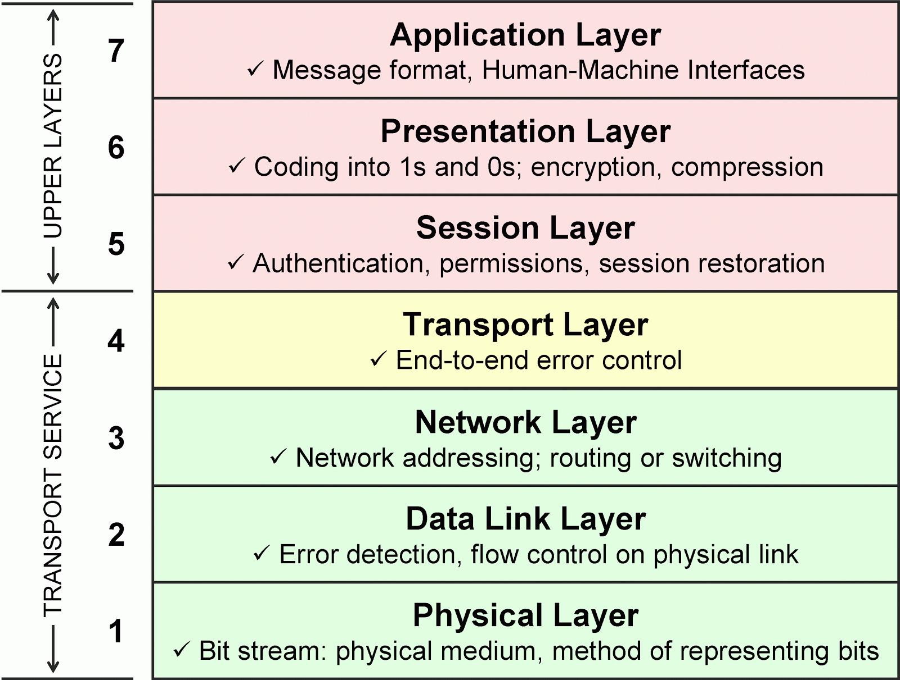
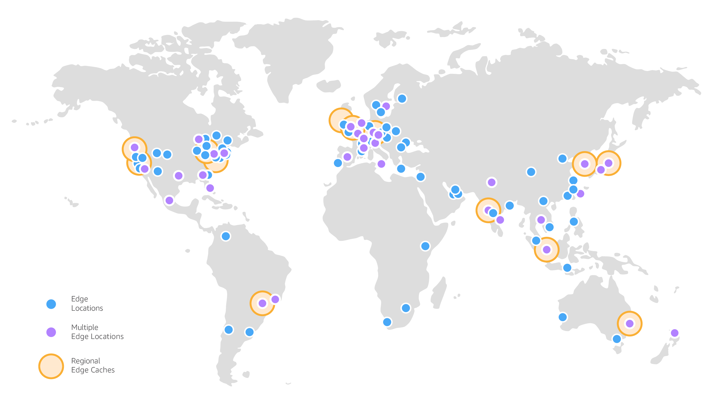

# Виртуальные сети в облаке. Amazon VPC

<i>
После запуска своего первого EC2-экземпляра Джон и Эмма были довольны: сервер работал. Но вскоре возник вопрос.

– Слушай, – сказала Эмма, – а как вообще пользователи найдут наш сервер? У него же только какой-то IP внутри сети.

Джон усмехнулся: – Вот именно. Без сети всё это не имеет смысла. Сервер может быть отличным, но если к нему нельзя подключиться, толку мало.

Они открыли раздел VPC в консоли AWS. На экране появилась схема: виртуальная сеть, подсети, интернет-шлюз.

– Смотри, – продолжил Джон, – VPC — это как если бы у нас был собственный дата-центр, только в облаке. Внутри него мы можем строить подсети: публичные для веб-серверов, приватные для баз данных.

Эмма кивнула: – То есть как комнаты в доме: в гостиную могут зайти гости, а в кладовую — только хозяева.

– Именно! – оживился Джон. – А интернет-шлюз — это дверь из дома на улицу. Если хотим, чтобы сервер был доступен из интернета, нужно провести маршрут через эту дверь и выдать ему публичный адрес.

– А если не хотим, чтобы кто-то стучался с улицы? – спросила Эмма.

– Тогда используем NAT. Серверы в приватных подсетях сами могут выходить в интернет, например, за обновлениями, но никто не сможет достучаться к ним снаружи.

Они переглянулись. Картина становилась всё яснее: сеть в облаке — это не просто набор IP-адресов, а целая архитектура, которая определяет, кто и как может общаться с их приложением.

– Получается, если мы хотим построить реальное приложение, нам нужно думать не только о сервере, но и о том, в какой подсети он живёт, как он выходит в интернет и кто может к нему подключиться, – сказала Эмма.

– Верно, – ответил Джон. – Сегодня мы поняли главное: без сети сервер — это просто коробка, а VPC делает так, что эта коробка становится частью целого мира.
</i>

## Вопросы для самопроверки

После изучения этой главы вы сможете ответить на следующие вопросы:

1. Что такое IP-адрес и чем отличаются приватные и публичные IP?
2. Зачем нужна подсеть и какие адреса в ней зарезервированы AWS?
3. В чём разница между Internet Gateway и NAT Gateway?
4. Что делает локальный маршрут в таблице маршрутов VPC?
5. Для чего используется Security Group, а для чего Network ACL?
6. Какие типы маршрутизации поддерживает Route 53?
7. Как работает Amazon CloudFront и зачем нужны edge-локации и региональные кэши?

## Основы сетей

Несмотря на то, что тема сетей обычно является очень сложной для студентов, в контексте облачных вычислений и AWS мы будем рассматривать только базовые концепции, необходимые для понимания работы с виртуальными частными облаками (VPC). Перед этим мы кратко рассмотрим основные понятия сетей, чтобы заложить фундамент для дальнейшего изучения.

### Что такое сеть и зачем она нужна?

_Компьютерная сеть_ – это совокупность взаимосвязанных устройств (компьютеров, серверов и т.д.), которые могут обмениваться данными и совместно использовать ресурсы [^1]. Проще говоря, если у вас есть два компьютера, чтобы они «поговорили» друг с другом (например, обменялись сообщениями, файлами), их нужно соединить в сеть.

Например, _компьютер A_ хочет отправить файл _компьютеру B_ - для этого должен существовать канал связи между ними (кабель или Wi-Fi) и общие правила обмена данными (протоколы). Сети позволяют устройствам обмениваться сообщениями, как люди обмениваются письмами через почту, только гораздо быстрее.

Если у вас есть два компьютера, вы можете соединить их напрямую с помощью кабеля, и они смогут обмениваться данными. Для этого каждому компьютеру нужно назначить IP-адрес, иначе устройства не смогут "понять", куда отправлять пакеты.

### Подсети и IP-адреса (IPv4, IPv6)

Чтобы управлять сетью, её удобно делить на *подсети*.

*Подсеть* – это логически выделенная часть сети, где все устройства связаны общим сетевым префиксом.  

Подсети позволяют:

- группировать устройства (например, серверы отдельно, принтеры отдельно);
- разграничивать доступ (например, база данных закрыта от интернета, а веб-сервер открыт);  
- уменьшать «шум» в сети, чтобы не все устройства видели весь трафик;  
- упростить администрирование и масштабирование.  

> *Подсеть* — это как «комната» в доме. В одной комнате (подсети) все слышат друг друга, но чтобы поговорить с соседями из другой комнаты — нужна дверь (маршрутизатор).  


Чтобы компьютеры внутри сети находили друг друга, у каждого есть *IP-адрес* — уникальный числовой идентификатор.  

IP-адрес состоит из двух частей:

- *адрес сети* (общий для подсети),  
- *адрес хоста* (конкретное устройство в этой подсети).

*Например*:  
- Сеть `192.168.1.0/24`,  
- Устройства: `192.168.1.2`, `192.168.1.3`, `192.168.1.4`.  Все они принадлежат одной подсети, потому что первые 24 бита (`192.168.1`) у них совпадают. *Внутри одной подсети устройства могут общаться напрямую, используя только адрес хоста (последние 8 бит). А чтобы связаться с устройством из другой подсети, нужен маршрутизатор*.

Существуют два основных формата IP-адресов:

_IPv4-адрес_ состоит из 32 бит (четыре числа от 0 до 255 через точку, например 192.168.1.10).

_IPv6-адрес_ – 128 бит (в записи используется восемь блоков шестнадцатеричных чисел, например 2001:0db8:85a3::8a2e:0370:7334), такие адреса ввели, чтобы хватило для всех устройств.

> IPv6 появился, потому что IPv4-адресов стало не хватать.

### Как компьютеры общаются в одной подсети

Представьте, что у нас есть два компьютера в офисе, подключённые к одному роутеру.  
Они получают адреса из одной подсети:  

- Компьютер A → `192.168.1.2`  
- Компьютер B → `192.168.1.3`  

Когда A хочет отправить файл B, он использует его IP-адрес.  
Роутер проверяет адрес назначения и определяет, что оба устройства находятся в одной подсети.  
В таком случае данные передаются напрямую *внутри локальной сети*, без выхода за её пределы.   


> Подсеть — это как комната, где все устройства видят друг друга напрямую.  
> А IP-адрес — это табличка с именем на двери: «где именно находится компьютер».  

### Публичные и приватные IP-адреса

Адреса бывают _публичные_ (внешние) и _приватные_ (внутренние).

_Публичный IP-адрес_ уникален в интернете и позволяет устройству быть напрямую доступным из глобальной сети. Часто говорят, что публичный IP-адрес, это адрес, который маршрутизируется в глобальной сети Интернет.

_Приватный IP-адрес_ используется внутри локальных сетей – такие адреса не маршрутизируются в интернете. Например, в домашней сети все устройства (компьютеры, смартфоны) имеют приватные IP-адреса, которые не видны из интернета.

Существует ограниченный набор диапазонов IPv4, зарезервированных для частных сетей:

- 10.0.0.0 - 10.255.255.255
- 172.16.0.0 - 172.31.255.255
- 192.168.0.0 - 192.168.255.255

С этими IP-адресами устройства могут общаться внутри локальной сети, но не могут быть напрямую доступны из интернета.

Допустим, если у меня есть небольшой офис, то все компьютеры в офисе могут иметь приватные IP-адреса, например `192.168.1.1` (_компьютер A_), `192.168.1.2` (_компьютер B_) и так далее. Если _компьютер A_ хочет отправить файл _компьютеру B_, он использует его приватный IP-адрес.

Однако, если _компьютер A_ хочет получить доступ к веб-сайту в интернете, он будет использовать публичный IP-адрес (например, `203.0.113.1`). Для этого обычно используется маршрутизатор, который имеет публичный IP-адрес и выступает посредником между локальной сетью и интернетом.

Для этого используется технология _NAT (Network Address Translation)_ – она позволяет нескольким устройствам в локальной сети использовать один публичный IP-адрес для доступа в интернет. Когда устройство из локальной сети отправляет запрос в интернет, маршрутизатор заменяет его приватный IP-адрес на свой публичный IP-адрес и сохраняет информацию о том, какое устройство отправило запрос. Когда приходит ответ, маршрутизатор перенаправляет его обратно на соответствующее устройство в локальной сети.

Например, в офисе у нас есть три компьютера с приватными IP-адресами `192.168.1.1`, `192.168.1.2` и `192.168.1.3`. Также у нас есть маршрутизатор с публичным IP-адресом `203.0.113.1`, куда подключены все три компьютера.

1. Когда _компьютер A_ (`192.168.1.1`) хочет получить доступ к веб-сайту, он отправляет запрос на маршрутизатор.
2. Маршрутизатор, с помощью NAT, заменяет приватный IP-адрес на свой публичный IP-адрес `192.168.1.1 -> 203.0.113.1` и запоминает, что запрос был от _компьютера A_ в специальной таблице (_NAT table_).
3. Когда веб-сайт отвечает, ответ приходит на публичный IP-адрес маршрутизатора.
4. Маршрутизатор смотрит в свою NAT таблицу, находит, что этот ответ предназначен для _компьютера A_, и перенаправляет его обратно на `192.168.1.1`.
5. Таким образом, все три компьютера могут использовать один публичный IP-адрес для доступа в интернет, при этом оставаясь недоступными напрямую из глобальной сети.

Схема работы NAT:

```
        Интернет
            |
     [ Публичный IP: 203.0.113.1 ]
            |
      ┌─────────────┐
      │ Маршрутизатор│
      │  WAN (наружу)│
      │  LAN (внутрь)│
      └──────┬──────┘
             |
    Частный IP: 192.168.0.1  (шлюз)
             |
   ┌─────────┴─────────┐
   │                   │
Компьютер A        Компьютер B
192.168.0.2        192.168.0.3
```

### CIDR-блоки и маски подсети

Чтобы управлять или организовывать группы IP-адресов, используется концепция CIDR (Classless Inter-Domain Routing).

_CIDR-блок_ – это диапазон IP-адресов, описываемый начальным адресом сети и префиксом (количеством фиксированных бит).

Запись выглядит как `адрес/длина_префикса`, например `192.168.1.0/24`. Здесь `/24` означает, что первые `24` бита – это адрес сети, а остальные (32−24=8 бит) - адреса хостов в этой сети (хост = устройство в сети).

Таким образом, `192.168.1.0/24` охватывает адреса от `192.168.1.0` до `192.168.1.255`. Маска подсети `/24` дает 256 адресов, из которых 254 могут использоваться для хостов (_некоторые зарезервированы, о чем ниже_). CIDR позволил гибко делить адресное пространство на подсети разного размера по потребности, что повысило эффективность использования IP-адресов [^2].

Важно отметить, что из каждого диапазона IP в подсети определенные адреса зарезервированы и недоступны для устройств, так как они выполняют специальные функции:

- _Первый адрес в диапазоне_ (например, `192.168.1.0`) обычно зарезервирован как адрес сети. Этот адрес используется для идентификации самой сети и _не может быть назначен устройству_.
  - Адрес сети помогает маршрутизаторам и другим сетевым устройствам понимать, к какой сети принадлежит устройство. Например, если у вас есть два компьютера с адресами `192.168.1.2` и `192.168.1.3`, маршрутизатор будет знать, что они находятся в одной и той же сети.
- _Последний адрес в диапазоне_ (например, `192.168.1.255`) обычно зарезервирован как широковещательный адрес. Этот адрес используется для отправки сообщений всем устройствам в сети одновременно. Например, у вас в сети есть 3 компьютера с адресами `192.168.1.2`, `192.168.1.3` и `192.168.1.4`. Если вы отправите сообщение на `192.168.1.255`, все три компьютера получат это сообщение.
- _Адрес шлюза_ (обычно `192.168.1.1`) зарезервирован и используется для маршрутизации трафика из локальной сети в другие сети. _Шлюз_ — это устройство (чаще всего маршрутизатор), которое соединяет локальную сеть с внешними сетями.
  - Важно отметить, что внешние сети — это не только Интернет, это может быть: другая локальная сеть, корпоративная сеть, сеть провайдера, или конечно же Интернет.

### Что такое шлюз (Gateway)

Когда устройства находятся в одной подсети, они могут обмениваться данными напрямую.  Но если нужно отправить пакет *за пределы подсети* — например, в интернет или в другую подсеть, то он должен пройти через специальную точку — *шлюз (gateway)*.

*Шлюз* — это устройство, которое принимает трафик из вашей сети и знает, куда его перенаправить дальше. В домашних или офисных сетях роль шлюза выполняет роутер. Обычно у него адрес `192.168.1.1`, и все устройства в сети используют его как «выход наружу».

Что происходит внутри роутера (шлюза):
  
- роутер получает пакет от компьютера,  
- проверяет адрес назначения,  
- по своей *таблице маршрутизации* решает, куда дальше отправить этот пакет:  
  - если адрес в той же подсети — оставить внутри,  
  - если адрес в другой сети или в интернет — переслать туда через соответствующий интерфейс.  


Идея простая:  
- Внутри подсети компьютеры видят друг друга напрямую.  
- Для всего остального они обращаются к шлюзу.

### Модель OSI

При передаче данных по сети задействовано множество уровней – от физических проводов до приложений.

_Модель OSI (Open Systems Interconnection)_ – это концептуальная схема, разделяющая сетевое взаимодействие на 7 уровней:

1. физический,
2. канальный,
3. сетевой,
4. транспортный,
5. сеансовый,
6. уровень представления,
7. прикладной

Каждый уровень отвечает за свою функцию. Проще всего представить эту модель как почтовую службу:

1. _Физический уровень_ – реальные линии связи (кабели, радиосигналы), как почтовые дороги. Данные передаются в виде электрических сигналов или радиоволн.
2. _Канальный уровень_ – непосредственная передача кадров данных между узлами одного сегмента (как доставка письма от дома до почтового отделения).
3. _Сетевой уровень_ – маршрутизация пакетов между разными сетями, например, IP-протокол (определяет через какие узлы пройти – аналог сортировки по адресам между городами).
4. _Транспортный уровень_ – надежная доставка данных между конечными узлами, например, TCP (гарантирует, что все части сообщения дойдут и соберутся в порядке).
5. _Верхние уровни_ (сеансовый, представления, прикладной) отвечают за установление сессий, преобразование данных и непосредственно за работу приложений (например, HTTP на прикладном уровне).

Допустим, _пользователь отправил HTTP-запрос на веб-сервер_, с использованием модели OSI это выглядело бы так:

1. На _физическом уровне_ данные передаются по кабелю (или Wi-Fi) в виде электрических сигналов или радиоволн.
2. На _канальном уровне_ сигналы превращаются в кадры (frames) с адресом твоего устройства (MAC-адрес) и адресом следующего устройства (например, роутера).
3. На _сетевом уровне_ кадрам добавляется IP-адрес: твой (откуда запрос отправлен) и сервера (куда запрос должен попасть). Теперь данные можно доставить в нужное место через интернет.
4. На _транспортном уровне_ добавляется информация о портах. Например, порт 80 или 443 — это веб-сервисы. TCP следит, чтобы все кусочки данных дошли и собрались в правильном порядке.
5. На _сеансовом уровне_ поддерживается сама «сессия» общения: твой компьютер понимает, что все эти сообщения относятся к одной беседе с конкретным сервером.
6. На _уровне представления_ данные кодируются/декодируются в удобный формат. Например, текст в UTF-8 или передача в зашифрованном виде.
7. На _прикладном уровне_ работает само приложение (например, браузер), которое формирует HTTP-запрос и обрабатывает ответ от сервера.

Модель OSI важна тем, что предоставляет общий язык и структуру: оборудование и программы, работающие на разных уровнях, могут взаимодействовать по стандартным протоколам.

<center>



_Рисунок 1. Модель OSI_

</center>

## Введение в виртуальные сети в AWS

### Amazon VPC: Логически изолированная облачная сеть

При переходе в облако разработчики сталкиваются с необходимостью создавать собственные сети для облачных ресурсов.

> Когда мы говорим о виртуальных сетях, мы можем представлять их, как физические сети, но в виртуализированной форме, например, виртуальную машину (сервер) можно представить как компьютер, а виртуальную сеть – как сеть, в которой этот компьютер находится.

_Amazon VPC (Virtual Private Cloud)_ – это логически изолированная виртуальная сеть в AWS Cloud. Иными словами, VPC – ваш личный участок сети внутри AWS, отделенный от чужих участков. В этой виртуальной сети вы запускаете ресурсы AWS (EC2-инстансы, базы данных и т.д.) и полностью контролируете адресацию, маршрутизацию и безопасность.

_Зачем создавать VPC?_ Чтобы настроить свою облачную инфраструктуру под нужды приложения: вы сами выбираете диапазон IP-адресов, делите сеть на подсети, определяете, какие части будут доступны из интернета, а какие изолированы. _Например_, у вас может быть один публичный IP-адрес для веб-сервера, а база данных будет в приватной подсети, недоступной из интернета.

Без VPC все ресурсы AWS находились бы в одной глобальной сети, что небезопасно и неудобно. _VPC обеспечивает логическую изоляцию_ – никто вне вашей облачной сети не сможет увидеть или обратиться к вашим ресурсам по приватным адресам.

_Каждый VPC создается в определенном регионе AWS_ (например, eu-west-1 – Ирландия) и охватывает все зоны доступности (Availability Zones) этого региона. Хотя VPC находится в одном регионе, вы можете создавать _подсети_ в разных зонах доступности для повышения отказоустойчивости. Важно отметить, что одна подсеть - одна зона доступности. Все эти подсети будут частью одной VPC, связаны между собой локальными маршрутами (о них далее).

<center>


_Рисунок 2. Структура VPC с подсетями в разных зонах доступности_

</center>

### Подсети. Публичные и приватные подсети

Внутри VPC вы делите адресное пространство на подсети. Подсеть привязана к конкретной зоне доступности и содержит ресурсы, которые находятся в одном сегменте сети. AWS подсети делятся на _публичные_ и _частные_.

_Публичная подсеть_ – это подсеть, у которой есть выход в интернет. Ресурсы в ней могут получать публичные IP-адреса и доступны извне (если открыты соответствующие доступы). Например, веб-сервер, который должен быть доступен пользователям в интернете, размещается в публичной подсети.

_Частная подсеть_ – не имеет прямого доступа в интернет; ресурсы там получают только приватные IP и изолированы от внешнего мира. Например, база данных, которая должна быть защищена от внешних угроз, размещается в частной подсети.

Общение между _веб-сервером_ (EC2) и _базой данных_ будет происходить внутри VPC по приватным адресам (логическая изоляция и безопасность).

По умолчанию, когда вы создаете свою VPC, она не имеет _интернет-шлюза_ (выхода в интернет) и ее подсети считаются частными. В своей VPC вы сами решаете, какую подсеть сделать публичной, подключив к ней _интернет-шлюз_ и задав маршруты. Остальные останутся приватными для внутренних ресурсов.

### Диапазон VPC и ограничения CIDR

При создании VPC вы указываете: диапазон IP-адресов в виде CIDR-блока (например, `10.0.0.0/16`). _Вы не можете поменять этот диапазон после создания VPC, поэтому важно выбрать его с запасом_.

> Кстати, какой адрес сети будет у VPC с CIDR 10.0.0.0/16?

_Размер VPC ограничен_, AWS позволяет задать адресный блок от `/28` (маленькая сеть на 16 адресов) до `/16` (65,536 адресов), то есть `/16` – самый большой диапазон IPv4 для одной VPC. Такое ограничение нужно, во-первых, чтобы предотвратить слишком «жадное» использование адресов, а во-вторых, из соображений производительности: слишком большие сети сложнее маршрутизировать и сканировать на безопасность. В большинстве случаев `/16` хватает с огромным запасом, и можно постепенно добавлять адреса.

> Для IPv6 AWS сразу выделяет фиксированный блок /56 для VPC. IPv6-адресов очень много, и с таким /56 вы получаете 2^72 адресов – практически неограниченно для современных нужд.

Из каждой подсети _AWS резервирует 5 адресов для своих нужд_:

- Первый адрес (например, `10.0.1.0`) – это адрес сети. Он используется для идентификации самой подсети и не может быть назначен устройству.
- Второй адрес (например, `10.0.1.1`) используется для внутренней коммуникации VPC, то есть это адрес шлюза по умолчанию для этой подсети, через него идет трафик в другие подсети.
- Третий адрес (например, `10.0.1.2`) зарезервирован для DNS-резолвера AWS. Все запросы на разрешение доменных имен внутри VPC обрабатываются этим адресом. Например, если инстанс в вашей VPC пытается обратиться к `google.com`, то запрос сначала идет на этот адрес, чтобы получить IP-адрес `google.com`.
- Четвертый адрес (например, `10.0.1.3`) зарезервирован для будущих нужд AWS.
- Последний адрес в подсети (например, `10.0.1.255`) зарезервирован как широковещательный адрес.

### Таблицы маршрутов и локальный маршрут

В реальных сетях пакет данных доходит до адресата по таблицам маршрутизации. Это таблицы, в которых указано, куда отправлять пакеты в зависимости от их назначения. Например, если пакет адресован узлу `10.0.1.5`, таблица укажет маршрут через интерфейс, связанный с подсетью `10.0.1.0/24`. Если же адрес назначения `10.0.2.5`, будет использован маршрут через интерфейс подсети `10.0.2.0/24`. Кроме того, почти всегда в таблице маршрутов присутствует шлюз по умолчанию (_default gateway_) — адрес, на который направляется весь трафик, если для него нет более специфичного маршрута.

В AWS внутри каждой VPC автоматически создается _таблица маршрутов_ (Route Table). Таблица маршрутов содержит набор правил (маршрутов), которые определяют, куда отправлять трафик для тех или иных сетей. Каждая подсеть ассоциируется с одной таблицей маршрутов. Главное правило – это _локальный маршрут_ (маршрут для локальной VPC): он позволяет всем подсетям внутри одной VPC общаться между собой. AWS автоматически добавляет маршрут с целью на весь CIDR VPC и шлюзом `local`. Этот маршрут нельзя удалить – он гарантирует, что подсети внутри VPC связаны напрямую. _Практически это значит_: два инстанса в разных подсетях одной VPC могут обмениваться данными (по приватным IP) без дополнительных настроек.

<center>


_Рисунок 3. Таблица маршрутов с локальным маршрутом в VPC_

</center>

Помимо локального, вы добавляете свои маршруты. Например, чтобы подсеть стала публичной, в ее таблицу маршрутов добавляется правило вида: «`0.0.0.0/0 (любой адрес) → IGW (Internet Gateway)`». Это означает: отправлять весь внешний трафик из подсети на интернет-шлюз, далее – в интернет.

### Интернет-шлюз (Internet Gateway)

_Интернет-шлюз (IGW)_ — это компонент Amazon VPC, обеспечивающий соединение между вашей виртуальной сетью и глобальным интернетом. Он масштабируемый и отказоустойчивый, управляемый AWS ресурс. Подключая IGW к своей VPC, вы фактически «открываете ворота» в интернет для ресурсов внутри этой сети.

Основные функции интернет-шлюза:

1. _Точка входа и выхода для маршрутов в интернет_. IGW служит шлюзом, через который ресурсы в VPC могут отправлять и получать трафик из Интернета. Его указывают как цель в таблице маршрутов (например, `0.0.0.0/0 → igw-id`).
2. _Связь приватного и публичного адреса_. Когда у экземпляра EC2 есть публичный IP, IGW обеспечивает соответствие между его внутренним приватным адресом и внешним публичным адресом. Благодаря этому приватный адрес остаётся для внутренней сети, а в Интернет выходит уже публичный.

Например, у экземпляра EC2 есть два адреса — внутренний (приватный) и внешний (публичный). Когда сервер отправляет запрос в Интернет, Internet Gateway автоматически подставляет публичный адрес вместо приватного. А когда приходит ответ, IGW «переводит» его обратно на приватный адрес сервера, чтобы тот получил свой ответ.

> Не путайте Internet Gateway с NAT Gateway. IGW работает только тогда, когда у ресурса уже есть публичный IP, а NAT нужен для выхода в Интернет из приватных подсетей без публичных адресов.

_Чтобы сделать подсеть публичной, нужно:_ создать интернет-шлюз, прикрепить его к VPC и добавить маршрут в таблицу маршрутов подсети, направляющий внешний трафик на этот IGW. Также инстансу в этой подсети должен быть назначен публичный IP. После этого инстанс станет доступен из интернета (конечно, при правильных настройках безопасности).

<center>


_Рисунок 4. Подключение публичной подсети VPC к интернету через Internet Gateway_

</center>

> Интернет-Шлюз можно представить как маршрутизатор, который соединяет вашу VPC с внешним миром.

### NAT-шлюз (NAT Gateway) и доступ из приватных подсетей

Для частных (приватных) подсетей AWS предлагает сервис _NAT Gateway_.

_NAT-шлюз в AWS_ – управляемый сервис, который размещается в публичной подсети, имеет собственный публичный IP, и пропускает трафик из приватных подсетей в интернет, подменяя исходные адреса на свой. При этом _обратные входящие соединения извне напрямую к приватным экземплярам невозможны_ – интернет-узлы «видят» только NAT-шлюз. Таким образом, приватные инстансы могут обновлять пакеты, обращаться к внешним API, но остаются недоступны из интернета напрямую.

Чтобы использовать NAT Gateway, нужно:

1. Разместить его в публичной подсети (чтобы у самого NAT был интернет-доступ через IGW).
2. В таблице маршрутов частной подсети добавить правило: трафик на `0.0.0.0/0` отправлять не на IGW, а на `NAT-шлюз`.

Тогда любые пакеты, идущие в интернет из приватной подсети, сначала попадут на NAT, там «замаскируются» под его публичный IP и пойдут дальше через IGW. Ответные пакеты NAT обратно переадресует нужному приватному хосту.

AWS обеспечивает NAT Gateway как отказоустойчивый сервис (автоматически масштабируется, работает в нескольких зонах при необходимости). Однако он платный по часам и за объем трафика, поэтому для учебных или экономных задач иногда используют _NAT instance_ – обычную виртуальную машину в публичной подсети, настроенную как шлюз (но это требует ручного управления). В современной практике предпочтителен управляемый NAT-шлюз за счет удобства и надежности.

<center>


_Рисунок 5. NAT Gateway для доступа из приватной подсети в интернет_

</center>

Ниже представлена таблица сравнения _Internet Gateway_ и _NAT Gateway_.

| Internet Gateway (IGW)                                               | NAT Gateway                                                                                     |
| -------------------------------------------------------------------- | ----------------------------------------------------------------------------------------------- |
| Позволяет ресурсам в публичной подсети быть доступными из интернета. | Позволяет ресурсам в приватной подсети выходить в интернет, но не быть доступными из интернета. |
| Требует назначения публичного IP ресурсу.                            | Не требует назначения публичного IP ресурсу в приватной подсети.                                |
| Используется в таблице маршрутов публичной подсети.                  | Используется в таблице маршрутов приватной подсети.                                             |

### Public IP vs Private IP vs Elastic IP

Разберем виды IP-адресов, с которыми вы столкнетесь в AWS VPC:

- _Private IP_ – приватный IP-адрес, который получает каждый ресурс внутри VPC. Выделяется из диапазона VPC автоматически при запуске инстанса (либо можно задать вручную). Этот адрес виден только внутри самой VPC (или соединенных с ней сетей), но не виден в интернете.
- _Public IP_ – публичный IP-адрес из пула AWS, который может автоматически назначаться EC2-инстансу в публичной подсети. Публичный IP позволяет инстансу принимать соединения из интернета. _Важный момент_: «обычный» публичный IP, выданный при старте, не постоянен – если инстанс остановить и запустить заново, адрес может измениться.
- _Elastic IP (EIP)_ – это особый публичный IP, который вы резервируете в AWS на свою учетную запись. Вы сами привязываете Elastic IP к нужному инстансу, и он остается за вами, пока вы его не отвяжете (даже если инстанс перезапущен или остановлен). Таким образом, _EIP – постоянный внешний адрес_ для вашего сервера. _EIP бесплатен, пока он закреплен за работающим инстансом_ (если лежит без дела – AWS взимает небольшую плату, стимулируя освободить ресурс).

Использовать EIP имеет смысл для постоянных сервисов (например, веб-сайт, у которого прописан фиксированный IP). На инстансе может быть только один публичный адрес активен: либо auto-assigned public IP, либо привязанный Elastic IP. Если вы пытаетесь прикрепить EIP к инстансу, у которого уже был автоназначенный публичный IP, тот автоадрес заменяется на ваш EIP.

AWS накладывает ограничения: EIP работают только для IPv4, и только в тех подсетях, где трафик идет через IGW напрямую. Если инстанс находится за NAT и не имеет выхода в интернет напрямую, привязка EIP не даст эффекта. Также _количество Elastic IP в регионе ограничено_ (_по умолчанию 5 штук на аккаунт_, но можно увеличивать по запросу за дополнительную плату).

### VPC Peering

AWS позволяет напрямую соединять две VPC между собой с помощью VPC Peering (одноранговое подключение VPC). Пиринг создает приватный канал между двумя VPC, чтобы ресурсы одной могли обращаться к ресурсам другой по приватным IP, минуя интернет. Важные особенности VPC Peering:

- VPC могут быть в одном аккаунте или в разных, и даже в разных регионах (межрегиональный пиринговый AWS поддерживается).
- Соединение не транзитивно: если у вас есть пэринг между VPC `A` и `B`, и между `B` и `C`, это не значит, что `A` видит `C`. Для каждой пары VPC нужно свое отдельное подключение.
- Адресные пространства VPC не должны пересекаться, иначе маршрутизация будет некорректной. Например, если у вас есть VPC с CIDR `10.0.0.0/16` и другая VPC с CIDR `10.0.1.0/24`, это вызовет конфликты. Логично использовать разные диапазоны, например, первую VPC с `10.0.0.0/24`, вторую с `10.0.1.0/24`, а третью с `10.0.2.0/24`.
- _Пиринг – это не VPN и не шлюз_, а прямая привязка облачных сетей на внутренней инфраструктуре AWS. Шифрование внутри одного региона не выполняется (считается, что и так трафик идет внутри датацентров AWS), а межрегиональный трафик автоматически шифруется.
- Через peering нельзя передавать трафик «через третью сторону». Например, вы подключены пиером к VPC партнера, и у партнера есть выход в интернет – вы не сможете выйти в интернет через его VPC (AWS это блокирует).

<center>


_Рисунок 6. VPC Peering: прямое соединение двух VPC_

</center>

### Общий VPC (VPC Sharing)

Иногда в крупной организации несколько команд хотят использовать одну облачную сеть совместно. Вместо того чтобы заводить копии сетевых настроек, AWS предлагает VPC Sharing – общий доступ к подсетям VPC через сервис AWS Resource Access Manager. Суть в том, что одна учетная запись (owner) создает VPC и подсети, а затем «разшаривает» (делится) выбранными подсетями с другими аккаунтами в рамках организации AWS.

Участники (participant accounts) могут создавать ресурсы (EC2, RDS базы данных и т.п.) в этих подсетях как будто у себя, но сетью управляет основной аккаунт. Все ресурсы в шареной подсети по-прежнему находятся в одной VPC, то есть полноценно связаны друг с другом по приватным адресам и используют общие шлюзы и таблицы маршрутов.

Общий VPC упрощает межкомандное взаимодействие: например, одна команда отвечает за сеть и безопасность (основной аккаунт), а другие разворачивают в ее подсетях свои сервисы.

> VPC Sharing работает только между аккаунтами в рамках одной организации AWS (т.е. под единым AWS Organization).

<center>


_Рисунок 7. VPC Sharing: общий доступ к подсетям между аккаунтами AWS_

</center>

### Site-to-Site VPN. Подключение VPC к локальной сети

Последний из основных вариантов связи – VPN-соединение между VPC и вашей on-premises сетью.

_AWS Site-to-Site_ VPN позволяет подключить облачную VPC к вашему корпоративному датацентру через зашифрованный туннель по интернету.

- _На стороне VPC_ для этого создается Virtual Private Gateway (виртуальный частный шлюз), ассоциированный с VPC, это некий аналог интернет-шлюза, но для VPN.
- _На стороне вашего датацентра_ – физический или программный VPN-шлюз (Customer Gateway).

После настройки у вас появляется защищенный канал, по которому ресурсы в VPC могут общаться с ресурсами в офисе как будто в одной расширенной сети.

> VPN-site-to-site хорош для начального шага гибридного облака или резервного канала. Однако для постоянного большого трафика предпочтительней _AWS Direct Connect_ – выделенная линия в AWS (она быстрее и стабильнее, но дороже и требует физического подключения в точке присутствия AWS). В контексте нашей лекции достаточно понимать, что VPN дает возможность расширить VPC на вашу локальную инфраструктуру.

<center>


_Рисунок 8. Site-to-Site VPN: подключение VPC к локальной сети_

</center>

## Безопасность в VPC

AWS предоставляет многоуровневую систему защиты в VPC. Два ключевых механизма – _Security Groups_ и _Network ACLs_ (списки контроля доступа к сети).

### Группы безопасности (Security Groups)

> Про группы безопасности (SG) мы уже говорили в лекции про EC2.

_Группа безопасности_ – это брандмауэр на уровне экземпляра (_instance-level firewall_). Security Group привязывается к конкретному ресурсу (например, сетевому интерфейсу EC2-инстанса) и содержит правила, которые разрешают определенный трафик.

Security Groups удобны тем, что привязываются к ресурсам и «переезжают» вместе с ними (если, например, вы остановили инстанс и запустили другой, можете назначить ту же SG). Также SG могут ссылаться на другие SG в правилах.

В рамках VPC действует _default security group_ – она позволяет свободно общаться между всеми ресурсами внутри этой же группы, но не пускает ничего извне. Это удобно для начальных экспериментов: запущенные в default SG инстансы видят друг друга, но ничего лишнего не пробьется.

<center>


_Рисунок 9. Пример Security Group в Amazon VPC_

</center>

### Сетевые ACL (Network ACL)

_Network ACL (NACL)_ – это сетевой ACL на уровне подсети (_subnet-level firewall_). NACL ассоциируется с подсетью и контролирует трафик, входящий и исходящий для всех ресурсов в этой подсети. То есть в данном случае мы устанавливаем правила безопасности для всей подсети сразу, а не только для отдельных инстансов. Все ресурсы в подсети наследуют эти правила.

Правила NACL представляют собой список номеров правил с указанием портов/протоколов/диапазонов адресов и действия (разрешить или запретить). В отличие от SG, ACL по умолчанию разрешает весь трафик, если не задано иное (default NACL – все allow). Вы можете добавлять как разрешающие, так и запрещающие правила. Правила применяются в порядке номеров: от меньшего к большему, пока трафик не матчится правилу.

Правила делятся на входящие (inbound) и исходящие (outbound). NACL являются _stateless (без сохранения состояния)_. Это значит, что ответный трафик не учитывается автоматически, и для него нужно создавать отдельные правила. Например, если вы разрешаете входящий трафик на порт 80 (HTTP), чтобы ответы могли вернуться, нужно также разрешить исходящий трафик на порт 80.

<center>


_Таблица 1. Пример Network ACL (NACL) в Amazon VPC_

</center>

В таблице 1 разрешён весь IPv4-трафик (правило 100, ALLOW), а в конце стоит «звёздочка» (`*`) — это правило по умолчанию, которое блокирует всё остальное (DENY).

> Попробуйте создать NACL таблицу со следующими правилами.
>
> - Разрешить входящий HTTP (порт 80) и HTTPS (порт 443) из любого источника.
> - Разрешить входящий SSH (порт 22) только из вашего домашнего IP-адреса.
> - Запретить весь остальной входящий трафик.
> - Разрешить весь исходящий трафик.

Обычно NACL применяют для защиты на уровне подсети, например, чтобы блокировать весь трафик из определённых IP-диапазонов (например, из стран с высоким уровнем угроз) или разрешать только определённые протоколы. В сочетании с Security Groups NACL обеспечивают многоуровневую защиту: SG фильтруют трафик на уровне инстансов, а NACL – на уровне подсетей.

<center>


_Рисунок 10. Пример Network ACL (NACL)_

</center>

### Группы безопасности vs Сетевые ACL

| Характеристика                  | Группы безопасности (SG)                                                          | Сетевые ACL (NACL)                                                                             |
| ------------------------------- | --------------------------------------------------------------------------------- | ---------------------------------------------------------------------------------------------- |
| Уровень применения              | На уровне экземпляра (инстанса)                                                   | На уровне подсети                                                                              |
| Тип фильтрации                  | Stateful (с сохранением состояния). Возвращаемый трафик разрешается автоматически | Stateless (без сохранения состояния). Требуются отдельные правила для ответного трафика        |
| Разрешающие/запрещающие правила | Только разрешающие (ALLOW)                                                        | Разрешающие (ALLOW) и запрещающие (DENY)                                                       |
| Порядок применения правил       | Все правила оцениваются перед тем, как принять решение о разрешении трафика       | Правила оцениваются по порядку номеров, первое совпавшее правило действует                     |
| Применение                      | Обычно используется для контроля доступа к конкретным ресурсам                    | Обычно используется для контроля доступа на уровне подсети и блокировки нежелательного трафика |

## Дополнительные сервисы AWS для сетей

### AWS Route 53

Даже развернув сеть и настроив подсети, взаимодействовать по одним IP-адресам неудобно. В данном случае используется _DNS (Domain Name System)_ – система, преобразующая понятные имена в IP-адреса. Например, когда вы вводите в браузере `www.example.com`, DNS переводит это имя в IP-адрес сервера, на котором размещён сайт.

> На самом деле, когда мы обращаемся к сайту по имени, например google.com, наш компьютер сначала спрашивает у DNS-сервера, какой IP-адрес соответствует этому имени. DNS-сервер отвечает, и только после этого браузер может установить соединение с нужным сервером по его IP-адресу и загрузить страницу.

_AWS Route 53_ – это управляемый DNS-сервис от Amazon. Он позволяет регистрировать доменные имена и настраивать их маршрутизацию на ваши ресурсы AWS (или внешние). Название «53» – это порт TCP/UDP для DNS. На рисунке ниже показана упрощённая схема работы Route 53.

<center>


_Рисунок 11. Процесс разрешения DNS-запроса с использованием Amazon Route 53_

</center>

В контексте VPC Route 53 полезен тем, что обеспечивает _приватную DNS-зону для вашей VPC_: вы можете назначить имена вроде `myapp.internal` для внутренних адресов, и Route 53 будет разрешать их внутри VPC. Для внешних пользователей Route 53 поможет направить трафик на ваш публичный сервис – например, домен `devrdn.com` можно привязать к Elastic IP, и пользователи смогут заходить по имени, а не по IP.

Route 53 поддерживает различные политики маршрутизации DNS-запросов, позволяя гибко управлять трафиком:

| Тип маршрутизации           | Как работает                                                                                                                        | Где применяется                                                     |
| --------------------------- | ----------------------------------------------------------------------------------------------------------------------------------- | ------------------------------------------------------------------- |
| _Simple routing_            | Один домен указывает на один ресурс.                                                                                                | Простые сайты или тестовые окружения.                               |
| _Weighted routing_          | Трафик распределяется между ресурсами по весам (например, 70/30).                                                                   | Постепенное внедрение новой версии приложения (canary release).     |
| _Latency routing_           | Пользователь направляется к ресурсу с минимальной задержкой.                                                                        | Глобальные приложения с пользователями в разных регионах.           |
| _Geolocation routing_       | Трафик маршрутизируется в зависимости от местоположения пользователя (например, пользователи из Европы идут на европейский сервер). | Сервисы с региональным контентом (например, локализованные сайты).  |
| _Geoproximity routing_      | Трафик направляется к ближайшему ресурсу, с возможностью смещения «границ».                                                         | Балансировка нагрузки между датацентрами разных регионов.           |
| _Failover routing_          | Если основной ресурс недоступен, запрос перенаправляется на резервный.                                                              | Критически важные приложения, требующие высокой отказоустойчивости. |
| _Multivalue answer routing_ | В ответ возвращается несколько «здоровых» записей, выбранных случайно.                                                              | Простейшая балансировка нагрузки без использования ELB.             |

### Понятие CDN. Amazon CloudFront

Если ваши пользователи находятся по всему миру, задержки сети (latency) могут ухудшать их опыт. Чтобы ускорить доставку контента, используется концепт _CDN (Content Delivery Network)_ – сеть серверов, расположенных в разных географических точках, которые кэшируют ваш статический контент (например, изображения, видео, стили и скрипты) и доставляют его пользователям из ближайшей точки.

_Amazon CloudFront_ – это глобальная сеть доставки контента (CDN) от AWS. Она кэширует ваши статические (и частично динамические) ресурсы на сотнях _edge-локаций_ по всему миру, чтобы выдавать их пользователям с ближайших серверов, уменьшая время отклика. CloudFront работает в связке с вашим источником (origin), которым может быть, например, S3-бакет или HTTP-сервер в вашей VPC.

_edge-локации_ – это точки присутствия CloudFront, расположенные в крупных городах и регионах. Когда пользователь запрашивает контент.

Когда пользователь обращается за ресурсом, CloudFront определяет ближайшую к нему edge-локацию и направляет запрос туда.

- Если ресурс уже есть в кэше этой edge-локации, он сразу возвращается пользователю.
- Если ресурса нет, CloudFront запрашивает его у источника, копирует в кэш edge-локации и затем отдает пользователю. Благодаря этому последующие обращения обслуживаются быстрее.

Сеть CloudFront устроена многоуровнево:

- _Edge locations_. Это глобальная сеть дата-центров, в которых хранится самый востребованный контент, доступный максимально близко к пользователю.
- _Regional Edge Caches_. Промежуточные узлы между источником и edge-локациями. Они хранят контент, который недостаточно популярен для постоянного присутствия на каждом edge-сервере, но всё же востребован. Если edge-локация не имеет нужный ресурс, она сначала проверяет региональный кэш, прежде чем обращаться к источнику.

<center>



_Рисунок 12. Географическое распределение edge-локаций и региональных кэшей Amazon CloudFront по всему миру_

</center>

На карте отмечены:

- _Голубые точки – Edge Locations_ (локальные точки присутствия, где контент кэшируется максимально близко к пользователям).
- _Фиолетовые точки – Multiple Edge Locations_ (города или регионы с несколькими точками присутствия).
- _Оранжевые круги – Regional Edge Caches_ (промежуточные кэширующие центры, которые обслуживают менее популярный контент и находятся между основным источником и edge-локациями).

> Если объект запрашивается редко, он может быть вытеснен из кэша edge-локации, чтобы освободить место для более популярных ресурсов. Благодаря этому даже редко используемый контент можно доставить быстрее, чем напрямую с origin.

## Резюме

- _VPC (Virtual Private Cloud)_ — это «ваша сеть в облаке». Она изолирована логически, настраивается вами и служит основой для всех ресурсов в AWS.
- _Подсети_. VPC делится на подсети, каждая из которых находится в одной Availability Zone. Подсети бывают публичные (с доступом в интернет через IGW) и приватные (без прямого доступа в интернет).
- _IP-адреса_. У каждого ресурса есть приватный IP для внутренней связи; публичный или Elastic IP нужны для связи с интернетом. AWS резервирует 5 адресов в каждой подсети (адрес сети, шлюз, DNS и т.д.).
- _Таблицы маршрутов_. Определяют, куда отправлять пакеты: локально, через Internet Gateway, NAT Gateway или VPN. Локальный маршрут (local) создаётся автоматически.
- _Internet Gateway vs NAT Gateway_. IGW — «ворота» в интернет: обеспечивает входящий и исходящий трафик для публичных ресурсов. NAT — «односторонний выход» для приватных ресурсов (они могут обращаться в интернет, но извне их не видно).
- _Безопасность_. Security Groups фильтруют трафик на уровне экземпляров (stateful), Network ACL — на уровне подсетей (stateless).
- _Route 53_. Управляемый DNS-сервис AWS: преобразует имена в IP, поддерживает разные политики маршрутизации (simple, weighted, latency, geolocation, geoproximity, failover, multivalue).
- _CloudFront_. Глобальная CDN-сеть, ускоряющая доставку контента за счёт edge-локаций и региональных кэшей; работает с S3, EC2 и другими источниками.

[^1]: _What is Computer Networking?_. aws.amazon.com [online]. Available at: https://aws.amazon.com/what-is/computer-networking/
[^2]: _What is CIDR?_. aws.amazon.com [online]. Available at: https://aws.amazon.com/what-is/cidr/
[^3]: _What is OSI Model?_. aws.amazon.com [online]. Available at: https://aws.amazon.com/what-is/osi-model/
[^4]: _Amazon VPC FAQs_. aws.amazon.com [online]. Available at: https://aws.amazon.com/vpc/faqs/
