# Hands-on 5.1. Сеть для приложения

В лекции 5 мы разобрали, из чего состоит сеть в облаке: VPC, подсети, таблицы маршрутов, Internet Gateway, NAT Gateway, адреса и фильтры трафика. В этом занятии вы соберёте такую сеть сами, с нуля, без default VPC. В ней будут работать два сервера: веб-сервер, доступный из интернета, и сервер базы данных, до которого из интернета добраться нельзя.

## Что получится в конце

- VPC `demo-vpc` с диапазоном `10.0.0.0/16`, двумя публичными и двумя приватными подсетями в двух зонах доступности.
- Internet Gateway и две таблицы маршрутов: публичная ведёт в интернет через Internet Gateway, приватная через NAT Gateway.
- Экземпляр `web-server` в публичной подсети с постоянным адресом Elastic IP.
- Экземпляр `db-server` в приватной подсети без публичного адреса. Он может сам выходить в интернет, но из интернета до него дойти нельзя.
- Security Group, которые пускают к веб-серверу HTTP отовсюду и SSH только с вашего компьютера, а к серверу базы только трафик от веб-сервера.
- Эксперимент с Network ACL, который показывает, чем stateless-фильтр отличается от Security Group.

Итоговая схема повторяет рисунок 5.9 из лекции: пользователь приходит к веб-серверу через Internet Gateway, сервер базы выходит в интернет через NAT Gateway.

## Перед началом

- У вас есть ключ `student-key.pem` из Hands-on 4.1, и он лежит в папке `.ssh` в домашней папке.
- Вы работаете в регионе `Europe (Frankfurt)`. Проверяйте регион в правом верхнем углу консоли перед каждой частью.
- Закладывайте на занятие около полутора часов и делайте его за один раз.

> [!WARNING]
> NAT Gateway и публичные IPv4-адреса, в том числе Elastic IP, оплачиваются почасово, пока существуют (раздел «Сравнение и стоимость» лекции 5). Не оставляйте их «до завтра». Часть 7 с удалением ресурсов обязательна.

## Часть 1. VPC, подсети и Internet Gateway

### Шаг 1. Создайте VPC

Откройте сервис `VPC`. В меню слева выберите `Your VPCs` (_1_). В списке уже есть одна VPC с диапазоном `172.31.0.0/16`. Это default VPC, с которой вы работали в лекции 4. Её не трогаем. Нажмите `Create VPC` (_2_).

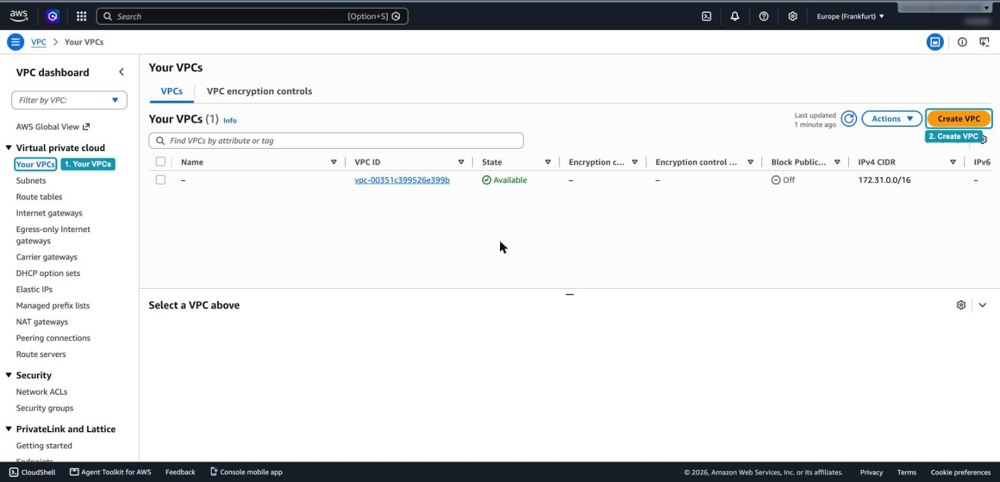

_5.1.1. Список VPC_

Заполните форму:

1. В разделе `Resources to create` выберите `VPC only` (_3_). Вариант `VPC and more` создал бы подсети и маршруты автоматически, но наша цель как раз увидеть каждый компонент.
2. В поле `Name tag` введите `demo-vpc` (_4_).
3. В поле `IPv4 CIDR` введите `10.0.0.0/16` (_5_). Это 65 536 адресов, их с запасом хватит на все подсети.
4. Оставьте `No IPv6 CIDR block` (_6_). Остальные параметры не меняйте и нажмите `Create VPC` внизу страницы.

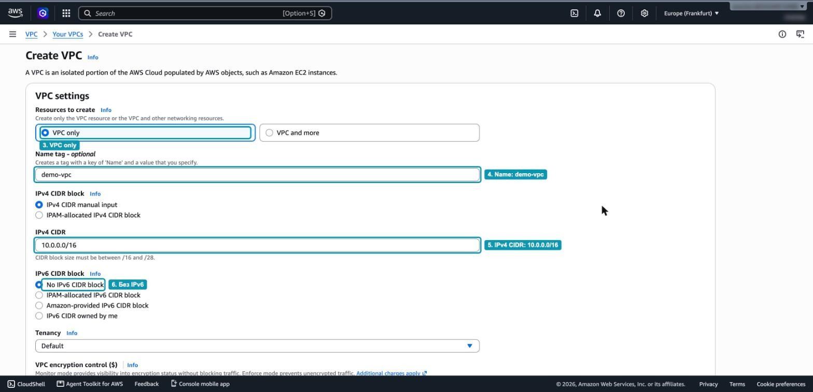

_5.1.2. Параметры новой VPC_

Откроется страница созданной VPC. Обратите внимание на два поля. `Main route table` (_7_) показывает, что AWS сразу создал главную таблицу маршрутов. `Main network ACL` (_8_) показывает Network ACL по умолчанию. Оба компонента появились сами, мы вернёмся к ним в следующих частях.

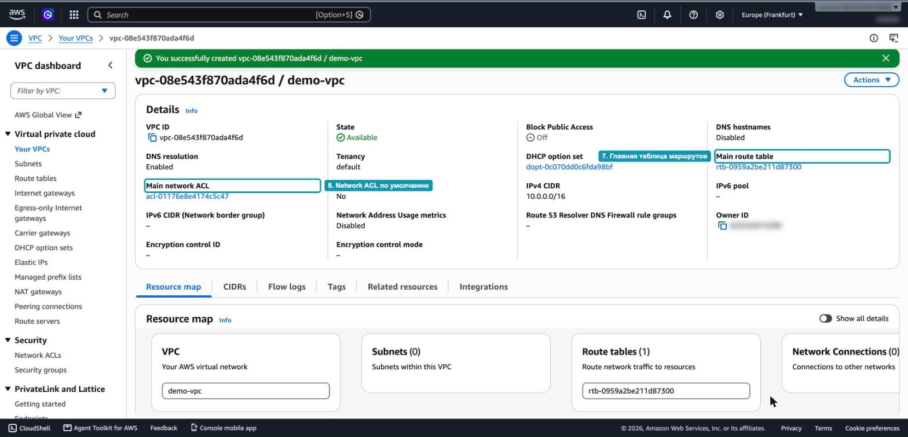

_5.1.3. Новая VPC и компоненты, созданные вместе с ней_

### Шаг 2. Создайте четыре подсети

В меню слева выберите `Subnets` и нажмите `Create subnet`. В поле `VPC ID` выберите `demo-vpc`. Ниже появится форма первой подсети:

1. В поле `Subnet name` введите `public-a` (_9_).
2. В поле `Availability Zone` выберите зону `eu-central-1a` (_10_).
3. В поле `IPv4 subnet CIDR block` введите `10.0.0.0/24` (_11_).

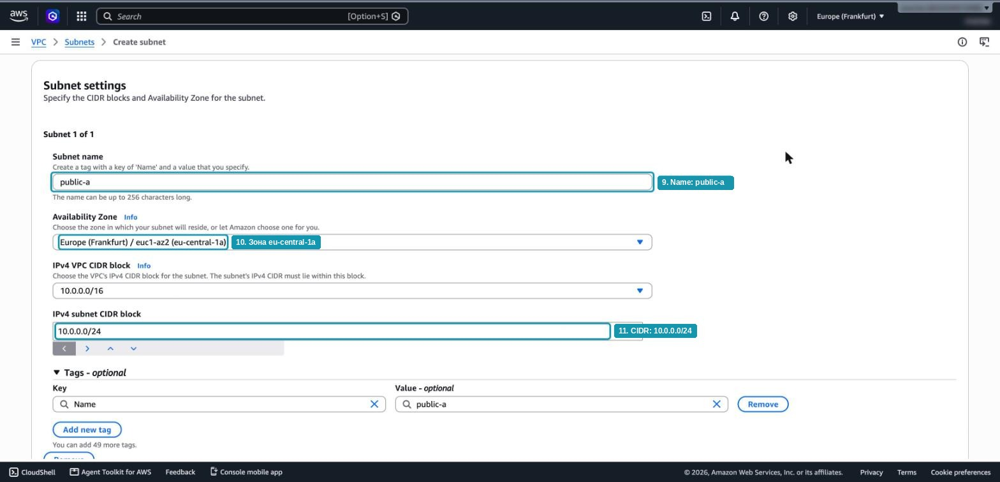

_5.1.4. Параметры подсети public-a_

Остальные три подсети можно добавить в той же форме кнопкой `Add new subnet` внизу:

| Имя         | Зона доступности | CIDR           |
| ----------- | ---------------- | -------------- |
| `public-a`  | `eu-central-1a`  | `10.0.0.0/24`  |
| `public-b`  | `eu-central-1b`  | `10.0.1.0/24`  |
| `private-a` | `eu-central-1a`  | `10.0.10.0/24` |
| `private-b` | `eu-central-1b`  | `10.0.11.0/24` |

Нажмите `Create subnet`. В списке появятся четыре подсети `demo-vpc` (_12_).

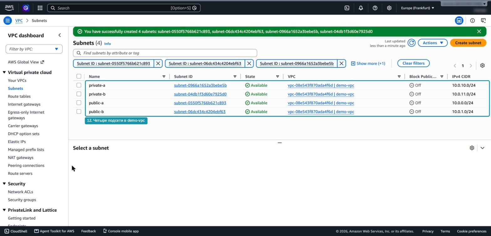

_5.1.5. Четыре подсети в demo-vpc_

Пока подсети ничем не отличаются друг от друга. Слова `public` и `private` в именах только наши обозначения. Публичной подсеть станет тогда, когда в её таблице маршрутов появится маршрут в Internet Gateway.

> [!NOTE]
> Приватным подсетям мы дали адреса `10.0.10.0/24` и `10.0.11.0/24`, а не следующие по порядку. Так по третьему числу адреса сразу видно, в какой подсети находится сервер. Технически подойдёт любой непересекающийся диапазон внутри `10.0.0.0/16`.

### Шаг 3. Создайте и подключите Internet Gateway

1. В меню слева выберите `Internet gateways` и нажмите `Create internet gateway`.
2. В поле `Name tag` введите `demo-igw` (_13_) и нажмите `Create internet gateway` (_14_).

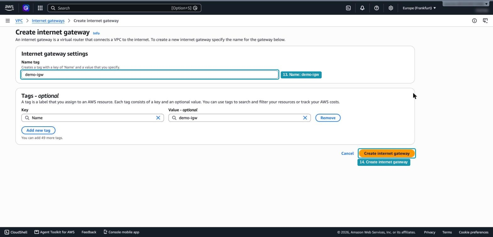

_5.1.6. Создание Internet Gateway_

Шлюз создан, но в поле `State` написано `Detached` (_15_): он пока не подключён ни к одной VPC и ничего не делает. Нажмите `Attach to a VPC` (_16_) в зелёной плашке вверху.

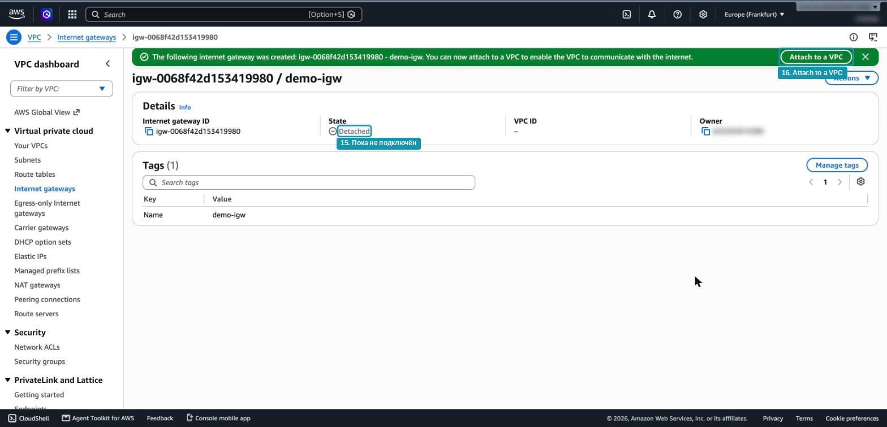

_5.1.7. Internet Gateway ещё не подключён_

В поле `Available VPCs` выберите `demo-vpc` (_17_) и нажмите `Attach internet gateway` (_18_). Состояние сменится на `Attached`.

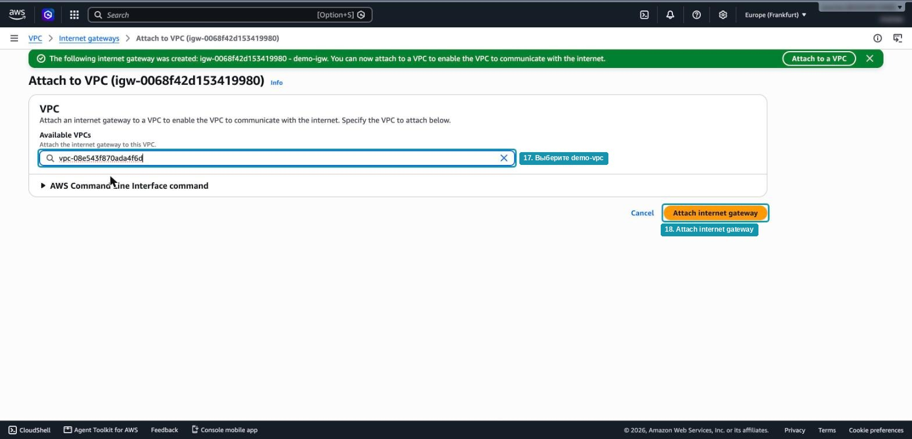

_5.1.8. Подключение Internet Gateway к demo-vpc_

Это первое из четырёх условий доступности из интернета, которые мы перечисляли в разделе «Internet Gateway» лекции. К одной VPC можно подключить только один Internet Gateway.

## Часть 2. Таблицы маршрутов

### Шаг 4. Создайте публичную таблицу маршрутов

Главную таблицу маршрутов, созданную вместе с VPC, оставим без изменений. Для публичных и приватных подсетей создадим отдельные таблицы, так их роль будет видна по имени.

В меню слева выберите `Route tables` и нажмите `Create route table`. Введите имя `public-rt` (_19_), в поле `VPC` выберите `demo-vpc` (_20_) и нажмите `Create route table`.

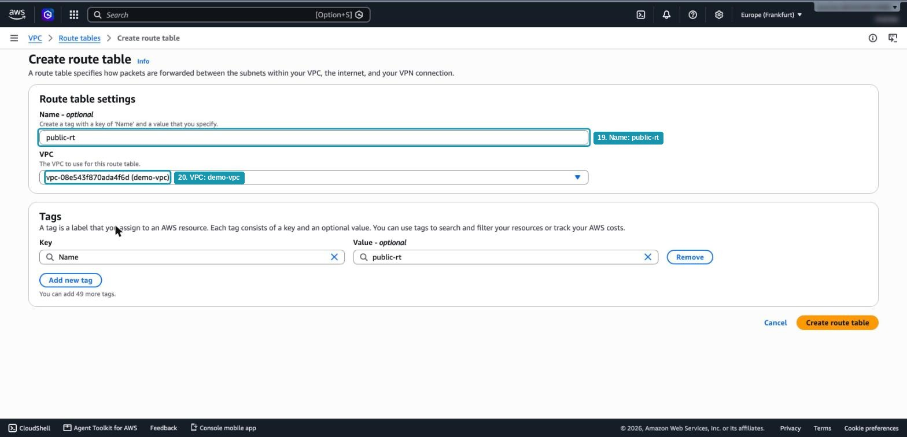

_5.1.9. Создание таблицы маршрутов public-rt_

В новой таблице уже есть маршрут `10.0.0.0/16` с целью `local` (_21_). Это локальный маршрут из лекции: он есть в каждой таблице VPC, удалить его нельзя, и благодаря ему все подсети видят друг друга. Нажмите `Edit routes` (_22_).

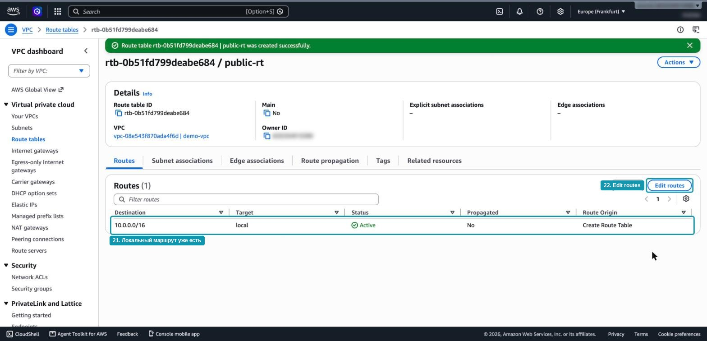

_5.1.10. Локальный маршрут в новой таблице_

### Шаг 5. Добавьте маршрут в интернет

Нажмите `Add route` и заполните новую строку:

1. `Destination`: `0.0.0.0/0` (_23_). Это маршрут по умолчанию, то есть «все адреса, для которых нет более точного маршрута».
2. `Target`: выберите `Internet Gateway`, затем `demo-igw` (_24_).
3. Нажмите `Save changes` (_25_).

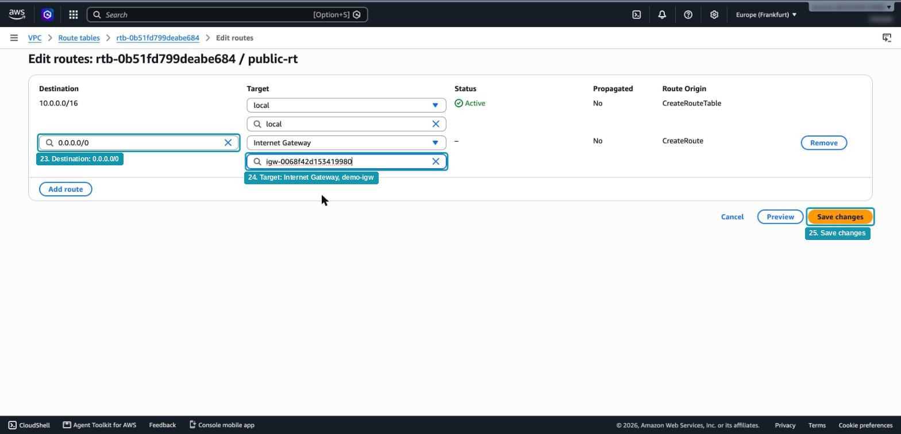

_5.1.11. Маршрут по умолчанию в Internet Gateway_

Теперь пакет к адресу внутри `10.0.0.0/16` останется в VPC, а пакет к любому другому адресу уйдёт в Internet Gateway. Работает правило самого длинного префикса: `/16` точнее, чем `/0`.

### Шаг 6. Свяжите таблицу с публичными подсетями

Таблица сама по себе ни на что не влияет, пока с ней не связаны подсети. Откройте вкладку `Subnet associations`. В разделе `Subnets without explicit associations` (_26_) перечислены все четыре подсети: пока они используют главную таблицу. Нажмите `Edit subnet associations` (_27_).

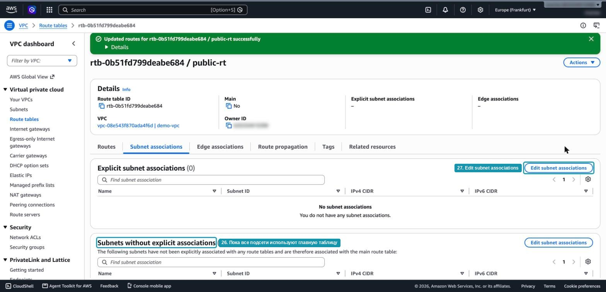

_5.1.12. Подсети пока используют главную таблицу_

Отметьте `public-a` и `public-b` (_28_) и нажмите `Save associations` (_29_).

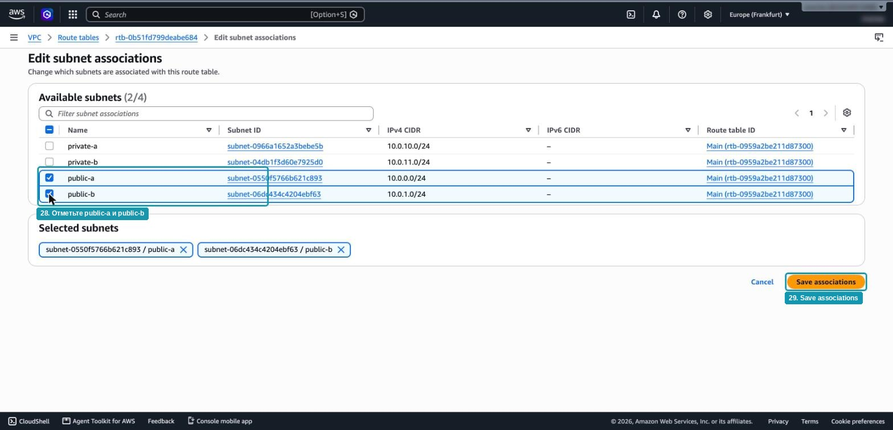

_5.1.13. Выбор публичных подсетей_

### Шаг 7. Создайте приватную таблицу маршрутов

Повторите шаги 4 и 6 для второй таблицы:

1. Создайте таблицу `private-rt` в `demo-vpc`.
2. Маршрутов в неё пока не добавляйте. Маршрут в интернет для приватных подсетей появится в части 3, когда будет готов NAT Gateway.
3. На вкладке `Subnet associations` свяжите с ней `private-a` и `private-b`.

Вернитесь к списку `Route tables` и отфильтруйте его по `demo-vpc`. Должно получиться три таблицы: `public-rt` с двумя публичными подсетями и маршрутом в Internet Gateway (_30_), `private-rt` с двумя приватными подсетями и пока только локальным маршрутом (_31_) и главная таблица без явных связей.

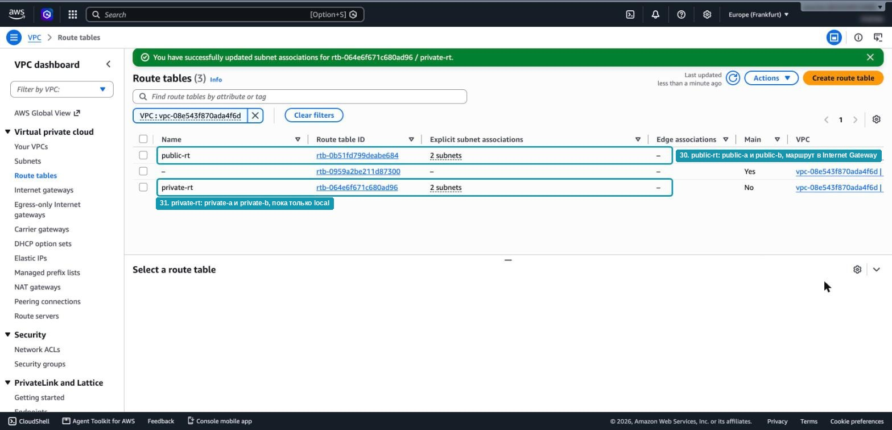

_5.1.14. Таблицы маршрутов demo-vpc_

### Шаг 8. Включите автоматический публичный адрес в публичных подсетях

Откройте `Subnets` и выберите `public-a`. На странице подсети обратите внимание на три поля:

- `Available IPv4 addresses` равно 251 (_32_). В подсети `/24` 256 адресов, но пять из них AWS резервирует (раздел «Адреса, которые резервирует AWS» лекции).
- `Auto-assign public IPv4 address` пока `No` (_33_). Экземпляр в этой подсети не получит публичный адрес, если не указать это при запуске.
- `Route table` показывает `public-rt` (_34_). Связь из шага 6 работает.

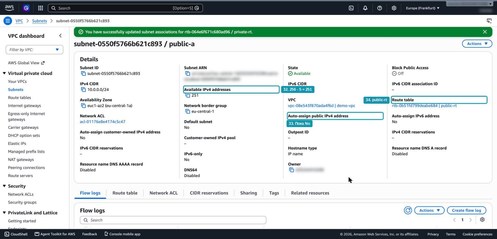

_5.1.15. Параметры подсети public-a_

Нажмите `Actions`, затем `Edit subnet settings`. Отметьте `Enable auto-assign public IPv4 address` (_35_) и сохраните. Повторите то же для `public-b`.

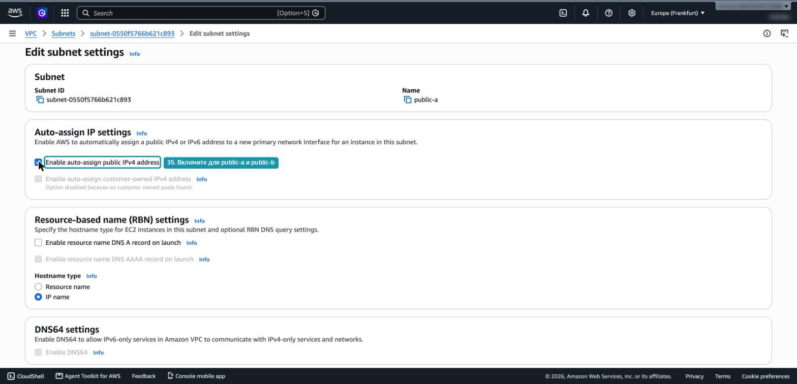

_5.1.16. Автоматическое назначение публичного адреса_

В default VPC эта настройка включена во всех подсетях, поэтому в лекции 4 экземпляры сразу получали публичный адрес. В собственной VPC её приходится включать самим, и только там, где она нужна.

## Часть 3. Elastic IP и NAT Gateway

### Шаг 9. Выделите Elastic IP для веб-сервера

Автоматический публичный адрес меняется при каждой остановке и запуске экземпляра. Веб-серверу нужен постоянный адрес, поэтому выделим Elastic IP.

В меню слева выберите `Elastic IPs` и нажмите `Allocate Elastic IP address`. Оставьте `Amazon's pool of IPv4 addresses` и нажмите `Allocate`. В списке появится адрес (_36_). Запишите его: это будущий адрес веб-сервера. Привяжем его к экземпляру в части 5, когда экземпляр будет запущен.

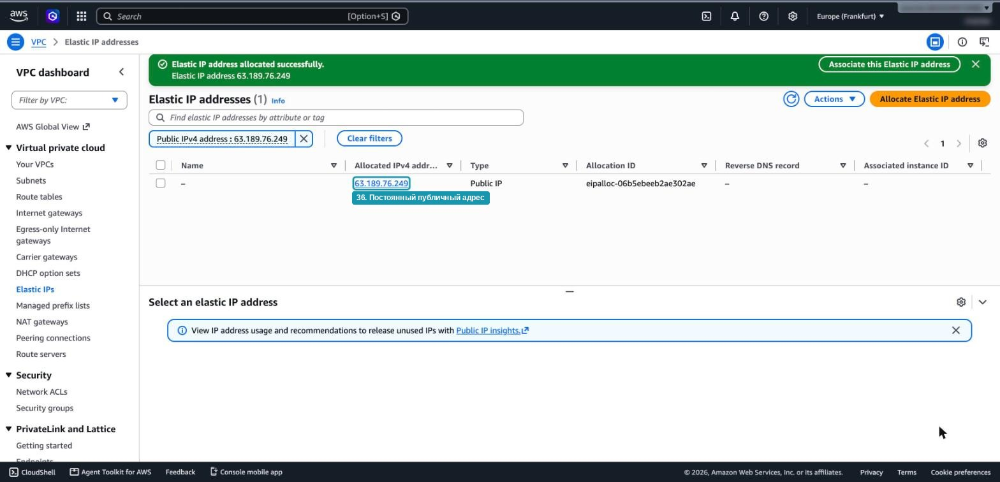

_5.1.17. Выделенный Elastic IP_

С этого момента адрес закреплён за вашим аккаунтом и оплачивается, даже если ни к чему не привязан.

### Шаг 10. Создайте NAT Gateway

В меню слева выберите `NAT gateways` и нажмите `Create NAT gateway`:

1. В поле `Name` введите `demo-nat` (_37_).
2. В разделе `Availability mode` выберите `Zonal` (_38_). Это классический NAT Gateway в одной зоне доступности, который мы разбирали в лекции.
3. В поле `Subnet` выберите публичную подсеть `public-a` (_39_). NAT Gateway всегда ставят в публичную подсеть: сам он выходит в интернет через Internet Gateway.
4. В разделе `Connectivity type` оставьте `Public` (_40_).
5. Нажмите `Allocate Elastic IP` (_41_). Консоль выделит отдельный Elastic IP для шлюза и подставит его в поле слева.
6. Нажмите `Create NAT gateway` внизу страницы.

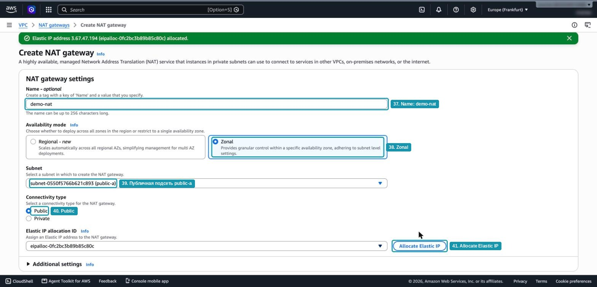

_5.1.18. Параметры NAT Gateway_

Шлюз создаётся несколько минут. Дождитесь, пока в колонке `State` появится `Available`.

> [!NOTE]
> Вариант `Regional` создаёт NAT Gateway, который сам работает во всех зонах региона. Для учебной сети из одного сервера базы достаточно зонального шлюза. В отказоустойчивой архитектуре с зональными шлюзами ставят по одному в каждой зоне, а приватным подсетям каждой зоны дают свою таблицу маршрутов.

### Шаг 11. Добавьте маршрут через NAT Gateway

Откройте `Route tables`, выберите `private-rt`, откройте вкладку `Routes` и нажмите `Edit routes`. Нажмите `Add route`:

1. `Destination`: `0.0.0.0/0` (_42_).
2. `Target`: `NAT Gateway`, затем `demo-nat` (_43_).
3. Нажмите `Save changes` (_44_).

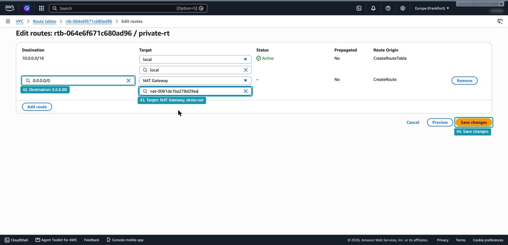

_5.1.19. Маршрут по умолчанию через NAT Gateway_

Сравните две таблицы. Маршрут по умолчанию есть в обеих, отличается только цель. Из-за этого одна пара подсетей публичная, а другая приватная.

| Таблица      | Подсети                  | `10.0.0.0/16` | `0.0.0.0/0` |
| ------------ | ------------------------ | ------------- | ----------- |
| `public-rt`  | `public-a`, `public-b`   | `local`       | `demo-igw`  |
| `private-rt` | `private-a`, `private-b` | `local`       | `demo-nat`  |

## Часть 4. Security Group

Security Group принадлежит конкретной VPC, поэтому группы из лекции 4 здесь не подойдут. Создадим две новые.

### Шаг 12. Создайте группу для веб-сервера

В меню слева выберите `Security groups` и нажмите `Create security group`:

1. `Security group name`: `web-sg` (_45_). В поле `Description` кратко опишите назначение группы, например `Web server: HTTP from anywhere, SSH from my IP`.
2. `VPC`: `demo-vpc` (_46_). Если оставить VPC по умолчанию, группа окажется в default VPC и её нельзя будет выбрать для наших серверов.
3. В разделе `Inbound rules` добавьте два правила:
   - `HTTP` с источником `Anywhere-IPv4` (_47_). Консоль подставит `0.0.0.0/0`: сайт должен быть доступен всем.
   - `SSH` с источником `My IP` (_48_). Консоль подставит адрес вашего компьютера с маской `/32`.
4. Исходящие правила не меняйте и нажмите `Create security group`.

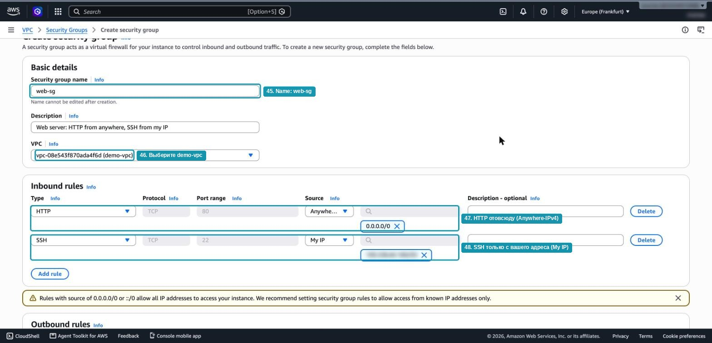

_5.1.20. Группа web-sg_

> [!IMPORTANT]
> Правило `My IP` запоминает адрес, с которого вы открыли консоль. Если вы продолжите занятие из другой сети, например из дома, SSH к веб-серверу перестанет работать. Откройте `web-sg`, нажмите `Edit inbound rules` и снова выберите `My IP` в правиле SSH.

### Шаг 13. Создайте группу для сервера базы

Снова нажмите `Create security group`:

1. `Security group name`: `db-sg` (_49_), описание, например, `Database server: access only from web-sg`. `VPC`: `demo-vpc`.
2. В разделе `Inbound rules` добавьте два правила. В обоих в поле `Source` оставьте `Custom` и начните вводить `web-sg`, консоль предложит группу из списка:
   - `PostgreSQL` (порт 5432) с источником `web-sg` (_50_);
   - `SSH` (порт 22) с источником `web-sg` (_51_).
3. Нажмите `Create security group`.

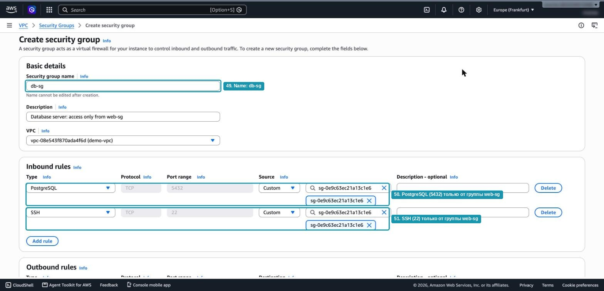

_5.1.21. Группа db-sg_

В `db-sg` нет ни одного адреса. Правила говорят «пускать трафик от любого экземпляра с группой `web-sg`». Если завтра веб-серверов станет три, менять правила базы не придётся.

## Часть 5. Серверы

### Шаг 14. Запустите веб-сервер

Откройте сервис `EC2` и нажмите `Launch instance`. Имя, образ и тип задайте так же, как в Hands-on 4.1: имя `web-server`, образ `Amazon Linux 2023`, тип `t3.micro`. Отличаются ключ и сетевые настройки:

1. В разделе `Key pair (login)` выберите `student-key` (_52_), ключ из Hands-on 4.1.
2. В разделе `Network settings` нажмите `Edit`.
3. `VPC`: `demo-vpc` (_53_).
4. `Subnet`: `public-a` (_54_).
5. `Auto-assign public IP`: `Enable` (_55_). Значение подставилось само из настройки подсети, которую мы включили в шаге 8.
6. В разделе `Firewall (security groups)` выберите `Select existing security group` и группу `web-sg` (_56_).

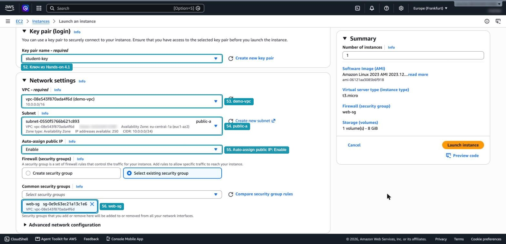

_5.1.22. Сетевые настройки web-server_

В разделе `Advanced details` в поле `User data` вставьте скрипт:

```bash
#!/bin/bash
dnf install -y nginx
echo "<h1>web-server: public-a</h1>" > /usr/share/nginx/html/index.html
systemctl enable --now nginx
```

Скрипт такой же, как в лекции 4, только страница теперь показывает, в какой подсети работает сервер. Нажмите `Launch instance`.

> [!NOTE]
> Зачем автоматический публичный адрес, если у нас есть Elastic IP? Скрипту user data при первом запуске нужен интернет, чтобы скачать nginx, а привязать Elastic IP можно только к уже запущенному экземпляру. Когда мы привяжем Elastic IP, автоматический адрес освободится и заменится на него.

### Шаг 15. Запустите сервер базы

Снова нажмите `Launch instance`. Имя `db-server`, образ и тип те же, ключ `student-key`. В `Network settings`:

1. `VPC`: `demo-vpc` (_57_).
2. `Subnet`: `private-a` (_58_).
3. `Auto-assign public IP`: `Disable` (_59_). Публичный адрес серверу базы не нужен и не должен быть.
4. Группа: `db-sg` (_60_).

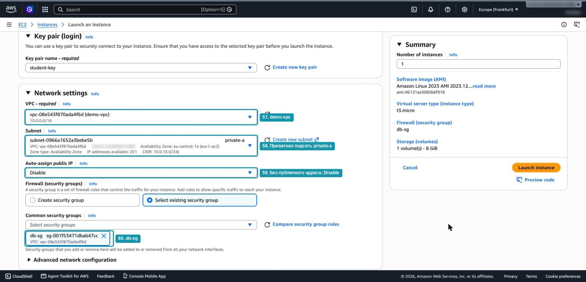

_5.1.23. Сетевые настройки db-server_

User data для этого сервера не нужен. Нажмите `Launch instance`.

### Шаг 16. Привяжите Elastic IP к веб-серверу

Дождитесь, пока `web-server` перейдёт в состояние `Running`. Откройте `Elastic IPs` (в EC2 или VPC, это один и тот же список), выберите адрес из шага 9 и нажмите `Actions`, затем `Associate Elastic IP address`:

1. Убедитесь, что вверху указан нужный адрес (_61_), а не адрес NAT Gateway.
2. `Resource type`: `Instance`. В поле `Instance` выберите `web-server` (_62_).
3. Нажмите `Associate` (_63_).

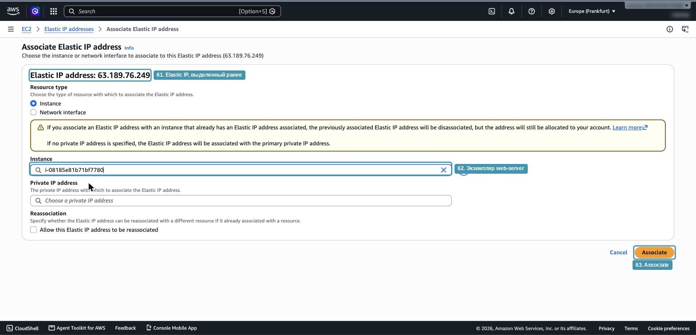

_5.1.24. Привязка Elastic IP к web-server_

### Шаг 17. Сравните адреса серверов

Откройте список `Instances` и выберите `web-server`. В поле `Public IPv4 address` теперь стоит Elastic IP (_64_), а в поле `Private IPv4 addresses` адрес из диапазона `public-a`, например `10.0.0.42` (_65_).

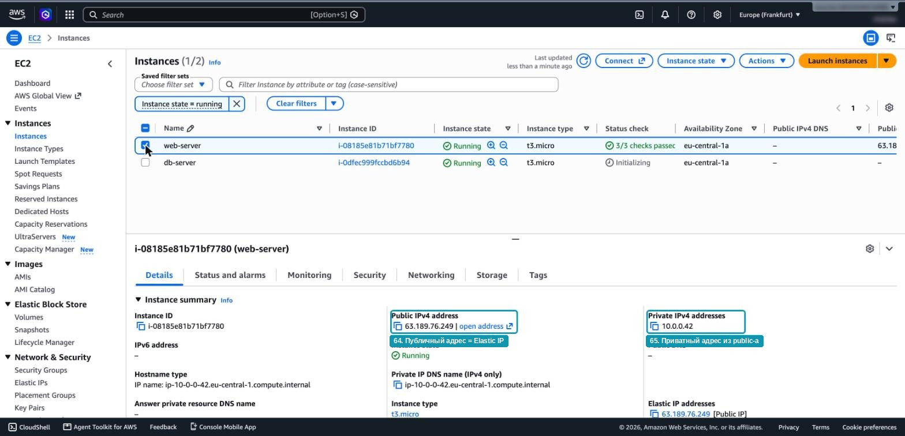

_5.1.25. Адреса web-server_

Выберите `db-server`. Публичного адреса нет (_66_), приватный адрес из диапазона `private-a`, например `10.0.10.82` (_67_). Запишите его, он понадобится в следующей части.

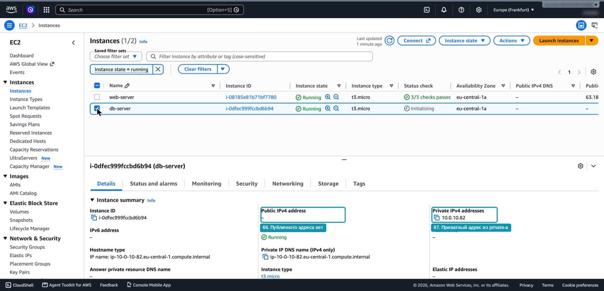

_5.1.26. Адреса db-server_

## Часть 6. Проверки

Дальше в командах используются два обозначения: `<Elastic-IP>` это адрес веб-сервера из шага 9, `<IP-базы>` это приватный адрес `db-server` из шага 17.

### Шаг 18. Откройте сайт

Откройте в браузере `http://<Elastic-IP>`. Вы увидите страницу, которую создал скрипт user data (_68_).


_5.1.27. Страница веб-сервера по Elastic IP_

Запрос прошёл всю цепочку из лекции: Internet Gateway подключён к VPC, в таблице `public-rt` есть маршрут в него, у сервера есть публичный адрес, а `web-sg` разрешает порт 80.

### Шаг 19. Подключитесь к веб-серверу по SSH

```bash
ssh -i ~/.ssh/student-key.pem ec2-user@<Elastic-IP>
```

В Windows PowerShell вместо `~` используйте `$HOME`, как в Hands-on 4.1. Посмотрите, какой адрес сервер видит у себя:

```bash
ip -4 -brief address    # интерфейс ens5 и только приватный адрес, например 10.0.0.42/24
```

Публичного адреса в выводе нет: как мы говорили в лекции, экземпляр знает только приватный адрес, а публичный подставляет Internet Gateway. Наберите `exit`.

### Шаг 20. Подключитесь к серверу базы через веб-сервер

Напрямую подключиться к `db-server` нельзя: у него нет публичного адреса, а приватный адрес `10.0.10.x` в интернете не маршрутизируется. Подключимся через веб-сервер, который будет работать как jump host.

Ключ должен оставаться на вашем компьютере. Для этого его добавляют в SSH-агент, программу, которая хранит ключи в памяти и отвечает на запросы серверов по цепочке:

```bash
ssh-add ~/.ssh/student-key.pem
ssh -J ec2-user@<Elastic-IP> ec2-user@<IP-базы>
```

Параметр `-J` означает «сначала подключись к веб-серверу, а через него к серверу базы». Первое соединение пропускает правило SSH из `web-sg` (ваш адрес), второе правило SSH из `db-sg` (источник `web-sg`).

> [!TIP]
> Если `ssh-add` отвечает, что не может подключиться к агенту (так бывает в Windows, где служба `ssh-agent` по умолчанию выключена), используйте вариант без агента. Он работает во всех ОС:
>
> ```bash
> ssh -i ~/.ssh/student-key.pem -o ProxyCommand="ssh -i ~/.ssh/student-key.pem -W %h:%p ec2-user@<Elastic-IP>" ec2-user@<IP-базы>
> ```

> [!WARNING]
> Не копируйте `student-key.pem` на веб-сервер, чтобы подключаться к базе оттуда. Веб-сервер доступен из интернета, и если его взломают, вместе с ним уйдёт ключ ко всем вашим серверам.

### Шаг 21. Проверьте выход в интернет через NAT Gateway

Вы на `db-server`. Установите клиент PostgreSQL:

```bash
sudo dnf install -y postgresql16
psql --version
```

Установка проходит, хотя у сервера нет публичного адреса. Узнайте, с какого адреса сервер виден в интернете:

```bash
curl https://checkip.amazonaws.com
```

Сервис `checkip.amazonaws.com` возвращает адрес, с которого к нему пришёл запрос. Вы увидите Elastic IP шлюза `demo-nat` из шага 10, а не Elastic IP веб-сервера. Весь исходящий трафик приватной подсети уходит от имени NAT Gateway.

### Шаг 22. Проверьте Security Group между серверами

PostgreSQL-сервер мы ставить не будем, вместо него на порт 5432 поставим простой HTTP-сервер из стандартной библиотеки Python. Для проверки сети это одно и то же: важен порт, а не программа, которая его слушает. На `db-server` выполните:

```bash
python3 -m http.server 5432
```

Откройте второй терминал и подключитесь к веб-серверу, как в шаге 19. С веб-сервера выполните:

```bash
curl http://<IP-базы>:5432
```

Вы увидите HTML-список файлов. Запрос пропустило правило `PostgreSQL` из `db-sg`, потому что у веб-сервера группа `web-sg`.

Теперь проверьте порт, которого нет в `db-sg`. На `db-server` остановите сервер клавишами `Ctrl+C` и запустите его на другом порту:

```bash
python3 -m http.server 8080
```

С веб-сервера:

```bash
curl --max-time 5 http://<IP-базы>:8080
```

Через пять секунд `curl` сообщит о тайм-ауте. Маршрут между подсетями есть (локальный маршрут), процесс порт слушает, но Security Group пакет отбрасывает молча. Остановите сервер `Ctrl+C` и закройте оба подключения командой `exit`.

## Часть 7. Эксперимент с Network ACL

До сих пор все подсети использовали Network ACL по умолчанию. Проверим на практике, что значит stateless.

### Шаг 23. Посмотрите на Network ACL по умолчанию

Откройте `VPC`, затем `Network ACLs`, и отфильтруйте список по `demo-vpc`. Выберите Network ACL с `Default` = `Yes` и откройте вкладку `Inbound rules`. Правило 100 разрешает весь трафик, правило `*` запрещает остальное, но до него дело не доходит (_69_). Исходящие правила такие же.

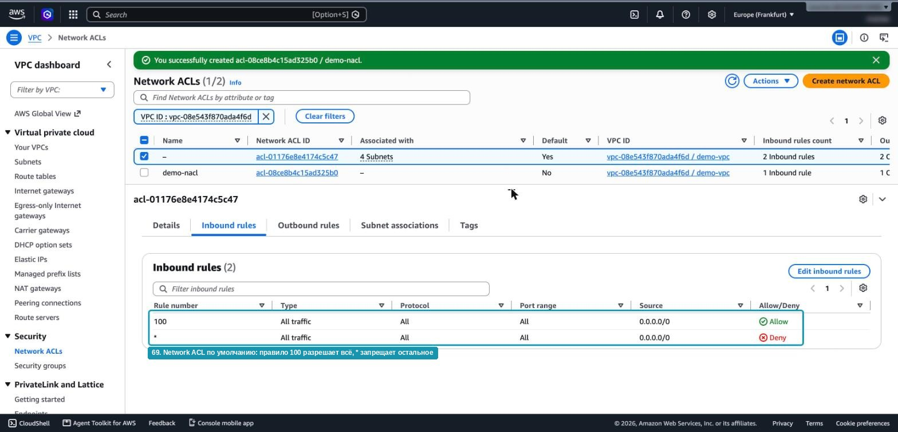

_5.1.28. Network ACL по умолчанию_

### Шаг 24. Создайте Network ACL, который пропускает только входящий HTTP

1. Нажмите `Create network ACL`, введите имя `demo-nacl`, выберите `demo-vpc` и нажмите `Create network ACL`. Новый список содержит только правила `*` и запрещает весь трафик в обе стороны.
2. Выберите `demo-nacl`, откройте вкладку `Inbound rules` и нажмите `Edit inbound rules`.
3. Нажмите `Add new rule` и задайте: `Rule number` `100`, `Type` `HTTP (80)`, `Source` `0.0.0.0/0`, `Allow/Deny` `Allow` (_70_). Нажмите `Save changes`.

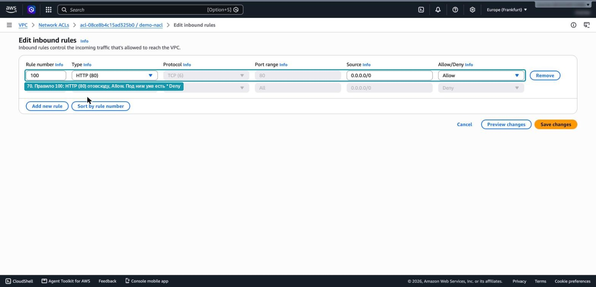

_5.1.29. Входящее правило demo-nacl_

Исходящие правила не трогайте. Получилась ровно ситуация из раздела «Network ACL» лекции: входящий порт 80 разрешён, исходящее правило только `*` Deny.

### Шаг 25. Свяжите demo-nacl с подсетью веб-сервера

Откройте вкладку `Subnet associations` у `demo-nacl` и нажмите `Edit subnet associations`. Отметьте `public-a` (_71_) и нажмите `Save changes` (_72_). Подсеть может быть связана только с одним Network ACL, поэтому `public-a` перестанет использовать список по умолчанию.

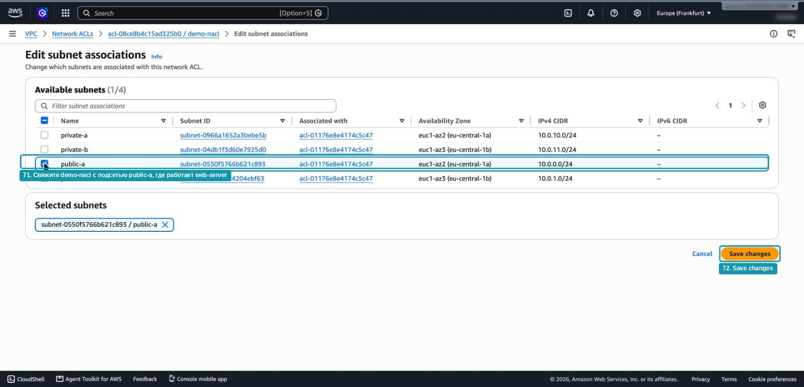

_5.1.30. Связь demo-nacl с подсетью public-a_

Обновите страницу `http://<Elastic-IP>` в браузере (лучше в приватном окне, чтобы браузер не показал страницу из кэша). Страница не откроется, браузер будет ждать до тайм-аута.

Запрос пользователя на порт 80 проходит: его пропускает входящее правило 100 и `web-sg`. Ответ сервера уходит на временный порт браузера, например 51514. Security Group помнит соединение и ответ бы пропустила, но Network ACL проверяет ответ как обычный исходящий пакет. Правила для него нет, срабатывает `*` Deny.

> [!NOTE]
> Пока `demo-nacl` связан с `public-a`, сломался не только сайт. SSH к веб-серверу не проходит, потому что входящий порт 22 не разрешён. `db-server` тоже потерял интернет: `demo-nat` стоит в той же подсети `public-a`, и его трафик проверяет тот же список. Network ACL действует на все ресурсы подсети сразу.

### Шаг 26. Разрешите ответы на временные порты

Откройте вкладку `Outbound rules` у `demo-nacl` и нажмите `Edit outbound rules`. Добавьте правило: `Rule number` `100`, `Type` `Custom TCP`, `Port range` `1024-65535`, `Destination` `0.0.0.0/0`, `Allow` (_73_). Нажмите `Save changes`.

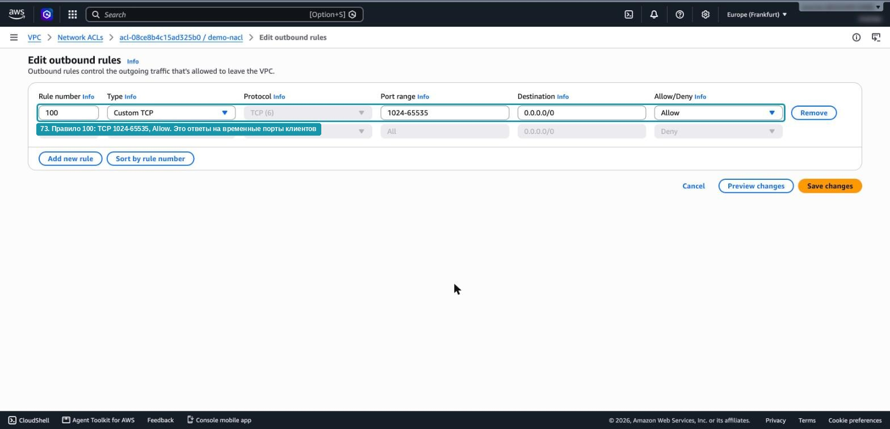

_5.1.31. Исходящее правило для ответов_

Обновите страницу. Сайт снова открывается: ответы на временные порты клиентов теперь проходят. SSH и выход `db-server` в интернет по-прежнему не работают, для них нужны свои правила в обе стороны. Именно поэтому точные ограничения обычно задают в Security Group, а Network ACL оставляют в состоянии по умолчанию.

### Шаг 27. Верните Network ACL по умолчанию

1. В списке `Network ACLs` выберите Network ACL по умолчанию для `demo-vpc`.
2. Нажмите `Actions`, затем `Edit subnet associations`.
3. Отметьте `public-a` и нажмите `Save changes`.

У списка по умолчанию нельзя снять связь с подсетью, но можно добавить подсеть к нему. Так `public-a` вернётся к правилам «разрешить всё», а `demo-nacl` останется без подсетей. Удалять его отдельно не нужно, он удалится вместе с VPC.

## Часть 8. Удаление ресурсов

Удаляйте ресурсы именно в этом порядке. VPC нельзя удалить, пока в ней работают экземпляры и NAT Gateway, а Elastic IP нельзя освободить, пока он к чему-то привязан.

### Шаг 28. Завершите оба экземпляра

Откройте `EC2`, затем `Instances`. Отметьте `web-server` и `db-server` (_74_), нажмите `Instance state`, затем `Terminate (delete) instance`. В окне подтверждения раскройте раздел `Release attached Elastic IPs`: консоль предупреждает, что Elastic IP веб-сервера останется в аккаунте (_75_). Нажмите `Terminate (delete)` (_76_).

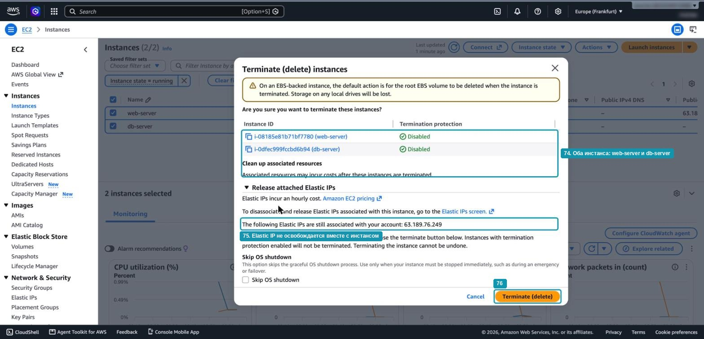

_5.1.32. Завершение экземпляров_

### Шаг 29. Удалите NAT Gateway

Откройте `VPC`, затем `NAT gateways`. Выберите `demo-nat`, нажмите `Actions`, затем `Delete NAT gateway`. Введите `delete` в поле подтверждения (_77_) и нажмите `Delete` (_78_).

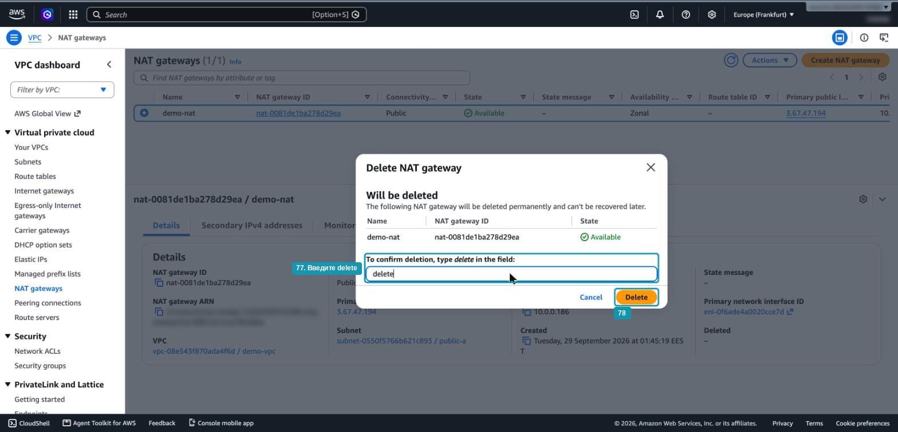

_5.1.33. Удаление NAT Gateway_

Шлюз перейдёт в состояние `Deleting`, а примерно через минуту в `Deleted`.

### Шаг 30. Освободите Elastic IP

Откройте `Elastic IPs`, отметьте все адреса, нажмите `Actions`, затем `Release Elastic IP addresses`.

Если NAT Gateway ещё удаляется, консоль не даст освободить его адрес (_79_): адрес всё ещё привязан к шлюзу. Адрес веб-сервера после завершения экземпляра свободен, и его можно освободить сразу (_80_). Нажмите `Release`, дождитесь состояния `Deleted` у шлюза и освободите второй адрес, если он остался в списке.

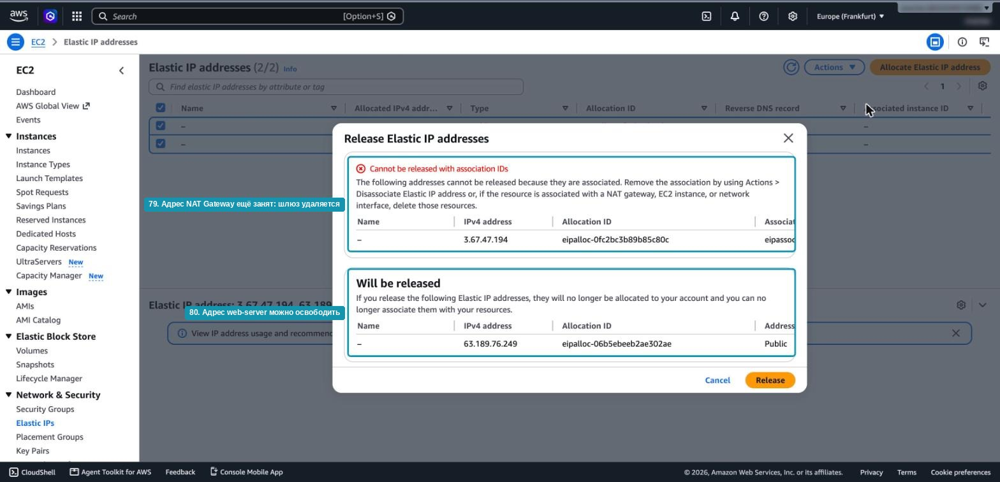

_5.1.34. Освобождение Elastic IP_

### Шаг 31. Удалите VPC

Откройте `Your VPCs`, выберите `demo-vpc`, нажмите `Actions`, затем `Delete VPC`. Консоль покажет список компонентов, которые удалятся вместе с VPC: подсети, таблицы маршрутов, Internet Gateway, Security Group `web-sg` и `db-sg`, Network ACL `demo-nacl`. Введите `delete` и подтвердите.

Проверьте, что ничего не осталось:

- В `Instances` оба сервера в состоянии `Terminated`.
- В `NAT gateways` шлюз `demo-nat` в состоянии `Deleted`.
- Список `Elastic IPs` пуст.
- В `Your VPCs` осталась только default VPC.

> [!TIP]
> Ключ `student-key` и default VPC не удаляйте, они понадобятся в следующих занятиях.

## Вопросы для самопроверки

1. Подсети `public-a` и `private-a` созданы одинаково. Что именно сделало одну из них публичной, а другую приватной?
2. Почему NAT Gateway создают в публичной подсети, хотя обслуживает он приватные?
3. Какой адрес вернул `checkip.amazonaws.com` на сервере базы и почему не адрес веб-сервера?
4. Почему `db-sg` разрешает SSH от группы `web-sg`, а не от вашего IP-адреса?
5. Почему в шаге 22 запрос на порт 8080 закончился тайм-аутом, а не ошибкой «соединение отклонено»?
6. Сайт перестал открываться, когда в Network ACL был разрешён только входящий порт 80. Почему такая же настройка в Security Group работает?
