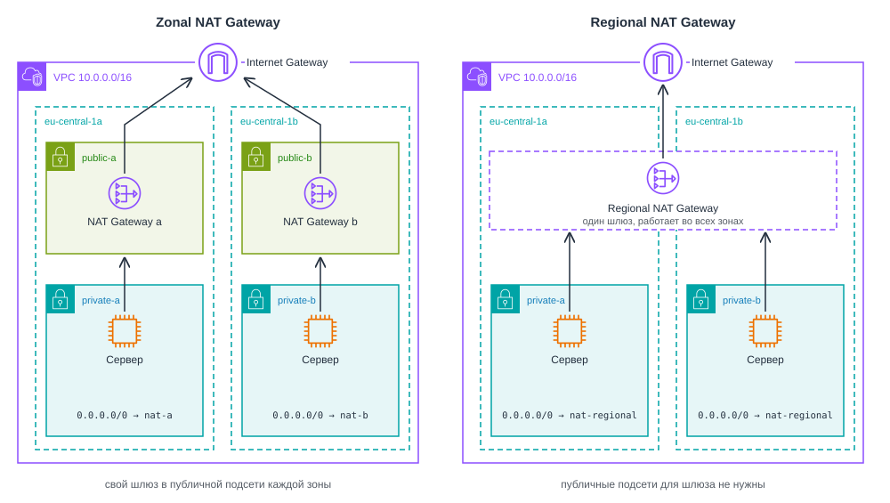

# Виртуальные сети в облаке. Amazon VPC

<i>
После второй лабораторной у Джона и Эммы наконец заработало настоящее приложение. Сервер во Франкфурте, nginx, PHP, база PostgreSQL, всё на одной машине. Эмма решила, что так жить нельзя, и вынесла базу на отдельный экземпляр. Чтобы веб-сервер мог до неё достучаться, она открыла в Security Group порт 5432. Для всех, на всякий случай.

Через два дня Джон зашёл на сервер базы и открыл журнал PostgreSQL.

– "Эмма, у нас в логе сотни попыток входа, - сказал он. - Пользователь `postgres`, пароли `123456`, `admin`, `postgres`. С адресов, которых я никогда не видел".

– "Но ведь это наша база, - Эмма заглянула в экран. - Про неё никто не знает".

– "Про неё знает весь интернет. У сервера публичный адрес, порт открыт, а боты проверяют все адреса подряд".

Эмма закрыла порт, и попытки прекратились. Но вопрос остался.

– "Слушай, а зачем базе вообще публичный адрес? С ней должен разговаривать только наш веб-сервер. Почему нельзя поставить её туда, куда из интернета просто нет дороги?"

– "Потому что мы ни разу не выбирали сеть, - медленно сказал Джон. - Мы запускали серверы в той, что AWS создал за нас".
</i>

## Содержание

- [Виртуальные сети в облаке. Amazon VPC](#виртуальные-сети-в-облаке-amazon-vpc)
  - [Содержание](#содержание)
  - [Вопросы для самопроверки](#вопросы-для-самопроверки)
  - [Ретроспектива](#ретроспектива)
  - [Основы сетей](#основы-сетей)
    - [Что такое сеть и зачем она нужна](#что-такое-сеть-и-зачем-она-нужна)
    - [IP-адрес и порт](#ip-адрес-и-порт)
    - [Подсеть](#подсеть)
    - [Как компьютеры общаются в одной подсети](#как-компьютеры-общаются-в-одной-подсети)
    - [Публичные и приватные IP-адреса](#публичные-и-приватные-ip-адреса)
    - [CIDR-блоки и маски подсети](#cidr-блоки-и-маски-подсети)
    - [Шлюз и таблица маршрутов](#шлюз-и-таблица-маршрутов)
  - [Amazon VPC](#amazon-vpc)
    - [Виртуальная сеть в облаке](#виртуальная-сеть-в-облаке)
    - [Default VPC](#default-vpc)
    - [Диапазон адресов VPC](#диапазон-адресов-vpc)
  - [Подсети](#подсети)
    - [Подсеть и зона доступности](#подсеть-и-зона-доступности)
    - [Публичная и приватная подсеть](#публичная-и-приватная-подсеть)
    - [Адреса, которые резервирует AWS](#адреса-которые-резервирует-aws)
  - [Таблицы маршрутов](#таблицы-маршрутов)
  - [Адреса экземпляра: приватный, публичный и Elastic IP](#адреса-экземпляра-приватный-публичный-и-elastic-ip)
  - [Доступ к интернету](#доступ-к-интернету)
    - [Internet Gateway](#internet-gateway)
    - [NAT Gateway](#nat-gateway)
    - [Zonal и Regional NAT Gateway](#zonal-и-regional-nat-gateway)
    - [Стоимость](#стоимость)
  - [Фильтрация трафика](#фильтрация-трафика)
    - [Security Group](#security-group)
    - [Network ACL](#network-acl)
    - [Security Group или Network ACL](#security-group-или-network-acl)
  - [Как VPC соединяют с другими сетями](#как-vpc-соединяют-с-другими-сетями)
  - [Доменные имена. Amazon Route 53](#доменные-имена-amazon-route-53)
    - [Что такое DNS](#что-такое-dns)
    - [Amazon Route 53](#amazon-route-53)
    - [Приватная зона](#приватная-зона)
  - [Резюме](#резюме)
  - [Библиография](#библиография)

## Вопросы для самопроверки

1. Что такое IP-адрес и чем отличаются приватные и публичные IP?
2. Зачем нужна подсеть и какие адреса в ней зарезервированы AWS?
3. В чём разница между Internet Gateway и NAT Gateway?
4. Что делает локальный маршрут в таблице маршрутов VPC?
5. Для чего используется Security Group, а для чего Network ACL?
6. Какие типы маршрутизации поддерживает Route 53?

## Ретроспектива

В третьей главе мы разобрали регионы и зоны доступности. Регион это группа дата-центров в одном географическом месте, зона доступности это изолированная часть региона со своим питанием, охлаждением и сетью.

В четвёртой главе мы запустили первый экземпляр EC2. Сеть тогда выбирать не пришлось: консоль сама подставила _default VPC_ и одну из её подсетей, экземпляр получил приватный и публичный адреса, а Security Group пропускала к нему только порты 22 и 80. Мы тогда отметили, что подсеть всегда находится в одной зоне доступности, и пообещали вернуться к тому, как трафик из интернета попадает внутрь VPC.

Во второй лабораторной работе на этом экземпляре заработало приложение с базой данных PostgreSQL. Всё жило на одной машине, и база была закрыта от интернета просто потому, что слушала только `localhost`.

Эта глава начинается там, где появляется второй сервер. Как только веб-сервер и база оказываются на разных машинах, им нужно общаться по сети, а базу нужно спрятать от всех остальных. Для этого придётся построить собственную сеть. Начнём с того, как устроена обычная сеть без всякого облака, а потом посмотрим, что из этого AWS даёт в виде сервиса.

## Основы сетей

Тема сетей обычно кажется студентам сложной, но для работы с облаком нужны только базовые понятия. Их мы и разберём перед тем, как переходить к VPC. Всё, что будет в этом разделе, работает одинаково в домашней сети, в офисе и в облаке.

### Что такое сеть и зачем она нужна

**Компьютерная сеть (computer network)** - совокупность связанных между собой устройств (компьютеров, серверов, телефонов), которые могут обмениваться данными и совместно использовать ресурсы. Проще говоря, если вы хотите, чтобы два компьютера "поговорили" друг с другом, например обменялись сообщениями или файлами, их нужно соединить в сеть.

Для этого нужны две вещи:

1. канал связи (кабель или Wi-Fi) и
2. общие правила обмена данными, то есть протоколы.

Данные при этом передаются не целиком, а порциями.

**Пакет (packet)** - порция данных с заголовком, в котором записаны адрес отправителя и адрес получателя.

Пакет похож на письмо в конверте: почта читает только адреса на конверте, а сетевые устройства читают только заголовок пакета. Чтобы письмо было куда доставить, у каждого устройства в сети должен быть свой адрес.

### IP-адрес и порт

Чтобы устройства внутри сети находили друг друга, у каждого из них есть IP-адрес.

**IP-адрес (IP address)** - числовой адрес устройства, уникальный в пределах своей сети.

Существуют два формата IP-адресов:

- _IPv4_. Адрес длиной 32 бита, который записывают четырьмя числами от 0 до 255 через точку, например `192.168.1.10`.
- _IPv6_. Адрес длиной 128 бит, который записывают группами шестнадцатеричных цифр через двоеточие, например `2001:db8::25`.

IPv6 появился потому, что адресов IPv4 стало не хватать на все устройства в мире. В курсе мы работаем с IPv4: на нём до сих пор построено большинство систем, и примеры с ним проще читать.

Каждое из четырёх чисел адреса IPv4 занимает 8 бит, поэтому оно не может быть больше 255. Так выглядит адрес в двоичном виде:

```text
192      168      1        10
11000000.10101000.00000001.00001010
```

IP-адрес указывает компьютер, но не программу на нём. На одном сервере одновременно работают много программ: nginx, SSH и PostgreSQL, и пакет нужно отдать одной из них.

**Порт (port)** - число от 0 до 65535 в заголовке пакета, по которому операционная система определяет, какой программе предназначен пакет.

Если IP-адрес это адрес дома, то порт это номер квартиры. Серверные программы заранее занимают известные порты и ждут на них соединений: SSH слушает порт 22, HTTP порт 80, HTTPS порт 443, PostgreSQL порт 5432. Именно эти номера вы указывали в правилах Security Group в 4 главн.

### Подсеть

Большую сеть удобно делить на части.

**Подсеть (subnet)** - логически выделенная часть сети, в которой у всех устройств совпадает начало адреса, то есть сетевой префикс.

Подсети позволяют:

- _Группировать устройства_. Например, держать серверы отдельно от компьютеров сотрудников.
- _Разграничивать доступ_. Например, закрыть базу данных от интернета и оставить открытым веб-сервер.

> [!NOTE]
>
> Подсеть можно представить как комнату в доме. Внутри одной комнаты все слышат друг друга, а чтобы поговорить с соседями из другой комнаты, нужна дверь. Роль такой двери в сети выполняет маршрутизатор.

Поэтому IP-адрес состоит из двух частей:

- _Адрес сети_. Общая часть, одинаковая для всех устройств подсети.
- _Адрес хоста_. Часть, которая отличает конкретное устройство. Хостом называют любое устройство в сети.

Например, устройства `192.168.1.2`, `192.168.1.3` и `192.168.1.4` находятся в одной подсети: первые три числа, то есть первые 24 бита, у них совпадают, а последнее число у каждого своё. Такую подсеть записывают как `192.168.1.0/24`. Число после косой черты показывает, сколько бит занимает адрес сети. Подробнее эту запись разберём чуть ниже.

### Как компьютеры общаются в одной подсети

Представьте офис, в котором компьютеры получили адреса из одной подсети:

- `192.168.1.25` у компьютера бухгалтерии,
- `192.168.1.26` у компьютера отдела продаж.

Когда бухгалтерия отправляет файл отделу продаж, её компьютер сравнивает адрес получателя со своим. Начало адреса совпадает, значит, получатель находится в той же подсети, и пакет уходит ему напрямую, не покидая локальной сети.

Если начало не совпадает, например файл нужно отправить на сервер `192.168.2.10`, компьютер не ищет получателя сам. Он отдаёт пакет маршрутизатору, а тот решает, куда передать его дальше.

**Маршрутизатор (router)** - устройство, которое соединяет несколько сетей и пересылает пакеты между ними. В домашней и офисной сети его обычно называют роутером.

Идея простая:

- Внутри подсети компьютеры обмениваются пакетами напрямую.
- Для всего остального они обращаются к маршрутизатору.

### Публичные и приватные IP-адреса

Адреса бывают _публичными_ (внешними) и _приватными_ (внутренними).

**Публичный IP-адрес (public IP address)** - адрес, уникальный во всём интернете. Устройство с таким адресом можно найти из любой точки мира. Часто говорят, что публичный адрес маршрутизируется в интернете.

**Приватный IP-адрес (private IP address)** - адрес, который используется только внутри локальной сети и в интернете не маршрутизируется.

Например, в домашней сети все компьютеры и смартфоны имеют приватные адреса, и из интернета их не видно. У ваших соседей почти наверняка точно такие же адреса, и это никому не мешает, потому что приватные адреса видны только внутри своей сети.

Для приватных сетей выделены три диапазона адресов IPv4[^1]:

- `10.0.0.0` - `10.255.255.255`.
- `172.16.0.0` - `172.31.255.255`.
- `192.168.0.0` - `192.168.255.255`.

С такими адресами устройства могут общаться внутри своей сети, но напрямую из интернета они недоступны.

Допустим, в небольшом офисе все компьютеры получили приватные адреса:

- `192.168.1.25` у компьютера бухгалтерии,
- `192.168.1.26` у компьютера отдела продаж.

Когда бухгалтерия отправляет файл отделу продаж, она использует его приватный адрес.

А если компьютеру бухгалтерии нужно открыть сайт в интернете? Отправить запрос со своим адресом он не может: сайт не сможет ответить на `192.168.1.25`, ведь таких адресов в мире миллионы. Поэтому на выходе в интернет стоит маршрутизатор, у которого есть публичный адрес, и он работает посредником между локальной сетью и интернетом.

Для этого используется технология NAT.

**NAT (Network Address Translation)** - технология, которая позволяет нескольким устройствам локальной сети выходить в интернет через один публичный IP-адрес. Маршрутизатор заменяет приватный адрес отправителя на свой публичный и запоминает, какое устройство отправило запрос, чтобы вернуть ему ответ.

Пусть у маршрутизатора офиса публичный адрес `203.0.113.7`. Тогда запрос бухгалтерии к сайту проходит так:

1. Компьютер бухгалтерии `192.168.1.25` отправляет запрос к сайту на маршрутизатор.
2. Маршрутизатор с помощью NAT заменяет приватный адрес на свой публичный (`192.168.1.25` на `203.0.113.7`) и записывает в специальную таблицу, что запрос пришёл от компьютера бухгалтерии. Эту таблицу называют **таблицей трансляций (NAT table)**.
3. Сайт отвечает на публичный адрес маршрутизатора `203.0.113.7`.
4. Маршрутизатор находит в своей таблице, что ответ предназначен компьютеру бухгалтерии, и передаёт его обратно на `192.168.1.25`.

Так все компьютеры офиса выходят в интернет через один публичный адрес и при этом остаются недоступными напрямую из интернета. Если кто-то снаружи сам отправит пакет на `203.0.113.7`, маршрутизатор не найдёт для него записи в таблице и не поймёт, кому из сотрудников его передать. Схема показана на рисунке 5.1.


_5.1. NAT: весь офис выходит в интернет через один публичный адрес_

Запомните этот механизм. В AWS он встретится в двух вариантах:

- NAT Gateway прячет много серверов за одним адресом, как офисный маршрутизатор.
- Internet Gateway связывает публичный адрес каждого сервера с его внутренним адресом один к одному.

### CIDR-блоки и маски подсети

Чтобы коротко описывать диапазоны адресов, используют запись CIDR.

**CIDR-блок (CIDR block)** - диапазон IP-адресов, который записывается как адрес сети и длина префикса, то есть количество зафиксированных бит[^2].

Запись выглядит как `адрес/длина_префикса`, например `192.168.1.0/24`. Здесь первые 24 бита зафиксированы, а оставшиеся _32 - 24 = 8_ бит могут меняться. Значит, `192.168.1.0/24` охватывает адреса от `192.168.1.0` до `192.168.1.255`, всего 2⁸ = 256 адресов.

Значит, `192.168.1.0/24` охватывает адреса от `192.168.1.0` до `192.168.1.255`, всего 2⁸ = 256 адресов. Чем больше число после косой черты, тем меньше сеть:

| Запись | Адресов в диапазоне | Пример                        |
| ------ | ------------------- | ----------------------------- |
| `/16`  | 65 536              | Самая большая сеть VPC        |
| `/24`  | 256                 | Типичная подсеть              |
| `/28`  | 16                  | Самая маленькая подсеть в AWS |
| `/32`  | 1                   | Один конкретный адрес         |
| `/0`   | Все адреса IPv4     | "Любой адрес в интернете "    |

Две последние строки вы уже видели в Security Group в 4 главе: источник `ваш-IP/32` означает ровно один компьютер, а `0.0.0.0/0` означает любой адрес.

Ту же границу можно записать маской подсети: `/24` соответствует маске `255.255.255.0`. Операционные системы до сих пор часто показывают маску, но в облаке почти везде используется запись CIDR.

Не все адреса диапазона можно выдать устройствам. Некоторые адреса выполняют специальные функции:

- _Первый адрес диапазона_, например `192.168.1.0`, это адрес самой сети. Он обозначает подсеть целиком, и назначить его устройству нельзя.
- _Последний адрес диапазона_, например `192.168.1.255`, это широковещательный адрес. Сообщение, отправленное на него, получают все устройства подсети сразу.

Поэтому из 256 адресов сети `/24` устройствам можно выдать 254. Обычно один из них, чаще всего первый свободный (`192.168.1.1`), отдают маршрутизатору. В AWS, как мы увидим дальше, зарезервированных адресов ещё больше.

### Шлюз и таблица маршрутов

Мы уже знаем, что пакет для чужой подсети компьютер передает маршрутизатору. Адрес этого маршрутизатора записан в сетевых настройках компьютера.

**Шлюз по умолчанию (default gateway)** - маршрутизатор, которому компьютер отправляет все пакеты для адресов вне своей подсети.

В домашней или офисной сети шлюзом работает роутер. Чаще всего у него адрес `192.168.1.1`, и все устройства сети используют его как "выход наружу".

Вот что происходит внутри маршрутизатора:

1. Маршрутизатор получает пакет от компьютера.
2. Проверяет адрес назначения.
3. По своей таблице маршрутов решает, куда отправить пакет дальше: в другую подсеть офиса или в интернет.

**Таблица маршрутов (route table)** - список правил, в котором для каждого диапазона адресов указано, куда отправлять пакеты.

Возьмём офис с двумя подсетями: в `192.168.1.0/24` живут компьютеры сотрудников, в `192.168.2.0/24` серверы. Таблица маршрутизатора выглядит так:

| Куда адресован пакет | Куда отправлять                |
| -------------------- | ------------------------------ |
| `192.168.1.0/24`     | В подсеть сотрудников          |
| `192.168.2.0/24`     | В подсеть серверов             |
| `0.0.0.0/0`          | Провайдеру, то есть в интернет |

Последнее правило срабатывает для всех адресов, которые не подошли под другие строки.

**Маршрут по умолчанию (default route)** - правило `0.0.0.0/0`, по которому уходят пакеты, для которых в таблице не нашлось более точного маршрута.

Если адрес подходит под несколько правил, маршрутизатор выбирает самое точное, то есть правило с самым длинным префиксом. Адрес `192.168.2.10` подходит и под `192.168.2.0/24`, и под `0.0.0.0/0`, но `/24` точнее, поэтому пакет уйдёт к серверам, а не в интернет.


_5.2. Две подсети офиса и маршрутизатор между ними_

Своя маленькая таблица маршрутов есть и у каждого компьютера. В Linux её показывает команда `ip route`:

```text
default via 192.168.1.1 dev eth0
192.168.1.0/24 dev eth0 proto kernel scope link src 192.168.1.25
```

- _Вторая строка_ говорит, что своя подсеть доступна напрямую.

- _Первая говорит_, что всё остальное отправляется на шлюз `192.168.1.1`. На экземпляре EC2 вывод будет почти таким же, только с адресами из VPC.

Идея простая:

- Внутри подсети компьютеры видят друг друга напрямую.
- Для всего остального они обращаются к шлюзу, а шлюз решает, куда отправить пакет, по своей таблице маршрутов.

> [!TIP]
>
> Напоминаю, что шлюзом может быть маршрутизатор в вашей сети, который решает, куда отправить пакеты, предназначенные для других подсетей или интернета. _Простыми словами - шлюз это выход из вашей комнаты в остальной мир_.

## Amazon VPC

### Виртуальная сеть в облаке

Приложению в облаке сеть нужна так же, как в офисе: веб-сервер должен быть доступен из интернета, а база данных нет. Но в дата-центре AWS на одних и тех же физических серверах работают машины тысяч клиентов, и протянуть каждому свои кабели невозможно. Как мы обсуждали во второй главе, физическая сеть дата-центра одна, а поверх неё программно строятся изолированные виртуальные сети.

**Amazon VPC (Virtual Private Cloud)** - сервис AWS, который создаёт логически изолированную виртуальную сеть внутри региона. В ней вы сами задаёте диапазон адресов, подсети, таблицы маршрутов, шлюзы и правила фильтрации трафика[^3].

Экземпляр EC2 это компьютер, а VPC это сеть, в которой он стоит. Чужие ресурсы не могут обратиться к вашим по приватным адресам, пока вы сами не соедините VPC с другой сетью.

Ключевые характеристики Amazon VPC:

| Характеристика      | Amazon VPC                                                                                                                                                                                                 |
| ------------------- | ---------------------------------------------------------------------------------------------------------------------------------------------------------------------------------------------------------- |
| Категория           | Сети и доставка контента (networking & content delivery)                                                                                                                                                   |
| Что делает          | Создаёт изолированную виртуальную сеть с подсетями, маршрутами, шлюзами и фильтрами трафика                                                                                                                |
| Для чего нужен      | Решать, какие ресурсы видны из интернета, какие только друг другу, и как сеть связана с другими сетями                                                                                                     |
| Где используют      | Везде, где есть экземпляры EC2, базы данных Amazon RDS, балансировщики нагрузки                                                                                                                            |
| Модель обслуживания | IaaS: вы получаете сетевую инфраструктуру и настраиваете её сами                                                                                                                                           |
| Область действия    | Региональный: VPC охватывает все зоны доступности региона, каждая подсеть находится в одной зоне                                                                                                           |
| Как оплачивается    | Сама VPC, подсети и таблицы маршрутов бесплатны. Платят за NAT Gateway, публичные IPv4-адреса, часть VPC endpoints, VPN и передачу данных[^4]                                                              |
| Как работать        | Консоль (раздел VPC), команды `aws ec2 create-vpc`, `aws ec2 create-subnet` и другие, SDK (для JavaScript пакет `@aws-sdk/client-ec2`). Отдельной группы команд для VPC нет, потому что VPC выросла из EC2 |
| Появился            | Август 2009 года, сначала как бета-версия в одном регионе[^5]                                                                                                                                              |
| Аналоги             | Google Cloud VPC, Azure Virtual Network                                                                                                                                                                    |

VPC принадлежит одному региону, но охватывает все его зоны доступности. Сеть одна, а подсети внутри неё раскладываются по разным зонам, и все они связаны между собой. Именно так строятся приложения, которые переживают отказ целой зоны.


_5.3. Структура VPC с подсетями в разных зонах доступности_

Всё, что мы разобрали на примере офиса, в VPC тоже есть, только вместо устройств это настройки:

| В офисной сети                        | В Amazon VPC                                   |
| ------------------------------------- | ---------------------------------------------- |
| Сеть офиса                            | VPC                                            |
| Подсеть                               | Подсеть, которая находится в одной зоне        |
| Маршрутизатор и его таблица маршрутов | Маршрутизатор VPC и таблицы маршрутов подсетей |
| Роутер, подключённый к провайдеру     | Internet Gateway                               |
| NAT на роутере                        | NAT Gateway                                    |
| Файрвол на компьютере                 | Security Group                                 |
| Фильтр на границе подсети             | Network ACL                                    |

### Default VPC

Когда в четвёртой главе мы запускали первый экземпляр, сеть мы не создавали. Её заранее подготовил AWS.

**Default VPC** - виртуальная сеть, которую AWS заранее создаёт в каждом регионе аккаунта и настраивает так, чтобы в ней можно было сразу запускать экземпляры с доступом в интернет[^6].

В default VPC есть:

- Диапазон адресов `172.31.0.0/16`.
- По одной подсети в каждой зоне доступности.
- Internet Gateway и маршрут `0.0.0.0/0` на него в главной таблице маршрутов. Поэтому все подсети по умолчанию публичные.
- Автоматическая выдача публичного IPv4-адреса новым экземплярам.
- Security Group и Network ACL по умолчанию.

Схема default VPC во Франкфурте показана на рисунке 5.4.


_5.4. Default VPC в регионе eu-central-1_

Экземпляр, созданный в default VPC, получает публичный адрес и маршрут в интернет, но доступен он только на тех портах, которые разрешают фильтры трафика. Так было и в четвёртой главе: к серверу проходили только порты, открытые в Security Group.

Для одного учебного сервера default VPC подходит хорошо. Со вторым сервером появляются неудобства:

- _Все подсети публичные_. Подсеть по умолчанию можно сделать приватной, связав её с отдельной таблицей маршрутов без маршрута в Internet Gateway[^7], но проще сразу спроектировать сеть с отдельными приватными подсетями.
- _Диапазон одинаков во всех аккаунтах_. Если позже понадобится соединить сеть проекта с сетью другой команды, у которой тоже default VPC, адреса совпадут, и соединить такие сети напрямую не получится.

Поэтому для проекта создают собственную VPC. Если создавать её вариантом `VPC only`, в ней нет ни выхода в интернет, ни публичных адресов: их добавляют явно и только там, где они нужны. Default VPC удалять не нужно, она пригодится для быстрых экспериментов.

### Диапазон адресов VPC

Первое решение при создании VPC это её диапазон адресов в записи CIDR[^8]:

- Размер от `/16` (65 536 адресов) до `/28` (16 адресов).
- AWS рекомендует брать адреса из приватных диапазонов: `10.0.0.0/8`, `172.16.0.0/12` или `192.168.0.0/16`.

Основной диапазон нельзя изменить после создания VPC. Можно только добавить дополнительные. Поэтому диапазон выбирают с запасом и так, чтобы он не пересекался с сетями, с которыми VPC когда-нибудь придётся соединять: другими VPC компании, сетью офиса, домашними сетями сотрудников.

> [!NOTE]
>
> Попробуйте ответить: какой адрес сети у VPC `10.0.0.0/16`, какой у неё последний адрес и сколько всего адресов она содержит?

## Подсети

### Подсеть и зона доступности

Экземпляр запускается не "в VPC", а в конкретной подсети.

**Подсеть VPC (VPC subnet)** - часть диапазона адресов VPC, которая находится в одной зоне доступности. Каждый экземпляр запускается в одной подсети и получает приватный адрес из её диапазона[^3].

Выбирая подсеть для экземпляра, вы тем самым выбираете и зону доступности, в которой он будет работать. Если вся сеть находится в одной зоне, отказ этой зоны остановит приложение целиком. Поэтому подсети создают минимум в двух зонах, даже пока сервер один.

Спланируем подсети для нашего приложения. Веб-серверу нужна публичная подсеть, базе данных приватная, и каждая из них должна быть в двух зонах. Получается четыре подсети. Каждой отдадим по 256 адресов, то есть `/24`, из диапазона VPC `10.0.0.0/16`.

В `/16` зафиксированы первые два числа адреса (`10.0`), а в `/24` первые три. Значит, подсети отличаются третьим числом: `10.0.0.0/24`, `10.0.1.0/24`, `10.0.2.0/24` и так далее. Номера выберем так, чтобы по адресу сервера было сразу понятно, где он находится: публичные подсети получат номера 0 и 1, приватные 10 и 11.

| Подсеть     | Зона доступности | Диапазон       | Назначение                     |
| ----------- | ---------------- | -------------- | ------------------------------ |
| `public-a`  | `eu-central-1a`  | `10.0.0.0/24`  | Веб-сервер                     |
| `public-b`  | `eu-central-1b`  | `10.0.1.0/24`  | Резерв для второго веб-сервера |
| `private-a` | `eu-central-1a`  | `10.0.10.0/24` | Сервер базы данных             |
| `private-b` | `eu-central-1b`  | `10.0.11.0/24` | Резерв для реплики базы данных |

Эти подсети показаны на рисунке 5.5, остальное адресное пространство оставлено на будущее.


_5.5. VPC проекта: четыре подсети в двух зонах доступности_

### Публичная и приватная подсеть

Флажка "сделать публичной" у подсети нет. Разницу задаёт маршрут.

**Публичная подсеть (public subnet)** - подсеть, таблица маршрутов которой содержит маршрут `0.0.0.0/0` в Internet Gateway.

**Приватная подсеть (private subnet)** - подсеть, таблица маршрутов которой не содержит маршрута в Internet Gateway.

Экземпляр в публичной подсети может быть доступен из интернета, если:

- У него есть публичный адрес и
- Фильтры трафика пропускают запрос.

В приватной подсети прямого пути из интернета нет, даже если экземпляр каким-то образом получил публичный адрес.

Настройка подсети `Auto-assign public IPv4 address` задаёт значение по умолчанию: _получит ли новый экземпляр публичный адрес_, если при запуске не указано иное. Её включают в публичных подсетях и выключают в приватных.

В публичной подсети размещают то, к чему приходят пользователи: веб-сервер, балансировщик нагрузки. В приватной подсети размещают всё остальное: базу данных, внутренние сервисы. Между собой они общаются по приватным адресам.

### Адреса, которые резервирует AWS

В каждой подсети AWS забирает пять адресов для собственных нужд[^9]. Для подсети `10.0.1.0/24` это:

| Адрес        | Для чего зарезервирован                                                                                              |
| ------------ | -------------------------------------------------------------------------------------------------------------------- |
| `10.0.1.0`   | Адрес самой сети                                                                                                     |
| `10.0.1.1`   | Маршрутизатор VPC, шлюз по умолчанию для экземпляров подсети                                                         |
| `10.0.1.2`   | Зарезервирован для DNS. Сам DNS-сервер VPC находится по адресу "начало диапазона VPC плюс два", у нас это `10.0.0.2` |
| `10.0.1.3`   | Зарезервирован AWS на будущее                                                                                        |
| `10.0.1.255` | Последний адрес. VPC не поддерживает широковещательную рассылку, но адрес всё равно зарезервирован                   |

В подсети `/24` экземплярам остаётся 256 - 5 = 251 адрес, в самой маленькой подсети `/28` всего 11.

## Таблицы маршрутов

В VPC нет маршрутизатора, который можно увидеть как отдельное устройство. Его роль выполняет сама сеть AWS, а вы управляете только _таблицами маршрутов_.

**Таблица маршрутов VPC (VPC route table)** - набор правил, которые определяют, куда маршрутизатор VPC отправляет пакеты, выходящие из подсети. Каждая подсеть связана ровно с одной таблицей, а одна таблица может обслуживать несколько подсетей[^3].

Вместе с VPC создаётся _главная таблица маршрутов (main route table)_. Она действует для всех подсетей, которые вы явно не связали с другой таблицей.

В каждой таблице есть строка, которую вы не добавляли:

| Destination   | Target  |
| ------------- | ------- |
| `10.0.0.0/16` | `local` |

**Локальный маршрут (local route)** - маршрут на весь диапазон VPC, который AWS добавляет в каждую таблицу автоматически и который нельзя удалить.

Благодаря локальному маршруту у пакетов между любыми подсетями VPC всегда есть путь. Пройдёт ли пакет на самом деле, решают фильтры трафика: _Security Group_ и _Network ACL_.

Пакет на адрес вне диапазона VPC уходит по маршруту `0.0.0.0/0`, если такой маршрут есть, а если нет, пакет отбрасывается. Цель этого маршрута и определяет роль подсети. Для проекта понадобятся две таблицы (рисунок 5.6):

| Таблица            | `10.0.0.0/16` | `0.0.0.0/0`          |
| ------------------ | ------------- | -------------------- |
| Публичных подсетей | `local`       | `igw-...`            |
| Приватных подсетей | `local`       | Нет, или NAT Gateway |


_5.6. Таблицы маршрутов публичной и приватной подсети_

Как и в офисной сети, выигрывает самый длинный префикс. Пакет на `10.0.10.40` подходит и под `10.0.0.0/16`, и под `0.0.0.0/0`, но уйдёт по локальному маршруту. Поэтому трафик между своими подсетями никогда не уходит в интернет.

## Адреса экземпляра: приватный, публичный и Elastic IP

У экземпляра в VPC может быть три вида адресов:

- _Приватный IP_. Выдаётся из диапазона подсети и есть у каждого экземпляра. По нему экземпляры общаются внутри VPC.
- _Публичный IP_. Выдаётся из пула AWS при запуске, если это разрешено настройкой подсети или параметрами запуска. При остановке и запуске экземпляра он меняется.
- _Elastic IP_. Публичный IP, который вы заранее выделяете в своём аккаунте и сами привязываете к экземпляру. Он не меняется, пока вы его не освободите.

**Elastic IP** - статический публичный IPv4-адрес, закреплённый за вашим аккаунтом, который можно привязать к экземпляру или сетевому интерфейсу и перенести на другой[^10].

Важно понимать, что публичный адрес не настраивается внутри операционной системы. Экземпляр видит только свой приватный адрес, а публичный (обычный или Elastic IP) сопоставляется с ним на границе VPC. Это делает Internet Gateway, о котором речь пойдёт в следующем разделе.

| Характеристика                   | Приватный IP         | Публичный IP            | Elastic IP                             |
| -------------------------------- | -------------------- | ----------------------- | -------------------------------------- |
| Откуда берётся                   | Из диапазона подсети | Из пула AWS при запуске | Из пула AWS, закрепляется за аккаунтом |
| Видит ли его ОС экземпляра       | Да                   | Нет                     | Нет                                    |
| Меняется при остановке и запуске | Нет                  | Да                      | Нет                                    |
| Стоимость                        | Бесплатно            | Почасовая оплата        | Почасовая оплата, даже без привязки    |

Elastic IP полезен, когда экземпляру нужен постоянный адрес, например чтобы на него указывала DNS-запись. В рабочих системах сайт чаще размещают за балансировщиком нагрузки или CDN, и тогда Elastic IP самим экземплярам не нужен.

Автоматически выданный публичный адрес у экземпляра может быть только один. Если привязать к экземпляру Elastic IP, этот адрес освобождается, и его место занимает Elastic IP. По умолчанию в регионе можно держать до пяти Elastic IP.

## Доступ к интернету

### Internet Gateway

**Internet Gateway** - компонент VPC, который соединяет её с интернетом. Для IPv4 он сопоставляет приватные адреса экземпляров с их публичными адресами[^11].

Это не виртуальная машина: размер выбирать не нужно, пропускную способность и отказоустойчивость обеспечивает AWS. К VPC можно подключить только один Internet Gateway, отдельно за него не платят.

Возьмём веб-сервер с приватным адресом `10.0.0.25` и публичным `198.51.100.25`. Когда он отправляет пакет в интернет, Internet Gateway подставляет публичный адрес вместо приватного. Когда приходит ответ или новый запрос на `198.51.100.25`, Internet Gateway заменяет адрес обратно на `10.0.0.25`. Это тот же NAT, что в офисе, только один к одному: у каждого экземпляра свой публичный адрес, поэтому соединение может начать и пользователь из интернета (рисунок 5.7).


_5.7. Путь запроса пользователя через Internet Gateway_

Чтобы экземпляр был доступен из интернета, должны выполниться пять условий:

1. Internet Gateway подключён к VPC.
2. В таблице маршрутов подсети есть маршрут `0.0.0.0/0` на этот Internet Gateway.
3. У экземпляра есть публичный IPv4-адрес или Elastic IP.
4. Security Group экземпляра разрешает нужный порт.
5. Network ACL подсети пропускает и запрос, и ответ на него.

Если сайт не открывается, проверяют именно эту цепочку.

### NAT Gateway

Серверу в приватной подсети тоже иногда нужен интернет, например для обновлений пакетов. При этом из интернета не должно быть доступа к нему. Это ровно задача офисного NAT.

**NAT Gateway** - управляемый сервис AWS, который позволяет экземплярам в приватных подсетях начинать соединения с интернетом, но не позволяет устройствам из интернета начинать соединения с этими экземплярами[^12].

Классический вариант работает так:

1. NAT Gateway создают в публичной подсети и выдают ему Elastic IP. Сам шлюз выходит в интернет через Internet Gateway.
2. В таблицу маршрутов приватных подсетей добавляют маршрут `0.0.0.0/0` на NAT Gateway.
3. Пакет из приватной подсети попадает в NAT Gateway, тот подменяет адрес отправителя на свой и передаёт пакет в Internet Gateway.
4. Ответ приходит на адрес NAT Gateway, и шлюз по таблице трансляций возвращает его экземпляру.

У сервера базы по-прежнему нет публичного адреса, весь его трафик выходит от имени NAT Gateway (рисунок 5.8).


_5.8. Выход приватной подсети в интернет через NAT Gateway_

| Характеристика                      | Internet Gateway                    | NAT Gateway                         |
| ----------------------------------- | ----------------------------------- | ----------------------------------- |
| Для каких подсетей                  | Публичных                           | Приватных                           |
| Преобразование адресов              | Один к одному                       | Многие к одному                     |
| Кто может начать соединение         | Экземпляр и устройство из интернета | Только экземпляр                    |
| Нужен ли экземпляру публичный адрес | Да                                  | Нет                                 |
| Стоимость                           | Бесплатно                           | Почасовая оплата и оплата за трафик |

Компоненты дополняют друг друга: NAT Gateway сам выходит в интернет через Internet Gateway.

### Zonal и Regional NAT Gateway

Сегодня NAT Gateway работает в одном из двух режимов[^13]:

- _Zonal NAT Gateway_. Классический шлюз, описанный выше. Он находится в публичной подсети одной зоны доступности. Если зона выходит из строя, шлюз перестаёт работать, поэтому в отказоустойчивой сети ставят по шлюзу в каждой зоне, а приватные подсети каждой зоны направляют в свой шлюз.
- _Regional NAT Gateway_. Один шлюз может обслуживать всю VPC: он сам расширяется на зоны, где есть ваши ресурсы, хотя и не мгновенно. Публичная подсеть для него не нужна, а приватные подсети всех зон направляют трафик в один и тот же шлюз. Internet Gateway в VPC при этом всё равно нужен.

Разница показана на рисунке 5.9.



_5.9. Zonal и Regional NAT Gateway_

| Характеристика                  | Zonal NAT Gateway              | Regional NAT Gateway            |
| ------------------------------- | ------------------------------ | ------------------------------- |
| Где находится                   | В публичной подсети одной зоны | Во всех зонах, где есть ресурсы |
| Нужна ли публичная подсеть      | Да                             | Нет                             |
| Отказоустойчивость между зонами | По шлюзу на каждую зону        | Обеспечивает сам                |
| Маршруты приватных подсетей     | Каждая зона на свой шлюз       | Все зоны на один шлюз           |

В этой главе и в практической работе мы используем Zonal NAT Gateway: на нём лучше видно, как связаны публичная подсеть, Elastic IP и маршруты. Regional NAT Gateway работает по той же идее, только часть этой настройки AWS берёт на себя.

Вместо управляемого NAT Gateway можно запустить в публичной подсети обычный экземпляр EC2, настроенный как NAT (NAT instance). Это дешевле, но обновлять, масштабировать и восстанавливать такой экземпляр придётся самому.

### Стоимость

Сама VPC бесплатна, но выход в интернет стоит денег[^4]:

- _Публичные IPv4-адреса_. С февраля 2024 года каждый публичный IPv4-адрес стоит $0,005 в час, в том числе Elastic IP, который ни к чему не привязан[^14]. Это около 3,6 доллара в месяц за адрес.
- _NAT Gateway_. Оплачивается за каждый час работы и за каждый гигабайт, прошедший через шлюз, плюс его Elastic IP. Цена зависит от региона, и за месяц набегает заметная для учебного аккаунта сумма. Посчитать её для своего региона можно в [AWS Pricing Calculator](https://calculator.aws/).
- _Исходящий трафик_. Данные, уходящие из AWS в интернет, оплачиваются отдельно.

> [!WARNING]
>
> В Hands-on 5.1 мы создадим NAT Gateway, чтобы увидеть его в работе, и удалим сразу после проверки. Забытый NAT Gateway один из самых частых источников неожиданного счёта в учебных аккаунтах.

## Фильтрация трафика

**Фильтрация трафика** - процесс контроля того, какие пакеты могут проходить через сеть и достигать экземпляров. Например, можно разрешить доступ к веб-серверу только с определённых IP-адресов или разрешить доступ к базе данных только с серверов приложения. Можете представить, что фильтр трафика действует как охранник на входе в сеть.

Есть два основных уровня фильтрации трафика в VPC:

- Security Group на уровне экземпляра,
- Network ACL на уровне подсети.

Это не единственные средства защиты. Сервер без публичного адреса в приватной подсети уже недоступен из интернета, а на самом сервере может работать файрвол операционной системы. Хорошая сеть строится из нескольких таких уровней.

### Security Group

Security Group мы разбирали в четвёртой главе. Напомним главное:

- _Группа привязана к сетевому интерфейсу_ и проверяет трафик на входе в экземпляр и на выходе из него.
- _Разрешено только то, что явно разрешено_. Запрещающих правил нет.
- _Группа запоминает соединения (stateful)_. Ответ на разрешённый запрос проходит без отдельного правила.
- _Группа создаётся в конкретной VPC_. Для этой главы достаточно считать, что в новой VPC группы нужно создать заново.

> [!NOTE]
>
> В AWS есть функция Security Group VPC Association: одну группу можно связать с несколькими VPC того же региона[^15]. В курсе она нам не понадобится.

Сервер базы должен принимать соединения на порт 5432 только от веб-сервера. Какой источник указать?

- `0.0.0.0/0` откроет доступ всем,
- Адрес веб-сервера `10.0.0.25/32` придётся менять при замене сервера и дублировать для каждого нового.
- Диапазон VPC `10.0.0.0/16` пустит к базе любой экземпляр VPC.

Источником в правиле может быть и _другая Security Group_. Такое правило разрешает трафик от любого экземпляра, к которому прикреплена указанная группа.

SSH тоже не стоит открывать всему интернету. К веб-серверу администратор подключается со своего компьютера, поэтому в правиле указывают его адрес с маской `/32` (в консоли вариант `My IP`). У сервера базы публичного адреса нет, и на него заходят по SSH через промежуточный сервер.

**Jump host (bastion host)** - экземпляр в публичной подсети, через который администраторы подключаются по SSH к серверам в приватных подсетях.

Группа `web-sg` для веб-сервера:

| Направление | Протокол | Порт | Источник или назначение | Зачем                                  |
| ----------- | -------- | ---- | ----------------------- | -------------------------------------- |
| Входящий    | TCP      | 80   | `0.0.0.0/0`             | HTTP от пользователей                  |
| Входящий    | TCP      | 443  | `0.0.0.0/0`             | HTTPS от пользователей                 |
| Входящий    | TCP      | 22   | `ваш-IP/32`             | SSH только с компьютера администратора |
| Исходящий   | Все      | Все  | `0.0.0.0/0`             | Правило по умолчанию                   |

Группа `db-sg` для сервера базы данных:

| Направление | Протокол | Порт | Источник или назначение | Зачем                                |
| ----------- | -------- | ---- | ----------------------- | ------------------------------------ |
| Входящий    | TCP      | 5432 | `web-sg`                | PostgreSQL только от веб-серверов    |
| Входящий    | TCP      | 22   | `web-sg`                | SSH только с веб-сервера (jump host) |
| Исходящий   | Все      | Все  | `0.0.0.0/0`             | Правило по умолчанию                 |

Теперь правило описывает роль, а не адрес: доступ к базе получит любой сервер с группой `web-sg`, сколько бы их ни было. Как группы располагаются в сети, показано на рисунке 5.10.


_5.10. Security Group действует на уровне экземпляра_

> [!IMPORTANT]
>
> В практической работе веб-сервер временно используется как jump host, чтобы не добавлять ещё один экземпляр. Это учебное упрощение. В рабочей архитектуре административный доступ обычно организуют через отдельный bastion host или через AWS Systems Manager Session Manager, которому открытый порт 22 вообще не нужен[^16].

### Network ACL

**Network ACL (network access control list)** - фильтр трафика на уровне подсети, который проверяет пакеты на входе в подсеть и на выходе из неё по пронумерованному списку разрешающих и запрещающих правил[^17].

Правила Network ACL действуют сразу на все экземпляры подсети. От Security Group он отличается в трёх вещах:

- _Правила проверяются по порядку номеров_, срабатывает первое подходящее. Последнее правило `*` запрещает всё, что не подошло под другие.
- _Есть запрещающие правила_. Можно, например, закрыть подсеть от конкретного диапазона адресов.
- _Список не запоминает соединения (stateless)_. Каждый пакет, в том числе ответный, проверяется сам по себе.

Network ACL по умолчанию пропускает весь трафик в обе стороны, поэтому до сих пор мы его не замечали (рисунок 5.11). Новый Network ACL, созданный вручную, наоборот, запрещает всё.


_5.11. Network ACL по умолчанию_

Из-за третьего свойства ответам нужны свои правила. Ответ сервера уходит клиенту не на порт 80, а на временный порт (ephemeral port), который ОС клиента выбрала для этого соединения, обычно из диапазона 1024-65535. Если в Network ACL разрешить только входящий порт 80 и оставить исходящий трафик запрещённым, запрос к сайту дойдёт до сервера, а ответ будет отброшен на выходе из подсети. Как это выглядит на практике и какое правило это исправляет, вы проверите в Hands-on 5.1.

Входящий пакет сначала проверяет Network ACL подсети, затем Security Group экземпляра (рисунок 5.12).


_5.12. Network ACL на границе подсети и Security Group у экземпляра_

### Security Group или Network ACL

| Характеристика          | Security Group                              | Network ACL                                                   |
| ----------------------- | ------------------------------------------- | ------------------------------------------------------------- |
| Где действует           | На сетевом интерфейсе экземпляра            | На границе подсети                                            |
| Запоминает соединения   | Да (stateful)                               | Нет (stateless)                                               |
| Какие правила бывают    | Только разрешающие                          | Разрешающие и запрещающие                                     |
| Как проверяются правила | Все сразу                                   | По порядку номеров до первого совпадения                      |
| Источник в правиле      | Диапазон адресов или другая Security Group  | Только диапазон адресов                                       |
| По умолчанию            | Новая группа запрещает весь входящий трафик | Список по умолчанию разрешает всё, новый список запрещает всё |

Основная работа делается в Security Group: её правила проще и описывают роли серверов. Network ACL используют как второй, грубый уровень защиты, например чтобы закрыть подсеть от известного вредного диапазона. Во многих проектах его оставляют в состоянии по умолчанию, и это нормальное решение.

> [_Hands-on 5.1. Сеть для приложения._](hands_on_01.md) Собственная VPC с публичными и приватными подсетями в двух зонах доступности, Internet Gateway и две таблицы маршрутов. Elastic IP для веб-сервера и NAT Gateway для приватной подсети. Security Group для веб-сервера и сервера базы: SSH к веб-серверу только с вашего адреса, к серверу базы только через веб-сервер как jump host. Эксперимент с Network ACL и временными портами, удаление всех ресурсов.

## Как VPC соединяют с другими сетями

VPC редко живёт сама по себе. Её соединяют с сервисами AWS, с другими VPC и с сетью компании. Подробно эти технологии мы разбирать не будем, достаточно знать, какая задача какой из них решается:

| Технология           | Что соединяет                         | Коротко                                                                                                        |
| -------------------- | ------------------------------------- | -------------------------------------------------------------------------------------------------------------- |
| VPC endpoint         | VPC и сервисы AWS, например Amazon S3 | Трафик к сервису идёт по внутренней сети AWS, без Internet Gateway и NAT Gateway                               |
| VPC peering          | Две VPC                               | Прямое соединение по приватным адресам. Диапазоны не должны пересекаться, соединение не транзитивно            |
| AWS Transit Gateway  | Много VPC и сетей офисов              | Центральный маршрутизатор: вместо сетки соединений между каждой парой VPC получается звезда                    |
| AWS Site-to-Site VPN | VPC и сеть офиса                      | Зашифрованный туннель через интернет. Настраивается быстро, скорость зависит от интернета                      |
| AWS Direct Connect   | VPC и дата-центр компании             | Выделенное физическое подключение к сети AWS. Стабильная скорость и задержка, но дороже и дольше в подключении |

> [!NOTE]
>
> Бесплатный вид VPC endpoint, gateway endpoint, работает только для Amazon S3 и Amazon DynamoDB[^18]. Он не заменяет выход в интернет: сторонние сайты и большинство внешних репозиториев пакетов через него недоступны. Остальные endpoints оплачиваются почасово.

## Доменные имена. Amazon Route 53

### Что такое DNS

Пока наш сервер открывается по адресу вида `http://198.51.100.25`. Запоминать такие адреса неудобно, поэтому сайты открывают по именам.

**DNS (Domain Name System)** - система, которая превращает понятные человеку доменные имена в IP-адреса.

Пусть приложение доступно по условному имени `app.example.com` (домен `example.com` зарезервирован для примеров в документации, настоящий проект использует свой домен). Когда вы вводите это имя в браузере, компьютер сначала спрашивает у DNS-сервера, какой IP-адрес ему соответствует. DNS-сервер отвечает, например, `198.51.100.25`, и только после этого браузер подключается к серверу по адресу.

Посмотреть, какой адрес вернёт DNS, можно командой `nslookup example.com`, она есть и в Windows, и в Linux.

### Amazon Route 53

**Amazon Route 53** - управляемый DNS-сервис AWS. Он позволяет регистрировать доменные имена и указывать, на какие ресурсы AWS или внешние серверы они ведут[^19].

| Характеристика      | Amazon Route 53                                                                                 |
| ------------------- | ----------------------------------------------------------------------------------------------- |
| Категория           | Сети и доставка контента (networking & content delivery)                                        |
| Что делает          | Регистрирует домены, хранит DNS-записи, отвечает на DNS-запросы, проверяет доступность серверов |
| Для чего нужен      | Чтобы пользователи находили приложение по имени                                                 |
| Где используют      | Домены сайтов и API, внутренние имена сервисов в VPC                                            |
| Модель обслуживания | Управляемый сервис: DNS-серверами управляет AWS, вы управляете записями                         |
| Область действия    | Глобальный                                                                                      |
| Как оплачивается    | За зону в месяц и за DNS-запросы. Домены оплачиваются по годам                                  |
| Как работать        | Консоль, команды `aws route53 ...`, SDK (для JavaScript пакет `@aws-sdk/client-route-53`)       |
| Появился            | Декабрь 2010 года[^20]                                                                          |
| Аналоги             | Google Cloud DNS, Azure DNS                                                                     |

Число 53 в названии это номер порта, на котором работает DNS.

**Hosted zone** - контейнер в Route 53, в котором хранятся DNS-записи одного домена.

Каждая запись связывает имя с ресурсом. Для нашего проекта достаточно одной записи типа A, которая связывает имя с IPv4-адресом:

| Имя               | Тип | Значение        |
| ----------------- | --- | --------------- |
| `app.example.com` | A   | `198.51.100.25` |

Здесь `198.51.100.25` это Elastic IP веб-сервера. Путь запроса показан на рисунке 5.13: браузер спрашивает адрес у DNS-сервера провайдера, тот узнаёт его у Route 53, и браузер подключается к веб-серверу по полученному адресу.


_5.13. Как браузер находит сервер по имени через Route 53_

Кроме простых записей Route 53 умеет по-разному отвечать на один и тот же запрос, например направлять пользователя в ближайший регион или на резервный сервер при аварии. Это называется политиками маршрутизации, и мы вернёмся к ним в главе об отказоустойчивости.

### Приватная зона

**Private hosted zone** - зона Route 53, записи которой видны только внутри связанных с ней VPC. Из интернета эти имена не находятся.

В приватной зоне можно дать серверу базы данных имя, например `db.app.internal`, и указать в настройках приложения имя, а не адрес. Если сервер базы заменят, достаточно будет изменить одну запись, а конфигурацию приложения трогать не придётся.

> [!IMPORTANT]
>
> Чтобы приватная зона работала, в настройках VPC должны быть включены `DNS resolution` и `DNS hostnames`[^21]. В default VPC они включены, а в собственной VPC `DNS hostnames` по умолчанию выключен.

## Резюме

- Пакет несёт адреса отправителя и получателя, порт указывает программу на компьютере.
- Запись CIDR задаёт размер сети: `/24` это 256 адресов, `/16` это 65 536.
- Пакет для чужой подсети уходит на шлюз, а маршрутизатор выбирает самый точный маршрут.
- NAT подменяет адрес на границе сети: изнутри соединения начинать можно, снаружи нельзя.
- VPC это изолированная сеть в одном регионе, каждая подсеть находится в одной зоне доступности.
- Подсеть становится публичной благодаря маршруту `0.0.0.0/0` в Internet Gateway, локальный маршрут связывает все подсети VPC.
- Экземпляр видит только свой приватный адрес, публичный адрес сопоставляется с ним на Internet Gateway.
- NAT Gateway выпускает приватные подсети в интернет. Zonal живёт в публичной подсети одной зоны, Regional сам работает во всех зонах.
- Security Group удобно описывать через роли, ссылаясь на другие группы, а Network ACL не запоминает соединения и требует правил для ответов.
- Route 53 превращает имена в адреса, а приватная зона даёт серверам VPC внутренние имена.

## Библиография

[^1]: Rekhter, Y., Moskowitz, B., Karrenberg, D., de Groot, G.J. and Lear, E. (1996). _Address Allocation for Private Internets_. RFC 1918. Internet Engineering Task Force. Available at: https://doi.org/10.17487/RFC1918

[^2]: Fuller, V. and Li, T. (2006). _Classless Inter-domain Routing (CIDR): The Internet Address Assignment and Aggregation Plan_. RFC 4632. Internet Engineering Task Force. Available at: https://doi.org/10.17487/RFC4632

[^3]: Amazon Web Services (2026). _How Amazon VPC works_. Amazon VPC User Guide. Available at: https://docs.aws.amazon.com/vpc/latest/userguide/how-it-works.html

[^4]: Amazon Web Services (2026). _Amazon VPC Pricing_. Available at: https://aws.amazon.com/vpc/pricing/

[^5]: Barr, J. (2009). _Introducing Amazon Virtual Private Cloud (VPC)_. AWS News Blog. Available at: https://aws.amazon.com/blogs/aws/introducing-amazon-virtual-private-cloud-vpc/

[^6]: Amazon Web Services (2026). _Default VPC components_. Amazon VPC User Guide. Available at: https://docs.aws.amazon.com/vpc/latest/userguide/default-vpc-components.html

[^7]: Amazon Web Services (2026). _Default subnets_. Amazon VPC User Guide. Available at: https://docs.aws.amazon.com/vpc/latest/userguide/default-subnet.html

[^8]: Amazon Web Services (2026). _VPC CIDR blocks_. Amazon VPC User Guide. Available at: https://docs.aws.amazon.com/vpc/latest/userguide/vpc-cidr-blocks.html

[^9]: Amazon Web Services (2026). _Subnet CIDR blocks_. Amazon VPC User Guide. Available at: https://docs.aws.amazon.com/vpc/latest/userguide/subnet-sizing.html

[^10]: Amazon Web Services (2026). _Elastic IP addresses_. Amazon EC2 User Guide. Available at: https://docs.aws.amazon.com/AWSEC2/latest/UserGuide/elastic-ip-addresses-eip.html

[^11]: Amazon Web Services (2026). _Enable internet access for a VPC using an internet gateway_. Amazon VPC User Guide. Available at: https://docs.aws.amazon.com/vpc/latest/userguide/VPC_Internet_Gateway.html

[^12]: Amazon Web Services (2026). _NAT gateways_. Amazon VPC User Guide. Available at: https://docs.aws.amazon.com/vpc/latest/userguide/vpc-nat-gateway.html

[^13]: Amazon Web Services (2026). _Regional NAT gateways for automatic multi-AZ expansion_. Amazon VPC User Guide. Available at: https://docs.aws.amazon.com/vpc/latest/userguide/nat-gateways-regional.html

[^14]: Barr, J. (2023). _New - AWS Public IPv4 Address Charge + Public IP Insights_. AWS News Blog. Available at: https://aws.amazon.com/blogs/aws/new-aws-public-ipv4-address-charge-public-ip-insights/

[^15]: Amazon Web Services (2026). _Associate security groups with multiple VPCs_. Amazon VPC User Guide. Available at: https://docs.aws.amazon.com/vpc/latest/userguide/security-group-assoc.html

[^16]: Amazon Web Services (2026). _AWS Systems Manager Session Manager_. AWS Systems Manager User Guide. Available at: https://docs.aws.amazon.com/systems-manager/latest/userguide/session-manager.html

[^17]: Amazon Web Services (2026). _Control subnet traffic with network access control lists_. Amazon VPC User Guide. Available at: https://docs.aws.amazon.com/vpc/latest/userguide/vpc-network-acls.html

[^18]: Amazon Web Services (2026). _Gateway endpoints_. AWS PrivateLink Guide. Available at: https://docs.aws.amazon.com/vpc/latest/privatelink/gateway-endpoints.html

[^19]: Amazon Web Services (2026). _What is Amazon Route 53?_. Amazon Route 53 Developer Guide. Available at: https://docs.aws.amazon.com/Route53/latest/DeveloperGuide/Welcome.html

[^20]: Barr, J. (2010). _Amazon Route 53 - The AWS Domain Name Service_. AWS News Blog. Available at: https://aws.amazon.com/blogs/aws/amazon-route-53-the-aws-domain-name-service/

[^21]: Amazon Web Services (2026). _Considerations when working with a private hosted zone_. Amazon Route 53 Developer Guide. Available at: https://docs.aws.amazon.com/Route53/latest/DeveloperGuide/hosted-zone-private-considerations.html
