# Виртуальные сети в облаке. Amazon VPC

<i>
После второй лабораторной у Джона и Эммы наконец заработало настоящее приложение. Сервер во Франкфурте, nginx, PHP, база PostgreSQL, всё на одной машине. Эмма решила, что так жить нельзя, и вынесла базу на отдельный экземпляр. Чтобы веб-сервер мог до неё достучаться, она открыла в Security Group порт 5432. Для всех, на всякий случай.

Через два дня Джон зашёл на сервер базы и открыл журнал PostgreSQL.

- "Эмма, у нас в логе сотни попыток входа, - сказал он. - Пользователь `postgres`, пароли `123456`, `admin`, `postgres`. С адресов, которых я никогда не видел".

- "Но ведь это наша база, - Эмма заглянула в экран. - Про неё никто не знает".

- "Про неё знает весь интернет. У сервера публичный адрес, порт открыт, а боты проверяют все адреса подряд".

Эмма закрыла порт, и попытки прекратились. Но вопрос остался.

- "Слушай, а зачем базе вообще публичный адрес? С ней должен разговаривать только наш веб-сервер. Почему нельзя поставить её туда, куда из интернета просто нет дороги?"

- "Потому что мы ни разу не выбирали сеть, - медленно сказал Джон. - Мы запускали серверы в той, что AWS создал за нас".
  </i>

## Содержание

- [Виртуальные сети в облаке. Amazon VPC](#виртуальные-сети-в-облаке-amazon-vpc)
  - [Содержание](#содержание)
  - [Вопросы для самопроверки](#вопросы-для-самопроверки)
  - [Ретроспектива](#ретроспектива)
  - [Основы сетей](#основы-сетей)
    - [Что такое сеть и зачем она нужна](#что-такое-сеть-и-зачем-она-нужна)
    - [IP-адрес и порт](#ip-адрес-и-порт)
    - [Подсеть](#подсеть)
    - [Как компьютеры общаются в одной подсети](#как-компьютеры-общаются-в-одной-подсети)
    - [Публичные и приватные IP-адреса](#публичные-и-приватные-ip-адреса)
    - [CIDR-блоки и маски подсети](#cidr-блоки-и-маски-подсети)
    - [Шлюз и таблица маршрутов](#шлюз-и-таблица-маршрутов)
  - [Введение в виртуальные сети в AWS. Amazon VPC](#введение-в-виртуальные-сети-в-aws-amazon-vpc)
    - [Виртуальная сеть в облаке](#виртуальная-сеть-в-облаке)
    - [Default VPC](#default-vpc)
    - [Диапазон адресов VPC](#диапазон-адресов-vpc)
  - [Подсети](#подсети)
    - [Подсеть и зона доступности](#подсеть-и-зона-доступности)
    - [Публичная и приватная подсеть](#публичная-и-приватная-подсеть)
    - [Адреса, которые резервирует AWS](#адреса-которые-резервирует-aws)
  - [Таблицы маршрутов](#таблицы-маршрутов)
    - [Определение таблицы маршрутов](#определение-таблицы-маршрутов)
    - [Локальный маршрут](#локальный-маршрут)
    - [Маршрут по умолчанию](#маршрут-по-умолчанию)
  - [Выход в интернет](#выход-в-интернет)
    - [Internet Gateway](#internet-gateway)
    - [NAT Gateway](#nat-gateway)
    - [Сравнение и стоимость](#сравнение-и-стоимость)
  - [Приватный, публичный и Elastic IP](#приватный-публичный-и-elastic-ip)
  - [Фильтрация трафика](#фильтрация-трафика)
    - [Security Group](#security-group)
    - [Network ACL](#network-acl)
    - [Security Group или Network ACL](#security-group-или-network-acl)
  - [VPC endpoints и соединение сетей](#vpc-endpoints-и-соединение-сетей)
    - [VPC endpoints](#vpc-endpoints)
    - [VPC peering и Transit Gateway](#vpc-peering-и-transit-gateway)
    - [Site-to-Site VPN и Direct Connect](#site-to-site-vpn-и-direct-connect)
  - [Доменные имена. Amazon Route 53](#доменные-имена-amazon-route-53)
    - [Что такое DNS](#что-такое-dns)
    - [Amazon Route 53](#amazon-route-53)
    - [Приватная зона](#приватная-зона)
    - [Политики маршрутизации](#политики-маршрутизации)
  - [Резюме](#резюме)
  - [Библиография](#библиография)

## Вопросы для самопроверки

После изучения этой главы вы сможете ответить на следующие вопросы:

1. Что такое IP-адрес и чем отличаются приватные и публичные IP?
2. Зачем нужна подсеть и какие адреса в ней зарезервированы AWS?
3. В чём разница между Internet Gateway и NAT Gateway?
4. Что делает локальный маршрут в таблице маршрутов VPC?
5. Для чего используется Security Group, а для чего Network ACL?
6. Какие типы маршрутизации поддерживает Route 53?
7. Как работает Amazon CloudFront и зачем нужны edge-локации и региональные кэши?

## Ретроспектива

В третьей главе мы разобрали регионы и зоны доступности. Регион это группа дата-центров в одном географическом месте, зона доступности это изолированная часть региона со своим питанием, охлаждением и сетью.

В четвёртой главе мы запустили первый экземпляр EC2. Сеть тогда выбирать не пришлось: консоль сама подставила _default VPC_ и одну из её подсетей, экземпляр получил приватный и публичный адреса, а Security Group пропускала к нему только порты 22 и 80. Мы тогда отметили, что подсеть всегда находится в одной зоне доступности, и пообещали вернуться к тому, как трафик из интернета попадает внутрь VPC.

Во второй лабораторной работе на этом экземпляре заработало приложение с базой данных PostgreSQL. Всё жило на одной машине, и база была закрыта от интернета просто потому, что слушала только `localhost`.

Эта глава начинается там, где появляется второй сервер. Как только веб-сервер и база оказываются на разных машинах, им нужно общаться по сети, а базу нужно спрятать от всех остальных. Для этого придётся построить собственную сеть. Начнём с того, как устроена обычная сеть без всякого облака, а потом посмотрим, что из этого AWS даёт в виде сервиса.

## Основы сетей

Тема сетей обычно кажется студентам сложной, но для работы с облаком нужны только базовые понятия. Их мы и разберём перед тем, как переходить к VPC. Всё, что будет в этом разделе, работает одинаково в домашней сети, в офисе и в облаке.

### Что такое сеть и зачем она нужна

**Компьютерная сеть (computer network)** - совокупность связанных между собой устройств (компьютеров, серверов, телефонов), которые могут обмениваться данными и совместно использовать ресурсы. Проще говоря, если вы хотите, чтобы два компьютера "поговорили" друг с другом, например обменялись сообщениями или файлами, их нужно соединить в сеть.

Для этого нужны две вещи:

1. канал связи (кабель или Wi-Fi) и
2. общие правила обмена данными, то есть протоколы.

Данные при этом передаются не целиком, а порциями.

**Пакет (packet)** - порция данных с заголовком, в котором записаны адрес отправителя и адрес получателя.

Пакет похож на письмо в конверте: почта читает только адреса на конверте, а сетевые устройства читают только заголовок пакета. Чтобы письмо было куда доставить, у каждого устройства в сети должен быть свой адрес.

### IP-адрес и порт

Чтобы устройства внутри сети находили друг друга, у каждого из них есть IP-адрес.

**IP-адрес (IP address)** - числовой адрес устройства, уникальный в пределах своей сети.

Существуют два формата IP-адресов:

- _IPv4_. Адрес длиной 32 бита, который записывают четырьмя числами от 0 до 255 через точку, например `192.168.1.10`.
- _IPv6_. Адрес длиной 128 бит, который записывают группами шестнадцатеричных цифр через двоеточие, например `2001:db8::25`.

IPv6 появился потому, что адресов IPv4 стало не хватать на все устройства в мире. В курсе мы работаем с IPv4: на нём до сих пор построено большинство систем, и примеры с ним проще читать.

Каждое из четырёх чисел адреса IPv4 занимает 8 бит, поэтому оно не может быть больше 255. Так выглядит адрес в двоичном виде:

```text
192      168      1        10
11000000.10101000.00000001.00001010
```

IP-адрес указывает компьютер, но не программу на нём. На одном сервере одновременно работают много программ: nginx, SSH и PostgreSQL, и пакет нужно отдать одной из них.

**Порт (port)** - число от 0 до 65535 в заголовке пакета, по которому операционная система определяет, какой программе предназначен пакет.

Если IP-адрес это адрес дома, то порт это номер квартиры. Серверные программы заранее занимают известные порты и ждут на них соединений: SSH слушает порт 22, HTTP порт 80, HTTPS порт 443, PostgreSQL порт 5432. Именно эти номера вы указывали в правилах Security Group в 4 главн.

### Подсеть

Большую сеть удобно делить на части.

**Подсеть (subnet)** - логически выделенная часть сети, в которой у всех устройств совпадает начало адреса, то есть сетевой префикс.

Подсети позволяют:

- _Группировать устройства_. Например, держать серверы отдельно от компьютеров сотрудников.
- _Разграничивать доступ_. Например, закрыть базу данных от интернета и оставить открытым веб-сервер.

> [!NOTE]
>
> Подсеть можно представить как комнату в доме. Внутри одной комнаты все слышат друг друга, а чтобы поговорить с соседями из другой комнаты, нужна дверь. Роль такой двери в сети выполняет маршрутизатор.

Поэтому IP-адрес состоит из двух частей:

- _Адрес сети_. Общая часть, одинаковая для всех устройств подсети.
- _Адрес хоста_. Часть, которая отличает конкретное устройство. Хостом называют любое устройство в сети.

Например, устройства `192.168.1.2`, `192.168.1.3` и `192.168.1.4` находятся в одной подсети: первые три числа, то есть первые 24 бита, у них совпадают, а последнее число у каждого своё. Такую подсеть записывают как `192.168.1.0/24`. Число после косой черты показывает, сколько бит занимает адрес сети. Подробнее эту запись разберём чуть ниже.

### Как компьютеры общаются в одной подсети

Представьте офис, в котором компьютеры получили адреса из одной подсети:

- `192.168.1.25` у компьютера бухгалтерии,
- `192.168.1.26` у компьютера отдела продаж.

Когда бухгалтерия отправляет файл отделу продаж, её компьютер сравнивает адрес получателя со своим. Начало адреса совпадает, значит, получатель находится в той же подсети, и пакет уходит ему напрямую, не покидая локальной сети.

Если начало не совпадает, например файл нужно отправить на сервер `192.168.2.10`, компьютер не ищет получателя сам. Он отдаёт пакет маршрутизатору, а тот решает, куда передать его дальше.

**Маршрутизатор (router)** - устройство, которое соединяет несколько сетей и пересылает пакеты между ними. В домашней и офисной сети его обычно называют роутером.

Идея простая:

- Внутри подсети компьютеры обмениваются пакетами напрямую.
- Для всего остального они обращаются к маршрутизатору.

### Публичные и приватные IP-адреса

Адреса бывают _публичными_ (внешними) и _приватными_ (внутренними).

**Публичный IP-адрес (public IP address)** - адрес, уникальный во всём интернете. Устройство с таким адресом можно найти из любой точки мира. Часто говорят, что публичный адрес маршрутизируется в интернете.

**Приватный IP-адрес (private IP address)** - адрес, который используется только внутри локальной сети и в интернете не маршрутизируется.

Например, в домашней сети все компьютеры и смартфоны имеют приватные адреса, и из интернета их не видно. У ваших соседей почти наверняка точно такие же адреса, и это никому не мешает, потому что приватные адреса видны только внутри своей сети.

Для приватных сетей выделены три диапазона адресов IPv4[^1]:

- `10.0.0.0` - `10.255.255.255`.
- `172.16.0.0` - `172.31.255.255`.
- `192.168.0.0` - `192.168.255.255`.

С такими адресами устройства могут общаться внутри своей сети, но напрямую из интернета они недоступны.

Допустим, в небольшом офисе все компьютеры получили приватные адреса:

- `192.168.1.25` у компьютера бухгалтерии,
- `192.168.1.26` у компьютера отдела продаж.

Когда бухгалтерия отправляет файл отделу продаж, она использует его приватный адрес.

А если компьютеру бухгалтерии нужно открыть сайт в интернете? Отправить запрос со своим адресом он не может: сайт не сможет ответить на `192.168.1.25`, ведь таких адресов в мире миллионы. Поэтому на выходе в интернет стоит маршрутизатор, у которого есть публичный адрес, и он работает посредником между локальной сетью и интернетом.

Для этого используется технология NAT.

**NAT (Network Address Translation)** - технология, которая позволяет нескольким устройствам локальной сети выходить в интернет через один публичный IP-адрес. Маршрутизатор заменяет приватный адрес отправителя на свой публичный и запоминает, какое устройство отправило запрос, чтобы вернуть ему ответ.

Пусть у маршрутизатора офиса публичный адрес `203.0.113.7`. Тогда запрос бухгалтерии к сайту проходит так:

1. Компьютер бухгалтерии `192.168.1.25` отправляет запрос к сайту на маршрутизатор.
2. Маршрутизатор с помощью NAT заменяет приватный адрес на свой публичный (`192.168.1.25` на `203.0.113.7`) и записывает в специальную таблицу, что запрос пришёл от компьютера бухгалтерии. Эту таблицу называют **таблицей трансляций (NAT table)**.
3. Сайт отвечает на публичный адрес маршрутизатора `203.0.113.7`.
4. Маршрутизатор находит в своей таблице, что ответ предназначен компьютеру бухгалтерии, и передаёт его обратно на `192.168.1.25`.

Так все компьютеры офиса выходят в интернет через один публичный адрес и при этом остаются недоступными напрямую из интернета. Если кто-то снаружи сам отправит пакет на `203.0.113.7`, маршрутизатор не найдёт для него записи в таблице и не поймёт, кому из сотрудников его передать. Схема показана на рисунке 5.1.

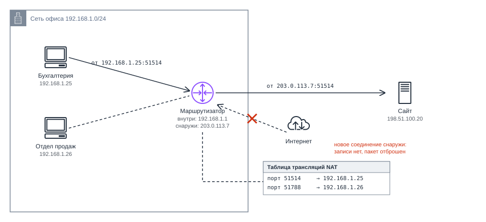

_5.1. NAT: весь офис выходит в интернет через один публичный адрес_

Запомните этот механизм. В AWS он встретится в двух вариантах:

- NAT Gateway прячет много серверов за одним адресом, как офисный маршрутизатор.
- Internet Gateway связывает публичный адрес каждого сервера с его внутренним адресом один к одному.

### CIDR-блоки и маски подсети

Чтобы коротко описывать диапазоны адресов, используют запись CIDR.

**CIDR-блок (CIDR block)** - диапазон IP-адресов, который записывается как адрес сети и длина префикса, то есть количество зафиксированных бит[^2].

Запись выглядит как `адрес/длина_префикса`, например `192.168.1.0/24`. Здесь первые 24 бита зафиксированы, а оставшиеся _32 - 24 = 8_ бит могут меняться. Значит, `192.168.1.0/24` охватывает адреса от `192.168.1.0` до `192.168.1.255`, всего 2⁸ = 256 адресов.

Значит, `192.168.1.0/24` охватывает адреса от `192.168.1.0` до `192.168.1.255`, всего 2⁸ = 256 адресов. Чем больше число после косой черты, тем меньше сеть:

| Запись | Адресов в диапазоне | Пример                        |
| ------ | ------------------- | ----------------------------- |
| `/16`  | 65 536              | Самая большая сеть VPC        |
| `/24`  | 256                 | Типичная подсеть              |
| `/28`  | 16                  | Самая маленькая подсеть в AWS |
| `/32`  | 1                   | Один конкретный адрес         |
| `/0`   | Все адреса IPv4     | "Любой адрес в интернете "    |

Две последние строки вы уже видели в Security Group в 4 главе: источник `ваш-IP/32` означает ровно один компьютер, а `0.0.0.0/0` означает любой адрес.

Ту же границу можно записать маской подсети: `/24` соответствует маске `255.255.255.0`. Операционные системы до сих пор часто показывают маску, но в облаке почти везде используется запись CIDR.

Не все адреса диапазона можно выдать устройствам. Некоторые адреса выполняют специальные функции:

- _Первый адрес диапазона_, например `192.168.1.0`, это адрес самой сети. Он обозначает подсеть целиком, и назначить его устройству нельзя.
- _Последний адрес диапазона_, например `192.168.1.255`, это широковещательный адрес. Сообщение, отправленное на него, получают все устройства подсети сразу.

Поэтому из 256 адресов сети `/24` устройствам можно выдать 254. Обычно один из них, чаще всего первый свободный (`192.168.1.1`), отдают маршрутизатору. В AWS, как мы увидим дальше, зарезервированных адресов ещё больше.

### Шлюз и таблица маршрутов

Мы уже знаем, что пакет для чужой подсети компьютер отдаёт маршрутизатору. Адрес этого маршрутизатора записан в сетевых настройках компьютера.

**Шлюз по умолчанию (default gateway)** - маршрутизатор, которому компьютер отправляет все пакеты для адресов вне своей подсети.

В домашней или офисной сети шлюзом работает роутер. Чаще всего у него адрес `192.168.1.1`, и все устройства сети используют его как "выход наружу".

Вот что происходит внутри маршрутизатора:

1. Маршрутизатор получает пакет от компьютера.
2. Проверяет адрес назначения.
3. По своей таблице маршрутов решает, куда отправить пакет дальше: в другую подсеть офиса или в интернет.

**Таблица маршрутов (route table)** - список правил, в котором для каждого диапазона адресов указано, куда отправлять пакеты.

Возьмём офис с двумя подсетями: в `192.168.1.0/24` живут компьютеры сотрудников, в `192.168.2.0/24` серверы. Таблица маршрутизатора выглядит так:

| Куда адресован пакет | Куда отправлять                |
| -------------------- | ------------------------------ |
| `192.168.1.0/24`     | В подсеть сотрудников          |
| `192.168.2.0/24`     | В подсеть серверов             |
| `0.0.0.0/0`          | Провайдеру, то есть в интернет |

Последнее правило срабатывает для всех адресов, которые не подошли под другие строки.

**Маршрут по умолчанию (default route)** - правило `0.0.0.0/0`, по которому уходят пакеты, для которых в таблице не нашлось более точного маршрута.

Если адрес подходит под несколько правил, маршрутизатор выбирает самое точное, то есть правило с самым длинным префиксом. Адрес `192.168.2.10` подходит и под `192.168.2.0/24`, и под `0.0.0.0/0`, но `/24` точнее, поэтому пакет уйдёт к серверам, а не в интернет.

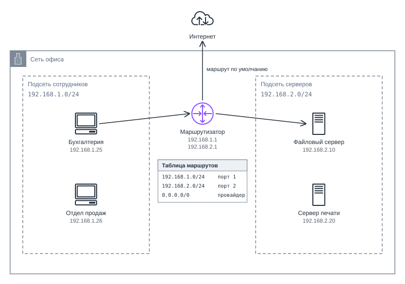

_5.2. Две подсети офиса и маршрутизатор между ними_

Своя маленькая таблица маршрутов есть и у каждого компьютера. В Linux её показывает команда `ip route`:

```text
default via 192.168.1.1 dev eth0
192.168.1.0/24 dev eth0 proto kernel scope link src 192.168.1.25
```

- _Вторая строка_ говорит, что своя подсеть доступна напрямую.

- _Первая говорит_, что всё остальное отправляется на шлюз `192.168.1.1`. На экземпляре EC2 вывод будет почти таким же, только с адресами из VPC.

Идея простая:

- Внутри подсети компьютеры видят друг друга напрямую.
- Для всего остального они обращаются к шлюзу, а шлюз решает, куда отправить пакет, по своей таблице маршрутов.

> [!TIP]
>
> Напоминаю, что шлюзом может быть маршрутизатор в вашей сети, который решает, куда отправить пакеты, предназначенные для других подсетей или интернета. _Простыми словами - шлюз это выход из вашей комнаты в остальной мир_.

## Введение в виртуальные сети в AWS. Amazon VPC

### Виртуальная сеть в облаке

Приложению в облаке сеть нужна так же, как в офисе: веб-сервер должен быть доступен из интернета, а база данных нет. Но в дата-центре AWS на одних и тех же физических серверах работают машины тысяч клиентов, и протянуть каждому свои кабели невозможно. Во второй главе мы разбирали, как эта задача решается: физическая сеть дата-центра одна, а поверх неё программно строятся изолированные виртуальные сети.

> [!NOTE]
> Виртуальную сеть удобно представлять по аналогии с виртуальной машиной. Экземпляр EC2 это компьютер, а VPC это сеть, в которой этот компьютер стоит. Всё, что мы разобрали на примере офиса, в VPC тоже есть, только вместо коробок с проводами это настройки в консоли.

**Amazon VPC (Virtual Private Cloud)** - сервис AWS, который создаёт логически изолированную виртуальную сеть внутри региона. В ней вы сами задаёте диапазон адресов, подсети, таблицы маршрутов, шлюзы и правила фильтрации трафика[^3].

Иными словами, VPC это ваш участок сети внутри AWS, отделённый от чужих участков. Никто за пределами вашей сети не может обратиться к вашим ресурсам по их приватным адресам.

| Характеристика      | Amazon VPC                                                                                                                                                                                                 |
| ------------------- | ---------------------------------------------------------------------------------------------------------------------------------------------------------------------------------------------------------- |
| Категория           | Сети и доставка контента (networking & content delivery)                                                                                                                                                   |
| Что делает          | Создаёт изолированную виртуальную сеть с подсетями, маршрутами, шлюзами и фильтрами трафика                                                                                                                |
| Для чего нужен      | Решать, какие ресурсы видны из интернета, какие только друг другу, и как сеть связана с другими сетями                                                                                                     |
| Где используют      | Везде, где есть экземпляры EC2, базы данных Amazon RDS, балансировщики нагрузки                                                                                                                            |
| Модель обслуживания | IaaS: вы получаете сетевую инфраструктуру и настраиваете её сами                                                                                                                                           |
| Область действия    | Региональный: VPC охватывает все зоны доступности региона, каждая подсеть находится в одной зоне                                                                                                           |
| Как оплачивается    | Сама VPC, подсети и таблицы маршрутов бесплатны. Платят за NAT Gateway, публичные IPv4-адреса, часть VPC endpoints, VPN и передачу данных[^4]                                                              |
| Как работать        | Консоль (раздел VPC), команды `aws ec2 create-vpc`, `aws ec2 create-subnet` и другие, SDK (для JavaScript пакет `@aws-sdk/client-ec2`). Отдельной группы команд для VPC нет, потому что VPC выросла из EC2 |
| Появился            | Август 2009 года, сначала как бета-версия в одном регионе[^5]                                                                                                                                              |
| Аналоги             | Google Cloud VPC, Azure Virtual Network                                                                                                                                                                    |

Главное свойство VPC: она принадлежит одному региону, но охватывает все его зоны доступности. Сеть одна, а подсети внутри неё раскладываются по разным зонам, и все они связаны между собой. Именно так строятся приложения, которые переживают отказ целой зоны. Такая структура показана на рисунке 5.3.

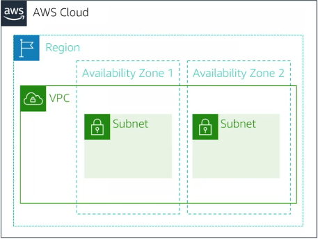

_5.3. Структура VPC с подсетями в разных зонах доступности_

Все понятия из первой части главы в VPC есть, только вместо устройств это настройки. Запомнить их роли помогает аналогия с домом, в котором подсети это комнаты:

| В офисной сети                        | В Amazon VPC                          | Аналогия с домом                                                                   |
| ------------------------------------- | ------------------------------------- | ---------------------------------------------------------------------------------- |
| Сеть офиса                            | VPC                                   | Дом                                                                                |
| Подсеть                               | Подсеть в одной зоне доступности      | Комната                                                                            |
| Маршрутизатор и его таблица маршрутов | Маршрутизатор VPC и таблицы маршрутов | Указатели в коридоре: куда идти, чтобы попасть в нужную комнату                    |
| Роутер, подключённый к провайдеру     | Internet Gateway                      | Входная дверь на улицу                                                             |
| NAT на роутере                        | NAT Gateway                           | Дверь, которая открывается только изнутри                                          |
| Файрвол на компьютере                 | Security Group                        | Охранник у двери конкретного сервера, который помнит, кого выпустил                |
| Фильтр на границе подсети             | Network ACL                           | Пост на входе в комнату, который проверяет по списку каждого, кто входит и выходит |

### Default VPC

Когда в 4 главе мы запускали первый экземпляр, сеть мы не создавали. Её заранее подготовил AWS.

**Default VPC** - VPC, которую AWS заранее создаёт в каждом регионе аккаунта и настраивает так, чтобы запущенные в ней экземпляры сразу были доступны из интернета[^6].

В default VPC есть:

- Диапазон адресов `172.31.0.0/16`.
- По одной подсети размером `/20` (4 096 адресов) в каждой зоне доступности.
- Internet Gateway, то есть выход в интернет, и маршрут `0.0.0.0/0` на него в главной таблице маршрутов.
- Автоматическая выдача публичного IPv4-адреса новым экземплярам во всех подсетях.
- Security Group по умолчанию, которая пропускает входящий трафик только от экземпляров с этой же группой.
- Network ACL по умолчанию, который пропускает весь трафик.

Схема default VPC во Франкфурте показана на рисунке 5.4. Всё это настроил AWS.

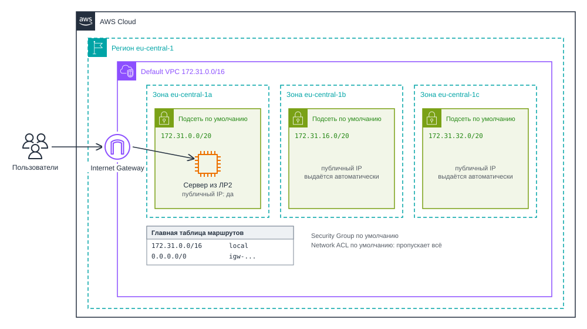

_5.4. Default VPC в регионе eu-central-1_

Для одного учебного сервера default VPC подходит хорошо. Проблемы начинаются вместе со вторым сервером:

- _Все подсети публичные_. Серверу базы данных публичный адрес не нужен, но спрятать его здесь некуда.
- _Единственная защита это Security Group_. Одна ошибка в правиле, как у Эммы с портом 5432, и база открыта.
- _Диапазон одинаков во всех аккаунтах_. Если позже понадобится соединить сеть проекта с сетью другой команды, у которой тоже default VPC, адреса совпадут, и соединить такие сети напрямую не получится.

Поэтому для настоящего проекта создают собственную VPC. В новой VPC нет ни выхода в интернет, ни публичных адресов: их придётся добавить явно, и они появятся только там, где нужны. Default VPC удалять не нужно, она пригодится для быстрых экспериментов.

### Диапазон адресов VPC

Первое решение при создании VPC это её диапазон адресов в записи CIDR. У него есть ограничения[^8]:

- Размер от `/16` (65 536 адресов) до `/28` (16 адресов).
- AWS рекомендует брать адреса из приватных диапазонов: `10.0.0.0/8`, `172.16.0.0/12` или `192.168.0.0/16`.
- Основной диапазон нельзя изменить после создания VPC. К нему можно только добавить дополнительные диапазоны, и то с ограничениями.

Поэтому диапазон выбирают с запасом и так, чтобы он не пересекался с сетями, с которыми VPC когда-нибудь придётся соединять: другими VPC компании, сетью офиса, домашними сетями сотрудников, подключающихся по VPN.

> [!NOTE]
>
> Попробуйте ответить на вопрос: какой адрес сети у VPC `10.0.0.0/16`, какой у неё последний адрес и сколько всего адресов она содержит?

## Подсети

### Подсеть и зона доступности

Диапазон VPC сам по себе ещё ничего не даёт: экземпляр запускается не "в VPC", а в конкретной подсети.

**Подсеть VPC (VPC subnet)** - часть диапазона адресов VPC, которая находится в одной зоне доступности. Каждый экземпляр запускается в одной подсети и получает приватный адрес из её диапазона[^3].

Выбирая подсеть при запуске экземпляра, вы одновременно выбираете зону доступности. Если приложение должно пережить отказ зоны, подсети нужны минимум в двух зонах. Их стоит создать сразу, даже пока сервер один.

Разобьём `10.0.0.0/16` на подсети `/24`. В `/16` свободны третье и четвёртое числа адреса. В подсетях `/24` третье число становится номером подсети: `10.0.0.0/24`, `10.0.1.0/24` и так далее, всего 256 подсетей. Публичным подсетям отдадим номера с нуля, приватным с десяти, чтобы по адресу было видно, где находится сервер.

| Подсеть     | Зона доступности | Диапазон       | Что в ней будет               |
| ----------- | ---------------- | -------------- | ----------------------------- |
| `public-a`  | `eu-central-1a`  | `10.0.0.0/24`  | Веб-сервер                    |
| `public-b`  | `eu-central-1b`  | `10.0.1.0/24`  | Пока пусто, второй веб-сервер |
| `private-a` | `eu-central-1a`  | `10.0.10.0/24` | Сервер базы данных            |
| `private-b` | `eu-central-1b`  | `10.0.11.0/24` | Пока пусто, реплика базы      |

Эти подсети показаны на рисунке 5.5. Остальное адресное пространство оставлено на будущее.

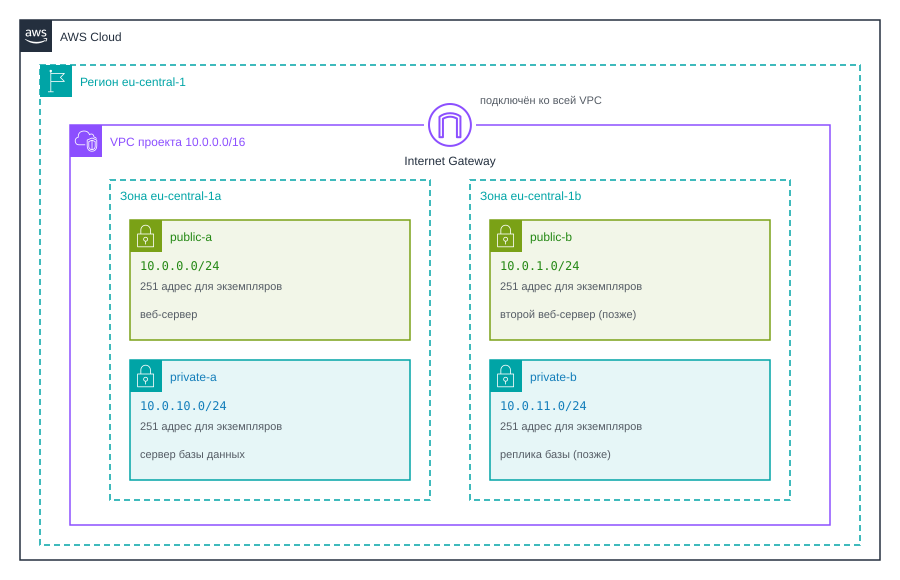

_5.5. VPC проекта: четыре подсети в двух зонах доступности_

### Публичная и приватная подсеть

Флажка "сделать публичной" у подсети нет. Разница задаётся маршрутом.

**Публичная подсеть (public subnet)** - подсеть, таблица маршрутов которой содержит маршрут в Internet Gateway. Экземпляры в ней с публичным адресом доступны из интернета.

**Приватная подсеть (private subnet)** - подсеть, таблица маршрутов которой не содержит маршрута в Internet Gateway. Экземпляры в ней не имеют прямой связи с интернетом.

> [!IMPORTANT]
> Подсеть публичная, если в её таблице маршрутов есть строка `0.0.0.0/0 → Internet Gateway`. Без такой строки подсеть приватная, даже если экземпляры в ней получили публичные адреса: пакетам просто некуда идти.

Отдельная настройка подсети `Auto-assign public IPv4 address` решает только одно: получит ли новый экземпляр публичный адрес. Её включают в публичных подсетях и выключают в приватных.

В публичной подсети размещают то, к чему приходят пользователи:

- веб-сервер,
- балансировщик нагрузки.

В приватной подсети размещают всё остальное:

- базу данных,
- внутренние сервисы.

Веб-сервер и база при этом общаются внутри VPC по приватным адресам.

### Адреса, которые резервирует AWS

В каждой подсети AWS забирает пять адресов для собственных нужд[^9]. Для подсети `10.0.1.0/24` это:

| Адрес        | Для чего зарезервирован                                                                                                                                             |
| ------------ | ------------------------------------------------------------------------------------------------------------------------------------------------------------------- |
| `10.0.1.0`   | Адрес самой сети                                                                                                                                                    |
| `10.0.1.1`   | Маршрутизатор VPC, шлюз по умолчанию для экземпляров подсети                                                                                                        |
| `10.0.1.2`   | Зарезервирован для DNS. Сам DNS-сервер VPC, который превращает имена в адреса, находится по адресу "начало диапазона VPC плюс два", в нашей VPC это `10.0.0.2`[^10] |
| `10.0.1.3`   | Зарезервирован AWS на будущее                                                                                                                                       |
| `10.0.1.255` | Последний адрес. В обычной сети это широковещательный адрес, VPC широковещательную рассылку не поддерживает, но адрес всё равно зарезервирован                      |

В подсети `/24` экземплярам остаётся 256 - 5 = 251 адрес, в самой маленькой подсети `/28` всего 11.

## Таблицы маршрутов

### Определение таблицы маршрутов

В VPC нет маршрутизатора, который можно увидеть или настроить как отдельное устройство. Его роль выполняет сама сеть AWS, а вы управляете только его таблицами.

**Таблица маршрутов VPC (VPC route table)** - набор правил, которые определяют, куда маршрутизатор VPC отправляет пакеты, выходящие из подсети. Каждая подсеть связана ровно с одной таблицей маршрутов, а одна таблица может обслуживать несколько подсетей[^3].

При создании VPC AWS создаёт _главную таблицу маршрутов (main route table)_. Она действует для всех подсетей, которые вы явно не связали с другой таблицей. Кроме неё можно создавать свои таблицы и связывать с ними отдельные подсети.

### Локальный маршрут

В каждой таблице есть строка, которую вы не добавляли:

| Destination   | Target  |
| ------------- | ------- |
| `10.0.0.0/16` | `local` |

**Локальный маршрут (local route)** - маршрут на весь диапазон VPC, который AWS добавляет в каждую таблицу маршрутов автоматически и который нельзя удалить.

Благодаря локальному маршруту все подсети одной VPC связаны между собой: два экземпляра в разных подсетях обмениваются пакетами по приватным адресам без дополнительных настроек. Так таблица выглядит в консоли, рисунок 5.6.

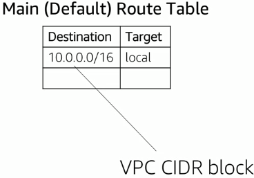

_5.6. Таблица маршрутов с локальным маршрутом в консоли VPC_

### Маршрут по умолчанию

Всё, что не входит в диапазон VPC, уходит по маршруту `0.0.0.0/0`. Его цель и определяет роль подсети. Для проекта понадобятся две таблицы.

_Таблица для публичных подсетей_ содержит маршрут по умолчанию, который отправляет трафик в интернет через Internet Gateway:

| Destination   | Target                       |
| ------------- | ---------------------------- |
| `10.0.0.0/16` | `local`                      |
| `0.0.0.0/0`   | `igw-...` (Internet Gateway) |

_Таблица для приватных подсетей_ содержит только локальный маршрут:

| Destination   | Target  |
| ------------- | ------- |
| `10.0.0.0/16` | `local` |

В приватной таблице маршрута по умолчанию нет, и пакет в интернет из приватной подсети отбрасывается. Обе таблицы показаны на рисунке 5.7.

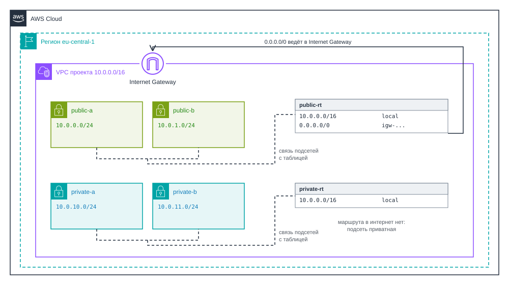

_5.7. Таблицы маршрутов публичной и приватной подсети_

Как и в офисной сети, выигрывает самый длинный префикс. Пакет на `10.0.10.40` подходит и под `10.0.0.0/16`, и под `0.0.0.0/0`, но уйдёт по локальному маршруту. Поэтому трафик между своими подсетями никогда не уходит в интернет.

## Выход в интернет

### Internet Gateway

В офисе выходом в интернет был маршрутизатор, подключённый к провайдеру. В VPC эту роль играет Internet Gateway.

**Internet Gateway** - компонент VPC, который соединяет её с интернетом. Для адресов IPv4 он также сопоставляет приватные адреса экземпляров с их публичными адресами[^3].

Это не виртуальная машина: размер выбирать не нужно, пропускную способность и отказоустойчивость обеспечивает AWS. Отдельно за Internet Gateway не платят.

У экземпляра с публичным адресом на самом деле два адреса: приватный, например `10.0.0.25`, и публичный, например `3.73.77.117`. Сам экземпляр знает только приватный. Когда он отправляет пакет в интернет, Internet Gateway подставляет публичный адрес вместо приватного. Когда приходит ответ или новый запрос на `3.73.77.117`, Internet Gateway заменяет адрес обратно на `10.0.0.25` и передаёт пакет в подсеть. Это тот же NAT, что в офисе, только один к одному: у каждого экземпляра свой публичный адрес, поэтому соединение может начать и пользователь из интернета.

Чтобы экземпляр был доступен из интернета, должны выполниться четыре условия:

1. Internet Gateway создан и подключён к VPC. К VPC можно подключить только один.
2. В таблице маршрутов подсети есть маршрут `0.0.0.0/0` на этот Internet Gateway.
3. У экземпляра есть публичный IPv4-адрес или Elastic IP.
4. Security Group экземпляра разрешает нужный порт.

Если сайт не открывается, проверяют именно эту цепочку. Путь запроса пользователя показан на рисунке 5.8.

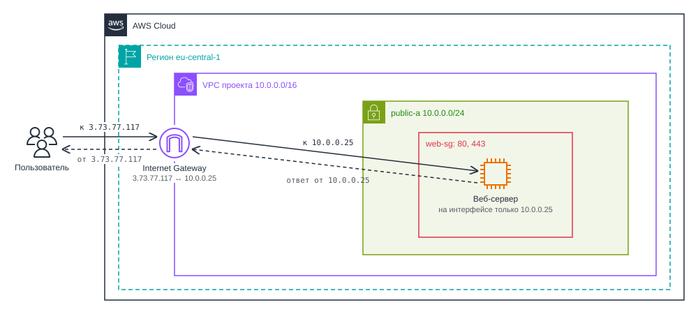

_5.8. Путь запроса пользователя через Internet Gateway_

### NAT Gateway

Серверу в приватной подсети тоже иногда нужен интернет, например за обновлениями. При этом из интернета до него дойти не должно. Это ровно задача офисного NAT.

**NAT Gateway** - управляемый сервис AWS, который позволяет экземплярам в приватных подсетях начинать соединения с интернетом, но не позволяет устройствам из интернета начинать соединения с этими экземплярами[^11].

Работает он так:

1. NAT Gateway создают в публичной подсети и выдают ему Elastic IP. Сам шлюз выходит в интернет через Internet Gateway.
2. В таблицу маршрутов приватных подсетей добавляют маршрут `0.0.0.0/0` на NAT Gateway.
3. Пакет из приватной подсети попадает в NAT Gateway, тот подменяет адрес отправителя на свой и передаёт пакет в Internet Gateway.
4. Ответ приходит на адрес NAT Gateway, и шлюз по таблице трансляций возвращает его экземпляру.

У сервера базы по-прежнему нет публичного адреса, весь его трафик выходит от имени NAT Gateway. Схема показана на рисунке 5.9.

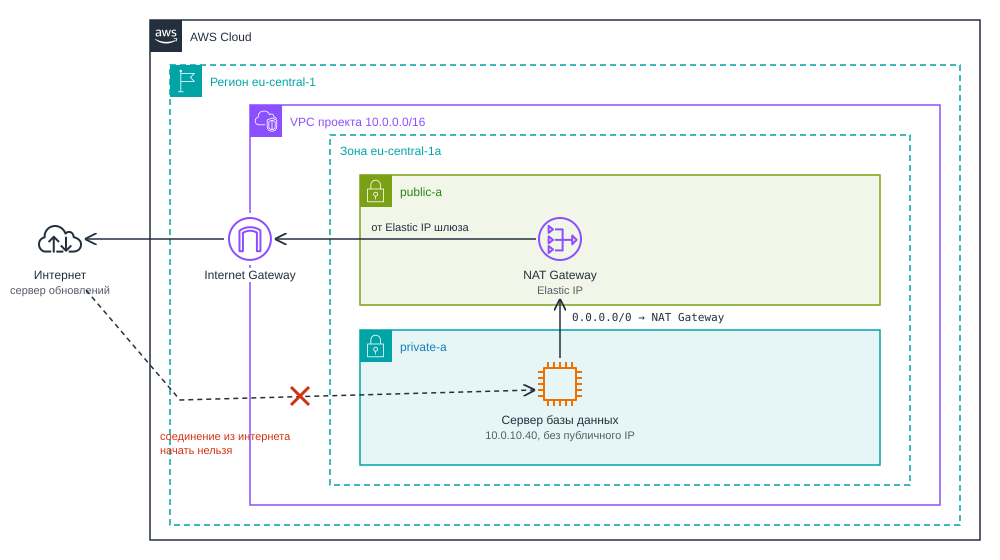

_5.9. Выход приватной подсети в интернет через NAT Gateway_

Обычный NAT Gateway находится в одной зоне доступности, поэтому в отказоустойчивых архитектурах ставят по шлюзу в каждой зоне. Вместо управляемого NAT Gateway можно запустить в публичной подсети обычный экземпляр EC2, настроенный как NAT (NAT instance). Это дешевле, но обновлять, масштабировать и восстанавливать такой экземпляр придётся самому.

### Сравнение и стоимость

| Характеристика                      | Internet Gateway                    | NAT Gateway                                  |
| ----------------------------------- | ----------------------------------- | -------------------------------------------- |
| Для каких подсетей                  | Публичных                           | Приватных                                    |
| Преобразование адресов              | Один к одному                       | Многие к одному                              |
| Кто может начать соединение         | Экземпляр и устройство из интернета | Только экземпляр                             |
| Нужен ли экземпляру публичный адрес | Да                                  | Нет                                          |
| Стоимость                           | Бесплатно                           | Почасовая оплата и оплата за каждый гигабайт |

Компоненты не заменяют, а дополняют друг друга: NAT Gateway сам выходит в интернет через Internet Gateway.

Сама VPC бесплатна, но выход в интернет стоит денег[^4]:

- _Публичные IPv4-адреса_. С февраля 2024 года каждый публичный IPv4-адрес стоит $0,005 в час, в том числе Elastic IP, который ни к чему не привязан[^12]. Это около 3,6 доллара в месяц за адрес.
- _NAT Gateway_. В регионе US East (Ohio) это $0,045 в час и $0,045 за каждый гигабайт, то есть больше 30 долларов в месяц только за включённый шлюз. Цены зависят от региона.
- _Исходящий трафик_. Данные, уходящие из AWS в интернет, оплачиваются отдельно.

В Hands-on 5.1 мы создадим NAT Gateway, чтобы увидеть его в работе, и удалим сразу после проверки. В постоянном учебном проекте без него можно обойтись: пакеты для сервера в приватной подсети можно устанавливать через бесплатный gateway endpoint, о котором речь пойдёт ниже.

> [!WARNING]
> Если вы создали NAT Gateway для эксперимента, удалите его сразу после проверки и освободите его Elastic IP. Забытый NAT Gateway один из самых частых источников неожиданного счёта в учебных аккаунтах.

## Приватный, публичный и Elastic IP

Подведём итог по видам IP-адресов, с которыми вы столкнётесь в VPC:

- _Приватный IP_. Используется внутри VPC для общения между ресурсами.
- _Публичный IP_. Используется для доступа к ресурсу из интернета.
- _Elastic IP_. Публичный IP, который закрепляется за вашим аккаунтом и не меняется при остановке и запуске экземпляра.

| Характеристика                   | Приватный IP          | Публичный IP            | Elastic IP                                |
| -------------------------------- | --------------------- | ----------------------- | ----------------------------------------- |
| Откуда берётся                   | Из диапазона подсети  | Из пула AWS при запуске | Из пула AWS, закрепляется за аккаунтом    |
| Где находится                    | На сетевом интерфейсе | В Internet Gateway      | В Internet Gateway, привязывается вручную |
| Меняется при остановке и запуске | Нет                   | Да                      | Нет                                       |
| Стоимость                        | Бесплатно             | $0,005 в час            | $0,005 в час, даже без привязки           |

Elastic IP нужен постоянным сервисам, например веб-сайту, на адрес которого указывает доменное имя. У экземпляра активен только один публичный адрес: если привязать Elastic IP к экземпляру, у которого уже был автоматически выданный публичный адрес, тот адрес освобождается и заменяется на Elastic IP.

Elastic IP бывают только IPv4. Смысл он имеет только для экземпляра в публичной подсети: без маршрута в Internet Gateway адрес привязать можно, но дойти по нему до экземпляра никто не сможет. По умолчанию в регионе можно держать до пяти Elastic IP. Лимит увеличивают бесплатным запросом, но каждый адрес оплачивается.

## Фильтрация трафика

Маршрут отвечает на вопрос, может ли пакет дойти до адресата, а фильтр решает, пропустить ли его.

В VPC два фильтра:

- Security Group у экземпляра,
- Network ACL на границе подсети.

### Security Group

Security Group мы разбирали в 4 главе. Напомним главное:

- _Группа привязана к сетевому интерфейсу_ и проверяет трафик на входе в экземпляр и на выходе из него.
- _Разрешено только то, что явно разрешено_. Запрещающих правил нет.
- _Группа запоминает соединения (stateful)_. Ответ на разрешённый запрос проходит без отдельного правила.
- _Группа принадлежит одной VPC_. В новой VPC группы нужно создать заново.

Сервер базы должен принимать соединения на порт 5432 только от веб-сервера. Какой источник указать?

- `0.0.0.0/0` - откроет доступ ко всем, что небезопасно.
- Адрес веб-сервера `10.0.0.25/32` придётся менять при замене сервера и дублировать для каждого нового.
- Диапазон VPC `10.0.0.0/16` пустит к базе любой экземпляр VPC.

Источником в правиле может быть и _другая Security Group_. Такое правило разрешает трафик от любого экземпляра, к которому прикреплена указанная группа.

SSH тоже не стоит открывать всему интернету. К веб-серверу администратор подключается со своего компьютера, поэтому в правиле указывают его адрес с маской `/32`. В консоли для этого есть вариант `My IP`. У сервера базы публичного адреса нет, и напрямую из интернета до него не добраться. На него заходят по SSH через веб-сервер.

**Jump host (bastion host)** - экземпляр в публичной подсети, через который администраторы подключаются по SSH к серверам в приватных подсетях.

Поэтому сервер базы разрешает SSH только от группы `web-sg`. В большом проекте jump host обычно делают отдельным небольшим экземпляром, а в нашем примере эту роль выполняет сам веб-сервер.

Группа `web-sg` для веб-сервера:

| Направление | Протокол | Порт | Источник или назначение | Зачем                                  |
| ----------- | -------- | ---- | ----------------------- | -------------------------------------- |
| Входящий    | TCP      | 80   | `0.0.0.0/0`             | HTTP от пользователей                  |
| Входящий    | TCP      | 443  | `0.0.0.0/0`             | HTTPS от пользователей                 |
| Входящий    | TCP      | 22   | `ваш-IP/32`             | SSH только с компьютера администратора |
| Исходящий   | Все      | Все  | `0.0.0.0/0`             | Правило по умолчанию                   |

Группа `db-sg` для сервера базы данных:

| Направление | Протокол | Порт | Источник или назначение | Зачем                                |
| ----------- | -------- | ---- | ----------------------- | ------------------------------------ |
| Входящий    | TCP      | 5432 | `web-sg`                | PostgreSQL только от веб-серверов    |
| Входящий    | TCP      | 22   | `web-sg`                | SSH только с веб-сервера (jump host) |
| Исходящий   | Все      | Все  | `0.0.0.0/0`             | Правило по умолчанию                 |

Теперь правило описывает роль, а не адрес: доступ к базе получит любой сервер с группой `web-sg`, сколько бы их ни было. Пример Security Group в VPC показан на рисунке 5.10.

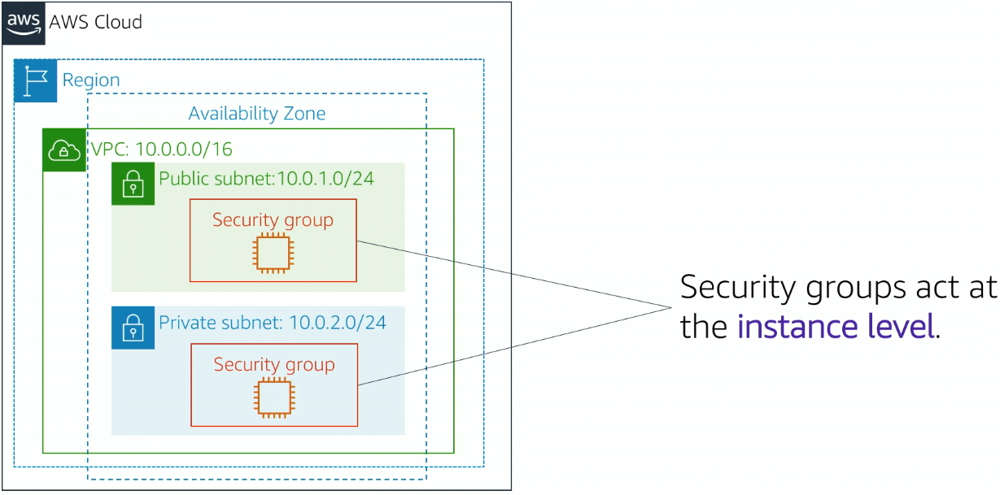

_5.10. Пример Security Group в Amazon VPC_

### Network ACL

**Network ACL (network access control list)** - фильтр трафика на уровне подсети, который проверяет пакеты на входе в подсеть и на выходе из неё по пронумерованному списку разрешающих и запрещающих правил[^13].

Правила Network ACL действуют сразу на все экземпляры подсети. От Security Group он отличается в трёх вещах:

- _Правила проверяются по порядку номеров_, срабатывает первое подходящее. Последнее правило `*` запрещает всё, что не подошло под другие.
- _Есть запрещающие правила_. Можно, например, закрыть подсеть от конкретного диапазона адресов.
- _Список не запоминает соединения (stateless)_. Каждый пакет, в том числе ответный, проверяется сам по себе.

Network ACL по умолчанию пропускает весь трафик, поэтому до сих пор мы его не замечали. Он показан на рисунке 5.11: правило 100 разрешает весь трафик IPv4, а последнее правило `*` запрещает всё остальное, но до него дело не доходит. Новый Network ACL, созданный вручную, содержит только правило `*` и запрещает всё.

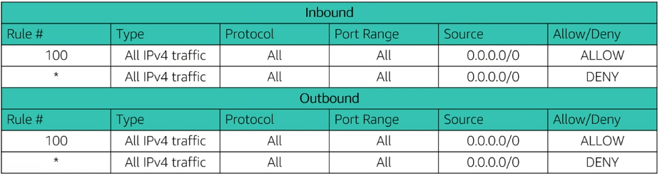

_5.11. Network ACL по умолчанию в консоли VPC_

Главная особенность связана с третьим пунктом. Если Security Group похожа на охранника, который помнит, кого выпустил, то Network ACL похож на пост, который каждый раз проверяет по списку всех, в том числе тех, кто возвращается.

Посмотрим, к чему это приводит. Пусть в Network ACL подсети веб-сервера разрешён только входящий порт 80. Браузер пользователя открывает соединение с веб-сервером на порт 80 со своего временного порта, например 51514. Запрос проходит. Ответ сервера идёт обратно с порта 80 на порт 51514. Security Group помнит соединение и пропускает ответ сама, а Network ACL видит в ответе обычный исходящий пакет на порт 51514. Правила для него нет, и ответ отбрасывается. Сайт не открывается, хотя входящий порт 80 разрешён.

Поэтому ответам нужно своё исходящее правило. Разные ОС выбирают временные порты из разных диапазонов, и AWS в примерах разрешает для ответов весь диапазон 1024-65535. Минимальный Network ACL для веб-сервера выглядит так:

| Направление | Номер | Протокол | Порты      | Источник или назначение | Действие |
| ----------- | ----- | -------- | ---------- | ----------------------- | -------- |
| Входящий    | 100   | TCP      | 80         | `0.0.0.0/0`             | ALLOW    |
| Входящий    | `*`   | Все      | Все        | `0.0.0.0/0`             | DENY     |
| Исходящий   | 100   | TCP      | 1024-65535 | `0.0.0.0/0`             | ALLOW    |
| Исходящий   | `*`   | Все      | Все        | `0.0.0.0/0`             | DENY     |

Входящее правило 100 пропускает запросы пользователей, исходящее правило 100 пропускает ответы им. Если веб-серверу нужно самому ходить в интернет или к базе данных, понадобятся правила и в обратную сторону. Из-за этого точные ограничения по портам обычно делают в Security Group, а Network ACL оставляют для грубых запретов. Расположение обоих фильтров показано на рисунке 5.12.

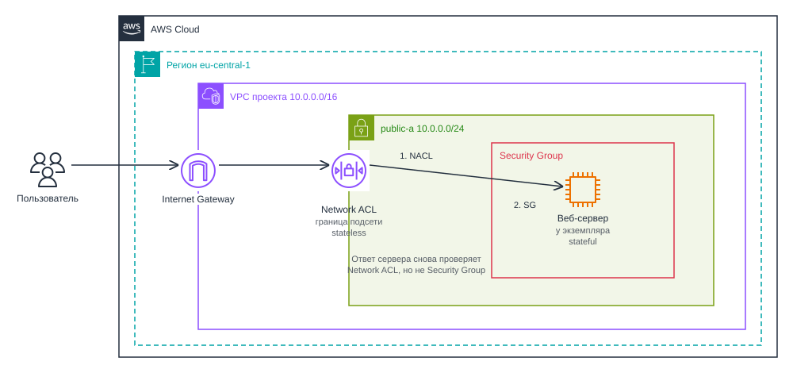

_5.12. Network ACL на границе подсети и Security Group у экземпляра_

> [!TIP]
> Попробуйте составить Network ACL для подсети со следующими требованиями: разрешить входящий HTTP и HTTPS из любого источника, разрешить входящий SSH только с вашего домашнего адреса, запретить весь остальной входящий трафик и разрешить весь исходящий. Подумайте, что сломается, если исходящий трафик тоже ограничить портами 80 и 443.

### Security Group или Network ACL

| Характеристика          | Security Group                              | Network ACL                                                   |
| ----------------------- | ------------------------------------------- | ------------------------------------------------------------- |
| Где действует           | На сетевом интерфейсе экземпляра            | На границе подсети                                            |
| Запоминает соединения   | Да (stateful)                               | Нет (stateless)                                               |
| Какие правила бывают    | Только разрешающие                          | Разрешающие и запрещающие                                     |
| Как проверяются правила | Все сразу                                   | По порядку номеров до первого совпадения                      |
| Источник в правиле      | Диапазон адресов или другая Security Group  | Только диапазон адресов                                       |
| По умолчанию            | Новая группа запрещает весь входящий трафик | Список по умолчанию разрешает всё, новый список запрещает всё |

Входящий пакет сначала проверяет Network ACL подсети, затем Security Group экземпляра. Основная работа делается в Security Group: её правила проще и описывают роли серверов. Network ACL используют как второй, грубый уровень защиты, например чтобы закрыть подсеть от известного вредного диапазона. Во многих проектах его оставляют в состоянии по умолчанию, и это нормальное решение.

> [_Hands-on 5.1. Сеть для приложения._](hands_on_01.md) Собственная VPC с публичными и приватными подсетями в двух зонах доступности, Internet Gateway и две таблицы маршрутов. Elastic IP для веб-сервера и NAT Gateway для приватной подсети. Security Group для веб-сервера и сервера базы: SSH к веб-серверу только с вашего адреса, к серверу базы только через веб-сервер как jump host. Эксперимент с Network ACL и временными портами, удаление всех ресурсов.

## VPC endpoints и соединение сетей

### VPC endpoints

**VPC endpoint** - компонент VPC, через который экземпляры обращаются к сервисам AWS по внутренней сети AWS, без Internet Gateway, NAT Gateway и публичных адресов.

Бывают два вида:

- _Gateway endpoint_. Работает только для двух сервисов: Amazon S3 и Amazon DynamoDB и ничего не стоит[^14]. Он добавляет в таблицу маршрутов подсети маршрут к сервису, и пакеты к S3 идут по этому маршруту, а не в интернет.
- _Interface endpoint_. Работает для большинства сервисов AWS. Он создаёт в подсети сетевой интерфейс с приватным адресом и оплачивается почасово и за трафик.

### VPC peering и Transit Gateway

**VPC peering** - прямое соединение двух VPC, после которого их экземпляры общаются по приватным адресам, минуя интернет. VPC могут находиться в разных аккаунтах и регионах.

Peering тоже работает через таблицы маршрутов: в обе VPC нужно добавить маршрут к диапазону соседней с целью `pcx-...`. Схема показана на рисунке 5.13. Важные ограничения:

- _Диапазоны VPC не должны пересекаться_. Это ещё одна причина выбирать CIDR заранее.
- _Соединение не транзитивно_. Если A соединена с B, а B с C, то A и C друг друга не видят.
- _Чужими шлюзами пользоваться нельзя_. Через peering не получится выйти в интернет через Internet Gateway или NAT Gateway соседней VPC.

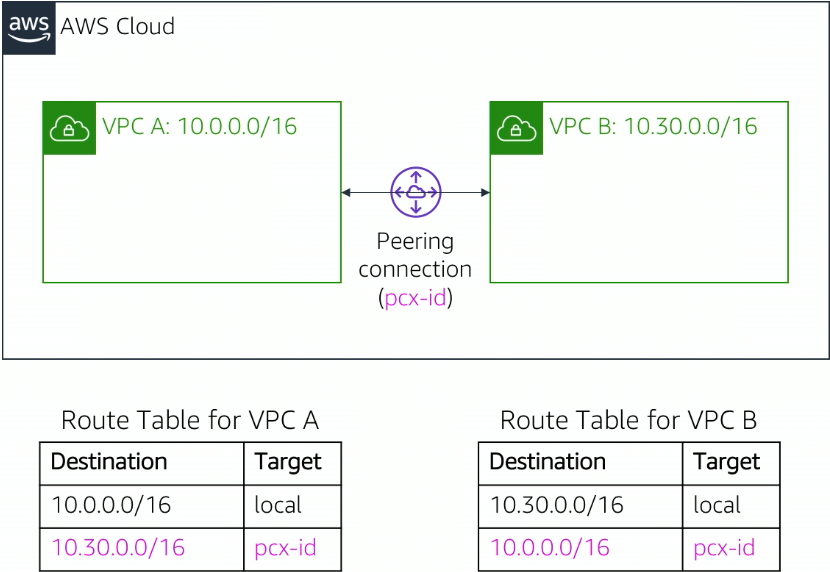

_5.13. VPC peering: прямое соединение двух VPC_

Для 10 VPC, соединённых каждая с каждой, понадобится 45 peering-соединений. В таких случаях используют AWS Transit Gateway.

**AWS Transit Gateway** - центральный маршрутизатор, к которому подключают много VPC и сетей офисов. Вместо сетки соединений получается звезда.

### Site-to-Site VPN и Direct Connect

VPC можно соединить и с собственной сетью компании:

- _AWS Site-to-Site VPN_ строит зашифрованное соединение между VPC и маршрутизатором офиса через интернет. Настраивается быстро, но скорость зависит от интернета.
- _AWS Direct Connect_ это выделенное физическое подключение к сети AWS в одной из её точек присутствия. Даёт стабильную скорость и задержку, но стоит дороже. По умолчанию трафик в нём не шифруется.

## Доменные имена. Amazon Route 53

### Что такое DNS

Пока наш сервер открывается по адресу вида `http://3.73.77.117`. Запоминать такие адреса неудобно, поэтому сайты открывают по именам.

**DNS (Domain Name System)** - система, которая превращает понятные человеку доменные имена в IP-адреса.

Когда вы вводите в браузере `timecapsule.example.com`, компьютер сначала спрашивает у DNS-сервера, какой IP-адрес соответствует этому имени. DNS-сервер отвечает, например, `3.73.77.117`, и только после этого браузер подключается к серверу по адресу. DNS работает как телефонная книга: по имени находится номер.

Посмотреть, какой адрес вернёт DNS, можно командой `nslookup example.com`, она есть и в Windows, и в Linux.

### Amazon Route 53

**Amazon Route 53** - управляемый DNS-сервис AWS. Он позволяет регистрировать доменные имена и указывать, на какие ресурсы AWS или внешние серверы они ведут[^16].

Коротко о сервисе:

| Характеристика      | Amazon Route 53                                                                                       |
| ------------------- | ----------------------------------------------------------------------------------------------------- |
| Категория           | Сети и доставка контента (networking & content delivery)                                              |
| Что делает          | Регистрирует домены, хранит DNS-записи, отвечает на DNS-запросы, проверяет доступность серверов       |
| Для чего нужен      | Чтобы пользователи находили приложение по имени и чтобы при отказе сервера трафик уходил на резервный |
| Где используют      | Домены сайтов и API, внутренние имена сервисов в VPC, переключение между регионами при аварии         |
| Модель обслуживания | Управляемый сервис: DNS-серверами управляет AWS, вы управляете записями                               |
| Область действия    | Глобальный                                                                                            |
| Как оплачивается    | За зону в месяц, за DNS-запросы и за проверки доступности. Домены оплачиваются по годам               |
| Как работать        | Консоль, команды `aws route53 ...`, SDK (для JavaScript пакет `@aws-sdk/client-route-53`)             |
| Появился            | Декабрь 2010 года[^16]                                                                                |
| Аналоги             | Google Cloud DNS, Azure DNS                                                                           |

Число 53 в названии это номер порта, на котором работает DNS.

Для проекта в Route 53 достаточно одной записи: имя `timecapsule.example.com` указывает на Elastic IP веб-сервера. Путь запроса показан на рисунке 5.14. Браузер спрашивает адрес у DNS-сервера провайдера, тот узнаёт его у Route 53, и браузер подключается к веб-серверу по полученному адресу.

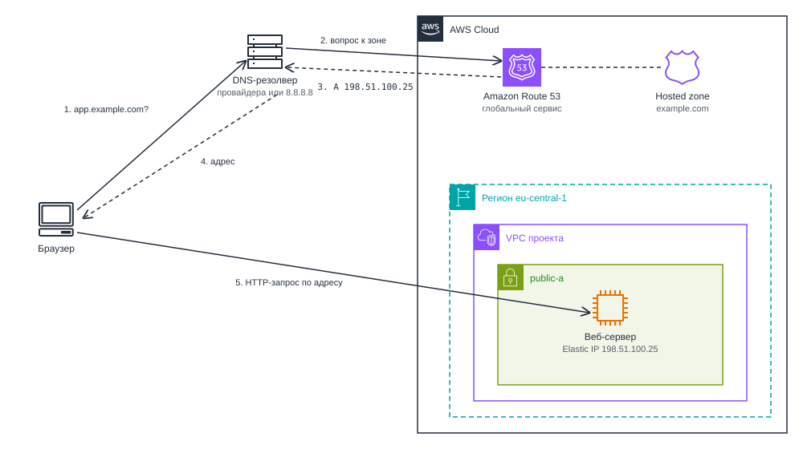

_5.14. Как браузер находит сервер по имени через Route 53_

### Приватная зона

Route 53 обслуживает не только публичные имена.

**Private hosted zone** - зона Route 53, записи которой видны только внутри связанных с ней VPC. Из интернета эти имена не находятся.

В приватной зоне можно дать серверу базы данных имя `db.timecapsule.internal` и указать в настройках приложения имя, а не адрес. Если сервер базы заменят, достаточно будет изменить одну запись, а конфигурацию приложения трогать не придётся.

### Политики маршрутизации

Route 53 умеет отвечать на один и тот же вопрос по-разному, в зависимости от правила, которое называется политикой маршрутизации[^17]:

| Политика          | Как работает                                                                                    | Где применяется                                      |
| ----------------- | ----------------------------------------------------------------------------------------------- | ---------------------------------------------------- |
| Simple            | Одно имя указывает на один ресурс                                                               | Простые сайты и тестовые окружения                   |
| Weighted          | Трафик делится между ресурсами по весам, например 70 и 30 процентов                             | Постепенный выпуск новой версии приложения           |
| Latency           | Пользователь направляется в регион с минимальной задержкой                                      | Приложения с пользователями в разных регионах        |
| Geolocation       | Ответ зависит от местоположения пользователя, например европейцы попадают на европейский сервер | Сайты с региональным контентом                       |
| Geoproximity      | Трафик направляется к ближайшему ресурсу, границы можно сдвигать                                | Распределение нагрузки между регионами               |
| Failover          | Если основной ресурс недоступен, запрос уходит на резервный                                     | Приложения, которым важна отказоустойчивость         |
| Multivalue answer | В ответ возвращается несколько случайно выбранных рабочих адресов                               | Простейшее распределение нагрузки без балансировщика |

Для учебного проекта достаточно simple.

## Резюме

- Пакет несёт адреса отправителя и получателя, порт указывает программу на компьютере.
- Запись CIDR задаёт размер сети: `/24` это 256 адресов, `/16` это 65 536.
- Пакет для чужой подсети уходит на шлюз, а маршрутизатор выбирает самый точный маршрут.
- NAT подменяет адрес на границе сети: изнутри соединения начинать можно, снаружи нельзя.
- VPC это изолированная сеть в одном регионе, её основной диапазон нельзя изменить.
- Подсеть живёт в одной зоне доступности и становится публичной только благодаря маршруту в Internet Gateway.
- Internet Gateway связывает адреса один к одному, NAT Gateway выпускает приватные подсети наружу через свой адрес.
- Security Group удобнее описывать через роли, ссылаясь на другие группы.
- Network ACL не запоминает соединения, поэтому ответному трафику нужны свои правила.
- Route 53 превращает имена в адреса и умеет выбирать ответ по политике маршрутизации, а приватная зона даёт серверам VPC внутренние имена.

## Библиография

[^1]: Fuller, V. and Li, T. (2006). _Classless Inter-domain Routing (CIDR): The Internet Address Assignment and Aggregation Plan_. RFC 4632. Internet Engineering Task Force. Available at: https://doi.org/10.17487/RFC4632

[^2]: Rekhter, Y., Moskowitz, B., Karrenberg, D., de Groot, G.J. and Lear, E. (1996). _Address Allocation for Private Internets_. RFC 1918. Internet Engineering Task Force. Available at: https://doi.org/10.17487/RFC1918

[^3]: Amazon Web Services (2026). _How Amazon VPC works_. Amazon VPC User Guide. Available at: https://docs.aws.amazon.com/vpc/latest/userguide/how-it-works.html

[^4]: Amazon Web Services (2026). _Amazon VPC Pricing_. Available at: https://aws.amazon.com/vpc/pricing/

[^5]: Barr, J. (2009). _Introducing Amazon Virtual Private Cloud (VPC)_. AWS News Blog. Available at: https://aws.amazon.com/blogs/aws/introducing-amazon-virtual-private-cloud-vpc/

[^6]: Amazon Web Services (2026). _Default VPC components_. Amazon VPC User Guide. Available at: https://docs.aws.amazon.com/vpc/latest/userguide/default-vpc-components.html

[^7]: Amazon Web Services (2026). _AWS Architecture Icons_. AWS Architecture Center. Available at: https://aws.amazon.com/architecture/icons/

[^8]: Amazon Web Services (2026). _VPC CIDR blocks_. Amazon VPC User Guide. Available at: https://docs.aws.amazon.com/vpc/latest/userguide/vpc-cidr-blocks.html

[^9]: Amazon Web Services (2026). _Subnet CIDR blocks_. Amazon VPC User Guide. Available at: https://docs.aws.amazon.com/vpc/latest/userguide/subnet-sizing.html

[^10]: Amazon Web Services (2026). _Understanding Amazon DNS_. Amazon VPC User Guide. Available at: https://docs.aws.amazon.com/vpc/latest/userguide/AmazonDNS-concepts.html

[^11]: Amazon Web Services (2026). _NAT gateways_. Amazon VPC User Guide. Available at: https://docs.aws.amazon.com/vpc/latest/userguide/vpc-nat-gateway.html

[^12]: Barr, J. (2023). _New - AWS Public IPv4 Address Charge + Public IP Insights_. AWS News Blog. Available at: https://aws.amazon.com/blogs/aws/new-aws-public-ipv4-address-charge-public-ip-insights/

[^13]: Amazon Web Services (2026). _Control subnet traffic with network access control lists_. Amazon VPC User Guide. Available at: https://docs.aws.amazon.com/vpc/latest/userguide/vpc-network-acls.html

[^14]: Amazon Web Services (2026). _Gateway endpoints_. AWS PrivateLink Guide. Available at: https://docs.aws.amazon.com/vpc/latest/privatelink/gateway-endpoints.html

[^15]: Amazon Web Services (2026). _Update yum on my Amazon Linux EC2 instance without internet access_. AWS re:Post Knowledge Center. Available at: https://repost.aws/knowledge-center/ec2-al1-al2-update-yum-without-internet

[^16]: Barr, J. (2010). _Amazon Route 53 - The AWS Domain Name Service_. AWS News Blog. Available at: https://aws.amazon.com/blogs/aws/amazon-route-53-the-aws-domain-name-service/

[^17]: Amazon Web Services (2026). _Choosing a routing policy_. Amazon Route 53 Developer Guide. Available at: https://docs.aws.amazon.com/Route53/latest/DeveloperGuide/routing-policy.html
