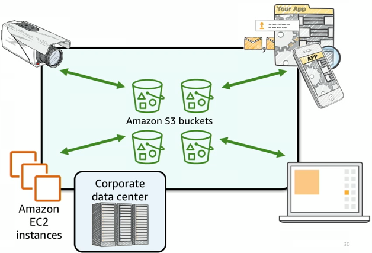

# Хранилища в облаке

## Вступление

В эпоху быстрых темпов роста данных и облачных вычислений, надежное и масштабируемое хранение информации стало ключевым фактором успеха IT-систем.

- Как эволюционировали системы хранения данных и с какими ограничениями сталкивались традиционные подходы?
- Что такое облачное хранилище и как виртуализация позволяет эффективно управлять данными?
- Какие виды хранилищ предлагает AWS и чем отличаются объектное, блочное и файловое хранилища?
- Как выбрать подходящий сервис – Amazon S3, EBS или EFS – для конкретных задач и типов данных?

В этой главе мы ответим на эти вопросы.

Мы рассмотрим теоретическую базу хранения данных, от традиционных моделей до облачной виртуализации, проследим развитие сервисов хранения в AWS и подробно познакомимся с тремя основными сервисами: Amazon S3 (объектное хранилище), Amazon EBS (блочное хранилище) и Amazon EFS (файловое хранилище). Особое внимание уделяется Amazon S3 как фундаментальному облачному хранилищу в AWS. По итогам изучения главы вы сможете уверенно ориентироваться в видах облачных хранилищ и понимать, какой сервис наиболее уместен для тех или иных практических сценариев.

## Эволюция хранения данных и вызовы традиционных моделей

Исторически первые системы хранения данных представляли собой локальные диски и ленты, установленные напрямую на серверах (так называемое _DAS — Direct-Attached Storage_). По мере роста объемов информации организации переходили к сетевым хранилищам — например, файловым серверам (NAS) или сетям хранения (SAN), которые позволяли централизованно управлять данными и обеспечивать доступ с разных устройств к хранилищам по сети. Однако традиционные модели хранения сталкивались с рядом проблем.

_Масштабирование_ означало дорогостоящую покупку дополнительного оборудования и сложное перенастроение инфраструктуры. Типичная проблема заключалась в том, что масштабировать такие системы _вертикально_ (увеличивая емкость или мощность существующих устройств) дорого и имеет пределы, а _горизонтальное_ масштабирование (добавление новых серверов или массивов) сопряжено с высокой сложностью управления данными и риском потери производительности. Кроме того, традиционные системы часто требовали дорогостоящего специализированного оборудования и были склонны к неэффективному использованию ресурсов — _значительные объемы дискового пространства могли простаивать невостребованными_, пока другие серверы испытывали дефицит.

Другой вызов – _отказоустойчивость и надежность_. В локальных хранилищах выход из строя оборудования (диска, контроллера) мог привести к потере данных, поэтому компаниям приходилось внедрять резервирование (_RAID_ - это когда несколько дисков работают вместе, чтобы обеспечить избыточность данных или _резервные серверы_) и регулярное резервное копирование (backup) для защиты от сбоев. Это увеличивало сложность и стоимость владения. Традиционные хранилища хорошо работают при относительно стабильных и предсказуемых нагрузках, но с большими объемами неструктурированных данных (например, архивы изображений, видео) они начинают сталкиваться с проблемами масштабируемости и производительности.

Таким образом, к середине 2000-х IT-индустрия нуждалась в новом подходе к хранению данных, который бы решал проблемы ограниченной масштабируемости, высокой стоимости, сложности резервирования и территориальной непривязанности. Эти предпосылки подготовили почву для появления облачных хранилищ.

## Облачное хранилище и виртуализация

_Облачное хранилище_ представляет собой модель хранения, при которой данные сохраняются на сторонних распределенных инфраструктурах и предоставляются пользователю как услуга по сети (обычно через интернет). Пользователь _работает с хранилищем как с бесконечно расширяемым ресурсом_, не заботясь о физических носителях, месте их размещения и обслуживании. Ключевую роль в этом играет _виртуализация хранения_ - процесс абстрагирования физических ресурсов хранения и предоставления их в виде логических единиц, которые можно легко масштабировать, управлять и использовать по требованию [^2]. Иными словами, провайдер облака берет на себя роль администратора множества дисков и серверов, объединяя их в единое пул ресурсов, а клиенту предоставляет виртуальные единицы хранения нужного типа и размера.

Виртуализация принесла ряд преимуществ:

- _Гибкость и масштабируемость_. Можно за секунды запросить больше места или увеличить производительность без покупки нового оборудования;
- _Высокая доступность и надежность_. Облачный провайдер распределяет данные по разным устройствам, а зачастую и разным дата-центрам, обеспечивая автоматическое резервирование и тем самым повышая сохранность данных;
- _Оплата по потреблению_. Отсутствует необходимость в крупных капитальных затратах на хранилище, вместо этого платишь за реально используемый объем и операции.

Облачное хранилище также обеспечивает глобальную доступность данных: пользователи могут получать к ним доступ из любой точки мира через интернет, а провайдер может автоматически доставлять контент ближе к пользователю (например, с помощью CDN).

## Уровни виртуализации хранилищ

Существует три основных подхода к организации хранения данных, которые соответствуют разным уровням абстракции: _блочное_, _файловое_ и _объектное_ хранилище.

> Данные хранилища были рассмотрены в _Главе 2. Архитектура облачных систем и основы виртуализации_

Кратко напомним их особенности:

- _Блочное хранилище_ (Block Storage). Данные разбиваются на фиксированные блоки, которые могут быть независимо адресованы и управляемы. _Блок_ – это условно кусочек (несколько килобайт или мегабайт) непрерывных данных на диске. Сервер обращается к блочному устройству (диску) по номерам блоков. Примером блочного хранилища служит жесткий диск или SSD: операционная система видит “диск” и может форматировать его в файловую систему. Блочное хранилище удобно для случаев, когда нужны низкие задержки и произвольный доступ – базы данных, файловые системы и т.д
- _Файловое хранилище_ (File Storage). Этот уровень знаком всем пользователям – данные организованы в виде файлов, сгруппированных по папкам (каталогам). _Файловое хранилище_ предполагает, что у нас есть общая файловая система, к которой могут подключаться несколько клиентов по сети.
- _Объектное хранилище_ (Object Storage). Данные сохраняются в виде объектов, каждый из которых содержит сам файл, метаданные и уникальный идентификатор. Объектное хранилище оптимизировано для хранения больших объемов неструктурированных данных (например, фото, видео, резервные копии) и обеспечивает высокую масштабируемость и доступность. В отличие от блочного и файлового хранилищ, объектное хранилище не использует иерархическую структуру папок, что упрощает управление большими объемами данных.

## Хранилища в AWS. История и обзор

Amazon Web Services запустилась в середине 2000-х как облачная платформа, и одним из первых сервисов, ставших ее фундаментом, было хранилище данных. _Amazon S3_ (Simple Storage Service) дебютировал в марте 2006 года, став первым облачным сервисом AWS, доступным широкой публике. По словам основателей, S3 решал на тот момент главную проблему хранения – безопасное и масштабируемое сохранение данных с полной ответственностью провайдера за надежность [^4].

Несколько месяцев спустя, в августе 2006, AWS запустила сервис облачных вычислений EC2, но ему не хватало постоянного дискового хранилища – виртуальные машины EC2 изначально имели только временные локальные диски, которые теряли данные при остановке экземпляра. Поэтому через два года, в августе 2008, был представлен Amazon EBS (Elastic Block Store) – сеть-хранилище блоков, позволяющее подключать постоянные диски к экземплярам EC2. EBS обеспечивал высокую производительность и низкие задержки, что делало его идеальным для баз данных и файловых систем.

Долгое время AWS предлагал только объектное хранилище (S3) и блочные тома (EBS), а для организации совместного доступа к файловым системам пользователи вынуждены были разворачивать свои собственные решения на базе EC2. Это изменилось в 2015 году с запуском Amazon EFS (Elastic File System) – полностью управляемого сервиса файлового хранилища, который позволяет нескольким экземплярам EC2 одновременно монтировать одну и ту же файловую систему.

Сегодня AWS предлагает широкий спектр сервисов хранения, охватывающих все три уровня виртуализации: объектное (S3), блочное (EBS) и файловое (EFS) хранилища, а также специализированные решения для архивирования (S3 Glacier) и гибридного хранения (AWS Storage Gateway). Эти сервисы стали краеугольным камнем инфраструктуры многих компаний, позволяя им эффективно управлять данными в облаке.

## Основные категории хранилищ в AWS

_Основные категории хранилищ в AWS_ соответствуют упомянутым уровням организации данных:

- _Amazon Elastic Block Store (EBS)_. Сервис блочного хранения. Предоставляет сетевые виртуальные диски для Amazon EC2 (виртуальных машин). С EBS вы создаете том (volume) заданного размера и типа и подключаете его к своему экземпляру EC2, как обычный диск.
- _Amazon Elastic File System (EFS)_. Распределенная файловая система. Это полностью управляемый сервис, предоставляющий файловое хранилище, к которому могут одновременно подключаться несколько серверов (EC2 или даже локальные серверы через VPN).
- _Amazon Simple Storage Service (S3)_. Масштабируемое объектное хранилище. Позволяет сохранять данные в виде объектов в бакетах через веб-интерфейс или API. Поддерживает практически неограниченный объем данных и предлагает различные классы хранения для оптимизации затрат.

Следует отметить, что AWS также предлагает дополнительные решения для хранения и переноса данных: сервис AWS Storage Gateway для интеграции локальных систем с облаком, Amazon FSx для специализированных файловых систем (например, Windows File Server или Lustre).

## Amazon S3

_Amazon S3 (Simple Storage Service)_ – это облачный сервис объектного хранилища, предназначенный для хранения и получения любых объемов данных через веб-интерфейс. S3 не является прикладным приложением (SaaS) или платформой (PaaS), а относится к категории инфраструктуры как услуги (IaaS), предоставляя базовые ресурсы хранения, которые пользователи могут использовать для своих приложений.

> В отличии от того же Google Drive или Dropbox, которые являются SaaS решениями, предоставляющими готовые приложения для хранения и обмена файлами, Amazon S3 предоставляет инфраструктуру для хранения данных, которую разработчики могут интегрировать в свои собственные приложения и сервисы. Грубо говоря, на базе S3 можно построить свое собственное Dropbox или Google Drive.

### Архитектура и общие понятия

В хранилище S3 данные хранятся в контейнерах, которые называются _бакетами_ (англ. _bucket_).

_Бакет_ - это логический контейнер для хранения объектов (файлов). Каждый бакет имеет уникальное имя по всему миру (глобальное пространство имен). Нельзя создать бакет с именем, которое уже занято другим пользователем AWS, даже в другом регионе.

Название бакета должно удовлетворять определенным правилам (_naming conventions_):

1. только маленькие буквы, цифры, дефисы и точки
2. не должно быть IP-адресом (например, 192.168.5.1)
3. длина от 3 до 63 символов
4. начинаться и заканчиваться буквой или цифрой
5. не содержать подчеркиваний, точек подряд или дефисов в начале/конце

> _Хорошие названия_: `my-company-data`, `photos-2024`, `backup-archive`;
>
> _Плохие названия_: `MyCompanyData` (заглавные буквы), `photos..2024` (точки подряд), `-backup-archive-` (дефисы в начале/конце).

_Объект_ в S3 - это единица хранения, которая содержит:

- _непосредственно данные_ (например, файл)
- _метаданные_ (дополнительную информацию: содержимое, тип файла, дату загрузки и т.д.),

Каждый объект идентифицируется уникальным ключом (имя файла) внутри бакета. Например, если у вас есть бакет `my-usm-photos` и вы загружаете файл `vacation.jpg`, полный путь к объекту будет `my-usm-photos/vacation.jpg` [^5].

Бакет можно представить как аналог корневой директории: в него можно помещать сколько угодно объектов, и у объектов могут быть ключи с “псевдо-папками” (например, `2025-usm/January/photo1.jpg`, `2025-usm` - бакет, `January` - псевдо-папка внутри бакета, `photo1.jpg` - объект), но на самом деле _в S3 нет настоящих папок_ – это просто часть ключа объекта, создающая иерархию для удобства навигации.

### Использование и сценарии хранения

Перед началом использования S3 важно понимать, какие данные и для каких целей можно хранить в этом сервисе. S3 идеально подходит для хранения:

- _Статического контента сайтов и приложений_. Например, HTML, CSS, JavaScript, изображения, видео. S3 часто выступает в роли хранилища для статических веб-сайтов.
- _Резервных копий и архивов_. Благодаря высокой надежности и доступности, S3 часто используется для хранения бэкапов серверов, баз данных и других критичных данных.
- _Больших данных и data lakes_. S3 может хранить огромные объемы неструктурированных данных, которые затем анализируются с помощью других сервисов AWS.
- _Пользовательского контента_. Например, фотографии, аватарки и видео, загружаемые пользователями приложений. S3 масштабируется автоматически, поэтому подходит для сервисов с миллионами пользователей.

<center>



_Рисунок 1. Примеры использования S3_

</center>

Перед выбором S3 важно учитывать простое правило: если ваши данные _не требуют низких задержек доступа_ (как в случае с базами данных) и _не нуждаются в частых изменениях_ (S3 оптимизирован для операций чтения и записи, но не для частых обновлений), то S3 может быть отличным выбором.

### Региональность и доступ

Сам _S3 является глобальным сервисом_. Но, каждый _бакет привязан к региону AWS_, т.е. физически данные хранятся в дата-центрах определенного региона (например, EU (Frankfurt) или us-east-1 (N. Virginia)).

_S3 обеспечивает чрезвычайно высокую надежность_ за счет хранения данных сразу в нескольких зонах доступности внутри региона: для стандартных классов хранения (_см. ниже_) объект автоматически дублируется не менее чем на трех зонах доступности (AZ). Это реализует дизайн с так называемой _11 9s durability_ (11 девяток надежности), тот есть сервис спроектирован на долговечность данных _99.999999999%_ в год. Проще говоря, _вероятность потерять объект в S3 крайне мала_ – система постоянно проверяет целостность данных и при сбое оборудования восстанавливает копии с уцелевших носителей [^6].

_Доступность_ (_шанс в любой момент времени получить доступ к объекту_) для стандартного хранилища S3 гарантируется на уровне 99.99%, что означает, что в среднем _сервис может быть недоступен не более 52 минут в год_.

> За высокую надежность и доступность S3 расплачивается тем, что задержки доступа могут быть выше, чем к локальному диску, однако для большинства сценариев (особенно чтения больших файлов, раздачи контента пользователям) это не критично.

### Неограниченная емкость

S3 предоставляет практически неограниченное пространство. Вы можете _загружать объекты размером до 5 ТБ_ каждый, а количество объектов не лимитировано. Общий объем ограничен лишь бюджетом. Такая масштабируемость реализована за счет того, что AWS распределяет объекты по множеству узлов хранения.

### Доступ к объекту S3

Каждый объект S3 доступен по уникальному URL. Формат URL зависит от стиля обращения к бакету. Есть два основных способа:

- _Virtual-hosted–style URL_. Рекомендуемый формат, когда имя бакета включается в доменное имя хоста.
  - Например, объект с ключом _photo.png_ в бакете _mybucket_ (регион us-west-2) будет доступен по адресу:
    ```
    https://mybucket.s3.us-west-2.amazonaws.com/photo.png
    ```
- _Path-style URL_. Устаревающий формат, когда имя бакета идет как первый сегмент пути URL после стандартного хоста региона.
  - Например, тот же объект будет доступен по адресу:
    ```
    https://s3.us-west-2.amazonaws.com/mybucket/photo.png
    ```

В настоящее время path-style URL объявлен к постепенному прекращению поддержки (для новых бакетов), и AWS рекомендует использовать virtual-hosted стиль [^7].

### Версионирование объектов

S3 поддерживает версионирование на уровне бакета. Если включить версионирование, каждый раз при перезаписи или удалении объекта старые версии не удаляются насовсем, а сохраняются с отдельными version ID. Это означает, что можно восстановить предыдущую версию файла, если текущая была случайно перезаписана или удалена

### Шифрование данных

В S3 реализованы многоуровневые возможности шифрования. Во-первых, все соединения к S3 осуществляются по HTTPS, поэтому данные в транзите шифруются. Во-вторых, S3 может автоматически шифровать объекты при сохранении (шифрование на стороне сервера) с помощью различных алгоритмов (например, AES-256).

### Классы хранения в S3

Одно из мощных возможностей S3 – поддержка разных _классов хранения для объектов_. В зависимости от характера ваших данных вы можете выбрать один из классов для каждого объекта (или настроить правила, автоматически перемещающие объекты между классами).

Ниже приведена таблица с основными классами S3 и их предназначением:

| _Класс хранения S3_                  | _Назначение и особенности_                                                                                                                                                                                                                                                                                                                                                                                                                                                                                                        | _Примеры использования_                                                                                                                                                                                                                                                                                                                                 |
| ------------------------------------ | --------------------------------------------------------------------------------------------------------------------------------------------------------------------------------------------------------------------------------------------------------------------------------------------------------------------------------------------------------------------------------------------------------------------------------------------------------------------------------------------------------------------------------- | ------------------------------------------------------------------------------------------------------------------------------------------------------------------------------------------------------------------------------------------------------------------------------------------------------------------------------------------------------- |
| _S3 Standard_ (стандартный)          | _Класс по умолчанию_. Предназначен для часто запрашиваемых (часто используемых) данных. Обеспечивает наивысшую производительность, репликацию минимум в трех AZ и доступность 99.99%. Подходит для активных данных приложений, веб-сайтов, мобильных приложений – всего, к чему нужен быстрый доступ без задержек. Стоимость хранения в этом классе самая высокая, зато нет дополнительных задержек на доступ. Пример: пользовательские фотографии в активном приложении, актуальные документы.                                   | Активно используемые данные: контент веб-сайтов, мобильных приложений, часто запрашиваемые документы, актуальные базы данных (например, экспорты), промежуточные результаты вычислений.                                                                                                                                                                 |
| _S3 Standard-IA_ (Infrequent Access) | Для данных, к которым обращаются редко, но при обращении требуется мгновенный доступ. Хранится в ≥3 зонах доступности с той же надежностью, что и Standard. Стоимость хранения ниже примерно в 2 раза, но взимается плата за чтение данных (за каждый GB или 1000 запросов) и требуется минимальный период хранения 30 дней и минимальный размер объекта (например, объект <128KB все равно оплачивается как 128KB).                                                                                                              | Резервные копии, журналы за прошлые периоды, старые изображения или документы, которые редко открывают, но нужно иметь возможность быстро получить.                                                                                                                                                                                                     |
| _S3 One Zone-IA_                     | Похож на _Standard-IA_, но хранит данные только в одной AZ (зоне). Это дает еще меньшую цену хранения, но снижает устойчивость к катастрофам: если выйдет из строя весь дата-центр, данные могут пропасть. Долговечность внутри зоны все еще высокая (AWS заявляет 11 9s, но уже в пределах AZ, а не региона). Этот класс подходит для вторичных копий данных или данных, потеря которых не критична либо у вас есть резерв в другом месте.                                                                                       | Архивы, легко восстанавливаемые из других источников; сгенерированные преобразуемые данные, которые можно воссоздать; резервные копии, имеющие другие копии в разных регионах. В целом, использовать One Zone-IA имеет смысл только если вы можете допустить потерю данных в случае катастрофы в дата-центре или у вас есть дублирующее резервирование. |
| _S3 Intelligent-Tiering_             | Умный класс, который автоматически оптимизирует стоимость хранения в зависимости от активности доступа. AWS будет мониторить, как часто вы обращаетесь к объектам, и перемещать их между двумя уровнями: _Frequent Access_ и _Infrequent Access_ внутри этого класса. Если данные не запрашиваются 30 дней, объект переводится на более дешевое хранение для infrequent access; если потом снова начнут часто читать – вернется на Frequent. Преимущество – вам не нужно вручную управлять классами для непредсказуемых нагрузок. |
| _S3 Glacier_                         | Класс _архивного хранения_. Данные хранятся с минимальной стоимостью, но не предназначены для оперативного доступа. Когда вы помещаете объект в класс Glacier, прямой возможности сразу скачать его нет – сначала нужно инициировать восстановление (restore), которое занимает время.                                                                                                                                                                                                                                            | Электронные архивы документов, резервные копии, требующие оперативного доступа в случае инцидента (например, актуальные бэкапы системы, которые почти никогда не запрашиваются, но если понадобятся – нужно быстро восстановить); медицинские или юридические архивы, которые запрашиваются по особым случаям.                                          |
| _S3 Glacier Deep Archive_            | Самый дешевый архивный класс, рассчитанный на крайне редко запрашиваемые данные. Стоимость хранения в 2–3 раза ниже Glacier, но восстановление занимает часы (по стандарту 12+ часов) и ограниченные опции                                                                                                                                                                                                                                                                                                                        | Долговременное архивирование и законодательное хранение данных, которые, возможно, никогда не будут запрошены: финансовая отчетность более 7 летней давности, архивы научных данных, резервные копии системы перед выводом из эксплуатации, которые сохраняются «на всякий случай».                                                                     |

Все классы, кроме One Zone-IA, хранят копии данных как минимум в трех независимых AZ в пределах одного региона, поэтому гарантируют сохранность даже при выходе из строя целого дата-центра.

### Жизненный цикл объектов и переход между классами

Чтобы эффективно использовать описанные классы и экономить на хранении, в S3 можно настраивать политику жизненного цикла _(Lifecycle policy)_. Эта политика автоматически выполняет определенные действия с объектами по времени: например, спустя N дней после загрузки перевести объект из Standard в Standard-IA, а спустя еще M дней – удалить или отправить в Glacier. Вы сами задаете правила на бакет или префикс (папку) [^5]. Например, можно настроить так:

- Через 30 дней после создания перевести объект в Standard-IA
- Через 365 дней перевести в Glacier
- Через 5 лет удалить объект

### Операции с объектами

S3 поддерживает широкий набор операций с объектами, которые можно выполнять через консоль, CLI или API.

Основные операции, которые чаще всего используются:

- _PUT Object_. Загрузка нового объекта в бакет.
- _GET Object_. Скачивание объекта из бакета.
- _DELETE Object_. Удаление объекта из бакета.
- _LIST Objects_. Получение списка объектов в бакете или в определенной “папке” (префиксе).
- _COPY Object_. Копирование объекта внутри одного бакета или между бакетами.

### Приватные и публичные бакеты

По умолчанию, все бакеты и объекты в S3 приватны – доступ к ним есть только у владельца аккаунта AWS. Чтобы предоставить доступ другим пользователям или сделать данные общедоступными, нужно настроить политики доступа (IAM policies) и/или политики бакета (Bucket policies).

_Приватные бакеты_ используются для:

- Хранения конфиденциальных данных (резервные копии, личные файлы).
- Хранения данных приложений, доступных только через авторизацию (например, пользовательские файлы в веб-приложении).
- Хранения данных, доступ к которым должен быть ограничен по ряду причин (например, внутренние документы компании).

_Публичные бакеты_ могут использоваться для:

- Размещения статического контента веб-сайтов (изображения, видео, файлы).
- Публикации общедоступных данных (например, открытые наборы данных для анализа).
- Хранения контентов пользователей, которые должны быть доступны всем (например, фотографии в социальной сети).
- Хранения и распространения статических ресурсов для мобильных и веб-приложений (изображения, видео, документы).

### Способы доступа к S3

Управлять S3 можно несколькими способами, как и другими сервисами AWS:

- _AWS Management Console_. Веб-интерфейс предоставляет графический доступ – можно создавать бакеты, загружать/скачивать файлы, настраивать политики. Для обучения и малых операций это наглядно.

- _AWS CLI_. Командная строка позволяет управлять S3 через текстовые команды. Это удобно для автоматизации и скриптов.

  - _Загрузка файла в S3_:
    ```bash
    aws s3 cp localfile.txt s3://mybucket/localfile.txt
    ```
  - _Скачивание файла из S3_:
    ```bash
    aws s3 cp s3://mybucket/localfile.txt localfile.txt
    ```
  - _Список объектов в бакете_:

    ```bash
    aws s3 ls s3://mybucket/
    ```

  - _Удаление объекта из S3_:

    ```bash
    aws s3 rm s3://mybucket/localfile.txt
    ```

- _AWS SDK_. Наборы инструментов для различных языков программирования (например, Python, Java, JavaScript) позволяют интегрировать S3 в приложения. В конце лекции будет показан пример на Node.js.

### Оплата и стоимость S3

Модель оплаты сервиса S3 - pay-as-you-go, то есть вы платите только за реально использованные ресурсы. Основные компоненты стоимости:

- _Объем хранения_. Начисляется за гигабайты в месяц (GB-month), по тарифу зависящему от класса хранения и региона. Например, S3 Standard в регионе США стоит порядка $0.023 за GB/месяц.
- _Количество и тип операций_. Начисляется небольшая плата за тысячи запросов (например, $0.005 за 1000 операций LIST или $0.0004 за 1000 PUT в зависимости от класса). GET-запросы для стандартного класса могут быть даже бесплатными до определенного объема или очень дешевыми.
- _Исходящий трафик (Data Transfer Out)_. Данные, считанные из S3 в интернет или в другой регион, тарифицируются за GB. Входящий трафик (закачка в S3) – бесплатный.

## Amazon EBS

### Обзор и назначение

_Amazon Elastic Block Store (EBS)_ – это сервис AWS для предоставления постоянного блочного хранилища в облаке. Проще говоря, EBS позволяет создать виртуальный диск (том) и подключить его к виртуальной машине EC2.

В отличие от временных дисков, которые доступны только на время работы экземпляра, EBS-том сохраняет данные независимо от жизненного цикла виртуальной машины (он persistent, то есть данные сохраняются даже после остановки или перезагрузки экземпляра EC2).

### Основные характеристики EBS

К _основным характеристикам_ EBS относятся:

- _Привязка к зоне доступности_. Каждый том EBS создается внутри конкретной AZ и должен быть подключен к EC2 в той же зоне. EBS автоматически реплицирует данные тома внутри этой зоны на несколько устройств, обеспечивая защиту от выхода из строя отдельного оборудования.
- _Постоянство данных_. Том EBS продолжает существовать независимо от жизненного цикла EC2. EBS можно отсоединить от одного сервера и подключить к другому. Операции EC2 Stop/Start никак не влияют на содержимое EBS: это позволяет, например, останавливать VM на ночь, чтобы не платить за часы работы, а утром запускать – все данные на EBS-системном диске сохраняются.
- _Производительность_. EBS предлагает несколько типов томов с разной производительностью и ценой. Основные:
  - _General Purpose SSD (gp2/gp3)_. Подходят для большинства нагрузок, обеспечивая сбалансированную производительность. Это стандартный выбор по умолчанию для ОС и приложений.
  - _Provisioned IOPS SSD (io1/io2)_. Для критичных нагрузок, требующих высокой и предсказуемой IOPS (IOPS - операций ввода-вывода в секунду). Используются для больших СУБД, высоконагруженных транзакционных систем. Дороже, но дают низкие задержки и стабильность.
  - _HDD томы_ (st1 – Throughput optimized, sc1 – Cold HDD). Предназначены для больших объемов данных с последовательным доступом, например, для логов, архивов. Они дешевле SSD, но имеют более высокие задержки и меньшую производительность на случайный доступ. Чаще используются для больших файлов, к которым редко обращаются.

### Snapshots (снимки)

_Снимок (snapshot) EBS_ — это точная _point-in-time_ копия тома EBS, которая сохраняется в Amazon S3; при этом она хранится не в вашем бакете, а во внутреннем хранилище снапшотов AWS. Снимки позволяют:

- Создавать резервные копии данных.
- Восстанавливать данные из снимка в случае сбоя.
- Клонировать тома EBS на основе существующих снимков.

Например, можно создать снимок EBS перед обновлением системы, чтобы в случае проблем быстро откатиться к предыдущему состоянию.

_Snapshot можно создать_:

- вручную (например, перед критическим обновлением системы).
- автоматически с помощью _AWS Backup_.

Главное преимущество snapshot – из него можно восстановить новый EBS том в любой зоне доступности (и даже другом регионе, скопировав снапшот), тем самым перенеся данные.

Также _snapshot – способ увеличить объем_. Если у вас есть том EBS на 100 ГБ, и вы хотите увеличить его до 200 ГБ, можно создать snapshot, а затем из него восстановить новый том на 200 ГБ. При этом данные из старого тома будут скопированы в новый.

## Amazon EFS

_Amazon Elastic File System (EFS)_ – это сервис для организации общего файлового хранилища в AWS.

По сути, EFS – сетевой диск (NAS) в облаке, который можно смонтировать на нескольких серверах. То есть несколько экземпляров EC2 могут одновременно подключаться к одному и тому же файловому хранилищу EFS, читать и записывать файлы, что нельзя сделать с EBS (EBS можно подключить только к одному экземпляру EC2 в один момент времени).

Данные в EFS _хранятся одновременно в нескольких зонах доступности (AZ) региона_, что обеспечивает высокую отказоустойчивость и доступность.

Сервис подходит для сценариев, где требуется _совместная работа нескольких серверов с общими файлами_ — например, веб-приложения с балансировкой нагрузки, машинное обучение, обработка данных или совместные сетевые хранилища пользователей.

[^1]: _Object storage vs traditional storage: key differences_. nebius [online]. Available at: https://nebius.com/blog/posts/what-is-object-storage-vs-block-storage
[^2]: _What is virtualization?_. ibm.com [online]. Available at: https://www.ibm.com/think/topics/virtualization
[^3]: _Story of AWS Storage_. medium.com [online]. Available at: https://medium.com/@sumbul.first/story-of-aws-storage-3d1934c1a336
[^4]: _Our Origins_. aws.amazon.com [online]. Available at: https://aws.amazon.com/ru/about-aws/our-origins/
[^5]: _AWS Storage Showdown: EBS, S3, and EFS Explained_. exam-labs.com [online]. Available at: https://www.exam-labs.com/blog/aws-storage-showdown-ebs-s3-and-efs-explained
[^6]: _Data protection in Amazon S3_. docs.aws.amazon.com [online]. Available at: https://docs.aws.amazon.com/AmazonS3/latest/userguide/DataDurability.html
[^7]: _Virtual hosting of general purpose buckets_. docs.aws.amazon.com [online]. Available at: https://docs.aws.amazon.com/AmazonS3/latest/userguide/VirtualHosting.html
[^8]: _What is AWS Elastic Block Store (EBS)?_. kodekloud.com [online]. Available at: https://notes.kodekloud.com/docs/AWS-Solutions-Architect-Associate-Certification/Services-Storage/EBS
