# Hands-on 6.1. Первый бакет

В шестой главе мы разобрали модель данных Amazon S3: бакет, объект, ключ и префикс. В этом занятии вы создадите собственный бакет, посмотрите, с какими настройками безопасности он создаётся по умолчанию, загрузите в него файлы и убедитесь на практике, что "папки" в S3 это всего лишь префиксы ключей. В конце вы попробуете открыть объект по его адресу в браузере, получите отказ в доступе и разберётесь, почему так и должно быть.

## Что получится в конце

- Бакет `usm-cc-<ник>-files` в регионе Frankfurt с настройками по умолчанию: ACL отключены, Block Public Access включён, политики бакета нет.
- Префикс `uploads/` и два объекта под ним: картинка и PDF-документ.
- Понимание того, из чего состоит объект: ключ, содержимое, метаданные, ETag.
- Проверка того, что объект не открывается по прямому URL, и объяснение, почему консоль при этом его показывает.
- Тот же бакет, просмотренный из командной строки в AWS CloudShell.

## Перед началом

- Вы работаете в регионе `Europe (Frankfurt)`. Проверьте регион в правом верхнем углу консоли.
- Подготовьте два небольших файла: любую картинку в формате PNG и любой документ PDF. Переименуйте их в `avatar.png` и `report.pdf`, тогда имена совпадут с командами и рисунками ниже.
- Придумайте имя бакета по шаблону `usm-cc-<ник>-files`, где `<ник>` это ваш логин, фамилия латиницей или другое короткое слово, например `usm-cc-ivanov-files`. Имя должно состоять из строчных латинских букв, цифр и дефисов. На рисунках используется имя `usm-cc-student-files`.
- Закладывайте на занятие около 40 минут.

> [!NOTE]
> Бакет из этого занятия понадобится в Hands-on 6.2 и 6.3, поэтому в конце мы его не удаляем. Хранение нескольких килобайт в S3 стоит пренебрежимо мало, в отличие от NAT Gateway или Elastic IP из прошлой главы, которые оплачивались почасово.

## Часть 1. Бакет

### Шаг 1. Откройте Amazon S3

Найдите сервис `S3` через строку поиска в верхней панели консоли. На стартовой странице нажмите `Create bucket` (_1_). Если в аккаунте уже есть бакеты, откроется их список, а кнопка `Create bucket` будет справа над ним.

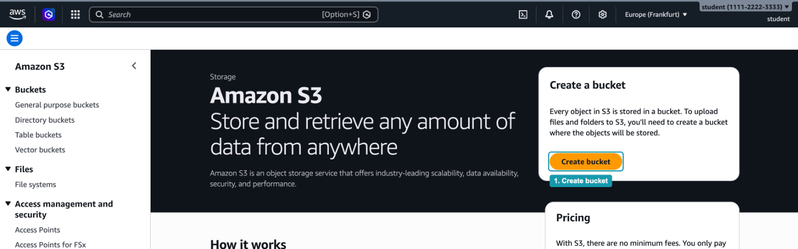

_Рисунок 6.1.1. Стартовая страница Amazon S3_

### Шаг 2. Задайте регион, тип и имя бакета

Первый блок формы называется `General configuration`:

1. `AWS Region` показывает `Europe (Frankfurt) eu-central-1` (_2_). Бакет создаётся в регионе, который выбран в консоли, и его объекты хранятся только в этом регионе.
2. `Bucket type`: оставьте `General purpose` (_3_). Это обычный бакет S3, который мы разбирали в главе. Вариант `Directory` предназначен для специальных сценариев с очень низкой задержкой и в курсе не используется.
3. `Bucket namespace`: выберите `Global namespace` (_4_). Консоль помечает второй вариант, `Account Regional namespace`, как рекомендованный. Это то самое второе пространство имён из раздела "Бакет, объект и ключ": имя в нём уникально только в пределах аккаунта и региона, а к нему в конце добавляются номер аккаунта и код региона. В курсе мы работаем с обычными бакетами в глобальном пространстве имён.
4. `Bucket name`: введите имя, которое вы придумали (_5_).

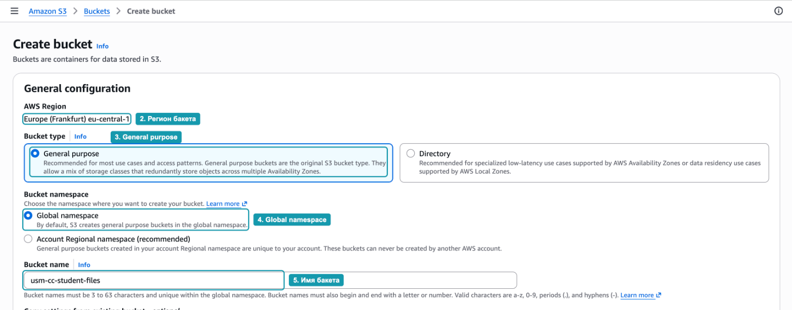

_Рисунок 6.1.2. Регион, тип бакета, пространство имён и имя_

Имя в глобальном пространстве должно быть уникальным среди всех аккаунтов AWS в мире. Если кто-то уже занял такое имя, консоль сообщит об этом при создании бакета. В этом случае добавьте к имени цифру или ещё одно слово.

### Шаг 3. Проверьте настройки доступа

Прокрутите форму ниже. Здесь ничего менять не нужно, но важно понять, что выбрано по умолчанию:

1. `Object Ownership`: выбрано `ACLs disabled (recommended)` (_6_). ACL это старый механизм, который позволял задавать права на каждый объект отдельно. В новых бакетах он отключён, все объекты принадлежат вашему аккаунту, а доступ определяется только политиками.
2. `Block Public Access settings for this bucket`: отмечено `Block all public access` (_7_). Вместе с ним включены все четыре отдельные настройки ниже. Пока они включены, бакет и его объекты нельзя сделать публичными ни политикой, ни ACL.

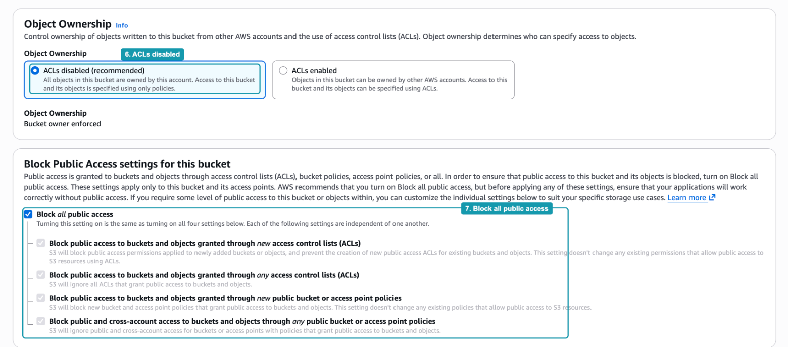

_Рисунок 6.1.3. Object Ownership и Block Public Access_

Подробно эти настройки мы разберём в разделе "Структура политики доступа". Пока запомните главное: новый бакет закрыт для всех, кроме вашего аккаунта, и чтобы это изменить, нужно сознательно выключить защиту.

### Шаг 4. Проверьте версионирование и шифрование

Прокрутите ещё ниже:

1. `Bucket Versioning`: оставьте `Disable` (_8_). Версионирование мы включим в Hands-on 6.2 и посмотрим, как оно защищает от случайного удаления.
2. `Default encryption`: выбрано `Server-side encryption with Amazon S3 managed keys (SSE-S3)` (_9_). Каждый новый объект S3 шифрует при записи на диск и расшифровывает при чтении. Ключами шифрования управляет сам S3, поэтому для приложения этот процесс незаметен.

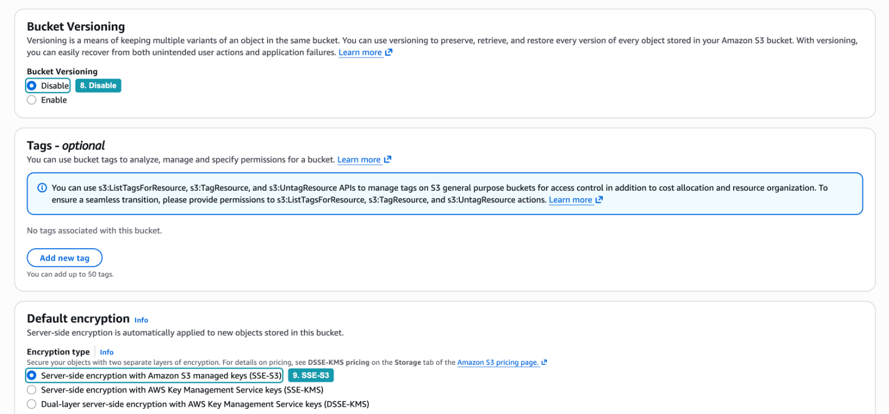

_Рисунок 6.1.4. Версионирование и шифрование по умолчанию_

Блок `Tags` оставьте пустым. Нажмите `Create bucket` внизу страницы.

### Шаг 5. Откройте созданный бакет

Консоль сразу откроет страницу нового бакета с зелёным сообщением об успешном создании. На вкладке `Objects` пока пусто: `Objects (0)`. Откройте вкладку `Permissions` (_10_).

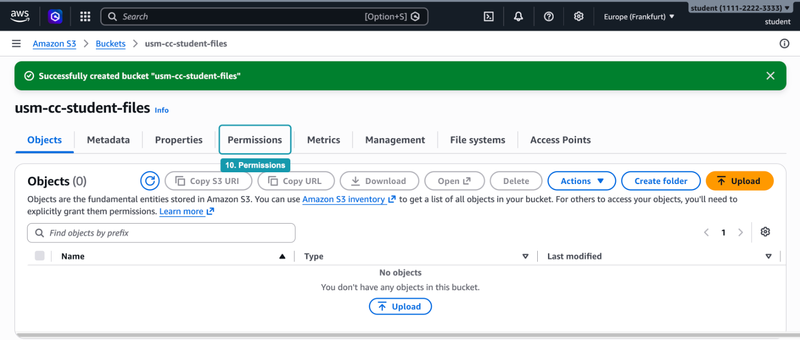

_Рисунок 6.1.5. Новый пустой бакет_

### Шаг 6. Посмотрите права бакета

На вкладке `Permissions` видно два важных факта:

- В блоке `Block public access (bucket settings)` написано `On` (_11_). Это настройка из шага 3.
- В блоке `Bucket policy` нет политики: `No policy to display` (_12_). Синяя плашка над ним напоминает, что публичный доступ всё равно заблокирован.

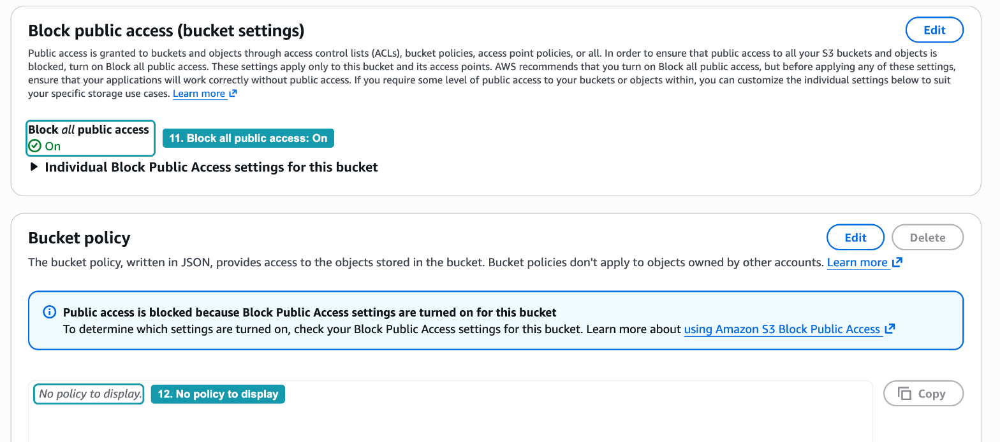

_Рисунок 6.1.6. Block Public Access включён, политики бакета нет_

Если политики бакета нет, кто вообще может с ним работать? Только пользователи и роли вашего аккаунта, которым это разрешено их собственными политиками IAM. Ваш пользователь в консоли такие права имеет, поэтому дальше вы сможете загружать и просматривать объекты. Посторонний человек из интернета не может ничего.

## Часть 2. Объекты и префиксы

### Шаг 7. Создайте "папку" uploads

Вернитесь на вкладку `Objects` и нажмите `Create folder`. В поле `Folder name` введите `uploads` (_13_). Символ `/` консоль добавит сама. Блок `Server-side encryption` оставьте как есть и нажмите `Create folder` (_14_).

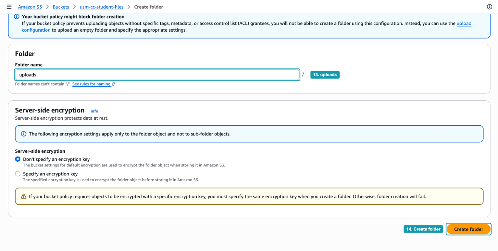

_Рисунок 6.1.7. Создание папки uploads_

Как мы говорили в разделе "Папок нет, есть префиксы", настоящую папку в S3 создать нельзя. Консоль создала пустой объект с ключом `uploads/`. В части 4 вы увидите его в командной строке.

### Шаг 8. Загрузите файлы под префикс uploads/

Щёлкните по `uploads/` в списке объектов и нажмите `Upload`:

1. Нажмите `Add files` (_15_) и выберите `avatar.png` и `report.pdf`. Файлы можно и просто перетащить в пунктирную область.
2. В таблице появятся оба файла (_16_). Обратите внимание на колонку `Type`: консоль определила тип содержимого по расширению файла, `image/png` и `application/pdf`.
3. В блоке `Destination` указано, куда попадут файлы: `s3://usm-cc-student-files/uploads/` (_17_). Это S3 URI, запись вида `s3://бакет/префикс`, которую понимает AWS CLI.
4. Блоки `Permissions` и `Properties` не трогайте и нажмите `Upload` (_18_).

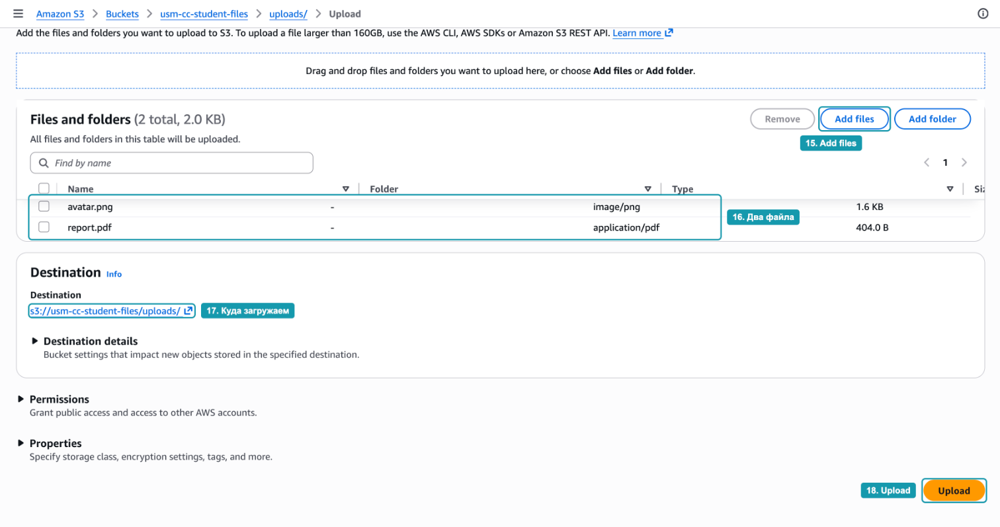

_Рисунок 6.1.8. Загрузка двух файлов под префикс uploads/_

Когда загрузка закончится, нажмите `Close`.

### Шаг 9. Посмотрите содержимое префикса

Вы находитесь внутри "папки": заголовок страницы `uploads/` (_19_), а строка навигации вверху показывает путь `usm-cc-student-files > uploads/`. В списке два объекта. Откройте `avatar.png` (_20_).

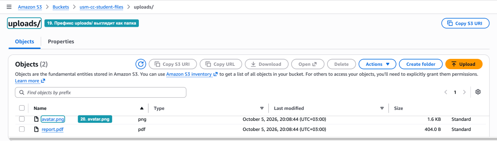

_Рисунок 6.1.9. Объекты с префиксом uploads/_

Консоль рисует знакомую картину с папками и файлами, но строит её из ключей: она берёт все ключи, которые начинаются с `uploads/`, и показывает часть после префикса.

### Шаг 10. Изучите свойства объекта

На вкладке `Properties` в блоке `Object overview` найдите четыре поля:

- `Key` (_21_). Ключ объекта `uploads/avatar.png`, а не `avatar.png`. Префикс входит в ключ целиком, и именно эта строка однозначно определяет объект внутри бакета.
- `S3 URI` (_22_). Адрес объекта для AWS CLI: `s3://usm-cc-student-files/uploads/avatar.png`.
- `Entity tag (Etag)` (_23_). Контрольная сумма содержимого, которую S3 вычисляет сам. Это тот самый пример метаданных, которые записывает S3, из раздела "Бакет, объект и ключ". Если содержимое объекта изменится, изменится и ETag.
- `Object URL` (_24_). HTTPS-адрес объекта вида `https://<бакет>.s3.<регион>.amazonaws.com/<ключ>`. Скопируйте его, он понадобится в части 3.

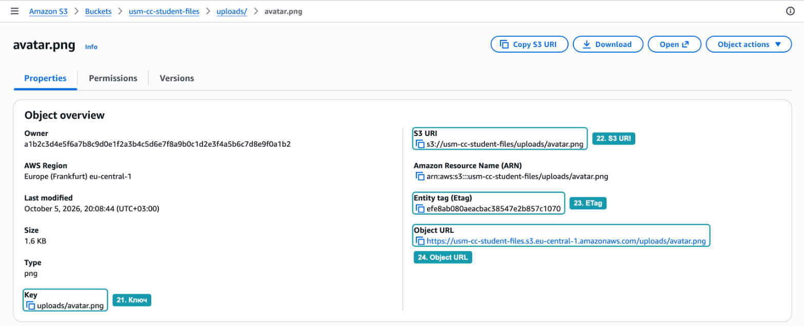

_Рисунок 6.1.10. Свойства объекта avatar.png_

Поле `Owner` показывает длинный идентификатор аккаунта-владельца в формате S3. Поле `Amazon Resource Name (ARN)` содержит идентификатор объекта в формате, который используется в политиках IAM. К ARN мы вернёмся, когда будем писать политики.

### Шаг 11. Найдите метаданные Content-Type

Прокрутите вкладку `Properties` вниз до блока с метаданными `System and user-defined`. В нём одна запись: системная метаинформация `Content-Type` со значением `image/png` (_25_).

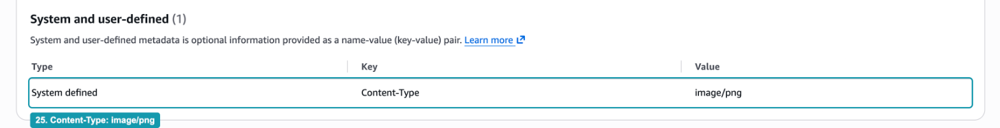

_Рисунок 6.1.11. Метаданные объекта_

Значение подставила консоль при загрузке, по расширению файла. S3 отдаёт его в HTTP-заголовке `Content-Type`, когда объект скачивают. Благодаря этому браузер понимает, что получил картинку, и показывает её, а не предлагает сохранить непонятный файл. Когда вы загружаете объекты из кода, как в примере с `PutObjectCommand` из главы, `ContentType` нужно указывать самим.

## Часть 3. Доступ по URL

### Шаг 12. Откройте объект по Object URL

Откройте новую вкладку браузера, вставьте `Object URL` из шага 10 и перейдите по нему. Вместо картинки вы увидите XML-документ с ошибкой:

```xml
<Error>
  <Code>AccessDenied</Code>
  <Message>Access Denied</Message>
  ...
</Error>
```

Почему консоль показывает объект, а браузер нет? Консоль отправляет запросы от имени вашего пользователя, и у этого пользователя есть права на бакет. Браузер, открывающий обычную ссылку, отправляет анонимный запрос: в нём нет никаких учётных данных AWS. Для S3 это запрос от неизвестного, и ему ничего не разрешено. Политики, которая открыла бы объекты для всех, у бакета нет (шаг 6), а Block Public Access не дал бы такую политику добавить.

Это правильное поведение. Файлы, которые загружают пользователи приложения, не должен видеть любой, кто подберёт адрес.

### Шаг 13. Откройте объект кнопкой Open

Вернитесь на страницу объекта `avatar.png` и нажмите `Open` справа вверху. Картинка откроется в новой вкладке. Посмотрите на адресную строку: после ключа объекта идёт длинный набор параметров `X-Amz-Algorithm`, `X-Amz-Credential`, `X-Amz-Expires`, `X-Amz-Signature` и других.

Это подписанный URL. Консоль сформировала временную ссылку, подписала её учётными данными вашего пользователя и ограничила срок действия. Как устроены такие ссылки и как создавать их самим, мы разберём в разделе "Временный доступ к объектам через подписанные URL" и в Hands-on 6.3.

> [!WARNING]
> Не отправляйте подписанные ссылки из консоли в общие чаты. Пока срок действия не истёк, по такой ссылке объект может скачать любой.

## Часть 4. Тот же бакет из командной строки

С CloudShell вы работали во второй лабораторной: это терминал прямо в консоли AWS, в котором AWS CLI уже установлен и работает от имени пользователя, под которым вы вошли в консоль.

### Шаг 14. Посмотрите список бакетов и объектов

Откройте CloudShell значком `>_` в верхней панели консоли или кнопкой `CloudShell` внизу слева. Выполните две команды, заменив имя бакета на своё:

```bash
aws s3 ls
aws s3 ls s3://usm-cc-student-files --recursive
```

Первая команда показывает бакеты аккаунта. Вторая показывает все ключи бакета с размерами в байтах. Обратите внимание на первую строку второго списка: объект `uploads/` размером 0 байт (_26_). Это служебный объект, который консоль создала в шаге 7 вместо "папки". Параметр `--recursive` нужен, чтобы CLI вывел полные ключи, а не сгруппировал их по префиксам.

### Шаг 15. Прочитайте метаданные объекта

Команда `head-object` из группы `aws s3api` возвращает метаданные объекта, не скачивая его содержимое:

```bash
aws s3api head-object --bucket usm-cc-student-files --key uploads/avatar.png
```

В ответе вы увидите знакомые поля: `ContentLength` (размер в байтах), `ETag` (то же значение, что в консоли), `ContentType` со значением `image/png` (_27_) и `ServerSideEncryption` со значением `AES256`. Последнее поле означает шифрование SSE-S3 из шага 4: объект хранится на дисках S3 зашифрованным.

### Шаг 16. Повторите запрос по Object URL

Выполните тот же анонимный запрос, что браузер в шаге 12, но с помощью `curl`. Параметр `-i` выводит не только тело ответа, но и HTTP-заголовки:

```bash
curl -i https://usm-cc-student-files.s3.eu-central-1.amazonaws.com/uploads/avatar.png
```

Первая строка ответа `HTTP/1.1 403 Forbidden` (_28_), а в теле тот же XML с кодом `AccessDenied` (_29_). CloudShell работает от имени вашего пользователя, но `curl` об этом ничего не знает и учётные данные к запросу не добавляет. Подписывает запросы своими учётными данными только AWS CLI.

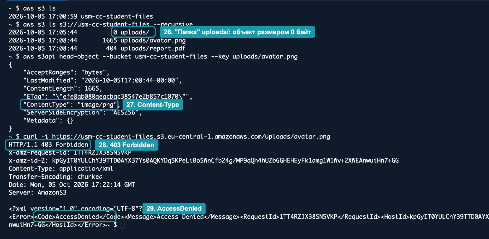

_Рисунок 6.1.12. Бакет и объекты в CloudShell_

Теперь скачайте объект через CLI и сравните контрольную сумму с ETag:

```bash
aws s3 cp s3://usm-cc-student-files/uploads/avatar.png .
md5sum avatar.png
```

Команда `aws s3 cp` подписывает запрос, поэтому скачивание проходит. Утилита `md5sum` вычисляет хеш файла по алгоритму MD5 и выведет то же значение, что поле `ETag`. Для небольшого объекта, загруженного одним запросом и зашифрованного SSE-S3, ETag это MD5-хеш его содержимого. Для объектов, загруженных частями, ETag вычисляется иначе, поэтому в общем случае использовать его как MD5 нельзя.

## Часть 5. Что сделать с бакетом

### Шаг 17. Оставьте бакет для следующих занятий

Бакет и загруженные файлы понадобятся в Hands-on 6.2 и 6.3. Удалять их сейчас не нужно.

Если вы не планируете продолжать, удалите бакет в два действия. Бакет, в котором есть объекты, удалить нельзя, поэтому сначала его очищают:

1. Откройте список бакетов, выберите свой бакет и нажмите `Empty`. Введите `permanently delete` в поле подтверждения и нажмите `Empty`.
2. Вернитесь к списку, снова выберите бакет и нажмите `Delete`. Введите имя бакета и нажмите `Delete bucket`.

> [!WARNING]
> Удаление объектов из бакета без версионирования необратимо. Корзины, как в операционной системе, в S3 нет.

## Вопросы для самопроверки

1. Какой ключ у объекта `avatar.png`, который вы загрузили в шаге 8, и почему консоль показывает его как файл внутри папки?
2. Почему команда `aws s3 ls --recursive` показала объект размером 0 байт, хотя вы загружали только два файла?
3. Какие метаданные объекта записал S3 сам, а какие появились из-за того, как вы загружали файл?
4. Почему объект открылся в консоли и кнопкой `Open`, но не открылся по `Object URL` в браузере?
5. Что нужно было бы изменить в настройках бакета, чтобы объект открывался по `Object URL` у любого пользователя, и почему в учебном приложении этого делать не стоит?
6. Почему `curl` в CloudShell получил `403 Forbidden`, а `aws s3 cp` в том же терминале скачал файл?
