# Hands-on 6.2. Защита и жизненный цикл данных

В разделе "Версионирование, резервные копии и RPO" мы говорили, что долговечность S3 защищает от отказа оборудования, но не от ошибки человека: если приложение перезапишет или удалит файл, S3 добросовестно сохранит эту ошибку. В этом занятии вы включите версионирование в бакете из Hands-on 6.1, перезапишете и удалите объект, а потом вернёте его. Затем настроите правило жизненного цикла, которое не даст старым версиям копиться бесконечно, и добавите политику бакета, которая запрещает обращения без шифрования.

## Что получится в конце

- Бакет `usm-cc-<ник>-files` с включённым версионированием.
- Объект `uploads/notes.txt` с историей из нескольких версий, которую вы просмотрите в консоли и через CLI.
- Опыт удаления объекта с маркером удаления и восстановления объекта.
- Откат объекта к старой версии.
- Правило жизненного цикла `cleanup-noncurrent`, которое через 30 дней переводит старые версии в более дешёвый класс хранения, а через 60 дней удаляет их.
- Политика бакета, которая отклоняет любые запросы по HTTP.

## Перед началом

- Вы закончили Hands-on 6.1: у вас есть бакет `usm-cc-<ник>-files` с объектами под префиксом `uploads/`. На рисунках используется имя `usm-cc-student-files`. Во всех командах ниже заменяйте его на имя своего бакета.
- Вы работаете в регионе `Europe (Frankfurt)`.
- Закладывайте на занятие около 50 минут.

## Часть 1. Версионирование

### Шаг 1. Включите версионирование

Откройте свой бакет и перейдите на вкладку `Properties`. Блок `Bucket Versioning` показывает `Disabled`: так бакет создавался в Hands-on 6.1. Нажмите `Edit` (_1_).

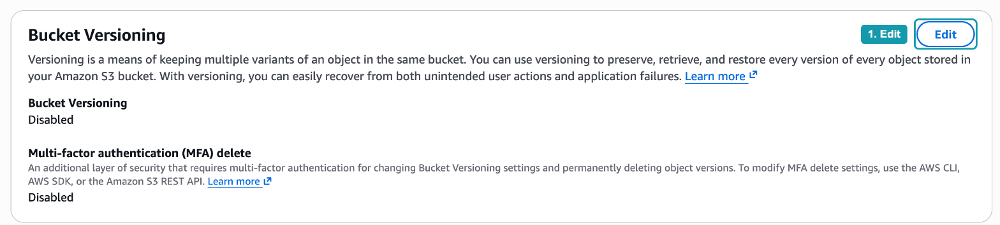

_Рисунок 6.2.1. Версионирование выключено_

Выберите `Enable` (_2_) и нажмите `Save changes` (_3_).

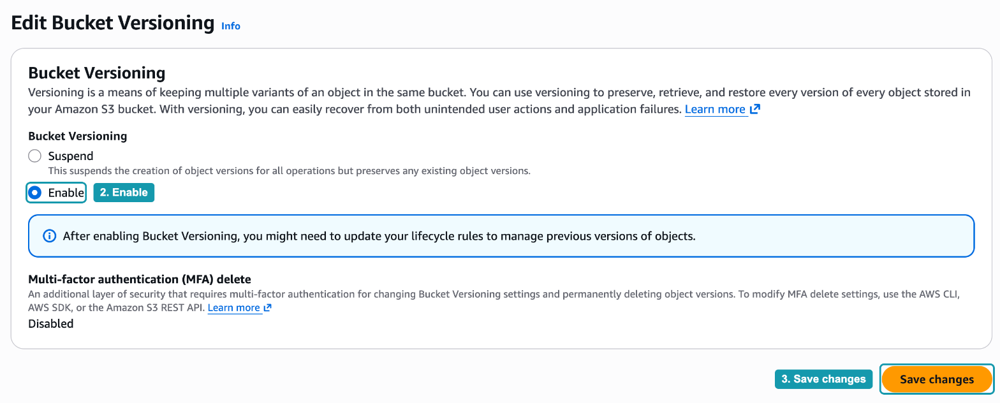

_Рисунок 6.2.2. Включение версионирования_

Обратите внимание на два элемента формы:

- Второй вариант называется `Suspend`, а не `Disable`. Как мы говорили в главе, включённое версионирование нельзя выключить совсем, его можно только приостановить. После приостановки новые версии перестают создаваться, но уже сохранённые остаются в бакете.
- Синяя плашка напоминает, что после включения версионирования стоит настроить правила жизненного цикла для старых версий. Этим мы займёмся в части 4.

## Часть 2. Перезапись и история версий

### Шаг 2. Загрузите две версии одного файла

Откройте CloudShell и выполните команды, заменив имя бакета на своё:

```bash
echo "v1" > notes.txt
aws s3 cp notes.txt s3://usm-cc-student-files/uploads/notes.txt

echo "v2" > notes.txt
aws s3 cp notes.txt s3://usm-cc-student-files/uploads/notes.txt
```

Первая команда `cp` создаёт объект `uploads/notes.txt` с текстом `v1`. Вторая загружает файл под тем же ключом. В бакете без версионирования она просто заменила бы содержимое, и `v1` пропал бы навсегда.

### Шаг 3. Посмотрите версии в консоли

Вернитесь в консоль, откройте префикс `uploads/` на вкладке `Objects` и включите переключатель `Show versions` (_4_). В таблице появилась колонка `Version ID` (_5_): у ключа `notes.txt` теперь два идентификатора версии. Строка со стрелкой слева (_6_) это предыдущая версия, строка над ней текущая.

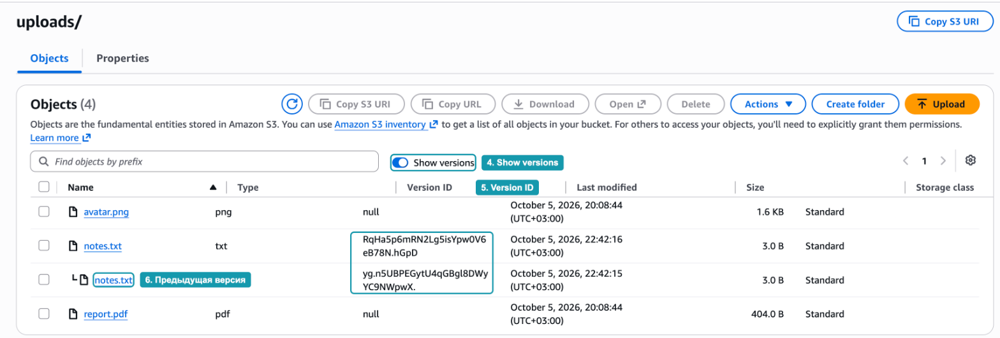

_Рисунок 6.2.3. Две версии объекта notes.txt_

У `avatar.png` и `report.pdf` в колонке `Version ID` стоит `null`. Эти объекты загружены в Hands-on 6.1, когда версионирование было выключено. S3 не присваивает им идентификаторы задним числом, а считает их версией с идентификатором `null`.

### Шаг 4. Получите старую версию через CLI

В CloudShell выведите список версий в виде таблицы:

```bash
aws s3api list-object-versions --bucket usm-cc-student-files --prefix uploads/ \
  --query "Versions[].[Key,VersionId,IsLatest,Size]" --output table
```

Параметр `--query` оставляет из большого JSON-ответа только четыре поля каждой версии: ключ, идентификатор версии, признак текущей версии и размер. У `notes.txt` две строки с разными `VersionId` (_7_), и только у одной `IsLatest` равно `True`. У старых объектов идентификатор `null` (_8_).

Скопируйте `VersionId` строки с `IsLatest = False` и скачайте эту версию в файл `old.txt`:

```bash
aws s3api get-object --bucket usm-cc-student-files --key uploads/notes.txt \
  --version-id <VersionId> old.txt
cat old.txt notes.txt
```

В ответе `get-object` поле `VersionId` совпадает с запрошенной версией (_9_). Команда `cat` выводит `v1` из скачанной старой версии и `v2` из локального файла (_10_).

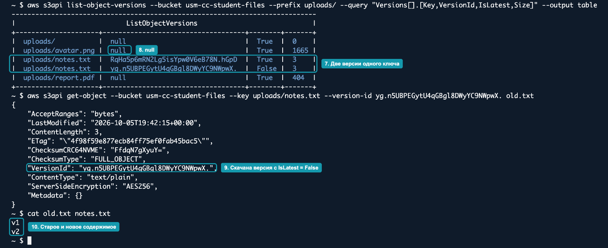

_Рисунок 6.2.4. Список версий и скачивание старой версии_

Без параметра `--version-id` S3 всегда отдаёт текущую версию. Так работают и браузер, и приложение, и консоль: история версий для них невидима, пока её не запросят явно.

## Часть 3. Удаление и восстановление

### Шаг 5. Удалите объект

Вернитесь в консоль к префиксу `uploads/`. Выключите `Show versions` (_11_), чтобы видеть бакет так, как его видит приложение. Отметьте `notes.txt` (_12_) и нажмите `Delete` (_13_).

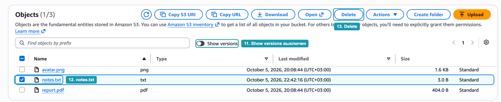

_Рисунок 6.2.5. Выбор объекта для удаления_

На странице удаления консоль прямо говорит, что произойдёт: `Deleting the specified objects adds delete markers to them` (_14_). Введите `delete` в поле подтверждения (_15_) и нажмите `Delete objects` (_16_). Затем нажмите `Close`.

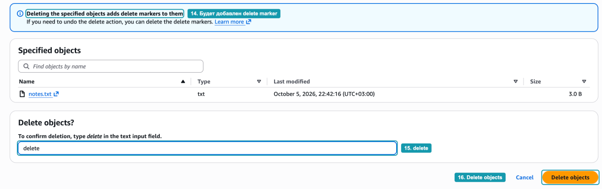

_Рисунок 6.2.6. Удаление добавляет маркер удаления_

В списке объектов `notes.txt` больше нет.

### Шаг 6. Найдите маркер удаления

Включите `Show versions`. Над двумя версиями `notes.txt` появилась строка с типом `Delete marker` (_17_), а сами версии `v1` и `v2` никуда не делись (_18_).

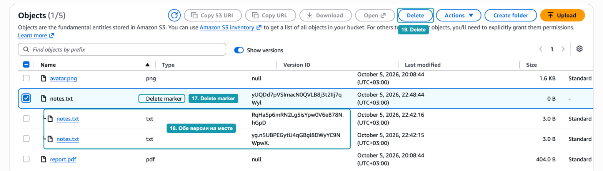

_Рисунок 6.2.7. Маркер удаления поверх двух версий_

Маркер удаления это пометка "объект удалён", которая легла поверх истории. Пока она лежит сверху, S3 отвечает, что объекта нет. Уберите пометку, и объект вернётся.

### Шаг 7. Удалите маркер

Отметьте строку с маркером удаления и нажмите `Delete` (_19_).

Консоль предупредит, что удаление необратимо (_20_). Это верно: маркер исчезнет навсегда, но нам это и нужно. Проверьте, что в таблице выбран именно `Delete marker` (_21_), введите `permanently delete` (_22_) и нажмите `Delete objects` (_23_).

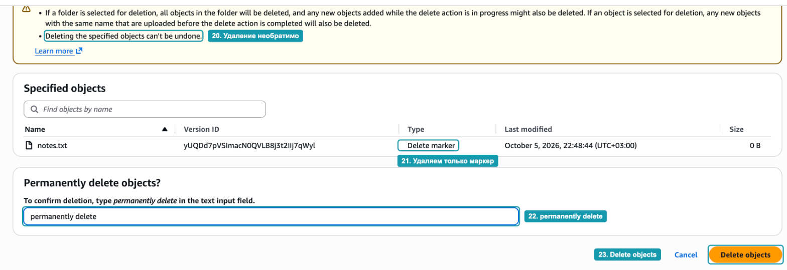

_Рисунок 6.2.8. Удаление маркера_

Нажмите `Close` и выключите `Show versions`. Объект `notes.txt` снова в списке (_24_), с содержимым `v2`.

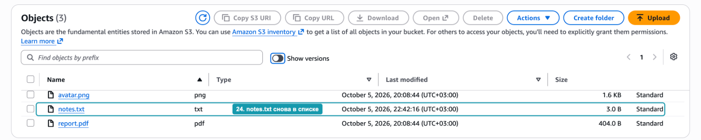

_Рисунок 6.2.9. Объект восстановлен_

> [!WARNING]
> Если при включённом `Show versions` отметить не маркер, а версию `v1` или `v2`, консоль удалит её навсегда. Версионирование защищает от обычного удаления, но не от удаления конкретных версий.

### Шаг 8. Откатитесь к первой версии

Восстановление через удаление маркера возвращает последнюю версию. Но что, если ошибочной была сама последняя версия, и нужно вернуть `v1`? Для этого старую версию копируют поверх текущей. В CloudShell выполните:

```bash
aws s3 cp s3://usm-cc-student-files/uploads/notes.txt -

aws s3api copy-object --bucket usm-cc-student-files --key uploads/notes.txt \
  --copy-source "usm-cc-student-files/uploads/notes.txt?versionId=<VersionId>"

aws s3 cp s3://usm-cc-student-files/uploads/notes.txt -

aws s3api list-object-versions --bucket usm-cc-student-files --prefix uploads/notes.txt \
  --query "Versions[].[VersionId,IsLatest,LastModified]" --output table
```

Вместо `<VersionId>` подставьте идентификатор версии `v1` из шага 4. Символ `-` в команде `aws s3 cp` означает "вывести содержимое объекта в терминал, а не сохранять в файл".

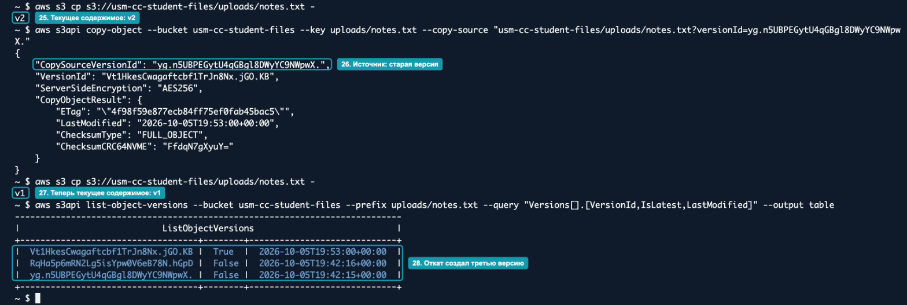

_Рисунок 6.2.10. Откат к первой версии_

Разберём вывод по порядку:

1. До отката текущее содержимое `v2` (_25_).
2. `copy-object` копирует объект в тот же ключ. В ответе `CopySourceVersionId` это версия, из которой брали данные (_26_), а `VersionId` идентификатор новой версии.
3. После отката текущее содержимое `v1` (_27_).
4. В истории теперь три версии (_28_). Откат не стёр `v2`, а создал третью версию с содержимым `v1`. Если откат оказался ошибкой, его тоже можно откатить.

## Часть 4. Правило жизненного цикла для старых версий

Каждая версия хранится и оплачивается как отдельный объект. В бакете, где файлы часто перезаписываются, старые версии будут копиться бесконечно. Настроим правило жизненного цикла, как в разделе "Правила жизненного цикла": сначала переводим старые версии в более дешёвый класс хранения, потом удаляем.

### Шаг 9. Создайте правило

Откройте вкладку `Management` бакета и нажмите `Create lifecycle rule`:

1. `Lifecycle rule name`: `cleanup-noncurrent` (_29_).
2. `Choose a rule scope`: выберите `Apply to all objects in the bucket` (_30_). В реальном проекте область действия часто ограничивают префиксом, например `uploads/`.
3. Подтвердите, что правило действует на весь бакет: отметьте `I acknowledge that this rule will apply to all objects in the bucket` (_31_).
4. В блоке `Lifecycle rule actions` отметьте два действия (_32_): `Transition noncurrent versions of objects between storage classes` и `Permanently delete noncurrent versions of objects`.

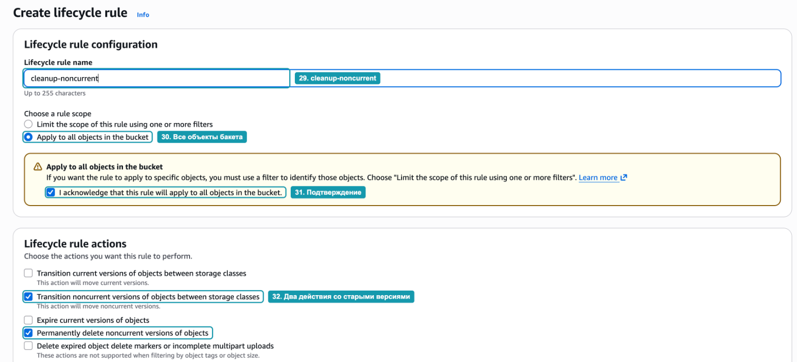

_Рисунок 6.2.11. Имя, область действия и действия правила_

Слово `noncurrent` в названиях действий означает "неактуальные", то есть старые версии. Действия со словом `current` относятся к текущим версиям, то есть к самим файлам. Их мы не трогаем: правило должно работать только с историей.

Под списком действий появится предупреждение о том, что за переходы между классами взимается плата за каждый запрос. Отметьте `I acknowledge that this lifecycle rule will incur a transition cost per request`. Для нескольких маленьких файлов эта плата не заметна.

### Шаг 10. Настройте сроки

Ниже появились блоки для выбранных действий:

1. В блоке `Transition noncurrent versions of objects between storage classes` оставьте класс `Standard-IA` и в поле `Days after objects become noncurrent` введите `30` (_33_).
2. В блоке `Permanently delete noncurrent versions of objects` в поле `Days after objects become noncurrent` введите `60` (_34_).

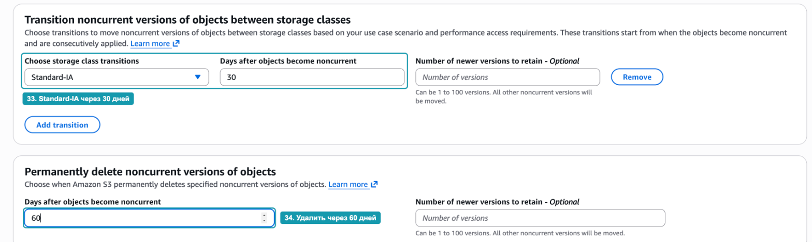

_Рисунок 6.2.12. Переход в Standard-IA и удаление_

Отсчёт в обоих полях идёт не от загрузки объекта, а от момента, когда версия перестала быть текущей. Сроки выбраны с учётом минимального срока хранения из главы: в Standard-IA версия пробудет 30 дней, ровно минимум для этого класса.

> [!NOTE]
> По умолчанию S3 не переводит в другие классы объекты меньше 128 КБ: для них плата за переход больше экономии. Наши версии `notes.txt` размером 3 байта останутся в Standard и просто удалятся на 60-й день. Для настоящих файлов, например загруженных пользователями фотографий, правило сработает полностью.

### Шаг 11. Проверьте итог и сохраните правило

Внизу страницы блок `Review transition and expiration actions` показывает, что будет происходить с версиями (_35_):

- День 0: версия становится неактуальной.
- День 30: неактуальные версии переходят в Standard-IA.
- День 60: неактуальные версии удаляются окончательно.

Для текущих версий действий нет. Нажмите `Create rule` (_36_).

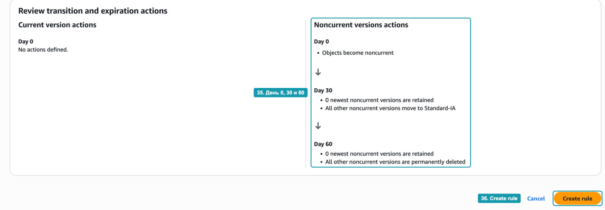

_Рисунок 6.2.13. Итоговая схема правила_

Результат правила за время занятия увидеть не получится: первые действия наступят только через 30 дней, к тому же S3 выполняет правила в фоне, а не точно в срок. Сегодня важно научиться настраивать правило и читать его схему.

## Часть 5. Политика бакета: только HTTPS

В разделе "Политика роли и политика бакета" мы разобрали политику, которая запрещает любые обращения к бакету без шифрования. Установим её на свой бакет и проверим, что она работает.

### Шаг 12. Добавьте политику бакета

Откройте вкладку `Permissions`, в блоке `Bucket policy` нажмите `Edit`. Вверху страницы показан `Bucket ARN` (_37_), его удобно скопировать в политику. Вставьте в редактор политику, заменив имя бакета в двух строках `Resource` на своё (_38_):

```json
{
  "Version": "2012-10-17",
  "Statement": [
    {
      "Effect": "Deny",
      "Principal": "*",
      "Action": "s3:*",
      "Resource": [
        "arn:aws:s3:::usm-cc-student-files",
        "arn:aws:s3:::usm-cc-student-files/*"
      ],
      "Condition": {
        "Bool": { "aws:SecureTransport": "false" }
      }
    }
  ]
}
```

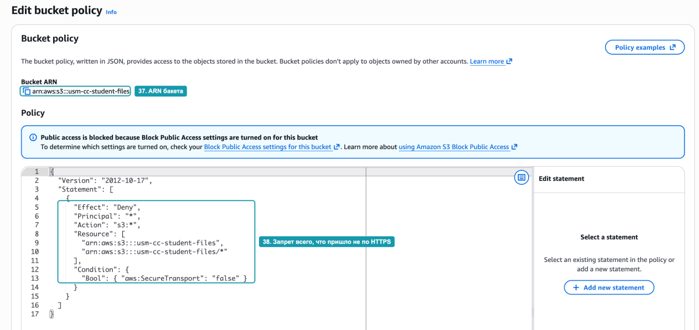

_Рисунок 6.2.14. Политика бакета, запрещающая HTTP_

Нажмите `Save changes` внизу страницы. Синяя плашка о Block Public Access над редактором не помешает сохранению. Block Public Access запрещает политики, которые открывают доступ всем, а наша политика ничего не разрешает, только запрещает.

> [!WARNING]
> Внимательно проверьте ARN в `Resource`. Если имя бакета указано с ошибкой, S3 не сохранит политику и покажет ошибку `Policy has invalid resource`: политика бакета может ссылаться только на сам бакет и его объекты.

### Шаг 13. Проверьте политику

В CloudShell выполните одну и ту же команду дважды: обычным способом и с параметром `--endpoint-url`, который заставляет CLI обращаться к S3 по адресу с `http://`:

```bash
aws s3 ls s3://usm-cc-student-files/uploads/
aws s3 ls s3://usm-cc-student-files/uploads/ --endpoint-url http://s3.eu-central-1.amazonaws.com
```

Первая команда работает по HTTPS, как CLI делает по умолчанию, и показывает объекты (_39_). Вторая заканчивается ошибкой `AccessDenied`, и в сообщении прямо названа причина: `explicit deny in a resource-based policy` (_40_), то есть явный запрет в политике ресурса.

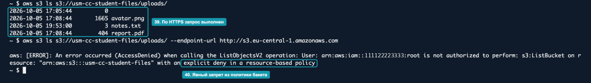

_Рисунок 6.2.15. Тот же запрос по HTTPS и по HTTP_

Это порядок принятия решения из раздела "Как AWS принимает решение". У вашего пользователя есть разрешение на `s3:ListBucket`, и по HTTPS запрос проходит. Но по HTTP подходит правило с `Deny`, а явный запрет проверяется первым, и никакое разрешение его не перекрывает. В сообщении об ошибке будет ARN вашего пользователя, а не номер аккаунта с рисунка.

## Часть 6. Что оставить

Бакет понадобится в Hands-on 6.3, удалять его не нужно. Версионирование, правило жизненного цикла и политику тоже оставьте:

- Подписанные URL в Hands-on 6.3 работают по HTTPS, поэтому политика им не помешает.
- Правило жизненного цикла само почистит старые версии `notes.txt`.
- Объём данных в бакете по-прежнему несколько килобайт.

Файлы `notes.txt` и `old.txt` в домашней папке CloudShell можно оставить или удалить командой `rm`.

## Вопросы для самопроверки

1. Почему у объектов `avatar.png` и `report.pdf` идентификатор версии `null`, а у `notes.txt` настоящие идентификаторы?
2. Что происходит с объектом при обычном удалении в бакете с версионированием?
3. Как вернуть удалённый объект, и чем это отличается от удаления версии `v1`?
4. Чем откат через `copy-object` отличается от удаления новой версии? Что останется в истории в каждом случае?
5. Почему удаление в правиле назначено на 60-й день, а не, например, на 40-й, если переход в Standard-IA происходит на 30-й?
6. Почему политика с `"Principal": "*"` не открывает бакет всему миру, и почему Block Public Access не мешает её сохранить?
7. Пользователь имеет разрешение `s3:ListBucket`, но получает `AccessDenied`. По сообщению об ошибке на рисунке 6.2.15 определите, какая часть процесса принятия решения сработала.
