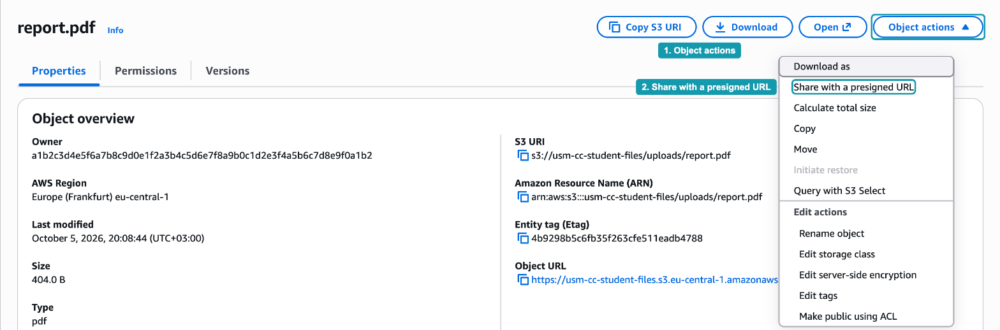
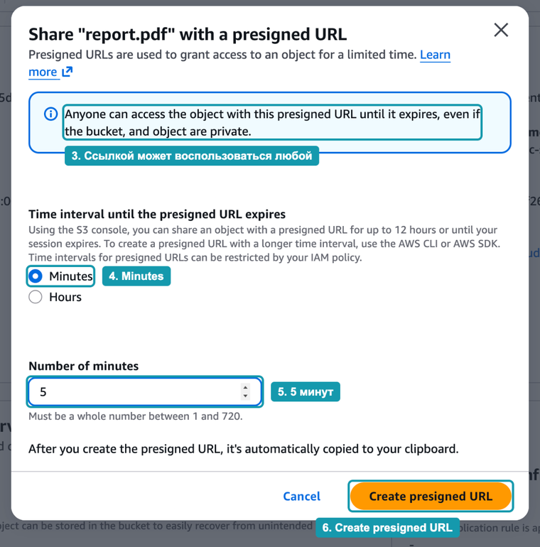
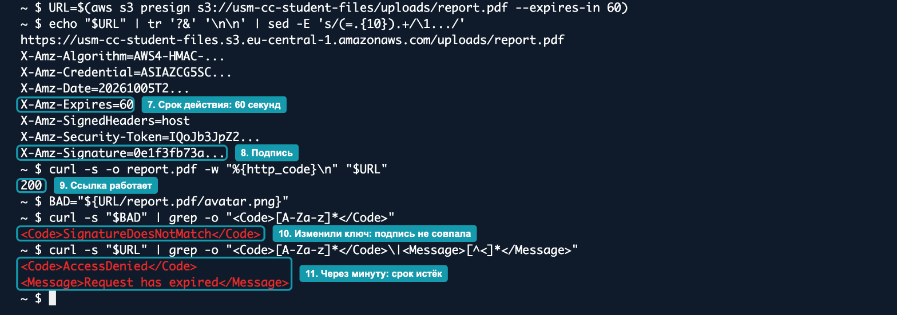
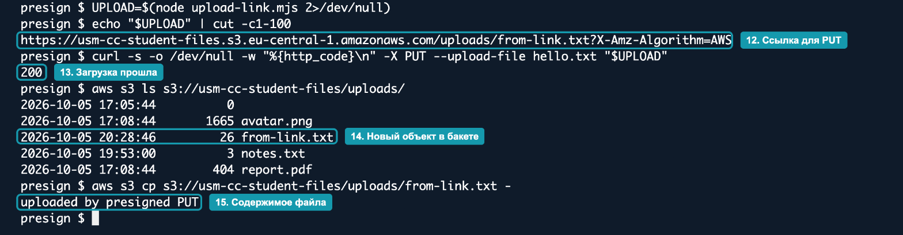
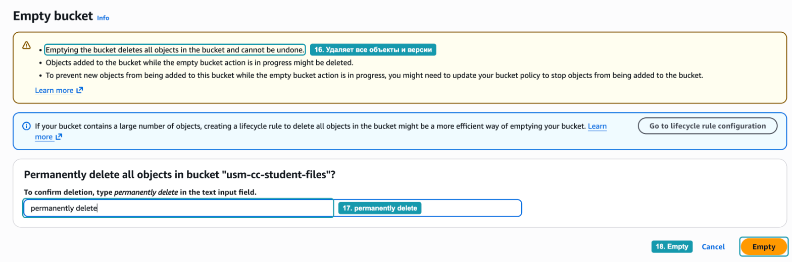
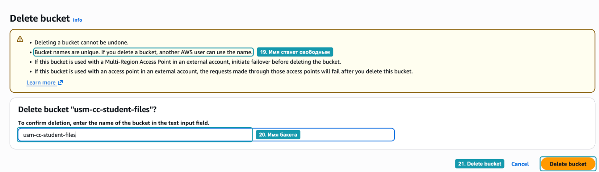

# Hands-on 6.3. Подписанные URL

В Hands-on 6.1 объект не открылся по прямому адресу: бакет закрыт, а браузер отправляет анонимный запрос. В этом занятии вы выдадите доступ к закрытому объекту временной ссылкой, сначала из консоли, затем из CLI. Проверите два ограничения из главы: ссылка перестаёт работать после истечения срока и после изменения ключа объекта. В конце загрузите файл в бакет по ссылке для `PUT`, которую создаст небольшой скрипт на Node.js.

## Что получится в конце

- Подписанная ссылка на `report.pdf`, созданная в консоли и открытая в браузере без входа в AWS.
- Ссылка из CLI со сроком 60 секунд и проверка двух отказов: при изменённом ключе и после истечения срока.
- Скрипт на Node.js, который создаёт ссылку для загрузки, и файл, загруженный по этой ссылке.
- Удалённый бакет: это последнее занятие главы.

## Перед началом

- У вас есть бакет `usm-cc-<ник>-files` из Hands-on 6.1 и 6.2 с объектом `uploads/report.pdf`. На рисунках используется имя `usm-cc-student-files`, в командах заменяйте его на своё.
- Вы работаете в регионе `Europe (Frankfurt)`.
- Закладывайте на занятие около 40 минут.

## Часть 1. Ссылка из консоли

### Шаг 1. Создайте подписанную ссылку

Откройте объект `uploads/report.pdf` в своём бакете. Нажмите `Object actions` (_1_) и выберите `Share with a presigned URL` (_2_).



_Рисунок 6.3.1. Меню действий с объектом_

В открывшемся окне консоль сразу предупреждает о главном свойстве такой ссылки (_3_): по ней объект получит любой, у кого она есть, хотя бакет и объект закрыты. Выберите `Minutes` (_4_), введите `5` (_5_) и нажмите `Create presigned URL` (_6_).



_Рисунок 6.3.2. Срок действия ссылки_

Под полем указан допустимый диапазон: от 1 до 720 минут. Ссылка из консоли действует не больше 12 часов. Через CLI или SDK можно создать ссылку на срок до 7 дней.

### Шаг 2. Откройте ссылку в приватном окне

Консоль скопирует ссылку в буфер обмена и покажет зелёное сообщение. Откройте приватное окно браузера, в котором вы не входили в AWS, и вставьте ссылку в адресную строку. Браузер откроет или скачает `report.pdf`.

Посмотрите на адрес. После ключа `uploads/report.pdf` идут параметры, которые мы разбирали в главе. Среди них `X-Amz-Expires=300`: 5 минут в секундах. Через 5 минут обновите страницу, и вместо файла появится ошибка.

Для сравнения откройте в том же окне `Object URL` объекта без параметров. Вы получите `AccessDenied`, как в Hands-on 6.1. Разница только в подписи: S3 проверяет её и выполняет запрос с правами того, кто подписал ссылку.

## Часть 2. Ссылка из CLI и её ограничения

### Шаг 3. Создайте ссылку на 60 секунд

Откройте CloudShell. Команда `aws s3 presign` создаёт ссылку на скачивание объекта. Сохраним её в переменную `URL`:

```bash
URL=$(aws s3 presign s3://usm-cc-student-files/uploads/report.pdf --expires-in 60)
```

Параметр `--expires-in` задаёт срок в секундах. Если его не указать, ссылка будет действовать час.

Ссылка длинная, поэтому выведем её по частям, каждый параметр на отдельной строке, а длинные значения обрежем:

```bash
echo "$URL" | tr '?&' '\n\n' | sed -E 's/(=.{10}).+/\1.../'
```

Команда `tr` заменяет символы `?` и `&`, которые разделяют параметры, на переводы строки, а `sed` оставляет от каждого значения первые 10 символов. В выводе видно `X-Amz-Expires=60` (_7_) и подпись `X-Amz-Signature` (_8_).

### Шаг 4. Проверьте ссылку и её ограничения

Выполните три проверки подряд:

```bash
# 1. Скачать объект по ссылке
curl -s -o report.pdf -w "%{http_code}\n" "$URL"

# 2. Заменить в ссылке ключ объекта и попробовать снова
BAD="${URL/report.pdf/avatar.png}"
curl -s "$BAD" | grep -o "<Code>[A-Za-z]*</Code>"

# 3. Подождать минуту и повторить исходную ссылку
sleep 60
curl -s "$URL" | grep -o "<Code>[A-Za-z]*</Code>\|<Message>[^<]*</Message>"
```

Параметр `-w "%{http_code}\n"` выводит код ответа HTTP. Запись `${URL/report.pdf/avatar.png}` в bash заменяет в строке `report.pdf` на `avatar.png`. Команда `grep -o` вырезает из XML-ответа об ошибке только код и сообщение.



_Рисунок 6.3.3. Ссылка из CLI и два отказа_

Результаты:

1. Код `200` (_9_): файл скачан, хотя `curl` не знает ничего о ваших учётных данных.
2. `SignatureDoesNotMatch` (_10_). Вы поменяли только ключ, но подпись вычислялась от исходного ключа. S3 пересчитал подпись по новому адресу, она не совпала, и запрос отклонён. Ссылку на один объект нельзя переделать в ссылку на другой.
3. `AccessDenied` с сообщением `Request has expired` (_11_): 60 секунд прошли.

> [!NOTE]
> CloudShell, как и роль экземпляра EC2, работает с временными учётными данными. Ссылка, подписанная ими, перестанет работать, когда истекут сами учётные данные, даже если в `--expires-in` указан больший срок. Об этом ограничении мы говорили в главе.

## Часть 3. Загрузка файла по ссылке для PUT

Команда `aws s3 presign` создаёт ссылки только на скачивание. Чтобы подписать загрузку, нужен SDK, как в примере из главы.

### Шаг 5. Подготовьте проект на Node.js

В CloudShell уже установлен Node.js. Создайте папку проекта и установите два пакета AWS SDK:

```bash
mkdir presign && cd presign
npm init -y > /dev/null
npm install @aws-sdk/client-s3 @aws-sdk/s3-request-presigner
```

Создайте файл `upload-link.mjs`, например в редакторе `nano upload-link.mjs`, со следующим содержимым:

```javascript
import { S3Client, PutObjectCommand } from "@aws-sdk/client-s3";
import { getSignedUrl } from "@aws-sdk/s3-request-presigner";

const s3 = new S3Client({ region: "eu-central-1" });

const command = new PutObjectCommand({
  Bucket: "usm-cc-student-files",
  Key: "uploads/from-link.txt",
});

const url = await getSignedUrl(s3, command, { expiresIn: 300 });
console.log(url);
```

Это код из главы с одним отличием: вместо `GetObjectCommand` используется `PutObjectCommand`. Ключ `uploads/from-link.txt` задан в коде. Как мы говорили в главе, ключ для загрузки выбирает приложение, а не пользователь. Расширение `.mjs` говорит Node.js, что файл использует `import` и `await` на верхнем уровне.

### Шаг 6. Загрузите файл по ссылке

```bash
echo "uploaded by presigned PUT" > hello.txt
UPLOAD=$(node upload-link.mjs 2>/dev/null)
echo "$UPLOAD" | cut -c1-100

curl -s -o /dev/null -w "%{http_code}\n" -X PUT --upload-file hello.txt "$UPLOAD"

aws s3 ls s3://usm-cc-student-files/uploads/
aws s3 cp s3://usm-cc-student-files/uploads/from-link.txt -
```

Запись `2>/dev/null` скрывает предупреждение SDK о версии Node.js. Оно выводится в поток ошибок и на работу скрипта не влияет. Команда `cut -c1-100` показывает только начало ссылки.



_Рисунок 6.3.4. Загрузка файла по ссылке для PUT_

Ссылка ведёт на ключ `uploads/from-link.txt` (_12_). Запрос `PUT` с содержимым `hello.txt` вернул `200` (_13_). Объект появился в бакете (_14_), а его содержимое совпадает с файлом (_15_).

Обратите внимание, что `curl` загрузил файл без учётных данных AWS. В реальном приложении на его месте был бы браузер пользователя: сервер выдаёт ссылку, а файл идёт напрямую в S3, минуя сервер. Загрузку из JavaScript в браузере вы будете настраивать в лабораторной работе: для неё бакету нужна ещё настройка CORS.

> [!NOTE]
> Политика бакета из Hands-on 6.2, которая запрещает HTTP, здесь не мешает: подписанные ссылки используют HTTPS.

## Часть 4. Удаление бакета

Это последнее занятие главы, бакет больше не нужен. Бакет, в котором есть объекты, удалить нельзя, поэтому сначала его очищают.

### Шаг 7. Очистите бакет

Откройте список бакетов, выберите свой бакет и нажмите `Empty`. Консоль предупреждает, что очистка удаляет все объекты и её нельзя отменить (_16_). В бакете с версионированием это значит все версии и маркеры удаления, а не только текущие объекты. Введите `permanently delete` (_17_) и нажмите `Empty` (_18_).



_Рисунок 6.3.5. Очистка бакета_

На странице результата в строке `Successfully deleted` будет больше объектов, чем вы видели в списке: туда входят и старые версии `notes.txt` из Hands-on 6.2.

### Шаг 8. Удалите бакет

Вернитесь к списку бакетов, снова выберите бакет и нажмите `Delete`. Обратите внимание на второе предупреждение (_19_): после удаления имя бакета освободится, и его сможет занять любой другой аккаунт AWS. Введите имя бакета (_20_) и нажмите `Delete bucket` (_21_).



_Рисунок 6.3.6. Удаление бакета_

Правило жизненного цикла и политика бакета удаляются вместе с ним. В CloudShell удалите учебные файлы:

```bash
cd ~ && rm -rf presign notes.txt old.txt report.pdf
```

## Вопросы для самопроверки

1. Почему ссылка из консоли открылась в приватном окне, где вы не входили в AWS, а `Object URL` того же объекта нет?
2. Почему после замены `report.pdf` на `avatar.png` в ссылке S3 ответил `SignatureDoesNotMatch`, хотя у вас есть права на оба объекта?
3. Ссылка создана в CloudShell с `--expires-in 604800`. Будет ли она работать через 7 дней? Почему?
4. Почему для ссылки на загрузку пришлось писать скрипт на Node.js, а не использовать `aws s3 presign`?
5. Почему ключ загружаемого объекта задаёт приложение, а не пользователь, который загружает файл?
6. Что именно удаляет `Empty` в бакете с версионированием?
