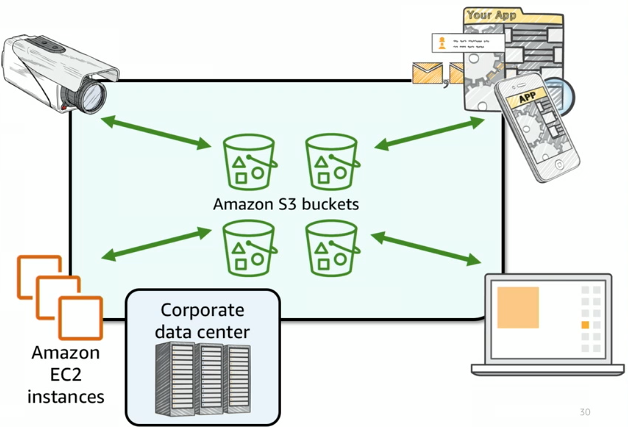
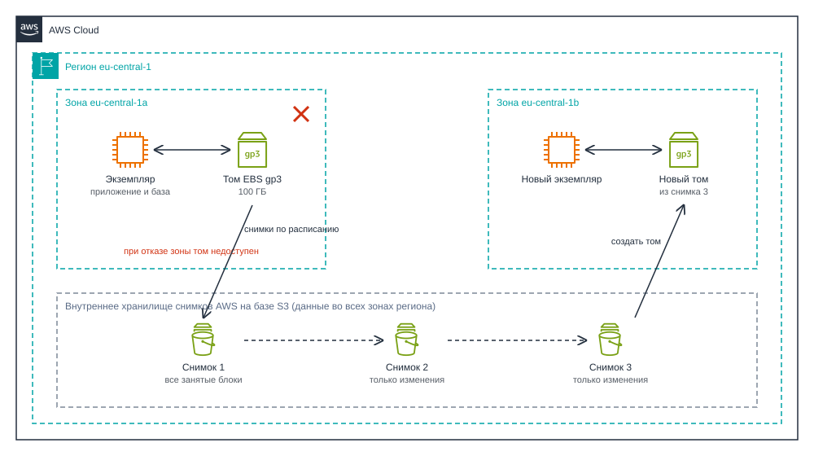
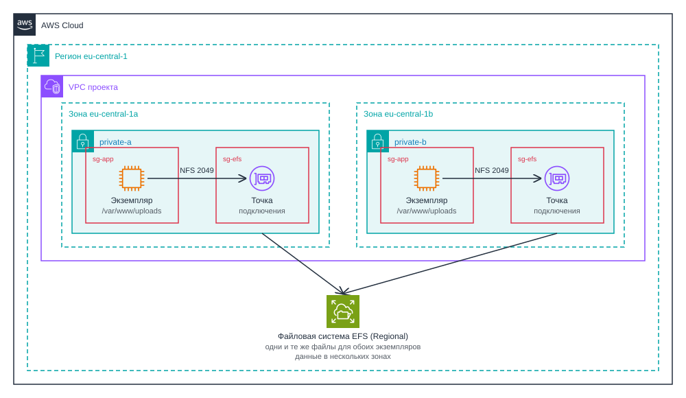

# Облачные хранилища. Amazon S3, EBS и EFS

<i>
Сеть Джон и Эмма в итоге построили сами. Своя VPC, база в приватной подсети, куда из интернета нет дороги, SSH только через bastion. Журнал PostgreSQL больше не пугал сотнями чужих попыток входа. Код лежал в GitHub, база жила на отдельном сервере, и Джон был уверен, что сервер приложения теперь можно в любой момент выбросить и собрать заново.

В воскресенье он так и сделал. Старый сервер давно просился на свежую версию Amazon Linux, поэтому Джон запустил чистый экземпляр, поставил nginx и PHP, скачал код из репозитория и перевесил Elastic IP. Сайт открылся с первого раза. Старый сервер Джон удалил, чтобы не платить за два.

В понедельник утром ему написала Эмма.

– "Джон, а где картинки? - Записи открываются, текст на месте, а вместо фотографий пустые рамки".

Джон зашёл на сервер. Папка `storage/uploads` была на месте, новенькая и совершенно пустая.

– "Код я взял из репозитория, база на своём сервере... - он замолчал. - А файлы пользователей лежали на диске старого сервера. С которым я их вчера и удалил".

Восстановить ничего не удалось: корневой диск исчез вместе с экземпляром, а снимков они ни разу не делали.

– "Выходит, сервер всё-таки нельзя выбросить, - сказала Эмма. - Пока на нём лежит хоть один файл пользователя, это уже не просто сервер. И второй рядом не поставишь: фотографию загрузят на один, а показывать её будет другой".

– "Помнишь, с чего всё начиналось? - вздохнул Джон. - Я ведь сразу хотел сохранять картинки в облачное хранилище. Только мы тогда застряли на ключах доступа и так до него и не дошли".
</i>

## Содержание

- [Облачные хранилища. Amazon S3, EBS и EFS](#облачные-хранилища-amazon-s3-ebs-и-efs)
  - [Содержание](#содержание)
  - [Вопросы для самопроверки](#вопросы-для-самопроверки)
  - [Результаты обучения](#результаты-обучения)
  - [Ретроспектива](#ретроспектива)
  - [Где хранить файлы приложения](#где-хранить-файлы-приложения)
  - [Модели хранения](#модели-хранения)
    - [Три уровня работы с данными](#три-уровня-работы-с-данными)
    - [Блочное хранилище](#блочное-хранилище)
    - [Файловое хранилище](#файловое-хранилище)
    - [Объектное хранилище](#объектное-хранилище)
    - [Как выбрать модель](#как-выбрать-модель)
  - [Amazon S3](#amazon-s3)
    - [Что такое S3](#что-такое-s3)
    - [Архитектура и ключевые понятия](#архитектура-и-ключевые-понятия)
    - [Правила именования бакетов](#правила-именования-бакетов)
    - [Папок нет, есть префиксы](#папок-нет-есть-префиксы)
    - [Что хранить в S3](#что-хранить-в-s3)
  - [Работа с объектами S3](#работа-с-объектами-s3)
    - [Адрес объекта](#адрес-объекта)
    - [Операции с объектами](#операции-с-объектами)
    - [Способы работы с S3](#способы-работы-с-s3)
  - [Долговечность и доступность S3](#долговечность-и-доступность-s3)
  - [Классы хранения и жизненный цикл](#классы-хранения-и-жизненный-цикл)
    - [Классы хранения](#классы-хранения)
    - [Жизненный цикл объектов](#жизненный-цикл-объектов)
  - [Версионирование](#версионирование)
  - [Шифрование данных в S3](#шифрование-данных-в-s3)
  - [Управление доступом к S3](#управление-доступом-к-s3)
    - [Доступ к бакету по умолчанию](#доступ-к-бакету-по-умолчанию)
    - [Политики доступа](#политики-доступа)
    - [Политика роли и политика бакета](#политика-роли-и-политика-бакета)
    - [Публичный бакет и статический сайт](#публичный-бакет-и-статический-сайт)
  - [Подписанные URL](#подписанные-url)
  - [Amazon EBS](#amazon-ebs)
    - [Том и зона доступности](#том-и-зона-доступности)
    - [Типы томов](#типы-томов)
    - [Снимки](#снимки)
  - [Amazon EFS](#amazon-efs)
    - [Подключение к EFS](#подключение-к-efs)
  - [Защита данных: резервные копии, RPO и RTO](#защита-данных-резервные-копии-rpo-и-rto)
    - [От чего защищаем данные](#от-чего-защищаем-данные)
    - [Резервная копия и репликация](#резервная-копия-и-репликация)
    - [RPO и RTO](#rpo-и-rto)
    - [Механизмы защиты в AWS](#механизмы-защиты-в-aws)
  - [Собираем решения вместе](#собираем-решения-вместе)
  - [Резюме](#резюме)

## Вопросы для самопроверки

1. Почему файлы, которые пользователи загружают в веб-приложение, нельзя надёжно хранить на диске экземпляра EC2, даже если этот диск EBS?
2. Чем блочное, файловое и объектное хранилища отличаются по способу доступа к данным, и какой сервис AWS соответствует каждому из них?
3. Что такое бакет, объект и ключ в Amazon S3, и почему в S3 нет настоящих папок?
4. Чем долговечность хранилища отличается от его доступности, и от чего не защищают "одиннадцать девяток"?
5. Как класс хранения и правила жизненного цикла влияют на стоимость хранения данных?
6. Как частота резервного копирования связана с RPO, и чем резервная копия отличается от репликации?
7. Из каких элементов состоит политика доступа, и почему для `s3:ListBucket` и `s3:GetObject` указываются разные ресурсы?
8. Зачем нужны подписанные URL, и чьими правами пользуется человек, который открывает такую ссылку?
9. Когда вместо Amazon S3 выбирают том EBS, а когда общую файловую систему EFS?

## Результаты обучения

После изучения этой главы вы сможете:

1. Объяснить, какие данные переживают перезагрузку, остановку и удаление экземпляра EC2, и спроектировать сервер, который не хранит пользовательские данные на своём диске.
2. Сравнить блочное, файловое и объектное хранилища и выбрать подходящий сервис AWS для конкретной задачи.
3. Объяснить модель данных Amazon S3: бакет, объект, ключ, префикс, метаданные.
4. Различать долговечность и доступность хранилища и объяснить, от каких сбоев защищает каждая из них.
5. Выбрать класс хранения S3 и составить правило жизненного цикла для данных, которые со временем используются всё реже.
6. Определить RPO и RTO для системы и подобрать механизм защиты данных под заданный RPO.
7. Прочитать и написать политику доступа к S3 с элементами `Effect`, `Action`, `Resource`, `Principal` и `Condition`.
8. Выбрать между публичным доступом, проксированием через сервер и подписанным URL для выдачи файла пользователю.
9. Выбрать тип тома EBS под нагрузку и объяснить, как снимки защищают данные тома.
10. Объяснить, как экземпляры из разных зон доступности работают с одной файловой системой EFS.

## Ретроспектива

Эта глава опирается на материал двух предыдущих глав:

- _Четвёртая глава_. Мы выбирали хранилище для экземпляра EC2 и познакомились с двумя видами дисков. Amazon EBS подключается к экземпляру по сети и живёт независимо от него. Instance store установлен в том же физическом сервере и теряет данные при остановке экземпляра. Там же мы назначили экземпляру роль IAM с готовой политикой `AmazonS3ReadOnlyAccess` и пообещали, что собственные политики с точным списком действий и ресурсов будем писать в главе о хранилищах. Это обещание выполняется здесь.
- _Пятая глава_. Мы построили собственную сеть: публичные и приватные подсети, NAT Gateway, Security Group. Среди способов связать VPC с другими сетями мы упомянули VPC endpoint для Amazon S3, но сам S3 тогда не обсуждали.

Пока приложение работает на одном сервере, загруженные пользователями файлы можно хранить прямо на его диске. Глава начинается с вопроса, который возникает следующим: что будет с этими файлами, когда сервер сломается, когда серверов станет два или когда кто-то по ошибке удалит экземпляр.

## Где хранить файлы приложения

Веб-приложение работает с двумя видами данных:

- _Код и конфигурацию_ всегда можно заново взять из репозитория.
- _Данные пользователей_ (аккаунты, записи, загруженные фотографии и документы) взять больше неоткуда: если они потерялись, то навсегда.

Пока приложение работает на одном сервере, загруженные файлы проще всего сохранять в каталог на его диске. Посмотрим, что происходит с такими файлами при разных событиях[^1].

| Событие                         | Instance store | Корневой том EBS                            | Дополнительный том EBS                 |
| ------------------------------- | -------------- | ------------------------------------------- | -------------------------------------- |
| Перезагрузка (reboot)           | Сохраняется    | Сохраняется                                 | Сохраняется                            |
| Остановка (stop)                | Теряется       | Сохраняется                                 | Сохраняется                            |
| Удаление экземпляра (terminate) | Теряется       | По умолчанию удаляется вместе с экземпляром | По умолчанию сохраняется               |
| Отказ зоны доступности          | Теряется       | Недоступен, пока зона не восстановится      | Недоступен, пока зона не восстановится |

Отдельный том EBS выглядит надёжным решением: он переживает и остановку, и удаление экземпляра. Но у диска сервера есть ограничения, которые от его надёжности не зависят:

- _Диск находится в одной зоне_. Если зона перестанет работать, диск станет недоступен вместе с сервером.
- _Копии диска делает владелец_. Если резервное копирование не настроено, копии нет.
- _С диском работает один сервер_. Второй сервер не может одновременно пользоваться тем же диском.

Последнее ограничение проявляется, как только серверов становится два. Допустим, приложение работает на двух экземплярах:

1. Пользователь загружает фотографию. Запрос попадает на первый сервер, и файл сохраняется на его диск.
2. Через минуту пользователь открывает страницу с фотографией. Запрос попадает на второй сервер.
3. На диске второго сервера фотографии нет, и пользователь видит ошибку.

Синхронизировать каталоги между серверами можно, но это быстро превращается в самодельную распределённую файловую систему. Облачные архитектуры решают задачу проще: файлы выносят с серверов в общее хранилище.

**Сервер без состояния (stateless server)** - сервер, который не хранит на своих дисках пользовательские данные. Его можно удалить и заменить новым без потери данных.


_6.1. Файлы на дисках экземпляров и файлы в общем хранилище_

На рисунке 6.1 слева каждый экземпляр хранит файлы на своём томе, и второй сервер не видит, что загрузили на первый. Справа оба экземпляра пишут в одно хранилище, и любой сервер можно заменить. Записи при этом хранятся в базе данных, а файлы в отдельном хранилище. Какое хранилище выбрать, зависит от того, как приложение обращается к данным.

## Модели хранения

Чтобы понять, куда вынести файлы пользователей, нужно сначала разобраться, какие вообще бывают хранилища в облаке. Во второй главе мы кратко назвали три модели хранения: _блочное_, _файловое_ и _объектное_ хранилище. Они по-разному устроены, и не каждая подходит на роль общего хранилища для нескольких серверов. Разберём, чем они отличаются и для каких задач нужна каждая.

### Три уровня работы с данными

Различие между моделями проще всего понять, если вспомнить, что происходит, когда программа сохраняет файл на обычный диск компьютера. В этом участвуют три уровня:

- _Диск_. Хранит данные небольшими порциями одинакового размера, которые называются блоками. Каждый блок имеет номер, и диск умеет только записать или прочитать блок с нужным номером. О файлах он ничего не знает.
- _Файловая система_. Часть операционной системы, которая превращает блоки в привычные файлы и каталоги и помнит, какой файл в каких блоках лежит.
- _Программа_. Просто открывает, читает и записывает файлы по имени, например `uploads/photo.jpg`.

Облачное хранилище выдаёт в виде сервиса один из этих уровней. Блочное хранилище даёт уровень диска, файловое даёт уровень файловой системы, а объектное отказывается от файловой системы и предлагает другую модель: целые объекты, которые сохраняют и читают HTTP-запросами. В AWS каждой модели соответствует свой сервис.

| Модель хранения       | Что предоставляет сервис                                                                                   | Сервис AWS   |
| --------------------- | ---------------------------------------------------------------------------------------------------------- | ------------ |
| _Блочное хранилище_   | Виртуальный диск из пронумерованных блоков. Файловую систему на нём создаёт и обслуживает ОС сервера.      | _Amazon EBS_ |
| _Файловое хранилище_  | Готовую файловую систему с каталогами и файлами. Серверы подключают её по сети и работают с ней совместно. | _Amazon EFS_ |
| _Объектное хранилище_ | Хранилище объектов без файловой системы. Программа сохраняет и читает объекты целиком через HTTP-запросы.  | _Amazon S3_  |

### Блочное хранилище

**Блочное хранилище (block storage)** - хранилище, которое предоставляет диск в виде последовательности блоков фиксированного размера с номерами. Что лежит в блоках, решает операционная система, к которой подключён диск.

Блочное хранилище выполняет команды вида "_прочитай блок 1532_" и "_запиши блок 1533_". Файловую систему на такой диск ставит операционная система сервера, точно так же, как на обычный жёсткий диск. Поэтому блочный диск универсален: на нём может лежать операционная система, файлы базы данных или журнал транзакций.

Из устройства модели следуют её свойства:

- _Низкая задержка_. Диск отвечает за миллисекунды, поэтому на нём работают ОС и базы данных.
- _Частичная запись_. Можно изменить несколько байт в середине большого файла, не переписывая файл целиком. Так работают СУБД.
- _Один сервер_. Файловой системой на диске управляет операционная система одного сервера. Второй сервер не знает, какие изменения она вносит, поэтому одновременная запись с двух серверов привела бы к повреждению данных. Отсюда ограничение из начала главы: _блочный диск не может быть общим хранилищем_.

В AWS блочное хранилище представляет _Amazon EBS_, который вы знаете по четвёртой главе.

### Файловое хранилище

**Файловое хранилище (file storage)** - хранилище, которое предоставляет по сети готовую файловую систему с каталогами и файлами. Несколько серверов могут подключить её одновременно и работать с одними и теми же файлами.

Здесь файловой системой управляет не операционная система сервера, а сам сервис хранения. Серверы обращаются к ней по сетевому протоколу, в Linux обычно по NFS (Network File System). После подключения файловая система выглядит для программы как обычный каталог, например `/var/www/uploads`. Программа по-прежнему вызывает `open`, `read`, `write`, но файлы лежат не на локальном диске, а в сервисе.

Свойства файловой модели:

- _Общий доступ_. Все подключённые серверы видят одни и те же файлы, и проблема двух серверов решается.
- _Код не меняется_. Приложение, которое писало в локальный каталог, продолжает писать в каталог, только теперь сетевой.
- _Цена и задержка выше_. Каждое обращение к файлу идёт по сети, а сервис хранит данные с избыточностью, и за гигабайт приходится платить больше, чем в объектном хранилище.

В AWS файловое хранилище для Linux представляет _Amazon EFS_ (Elastic File System). Для Windows и специализированных файловых систем есть семейство сервисов _Amazon FSx_, но в этом курсе мы их не рассматриваем.

### Объектное хранилище

Третья модель отказывается от файловой системы совсем.

**Объектное хранилище (object storage)** - хранилище, в котором данные хранятся как отдельные объекты. Каждый объект состоит из содержимого, метаданных (например, типа содержимого и даты создания) и уникального ключа, по которому объект можно найти.

Объект удобно представлять как пару "ключ и значение":

- ключ это строка, например `photos/vacation.jpg`,
- а значение это файл любого размера вместе с описанием (_например_, тип содержимого и дата создания).

Каталогов, блоков и монтирования нет. Работа с хранилищем сводится к HTTP-запросам:

- запрос `PUT` с ключом и содержимым сохраняет объект,
- запрос `GET` с тем же ключом возвращает его.

Свойства объектной модели:

- _Доступ откуда угодно_. К хранилищу обращаются по HTTPS: серверы из любой зоны, мобильные приложения и даже браузеры пользователей.
- _Практически неограниченный объём_. Не нужно заранее выделять место и следить, чтобы диск не переполнился.
- _Низкая цена_. Гигабайт стоит заметно дешевле, чем на дисках и в файловом хранилище.
- _Нет частичной записи_. Объект нельзя открыть и переписать байты с 100-го по 200-й. Можно только загрузить объект заново целиком.

Для фотографий, документов, видео и резервных копий последнее ограничение не мешает: их и так пишут целиком. Для файлов базы данных оно делает объектное хранилище непригодным. В AWS объектное хранилище представляет Amazon S3.

### Как выбрать модель

На рисунке 6.2 все три модели показаны в одном регионе.


_6.2. Три модели хранения в AWS: EBS, EFS и S3_

Том EBS находится в одной зоне и подключён к одному экземпляру. Файловая система EFS доступна экземплярам из разных зон. К S3 по HTTPS обращаются и экземпляры, и пользователи из интернета. Сведём сильные и слабые стороны моделей в таблицу[^2].
| Свойство | Блочное (Amazon EBS) | Файловое (Amazon EFS) | Объектное (Amazon S3) |
| -------- | -------------------- | --------------------- | --------------------- |
| Единица данных | Блок | Файл в каталоге | Объект с ключом и метаданными |
| Как обращаются к данным | Как к локальному диску сервера | Подключают по сети как обычный каталог | HTTP-запросами |
| Кто работает с данными одновременно | Один сервер | Многие серверы в сети | Сколько угодно клиентов: серверы, мобильные приложения, браузеры |
| Изменение части данных | Да | Да | Нет, объект загружается заново целиком |
| Задержка | Самая низкая | Выше, чем у диска | Выше, чем у диска: каждое обращение это HTTP-запрос |
| Где хранятся данные | В одной зоне доступности | В нескольких зонах или в одной, на выбор | В нескольких зонах, кроме однозонных классов |
| Объём | Выделяют заранее, при необходимости увеличивают | Растёт и уменьшается автоматически | Практически не ограничен |
| За что платят | За выделенный объём | За занятый объём | За занятый объём, запросы и трафик |
| Для чего используют | Диск ОС, файлы баз данных | Общие файлы нескольких серверов, приложения, которые сохраняют файлы в каталог | Файлы пользователей, резервные копии, статические файлы сайтов, журналы |

Модели хранения шире конкретного провайдера: у Google Cloud те же три модели представлены сервисами Persistent Disk, Filestore и Cloud Storage. Поэтому сначала выбирают модель, а потом сервис.

> [!TIP]
> Выбирая хранилище, спросите себя, как программа будет обращаться к данным:
>
> - _Нужен диск, на который можно поставить ОС или базу данных_. Это блочное хранилище.
> - _Нескольким серверам нужен общий каталог, а переписывать приложение нельзя_. Это файловое хранилище.
> - _Данные пишутся и читаются целиком и нужны по сети_. Это объектное хранилище.

Файлы, которые загружают пользователи, пишутся и читаются целиком и должны быть доступны с любого сервера, а в будущем, возможно, и прямо из браузера. Для них подходит объектное хранилище, поэтому начнём с Amazon S3, а к EBS и EFS вернёмся после него.

## Amazon S3

### Что такое S3

Разработчику нужно место, куда приложение может сохранить файл пользователя и откуда может его потом прочитать. При этом не хочется думать о дисках, их объёме и резервировании. Эту задачу решает объектное хранилище AWS.

**Amazon S3 (Simple Storage Service)** - объектное хранилище AWS, в котором приложения хранят файлы в виде объектов и обращаются к ним по HTTPS. Это один из первых сервисов AWS, он появился ещё до EC2. С тех пор на S3 опираются многие другие сервисы AWS: например, снимки дисков EBS, о которых пойдёт речь в конце главы, физически хранятся в S3.

| Характеристика      | Amazon S3                                                                                                                                      |
| ------------------- | ---------------------------------------------------------------------------------------------------------------------------------------------- |
| Категория           | Хранение (storage)                                                                                                                             |
| Что делает          | Хранит файлы как объекты и отдаёт их по HTTPS-запросам                                                                                         |
| Для чего нужен      | Хранить файлы приложений без управления дисками и серверами хранения                                                                           |
| Где используют      | Загрузки пользователей, резервные копии, журналы, статические файлы сайтов, данные для анализа                                                 |
| Модель обслуживания | PaaS: серверами, дисками, программным обеспечением хранилища и масштабированием управляет AWS, а вы управляете только данными и доступом к ним |
| Область действия    | Региональный: данные хранятся в выбранном регионе и не покидают его, пока вы сами их не скопируете                                             |
| Как оплачивается    | Объём хранения в месяц (цена зависит от класса), количество запросов, извлечение данных из холодных классов, трафик в интернет                 |
| Как работать        | Консоль (раздел S3), AWS CLI, SDK, прямые HTTPS-запросы                                                                                        |
| Появился            | Март 2006 года[^3]                                                                                                                             |
| Аналоги             | Google Cloud Storage, Azure Blob Storage                                                                                                       |

> [!NOTE]
> S3 не стоит путать с Google Drive или Dropbox. Это готовые приложения (SaaS), с которыми работает человек. S3 даёт строительный блок, с которым работает программа. На основе S3 можно построить собственный аналог Dropbox, полностью управляя его логикой и интерфейсом.

### Архитектура и ключевые понятия

В хранилище S3 данные хранятся в контейнерах, которые называются бакетами (англ. bucket).

> Если переводить дословно, бакет - это ведро, что является очень наглядной метафорой. Можно представить, что у вас есть большое виртуальное ведро, в которое вы складываете файлы (объекты), а при необходимости легко достаете их обратно.

**Бакет (bucket)** - логический контейнер для объектов в Amazon S3. Бакет создаётся в конкретном регионе, и все его объекты хранятся в этом регионе.

В бакетах хранятся объекты (англ. objects).

**Объект (object)** - единица хранения в S3.

Объект состоит из:

- Данных (например, файла),
- Метаданных (дополнительную информацию: содержимое, тип файла, дату загрузки и т.д.),
- Ключа (key).

**Ключ (key)** - уникальное имя объекта внутри бакета. Пара "_бакет и ключ_" однозначно определяет объект.

Например, если загрузить файл `vacation.jpg` в бакет `usm-cc-demo-files` под ключом `vacation.jpg`, объект будет однозначно определяться парой `usm-cc-demo-files` и `vacation.jpg` и полный путь к объекту будет `usm-cc-demo-files/vacation.jpg`.

Метаданные это пары "_имя и значение_".

- Часть из них S3 записывает сам: размер, дату изменения, контрольную сумму.
- Часть задаёт приложение, например `Content-Type: image/jpeg`, чтобы браузер понял, что получил картинку[^4].

Объект может весить до 50 ТБ[^5], а само хранилище S3 практически не имеет ограничений по объёму.

### Правила именования бакетов

Обычный бакет живёт в одном регионе, но его _имя должно быть уникальным среди всех аккаунтов AWS в мире_[^6]. Если имя `photos` уже кем-то занято, вы его не получите, даже в другом регионе. Основные правила для имени:

- Длина от 3 до 63 символов.
- Только строчные латинские буквы, цифры, точки и дефисы.
- Начинается и заканчивается буквой или цифрой.
- Не содержит двух точек подряд и не выглядит как IP-адрес, например `192.168.5.1`.

Примеры:

- _Хорошие имена_. `usm-cc-demo-files`, `photos-2026`, `timecapsule-backups`.
- _Плохие имена_. `MyCompanyData` (заглавные буквы), `photos..2026` (две точки подряд), `-backups-` (дефис в начале и в конце), `my_data` (подчёркивание).

Чтобы имя точно было свободным, в него обычно включают название проекта и что-то уникальное для конкретного пользователя или команды.

### Папок нет, есть префиксы

В консоли содержимое бакета выглядит так, будто в нём есть папки. На самом деле внутри бакета плоский список ключей. Ключ `uploads/2026/10/report.pdf` это одна строка, в которой символ `/` ничем не отличается от любой буквы.

**Префикс (prefix)** - начальная часть ключа объекта. Объекты с общим префиксом можно выбрать одним запросом, и консоль показывает их как папку[^7].


_6.3. Ключи объектов и префиксы в бакете S3_

Из плоской модели, показанной на рисунке 6.3, следуют практические выводы:

- _Пустую папку создать нельзя_. Кнопка создания папки в консоли создаёт пустой объект с ключом, который оканчивается на `/`.
- _Переименовать папку одной операцией нельзя_. Нужно скопировать каждый объект под новым ключом и удалить старый.
- _Префикс удобен для правил_. Правила жизненного цикла и политики доступа можно применить только к объектам с определённым префиксом, например `logs/`.

### Что хранить в S3

S3 хорошо подходит для данных, которые пишутся целиком и читаются по сети[^4]:

- _Статического контента сайтов и приложений_. Например, HTML, CSS, JavaScript, изображения, видео. S3 часто используется в роли хранилища для статических веб-сайтов.
- _Резервных копий и архивов_. Благодаря высокой надежности и доступности, S3 применяется для хранения бэкапов серверов, баз данных и других критически важных данных.
- _Больших данных и data lakes_. Подходит для хранения огромных объемов неструктурированных данных, которые впоследствии анализируются с помощью сервисов AWS, таких как Amazon Athena, Redshift или EMR.
- _Пользовательского контента_. Например, фотографий, аватаров, документов и видео, загружаемых пользователями приложений. S3 автоматически масштабируется и поддерживает хранение неограничных количества объектов без снижения производительности.
- _Журналов и системных логов_. Используется для централизованного хранения логов приложений, сетевых событий и метрик, доступных для последующего анализа и мониторинга.



_6.4. Примеры использования S3_

Плохо подходят для S3 данные, которые постоянно меняются по частям, например:

- _Файлы баз данных_. СУБД переписывает отдельные страницы своих файлов тысячи раз в секунду, и каждое такое изменение в S3 означало бы загрузку объекта целиком. Файлы базы данных должны лежать на блочном диске.
- _Логи, которые часто обновляются_. Если приложение постоянно дописывает строки в лог, S3 будет каждый раз перезаписывать объект целиком, что неэффективно.
- _Файлы, требующие низкой задержки записи_. S3 оптимизирован для высокой доступности и масштабируемости, но не для мгновенного отклика на каждую запись.

## Работа с объектами S3

Мы знаем, как устроены бакеты и объекты. Теперь посмотрим, как приложение к ним обращается:

- по какому адресу,
- какими операциями,
- с помощью каких инструментов.

### Адрес объекта

У каждого объекта есть адрес. AWS поддерживает два формата[^8].

Рассмотрим объект с ключем `photos/vacation.jpg`.

- _Virtual-hosted-style_. Рекомендуемый формат, при котором имя бакета включается в доменное имя хоста:
  - `https://usm-cc-demo-files.s3.eu-central-1.amazonaws.com/photos/vacation.jpg`.
- _Path-style_. Формат, при котором имя бакета идёт первым сегментом пути:
  - `https://s3.eu-central-1.amazonaws.com/usm-cc-demo-files/photos/vacation.jpg`.

Основным AWS считает _virtual-hosted-style формат_, а поддержку _path-style_ планирует со временем прекратить[^8].

Наличие адреса не делает объект доступным всем: запрос без учётных данных получит отказ. Кто может открыть объект, решают политики доступа, о которых пойдёт речь ниже.

### Операции с объектами

Всё, что приложение делает с S3, сводится к небольшому набору операций. Каждая выполняется HTTP-запросом:

- `PutObject` это `PUT`,
- `GetObject` это `GET`,
- `DeleteObject` это `DELETE`.

- _CreateBucket_. Создать бакет.
- _PutObject_. Загрузить объект в бакет. Если объект с таким ключом есть, он будет перезаписан.
- _GetObject_. Скачать объект.
- _HeadObject_. Получить только метаданные объекта, не скачивая содержимое.
- _DeleteObject_. Удалить объект.
- _ListObjects_. Получить список объектов бакета, в том числе с заданным префиксом.
- _CopyObject_. Скопировать объект внутри бакета или в другой бакет.

Одной операцией `PutObject` можно загрузить объект размером до _5 ГБ_. Файлы больше загружают частями: каждая часть отправляется отдельным запросом, а S3 собирает из них объект[^9].

Как только запись завершилась успешно, любое следующее чтение получит новое содержимое, поэтому приложение может загрузить файл и сразу показать его пользователю.

### Способы работы с S3

Эти операции можно выполнять тремя способами, так же как с EC2.

- _Консоль_. Удобна, чтобы создать бакет, посмотреть объекты и настройки.
- _AWS CLI_. Подходит для скриптов и разовых операций из терминала.
- _AWS SDK_. Используется в коде приложения.

В CLI для S3 есть две группы команд.

- Команды `aws s3` похожи на файловые утилиты Linux,
- Команды `aws s3api` повторяют операции API один к одному.

```bash
# Создать бакет во Франкфурте (CreateBucket)
aws s3 mb s3://usm-cc-demo-files --region eu-central-1

# Загрузить файл (PutObject)
aws s3 cp report.pdf s3://usm-cc-demo-files/uploads/report.pdf

# Показать объекты с префиксом uploads/ (ListObjects)
aws s3 ls s3://usm-cc-demo-files/uploads/

# Прочитать метаданные объекта (HeadObject)
aws s3api head-object --bucket usm-cc-demo-files --key uploads/report.pdf
```

В приложении на Node.js та же загрузка выглядит так:

```javascript
import { S3Client, PutObjectCommand } from "@aws-sdk/client-s3";
import { readFile } from "node:fs/promises";

const s3 = new S3Client({ region: "eu-central-1" });

await s3.send(
  new PutObjectCommand({
    Bucket: "usm-cc-demo-files",
    Key: "uploads/report.pdf",
    Body: await readFile("report.pdf"),
    ContentType: "application/pdf",
  }),
);
```

В коде нет ключей доступа. Если код работает на экземпляре EC2 с ролью IAM, SDK сам получит временные учётные данные через Instance Metadata Service, как мы разбирали в четвёртой главе.

> [!NOTE]
> Экземпляр в приватной подсети без NAT Gateway до S3 не достучится. Решение из пятой главы: gateway endpoint для S3, через который трафик к S3 идёт по внутренней сети AWS.

> [_Hands-on 6.1. Первый бакет._](hands_on_01.md) Создание бакета в консоли и проверка настроек доступа по умолчанию. Загрузка файлов под ключами с префиксами, просмотр "папок" и метаданных объекта. Попытка открыть объект по его URL в браузере и разбор полученного отказа в доступе.

## Долговечность и доступность S3

Файлы пользователей нельзя терять, поэтому первый вопрос к любому хранилищу: насколько надёжно оно хранит данные.

Бакет привязан к региону, но внутри региона S3 хранит каждый объект как минимум в трёх зонах доступности[^10]. Чтобы понять, что это даёт, нужно различать два вопроса к хранилищу:

- не потеряются ли данные,
- можно ли прочитать их прямо сейчас.

На эти два вопроса отвечают понятия _долговечности_ и _доступности_.

**Долговечность (durability)** - вероятность того, что сохранённые данные не будут потеряны за заданный период, обычно за год.

**Доступность (availability)** - доля времени, в течение которой к данным можно обратиться.

Рассмотрим два примера: один про доступность, другой про долговечность.

1. Если в зоне на час пропало электричество, данные в ней недоступны, но не потеряны: пострадала доступность.
2. Если сгорел диск с единственной копией файла, файл не вернётся: пострадала долговечность.

Для класса S3 Standard AWS указывает долговечность `99,999999999%` в год, так называемые "одиннадцать девяток" (eleven nines), и доступность `99,99%` в год[^10]. По SLA AWS выплачивает компенсацию, если доступность за месяц опустится ниже `99,9%`[^11]. Одиннадцать девяток означают, что при хранении 10 миллионов объектов в среднем теряется один объект за 10 000 лет. Для сравнения, у большинства типов томов EBS ожидаемая доля отказов `0,1-0,2%` в год[^12]: копии тома хранятся только внутри одной зоны.


_6.5. Копии данных тома EBS находятся в одной зоне, копии объекта S3 распределены по зонам региона_

Из рисунка 6.5 следует, что при отказе зоны `eu-central-1a` том EBS становится недоступен, а объект S3 продолжает читаться из копий в других зонах.

> [!IMPORTANT]
> Долговечность защищает от поломок оборудования, но не от действий людей и программ. Если приложение из-за ошибки перезапишет все фотографии пустыми файлами, S3 с той же надёжностью сохранит пустые файлы. Команда удаления выполняется сразу во всех зонах. Защиту от таких ошибок мы разберём в разделах о версионировании и о защите данных.

## Классы хранения и жизненный цикл

### Классы хранения

Счёт за S3 складывается из:

1. платы за хранение (за объём в месяц),
2. за запросы,
3. за отдачу данных в интернет,
4. в холодных классах, за извлечение данных.

Для учебного проекта это центы. Для сервиса с терабайтами фотографий главный вопрос другой: сколько платить за файлы, которые почти никто не открывает.

Данные со временем остывают, то есть становятся менее востребованными. Фотографию в ленте открывают сотни раз в первый день и почти никогда через год. Логи сервера нужны первую неделю для поиска ошибок, а потом их хранят месяцами на случай проверки. Платить за холодные данные столько же, сколько за горячие, невыгодно.

**Класс хранения (storage class)** - параметр объекта S3, который определяет, как объект хранится, как быстро его можно прочитать и как формируется плата за хранение и доступ.

Класс задаётся для каждого объекта, поэтому в одном бакете могут лежать объекты разных классов.

| Класс                              | Зон доступности | Скорость чтения   | Минимальный срок | Плата за извлечение |
| ---------------------------------- | --------------- | ----------------- | ---------------- | ------------------- |
| S3 Standard                        | 3 и более       | Миллисекунды      | Нет              | Нет                 |
| S3 Intelligent-Tiering             | 3 и более       | Миллисекунды      | Нет              | Нет                 |
| S3 Standard-IA (Infrequent Access) | 3 и более       | Миллисекунды      | 30 дней          | Да                  |
| S3 One Zone-IA (Infrequent Access) | 1               | Миллисекунды      | 30 дней          | Да                  |
| S3 Glacier Instant Retrieval       | 3 и более       | Миллисекунды      | 90 дней          | Да                  |
| S3 Glacier Flexible Retrieval      | 3 и более       | От минут до часов | 90 дней          | Да                  |
| S3 Glacier Deep Archive            | 3 и более       | Часы              | 180 дней         | Да                  |

Минимальный срок означает, что объект оплачивается не меньше указанного числа дней, даже если его удалили раньше. В классах Standard-IA, One Zone-IA и Glacier Instant Retrieval объект меньше 128 КБ оплачивается как 128 КБ[^13].

Когда какой класс выбирать, удобнее показать на данных обычного веб-приложения. Сценарии учебные, но типичные.

| Класс                         | Когда подходит                                             | Пример данных                                                     |
| ----------------------------- | ---------------------------------------------------------- | ----------------------------------------------------------------- |
| S3 Standard                   | Частый доступ. Класс по умолчанию                          | Недавно загруженные фотографии, статические файлы сайта           |
| S3 Intelligent-Tiering        | Характер доступа заранее неизвестен                        | Файлы пользователей, которые могут понадобиться, а могут и нет    |
| S3 Standard-IA                | Редкий доступ, но читать нужно сразу                       | Резервные копии базы данных за последний месяц                    |
| S3 One Zone-IA                | Редкий доступ к данным, которые можно восстановить заново  | Миниатюры картинок, построенные из оригиналов                     |
| S3 Glacier Instant Retrieval  | Архив, который открывают раз в несколько месяцев, но сразу | Работы студентов прошлых лет на случай апелляции                  |
| S3 Glacier Flexible Retrieval | Архив, ради которого можно подождать несколько часов       | Журналы за прошлый год на случай расследования инцидента          |
| S3 Glacier Deep Archive       | Данные хранят годами и почти никогда не читают             | Документы, которые закон требует хранить, копии выведенных систем |

Все классы спроектированы на долговечность в одиннадцать девяток, но S3 One Zone-IA (Infrequent Access) класс теряет данные при потере всей зоны.

Объект в классах Glacier Flexible Retrieval и Deep Archive нельзя прочитать сразу. Сначала его нужно восстановить (restore), то есть запросить временную копию, которую уже можно скачать[^14]:

- _Glacier Flexible Retrieval_. Ускоренно за 1-5 минут, стандартно за 3-5 часов, пакетно (bulk) за 5-12 часов.
- _Glacier Deep Archive_. Стандартно до 12 часов, пакетно до 48 часов.

Класс _S3 Intelligent-Tiering_ сам следит, как часто читают каждый объект, и переносит его между уровнями внутри класса[^15]. Новый объект попадает на уровень частого доступа. Если его не читали 30 дней подряд, он переходит на уровень редкого доступа, после 90 дней на уровень архива с мгновенным доступом. Платы за извлечение нет, зато есть небольшая плата за наблюдение за каждым объектом. Объекты меньше 128 КБ не наблюдаются и всегда остаются на уровне частого доступа.

> [!WARNING]
> Холодный класс не всегда дешевле. Если объект в Standard-IA читают каждый день, плата за извлечение быстро превысит экономию на хранении. Если объект удалить через неделю после переноса в Glacier Flexible Retrieval, всё равно придётся заплатить за 90 дней. Класс выбирают по реальному характеру доступа.

У Google Cloud Storage та же идея: классы Standard, Nearline, Coldline и Archive с минимальными сроками хранения 30, 90 и 365 дней для трёх холодных классов[^16].

### Жизненный цикл объектов

Знать, какой класс подходит для старых данных, мало. Переносить в него миллионы объектов вручную никто не будет. Эту работу выполняют правила жизненного цикла.

**Правило жизненного цикла (lifecycle rule)** - правило бакета S3, которое по возрасту объекта автоматически переводит его в другой класс хранения или удаляет.

Правило состоит из фильтра, который выбирает объекты (чаще всего по префиксу), и действий двух видов:

- _Переход (transition)_. Через заданное число дней объект переводится в другой класс.
- _Истечение срока (expiration)_. Через заданное число дней объект удаляется.

Рассмотрим пример. Пусть учебный сервис формирует ежедневные отчёты в PDF и кладёт их в бакет S3 с префиксом `reports/`.

- Первый месяц их часто открывают,
- второй и третий изредка,
- а через год они не нужны.

Жизненный цикл для такого сценария может выглядеть так:

1. На 30-й день без обращения переводим в _Standard-IA_.
2. На 90-й день без обращений переводим в _Glacier Flexible Retrieval_.
3. На 365-й без обращений удаляем объект.

Если бы отчеты нужно было бы хранить, допустим, более 5 лет, то можно было бы 3 пунктом заменить удаление на перевод в ещё более холодный класс хранения, например, Glacier Deep Archive и через 5 лет удалять.


_6.6. Путь объекта по классам хранения под действием правила жизненного цикла_

У правил есть ограничения[^17]:

- _Переходы идут только в сторону более холодных классов_. Из Glacier Deep Archive правило объект уже никуда не перенесёт.
- _Маленькие объекты по умолчанию не переносятся_. Объекты меньше 128 КБ правила не трогают, экономии на них не будет.
- _Каждый переход оплачивается как запрос_. Перенос миллиона мелких объектов может стоить дороже, чем их хранение.

## Версионирование

Вернёмся к ошибке, от которой не защищают "одиннадцать девяток": пользователь случайно перезаписал документ, или новая версия приложения испортила файлы. S3 честно хранит испорченные данные. Нужна возможность вернуть объект в прежнее состояние.

**Версионирование (versioning)** - режим бакета S3, при котором S3 хранит все прошлые версии каждого объекта, и любую из них можно восстановить.

Это похоже на историю изменений в Git. В бакете с версионированием обычные операции работают иначе[^18]:

- _Перезапись_. Новый файл становится текущей версией, а старый остаётся в истории.
- _Удаление_. Объект не стирается. S3 ставит на него пометку, которая называется маркером удаления (delete marker). Для приложения объект исчез, но все его версии лежат в бакете. Если убрать маркер, объект вернётся. Это еще называют **мягким удалением** (soft delete).
- _Окончательное удаление_. Стереть версию можно, только если явно указать её идентификатор.


_6.7. История версий объекта в бакете с версионированием_

На рисунке 6.7 показана история одного объекта: две перезаписи и удаление.

> [!NOTE]
>
> Включённое версионирование нельзя выключить совсем, только приостановить: новые версии перестают создаваться, а старые сохраняются[^18].

Каждая версия хранится и оплачивается как полноценный объект. Если приложение перезаписывает файл размером 10 МБ раз в час, за месяц накопится около 7 ГБ старых версий. Поэтому версионирование сочетают с правилом жизненного цикла для неактуальных версий: например, через 30 дней переводить их в более дешёвый класс, а через 90 удалять.

> [_Hands-on 6.2. Защита и жизненный цикл данных._](hands_on_02.md) Включение версионирования, перезапись и удаление объекта, восстановление удалённого объекта через маркер удаления. Правило жизненного цикла, которое переводит старые версии в более дешёвый класс и затем удаляет их.

## Шифрование данных в S3

Если кто-то получит доступ к носителям в дата-центре или перехватит трафик, он не должен прочитать данные. От этого защищает шифрование, и для хранилища различают два случая:

- данные при хранении (at rest),
- данные при передаче (in transit).

С 5 января 2023 года S3 шифрует каждый новый объект автоматически, без дополнительной платы[^19]:

1. Приложение отправляет обычный файл,
2. S3 шифрует его перед записью на диск
3. S3 расшифровывает при чтении.

Есть разные варианты шифрования в S3

| Вариант                       | Кто управляет ключами шифрования     | Когда выбирают                                                                                             |
| ----------------------------- | ------------------------------------ | ---------------------------------------------------------------------------------------------------------- |
| SSE-S3                        | S3, автоматически                    | Вариант по умолчанию, подходит для большинства задач                                                       |
| SSE-KMS                       | Вы, через AWS KMS                    | Нужно контролировать, кто может использовать ключ                                                          |
| SSE-C                         | Вы, ключ передаётся в каждом запросе | Ключи должны храниться только у организации. С апреля 2026 года в новых бакетах по умолчанию отключён[^20] |
| Шифрование на стороне клиента | Вы, данные шифруются до отправки     | S3 не должен видеть данные в открытом виде                                                                 |

С передачей есть деталь, которую легко упустить: S3 принимает запросы и по HTTPS, и по обычному HTTP[^21]. CLI и SDK используют HTTPS, но ничто не мешает обратиться к бакету по HTTP. Поэтому AWS рекомендует запрещать HTTP политикой бакета[^22]. Как устроена такая политика, разберём в разделе об управлении доступом.

## Управление доступом к S3

### Доступ к бакету по умолчанию

В бакете лежат фотографии и документы пользователей. Прочитать их должно только приложение, а не любой, кто узнал адрес объекта. Поэтому новый бакет закрыт для всех, кроме аккаунта-владельца:

- _Неявный запрет_. Доступ есть только у тех пользователей и ролей вашего аккаунта, которым его явно разрешили политиками.
- _Настройка бакета Block Public Access_. Защита, которая не даёт сделать бакет и объекты публичными, даже если кто-то попытается это разрешить. Для каждого нового бакета она включена[^23]. Хотя ее можно отключить, делать это не рекомендуется.
- _Отключённые ACL_. Списки управления доступом (ACL, access control lists) для бакета и отдельных объектов встречаются в старых материалах. В новых бакетах они отключены, и AWS рекомендует их не включать[^24].

В результате доступ к бакету рекомендуется управлять только политиками.

### Политики доступа

В третьей главе мы определили политику как документ со списком разрешённых и запрещённых действий. Теперь напишем политику для роли экземпляра, которая позволяет приложению видеть список файлов в бакете, а также читать и записывать файлы с префиксом `uploads/`:

```json
{
  "Version": "2012-10-17",
  "Statement": [
    {
      "Effect": "Allow",
      "Action": "s3:ListBucket",
      "Resource": "arn:aws:s3:::usm-cc-demo-files"
    },
    {
      "Effect": "Allow",
      "Action": ["s3:GetObject", "s3:PutObject"],
      "Resource": "arn:aws:s3:::usm-cc-demo-files/uploads/*"
    }
  ]
}
```

Политика состоит из 2 основных частей: `Version` и `Statement`.

| Элемент     | Описание                                                                   |
| ----------- | -------------------------------------------------------------------------- |
| `Version`   | Версия языка политик. Всегда `2012-10-17`.                                 |
| `Statement` | Список правил, которые определяют, какие действия разрешены или запрещены. |

**Правило политики (statement)** - часть политики, которая описывает одно решение: какие действия с какими ресурсами разрешить или запретить.

Каждое правило отвечает на три вопроса:

| Элемент    | Вопрос                   | Значение во втором правиле                                        |
| ---------- | ------------------------ | ----------------------------------------------------------------- |
| `Effect`   | Разрешить или запретить? | `Allow` - разрешить, `Deny` - запретить                           |
| `Action`   | Какие операции?          | `s3:GetObject` (чтение объекта) и `s3:PutObject` (запись объекта) |
| `Resource` | С какими ресурсами?      | ARN всех объектов, ключ которых начинается с `uploads/`           |

Символ `*` в ARN заменяет любую последовательность символов. Роль получила только нужные приложению действия, это принцип наименьших привилегий из третьей главы.

Всё остальное запрещено неявно: роль не сможет:

- удалить объект,
- прочитать объект из `reports/`,
- работать с другим бакетом.

> [!IMPORTANT]
>
> В политике два правила, потому что бакет и объекты в нём это разные ресурсы с разными ARN. Список объектов (`s3:ListBucket`) это операция над бакетом, её указывают с ARN бакета без `/*`. Чтение и запись (`s3:GetObject`, `s3:PutObject`) это операции над объектами, их указывают с ARN вида `arn:aws:s3:::имя-бакета/*`. Если перепутать ARN, правило не сработает. Это самая частая ошибка в первых политиках для S3.

> [!WARNING]
>
> Записи `"Action": "s3:*"` и `"Resource": "*"` удобны, потому что "всё работает". Но такая политика разрешает в том числе удалить любой бакет аккаунта. Именно избыточные права роли в атаке на Capital One, которую мы разбирали в четвёртой главе, позволили получить список более 700 бакетов и скопировать из них данные.

### Политика роли и политика бакета

Политика выше прикрепляется к роли и отвечает на вопрос "_что может эта роль?_". Но некоторые правила должны действовать для всех, кто обращается к бакету, независимо от их собственных прав. Например, запрет HTTP из раздела о шифровании. Такие правила прикрепляют к самому бакету.

**Политика бакета (bucket policy)** - политика, прикреплённая к бакету S3. Она отвечает на вопрос "_кто и что может делать с этим бакетом?_". Почувствовали разницу? _Политика роли_ отвечает на вопрос "_что может эта роль?_", а _политика бакета_ отвечает на вопрос "_кто и что может делать с этим бакетом?_".

Раз политика прикреплена к бакету, в правиле нужно указать, к кому оно относится. Для этого используют ещё два элемента:

- _`Principal`_. Кому адресовано правило: пользователю, роли, сервису AWS или всем (`"*"`). Этот элемент вы видели в политике доверия роли в четвёртой главе.
- _`Condition`_. Необязательное условие, при котором правило действует, например протокол запроса.

Политика, которая запрещает обращения по HTTP[^26]:

```json
{
  "Version": "2012-10-17",
  "Statement": [
    {
      "Effect": "Deny",
      "Principal": "*",
      "Action": "s3:*",
      "Resource": [
        "arn:aws:s3:::usm-cc-demo-files",
        "arn:aws:s3:::usm-cc-demo-files/*"
      ],
      "Condition": {
        "Bool": { "aws:SecureTransport": "false" }
      }
    }
  ]
}
```

Правило читается так: _запретить всем любые действия с бакетом и его объектами, если запрос пришёл не по HTTPS_.


_6.8. Политика роли прикреплена к тому, кто действует, политика бакета к ресурсу_

Когда к бакету приходит запрос, AWS проверяет все относящиеся к нему политики в таком порядке[^27]:

1. _Есть явный запрет_. Если подходит хотя бы одно правило с `Deny`, запрос отклоняется, и никакое разрешение это не перекроет.
2. _Есть разрешение_. Если подходит хотя бы одно правило с `Allow`, запрос разрешается. В пределах одного аккаунта достаточно разрешения в политике роли или в политике бакета.
3. _Иначе запрет_. Это неявный запрет, о котором шла речь в подразделе о доступе по умолчанию.

Приложение с нашей ролью загружает файл в `uploads/` по HTTPS, и запрос выполняется. Тот же запрос по HTTP отклоняется на первом шаге из-за политики бакета, и разрешение роли не помогает.

### Публичный бакет и статический сайт

Иногда содержимое действительно должно быть доступно всем, например статический сайт: _страницы, стили и картинки одинаковы для всех посетителей_. S3 умеет отдавать такой сайт сам, без веб-сервера.

**Хостинг статического сайта (static website hosting)** - режим бакета S3, в котором бакет отдаёт свои объекты как страницы сайта через отдельный адрес, website endpoint.

Для этого бакет открывают для чтения всем:

- выключают Block Public Access и
- добавляют политику бакета, которая разрешает `s3:GetObject` для `"Principal": "*"`.

У режима есть ограничения[^28]: website endpoint отдаёт только публичные объекты, не поддерживает HTTPS и не выполняет код на сервере. Поэтому AWS рекомендует раздавать сайт через CDN Amazon CloudFront. В такой схеме режим website hosting не нужен: бакет остаётся закрытым, а читать из него разрешают только CloudFront. Подробно CDN мы разберём в одной из следующих глав.

> [!WARNING]
> Файлы пользователей в публичный бакет класть нельзя, даже "просто фотографии". Ссылку на объект легко переслать, и после этого его прочитает кто угодно.

## Подписанные URL

Если бакет закрыт, файлы может читать только роль приложения, и если пользователь хочет скачать документ, который загрузил вчера, он не сможет сделать это напрямую. Как отдать ему этот файл?

1. _Сделать файл публичным_. Тогда его скачает любой, кто узнает адрес. Для личных документов это недопустимо.
2. _Отдавать файл через приложение_. Приложение проверяет права пользователя, читает файл из S3 и передаёт его. Это безопасно, но каждый мегабайт проходит через сервер и нагружает его. Этот способ часто используют для контроля доступа к файлам.
3. _Выдать временную ссылку_:
   - Приложение проверяет права пользователя,
   - Приложение выдаёт ссылку, по которой браузер скачает файл напрямую из S3. Ссылка работает несколько минут и только для этого файла.

Третий вариант объединяет плюсы первых двух: решение о доступе принимает приложение, а данные не идут через приложение, а скачиваются напрямую из S3, приложение дает только временную ссылку.

**Подписанный URL (presigned URL)** - ссылка на одну операцию с одним объектом S3, в которую встроены подпись и срок действия. Любой, у кого есть такая ссылка, может выполнить эту операцию до истечения срока.

Подписанный URL создаётся на сервере без обращения к S3. SDK берёт учётные данные приложения и вычисляет криптографическую подпись от параметров запроса:

- метода,
- бакета,
- ключа,
- времени создания,
- срока действия.

Получается ссылка такого вида (длинные значения сокращены):

```text
https://usm-cc-demo-files.s3.eu-central-1.amazonaws.com/uploads/report.pdf
  ?X-Amz-Algorithm=AWS4-HMAC-SHA256
  &X-Amz-Credential=ASIA...%2F20261005%2Feu-central-1%2Fs3%2Faws4_request
  &X-Amz-Date=20261005T120000Z
  &X-Amz-Expires=300
  &X-Amz-Security-Token=IQoJb3JpZ2lu...
  &X-Amz-SignedHeaders=host
  &X-Amz-Signature=5f1c...
```

Когда браузер открывает ссылку, S3 заново вычисляет подпись и сравнивает её с переданной. Если изменён хоть один параметр, например ключ объекта, подпись не совпадёт. Если с момента `X-Amz-Date` прошло больше `X-Amz-Expires` секунд, запрос тоже отклоняется. Секретный ключ в ссылку не попадает.

Ссылка действует от имени того, кто её создал, и с его правами[^29]. Если у роли нет права `s3:GetObject` на объект, подписанная ею ссылка тоже не сработает.


_6.9. Скачивание приватного файла по подписанному URL_

На рисунке 6.9 показан весь путь: пользователь запрашивает у приложения ссылку, приложение проверяет, что файл принадлежит ему, создаёт подписанный URL и возвращает его, а браузер скачивает файл напрямую из S3. В Node.js ссылку создаёт пакет `@aws-sdk/s3-request-presigner`:

```javascript
import { S3Client, GetObjectCommand } from "@aws-sdk/client-s3";
import { getSignedUrl } from "@aws-sdk/s3-request-presigner";

// тут нужно проверить, что пользователь имеет право на этот ключ

const s3 = new S3Client({ region: "eu-central-1" });

export async function createDownloadLink(key) {
  const command = new GetObjectCommand({
    Bucket: "usm-cc-demo-files",
    Key: key,
  });
  return getSignedUrl(s3, command, { expiresIn: 300 }); // 5 минут
}
```

Проверка того, что пользователь имеет право на этот `key`, выполняется до вызова функции: S3 знает только права роли, а не пользователей приложения.

Подписать можно и запись. Если передать в `getSignedUrl` команду `PutObjectCommand`, браузер загрузит файл в S3 запросом `PUT`, минуя сервер приложения. Ключ объекта при этом выбирает приложение, иначе пользователь мог бы перезаписать чужой файл. Для загрузки из JavaScript в браузере бакету понадобятся правила CORS (cross-origin resource sharing), которые разрешают страницам сайта обращаться к бакету.

У подписанных URL есть ограничения[^29]:

- _Срок ограничен_. Ссылка из CLI или SDK действует не больше 7 дней, из консоли не больше 12 часов.
- _Срок не больше срока учётных данных_. Временные учётные данные роли истекают через несколько часов, и подписанная ими ссылка перестанет работать вместе с ними.
- _Ссылку можно использовать повторно_. Пока срок не истёк, по ней может обратиться любой, к кому она попала.
- _Отозвать одну ссылку нельзя_. Можно только лишить прав того, кто её подписал, но тогда перестанут работать все его ссылки.

> [_Hands-on 6.3. Подписанные URL._](hands_on_03.md) Создание подписанной ссылки на приватный объект через CLI и через Node.js, скачивание файла в браузере. Что происходит с запросом после истечения срока и при изменении ключа объекта в ссылке. Загрузка файла в бакет по ссылке для `PUT`.

## Amazon EBS

Для файлов пользователей рекомендуется выбрать S3, но некоторым программам нужен именно диск. Операционная система загружается с диска, а база данных переписывает отдельные блоки своих файлов тысячи раз в секунду и ждёт ответа за миллисекунды.

Для них в AWS есть блочное хранилище Amazon EBS, которое мы впервые встретили в четвёртой главе.

| Характеристика      | Amazon EBS                                                                                             |
| ------------------- | ------------------------------------------------------------------------------------------------------ |
| Категория           | Хранение (storage)                                                                                     |
| Что делает          | Предоставляет экземплярам EC2 сетевые блочные диски (тома)                                             |
| Для чего нужен      | Хранить данные, которым нужен диск: операционную систему, файлы базы данных, рабочие файлы приложения  |
| Где используют      | Корневые тома экземпляров, базы данных на EC2                                                          |
| Модель обслуживания | IaaS: вы получаете виртуальный диск, а файловую систему и данные на нём администрируете сами           |
| Область действия    | Зона доступности: том создаётся в одной зоне. Снимки томов доступны во всём регионе                    |
| Как оплачивается    | Выделенный объём в месяц независимо от заполнения, дополнительная производительность, хранение снимков |
| Как работать        | Консоль (раздел EC2, Elastic Block Store), команды `aws ec2`, SDK                                      |
| Появился            | Август 2008 года[^33]                                                                                  |
| Аналоги             | Google Persistent Disk и Hyperdisk, Azure Managed Disks                                                |

### Том и зона доступности

**Том EBS (EBS volume)** - блочный диск заданного размера и типа, который создаётся в конкретной зоне доступности и подключается к экземплярам в той же зоне[^34].

У тома три свойства, которые нужно учитывать при проектировании:

- _Одна зона_. Том нельзя подключить к экземпляру в другой зоне. AWS хранит данные тома с избыточностью внутри зоны, это защищает от отказа устройства, но не от отказа зоны.
- _Один сервер_. Файловая система на томе принадлежит одной ОС. Подключить том сразу к нескольким экземплярам позволяет только механизм Multi-Attach для типов `io1` и `io2`, и тогда приложение само должно согласовывать запись[^12].
- _Оплата за выделенный объём_. Том на 100 ГБ оплачивается как 100 ГБ, даже если на нём лежит 5 ГБ, и пока он существует, независимо от того, работает ли экземпляр.

### Типы томов

Базе данных важна скорость мелких операций, а хранилищу журналов скорость чтения больших файлов. Поэтому тома различаются носителем и производительностью, которую описывают двумя величинами:

- _IOPS (input/output operations per second)_. Число операций чтения и записи в секунду.
- _Пропускная способность (throughput)_. Объём данных в секунду, обычно в MiB/s.

| Тип                 | Носитель | Для чего                                                           | Долговечность | Загрузочный | Multi-Attach |
| ------------------- | -------- | ------------------------------------------------------------------ | ------------- | ----------- | ------------ |
| `gp3`               | SSD      | Универсальный: корневые тома, разработка, небольшие базы           | 99,8-99,9%    | Да          | Нет          |
| `io2` Block Express | SSD      | Нагруженные базы с высокими стабильными IOPS                       | 99,999%       | Да          | Да           |
| `st1`               | HDD      | Последовательное чтение больших объёмов: журналы, хранилища данных | 99,8-99,9%    | Нет         | Нет          |
| `sc1`               | HDD      | Редко используемые данные, когда важна низкая цена                 | 99,8-99,9%    | Нет         | Нет          |

Данные таблицы приведены по документации AWS[^12]. Встречаются и более старые типы `gp2` и `io1`, но для новых томов обычно выбирают `gp3` и `io2`. У `gp3` базовые 3 000 IOPS и 125 MiB/s входят в цену хранения, а больше можно докупить, не увеличивая размер тома[^35].

> [!TIP]
>
> Начинайте с `gp3`. Переходите на `io2`, только если базе данных не хватает IOPS. С томов HDD нельзя загрузить операционную систему.

Если база выросла, том не нужно пересоздавать. Механизм _Elastic Volumes_ позволяет увеличить размер и изменить тип тома без отключения и перезапуска экземпляра, после чего файловую систему расширяют командами ОС. Уменьшить том нельзя, а менять один том можно не чаще четырёх раз за 24 часа[^36].

### Снимки

Том живёт в одной зоне, и резервных копий AWS сам не делает. Если том повредится или зона откажет, данные нужно откуда-то восстановить.

**Снимок (snapshot) EBS** - это точная point-in-time копия тома EBS, которая сохраняется в Amazon S3, при этом она хранится не в вашем бакете, а во внутреннем хранилище снапшотов AWS. Снимок можно представить как "фотографию" текущего состояния тома в определённый момент времени. Он содержит все данные, которые находились на томе в момент его создания, и позволяет при необходимости восстановить том в точно таком же состоянии.[^37].

Снимки позволяют:

- Создавать резервные копии данных.
- Восстанавливать данные из снимка в случае сбоя,
- Клонировать тома EBS на основе существующих снимков.

Например, можно создать снимок EBS перед обновлением системы, чтобы в случае проблем быстро откатиться к предыдущему состоянию.

Главное преимущество снимка - из него можно восстановить новый EBS том _в любой зоне доступности_ (и даже другом регионе, скопировав снапшот), тем самым перенеся данные.



_6.10. Снимки тома EBS и восстановление тома в другой зоне доступности_

На рисунке 6.10 при отказе зоны `eu-central-1a` из последнего снимка создаётся новый том в зоне `eu-central-1b`. Создавать снимки должен владелец тома, вручную или по расписанию. Для расписания есть отдельные сервисы, например AWS Backup[^37]. Как часто их делать, зависит от того, сколько данных допустимо потерять. Этот вопрос мы разберём в разделе о защите данных.

Тома и снимки можно шифровать. Настройка шифрования по умолчанию (encryption by default) включает шифрование всех новых томов в регионе[^38].

## Amazon EFS

S3 решает проблему двух серверов, но требует, чтобы приложение работало с файлами через API. Бывает, что переписать приложение нельзя: готовая система управления контентом или старая программа ждёт обычный каталог на диске. Для таких случаев есть файловое хранилище Amazon EFS.

**Amazon EFS (Elastic File System)** - управляемая файловая система, которая растёт и уменьшается автоматически по мере добавления и удаления файлов и не требует заранее выделять объём[^39].

| Характеристика      | Amazon EFS                                                                                                      |
| ------------------- | --------------------------------------------------------------------------------------------------------------- |
| Категория           | Хранение (storage)                                                                                              |
| Что делает          | Предоставляет общую файловую систему, которую по сети подключают многие серверы одновременно                    |
| Для чего нужен      | Дать нескольким серверам один каталог с файлами без изменения кода приложения                                   |
| Где используют      | Общие файлы веб-серверов, системы управления контентом, домашние каталоги, данные контейнеров                   |
| Модель обслуживания | PaaS: файловой системой, её ростом, избыточностью и серверами управляет AWS, а вы управляете данными и доступом |
| Область действия    | Регион (данные в нескольких зонах) или одна зона, в зависимости от типа                                         |
| Как оплачивается    | Фактически занятый объём в месяц по классам хранения, чтение из холодных классов, пропускная способность        |
| Как работать        | Консоль (раздел EFS), команды `aws efs`, подключение на экземпляре по NFS                                       |
| Появился            | Анонсирован в 2015 году, доступен с июня 2016 года[^40]                                                         |
| Аналоги             | Google Filestore, Azure Files                                                                                   |

### Подключение к EFS

Экземпляры работают с EFS по протоколу NFS. Кроме экземпляров EC2, файловую систему могут подключать и другие сервисы, которые будут рассмотрены в следующих главах.

**Точка подключения (mount target)** - сетевой адрес файловой системы EFS в подсети вашей VPC, через который экземпляры подключают файловую систему.

Точку подключения создают в одной подсети каждой зоны, из которой нужен доступ[^41]. Она получает IP-адрес из подсети, и к ней привязывается Security Group. В этой группе нужно разрешить входящий трафик NFS на порт 2049 от Security Group экземпляров[^42].



_6.11. Экземпляры в двух зонах доступности подключают одну файловую систему EFS_

## Защита данных: резервные копии, RPO и RTO

Мы разобрали три типа хранилища и у каждого увидели свой механизм защиты:

- версионирование в S3,
- снимки в EBS,
- копии в нескольких зонах в S3 и EFS.

Осталось понять, какой механизм от чего защищает и как решить, сколько защиты достаточно.

### От чего защищаем данные

Для данных приложения обычно рассматривают следующие угрозы:

- _Отказ оборудования_. Сгорел диск, отказал сервер, пропало питание в зоне.
- _Ошибка человека_. Администратор удалил не тот бакет или перезаписал не тот файл.
- _Ошибка программы_. Новая версия приложения испортила данные.
- _Злонамеренные действия_. Кто-то получил доступ к учётным данным и удаляет или шифрует данные.
- _Отказ региона_. Редкое событие, при котором недоступен весь регион.

От первой угрозы S3 и EFS защищают сами за счёт копий в нескольких зонах. От остальных защищают механизмы, которые вы включаете и настраиваете.

### Резервная копия и репликация

Два основных способа получить вторую копию данных часто путают.

**Резервная копия (backup)** - _копия данных на определённый момент времени_, которая хранится отдельно от оригинала и позволяет вернуть данные в состояние на этот момент.

**Репликация (replication)** - _непрерывное копирование изменений из одного хранилища в другое_, при котором копия повторяет текущее состояние оригинала.

_Репликация показывает "сейчас"_: если файл испортили, через секунды испорченная версия окажется и в копии. Поэтому она защищает от отказа оборудования или региона, но не от ошибок.

_Резервная копия хранит "тогда"_: испорченный сегодня файл во вчерашней копии остался целым. Но и вернуть она может только состояние на момент своего создания.

### RPO и RTO

Сколько данных допустимо потерять и как долго система может не работать, решает не инженер, а бизнес. Эти решения формулируют через два показателя[^48].

**RPO (recovery point objective)** - максимально допустимый промежуток времени между последней точкой восстановления и моментом сбоя. Иначе говоря, за какой период данные можно потерять.

**RTO (recovery time objective)** - максимально допустимое время между прерыванием работы сервиса и его восстановлением. Иначе говоря, как долго система может не работать.


_6.12. RPO и RTO на временной оси_

На рисунке 6.12 RPO отсчитывается назад от момента сбоя, RTO вперёд. Всё, что записано после последней резервной копии, при восстановлении из неё будет потеряно.

Например, если снимок тома с базой данных делается каждую ночь в 02:00. При сбое в 18:00 теряются данные за 16 часов, при сбое в 01:59 почти за сутки. Значит, ежедневные снимки обеспечивают RPO не лучше 24 часов. Если допустимо потерять не больше часа данных, копировать нужно не реже раза в час.

RTO зависит от того, сколько займёт восстановление. Если резервные копии лежат в Glacier Deep Archive, одно только их извлечение займёт часы, и RTO в 30 минут недостижим.

> [!TIP]
> Меньшие RPO и RTO стоят дороже: чаще копии, больше хранилища, быстрее классы. Сначала выясните, сколько данных и времени система действительно может потерять. Учебному сайту расписания хватит RPO в сутки, платёжной системе не хватит и минуты.

### Механизмы защиты в AWS

Кроме механизмов, которые встретились в этой главе, у AWS есть сервис _AWS Backup_ для централизованного резервного копирования томов EBS, бакетов S3, файловых систем EFS и других ресурсов по общему расписанию[^49]. Резервные копии можно хранить в отдельном аккаунте AWS. Тогда тот, кто украл учётные данные рабочего аккаунта, не сможет удалить копии: права одного аккаунта не действуют в другом.

| Угроза                 | Копии в нескольких зонах | Версионирование S3 | Снимки EBS | Репликация в другой регион | Резервная копия в другом аккаунте и регионе |
| ---------------------- | ------------------------ | ------------------ | ---------- | -------------------------- | ------------------------------------------- |
| Отказ оборудования     | Да                       | Нет                | Да         | Да                         | Да                                          |
| Ошибка человека        | Нет                      | Да                 | Да         | Нет                        | Да                                          |
| Ошибка программы       | Нет                      | Да                 | Да         | Нет                        | Да                                          |
| Злонамеренные действия | Нет                      | Нет                | Нет        | Нет                        | Да                                          |
| Отказ региона          | Нет                      | Нет                | Нет        | Да                         | Да                                          |

Как можно заметить,

- Версионирование и снимки не помогут против того, кто получил права удалять версии и снимки.
- Репликация переносит ошибки вместе с данными.
- Снимок EBS по умолчанию лежит в том же регионе, что и том.

**Ни один механизм не закрывает все угрозы**. Поэтому для важных данных их сочетают: например, делают версионирование и репликацию, а резервные копии хранят в отдельном аккаунте и регионе.

## Собираем решения вместе

Применим всё к учебному сценарию. Университет делает сервис сдачи лабораторных работ. Студенты загружают отчёты в PDF до 20 МБ, преподаватель проверяет их в течение семестра, после семестра работы три года хранятся на случай апелляций. Сервис работает на двух экземплярах EC2 в разных зонах, база данных на отдельном экземпляре.

| Требование                                    | Решение                                                                                    | Компромисс                                              |
| --------------------------------------------- | ------------------------------------------------------------------------------------------ | ------------------------------------------------------- |
| Файлы видны с любого сервера                  | Серверы без состояния, файлы в бакете S3                                                   | Приложение работает с файлами через SDK                 |
| Файлы не пропадают при отказе зоны            | Класс S3 Standard, копии в трёх зонах                                                      | Дороже однозонного класса                               |
| Студент не видит чужие работы                 | Бакет закрыт, скачивание по подписанным URL на 5 минут                                     | Приложение обязано проверять владельца файла            |
| Приложение не может удалить работы            | Политика роли разрешает только `s3:GetObject` и `s3:PutObject` для префикса `submissions/` | Удаление по запросу студента нужно делать отдельно      |
| Ошибочная перезапись отчёта восстанавливается | Версионирование, старые версии хранятся 30 дней                                            | Платим за хранение старых версий                        |
| Старые работы почти не читают                 | Через 180 дней Glacier Instant Retrieval, удаление через 3,5 года после загрузки           | Плата за извлечение, если работу откроют                |
| Без шифрования данные не передаются           | Политика бакета с запретом по `aws:SecureTransport`                                        | Нет                                                     |
| Данные базы не теряются больше чем за сутки   | Том EBS `gp3`, ежедневные снимки по расписанию AWS Backup                                  | RPO около суток; для меньшего нужны средства самой СУБД |

Для апелляций выбран Glacier Instant Retrieval, а не Deep Archive: работу нужно открыть сразу, а не через несколько часов. Это то же рассуждение про RTO, только для отдельного файла. EFS в этой схеме не нужен: сервис пишется с нуля, и работать с файлами через SDK для него не сложнее, чем через каталог.

## Резюме

1. Сервер без состояния не хранит пользовательских данных, поэтому его можно удалить и заменить. Файлы с таких серверов выносят в общее хранилище.
2. Блочное хранилище даёт диск для одной ОС, файловое даёт общий сетевой каталог, объектное хранит объекты с ключами и отдаёт их по HTTP. В AWS это EBS, EFS и S3.
3. Данные S3 хранятся в бакетах как объекты с ключами. Имя бакета уникально во всём мире, папок нет, есть префиксы ключей.
4. Долговечность отвечает на вопрос, не потеряются ли данные, доступность на вопрос, можно ли прочитать их сейчас. Одиннадцать девяток защищают от отказов оборудования, но не от ошибок людей и программ.
5. Классы хранения меняют цену хранения на цену доступа, а правила жизненного цикла переносят и удаляют объекты по возрасту автоматически.
6. Версионирование хранит прошлые версии объектов и позволяет восстановить перезаписанный или удалённый объект.
7. Доступ к S3 управляется политиками. Явный запрет сильнее любого разрешения, всё неразрешённое запрещено. Подписанный URL даёт временный доступ к одному объекту с правами того, кто его создал.
8. Том EBS живёт в одной зоне и работает с одним сервером. Тип тома выбирают по нагрузке, а данные защищают снимками.
9. EFS даёт общую файловую систему экземплярам из разных зон и нужна, когда приложению требуется настоящий каталог.
10. RPO определяет, сколько данных можно потерять, RTO определяет, как долго можно не работать. Резервная копия защищает от ошибок, репликация от отказов, и для важных данных их сочетают.

[^1]: Amazon Web Services (2026). _Data persistence for Amazon EC2 instance store volumes_. Amazon EC2 User Guide. Available at: https://docs.aws.amazon.com/AWSEC2/latest/UserGuide/instance-store-lifetime.html

[^2]: Amazon Web Services (2026). _Choosing an AWS storage service_. AWS Decision Guides. Available at: https://docs.aws.amazon.com/decision-guides/latest/decision-guides/choosing-aws-storage-service.html

[^3]: Amazon Web Services (2026). _Twenty Years of Amazon S3 and Building What's Next_. AWS News Blog. Available at: https://aws.amazon.com/blogs/aws/twenty-years-of-amazon-s3-and-building-whats-next/

[^4]: Amazon Web Services (2026). _What is Amazon S3?_ Amazon S3 User Guide. Available at: https://docs.aws.amazon.com/AmazonS3/latest/userguide/Welcome.html

[^5]: Amazon Web Services (2025). _Amazon S3 increases the maximum object size to 50 TB_. AWS What's New. Available at: https://aws.amazon.com/about-aws/whats-new/2025/12/amazon-s3-maximum-object-size-50-tb/

[^6]: Amazon Web Services (2026). _General purpose bucket naming rules_. Amazon S3 User Guide. Available at: https://docs.aws.amazon.com/AmazonS3/latest/userguide/bucketnamingrules.html

[^7]: Amazon Web Services (2026). _Organizing objects using prefixes_. Amazon S3 User Guide. Available at: https://docs.aws.amazon.com/AmazonS3/latest/userguide/using-prefixes.html

[^8]: Amazon Web Services (2026). _Virtual hosting of general purpose buckets_. Amazon S3 User Guide. Available at: https://docs.aws.amazon.com/AmazonS3/latest/userguide/VirtualHosting.html

[^9]: Amazon Web Services (2026). _Amazon S3 FAQs_. Available at: https://aws.amazon.com/s3/faqs/

[^10]: Amazon Web Services (2026). _Data protection in Amazon S3_. Amazon S3 User Guide. Available at: https://docs.aws.amazon.com/AmazonS3/latest/userguide/DataDurability.html

[^11]: Amazon Web Services (2026). _Amazon S3 Service Level Agreement_. Available at: https://aws.amazon.com/s3/sla/

[^12]: Amazon Web Services (2026). _Amazon EBS volume types_. Amazon EBS User Guide. Available at: https://docs.aws.amazon.com/ebs/latest/userguide/ebs-volume-types.html

[^13]: Amazon Web Services (2026). _Understanding and managing Amazon S3 storage classes_. Amazon S3 User Guide. Available at: https://docs.aws.amazon.com/AmazonS3/latest/userguide/storage-class-intro.html

[^14]: Amazon Web Services (2026). _Understanding archive retrieval options_. Amazon S3 User Guide. Available at: https://docs.aws.amazon.com/AmazonS3/latest/userguide/restoring-objects-retrieval-options.html

[^15]: Amazon Web Services (2026). _How S3 Intelligent-Tiering works_. Amazon S3 User Guide. Available at: https://docs.aws.amazon.com/AmazonS3/latest/userguide/intelligent-tiering-overview.html

[^16]: Google Cloud (2026). _Storage classes_. Cloud Storage Documentation. Available at: https://docs.cloud.google.com/storage/docs/storage-classes

[^17]: Amazon Web Services (2026). _Transitioning objects using Amazon S3 Lifecycle_. Amazon S3 User Guide. Available at: https://docs.aws.amazon.com/AmazonS3/latest/userguide/lifecycle-transition-general-considerations.html

[^18]: Amazon Web Services (2026). _Retaining multiple versions of objects with S3 Versioning_. Amazon S3 User Guide. Available at: https://docs.aws.amazon.com/AmazonS3/latest/userguide/Versioning.html

[^19]: Amazon Web Services (2026). _Protecting data with encryption_. Amazon S3 User Guide. Available at: https://docs.aws.amazon.com/AmazonS3/latest/userguide/UsingEncryption.html

[^20]: Amazon Web Services (2026). _Using server-side encryption with customer-provided keys (SSE-C)_. Amazon S3 User Guide. Available at: https://docs.aws.amazon.com/AmazonS3/latest/userguide/ServerSideEncryptionCustomerKeys.html

[^21]: Amazon Web Services (2026). _Protecting data in transit with encryption_. Amazon S3 User Guide. Available at: https://docs.aws.amazon.com/AmazonS3/latest/userguide/UsingEncryptionInTransit.html

[^22]: Amazon Web Services (2026). _Security best practices for Amazon S3_. Amazon S3 User Guide. Available at: https://docs.aws.amazon.com/AmazonS3/latest/userguide/security-best-practices.html

[^23]: Amazon Web Services (2026). _Blocking public access to your Amazon S3 storage_. Amazon S3 User Guide. Available at: https://docs.aws.amazon.com/AmazonS3/latest/userguide/access-control-block-public-access.html

[^24]: Amazon Web Services (2026). _Controlling ownership of objects and disabling ACLs for your bucket_. Amazon S3 User Guide. Available at: https://docs.aws.amazon.com/AmazonS3/latest/userguide/about-object-ownership.html

[^25]: Amazon Web Services (2026). _IAM JSON policy element reference_. IAM User Guide. Available at: https://docs.aws.amazon.com/IAM/latest/UserGuide/reference_policies_elements.html

[^26]: Amazon Web Services (2026). _Examples of Amazon S3 bucket policies_. Amazon S3 User Guide. Available at: https://docs.aws.amazon.com/AmazonS3/latest/userguide/example-bucket-policies.html

[^27]: Amazon Web Services (2026). _Policy evaluation for requests within a single account_. IAM User Guide. Available at: https://docs.aws.amazon.com/IAM/latest/UserGuide/reference_policies_evaluation-logic_policy-eval-basics.html

[^28]: Amazon Web Services (2026). _Website endpoints_. Amazon S3 User Guide. Available at: https://docs.aws.amazon.com/AmazonS3/latest/userguide/WebsiteEndpoints.html

[^29]: Amazon Web Services (2026). _Sharing objects with presigned URLs_. Amazon S3 User Guide. Available at: https://docs.aws.amazon.com/AmazonS3/latest/userguide/ShareObjectPreSignedURL.html

[^30]: Amazon Web Services (2026). _Amazon S3 Event Notifications_. Amazon S3 User Guide. Available at: https://docs.aws.amazon.com/AmazonS3/latest/userguide/EventNotifications.html

[^31]: Amazon Web Services (2026). _Replicating objects within and across Regions_. Amazon S3 User Guide. Available at: https://docs.aws.amazon.com/AmazonS3/latest/userguide/replication.html

[^32]: Amazon Web Services (2026). _Locking objects with Object Lock_. Amazon S3 User Guide. Available at: https://docs.aws.amazon.com/AmazonS3/latest/userguide/object-lock.html

[^33]: Amazon Web Services (2008). _Amazon Elastic Block Store Now Available_. AWS What's New. Available at: https://aws.amazon.com/about-aws/whats-new/2008/08/20/amazon-elastic-block-store-now-available

[^34]: Amazon Web Services (2026). _Amazon EBS volumes_. Amazon EBS User Guide. Available at: https://docs.aws.amazon.com/ebs/latest/userguide/ebs-volumes.html

[^35]: Amazon Web Services (2026). _Amazon EBS General Purpose SSD volumes_. Amazon EBS User Guide. Available at: https://docs.aws.amazon.com/ebs/latest/userguide/general-purpose.html

[^36]: Amazon Web Services (2026). _Modify an Amazon EBS volume using Elastic Volumes operations_. Amazon EBS User Guide. Available at: https://docs.aws.amazon.com/ebs/latest/userguide/ebs-modify-volume.html

[^37]: Amazon Web Services (2026). _Amazon EBS snapshots_. Amazon EBS User Guide. Available at: https://docs.aws.amazon.com/ebs/latest/userguide/ebs-snapshots.html

[^38]: Amazon Web Services (2026). _Enable Amazon EBS encryption by default_. Amazon EBS User Guide. Available at: https://docs.aws.amazon.com/ebs/latest/userguide/encryption-by-default.html

[^39]: Amazon Web Services (2026). _What is Amazon Elastic File System?_ Amazon EFS User Guide. Available at: https://docs.aws.amazon.com/efs/latest/ug/whatisefs.html

[^40]: Amazon Web Services (2016). _Amazon Elastic File System - Production-Ready in Three Regions_. AWS News Blog. Available at: https://aws.amazon.com/blogs/aws/amazon-elastic-file-system-production-ready-in-three-regions/

[^41]: Amazon Web Services (2026). _Creating mount targets_. Amazon EFS User Guide. Available at: https://docs.aws.amazon.com/efs/latest/ug/manage-fs-access-create-delete-mount-targets.html

[^42]: Amazon Web Services (2026). _Using VPC security groups_. Amazon EFS User Guide. Available at: https://docs.aws.amazon.com/efs/latest/ug/network-access.html

[^43]: Amazon Web Services (2026). _Encrypting data in transit_. Amazon EFS User Guide. Available at: https://docs.aws.amazon.com/efs/latest/ug/encryption-in-transit.html

[^44]: Amazon Web Services (2026). _Availability and durability of EFS file systems_. Amazon EFS User Guide. Available at: https://docs.aws.amazon.com/efs/latest/ug/availability-durability.html

[^45]: Amazon Web Services (2026). _Managing storage lifecycle_. Amazon EFS User Guide. Available at: https://docs.aws.amazon.com/efs/latest/ug/lifecycle-management-efs.html

[^46]: Amazon Web Services (2026). _Amazon EFS pricing_. Available at: https://aws.amazon.com/efs/pricing/

[^47]: Amazon Web Services (2026). _Amazon EFS performance_. Amazon EFS User Guide. Available at: https://docs.aws.amazon.com/efs/latest/ug/performance.html

[^48]: Amazon Web Services (2026). _Disaster Recovery of Workloads on AWS: Recovery in the Cloud. Business Continuity Plan (BCP)_. AWS Whitepaper. Available at: https://docs.aws.amazon.com/whitepapers/latest/disaster-recovery-workloads-on-aws/business-continuity-plan-bcp.html

[^49]: Amazon Web Services (2026). _What is AWS Backup?_ AWS Backup Developer Guide. Available at: https://docs.aws.amazon.com/aws-backup/latest/devguide/whatisbackup.html
