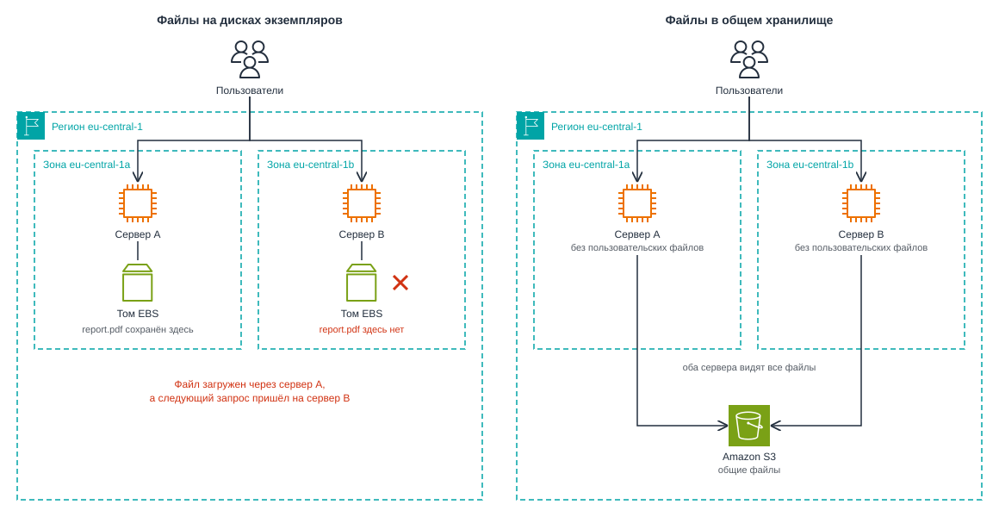
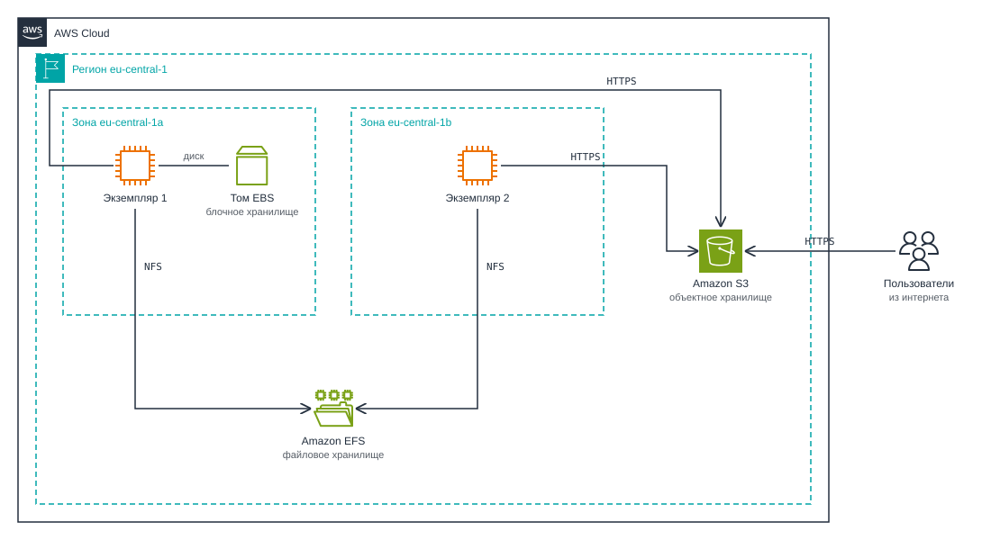
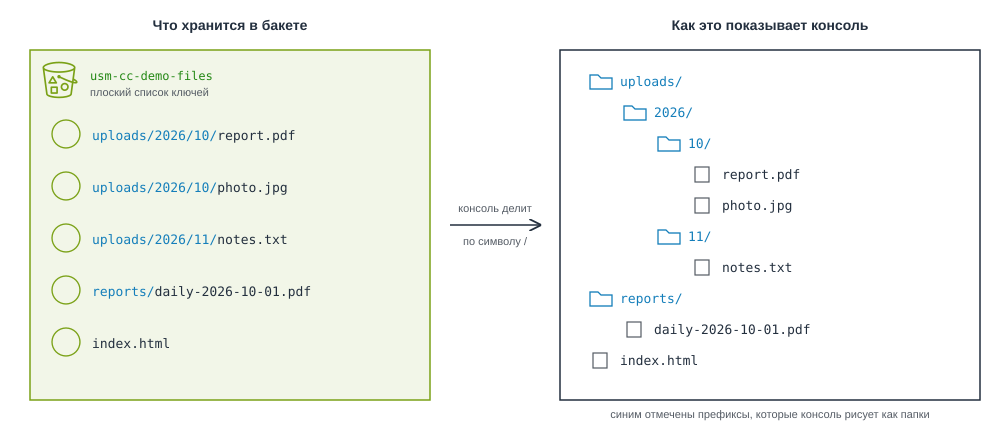
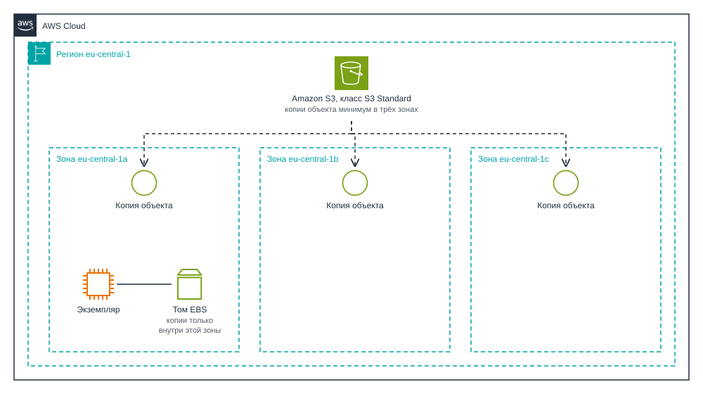
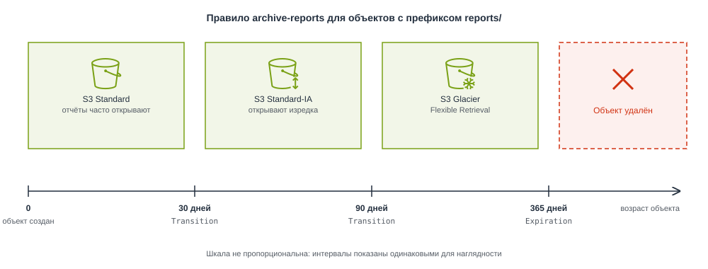
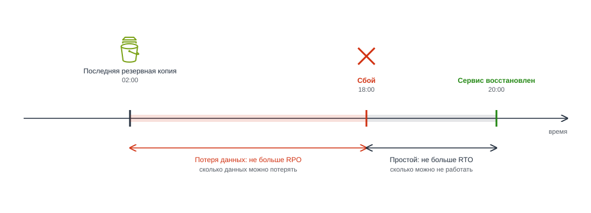
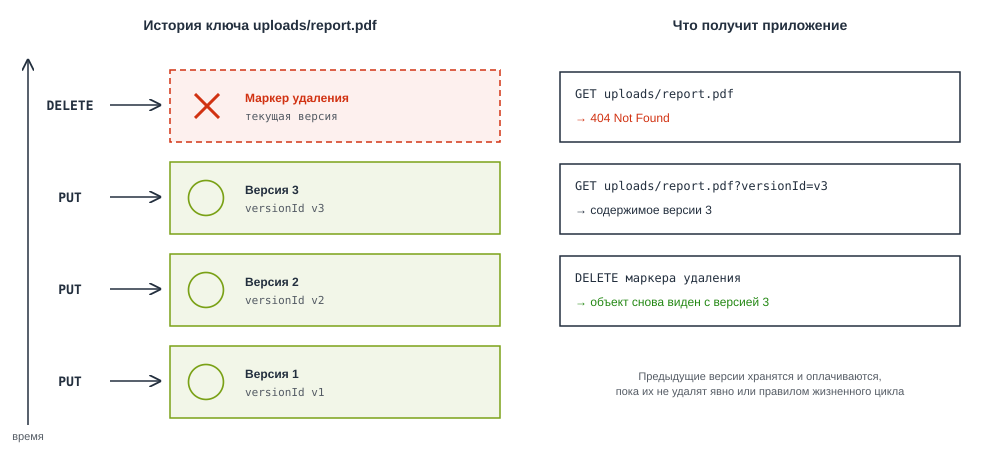
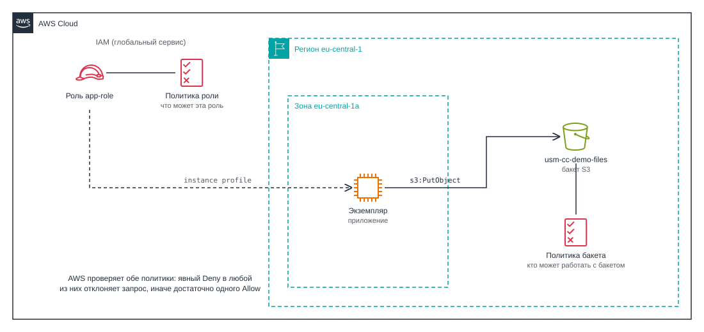
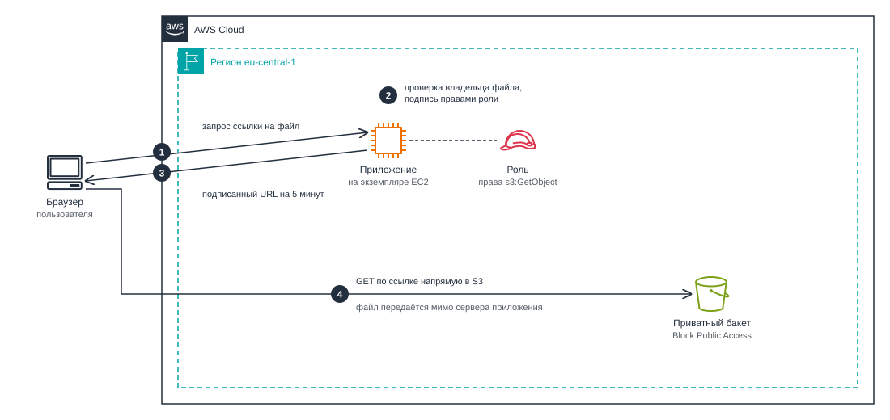

# Облачные хранилища. Amazon S3

## Содержание

- [Облачные хранилища. Amazon S3](#облачные-хранилища-amazon-s3)
  - [Содержание](#содержание)
  - [Вопросы для самопроверки](#вопросы-для-самопроверки)
  - [Результаты обучения](#результаты-обучения)
  - [Ретроспектива](#ретроспектива)
  - [Где живут данные приложения](#где-живут-данные-приложения)
    - [Данные и жизненный цикл экземпляра](#данные-и-жизненный-цикл-экземпляра)
    - [Ограничения диска экземпляра](#ограничения-диска-экземпляра)
    - [Сервер без состояния](#сервер-без-состояния)
  - [Три модели хранения](#три-модели-хранения)
    - [Блочное хранилище](#блочное-хранилище)
    - [Файловое хранилище](#файловое-хранилище)
    - [Объектное хранилище](#объектное-хранилище)
    - [Как выбрать модель](#как-выбрать-модель)
  - [Amazon S3](#amazon-s3)
    - [Бакет, объект и ключ](#бакет-объект-и-ключ)
    - [Папок нет, есть префиксы](#папок-нет-есть-префиксы)
    - [Как работать с S3](#как-работать-с-s3)
  - [Долговечность и доступность (Durability and Availability)](#долговечность-и-доступность-durability-and-availability)
    - [Два разных вопроса к хранилищу](#два-разных-вопроса-к-хранилищу)
    - [Как читать одиннадцать девяток?](#как-читать-одиннадцать-девяток)
    - [Чего долговечность не обещает](#чего-долговечность-не-обещает)
  - [Классы хранения и жизненный цикл данных](#классы-хранения-и-жизненный-цикл-данных)
    - [Из чего складывается цена хранения](#из-чего-складывается-цена-хранения)
    - [Классы хранения S3](#классы-хранения-s3)
    - [Правила жизненного цикла](#правила-жизненного-цикла)
  - [Версионирование, резервные копии и RPO](#версионирование-резервные-копии-и-rpo)
    - [От чего мы защищаем данные](#от-чего-мы-защищаем-данные)
    - [Резервная копия и репликация](#резервная-копия-и-репликация)
    - [RPO и RTO](#rpo-и-rto)
    - [Версионирование в S3](#версионирование-в-s3)
    - [Другие механизмы копирования](#другие-механизмы-копирования)
  - [Структура политики доступа](#структура-политики-доступа)
    - [Бакет по умолчанию закрыт](#бакет-по-умолчанию-закрыт)
    - [Из чего состоит политика](#из-чего-состоит-политика)
    - [Политика роли и политика бакета](#политика-роли-и-политика-бакета)
    - [Как AWS принимает решение](#как-aws-принимает-решение)
  - [Временный доступ к объектам через подписанные URL](#временный-доступ-к-объектам-через-подписанные-url)
    - [Приватный файл для одного пользователя](#приватный-файл-для-одного-пользователя)
    - [Как устроен подписанный URL](#как-устроен-подписанный-url)
    - [Загрузка файлов напрямую в S3](#загрузка-файлов-напрямую-в-s3)
    - [Ограничения и риски](#ограничения-и-риски)
  - [Собираем решения вместе](#собираем-решения-вместе)
  - [Резюме](#резюме)

## Вопросы для самопроверки

1. Почему файлы, которые пользователи загружают в веб-приложение, нельзя надёжно хранить на диске экземпляра EC2, даже если этот диск EBS?
2. Чем блочное, файловое и объектное хранилища отличаются по способу доступа к данным, и для каких задач подходит каждое из них?
3. Что такое бакет, объект и ключ в Amazon S3, и почему в S3 нет настоящих папок?
4. Чем долговечность хранилища отличается от его доступности, и от чего не защищают "одиннадцать девяток"?
5. Как класс хранения и правила жизненного цикла влияют на стоимость хранения данных?
6. Как частота резервного копирования связана с RPO, и чем резервная копия отличается от репликации?
7. Из каких элементов состоит политика доступа, и почему для `s3:ListBucket` и `s3:GetObject` указываются разные ресурсы?
8. Зачем нужны подписанные URL, и чьими правами пользуется человек, который открывает такую ссылку?

## Результаты обучения

1. Объяснить, какие данные переживают перезагрузку, остановку и удаление экземпляра EC2, и спроектировать сервер, который не хранит пользовательские данные на своём диске.
2. Сравнить блочное, файловое и объектное хранилища и выбрать подходящее для конкретной задачи.
3. Объяснить модель данных Amazon S3: бакет, объект, ключ, префикс, метаданные.
4. Различать долговечность и доступность хранилища и объяснить, от каких сбоев защищает каждая из них.
5. Выбрать класс хранения S3 и составить правило жизненного цикла для данных, которые со временем используются всё реже.
6. Определить RPO и RTO для системы и подобрать частоту резервного копирования и механизм защиты данных под заданный RPO.
7. Прочитать и написать политику доступа к S3 с элементами `Effect`, `Action`, `Resource`, `Principal` и `Condition`.
8. Выбрать между публичным доступом, проксированием через сервер и подписанным URL для выдачи файла пользователю.

## Ретроспектива

Эта глава опирается на материал двух предыдущих глав и второй лабораторной работы:

- _Четвёртая глава_. Мы выбирали хранилище для экземпляра EC2 и познакомились с двумя видами дисков. Amazon EBS подключается к экземпляру по сети и живёт независимо от него. Instance store установлен в том же физическом сервере и теряет данные при остановке экземпляра. Там же мы назначили экземпляру роль IAM с готовой политикой `AmazonS3ReadOnlyAccess` и пообещали, что собственные политики с точным списком действий и ресурсов будем писать в главе о хранилищах. Это обещание выполняется здесь.
- _Пятая глава_. Мы построили собственную сеть: публичные и приватные подсети, NAT Gateway, Security Group. Среди способов связать VPC с другими сетями мы упомянули VPC endpoint для Amazon S3, но сам S3 тогда не обсуждали.
- _Вторая лабораторная работа_. Приложение сохраняло загруженные пользователями файлы прямо на диск экземпляра. Для одного учебного сервера это работает.

Глава начинается с вопроса, который возникает следующим: что будет с этими файлами, когда сервер сломается, когда серверов станет два или когда кто-то по ошибке удалит экземпляр.

## Где живут данные приложения

Любое веб-приложение работает с двумя видами данных:

- _Код и конфигурация_. Их можно в любой момент заново взять из репозитория.
- _Данные, созданные пользователями_. Аккаунты, записи в базе, загруженные фотографии и документы. Их взять больше неоткуда, и если они потерялись, то потерялись навсегда.

Поэтому для любого файла, который пишет приложение, полезно задать вопрос: _что должно случиться, чтобы этот файл исчез?_ Ответ зависит от того, где файл лежит.

### Данные и жизненный цикл экземпляра

Вспомним состояния экземпляра из четвёртой главы и посмотрим, что при каждом событии происходит с данными в разных местах сервера[^1].

| Событие                         | Память процесса | Instance store | Корневой том EBS                            | Дополнительный том EBS                 |
| ------------------------------- | --------------- | -------------- | ------------------------------------------- | -------------------------------------- |
| Перезапуск приложения           | Теряется        | Сохраняется    | Сохраняется                                 | Сохраняется                            |
| Перезагрузка (reboot)           | Теряется        | Сохраняется    | Сохраняется                                 | Сохраняется                            |
| Остановка (stop)                | Теряется        | Теряется       | Сохраняется                                 | Сохраняется                            |
| Отказ физического сервера       | Теряется        | Теряется       | Сохраняется                                 | Сохраняется                            |
| Удаление экземпляра (terminate) | Теряется        | Теряется       | По умолчанию удаляется вместе с экземпляром | По умолчанию сохраняется               |
| Отказ зоны доступности          | Теряется        | Теряется       | Недоступен, пока зона не восстановится      | Недоступен, пока зона не восстановится |

### Ограничения диска экземпляра

Допустим, мы учли предупреждение и вынесли файлы на отдельный том EBS. Такой том переживает остановку и удаление экземпляра, но проблему это решает лишь частично. Для приложения том EBS остаётся диском, подключённым к одному серверу, а у диска сервера есть ограничения, которые не зависят от того, насколько он надёжен:

- _Диск находится в одном месте_. Диск и сервер, к которому он подключён, находятся в одной зоне доступности. Для EBS это обязательное условие[^2]. Если зона перестанет работать, диск станет недоступен вместе с сервером.
- _С диском работает один сервер_. Файловая система на диске принадлежит одной операционной системе, поэтому второй сервер не может одновременно с ней работать. В EBS для этого есть исключение, Multi-Attach, но оно работает только для дорогих томов `io1` и `io2`[^3], и приложение должно само согласовывать запись с нескольких машин.
- _Копии диска делает владелец_. AWS хранит данные тома EBS с избыточностью внутри зоны, но снимков сам не делает. Если снимки не настроены, копии нет.
- _Диски выходят из строя_. Для большинства типов томов EBS AWS указывает ожидаемую долю отказов 0,1-0,2% в год[^3]. Для диска это хороший показатель, но он означает, что из тысячи томов за год в среднем один или два могут отказать. Для данных, которые нельзя потерять, одного диска мало.

### Сервер без состояния

Самое неудобное ограничение проявляется, когда серверов становится больше одного. Пусть приложение выросло и работает на двух экземплярах в разных зонах доступности:

1. Пользователь загружает фотографию. Запрос попадает на первый сервер, и файл сохраняется на его диск.
2. Через минуту пользователь открывает страницу с этой фотографией. Запрос попадает на второй сервер.
3. На диске второго сервера фотографии нет, и пользователь видит ошибку.

Можно пытаться синхронизировать каталоги между серверами, но это быстро превращается в собственную распределённую файловую систему со всеми её проблемами. Поэтому в облачных архитектурах действует более простое правило: _сервер не должен хранить ничего, что нельзя потерять_. Такой сервер называют сервером без состояния.

**Сервер без состояния (stateless server)** - сервер, который не хранит на своих дисках пользовательские данные и состояние между запросами. Любой такой сервер можно удалить и заменить новым без потери данных.

Данные при этом никуда не исчезают, они переезжают в отдельные сервисы (или серверы), общие для всех серверов:

- _Записи_. Хранятся в базе данных.
- _Файлы_. Хранятся в отдельном хранилище.



_6.1. Файлы на дисках экземпляров и файлы в общем хранилище_

- _Слева_. Каждый экземпляр хранит свои файлы на своём томе EBS, и второй сервер не видит, что загрузили на первый.
- _Справа_. Оба экземпляра пишут в одно хранилище, которое не принадлежит ни одной зоне доступности. Любой из серверов можно удалить, а новый сразу увидит все файлы.

Остаётся выбрать, каким должно быть это общее хранилище. Для этого нужно понять, какие вообще бывают модели хранения данных.

## Три модели хранения

Из предыдущих глав вы знаете, что между программой и физическим диском есть несколько уровней:

- _Диск_. Читает и записывает блоки по номерам.
- _Файловая система_. Превращает блоки в файлы и каталоги.
- _Программа_. Работает с файлами через системные вызовы `open`, `read`, `write`.

Облачное хранилище выдаёт в виде сервиса один из этих уровней, и от того, какой уровень мы получаем, зависит почти всё остальное.

### Блочное хранилище

**Блочное хранилище (block storage)** - хранилище, которое предоставляет диск в виде последовательности блоков фиксированного размера с номерами. Что лежит в блоках, решает операционная система, которая к этому диску подключена.

Блочное хранилище ничего не знает о файлах. Для него диск это массив блоков, и оно выполняет команды вида "прочитай блок 1532". Файловую систему на этот диск ставит операционная система экземпляра, она же решает, какой файл в каких блоках лежит. Благодаря этому блочный диск можно использовать для чего угодно: для операционной системы, для файлов базы данных, для журнала транзакций.

В AWS блочное хранилище это Amazon EBS, с которым вы уже знакомы. Свойства блочного хранилища следуют из его устройства:

- _Низкая задержка_. Поэтому на блочных дисках работают операционные системы и базы данных.
- _Частичная запись_. Можно изменить несколько байт в середине большого файла, не переписывая файл целиком. Именно так работают базы данных.
- _Один сервер_. Файловая система живёт внутри одной операционной системы, поэтому одновременно с диском может работать только один сервер. Это главная слабая сторона модели.

### Файловое хранилище

**Файловое хранилище (file storage)** - хранилище, которое предоставляет по сети готовую файловую систему с каталогами и файлами. Несколько серверов могут смонтировать её одновременно и работать с одними и теми же файлами.

Здесь файловой системой владеет не экземпляр, а сам сервис хранения. Серверы обращаются к ней по сетевому протоколу. В Linux это чаще всего NFS (Network File System). Для программы на сервере это выглядит как обычный каталог: те же `open`, `read`, `write`, только файлы лежат не на локальном диске.

В AWS файловое хранилище для Linux называется Amazon EFS (Elastic File System). Файловую систему EFS могут одновременно смонтировать многие экземпляры, а в рекомендуемом региональном варианте данные хранятся в нескольких зонах доступности[^4]. Для Windows и специализированных файловых систем у AWS есть семейство сервисов Amazon FSx, но в этом курсе мы их не рассматриваем.

Файловое хранилище решает проблему двух серверов из предыдущего раздела, причём без переписывания приложения: каталог `uploads` просто становится сетевым. Платить за это приходится в двух местах:

- _Задержка_. Она выше, чем у локального диска.
- _Цена за гигабайт_. Она выше, чем у третьей модели.

### Объектное хранилище

Третья модель отказывается от привычной файловой системы совсем.

**Объектное хранилище (object storage)** - хранилище, в котором данные хранятся как отдельные объекты. Каждый объект состоит из:

- самих данных, _например_, содержимого файла,
- набора метаданных, _например_, информации о владельце и дате создания,
- уникального ключа, _например_, имени файла. По этому уникальному ключу объект можно найти в хранилище.

А доступ к объекту выполняется по HTTP-запросу.

Объект можно представить как пару "_ключ и значение_", где ключ это строка, а значение это файл любого размера вместе с описанием. Каталогов, блоков и монтирования нет, работа с хранилищем сводится к HTTP-запросам:

- _Сохранить объект_. Приложение отправляет запрос `PUT` с ключом и содержимым.
- _Прочитать объект_. Приложение отправляет запрос `GET` с тем же ключом.

У такого устройства есть важное ограничение: объект нельзя изменить частично. Нельзя открыть объект и переписать байты с 100-го по 200-й, как в файле на диске. Можно только загрузить объект целиком заново. Для фотографий, документов, видео и резервных копий это не мешает, их и так пишут целиком. Для файлов базы данных это делает объектное хранилище непригодным.

- _Доступ из любого места_. К объектам обращаются по HTTPS.
- _Объём_. Он практически не ограничен.
- _Цена_. Гигабайт стоит заметно дешевле, чем на дисках.

В AWS объектное хранилище это Amazon S3.

### Как выбрать модель

На рисунке 6.2 все три модели показаны в одном регионе.



_6.2. Три модели хранения в AWS: EBS, EFS и S3_

- _Том EBS_. Находится в одной зоне и подключён к одному экземпляру.
- _Файловая система EFS_. Доступна экземплярам из разных зон через точки монтирования.
- _Хранилище S3_. Не привязано ни к одной зоне: к нему по HTTPS обращаются и экземпляры, и пользователи из интернета.

Сведём различия в таблицу.

| Свойство                      | Блочное (Amazon EBS)       | Файловое (Amazon EFS)                 | Объектное (Amazon S3)                            |
| ----------------------------- | -------------------------- | ------------------------------------- | ------------------------------------------------ |
| Единица данных                | Блок                       | Файл в каталоге                       | Объект с ключом и метаданными                    |
| Как обращаются                | Как к локальному диску     | Монтируют по сети (NFS)               | HTTP-запросы через API                           |
| Сколько серверов одновременно | Один                       | Много                                 | Сколько угодно, в том числе браузеры             |
| Частичное изменение данных    | Да                         | Да                                    | Нет, объект перезаписывается целиком             |
| Где хранятся данные           | Одна зона доступности      | Несколько зон (региональный вариант)  | Несколько зон (кроме однозонных классов)         |
| Типичная задача               | Диск ОС, файлы базы данных | Общий каталог для нескольких серверов | Загрузки пользователей, резервные копии, журналы |
| Аналог в Google Cloud         | Persistent Disk, Hyperdisk | Filestore                             | Cloud Storage                                    |

Последняя строка показывает, что модели хранения шире конкретного провайдера. У Google Cloud те же три уровня, и решение "какая модель нужна" принимается до решения "какой сервис взять".

> [!TIP]
> Выбирая хранилище, спросите себя, как программа будет обращаться к данным:
>
> - _Нужен диск, на который можно поставить базу данных_. Это блочное хранилище.
> - _Нескольким серверам нужен общий каталог, а переписывать приложение нельзя_. Это файловое хранилище.
> - _Данные пишутся и читаются целиком, и к ним нужен доступ по сети_. Это объектное хранилище.

Для файлов, которые загружают пользователи веб-приложения, ответ почти всегда объектное хранилище. Дальше в главе мы подробно разберём его на примере Amazon S3.

## Amazon S3

**Amazon S3** это первый публичный сервис AWS: он появился в марте 2006 года, на несколько месяцев раньше EC2[^5]. За двадцать лет он стал хранилищем, на которое опираются многие другие сервисы AWS. Например, снимки томов EBS, о которых пойдёт речь дальше, физически хранятся в S3.

| Характеристика      | Amazon S3                                                                                                                      |
| ------------------- | ------------------------------------------------------------------------------------------------------------------------------ |
| Категория           | Хранение (storage)                                                                                                             |
| Что делает          | Хранит файлы как объекты и отдаёт их по HTTPS-запросам                                                                         |
| Для чего нужен      | Хранить файлы приложений без управления дисками и серверами хранения                                                           |
| Где используют      | Загрузки пользователей, резервные копии, журналы, статические файлы сайтов, данные для анализа                                 |
| Модель обслуживания | IaaS: вы получаете ресурс хранения и сами решаете, что в нём лежит, а дисками и серверами хранения управляет AWS               |
| Область действия    | Региональный: данные хранятся в выбранном регионе и не покидают его, пока вы сами их не скопируете                             |
| Как оплачивается    | Объём хранения в месяц (цена зависит от класса), количество запросов, извлечение данных из холодных классов, трафик в интернет |
| Как работать        | Консоль (раздел S3), команды `aws s3` и `aws s3api`, SDK (для JavaScript пакет `@aws-sdk/client-s3`), прямые HTTPS-запросы     |
| Появился            | Март 2006 года[^5]                                                                                                             |
| Аналоги             | Google Cloud Storage, Azure Blob Storage                                                                                       |

### Бакет, объект и ключ

Модель данных S3 состоит из трёх понятий[^6].

**Бакет (bucket)** - контейнер для объектов в Amazon S3. Бакет создаётся в конкретном регионе, и все объекты бакета хранятся в этом регионе. Можно представить это как папку на диске, в которой хранятся файлы, но с тем отличием, что доступ к ней осуществляется по сети.

**Объект (object)** - единица хранения в S3: содержимое файла вместе с метаданными. Когда говорят об объекте, имеют в виду именно эту комбинацию данных и метаданных.

**Ключ (key)** - уникальное имя объекта внутри бакета. Пара "бакет и ключ" однозначно определяет объект.

Метаданные объекта это набор пар "имя и значение". Их могут записывать как S3, так и само приложение, которое создаёт или изменяет объект:

- _S3_. Сам сохраняет размер, дату изменения, контрольную сумму.
- _Приложение_. Задаёт, например, `Content-Type: image/jpeg`, чтобы браузер понял, что получил картинку.

Размер одного объекта может доходить до десятков терабайт, но одним запросом `PUT` загружается не больше 5 ГБ. Большие файлы загружают частями[^7]. Для учебных задач оба ограничения недостижимы, но знать о них полезно: если когда-нибудь загрузка видеофайла завершится ошибкой, причина может быть в этом.

С именем бакета связана особенность, которая удивляет многих: обычный бакет живёт в одном регионе, но его имя должно быть уникальным среди всех аккаунтов AWS в мире[^8]. Если имя `photos` уже кем-то занято, вы его не получите. Основные правила для имени:

- _Уникальность_. В имя обычно добавляют название проекта, окружение и что-то своё: `usm-cc-demo-files`.
- _Символы_. Только строчные латинские буквы, цифры, точки и дефисы.
- _Длина_. От 3 до 63 символов.

Хотя у AWS есть и второе пространство имён, в котором имя бакета уникально только в пределах аккаунта и региона. Такие имена строятся по шаблону с номером аккаунта и кодом региона на конце[^8]. Это полезно, когда нужно создавать бакеты с одинаковыми именами в разных аккаунтах или регионах. В учебных работах мы будем использовать обычные бакеты, но в документации вы можете встретить оба варианта.

Ещё одно свойство важно для приложений. S3 обеспечивает строгую согласованность чтения после записи: как только запрос на запись объекта завершился успешно, любое следующее чтение получит новую версию[^7]. Приложение может загрузить файл и сразу показать его пользователю, не опасаясь, что хранилище отдаст старую копию.

### Папок нет, есть префиксы

В консоли S3 содержимое бакета выглядит так, будто в нём есть папки. На самом деле внутри бакета нет иерархии, есть плоский список ключей. Ключ `uploads/2026/10/report.pdf` это одна строка, в которой символ `/` ничем не отличается от любой буквы.

**Префикс (prefix)** - начальная часть ключа объекта. Объекты с общим префиксом можно выбрать одним запросом, и консоль S3 показывает их как папку.

Документация S3 прямо говорит, что _префиксы похожи на каталоги, но каталогами не являются_[^9]. На рисунке 6.3 показано, как консоль строит "папки" из ключей.



_6.3. Ключи объектов и префиксы в бакете S3_

Из плоской модели следуют практические выводы:

- _"Пустую папку" создать нельзя_. Когда вы нажимаете в консоли кнопку создания папки, S3 создаёт пустой объект с ключом, оканчивающимся на `/`. Это служебный объект, а не каталог.
- _Переименовать папку нельзя одной операцией_. Чтобы "переименовать" `uploads/` в `files/`, нужно скопировать каждый объект под новым ключом и удалить старый.
- _Префикс удобен для правил_. Правила жизненного цикла и политики доступа, которые мы рассмотрим дальше, можно применить только к объектам с определённым префиксом, например `logs/`.

### Как работать с S3

Как и с EC2, с S3 можно работать через консоль, CLI и SDK. Для S3 в CLI есть две группы команд:

- _`aws s3`_. Команды в стиле файловых утилит Linux: `mb`, `cp`, `ls`.
- _`aws s3api`_. Команды, которые повторяют операции API один к одному.

```bash
# Создать бакет во Франкфурте
aws s3 mb s3://usm-cc-demo-files --region eu-central-1

# Загрузить файл под ключом uploads/report.pdf
aws s3 cp report.pdf s3://usm-cc-demo-files/uploads/report.pdf

# Показать объекты с префиксом uploads/
aws s3 ls s3://usm-cc-demo-files/uploads/
```

Из приложения на Node.js с S3 работают через AWS SDK. Ниже загрузка файла в бакет:

```javascript
import { S3Client, PutObjectCommand } from "@aws-sdk/client-s3";
import { readFile } from "node:fs/promises";

const s3 = new S3Client({ region: "eu-central-1" });

await s3.send(
  new PutObjectCommand({
    Bucket: "usm-cc-demo-files",
    Key: "uploads/2026/10/report.pdf",
    Body: await readFile("report.pdf"),
    ContentType: "application/pdf",
  }),
);
```

Обратите внимание, чего в коде нет: ключей доступа. Если код работает на экземпляре EC2 с ролью IAM, SDK сам получит временные учётные данные через Instance Metadata Service, как мы разбирали в четвёртой главе. Какие действия с бакетом разрешены этой роли, определяет её политика. К политикам мы вернёмся после того, как разберёмся, насколько надёжно S3 хранит данные.

> [!NOTE]
> Если экземпляр находится в приватной подсети без NAT Gateway, запросы к S3 не дойдут до сервиса.

> [_Hands-on 6.1. Первый бакет._](hands_on_01.md) Создание бакета в консоли и проверка его настроек по умолчанию: Block Public Access и отключённые ACL. Загрузка файлов через консоль под ключами с префиксами, просмотр "папок" и метаданных объекта. Попытка открыть объект по его URL в браузере и разбор полученного отказа в доступе.

## Долговечность и доступность (Durability and Availability)

### Два разных вопроса к хранилищу

О надёжности хранилища задают два разных вопроса:

- _Не потеряются ли мои данные?_
- _Смогу ли я прочитать их прямо сейчас?_

Ответы на них описываются разными показателями.

**Долговечность (durability)** - вероятность того, что сохранённые данные не будут потеряны за заданный период, обычно за год.

**Доступность (availability)** - доля времени, в течение которой к данным можно обратиться. Это тот самый показатель, который фиксирует SLA из первой главы.

Разницу видно на двух ситуациях:

- _В зоне доступности на час пропало электричество_. Объекты в ней на этот час недоступны, но не потерялись: после восстановления питания всё на месте. Пострадала доступность, долговечность нет.
- _Сгорел диск с единственной копией файла_. Даже если хранилище после этого работает без перерывов, файл не вернётся. Пострадала долговечность.

Для S3 Standard AWS приводит три числа:

- _Долговечность 99,999999999% в год_[^10]. Это число принято называть "одиннадцать девяток" (eleven nines).
- _Доступность 99,99% в год_[^10]. Это цель, под которую спроектирован сервис.
- _Доступность 99,9% в месяц по SLA_[^11]. Это уровень, ниже которого провайдер выплачивает компенсацию.

### Как читать одиннадцать девяток?

Число `99,999999999%` само по себе ничего не говорит, поэтому переведём его в понятные величины. Долговечность в одиннадцать девяток означает, что вероятность потерять конкретный объект за год составляет `0,000000001%`, то есть `10⁻¹¹`.

Если хранить 10 миллионов объектов, ожидаемое число потерянных за год равно `10⁷ × 10⁻¹¹ = 10⁻⁴`. Иначе говоря, в среднем _один объект за 10 000 лет_.

Для сравнения: у тома EBS доля отказов 0,1-0,2% в год. Это не значит, что EBS плохой. Это значит, что диск и объектное хранилище спроектированы для разных задач.

Разница объясняется тем, где хранятся копии:

- _S3_. Каждый объект хранится на нескольких устройствах как минимум в трёх зонах доступности региона. S3 регулярно сверяет контрольные суммы и, обнаружив потерянную копию, быстро восстанавливает её из остальных[^10].
- _EBS_. Том хранится с избыточностью внутри одной зоны.

Рисунок 6.4 показывает это различие.



_6.4. Копии данных тома EBS находятся в одной зоне, копии объекта S3 распределены по зонам региона_

Здесь же видна связь с доступностью. Когда отказывает зона `eu-central-1a`, том EBS становится недоступен, а объект S3 продолжает читаться из копий в двух других зонах.

> [!NOTE]
>
> Не все классы хранения S3 используют три зоны. Однозонные классы, о которых пойдёт речь в следующем разделе, хранят данные в одной зоне доступности. Их долговечность к отказам оборудования по-прежнему высокая, но при потере всей зоны данные в ней будут потеряны.

### Чего долговечность не обещает

Одиннадцать девяток описывают защиту от отказов оборудования, но не от действий тех, кто работает с данными:

- _Ошибка в коде_. Если приложение перезапишет все фотографии пустыми файлами, S3 с той же долговечностью сохранит пустые файлы.
- _Ошибка администратора_. Команда `aws s3 rm s3://bucket --recursive` без задержек удалит все объекты сразу во всех трёх зонах.

Хранилище выполняет команды, и копии в разных зонах здесь не помогают: команда применяется ко всем копиям.

> [!IMPORTANT]
> Высокая долговечность не заменяет резервное копирование. Долговечность защищает данные от поломок хранилища. От ошибок людей и программ защищают версионирование и резервные копии, которые мы рассмотрим чуть позже.

## Классы хранения и жизненный цикл данных

### Из чего складывается цена хранения

Данные со временем "_остывают_", то есть к ним обращаются всё реже:

- _Фотография в новостной ленте_. Её открывают сотни раз в первый день, десятки раз в первую неделю и почти никогда через год.
- _Журналы работы сервера_. Они нужны в первые дни для поиска ошибок, а потом их хранят месяцами на случай проверки.

Платить за редко используемые данные столько же, сколько за горячие, невыгодно.

Чтобы понять, где можно сэкономить, нужно знать, из чего складывается счёт за S3:

- _Хранение_. Плата за объём данных в месяц.
- _Запросы_. Плата за каждую операцию `PUT`, `GET`, `LIST` и другие.
- _Извлечение_. В холодных классах дополнительно платят за каждый прочитанный гигабайт.
- _Минимальный срок хранения_. В холодных классах объект оплачивается не меньше определённого числа дней, даже если его удалили раньше.
- _Передача данных_. Отдача данных в интернет оплачивается отдельно.

Классы хранения перераспределяют эти составляющие: чем холоднее класс, тем дешевле хранение и тем дороже обращение к данным.

**Класс хранения (storage class)** - параметр объекта S3, который определяет, как объект хранится, как быстро его можно прочитать и как формируется плата за хранение и доступ.

Класс задаётся для каждого объекта отдельно, поэтому в одном бакете могут лежать объекты разных классов.

### Классы хранения S3

Основные классы перечислены в таблице[^12]. Аббревиатура IA в названиях означает infrequent access, редкий доступ. Цены меняются и зависят от региона, поэтому в таблице их нет. Важнее понять соотношения.

| Класс                         | Зон доступности | Скорость чтения   | Минимальный срок | Плата за извлечение | Когда подходит                                                      |
| ----------------------------- | --------------- | ----------------- | ---------------- | ------------------- | ------------------------------------------------------------------- |
| S3 Standard                   | 3 и более       | Миллисекунды      | Нет              | Нет                 | Данные, к которым обращаются часто. Класс по умолчанию              |
| S3 Intelligent-Tiering        | 3 и более       | Миллисекунды      | Нет              | Нет                 | Характер доступа неизвестен или меняется                            |
| S3 Standard-IA                | 3 и более       | Миллисекунды      | 30 дней          | Да                  | Редкий доступ, но читать нужно сразу                                |
| S3 One Zone-IA                | 1               | Миллисекунды      | 30 дней          | Да                  | Редкий доступ к данным, которые можно восстановить из другого места |
| S3 Glacier Instant Retrieval  | 3 и более       | Миллисекунды      | 90 дней          | Да                  | Архив, к которому обращаются примерно раз в квартал                 |
| S3 Glacier Flexible Retrieval | 3 и более       | От минут до часов | 90 дней          | Да                  | Архив, который можно ждать                                          |
| S3 Glacier Deep Archive       | 3 и более       | Часы              | 180 дней         | Да                  | Данные, которые хранят годами и почти никогда не читают             |

Все перечисленные классы, кроме однозонного, спроектированы на ту же долговечность в одиннадцать девяток. Различаются они доступностью, скоростью чтения и ценой.

Отдельно стоит _S3 Intelligent-Tiering_. Он сам следит, как часто читают каждый объект, и переносит его между уровнями хранения внутри класса. Платы за извлечение нет, зато есть небольшая плата за наблюдение за каждым объектом. Этот класс разумен, когда вы не знаете заранее, как будут использоваться данные.

> [!NOTE]
> На противоположном конце шкалы находится класс S3 Express One Zone для задач, где нужна очень низкая задержка. Он хранит данные в одной зоне и использует особый тип бакетов. В этом курсе он не понадобится.

У Google Cloud Storage та же идея: классы Standard, Nearline, Coldline и Archive с минимальными сроками хранения 30, 90 и 365 дней для трёх холодных классов[^13]. Названия разные, компромисс одинаковый.

> [!WARNING]
> Холодный класс не всегда дешевле. Если объект в Standard-IA читают каждый день, плата за извлечение быстро превысит экономию на хранении. Если объект удалить через неделю после переноса в Glacier Flexible Retrieval, всё равно придётся заплатить за 90 дней. Класс выбирают по реальному характеру доступа, а не по принципу "чем холоднее, тем лучше".

### Правила жизненного цикла

Переносить объекты между классами вручную неудобно. Для этого есть правила жизненного цикла.

**Правило жизненного цикла (lifecycle rule)** - правило бакета S3, которое по возрасту объекта автоматически переводит его в другой класс хранения или удаляет.

Правило состоит из фильтра и действий. Фильтр определяет, к каким объектам применяется правило, чаще всего по префиксу. Действий два вида:

- _Переход (transition)_. Через заданное число дней после создания объект переводится в другой класс.
- _Истечение срока (expiration)_. Через заданное число дней объект удаляется.

Рассмотрим учебный сценарий. Сервис формирует ежедневные отчёты в формате PDF, и интерес к ним со временем падает:

- _Первый месяц_. Отчёты часто открывают.
- _Второй и третий месяцы_. Открывают изредка.
- _После трёх месяцев_. Почти никогда.
- _Через год_. Отчёты больше не нужны.

Правила жизненного цикла для этого сценария могут быть такими:

1. _На 30-й день_ переходит в Standard-IA.
2. _На 90-й день_ переходит в Glacier Flexible Retrieval.
3. _На 365-й день_ удаляется.

Это можно описать с помощью JSON:

```json
{
  "Rules": [
    {
      "ID": "archive-reports",
      "Filter": { "Prefix": "reports/" },
      "Status": "Enabled",
      "Transitions": [
        { "Days": 30, "StorageClass": "STANDARD_IA" },
        { "Days": 90, "StorageClass": "GLACIER" }
      ],
      "Expiration": { "Days": 365 }
    }
  ]
}
```

Фильтр `Prefix` применяет правило только к объектам с префиксом `reports/`. В API класс Glacier Flexible Retrieval называется `GLACIER`.

Минимальные сроки соблюдены: в Standard-IA объект пробудет 60 дней при минимуме 30, в Glacier 275 дней при минимуме 90. На рисунке 6.5 этот путь показан на временной оси.



_6.5. Путь объекта по классам хранения под действием правила жизненного цикла_

Правило загружается в бакет командой:

```bash
aws s3api put-bucket-lifecycle-configuration \
  --bucket usm-cc-demo-files \
  --lifecycle-configuration file://lifecycle.json
```

При составлении правил стоит помнить о нескольких ограничениях[^14]:

- _Переходы идут только в сторону более холодных классов_. Из Glacier Deep Archive правило жизненного цикла объект уже никуда не перенесёт.
- _Маленькие объекты по умолчанию не переносятся_. Объекты меньше 128 КБ правила жизненного цикла не трогают, потому что экономии на них не будет.
- _Каждый переход в классы Glacier оплачивается как запрос_. Перенос миллиона мелких объектов может стоить дороже, чем их хранение.

## Версионирование, резервные копии и RPO

### От чего мы защищаем данные

В разделе о долговечности мы выяснили, что копии в разных зонах защищают только от отказов оборудования. Чтобы выбрать защиту, нужно сначала перечислить угрозы. Для данных приложения их обычно пять:

- _Отказ оборудования_. Сгорел диск, отказал сервер, пропало питание в зоне.
- _Ошибка человека_. Администратор удалил не тот бакет или перезаписал не тот файл.
- _Ошибка программы_. Новая версия приложения из-за бага испортила данные.
- _Злонамеренные действия_. Кто-то получил доступ к ключам и удаляет или шифрует данные.
- _Отказ региона_. Редкое, но возможное событие, при котором недоступен весь регион.

От первой угрозы S3 защищает сам. От остальных защищают механизмы, которые вы включаете и настраиваете.

### Резервная копия и репликация

Два основных способа получить вторую копию данных устроены по-разному, и их часто путают.

**Резервная копия (backup)** - копия данных на определённый момент времени, которая хранится отдельно от оригинала и позволяет вернуть данные в состояние на этот момент.

**Репликация (replication)** - непрерывное копирование изменений из одного хранилища в другое, при котором копия повторяет текущее состояние оригинала.

Различаются они отношением ко времени:

- _Репликация показывает "сейчас"_. Если в оригинале файл испортили, через секунды испорченная версия окажется и в копии. Поэтому репликация хорошо защищает от отказа оборудования или региона, но не от ошибок людей и программ.
- _Резервная копия хранит "тогда"_. Испорченный сегодня файл в копии за вчерашний день остался целым. Поэтому резервная копия защищает от ошибок, но возвращает данные только на момент своего создания.

### RPO и RTO

Сколько данных допустимо потерять и как долго система может не работать, решает не инженер, а бизнес.
Эти решения формулируют через два показателя[^15].

**RPO (recovery point objective)** - максимально допустимый промежуток времени между последней точкой восстановления данных и моментом сбоя. Иначе говоря, за какой период данные можно потерять. Например, если RPO равен 1 часу, то при сбое можно потерять не более одного часа данных.

**RTO (recovery time objective)** - максимально допустимое время между прерыванием работы сервиса и его восстановлением. Иначе говоря, как долго система может не работать. На рисунке 6.6 это время показано как интервал между моментом сбоя и моментом восстановления.



_6.6. RPO и RTO на временной оси_

RPO отсчитывается назад от момента сбоя, RTO вперёд. Всё, что было записано после последней резервной копии, при восстановлении из неё будет потеряно.

Отсюда прямая связь между частотой резервного копирования и RPO. Пусть копия тома делается каждую ночь в 02:00:

- _Сбой в 18:00_. При восстановлении из ночной копии теряется всё, что было записано за 16 часов.
- _Сбой в 01:59_. Следующая копия ещё не создана, и теряется почти 24 часа.

На рисунке 6.6 оба показателя отложены на временной оси.

Значит, ежедневное копирование обеспечивает RPO не лучше 24 часов. Если бизнес готов потерять не больше часа данных, копировать придётся не реже раза в час или использовать механизм, который сохраняет каждое изменение.

RTO зависит от другого: сколько времени займёт восстановление. И здесь снова появляются классы хранения из предыдущего раздела. Если резервные копии лежат в Glacier Deep Archive, само извлечение данных займёт часы. С таким хранилищем RTO в 30 минут недостижим, каким бы быстрым ни был остальной процесс.

> [!TIP]
>
> Меньшие RPO и RTO стоят дороже: чаще копии, больше хранилища, быстрее классы, больше автоматизации. Поэтому сначала спросите, сколько данных и времени система действительно может потерять, и только потом выбирайте механизм. Учебному сайту расписания хватит RPO в сутки, платёжной системе не хватит и минуты.

### Версионирование в S3

Для объектов S3 есть механизм, который защищает от случайной потери данных.

**Версионирование (versioning)** - режим бакета S3, при котором каждая перезапись или удаление объекта создаёт новую версию, а предыдущие версии сохраняются и могут быть восстановлены.

В бакете с включённым версионированием у каждой версии объекта есть свой идентификатор, `version ID`, а операции записи работают иначе:

- _Перезапись_. Когда приложение загружает объект с уже существующим ключом, старое содержимое не исчезает, а становится предыдущей версией.
- _Удаление_. Обычный запрос `DELETE` ничего не стирает, а добавляет к объекту специальную пометку.

**Маркер удаления (delete marker)** - особая версия объекта, которая делает объект невидимым для обычных запросов, но оставляет все предыдущие версии в бакете.

Что происходит с объектом, у которого есть маркер удаления:

- _Чтение по ключу_. Объект выглядит удалённым: `GET` вернёт ошибку "не найден".
- _Удаление маркера_. Объект снова становится видимым с последней версией.
- _Удаление версии по идентификатору_. Только так версия удаляется по-настоящему[^16].

Рисунок 6.7 показывает историю одного объекта.



_6.7. История версий объекта в бакете с версионированием_

У бакета три состояния версионирования[^16]:

- _Не включено_. Состояние по умолчанию.
- _Включено_. Перезапись и удаление создают новые версии.
- _Приостановлено_. Новые версии не создаются, а уже созданные сохраняются. Включённое версионирование нельзя выключить совсем, его можно только приостановить.

Объекты, которые лежали в бакете до включения версионирования, получают версию с идентификатором `null`.

_У версионирования есть цена_: каждая версия хранится и оплачивается как полноценный объект. Если приложение перезаписывает файл размером 10 МБ раз в час, за месяц накопится около 7 ГБ старых версий. Поэтому версионирование почти всегда сочетают с правилом жизненного цикла, которое удаляет старые версии, например, через 30 дней после того, как они перестали быть текущими. Включить версионирование, восстановить удалённый объект и настроить такое правило вы сможете в Hands-on 6.2.

### Другие механизмы копирования

Версионирование работает внутри одного бакета, а значит, внутри одного региона. Для остальных угроз у AWS есть другие механизмы, которые мы упомянем кратко.

- _Снимки EBS_. **Снимок (snapshot)** - копия тома EBS на определённый момент времени. Снимки инкрементальные: каждый следующий сохраняет только блоки, изменившиеся после предыдущего. Хранятся снимки в S3 и доступны во всех зонах региона, поэтому из снимка можно создать том в любой зоне[^17]. AWS не делает снимки томов автоматически, их нужно создавать самим или настроить расписание.
- _Репликация S3_. Бакет можно настроить так, чтобы новые объекты автоматически копировались в другой бакет, в том же регионе или в другом[^18]. Для этого версионирование должно быть включено в обоих бакетах. Репликация в другой регион защищает от отказа региона, но, как любая репликация, переносит и ошибки.
- _AWS Backup_. Сервис, который централизованно создаёт резервные копии разных ресурсов, в том числе томов EBS и бакетов S3, по общему расписанию и с общими правилами хранения[^19].

Сведём угрозы и механизмы в одну таблицу.

| Угроза                        | Долговечность S3 | Версионирование | Репликация в другой регион | Резервная копия в отдельном аккаунте |
| ----------------------------- | ---------------- | --------------- | -------------------------- | ------------------------------------ |
| Отказ оборудования            | Да               | Не нужно        | Да                         | Да                                   |
| Ошибка человека или программы | Нет              | Да              | Нет, ошибка реплицируется  | Да                                   |
| Удаление с правами на версии  | Нет              | Нет             | Нет                        | Да                                   |
| Отказ региона                 | Нет              | Нет             | Да                         | Да, если копия в другом регионе      |

## Структура политики доступа

Мы разобрались, где и как хранить данные. Остался вопрос, который для хранилища не менее важен: кто может эти данные читать и изменять.

### Бакет по умолчанию закрыт

Новый бакет S3 закрыт для всех, кроме аккаунта-владельца. За это отвечают три настройки по умолчанию:

- _Неявный запрет_. Доступ есть только у тех пользователей и ролей вашего аккаунта, которым его явно разрешили политиками, и ни у кого извне.
- _Block Public Access_. Защита, которая запрещает делать бакет и объекты публичными, даже если кто-то попытается это разрешить. Для каждого нового бакета она включена[^20].
- _Отключённые ACL_. Списки доступа на уровне отдельных объектов (ACL) встречаются в старых материалах, но в новых бакетах они отключены, и AWS рекомендует их не включать[^21].

В результате доступ к бакету управляется только политиками.

> [!WARNING]
> Выключать Block Public Access ради того, чтобы "картинки открывались", не нужно. Если файл должен увидеть один пользователь, для этого есть подписанные URL. Если файлы должен видеть весь интернет, их обычно раздают через CDN, а не открывая бакет напрямую.

### Из чего состоит политика

В третьей главе мы определили политику как документ, где перечислено, какие действия с какими ресурсами разрешены или запрещены. Теперь разберём, как этот документ устроен. Вот политика для роли экземпляра, которая разрешает приложению видеть список файлов в бакете, а также читать и записывать файлы с префиксом `uploads/`:

```json
{
  "Version": "2012-10-17",
  "Statement": [
    {
      "Effect": "Allow",
      "Action": "s3:ListBucket",
      "Resource": "arn:aws:s3:::usm-cc-demo-files"
    },
    {
      "Effect": "Allow",
      "Action": ["s3:GetObject", "s3:PutObject"],
      "Resource": "arn:aws:s3:::usm-cc-demo-files/uploads/*"
    }
  ]
}
```

Политика это JSON-документ с двумя полями верхнего уровня[^22]:

- _`Version`_. Версия языка политик. Значение `2012-10-17` это не дата вашей политики, а актуальная версия синтаксиса. Её пишут всегда.
- _`Statement`_. Список правил.

**Правило политики (statement)** - часть политики, которая описывает одно решение: какие действия с какими ресурсами разрешить или запретить.

Каждое правило отвечает на три вопроса. В таблице они разобраны на примере второго правила:

| Элемент    | Вопрос                   | Значение во втором правиле                                        |
| ---------- | ------------------------ | ----------------------------------------------------------------- |
| `Effect`   | Разрешить или запретить? | `Allow`, разрешить. Для запрета пишут `Deny`                      |
| `Action`   | Какие операции?          | `s3:GetObject` (чтение объекта) и `s3:PutObject` (запись объекта) |
| `Resource` | С какими ресурсами?      | ARN всех объектов, ключ которых начинается с `uploads/`           |

Символ `*` в ARN заменяет любую последовательность символов, поэтому `uploads/*` означает "все объекты с префиксом `uploads/`".

Прочитаем политику целиком: _разрешить видеть список объектов бакета `usm-cc-demo-files`, а также читать и записывать объекты с префиксом `uploads/`_. Всё, что не разрешено, запрещено: эта роль не сможет удалить объект, прочитать объект из `reports/` или работать с другим бакетом. Это принцип наименьших привилегий из третьей главы.

> [!IMPORTANT]
>
> В политике два правила, потому что в S3 бакет и объекты в нём это разные ресурсы с разными ARN. Список объектов (`s3:ListBucket`) это операция над бакетом, поэтому её указывают с ARN бакета, без `/*` на конце. Чтение и запись (`s3:GetObject`, `s3:PutObject`) это операции над объектами, их указывают с ARN вида `arn:aws:s3:::имя-бакета/*`. Если перепутать ARN, правило не сработает, и команда `aws s3 ls` получит отказ в доступе. Это самая частая ошибка в первых политиках для S3.

> [!WARNING]
>
> Записи вида `"Action": "s3:*"` и `"Resource": "*"` удобны, потому что "всё работает". Но такая политика разрешает в том числе удалить любой бакет аккаунта. Именно избыточные права роли превратили атаку на Capital One, которую мы разбирали в четвёртой главе, в утечку данных из сотен бакетов.

### Политика роли и политика бакета

Политику, которую мы только что написали, прикрепляют к роли. Она отвечает на вопрос "_что может эта роль?_". В третьей главе мы упоминали, что политику можно прикрепить и к самому ресурсу.

**Политика бакета (bucket policy)** - политика ресурса, прикреплённая к бакету S3. Она отвечает на вопрос "кто и что может делать с этим бакетом?".

Раз политика прикреплена к бакету, в правиле нужно указать, к кому оно относится. Поэтому в правилах политики бакета появляются ещё два элемента:

- _`Principal`_. Кому адресовано правило: пользователю, роли, сервису AWS или всем (`"*"`). Этот элемент вы уже видели в политике доверия роли в четвёртой главе.
- _`Condition`_. Необязательное условие, при котором правило действует, например протокол запроса или IP-адрес.

Типичный пример политики бакета запрещает обращения без шифрования, то есть по HTTP вместо HTTPS[^23]:

```json
{
  "Version": "2012-10-17",
  "Statement": [
    {
      "Effect": "Deny",
      "Principal": "*",
      "Action": "s3:*",
      "Resource": [
        "arn:aws:s3:::usm-cc-demo-files",
        "arn:aws:s3:::usm-cc-demo-files/*"
      ],
      "Condition": {
        "Bool": { "aws:SecureTransport": "false" }
      }
    }
  ]
}
```

Правило читается так: _запретить (`Deny`) всем (`"*"`) любые действия (`s3:*`) с бакетом и его объектами, если запрос пришёл не по HTTPS (`aws:SecureTransport` равно `false`)_. В `Resource` указаны оба ARN, чтобы запрет действовал и на бакет, и на объекты. `"Principal": "*"` здесь не открывает бакет всему миру: правило запрещающее и никому ничего не разрешает.

На рисунке 6.8 показано, где хранится каждая из двух политик.



_6.8. Политика роли прикреплена к тому, кто действует, политика бакета к ресурсу_

В пределах одного аккаунта выбор между ними обычно такой:

- _Политика роли_. В ней удобнее описывать права приложения: всё, что разрешено роли, видно в одном месте.
- _Политика бакета_. Нужна для правил, которые должны действовать для всех, кто обращается к бакету, независимо от их собственных политик. Запрет HTTP как раз такой случай.

### Как AWS принимает решение

Когда к бакету приходит запрос, AWS проверяет все политики, которые к нему относятся, в таком порядке[^24]:

1. _Есть явный запрет_. Если хотя бы одно правило с `Deny` подходит к запросу, запрос отклоняется, и никакое разрешение это не перекроет.
2. _Есть разрешение_. Если хотя бы одно правило с `Allow` подходит к запросу, запрос разрешается. В пределах одного аккаунта достаточно разрешения либо в политике роли, либо в политике бакета.
3. _Иначе запрет_. Это неявный запрет, тот самый "по умолчанию запрещено всё" из третьей главы.

Например, приложение с нашей ролью загружает файл в `uploads/` по HTTPS, и запрос выполняется: запрета нет, политика роли разрешает `s3:PutObject`. Тот же запрос по HTTP отклоняется уже на первом шаге из-за запрета в политике бакета, и разрешение в политике роли не помогает.

> [_Hands-on 6.2. Защита и жизненный цикл данных._](hands_on_02.md) Включение версионирования, перезапись и удаление объекта, восстановление удалённого объекта через маркер удаления.

## Временный доступ к объектам через подписанные URL

### Приватный файл для одного пользователя

Вернёмся к загрузкам пользователей. Бакет закрыт, файлы в нём может читать только роль приложения. Пользователь хочет скачать документ, который загрузил вчера. Как отдать ему этот файл?

Есть три варианта:

- _Сделать файл публичным_. Тогда его сможет скачать любой, кто узнает адрес. Для личных документов это недопустимо, да и Block Public Access этого не позволит.
- _Отдавать файл через приложение_. Приложение проверяет, что пользователь имеет право на файл, само читает его из S3 и передаёт пользователю. Это безопасно, но каждый скачиваемый мегабайт проходит через сервер: он занимает память, сеть и время сервера. Для видео размером в гигабайт это заметная нагрузка.
- _Выдать временную ссылку_. Приложение проверяет права пользователя и выдаёт ему ссылку, по которой браузер скачает файл напрямую из S3. Ссылка работает несколько минут и только для этого файла.

Третий вариант объединяет плюсы первых двух: решение о доступе принимает приложение, а данные передаёт S3.

**Подписанный URL (presigned URL)** - ссылка на одну операцию с одним объектом S3, в которую встроены подпись и срок действия. Любой, у кого есть такая ссылка, может выполнить эту операцию до истечения срока.

### Как устроен подписанный URL

Подписанный URL создаётся без обращения к S3. SDK на сервере берёт учётные данные приложения и вычисляет криптографическую подпись от параметров запроса: метода, бакета, ключа, времени создания и срока действия. Подпись и параметры добавляются к адресу объекта. Получается ссылка такого вида (длинные значения сокращены):

```text
https://usm-cc-demo-files.s3.eu-central-1.amazonaws.com/uploads/report.pdf
  ?X-Amz-Algorithm=AWS4-HMAC-SHA256
  &X-Amz-Credential=ASIA...%2F20261005%2Feu-central-1%2Fs3%2Faws4_request
  &X-Amz-Date=20261005T120000Z
  &X-Amz-Expires=300
  &X-Amz-Security-Token=IQoJb3JpZ2lu...
  &X-Amz-SignedHeaders=host
  &X-Amz-Signature=5f1c...
```

Когда браузер открывает ссылку, S3 проверяет две вещи:

- _Подпись_. S3 заново вычисляет подпись по тем же параметрам и сравнивает. Если хоть один параметр изменён, например ключ объекта, подпись не совпадёт, и запрос будет отклонён.
- _Срок_. Если время `X-Amz-Expires` (в секундах) истекло, запрос тоже отклоняется.

Секретный ключ при этом никуда не передаётся: в ссылке есть только идентификатор учётных данных и подпись.

Самое важное свойство подписанного URL: он действует от имени того, кто его создал, и с его правами[^25]. S3 проверяет запрос по ссылке так, будто его отправила роль приложения. Если у роли нет права `s3:GetObject` на этот объект, подписанная ею ссылка тоже не будет работать.

Весь процесс показан на рисунке 6.9.



_6.9. Скачивание приватного файла по подписанному URL_

1. Пользователь запрашивает у приложения ссылку на свой файл.
2. Приложение проверяет, что файл принадлежит этому пользователю, и создаёт подписанный URL с правами своей роли.
3. Приложение возвращает ссылку пользователю.
4. Браузер скачивает файл напрямую из S3.

В Node.js подписанные URL создаёт отдельный пакет `@aws-sdk/s3-request-presigner`:

```javascript
import { S3Client, GetObjectCommand } from "@aws-sdk/client-s3";
import { getSignedUrl } from "@aws-sdk/s3-request-presigner";

const s3 = new S3Client({ region: "eu-central-1" });

export async function createDownloadLink(key) {
  const command = new GetObjectCommand({
    Bucket: "usm-cc-demo-files",
    Key: key,
  });
  return getSignedUrl(s3, command, { expiresIn: 300 }); // 5 минут
}
```

Функция ничего не скачивает и не обращается к S3, она только формирует ссылку. Проверка того, что пользователь имеет право на этот `key`, должна выполняться до вызова функции: S3 об этом ничего не знает, он проверяет только права роли.

### Загрузка файлов напрямую в S3

Подписать можно не только чтение, но и запись. Если вместо `GetObjectCommand` передать в `getSignedUrl` команду `PutObjectCommand`, получится ссылка, по которой браузер загрузит файл в S3 запросом `PUT`, минуя сервер приложения. Для больших файлов это заметно разгружает сервер.

У такой схемы есть две особенности:

- _Ключ объекта выбирает приложение, а не пользователь_. Иначе пользователь мог бы перезаписать чужой файл.
- _Бакету нужна настройка CORS_. Браузер отправляет запрос из JavaScript на другой домен, поэтому у бакета должны быть правила CORS (cross-origin resource sharing), которые разрешают страницам вашего сайта обращаться к бакету из браузера.

Подробно загрузку из браузера вы будете настраивать в лабораторной работе.

### Ограничения и риски

- _Срок действия ограничен_. Ссылка, созданная через CLI или SDK, может действовать не больше 7 дней, созданная в консоли не больше 12 часов[^25].
- _Срок не больше срока учётных данных_. Роль экземпляра получает временные учётные данные, которые истекают через несколько часов. Ссылка, подписанная ими, перестанет работать, когда истекут эти учётные данные, даже если в `expiresIn` указан больший срок.
- _Ссылку можно использовать повторно_. Пока срок не истёк, по ссылке можно обратиться сколько угодно раз, и сделать это может любой, к кому она попала. Ссылка, отправленная в общий чат или записанная в журнал сервера, фактически становится публичной на время своего действия.
- _Отозвать одну ссылку нельзя_. Можно только лишить прав того, кто её подписал, но тогда перестанут работать все его ссылки.

> [!TIP]
> Выбирайте срок действия ссылки по задаче. Для скачивания файла, которое начинается сразу после нажатия кнопки, достаточно нескольких минут. Ссылки на неделю обычно означают, что на самом деле нужен другой механизм доступа.

> [_Hands-on 6.3. Подписанные URL._](hands_on_03.md) Создание подписанной ссылки на приватный объект через CLI и через Node.js, скачивание файла в браузере. Проверка ограничений: что происходит с запросом после истечения срока и при изменении ключа объекта в ссылке. Загрузка файла в бакет по ссылке для `PUT`.

## Собираем решения вместе

Применим всё, что разобрали, к учебному сценарию. Университет делает сервис сдачи лабораторных работ. Студенты загружают отчёты в PDF размером до 20 МБ. Преподаватель проверяет работы в течение семестра. После семестра работы хранятся три года на случай апелляций и почти не открываются. Сервис работает на двух экземплярах EC2 в разных зонах доступности.

| Требование                                                | Решение                                                                                     | Компромисс                                                           |
| --------------------------------------------------------- | ------------------------------------------------------------------------------------------- | -------------------------------------------------------------------- |
| Файлы видны с любого из двух серверов                     | Серверы без состояния, файлы в бакете S3                                                    | Приложение работает с файлами через SDK, а не через файловую систему |
| Файлы не должны пропасть при отказе зоны                  | Класс S3 Standard, копии в трёх зонах                                                       | Дороже однозонного класса                                            |
| Студент не может увидеть чужие работы                     | Бакет закрыт, Block Public Access включён, скачивание по подписанным URL на 5 минут         | Приложение обязано проверять владельца файла перед выдачей ссылки    |
| Приложение не может удалить работы                        | Политика роли разрешает только `s3:GetObject` и `s3:PutObject` для префикса `submissions/*` | Удаление по запросу студента придётся делать отдельным процессом     |
| Ошибочная перезапись отчёта восстанавливается             | Версионирование, старые версии хранятся 30 дней                                             | Платим за хранение старых версий                                     |
| После семестра работы почти не читают, но хранят три года | Правило жизненного цикла: через 180 дней Glacier Instant Retrieval, через 3 года удаление   | Плата за извлечение, если работу всё-таки откроют                    |
| Без шифрования данные не передаются                       | Политика бакета с запретом по `aws:SecureTransport`                                         | Нет                                                                  |

Обратите внимание на выбор Glacier Instant Retrieval, а не Deep Archive. Апелляцию нужно рассмотреть быстро, и ждать несколько часов, пока файл извлекается из архива, неудобно. Мы платим за хранение чуть больше, чем могли бы, но сохраняем мгновенный доступ. Это то же рассуждение про RTO, что и в разделе о резервных копиях, только для отдельного файла.

## Резюме

1. Данные на диске экземпляра живут вместе с экземпляром: instance store теряется при остановке, корневой том EBS по умолчанию удаляется вместе с экземпляром, а любой том EBS привязан к одной зоне и одному серверу.
2. Серверы без состояния не хранят пользовательских данных, поэтому их можно удалять и добавлять, а файлы переезжают в общее хранилище.
3. Блочное хранилище даёт диск для одной ОС, файловое даёт общий сетевой каталог, объектное даёт объекты с ключами по HTTP. В AWS это EBS, EFS и S3.
4. Данные S3 хранятся в бакетах как объекты с ключами. Иерархии нет, "папки" это префиксы ключей.
5. Долговечность отвечает на вопрос, не потеряются ли данные, доступность на вопрос, можно ли прочитать их сейчас. S3 Standard хранит копии минимум в трёх зонах.
6. Одиннадцать девяток защищают от отказов оборудования, но не от удаления и порчи данных людьми и программами.
7. Классы хранения меняют цену хранения на цену доступа, а правила жизненного цикла переносят и удаляют объекты по возрасту автоматически.
8. RPO определяет, сколько данных можно потерять, RTO определяет, как долго можно не работать. Частота резервного копирования задаёт RPO, а скорость восстановления задаёт RTO.
9. Политика состоит из правил с `Effect`, `Action`, `Resource` и при необходимости `Principal` и `Condition`. Явный запрет сильнее любого разрешения, а всё неразрешённое запрещено.
10. Подписанный URL даёт временный доступ к одному объекту с правами того, кто его создал, и позволяет отдавать приватные файлы напрямую из S3.

[^1]: Amazon Web Services (2026). _Data persistence for Amazon EC2 instance store volumes_. Amazon EC2 User Guide. Available at: https://docs.aws.amazon.com/AWSEC2/latest/UserGuide/instance-store-lifetime.html

[^2]: Amazon Web Services (2026). _Amazon EBS volumes_. Amazon EBS User Guide. Available at: https://docs.aws.amazon.com/ebs/latest/userguide/ebs-volumes.html

[^3]: Amazon Web Services (2026). _Amazon EBS volume types_. Amazon EBS User Guide. Available at: https://docs.aws.amazon.com/ebs/latest/userguide/ebs-volume-types.html

[^4]: Amazon Web Services (2026). _What is Amazon Elastic File System?_ Amazon EFS User Guide. Available at: https://docs.aws.amazon.com/efs/latest/ug/whatisefs.html

[^5]: Amazon Web Services (2026). _Twenty Years of Amazon S3 and Building What's Next_. AWS News Blog. Available at: https://aws.amazon.com/blogs/aws/twenty-years-of-amazon-s3-and-building-whats-next/

[^6]: Amazon Web Services (2026). _What is Amazon S3?_ Amazon S3 User Guide. Available at: https://docs.aws.amazon.com/AmazonS3/latest/userguide/Welcome.html

[^7]: Amazon Web Services (2026). _Amazon S3 FAQs_. Available at: https://aws.amazon.com/s3/faqs/

[^8]: Amazon Web Services (2026). _General purpose bucket naming rules_. Amazon S3 User Guide. Available at: https://docs.aws.amazon.com/AmazonS3/latest/userguide/bucketnamingrules.html

[^9]: Amazon Web Services (2026). _Organizing objects using prefixes_. Amazon S3 User Guide. Available at: https://docs.aws.amazon.com/AmazonS3/latest/userguide/using-prefixes.html

[^10]: Amazon Web Services (2026). _Data protection in Amazon S3_. Amazon S3 User Guide. Available at: https://docs.aws.amazon.com/AmazonS3/latest/userguide/DataDurability.html

[^11]: Amazon Web Services (2026). _Amazon S3 Service Level Agreement_. Available at: https://aws.amazon.com/s3/sla/

[^12]: Amazon Web Services (2026). _Understanding and managing Amazon S3 storage classes_. Amazon S3 User Guide. Available at: https://docs.aws.amazon.com/AmazonS3/latest/userguide/storage-class-intro.html

[^13]: Google Cloud (2026). _Storage classes_. Cloud Storage Documentation. Available at: https://docs.cloud.google.com/storage/docs/storage-classes

[^14]: Amazon Web Services (2026). _Transitioning objects using Amazon S3 Lifecycle_. Amazon S3 User Guide. Available at: https://docs.aws.amazon.com/AmazonS3/latest/userguide/lifecycle-transition-general-considerations.html

[^15]: Amazon Web Services (2026). _Disaster Recovery of Workloads on AWS: Recovery in the Cloud. Business Continuity Plan (BCP)_. AWS Whitepaper. Available at: https://docs.aws.amazon.com/whitepapers/latest/disaster-recovery-workloads-on-aws/business-continuity-plan-bcp.html

[^16]: Amazon Web Services (2026). _Retaining multiple versions of objects with S3 Versioning_. Amazon S3 User Guide. Available at: https://docs.aws.amazon.com/AmazonS3/latest/userguide/Versioning.html

[^17]: Amazon Web Services (2026). _Amazon EBS snapshots_. Amazon EBS User Guide. Available at: https://docs.aws.amazon.com/ebs/latest/userguide/ebs-snapshots.html

[^18]: Amazon Web Services (2026). _Replicating objects within and across Regions_. Amazon S3 User Guide. Available at: https://docs.aws.amazon.com/AmazonS3/latest/userguide/replication.html

[^19]: Amazon Web Services (2026). _What is AWS Backup?_ AWS Backup Developer Guide. Available at: https://docs.aws.amazon.com/aws-backup/latest/devguide/whatisbackup.html

[^20]: Amazon Web Services (2026). _Blocking public access to your Amazon S3 storage_. Amazon S3 User Guide. Available at: https://docs.aws.amazon.com/AmazonS3/latest/userguide/access-control-block-public-access.html

[^21]: Amazon Web Services (2026). _Controlling ownership of objects and disabling ACLs for your bucket_. Amazon S3 User Guide. Available at: https://docs.aws.amazon.com/AmazonS3/latest/userguide/about-object-ownership.html

[^22]: Amazon Web Services (2026). _IAM JSON policy element reference_. IAM User Guide. Available at: https://docs.aws.amazon.com/IAM/latest/UserGuide/reference_policies_elements.html

[^23]: Amazon Web Services (2026). _Examples of Amazon S3 bucket policies_. Amazon S3 User Guide. Available at: https://docs.aws.amazon.com/AmazonS3/latest/userguide/example-bucket-policies.html

[^24]: Amazon Web Services (2026). _Policy evaluation for requests within a single account_. IAM User Guide. Available at: https://docs.aws.amazon.com/IAM/latest/UserGuide/reference_policies_evaluation-logic_policy-eval-basics.html

[^25]: Amazon Web Services (2026). _Sharing objects with presigned URLs_. Amazon S3 User Guide. Available at: https://docs.aws.amazon.com/AmazonS3/latest/userguide/ShareObjectPreSignedURL.html
