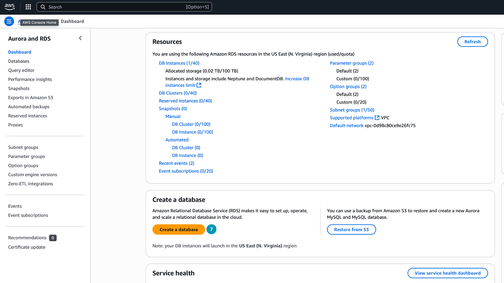
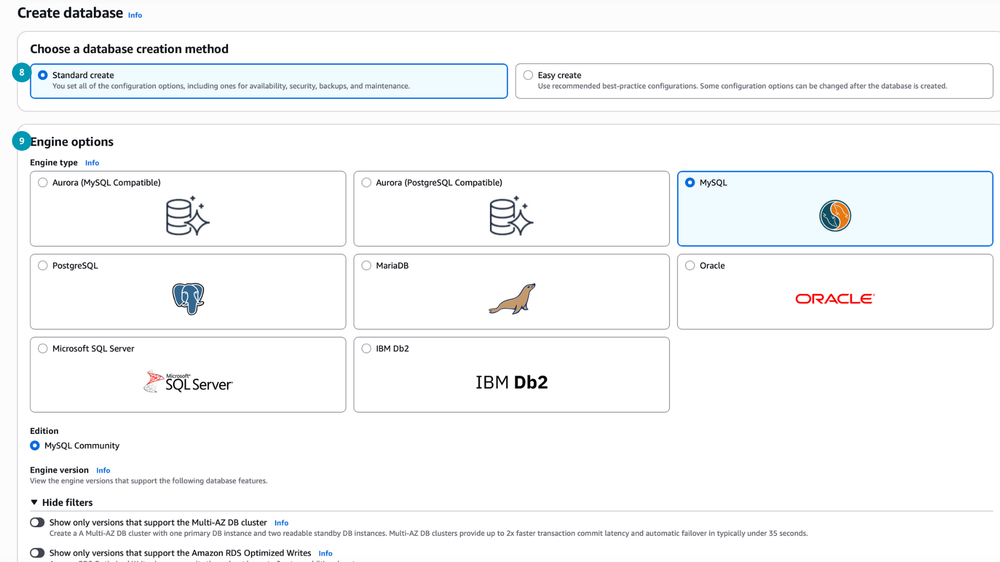
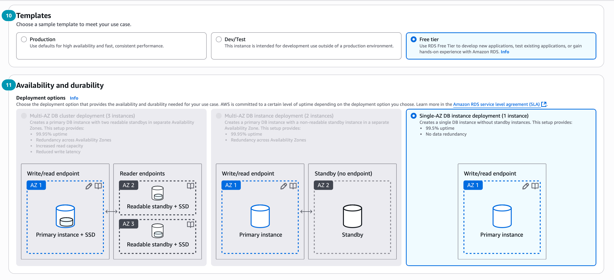
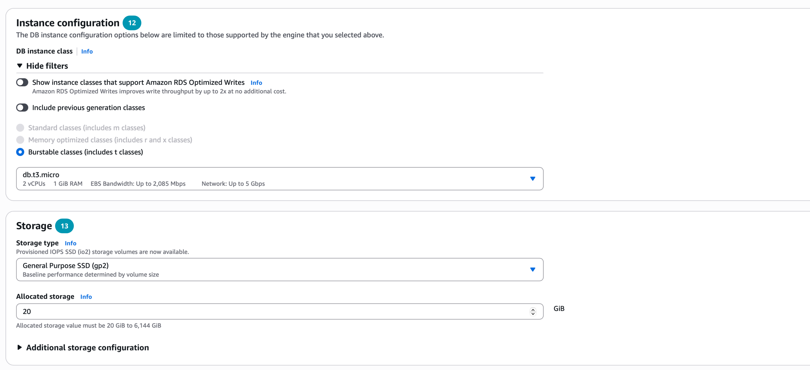
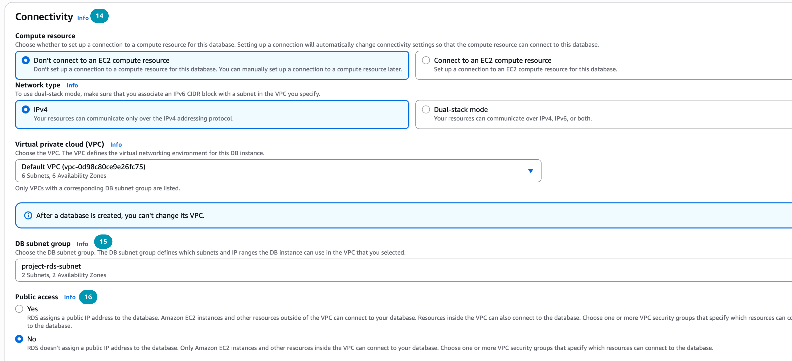
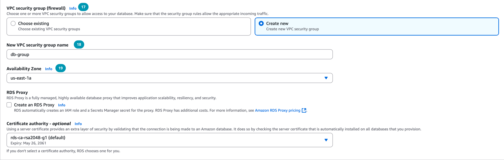
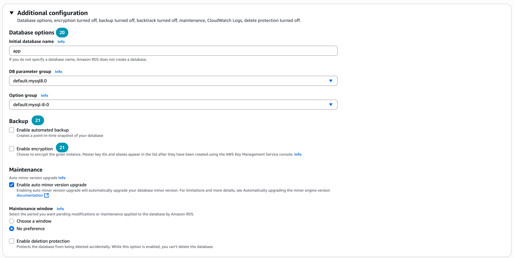

# Базы данных в облаке. AWS RDS и DynamoDB

<i>
Поздно вечером Джон и Эмма снова оказались в лаборатории. На экране их облачное приложение уже выглядело почти живым — серверы запускались, файлы хранились в S3, но чего-то не хватало.

– Всё работает, – сказала Эмма, листая лог с запросами, – но пользователи просят искать по именам, фильтровать, сохранять заказы... А S3 ведь просто хранит файлы.

Джон усмехнулся: – Да, S3 — это как склад коробок. Мы можем положить туда всё, но попробуй найди быстро одну нужную вещь. Нам нужна библиотека.

Он открыл консоль AWS и набрал “RDS”.

– Смотри, – сказал он, – Amazon RDS управляет базами данных. Хочешь MySQL — пожалуйста, PostgreSQL — без проблем. А Aurora — вообще своя, облачная, быстрая и не ломается от каждой перезагрузки.

Эмма задумчиво посмотрела на экран: – Значит, теперь данные будут жить в таблицах, с ключами, связями, запросами...

– И с репликами, – подхватил Джон. – Одна база в одной зоне, копия в другой. Если что-то пойдёт не так — система просто переключится.

– И не надо ночами чинить сервер, – усмехнулась Эмма.

Джон кивнул, и в этот момент лампа над ними слегка мигнула, словно подчёркивая, что именно отказоустойчивость теперь станет их новым другом.

– А если данных будет слишком много? – спросила она.

– Тогда DynamoDB, – сказал Джон. – Без схем, без ограничений, просто ключи и значения. Почти как космос: бесконечно и мгновенно.

На экране мигали строки: "Database created. Instance status: available."
Теперь их облако научилось хранить не просто файлы, а знания. И впереди их ждал новый уровень – умение работать с данными так же гибко, как облако само по себе.
</i>

## Вопросы для самопроверки

После изучения данной темы студент должен уметь ответить на следующие вопросы:

- Чем отличается база данных от хранилища данных, и в каких случаях используется каждый из них?
- Какие преимущества дает Amazon RDS по сравнению с установкой базы данных на EC2 инстанс?
- В чем заключается разница между реляционными и NoSQL базами данных, и когда следует выбирать DynamoDB вместо RDS?
- Как работают Partition Key и Sort Key в DynamoDB, и почему правильный выбор ключей критически важен для производительности?

## Введение

В современном мире приложения генерируют огромные объемы данных, которые нужно хранить и быстро обрабатывать. Простое хранение данных в виде файлов или на объектном хранилище (например, Amazon S3) не обеспечивает удобного доступа, поиска и одновременной работы множества пользователей.

### Базы данных и хранилища данных

Прежде чем переходить к облачным решениям, важно понять фундаментальное различие между базой данных и хранилищем данных.

_Хранилище данных (storage)_ - это система, предназначенная для долгосрочного хранения данных в их исходном виде. Хранилище работает с данными как с непрозрачными блоками или файлами. Примером может служить Amazon S3, где вы можете хранить файлы, изображения, видео, бэкапы. Хранилище не знает о структуре данных внутри файлов и не предоставляет возможностей для сложных запросов.

_База данных (database)_ - это структурированный набор данных, оптимизированный для эффективного поиска, анализа и манипулирования информацией. База данных включает в себя функциональность запросов через специальные языки (например, SQL), контроль доступа, транзакции и аналитические возможности, которых нет у простого хранилища.

Ключевые различия между _базой данных_ и _хранилищем данных_:

| Характеристика   | Хранилище данных                                                        | База данных                                  |
| ---------------- | ----------------------------------------------------------------------- | -------------------------------------------- |
| Структура данных | Не структурированы, файлы/объекты                                       | Структурированы, таблицы/индексы             |
| Методы доступа   | Хранилище доступно через операции чтения и записи по физическим адресам | Доступ через языки запросов (SQL, NoSQL)     |
| Время жизни      | Долгосрочное хранение файлов и объектов                                 | Данные могут быть временными или постоянными |

_Аналогия из реальной жизни_: хранилище - это склад с коробками, где вы можете положить что угодно, но чтобы найти нужную вещь, придется перебирать коробки. База данных - это библиотека с каталогом, где каждая книга имеет место и вы можете быстро найти нужную информацию по запросу.

### Облачные базы данных. Зачем переносить базы данных в облако?

Традиционно компании размещали базы данных на собственных серверах (on-premises). Это означало необходимость:

- Покупать и обслуживать физические серверы.
- Устанавливать и обновлять операционные системы.
- Устанавливать и патчить программное обеспечение баз данных.
- Самостоятельно настраивать репликацию и бэкапы.
- Обеспечивать высокую доступность и масштабирование.
- Следить за безопасностью и энергопотреблением серверов.

Все эти задачи требуют значительных ресурсов, времени и квалифицированного персонала. Поэтому многие компании переходят на использование _облачных баз данных_.

_Облачные базы данных_ – это базы данных, развернутые в облачной инфраструктуре, которые предлагают масштабируемость, высокую доступность и управляемость без необходимости самостоятельно поддерживать серверы.

Переход к облачным базам данных позволяет компаниям избавиться от управления физическими серверами, упростить резервное копирование, повысить надежность (например, за счет репликации на несколько дата-центров) и платить только за фактическое использование ресурсов. Кроме того, провайдеры облака (такие как AWS) берут на себя множество рутинных задач – от установки ПО до резервного копирования – позволяя разработчикам _сосредоточиться на логике приложения_, а не на инфраструктуре.

## Типы баз данных

Базы данных делятся на два основных типа: _реляционные_ и _нереляционные_ (NoSQL).

### Реляционные базы данных (RDBMS)

_Реляционные базы данных_ (Relational Databases или RDBMS) хранят данные в структурированных таблицах с предопределенными схемами. Это классический подход к организации данных, который существует уже несколько десятилетий [^1].

_Основные характеристики_:

- Данные организованы в таблицы с фиксированными столбцами и строками.
- Используется язык SQL (Structured Query Language) для запросов и управления данными.
- Поддерживаются _ACID_ свойства (Atomicity, Consistency, Isolation, Durability), что гарантирует надежность транзакций.
  - [Интересная статья про ACID](https://habr.com/ru/articles/555920/)
- Связи между таблицами реализуются через первичные и внешние ключи.
- Масштабирование происходит вертикально (_vertical scaling_), это значит, что для увеличения производительности нужно использовать более мощный сервер.

_Когда использовать реляционные базы данных_:

- Когда у вас структурированные данные с четкими связями между сущностями.
- Для приложений, где критически важна консистентность данных (банковские системы, бухгалтерия).
- Когда требуются сложные запросы с использованием JOIN операций.
- Данные имеют сложные взаимосвязи, которые лучше моделировать в табличной форме.
- Для транзакционных систем, требующих ACID гарантий.

_Примеры реляционных СУБД_: MySQL, PostgreSQL, Oracle, Microsoft SQL Server, MariaDB.


_Рисунок 1. Пример реляционной базы данных с таблицами и связями_

### Нереляционные базы данных (NoSQL)

_NoSQL (Not Only SQL)_ базы данных появились как ответ на ограничения реляционных баз данных при работе с большими объемами неструктурированных данных и необходимостью горизонтального масштабирования.

_Основные характеристики_:

- Гибкая схема данных (schema-less), позволяющая легко изменять структуру.
- Горизонтальное масштабирование (_horizontal scaling_), это значит, что можно добавлять новые серверы в кластер для увеличения производительности.
- Высокая производительность для операций чтения и записи.
- Поддержка различных моделей данных: документы, ключ-значение, колоночные, графовые. Например:
  - _Ключ-значение (Key-Value)_: данные хранятся в виде пар ключ-значение.
  - _Документные базы данных_: данные хранятся в формате документов (например, JSON).
- Следование принципам BASE (базовая доступность, мягкое состояние, итоговая согласованность) вместо ACID.
  - [В чем разница между базами данных ACID и BASE?](https://aws.amazon.com/ru/compare/the-difference-between-acid-and-base-database/)

_Когда использовать NoSQL базы данных:_

- Для работы с большими объемами неструктурированных или полуструктурированных данных.
- Когда требуется быстрое масштабирование приложения.
- Для real-time аналитики и обработки потоковых данных.
- В IoT приложениях, социальных сетях, системах управления контентом.

_Примеры NoSQL баз данных_: MongoDB, Cassandra, Redis, DynamoDB.

> Выбор между SQL и NoSQL не является вопросом "что лучше". Это вопрос "что подходит для конкретной задачи". Многие современные приложения используют оба подхода одновременно - это называется _polyglot persistence_ (многоязычное хранение данных).

## Продвинутые концепции баз данных

Прежде чем перейти к конкретным сервисам AWS, важно понять несколько ключевых концепций, которые используются в современных системах управления базами данных.

### Репликация

_Репликация (replication)_ - это процесс создания копий базы данных на разных серверах. _Реплики_ - это точные копии данных, которые помогают повысить доступность и производительность системы.

Существует несколько подходов к репликации:

- _Leader-Follower репликация (Master-Slave)_. Один сервер выступает в роли лидера (мастера), который _принимает все операции записи_. Остальные серверы - последователи (слейвы), которые получают изменения от лидера и могут обслуживать операции чтения. Этот подход повышает доступность системы - если один сервер выходит из строя, приложение может переключиться на другой.
- _Leader-Leader репликация_. Несколько серверов могут принимать операции записи одновременно. В этом случае необходимы механизмы разрешения конфликтов.

Репликация может быть синхронной или асинхронной:

- _Синхронная репликация_ гарантирует, что данные записаны на все реплики перед подтверждением операции. Это обеспечивает консистентность, но может снижать производительность.
- _Асинхронная репликация_ не ждет подтверждения от реплик, что быстрее, но создает риск потери данных при сбое.

Представим пример, у нас есть база данных с пользователями. Если у нас настроена репликация, то когда пользователь добавляется на главный сервер, эта информация автоматически копируется на все реплики. Если главный сервер выходит из строя, приложение может продолжать работать, обращаясь к одной из реплик.

### Read и Write Replicas

_Read Replicas_ - это специальные реплики базы данных, предназначенные только для чтения данных. Они используются для разгрузки основной базы данных от операций чтения. Основная база данных обрабатывает все операции записи и репликирует изменения на _read replicas_. Приложение может направлять запросы на чтение к любой из реплик, распределяя нагрузку.

_Write Replicas_ - реплики, которые также могут принимать операции записи. Используются в конфигурациях leader-leader репликации.

### Шардирование

_Шардирование (sharding)_ - это техника горизонтального разделения данных между несколькими серверами. Каждый сервер (shard) содержит часть общего набора данных.

| Преимущества шардирования                                                                                            | Недостатки шардирования                                              |
| -------------------------------------------------------------------------------------------------------------------- | -------------------------------------------------------------------- |
| Позволяет распределить нагрузку между несколькими серверами.                                                         | Усложняется архитектура приложения.                                  |
| Каждый шард можно масштабировать независимо, это значит, что можно добавлять ресурсы только там, где это необходимо. | Запросы, требующие данных из нескольких шардов, становятся сложнее.  |
| Параллельная обработка запросов к разным шардам значительно ускоряет операции.                                       | Необходимо продумывать стратегию распределения данных между шардами. |

Шардирование бывает двух основных типов: _горизонтальное_ и _вертикальное_.

- _Горизонтальное шардирование_. Данные разделяются по строкам. _Например_, пользователи с ID от 1 до 1000 хранятся на одном шарде, от 1001 до 2000 - на другом. _На каждом сервере одинаковая структура таблиц, но разные данные_.
- _Вертикальное шардирование_. Данные разделяются по столбцам. Это полезно, если некоторые столбцы используются чаще, а другие реже. Например, в интернет-магазине один шард может содержать информацию о клиентах, а другой - о товарах.

_Пример горизонтального шардирования_:

У нас есть база данных с миллионами пользователей. Вместо того чтобы хранить всех пользователей на одном сервере, мы можем разделить их по регионам:

- _Shard 1_: пользователи из Европы
- _Shard 2_: пользователи из Америки
- _Shard 3_: пользователи из Азии

Когда пользователь из Европы заходит в систему, его данные обрабатываются на Shard 1, что снижает нагрузку на остальные шарды и улучшает производительность.

_Пример вертикального шардирования_:

Здесь таблица разделяется по столбцам. Например, есть следующие таблицы:

- _Клиенты (`customers`)_. Хранит идентификатор, имя, email, телефон, адрес. Очень часто используется для быстрого поиска и общения с клиентом.
- _Заказы (`orders`)_. Хранит информацию о заказах - id заказа, клиент id, дата заказа, список товаров, сумма.

В данном случае:

- _Шард 1_. Хранит таблицу `customers` с основной информацией о клиентах. Эта таблица используется часто для операций авторизации, связи с клиентом, маркетинга.

  | customer_id | username | email            | phone        |
  | ----------- | -------- | ---------------- | ------------ |
  | 101         | Anna     | anna@example.com | +373XXXXXXXX |
  | 102         | Bob      | bob@example.com  | +373XXXXXXXX |

- _Шард 2_. Хранит таблицу `orders` с заказами клиентов. Эта таблица часто очень большая, с большим количеством операций записи и чтения.

  | order_id | customer_id | order_date | items | total_amount |
  | -------- | ----------- | ---------- | ----- | ------------ |
  | 5001     | 101         | 2024-01-15 | [...] | 150.00       |
  | 5002     | 102         | 2024-01-16 | [...] | 200.00       |

Такое разделение позволяет независимо масштабировать шард с заказами (обычно он тяжелее), не перегружая сервер с клиентскими данными. При необходимости приложение обращается к двум серверам для получения полной информации, но благодаря разделению нагрузка распределяется и производительность улучшается.

Это классический пример вертикального шардирования с двумя шардами по _функциональному признаку_: клиентские данные и заказные данные хранятся отдельно для оптимизации и масштабирования.

> _Репликация и шардирование_ - это разные концепции. Репликация создает копии одних и тех же данных на разных серверах для повышения доступности. Шардирование разделяет разные данные между серверами для масштабирования.

## Базы данных в AWS

### Обзор сервисов баз данных в AWS

Amazon Web Services предоставляет несколько сервисов для работы с базами данных, каждый из которых оптимизирован под определенные задачи.

- Amazon RDS (Relational Database Service) - управляемый сервис для реляционных баз данных.
- Amazon DynamoDB - полностью управляемая NoSQL база данных типа ключ-значение и документная.
- Amazon Redshift - сервис хранилища данных (data warehouse) для аналитики больших объемов данных.

> Часто в одном проекте используются несколько типов баз данных. Например, RDS для основных транзакционных данных, DynamoDB для сессий пользователей, и Redshift для аналитики.

### Managed vs Unmanaged сервисы

В AWS существует два подхода к развертыванию баз данных:

_Unmanaged (неуправляемый подход)_. Вы можете установить базу данных на EC2 инстанс самостоятельно. В этом случае вы получаете полный контроль, но также полную ответственность за:

- Масштабирование ресурсов.
- Настройку отказоустойчивости.
- Обеспечение высокой доступности.
- Создание и управление бэкапами.
- Ограничения в масштабируемости.

_Managed (управляемый подход)_. Amazon RDS автоматизирует большинство рутинных задач:

- Автоматические бэкапы.
- Патчинг операционной системы и СУБД. Это значит, что AWS следит за обновлениями и устанавливает их без вашего участия.
- Настройка репликации и высокой доступности.
- Масштабирование ресурсов.
- Мониторинг и оповещения.

## Amazon RDS

### Что такое Amazon RDS?

_Amazon RDS (Relational Database Service)_ – это облачный, _управляемый сервис_, предоставляющий управляемые реляционные базы данных. Проще говоря, RDS позволяет развернуть привычную СУБД в облаке AWS без необходимости вручную устанавливать СУБД на сервере.

Так как сервис управляемый, AWS берет на себя множество задач администрирования:

- выделение и настройку серверного инстанса,
- установку и патчи СУБД,
- автоматические бэкапы,
- масштабирование ресурсов,
- мониторинг системы.

Благодаря этому разработчики могут создать новую базу данных за считанные минуты и сразу приступать к работе с данными, не заботясь о инфраструктуре. Amazon RDS поддерживает несколько движков баз данных (включая открытые и коммерческие), давая гибкость выбора подходящей СУБД под ваши нужды. Фактически, RDS – это _Database-as-a-Service_: вы управляете базой через консоль AWS или API, а «под капотом» сервис сам запускает экземпляры баз данных на серверах EC2 и обслуживает их.

### Зачем использовать RDS вместо установки БД на EC2

Как было сказано ранее, Amazon RDS является _управляемым сервисом_, что решает множество задач, связанных с администрированием баз данных, которые при использовании EC2 ложатся на плечи разработчиков и администраторов. Почему же _предпочтительнее воспользоваться Amazon RDS?_

- _Меньше администрирования_. RDS автоматизирует рутинные задачи, такие как установка СУБД, применение обновлений, резервное копирование и восстановление. Нет необходимости вручную настраивать ОС и ПО.
- _Автоматическое резервное копирование_. Сервис RDS регулярно делает резервные копии базы и хранит их, позволяя настроить точку восстановления во времени (Point-In-Time Recovery).
- _Масштабирование и производительность_. Вы можете одним действием повысить мощность (например, перейти на более крупный размер инстанса с большим количеством CPU/RAM) или увеличить объем хранилища.
- _Высокая доступность_. RDS поддерживает развертывание базы данных в режиме Multi-AZ (несколько зон доступности) – при этом автоматически содержится резервная копия базы на другой физической площадке, которая при сбое основной принимает нагрузку без вмешательства пользователя.
- _Легкость миграции_. AWS предоставляет инструменты, такие как AWS Database Migration Service (DMS), позволяющие с минимальным простоем перенести данные из локальной базы или из другого провайдера в RDS [^4].

Проще говоря, RDS избавляет от «головной боли» по управлению сервером базы данных. Вы получаете готовый кластер с нужной вам СУБД, а обновление версий, исправление уязвимостей, замена вышедшего из строя оборудования – всем этим занимается AWS. В результате команда может сосредоточиться на данных и приложении, а не на поддержании работоспособности СУБД.

### Основные компоненты Amazon RDS

#### Экземпляр базы данных (RDS Instance)

_RDS Instance_ - это изолированная среда базы данных в облаке AWS. Это базовый строительный блок Amazon RDS, который _представляет собой виртуальный сервер базы данных_.

Каждый RDS инстанс может содержать одну или несколько баз данных, созданных пользователем. Вы можете получить доступ к инстансу теми же инструментами и приложениями, что и к обычной базе данных.

#### Поддерживаемые движки баз данных

Amazon RDS поддерживает 7 различных движков баз данных:

- _MySQL_ - популярная open-source СУБД.
- _PostgreSQL_ - мощная open-source объектно-реляционная СУБД.
- _MariaDB_ - форк MySQL с дополнительными возможностями.
- _Oracle_ - коммерческая СУБД корпоративного уровня.
- _Microsoft SQL Server_ - СУБД от Microsoft.
- _Amazon Aurora_ - совместимый с MySQL и PostgreSQL.
- _IBM Db2_ - коммерческая СУБД от IBM.

Каждый движок имеет свои особенности и используется в зависимости от требований проекта и существующей экосистемы.

#### Типы RDS инстансов

Amazon RDS предлагает различные классы инстансов, оптимизированные под разные рабочие нагрузки.

- _Standard Performance (db.m классы)_. Инстансы общего назначения, предлагающие сбалансированное соотношение CPU, памяти и сетевых ресурсов. Подходят для большинства приложений с умеренной нагрузкой.
- _Memory Optimized (db.r, db.x, db.z классы)_. Инстансы, оптимизированные для задач, требующих большого объема оперативной памяти. Используются для высокопроизводительных баз данных и аналитики больших данных в памяти.
- _Burstable Performance (db.t классы)_. Инстансы с возможностью кратковременного увеличения производительности. Идеальны для рабочих нагрузок с непредсказуемыми всплесками активности. Накапливают CPU кредиты во время простоя, которые можно использовать при повышенной нагрузке.

Каждый класс инстанса включает тип и размер. Например, `db.t3.medium` - это инстанс класса _Burstable Performance_, типа `t3`, размера `medium`.

#### Хранение данных в RDS

RDS предлагает несколько типов хранилища:

- _General Purpose SSD (gp2, gp3)_. Сбалансированное соотношение цены и производительности. Подходит для большинства рабочих нагрузок.
- _Provisioned IOPS SSD (io1, io2)_. Высокопроизводительное хранилище для I/O интенсивных рабочих нагрузок. Гарантирует определенное количество операций ввода-вывода в секунду.
- _Magnetic (стандартное)_. Более дешевый вариант, но с низкой производительностью. Рекомендуется только для архивных данных или тестовых сред.

Хранилище автоматически масштабируется по мере необходимости. Можно начать, например, с _20 ГБ_ и настроить автоматическое масштабирование хранилища, чтобы оно увеличивалось по мере заполнения (до заданного предела).

#### RDS в VPC и Private Subnets

Amazon RDS развёртывается внутри изолированного виртуального частного облака — Virtual Private Cloud (VPC). Это даёт дополнительный уровень безопасности и контроля, поскольку весь трафик к базе данных управляется внутри заданной сети. Рекомендуется размещать RDS-инстансы в приватных подсетях (private subnets), чтобы исключить прямой доступ из интернета.

При таком подходе к базе данных могут обращаться только ресурсы внутри VPC. Например, _ваше приложение, запущенное на EC2-инстансе, размещённом в публичной подсети (public subnet), сможет подключиться к RDS в приватной подсети_, но внешние пользователи не получат прямого доступа к базе.

Такое разделение помогает защитить данные, сводит к минимуму риски атак извне и обеспечивает лучший контроль сетевого трафика.


_Рисунок 2. Архитектура системы с EC2 в публичной подсети и RDS в приватной подсети_

#### Subnet Groups

_Subnet Group_ — это ключевой ресурс в AWS, который объединяет несколько подсетей (subnets) внутри вашей виртуальной частной сети (VPC). Он служит для управления тем, где именно могут размещаться инстансы базы данных Amazon RDS.

Главная задача Subnet Group — определить несколько приватных подсетей, в которых AWS может создавать RDS-инстансы. Это позволяет:

- Контролировать безопасность, ограничивая доступ к базе данных из интернета.
- Обеспечивать гибкость и масштабируемость инфраструктуры.
- Поддерживать высокую доступность базы данных при работе с несколькими Availability Zones (AZ), о которых речь пойдет в следующих лекциях.

_Subnet Group_ — это как набор «зон» в вашем VPC, где разрешена установка баз данных. AWS при развёртывании базы выбирает подсеть из этой группы.

Если используется _Single AZ_ конфигурация, то инстанс базы разворачивается в одной из подсетей Subnet Group (обычно приватной), без резервирования в других зонах (можно выбрать в какой именно подсети разместить). В любом случае Subnet Group обязательна для указания, чтобы задать границы размещения.

_Процесс создания Subnet Group_:

1. Создайте виртуальную сеть (VPC) с соответствующим диапазоном IP-адресов.
2. Создайте как _минимум две приватные подсети_ в разных зонах (с этим подробно разберёмся позже).
3. Объедините эти подсети в Subnet Group.
4. При создании RDS-инстанса выберите эту группу, чтобы указать зоны размещения базы.

### Репликация и высокая доступность в RDS

Для обеспечения надежности и масштабируемости RDS предлагает _два основных механизма репликации_:

- _Multi-AZ_
- _Read Replicas_.

#### Multi-AZ

_Multi-AZ (Multi-Availability Zone)_ - это конфигурация RDS для обеспечения высокой доступности и минимизации времени простоя [^5]. В этом режиме AWS автоматически разворачивает _резервный инстанс_ (_standby replica_) базы данных в другой зоне доступности (AZ) внутри того же региона и синхронно реплицирует данные с основного инстанса на резервный.

_Как это работает_:

- При создании RDS с Multi-AZ вы указываете Subnet Group, которая включает _минимум две приватные подсети_, расположенные в разных Availability Zones внутри одного региона.
- RDS автоматически развёртывает основной инстанс в одной из подсетей Subnet Group (в одном AZ), а резервный (standby replica) в другой подсети из той же группы, но в другом AZ.
- Все операции записи и изменения на основном инстансе синхронно реплицируются на резервный инстанс. Например, на основном инстансе выполнилась запись новой строки в таблицу - эта же запись дублируется на резервном инстансе.
- Если основной инстанс выходит из строя, происходит автоматическое переключение (failover) на резервный, расположенный в другой подсети и AZ, что минимизирует время простоя.

Subnet Group, в данном случае, задаёт конкретные подсети в разных зонах, где AWS развернёт основной и резервный инстансы, обеспечивая отказоустойчивость через географическую распределённость и изоляцию сети.

> AWS берет на себя управление процессом репликации и переключения. AWS сам выбирает, в какую подсеть и зону разместить основной и резервный инстансы из указанных в Subnet Group.


_Рисунок 3. Multi-AZ развертывание RDS с основным и резервным инстансами в разных зонах доступности_


_Рисунок 4. Процесс автоматического переключения на резервный инстанс при сбое основного_

> Multi-AZ не является решением для масштабирования операций чтения. Standby реплика не обслуживает запросы чтения, а только готовится к переключению в случае сбоя. Для масштабирования чтения используются Read Replicas.

#### Read Replicas

_Read Replicas_ - это асинхронно реплицируемые копии базы данных, предназначенные для обслуживания операций чтения.

_Ключевые особенности_:

- Асинхронная репликация означает, что изменения реплицируются с небольшой задержкой.
- Можно создать до 15 read replicas для одного RDS инстанса.
- Read replicas могут находиться в том же регионе или в других регионах AWS.
- При необходимости read replica может быть повышена до статуса _master_ базы данных.

_Использование Read Replicas_:

- Разгрузка основной базы данных от операций чтения.
- Аналитические запросы можно направлять на read replica, не влияя на производительность основной БД.
- Географически распределенные приложения могут использовать локальные read replicas для снижения задержек.


_Рисунок 5. Пример использования Read Replicas для масштабирования операций чтения_

Используя комбинацию _Multi-AZ_ и _Read Replicas_, можно достичь и высокой доступности, и масштабирования на чтение.

Например, базу в продакшене часто делают Multi-AZ для надежности, а для высоконагруженных систем добавляют несколько реплик чтения за балансировщиком запросов, чтобы множество пользователей могли параллельно выполнять запросы без нагрузки на основную базу.

Если основная база выходит из строя, происходит автоматическое переключение на резервный инстанс (Multi-AZ), а read replicas продолжают обслуживать запросы чтения, но уже из _"нового" основного инстанса_.

### Автоматические бэкапы в RDS

Одним из главных преимуществ RDS является автоматизация процесса бэкапов.

_Ключевые особенности_:

- RDS автоматически создает бэкапы вашей базы данных в указанное окно времени.
- Бэкапы сохраняются в Amazon S3 и автоматически реплицируются для надежности.
- Вы можете настроить период хранения бэкапов от 1 до 35 дней.
- Point-in-time восстановление позволяет восстановить базу данных на любую секунду в пределах периода хранения.

_Типы бэкапов_:

- Автоматические бэкапы - создаются по расписанию.
- Ручные снимки (_manual snapshots_) - создаются пользователем и хранятся до явного удаления.

> _Важно_. Автоматические бэкапы включены по умолчанию и не требуют дополнительной настройки. Вам не нужно самостоятельно писать скрипты для бэкапов.

### Сценарии использования RDS

Когда _следует использовать_ Amazon RDS:

- _Когда вам нужна реляционная база данных для приложения_ (например, веб-сайт с пользователями, заказы, платежи) и вы хотите упростить ее обслуживание.
- _Необходима средняя или высокая частота запросов_ на чтение и запись (до 30,000 IOPS).
- Критически _важна долговечность данных_ и ACID гарантии.
- _При миграции существующей базы в облако_: если у вас уже есть PostgreSQL/MySQL/Oracle и т.д. локально, вы можете относительно безболезненно перенести их в RDS, не переписывая само приложение

Когда _НЕ следует_ использовать Amazon RDS:

- _Очень высокие требования к производительности_ записи или масштабирования. RDS вертикально масштабируется до определенного лимита (например, 64 vCPU, 256GB RAM, ~16-64 ТБ хранилища в зависимости от движка). Если нужно обрабатывать сотни миллионов транзакций в секунду по всей планете, реляционная БД может стать узким местом.
- _Неструктурированные или быстро меняющиеся данные_. Когда схема данных не фиксирована или требует хранения огромных JSON-документов, графов – может быть разумнее использовать соответствующую NoSQL базу
- Приложение выполняет простые GET или PUT запросы, которые может обработать NoSQL база.
- Требуется глубокая кастомизация СУБД на уровне операционной системы.

### Billing в RDS

Amazon RDS использует модель оплаты за использование. За что вы платите:

- _Тип и размер инстанса_ (instance type and size). Стоимость зависит от класса инстанса (db.t3, db.r5 и т.д.) и его размера (small, medium, large).
- _Движок базы данных_ (database engine). Коммерческие движки (Oracle, SQL Server) стоят дороже, чем open-source (MySQL, PostgreSQL).
- _Класс памяти_ (memory class). Инстансы с большим объемом памяти стоят дороже.
- _Хранилище (storage)_. Вы платите за выделенное хранилище по тарифу _GB/месяц_.
- _Бэкапы (backups)_. Бэкапы в объеме до 100% от размера базы данных предоставляются бесплатно. За дополнительное место для бэкапов взимается плата.
- _Передача данных_. Трафик между RDS и EC2 внутри одного региона обычно бесплатен (если они в одной зоне или через межAZ – может тарифицироваться меж-AZ трафик).

Существуют две модели покупки:

- _On-Demand Instances_. Вы платите за вычислительную мощность по часам, без долгосрочных обязательств. Подходит для непредсказуемых рабочих нагрузок.
- _Reserved Instances_. Вы резервируете инстанс на срок 1 или 3 года с единовременным платежом. Это значительно дешевле (до 60-70% экономии), но требует долгосрочного обязательства.

## Amazon Aurora

### Что такое Amazon Aurora?

_Amazon Aurora_ - это один из движков, доступных в Amazon RDS, но с существенными отличиями от классических движков [^7].

Aurora представляет собой _полностью управляемую реляционную базу данных, совместимую с MySQL и PostgreSQL_. Это означает, что код, инструменты и приложения, которые работают с MySQL или PostgreSQL, будут работать и с Aurora без изменений или с минимальными изменениями.

### Особенности Amazon Aurora

_Ключевые особенности Aurora_ [^7]:

- До 5 раз выше производительность по сравнению с обычным MySQL.
- До 3 раз выше производительность по сравнению с обычным PostgreSQL.
- Высокая доступность - до 99.99% в одном регионе и 99.999% в мультирегиональной конфигурации.
- Автоматическое масштабирование хранилища до 128 TiB. В то время как в стандартном RDS MySQL/PostgreSQL максимальный размер хранилища ограничен 64 TiB.
- Aurora может автоматически создавать до 15 реплик чтения с низкой задержкой, в то время как стандартный RDS MySQL поддерживает до 5 реплик.
- Фактически, _Aurora изначально Multi-AZ по дизайну_ - хранение распределено, и сбой сразу нескольких копий маловероятен.

_Aurora_ - это _fully managed service_, что означает автоматизацию трудоемких задач:

- Автоматическое создание резервных копий (backups) в S3.
- Репликация данных через несколько Availability Zones автоматически.
- Автоматическое масштабирование (scaling) хранилища и вычислительных ресурсов.

Механизмы _failure detection_ и _repair_:

- Aurora постоянно мониторит состояние дисков и сегментов данных.
- При обнаружении сбоя автоматически заменяет поврежденные сегменты.
- Восстановление после сбоя происходит мгновенно (instant crash recovery) - не требуется воспроизведение журнала транзакций.

> Aurora отличается от традиционных баз данных тем, что отделяет уровень хранения от уровня вычислений. Это позволяет масштабировать их независимо друг от друга.

## Amazon DynamoDB

### Что такое Amazon DynamoDB?

_Amazon DynamoDB_ - это _полностью управляемая (fully managed) NoSQL база данных_, предоставляющая быструю и предсказуемую производительность при любом масштабе.

_Основные характеристики_:

- Тип базы данных: key-value и документная модель.
- Serverless - не требует управления серверами.
- Автоматическое масштабирование в зависимости от нагрузки.
- Репликация данных через несколько Availability Zones автоматически.
- Низкая задержка запросов - _миллисекунды_.

DynamoDB предназначена для приложений, которым нужна очень быстрая запись и чтение данных в любом масштабе – от сотен запросов в секунду до миллионов, – без забот о настройке кластера. AWS обеспечивает под капотом распределение данных по множеству узлов, репликацию и другие сложности, предоставляя разработчику простой интерфейс: таблицы, элементы, атрибуты.

### Что такое NoSQL в контексте DynamoDB

_NoSQL – "Not Only SQL"_ – подразумевает, что база не ограничена табличной структурой и SQL-запросами.

DynamoDB использует _ключ-значение_ и _документную_ модели данных:

- _Key-Value модель_. Данные хранятся как пары ключ-значение. Очень быстрый доступ к данным по ключу.
- _Document модель_. Позволяет хранить сложные вложенные структуры данных в форматах JSON, BSON или XML.

Это значит, что в DynamoDB нет фиксированной схемы, как в SQL – вы можете добавить в один элемент новые атрибуты, и это не затронет другие элементы. Например, в одной записи может быть поле "age", а в другой его нет. DynamoDB жертвует возможностью сложных запросов (например, нет JOIN, агрегаций по нескольким таблицам) ради скорости и простоты масштабирования.

В DynamoDB _данные распределяются по многим внутренним узлам (shards) автоматически_, поэтому нагрузка масштабируется горизонтально почти безгранично. Такая архитектура идеально подходит для случаев, когда нужно хранить большие объемы простых данных и быстро их извлекать по ключу. _Например_: хранилище сессий пользователей, профили пользователей, кеш результатов, журнал событий IoT-датчиков, список товаров в каталоге – все это примеры, где DynamoDB успешно применяется.

### Основные понятия DynamoDB

В DynamoDB есть 3 основных понятия:

- _Table (таблица)_ - это коллекция данных. Аналог таблицы в реляционных БД, но без жесткой схемы.
- _Item (элемент)_ - это отдельная запись в таблице. Аналог строки в реляционной БД. Каждый элемент имеет уникальный _Primary Key (первичный ключ)_, который однозначно его идентифицирует.
- _Attribute (атрибут)_ - это часть данных в элементе. Аналог столбца, но разные элементы могут иметь разные атрибуты.

_Primary Key_ в DynamoDB уникально идентифицирует каждый элемент в таблице. DynamoDB поддерживает два типа первичных ключей:

- _Partition Key_
- _Sort Key_

Вы можете использовать либо одинарный ключ (только _Partition Key_), либо составной ключ (_Partition Key + Sort Key_). Нельзя использовать два _Partition Key_ в одной таблице.

_Partition Key_ (простой первичный ключ):

- Состоит из одного атрибута.
- DynamoDB использует значение partition key как вход для внутренней хэш-функции.
- Результат хэш-функции определяет партицию (физическое хранилище), где будет храниться элемент.
- Никакие два элемента в таблице не могут иметь одинаковое значение partition key.

_Composite Primary Key_ - _Partition Key_ + _Sort Key_:

- Состоит из двух атрибутов: `partition key` и `sort key`.
- DynamoDB использует partition key для определения партиции, как и раньше.
- Все элементы с одинаковым partition key хранятся вместе, отсортированные по sort key.
- В таблице могут быть элементы с одинаковым partition key, но у них должны быть разные sort keys.

_Partition Key используется для распределения данных_:

- DynamoDB применяет хэш-функцию к значению partition key.
- Результат хэш-функции определяет партицию, где физически будут храниться данные.
- Это обеспечивает равномерное распределение нагрузки между партициями.

Важно выбирать partition key так, чтобы данные распределялись равномерно. Плохой выбор может привести к "горячим партициям" (hot partitions), где одна партиция получает непропорционально большую нагрузку.

_Sort Key используется для сортировки и запросов:_

- Элементы с одинаковым partition key хранятся вместе, отсортированные по sort key.
- Это позволяет эффективно запрашивать диапазоны данных.
- Sort key также может использоваться для моделирования связей между данными. То есть, вы можете хранить связанные элементы вместе, используя один и тот же partition key и разные sort keys.


_Пример_:

- Таблица `Orders` с composite primary key:

  - _Partition Key_: `CustomerID` - этот ключ определяет, к какому клиенту относится заказ.
  - _Sort Key_: `OrderDate` - этот ключ сортирует заказы клиента по дате.

Такая структура позволяет легко запрашивать все заказы конкретного клиента, а также получать их в хронологическом порядке.

_Когда использовать Partition Key vs Composite Key_:

- Используйте простой Partition Key, когда каждый элемент уникален и вам не нужны запросы по диапазонам.
- Используйте Composite Key, когда нужно группировать связанные элементы и запрашивать их наборами.

> Правильный выбор Partition Key критически важен для производительности DynamoDB. Плохой выбор может привести к неравномерному распределению нагрузки и снижению производительности.

### Формат данных для загрузки в DynamoDB в виде JSON

При добавлении элемента в таблицу данные можно передать в формате JSON. Каждый атрибут элемента должен быть представлен в виде объекта, где ключ - это имя атрибута, а значение - это объект с типом и значением.

```json
{
  "AttributeName1": { "Type": "Value" },
  "AttributeName2": { "Type": "Value" }
}
```

_Типы данных_:

- `S` - строка (String)
- `N` - число (Number) (числа указываются в кавычках)
- `B` - бинарные данные (Binary)
- `SS` - множество строк (String Set)
- `NS` - множество чисел (Number Set)
- `BS` - множество бинарных данных (Binary Set)
- `BOOL` - булевый тип (true/false)
- `NULL` - null

_Пример простой записи:_

```json
{
  "UserID": { "S": "user123" },
  "Name": { "S": "Иван Иванов" },
  "Age": { "N": "30" },
  "IsPremium": { "BOOL": true },
  "JoinDate": { "S": "2025-10-22" }
}
```

_Пример записи с множествами:_

```json
{
  "ProductID": { "S": "prod456" },
  "Categories": { "SS": ["Техника", "Электроника"] },
  "Price": { "N": "199.99" },
  "Tags": { "SS": ["новинка", "скидка"] },
  "Availability": { "BOOL": true }
}
```

### Операции Scan и Query в DynamoDB

DynamoDB предоставляет две операции для получения данных: _Scan_ и _Query_.

_Query_ - это операция прямого поиска по первичному ключу:

- Выполняет прямой поиск в выбранной партиции.
- Требует указания partition key в условии.
- Опционально может использовать операторы сравнения на sort key (`=`, `<`, `>`, `BETWEEN`, `BEGINS_WITH`).
- Очень быстрая операция - обычно завершается за 100 миллисекунд или меньше.

_Scan_ - это операция сканирования всей таблицы:

- Проверяет каждый элемент в таблице или индексе.
- Не требует указания ключа.
- Может занимать несколько часов на больших таблицах.
- Максимальный размер результата - 1 MB данных.

_Когда использовать Query vs Scan_:

- Всегда используйте _Query_, когда это возможно.
- Используйте _Scan_ только когда вам действительно нужны все данные из таблицы.
- Если вам часто нужны запросы по атрибутам, не являющимся ключами, рассмотрите создание _Global Secondary Index_.

> Операция Scan на большой таблице может быть очень дорогой и медленной. Старайтесь проектировать схему данных так, чтобы использовать Query вместо Scan.

### Использование AWS CLI для работы с DynamoDB

Общий синтаксис команды AWS CLI для DynamoDB:

```bash
aws dynamodb <operation> --table-name <table_name> [options]
```

_Список некоторых распространенных операций:_

- `list-tables` - получить список всех таблиц:

  ```bash
  aws dynamodb list-tables
  ```

- `describe-table` - получить информацию о таблице:

  ```bash
  aws dynamodb describe-table --table-name MyTable
  ```

- `get-item` - получить элемент по ключу:

  ```bash
  aws dynamodb get-item \
  --table-name Users \
  --key '{"UserID": {"S": "user123"}}'
  ```

- `put-item` - добавить или заменить элемент:

  ```bash
    aws dynamodb put-item \
    --table-name Users \
    --item '{
      "UserID": {"S": "user123"},
      "Name": {"S": "Иван Иванов"},
      "Age": {"N": "30"},
      "IsPremium": {"BOOL": true},
      "JoinDate": {"S": "2025-10-21"}
    }'
  ```

- `update-item` - обновить атрибуты элемента:

  ```bash
  aws dynamodb update-item \
    --table-name Users \ # имя таблицы
    --key '{"UserID": {"S": "user123"}}' \ # ключ элемента
    --update-expression "SET Age = :newAge" \ # выражение обновления
    --expression-attribute-values '{":newAge": {"N": "31"}}' # значения для выражения
  ```

- `batch-write-item` - записать несколько элементов в таблицу:

  ```bash
  aws dynamodb batch-write-item --table-name Users --request-items file://users.json
  ```

  - Флаг `--request-items file://items.json` позволяет указать файл с данными для записи. Формат файла:

  ```json
  {
    "Users": [
      {
        "PutRequest": {
          "Item": {
            "UserID": { "S": "user124" },
            "Name": { "S": "James Smith" },
            "DateJoined": { "S": "2025-10-20" }
          }
        }
      },
      {
        "PutRequest": {
          "Item": {
            "UserID": { "S": "user125" },
            "Name": { "S": "Maria Garcia" },
            "DateJoined": { "S": "2025-10-19" }
          }
        }
      },
      {
        "DeleteRequest": {
          "Key": {
            "UserID": { "S": "user126" }
          }
        }
      }
    ]
  }
  ```

  В параметре `--request-items` операции для каждого элемента _могут быть только двух типов_:

  - `PutRequest` - вставка или обновление элемента (Item) в таблицу.
  - `DeleteRequest` - удаление элемента по ключу из таблицы.

- `query` - выполнить запрос по ключу:

  ```bash
  aws dynamodb query \
    --table-name Messages \ # имя таблицы
    --key-condition-expression "ChatRoomID = :roomid AND Timestamp > :time" \ # условие по ключу
    --expression-attribute-values '{":roomid":{"S":"room1"}, ":time":{"N":"1600000000"}}' \ # значения для условия
    --limit 20 # ограничение на 20 результатов
  ```

- `scan` - выполнить сканирование таблицы:

  ```bash
  aws dynamodb scan \
    --table-name Users \ # имя таблицы
    --filter-expression "Age > :age" \ # фильтр по атрибуту Age
    --expression-attribute-values '{":age":{"N":"25"}}' \ # значения для фильтра
    --limit 10 # ограничение на 10 результатов
  ```

### Использование AWS SDK для работы с DynamoDB

Чаще всего для работы с DynamoDB используется AWS SDK, который доступен для множества языков программирования (JavaScript, Python, Java, C#, Go и др.). Например, для JavaScript (Node.js) используется пакет `@aws-sdk/client-dynamodb`.

_Пример 1. Подключение к DynamoDB и добавление элемента:_

```javascript
import {
  DynamoDBClient,
  PutItemCommand,
  GetItemCommand,
} from "@aws-sdk/client-dynamodb";

const client = new DynamoDBClient({ region: "us-east-1" });

// Добавляем элемент
const putCommand = new PutItemCommand({
  TableName: "Users",
  Item: {
    UserID: { S: "user123" },
    Name: { S: "Иван Иванов" },
    Age: { N: "30" },
    Premium: { BOOL: true },
  },
});

await client.send(putCommand);

// Читаем элемент по ключу
const getCommand = new GetItemCommand({
  TableName: "Users",
  Key: { UserID: { S: "user123" } },
});

const response = await client.send(getCommand);
console.log(response.Item);
```

### Сценарии использования DynamoDB

Когда _следует использовать_ Amazon DynamoDB:

- Приложения с непредсказуемой нагрузкой, требующие автоматического масштабирования.
- Когда нужна очень низкая задержка (миллисекунды).
- Мобильные приложения с офлайн синхронизацией.

Когда _НЕ следует_ использовать DynamoDB:

- Когда требуются сложные JOIN операции между таблицами.
- Для OLAP (Online Analytical Processing) и сложной аналитики.
- Когда критически важна немедленная консистентность (DynamoDB использует eventual consistency по умолчанию).
- Для приложений с редкими, но очень сложными запросами.

## Amazon Redshift

### Что такое Amazon Redshift?

_Amazon Redshift_ - это быстрый, полностью управляемый сервис хранилища данных (data warehouse), позволяющий анализировать данные с использованием SQL и инструментов бизнес-аналитики.

_Ключевые особенности_:

- Колоночное хранение данных - данные организованы по столбцам, а не по строкам.
- Массивно-параллельная обработка (_Massively Parallel Processing_, _MPP_) - запросы распределяются между множеством узлов.
- Сжатие данных для экономии хранилища.
- Оплата за использование - нет необходимости в больших первоначальных инвестициях.

### Когда использовать Amazon Redshift

Когда _следует использовать_ Amazon Redshift:

- Для аналитики больших объемов данных (от терабайт до петабайт).
- Когда требуется сложный SQL-анализ и агрегация данных.
- Для интеграции с BI инструментами (Tableau, Looker, Power BI и т.д.).
- Когда нужно объединить данные из разных источников (RDS, S3, DynamoDB и т.д.) для комплексного анализа.
- Для построения отчетов и дашбордов в реальном времени.

Когда _НЕ следует_ использовать Amazon Redshift:

- Для транзакционных систем с высокой частотой операций записи.
- Когда требуется низкая задержка на уровне миллисекунд для отдельных запросов.
- Для небольших наборов данных, которые можно эффективно обрабатывать в реляционной базе данных.

> Redshift не подходит для операционных баз данных с частыми небольшими транзакциями. Используйте его для аналитики и отчетности, а RDS или DynamoDB для операционных данных.

## Практическая часть. Создание и подключение к RDS инстансу

Для создания RDS инстанса, выполните следующие шаги:

1. Войдите в AWS Management Console.
2. Создайте сеть VPC с двумя подсетями.
3. Перейдите в сервис Amazon RDS.
4. В левом меню выберите "Subnet groups" (1), после чего нажмите "Create DB Subnet Group".

   

   _Рисунок 7. Выбор пункта Subnet Groups_

5. Создайте _Subnet Group_, указав:

   1. Имя группы (`Name`) (2)
   2. Описание (`Description`) (3)
   3. Выберите `VPC` (4) - виртуальную сеть, в которой созданы подсети, и где будет размещён ваш RDS-инстанс.
   4. Добавьте `availability zones`, в которых вы создали подсети (5).
   5. Выберите подсети из указанных AZ, обычно минимум две (6).
      - Если вы создаёте `Multi-AZ` RDS-инстанс, AWS автоматически разместит _основной_ и _резервный инстансы_ в разных подсетях и разных Availability Zones из этой Subnet Group.
      - Если создаёте `Single-AZ` RDS-инстанс, AWS разместит его в одной из выбранных подсетей, и при создании вы можете указать конкретную Availability Zone для инстанса.

   

   _Рисунок 8. Создание Subnet Group для RDS_

6. Перейдите в "Databases" в левом меню и нажмите "Create database" (7).

   

   _Рисунок 9. Кнопка создания базы данных RDS_

7. Выберите метод создания базы - "Standard Create" (8) и выберите движок базы данных, например, "MySQL" (9).

   

   _Рисунок 10. Выбор метода создания и движка базы данных RDS_

8. Выберите Template (10), в случае учебных аккаунтов, вам доступно только "Free tier".

   - `Production` - для продакшн систем с высокими требованиями к производительности и доступности.
   - `Dev/Test` - для разработки и тестирования с умеренными требованиями.

9. Выберите тип развертывания (11):

   - _Single-AZ_ - база данных будет размещена в одной зоне доступности.
   - _Multi-AZ_ - база данных будет иметь резервный инстанс в другой зоне доступности для высокой доступности.

   В случае учебного аккаунта, доступен только _Single-AZ_.

   

   _Рисунок 11. Выбор шаблона и типа развертывания RDS_

10. В разделе Instance Configuration (12), выберите тип инстанса, например `db.t3.micro`.
11. В разделе Storage (13), оставьте настройки по умолчанию (20 GB, General Purpose SSD).

    

    _Рисунок 12. Конфигурация инстанса и хранилища RDS_

12. В разделе Connectivity (14), выберите:

    - `Don't connect to an EC2 instance`, так как подключим позже вручную.
    - Выберите VPC, в котором создали Subnet Group.
    - Выберите Subnet Group, созданную ранее (15).
    - В разделе Public access выберите `No`, чтобы база была приватной, это является хорошей практикой безопасности.

    

    _Рисунок 13. Настройки подключения RDS_

    - В разделе `VPC security group (firewall)` (17) выберите `Create new` и введите имя группы безопасности (18), например `rds-sg`, это позволит создать новую группу безопасности для RDS, в которую автоматически будут добавлены правила доступа:

      - Входящий трафик на порт 3306 (MySQL) из подсетей VPC.
      - Исходящий трафик разрешен ко всем адресам.

    - В разделе `Availability zone` (19) выберите `No preference`, чтобы AWS сам выбрал зону для размещения RDS-инстанса из `Subnet Group`.

    

    _Рисунок 14. Настройки безопасности RDS_

13. Внизу откройте раздел Additional configuration и :

    - В разделе `Database options` (20) укажите _имя базы данных_ (Database name), данная база будет автоматически создана при старте RDS-инстанса.

    - В разделе `Backup` (21) выключите автоматические бэкапы, сняв галочку с "Enable automated backups" и выключите encryption, сняв галочку с "Enable encryption", так как в учебных целях в этом нет необходимости.

    

    _Рисунок 15. Дополнительные настройки RDS_

14. Нажмите "Create database" внизу страницы.

15. Подождите несколько минут, пока RDS-инстанс создастся и перейдет в статус "_Available_".

16. Для подключения к RDS-инстансу:

    - Создайте EC2 инстанс в той же VPC и подсети, что и RDS.
    - Убедитесь, что EC2 инстанс имеет доступ к RDS по порту 3306 (MySQL) в группе безопасности.
    - Подключитесь к EC2 инстансу по SSH.
    - Используйте MySQL клиент для подключения к RDS, используя endpoint RDS, имя пользователя и пароль, указанные при создании RDS.

    ```bash
    mysql -h <RDS-endpoint> -P 3306 -u <username> -p
    ```

## Резюме

- _Различие между хранилищем данных и базой данных_. Хранилище предназначено для долгосрочного хранения файлов, база данных - для структурированного доступа к данным с возможностью сложных запросов.
- _Типы баз данных_. Реляционные базы данных (SQL) используют таблицы с фиксированной схемой и вертикальное масштабирование. NoSQL базы данных предлагают гибкую схему и горизонтальное масштабирование.
- _Продвинутые концепты_. Репликация создает копии данных для высокой доступности. Шардирование распределяет данные между серверами для масштабирования. Read replicas разгружают основную базу от операций чтения.
- _Amazon RDS - управляемый сервис для реляционных баз данных_. Автоматизирует бэкапы, патчинг, репликацию. Поддерживает MySQL, PostgreSQL, MariaDB, Oracle, SQL Server, Aurora, IBM Db2. Multi-AZ развертывание обеспечивает высокую доступность. Read replicas масштабируют операции чтения.
- _Amazon Aurora - это оптимизированный движок RDS с высокой производительностью_. До 5x быстрее MySQL и 3x быстрее PostgreSQL. Fully managed с автоматическим патчингом, бэкапами и масштабированием. Instant crash recovery и до 15 read replicas.
- _Amazon DynamoDB - управляемая NoSQL база данных_. Key-value и документная модель данных. Автоматическое горизонтальное масштабирование. Partition key определяет распределение данных, Sort key используется для сортировки и запросов диапазонов. Query эффективнее Scan для получения данных. TTL автоматически удаляет устаревшие данные.
- _Amazon Redshift - сервис хранилища данных для аналитики_. Колоночное хранение и массивно-параллельная обработка. Используется для enterprise data warehousing, big data analytics, machine learning.
- _Выбор правильного сервиса зависит от требований приложения_. RDS для транзакционных реляционных данных. DynamoDB для масштабируемых приложений с простыми запросами. Redshift для аналитики больших данных.

[^1]: _What’s the Difference Between Relational and Non-relational Databases?_. aws.amazon.com [online]. Available at: https://aws.amazon.com/compare/the-difference-between-relational-and-non-relational-databases/
[^2]: _Шардирование PostgreSQL: архитектура, алгоритмы и практические подходы_.
[^3]: _Amazon Relational Database Service_. aws.amazon.com [online]. Available at: https://aws.amazon.com/rds/
[^4]: _Amazon RDS vs. Amazon DynamoDB: Everything You Need to Know_. missioncloud.com [online]. Available at: https://www.missioncloud.com/blog/amazon-rds-vs-amazon-dynamodb-everything-you-need-to-know
[^5]: _Multi-AZ DB instance deployments for Amazon RDS_. docs.aws.amazon.com [online]. Available at: https://docs.aws.amazon.com/AmazonRDS/latest/UserGuide/Concepts.MultiAZSingleStandby.html
[^6]: _Amazon RDS Read Replicas_. aws.amazon.com [online]. Available at: https://aws.amazon.com/rds/features/read-replicas/
[^7]: _Amazon Aurora vs. RDS: Understanding the Difference_. tigerdata.com [online]. Available at: https://www.tigerdata.com/blog/amazon-aurora-vs-rds-understanding-the-difference
[^8]: _Amazon DynamoDB_. aws.amazon.com [online]. Available at: https://aws.amazon.com/ru/dynamodb/
