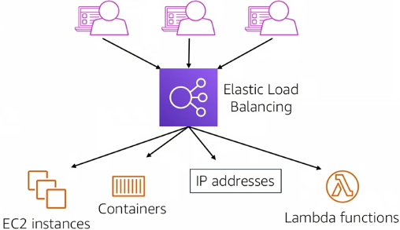
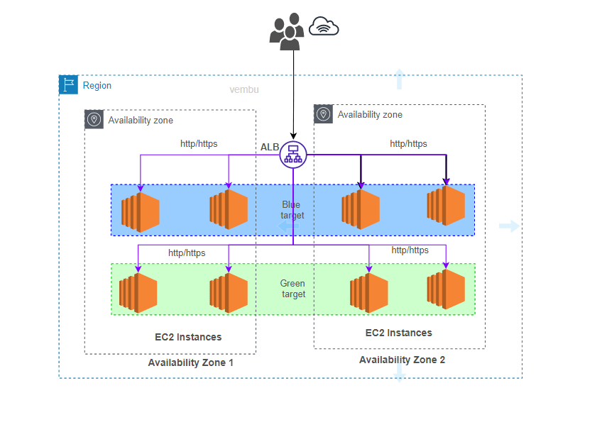
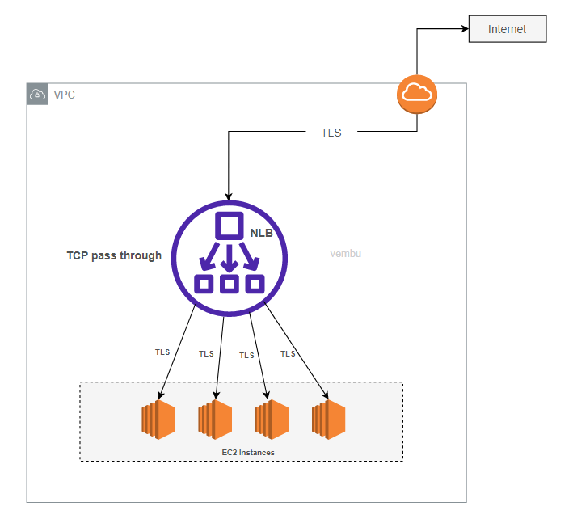
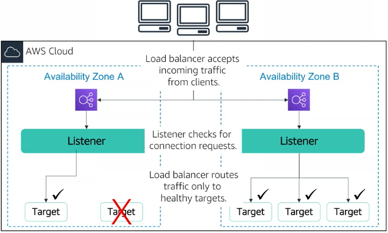
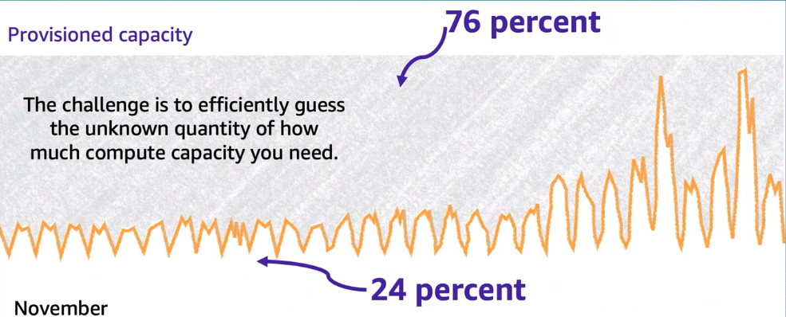
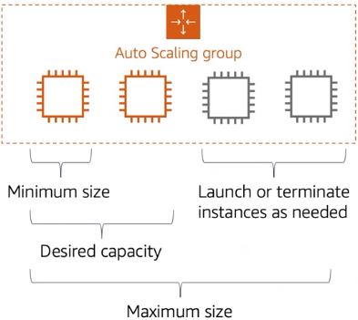
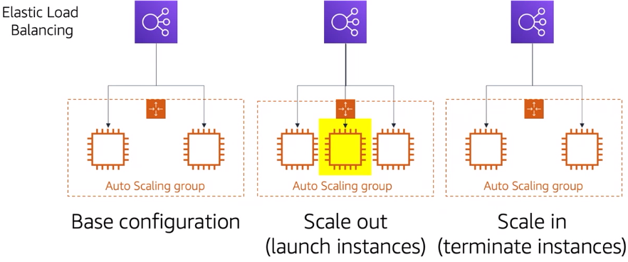
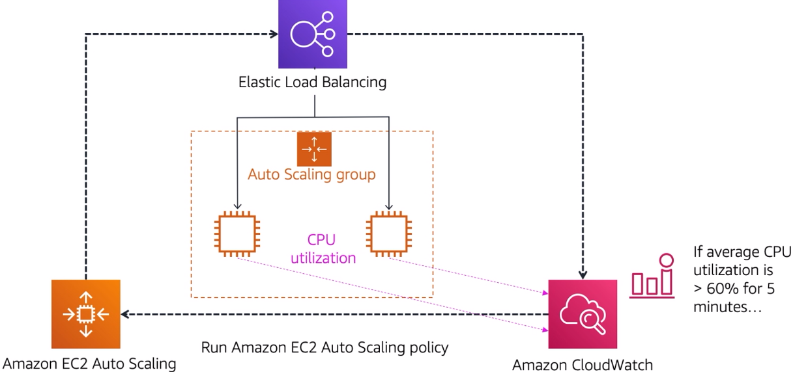

# Балансировка нагрузки и автоматическое масштабирование. Amazon ELB, EC2 AutoScaling

## Вопросы для самопроверки

После изучения данной темы вы должны уметь ответить на следующие вопросы:

1. Как балансировка нагрузки и автоматическое масштабирование обеспечивают высокую доступность приложений в облаке?
2. В чем заключаются основные различия между типами балансировщиков нагрузки AWS (ALB, NLB, CLB) и когда следует использовать каждый из них?
3. Какие стратегии масштабирования существуют в Amazon EC2 Auto Scaling и как выбрать подходящую для конкретного сценария использования?
4. Как Amazon CloudWatch интегрируется с ELB и Auto Scaling для обеспечения мониторинга и автоматизации реагирования на изменения нагрузки?

## Введение. Проблема масштабирования в современных приложениях

Представьте себе интернет-магазин, который в обычные дни обслуживает несколько тысяч пользователей. Но наступает "Черная пятница" - день грандиозных распродаж, и количество одновременных посетителей возрастает в десятки раз. Если инфраструктура магазина не готова к такому наплыву, серверы могут не справиться с нагрузкой, сайт начнет работать медленно или вовсе перестанет отвечать на запросы. Результат - потерянные продажи, разочарованные клиенты и ущерб репутации компании [^1].

Именно для решения подобных задач в облачных платформах существуют механизмы балансировки нагрузки и автоматического масштабирования. Эти технологии позволяют приложениям адаптироваться к изменяющимся условиям, обеспечивая стабильную работу как в периоды низкой активности, так и во время пиковых нагрузок.

_Amazon Web Services_ предоставляет мощные инструменты для решения этих задач: _Elastic Load Balancing (ELB)_ для распределения трафика и _EC2 Auto Scaling_ для автоматического управления количеством вычислительных ресурсов.

## Основы балансировки нагрузки

### Что такое балансировка нагрузки

_Балансировка нагрузки (load balancing)_ - это процесс распределения входящего сетевого трафика между несколькими серверами или вычислительными ресурсами. Представьте себе почтовое отделение с несколькими окнами обслуживания: когда приходит много посетителей, администратор направляет их к свободным окнам, чтобы никто не ждал слишком долго. Балансировщик нагрузки работает по аналогичному принципу - он выступает в роли "умного распорядителя", который принимает входящие запросы от пользователей и направляет их к доступным серверам.

### Зачем нужна балансировка нагрузки

Современные веб-приложения _могут обрабатывать миллионы одновременных запросов_. Без балансировки нагрузки вся эта нагрузка ложилась бы на один сервер, что неизбежно приводило бы к его перегрузке и отказу в обслуживании. Балансировка нагрузки решает несколько критически важных задач:

- _Повышение производительности_. Распределяя запросы между несколькими серверами, балансировщик предотвращает ситуацию, когда один сервер перегружен, а другие простаивают. Это обеспечивает более эффективное использование ресурсов и снижает время отклика для пользователей [^3].
- _Обеспечение высокой доступности_. Если один из серверов выходит из строя, балансировщик автоматически перенаправляет трафик на работающие серверы. Пользователи даже не заметят проблемы, так как их запросы будут обработаны другими серверами в кластере [^5].
- _Отказоустойчивость_. Балансировщики нагрузки постоянно проверяют состояние серверов с помощью механизма health checks (проверок работоспособности). Если сервер начинает работать некорректно или не отвечает на запросы, он автоматически исключается из пула доступных ресурсов до восстановления.
- _Гибкость в обслуживании_. Балансировка позволяет проводить плановое обслуживание серверов без прерывания работы приложения. Администратор может временно вывести один сервер из пула для обновления или ремонта, в то время как остальные продолжат обслуживать пользователей.

_Рисунок 1. Схема балансировки нагрузки - пользователи отправляют запросы к балансировщику, который распределяет их между несколькими серверами_

## Amazon Elastic Load Balancing (ELB)

### Обзор сервиса Amazon ELB

_Amazon Elastic Load Balancing (ELB)_ - это управляемый сервис AWS, который автоматически распределяет входящий трафик приложений между несколькими целевыми ресурсами, такими как:

- EC2-инстансы,
- контейнеры,
- IP-адреса,
- Lambda-функции.

AWS берет на себя все задачи по обслуживанию, масштабированию и обеспечению высокой доступности самого балансировщика.

ELB работает в одной или нескольких зонах доступности (Availability Zones) внутри региона AWS. Сервис автоматически масштабируется в зависимости от объема входящего трафика, так что вам _не нужно беспокоиться о том, что балансировщик сам станет узким местом системы_.

### Принцип работы ELB

Когда пользователь обращается к вашему приложению, его запрос сначала попадает на балансировщик нагрузки. ELB принимает этот запрос и, основываясь на настроенных правилах и состоянии целевых ресурсов, направляет его к одному из доступных серверов. Этот процесс происходит прозрачно для конечного пользователя - он даже не подозревает, что за одним адресом скрывается несколько серверов [^6].

Схема работы выглядит следующим образом:

_Рисунок 2. Принцип работы Amazon ELB - балансировщик принимает запросы и распределяет их между ресурсами_

Балансировщик постоянно мониторит состояние всех зарегистрированных целей с помощью _health checks_. Если какая-то цель перестает отвечать или начинает работать некорректно, ELB автоматически прекращает отправлять на нее трафик до тех пор, пока она не восстановится.

### Типы балансировщиков нагрузки в AWS

AWS предлагает четыре основных типа балансировщиков нагрузки, каждый из которых оптимизирован для определенных сценариев использования [^7].

#### Application Load Balancer (ALB)

_Application Load Balancer_ работает на уровне приложений (Layer 7 модели OSI) и предназначен для HTTP и HTTPS трафика. То есть, данный балансировщик используется для распределения веб-запросов, например, если у вас есть веб-приложение или API. Это наиболее интеллектуальный тип балансировщика, способный принимать решения о маршрутизации на основе содержимого запроса.

_Ключевые возможности ALB_:

- _Round Robin_. Запросы равномерно распределяются между всеми доступными серверами. То есть первый запрос идет на первый сервер, второй - на второй, и так далее, а затем цикл повторяется.
- _Маршрутизация на основе пути URL_. Например, запросы к `/api/*` могут направляться на один набор серверов, а запросы к `/images/*` - на другой.
- _Маршрутизация на основе имени хоста_. Разные поддомены могут обслуживаться разными группами серверов
- _Интеграция с Lambda-функциями_ - ALB может напрямую вызывать serverless функции.
- Возможность работы с контейнерными приложениями и микросервисами.

ALB идеально подходит для современных веб-приложений, REST API, микросервисных архитектур, где требуется гибкая маршрутизация на основе содержимого запросов.

_Рисунок 3. Application Load Balancer распределяет HTTP/HTTPS трафик на основе содержимого запросов_

На картинке показан пример работы Application Load Balancer (ALB), который распределяет входящий трафик между двумя группами целевых экземпляров — Blue и Green. Такая архитектура используется для реализации стратегии _Blue-Green Deployment_. Blue - это текущая версия приложения (production), а Green - новая версия (staging) для тестирования.

### Network Load Balancer (NLB)

_Network Load Balancer_ работает на транспортном уровне (Layer 4 модели OSI) и обрабатывает TCP, UDP и TLS трафик. NLB спроектирован для обработки миллионов запросов в секунду с ультранизкой задержкой.

_Ключевые возможности NLB_:

- _Экстремально высокая производительность_. способен обрабатывать миллионы запросов в секунду.
- _Сверхнизкая задержка_. идеален для приложений, чувствительных ко времени отклика.
- _Статический IP-адрес_. NLB получает фиксированный IP-адрес для каждой зоны доступности
- _Поддержка Elastic IP_. можно назначить собственный IP-адрес.

NLB оптимален для приложений, требующих экстремальной производительности, таких как _игровые серверы, финансовые торговые платформы, IoT приложения_, где критична низкая задержка.

### Classic Load Balancer (CLB)

_Classic Load Balancer_ - это первое поколение балансировщиков AWS, которое может работать как на уровне приложений (Layer 7), так и на транспортном уровне (Layer 4). Однако CLB считается устаревшим решением, и AWS рекомендует использовать ALB или NLB для новых приложений.

_Ключевые возможности CLB_:

- Поддержка HTTP, HTTPS, TCP и SSL трафика.
- Базовые функции балансировки нагрузки и проверки состояния.

CLB подходит только для поддержки legacy-приложений, которые были созданы в старой инфраструктуре AWS (EC2-Classic). Для всех новых проектов следует выбирать между ALB и NLB в зависимости от требований.

### Gateway Load Balancer (GLB)

_Gateway Load Balancer (GLB)_ — это специализированный сервис балансировки нагрузки в AWS, предназначенный для интеграции, масштабирования и управления виртуальными сетевыми устройствами, такими как межсетевые экраны, системы обнаружения/предотвращения вторжений и инструменты глубокого анализа сетевого трафика.

_Ключевые возможности GLB_:

- _Прозрачная интеграция_. GLB позволяет легко интегрировать сторонние виртуальные сетевые устройства в вашу архитектуру AWS без необходимости внесения изменений в существующую инфраструктуру.
- _Масштабируемость_. GLB автоматически масштабирует виртуальные сетевые устройства в зависимости от объема трафика, обеспечивая высокую производительность и доступность.
- _Маршрутизация трафика_. GLB эффективно распределяет входящий трафик между несколькими экземплярами виртуальных сетевых устройств, обеспечивая оптимальное использование ресурсов и отказоустойчивость.
- _Поддержка протоколов_. GLB поддерживает различные сетевые протоколы, включая TCP и UDP, что делает его универсальным решением для различных сценариев использования.

На диаграмме показано, как работает взаимодействие между клиентской облачной сетью (Customer VPC) и партнерским облаком (Partner VPC) при использовании Gateway Load Balancer. В данном случае GLB выполняет задачу маршрутизации трафика от клиентской сети к виртуальным сетевым устройствам, расположенным в партнерском облаке.

### Компоненты Elastic Load Balancing

#### Listeners (Прослушиватели)

_Listener (прослушиватель)_ - это процесс, который проверяет наличие входящих соединений на определенном протоколе и порту. Например, вы можете настроить listener для приема HTTP трафика на порту 80 и другой listener для HTTPS на порту 443.

Для каждого listener вы определяете правила, которые указывают, как балансировщик должен маршрутизировать запросы к зарегистрированным целям. Listener может иметь одно правило по умолчанию и несколько дополнительных правил для более сложной маршрутизации, например, на _основе URL_ пути или _заголовков HTTP_.

#### Target Groups (Целевые группы)

_Target Group (целевая группа)_ - это логическая группа ресурсов, на которые балансировщик направляет трафик. Целевая группа определяет, _какие ресурсы будут получать запросы_ и _как будет проверяться их работоспособность_. Например, вы можете создать целевую группу для веб-серверов и другую для серверов приложений.

_Важные аспекты целевых групп_:

- Один ресурс может быть зарегистрирован в нескольких целевых группах одновременно.​
- Одна целевая группа может использоваться несколькими listeners.
- Для каждой целевой группы настраиваются индивидуальные health checks.
- _Типы целей могут быть_: EC2-инстансы (по instance ID), IP-адреса или Lambda-функции.

С Application Load Balancer и Network Load Balancer вы регистрируете цели в целевых группах, а затем маршрутизируете трафик к этим группам, а не напрямую к отдельным ресурсам.

_Рисунок 6. Архитектура Application Load Balancer в AWS с распределением трафика между целями и проверкой их состояния_

#### Health Checks (Проверки работоспособности)

Балансировщик нагрузки постоянно проверяет состояние всех зарегистрированных целей, чтобы убедиться, что они способны обрабатывать запросы. Эти проверки называются _health checks_.

Настройки health checks включают:

- _Протокол проверки_ (HTTP, HTTPS, TCP).
- _Путь для проверки_. Для HTTP/HTTPS указывается конкретный URL (например, `/health`).
- _Интервал проверки_. Как часто балансировщик проверяет состояние цели.
- _Порог здоровья_. Сколько последовательных успешных проверок требуется, чтобы пометить цель как здоровую.
- _Порог нездоровья_. Сколько неудачных проверок подряд приведут к исключению цели из пула.

Если цель не проходит health check, балансировщик автоматически прекращает отправлять на нее трафик, пока она не восстановится.

### Сценарии использования ELB

Amazon Elastic Load Balancing подходит для широкого спектра задач:

- _Обеспечение высокой доступности и отказоустойчивости_. ELB распределяет трафик между несколькими инстансами в разных зонах доступности, обеспечивая работу приложения даже при сбое целой зоны.
- _Эластичность и масштабируемость_. ELB автоматически масштабируется для обработки растущего трафика и интегрируется с Auto Scaling для динамического добавления и удаления целей.
- _Работа в VPC_. ELB может создаваться как для внешнего (internet-facing), так и для внутреннего (internal) трафика внутри Virtual Private Cloud.
- _Гибридные среды_. С помощью IP-адресов в качестве целей можно балансировать нагрузку на ресурсы в on-premise датацентрах, подключенных через AWS Direct Connect или VPN.
- _Вызов Lambda-функций через HTTP/S_. ALB может напрямую вызывать Lambda-функции, обеспечивая serverless архитектуру без необходимости использования API Gateway.

## Мониторинг балансировщиков нагрузки

### Основы мониторинга. Amazon CloudWatch

Для эффективной работы балансировщиков нагрузки необходим постоянный мониторинг их состояния и производительности. AWS предоставляет для этого сервис Amazon CloudWatch - централизованную систему мониторинга и управления метриками [^9].

_CloudWatch_ - это сервис, который собирает и отслеживает метрики, генерирует события и отправляет уведомления на основе заданных условий. Представьте себе панель приборов в автомобиле: она показывает скорость, уровень топлива, температуру двигателя. CloudWatch выполняет аналогичную функцию для ваших облачных ресурсов - он показывает, как они работают, и предупреждает, если что-то идет не так.

### Для чего нужен мониторинг

Мониторинг облачных ресурсов помогает ответить на важные вопросы:

- Когда нужно запустить дополнительные EC2-инстансы для обработки возросшей нагрузки?
- Влияет ли недостаток ресурсов на производительность или доступность приложения?
- Какая часть инфраструктуры фактически используется, а какая простаивает?

Без мониторинга вы работаете вслепую, не зная, нужно ли добавить ресурсы или, наоборот, можно сократить их для экономии средств.

### Возможности CloudWatch

CloudWatch предоставляет несколько ключевых функций:

- _Сбор и отслеживание метрик_. CloudWatch собирает стандартные метрики от AWS-сервисов (например, использование CPU у EC2, пропускная способность у DynamoDB) и позволяет создавать собственные метрики для отслеживания специфических параметров приложения.
- _Создание алармов_. На основе метрик можно настроить _alarms_ (сигналы тревоги), которые отправят уведомление в Amazon SNS или автоматически выполнят действие, например, масштабирование Auto Scaling группы.
- _Обработка событий_. CloudWatch Events позволяет определить правила реагирования на изменения в AWS-окружении и направить эти события на обработку в Lambda-функции или другие целевые сервисы.
- _Визуализация с помощью дашбордов_. CloudWatch Dashboards предоставляют настраиваемые панели с графиками и метриками, позволяющие визуально отслеживать состояние инфраструктуры в реальном времени
- _Группы логов_. CloudWatch Logs собирает и хранит логи от различных источников, позволяя анализировать их для поиска проблем и трендов. Например, вы можете собирать логи приложений, чтобы в дальнейшем анализировать ошибки и производительность.

### CloudWatch Alarms (Сигналы тревоги)

_CloudWatch Alarms_ - это механизм автоматического реагирования на изменения метрик. Alarm может находиться в трех состояниях:

- `OK` (все в порядке),
- `ALARM` (порог превышен),
- `INSUFFICIENT_DATA` (недостаточно данных для оценки)

Типы алармов по методу определения порога:

- _Static thresholds_ (статические пороги). Вы устанавливаете фиксированное значение, при превышении которого срабатывает тревога. Например, "отправить уведомление, если среднее использование CPU превышает 80% в течение 5 минут" [^9].
- _Anomaly detection_ (обнаружение аномалий). CloudWatch использует машинное обучение для анализа исторических данных метрики и автоматического определения "нормального" поведения. Alarm срабатывает, когда метрика выходит за пределы ожидаемого диапазона, даже если не превышен статический порог.
- _Metric math expressions_ (математические выражения на метриках). Вы можете создавать alarm на основе вычислений над несколькими метриками. Например, вычислить процент ошибок как отношение количества ошибочных запросов к общему числу запросов.

При настройке _alarm_ вы указываете:

- Namespace (пространство имен) и имя метрики.
- Статистику (например, среднее, максимум, минимум, сумма). Допустим, вы хотите отслеживать _среднее_ значение CPU за 5 минут.
- Период оценки (например, 5 минут).
- Условие срабатывания (например, больше 80%).
- Действия, которые нужно выполнить при срабатывании.

Алармы являются ключевым компонентом для автоматизации масштабирования, о котором мы поговорим далее.

## Масштабирование в облачных вычислениях

### Что такое масштабирование

_Масштабирование (scaling)_ - это способность системы увеличивать или уменьшать свою вычислительную мощность в зависимости от нагрузки.

_Представьте себе ресторан_: в обеденное время количество посетителей резко возрастает, и требуется больше официантов для их обслуживания. Вечером же, когда посетителей мало, часть персонала может отдыхать. Масштабирование в облаке работает по тому же принципу - система адаптирует количество ресурсов под текущую нагрузку.

### Зачем нужно масштабирование

Без масштабирования вам пришлось бы постоянно держать инфраструктуру, рассчитанную на пиковую нагрузку. Это крайне неэффективно с экономической точки зрения.

Рассмотрим пример с веб-сайтом _Amazon.com_. В течение большей части года трафик на сайте относительно стабилен. Но в ноябре, во время "Черной пятницы", нагрузка резко возрастает. Если бы Amazon поддерживал фиксированную инфраструктуру, рассчитанную на ноябрьский пик, то 76% ресурсов простаивали бы большую часть года, принося только затраты без реальной пользы.

_Рисунок 8. График нагрузки на веб-сайт Amazon в течение года с пиковыми нагрузками в ноябре и декабре_

Автоматическое масштабирование решает эту проблему, позволяя динамически добавлять ресурсы во время пиковой нагрузки и убирать их, когда нагрузка снижается.

### Типы масштабирования: вертикальное и горизонтальное

Существует два основных подхода к масштабированию:

_Вертикальное масштабирование_ (vertical scaling или scaling up/down) - это увеличение мощности отдельного сервера путем добавления ресурсов: более мощного процессора, большего объема оперативной памяти или более быстрого хранилища. Это похоже на замену двигателя в автомобиле на более мощный [^11].

_Преимущества вертикального масштабирования_:

- Простота реализации - достаточно изменить тип инстанса.
- Не требует изменений в архитектуре приложения.
- Подходит для приложений, которые сложно распараллелить.

_Недостатки вертикального масштабирования_:

- Ограничено максимальными возможностями оборудования.
- Обычно требует остановки инстанса для изменения типа
- Единая точка отказа - если сервер выходит из строя, приложение становится недоступным.
- _Может быть дороже в долгосрочной перспективе_.

_Горизонтальное масштабирование_ (horizontal scaling или scaling out/in) - это добавление или удаление серверов в кластере. Вместо того чтобы делать один сервер мощнее, вы запускаете несколько серверов и распределяете нагрузку между ними. Это похоже на найм дополнительных работников вместо того, чтобы заставлять одного работать быстрее.

_Преимущества горизонтального масштабирования_:

- _Практически неограниченная масштабируемость_. Можно добавлять столько серверов, сколько нужно.
- _Высокая отказоустойчивость_. Выход из строя одного сервера не влияет на работу системы.
- _Масштабирование без простоя_. Новые серверы добавляются, не прерывая работу существующих.
- _Гибкость в управлении ресурсами_.

_Недостатки горизонтального масштабирования_:

- Требует балансировщика нагрузки для распределения трафика.
- Более сложная архитектура приложения.
- Необходимость управления состоянием между серверами.

### Какой тип масштабирования используется в облаке

Облачные платформы, включая AWS, в первую очередь ориентированы на _горизонтальное масштабирование_. Это связано с несколькими факторами:

- Облако изначально спроектировано для работы с распределенными системами.
- Горизонтальное масштабирование обеспечивает лучшую отказоустойчивость.
- Возможность автоматизации добавления и удаления ресурсов.
- Оплата только за фактически используемые ресурсы.

Тем не менее, вертикальное масштабирование также доступно в AWS. Вы можете изменить тип EC2-инстанса на более мощный (например, с `t3.medium` на `t3.xlarge`), но это потребует остановки инстанса. Такой подход используется реже и обычно для специфических задач, например, для баз данных, которые сложно горизонтально масштабировать.

## Amazon EC2 Auto Scaling

### Что такое Amazon EC2 Auto Scaling

_Amazon EC2 Auto Scaling_ - это сервис, который автоматически регулирует количество EC2-инстансов в вашем приложении в соответствии с текущей нагрузкой. Он обеспечивает гибкий подход к масштабированию, позволяя приложению адаптироваться к изменяющимся условиям без ручного вмешательства [^12].

Auto Scaling выполняет _три основные функции_:

- Поддерживает доступность приложения, автоматически заменяя неисправные инстансы.
- Автоматически добавляет или удаляет EC2-инстансы в соответствии с заданными условиями.
- Обнаруживает поврежденные инстансы и заменяет их без вашего участия.

### Auto Scaling Group (Группа автомасштабирования)

_Auto Scaling Group (ASG)_ - это логическая группировка EC2-инстансов, которые управляются как единое целое для целей автоматического масштабирования. Представьте себе команду разработчиков в IT-компании: в зависимости от количества проектов компания нанимает или сокращает сотрудников, но при этом всегда поддерживает минимальное количество разработчиков для текущих задач [^13].

_Auto Scaling Group определяет_:

- _Минимальное количество инстансов_ (minimum capacity) - группа никогда не будет иметь меньше этого числа инстансов.
- _Максимальное количество инстансов_ (maximum capacity) - верхний предел масштабирования.
- _Желаемое количество инстансов_ (desired capacity) - целевое количество работающих инстансов, которое Auto Scaling старается поддерживать.

_Рисунок 9. Принцип работы Auto Scaling Group: автоматическое масштабирование экземпляров EC2_

### Scaling Out и Scaling In

_Auto Scaling_ поддерживает два основных типа операций масштабирования:

- _Scaling out (масштабирование наружу)_ - это процесс добавления новых EC2-инстансов в Auto Scaling Group, когда нагрузка возрастает.
- _Scaling in (масштабирование внутрь)_ - это процесс удаления инстансов из группы, когда нагрузка снижается и избыточные ресурсы больше не нужны.

Процесс работает следующим образом:

- _Базовая конфигурация_. ASG работает с определенным количеством инстансов.
- _Scale out_. При увеличении нагрузки Auto Scaling запускает дополнительные инстансы.
- _Scale in_. При снижении нагрузки Auto Scaling завершает работу избыточных инстансов.

_Рисунок 10. Масштабирование Auto Scaling Group: базовая конфигурация, масштабирование наружу (Scale Out) и внутрь (Scale In)_

### Как работает Amazon EC2 Auto Scaling

Auto Scaling принимает решения на основе трех ключевых вопросов: "_Что?_", "_Где?_" и "_Когда?_".

#### Что запускать?

Auto Scaling управляет EC2-инстансами, которые запускаются на основе _Launch Template_ (шаблон запуска) или _Launch Configuration_ (конфигурация запуска).

_Launch Template_ содержит всю необходимую информацию для запуска EC2-инстанса, это как некоторый "рецепт" для создания новых серверов. В шаблоне указываются:

- _AMI (Amazon Machine Image)_. Образ операционной системы и предустановленного ПО.
- _Тип инстанса (instance type)_. Определяет вычислительную мощность, память и сетевые возможности.
- _IAM роль_. Права доступа инстанса к другим AWS-сервисам.
- _Security Groups_. Правила файрвола для входящего и исходящего трафика.
- _EBS тома_. Настройки дисков для хранения данных.
- _User Data_. Скрипты, которые выполняются при запуске инстансаю.
- _Ключевая пара_. Для SSH-доступа к инстансу.

> Если у вас уже есть существующая виртуальная машина, вы можете создать AMI из нее, где будут сохранены все настройки и установленное ПО. Затем этот AMI используется в Launch Template для запуска новых инстансов с идентичной конфигурацией.

Launch Template является более современным и рекомендуемым подходом по сравнению с Launch Configuration. Он поддерживает версионирование, позволяя сохранять несколько вариантов конфигурации и переключаться между ними.

#### Где запускать?

Auto Scaling Group должна знать, в каких сетях и зонах доступности размещать инстансы:

- _VPC (Virtual Private Cloud)_. Изолированная виртуальная сеть, в которой будут работать инстансы.
- _Подсети (subnets)_. Можно указать несколько подсетей в разных зонах доступности для обеспечения высокой доступности.
- _Интеграция с Load Balancer_. Можно связать ASG с балансировщиком нагрузки для автоматического распределения трафика.

> Чаще всего Auto Scaling Group настраивается совместно с Elastic Load Balancer (ELB). Балансировщик принимает входящий трафик и распределяет его между инстансами, которые автоматически добавляются или удаляются из группы в зависимости от нагрузки.

Рекомендуется размещать инстансы в нескольких зонах доступности, чтобы обеспечить отказоустойчивость даже при сбое целой зоны.

#### Когда масштабировать?

Auto Scaling предоставляет несколько стратегий, определяющих, когда добавлять или удалять инстансы.

- _Поддержание текущего количества инстансов (Maintain current instance count)_. Auto Scaling следит за состоянием инстансов и заменяет неработоспособные.
- _Ручное масштабирование (Manual scaling)_. Администратор вручную изменяет желаемое количество инстансов.
- _Масштабирование по расписанию (Scheduled scaling)_. Масштабирование в определенное время, например, перед ожидаемыми пиковыми нагрузками.
- _Масштабирование на основе политики (Dynamic scaling)_. Автоматическое масштабирование в ответ на изменения метрик, таких как использование CPU, сетевой трафик или количество запросов.
- _Масштабирование на основе прогнозов (Predictive scaling)_. Использует машинное обучение для прогнозирования будущей нагрузки и заранее масштабирует ресурсы.

### Стратегии масштабирования в EC2 Auto Scaling

#### Поддержание текущего количества инстансов (Maintain current instance count)

_Самая простая стратегия_ - поддерживать постоянное количество работающих инстансов. Auto Scaling использует health checks для мониторинга состояния каждого инстанса. Если инстанс становится неработоспособным (например, из-за сбоя оборудования или ошибки приложения), Auto Scaling автоматически запускает новый инстанс на замену.

Типы health checks:

- _EC2 Status Checks_. Проверяют состояние самого инстанса и базовой инфраструктуры AWS.
- _ELB Health Checks_. Проверяют доступность приложения через балансировщик нагрузки.
- _Custom Health Checks_. Пользовательские проверки, определенные вами.

Эта стратегия обеспечивает самовосстановление (self-healing) инфраструктуры без масштабирования.

#### Ручное масштабирование (Manual scaling)

При ручном масштабировании вы самостоятельно изменяете параметры _Auto Scaling Group_:

- минимальное,
- максимальное,
- желаемое количество инстансов.

Это полезно, когда вы заранее знаете о предстоящем изменении нагрузки, но не хотите настраивать автоматические правила.

Например, перед запуском рекламной кампании вы можете вручную увеличить _desired capacity_ (желаемое количество) с _2_ до _10_ инстансов, а после завершения кампании вернуть обратно.

#### Запланированное масштабирование (Scheduled scaling)

_Scheduled Scaling_ позволяет масштабировать ресурсы по расписанию на основе предсказуемых изменений нагрузки. Вы создаете scheduled actions (запланированные действия), которые автоматически изменяют capacity в определенное время.

Примеры использования:

- Увеличение количества серверов каждый будний день в _9:00_, когда сотрудники начинают работу, и уменьшение в _18:00_.
- Масштабирование перед известным событием, например, началом распродажи.
- Еженедельное увеличение ресурсов в выходные дни для развлекательных приложений.

Эта стратегия хорошо работает для циклических, предсказуемых паттернов нагрузки. Например, выше был приведен график нагрузки на Amazon в течение года с пиковыми нагрузками в ноябре и декабре, этот тип масштабирования идеально подходит для таких сценариев.

#### Динамическое масштабирование (Dynamic scaling)

_Dynamic Scaling_ автоматически регулирует количество инстансов в реальном времени на основе метрик _CloudWatch_. Это наиболее гибкий и широко используемый подход к автоматическому масштабированию.

_Dynamic Scaling_ использует _CloudWatch Alarms_ для принятия решений о масштабировании. Когда метрика (например, среднее использование CPU) превышает заданный порог, CloudWatch alarm переходит в состояние ALARM и запускает scaling policy, которая увеличивает количество инстансов. Когда нагрузка снижается, другой alarm инициирует обратное масштабирование.

Существует три типа политик динамического масштабирования:

- _Target Tracking Scaling_ (отслеживание целевого значения). Вы указываете целевое значение метрики (например, "поддерживать среднее использование CPU на уровне 50%"), и Auto Scaling автоматически добавляет или удаляет инстансы, чтобы держать метрику близко к этому значению. Это работает подобно термостату: вы устанавливаете желаемую температуру, а система сама регулирует мощность обогрева или охлаждения.
  - Каждый раз, когда инстансы будут достигать целевого значения, Auto Scaling будет автоматически корректировать количество инстансов, добавляя или удаляя их по мере необходимости.
- _Step Scaling_ (ступенчатое масштабирование). Вы определяете несколько порогов и соответствующие им действия по масштабированию. Например:
  - При _CPU 50-70%_ - добавить 1 инстанс
  - При _CPU 70-85%_ - добавить 2 инстанса
  - При _CPU > 85%_ - добавить 3 инстанса
- _Simple Scaling_ (простое масштабирование). Срабатывает при превышении одного порога и выполняет фиксированное действие. Например, "_добавить 2 инстанса, если CPU > 80%_". Это устаревший подход, и AWS рекомендует использовать Target Tracking или Step Scaling.

#### Predictive Scaling (Прогнозирующее масштабирование)

_Predictive Scaling_ использует машинное обучение для анализа исторических данных о нагрузке и прогнозирования будущих потребностей в ресурсах. На основе этих прогнозов Auto Scaling заранее добавляет инстансы до того, как нагрузка фактически возрастет.

_Принцип работы Predictive Scaling_:

- Анализирует исторические метрики за предыдущие недели.
- Обнаруживает регулярные паттерны (например, повышенную нагрузку в рабочие часы).
- Строит прогноз на ближайшие 48 часов.
- Заблаговременно запускает инстансы перед ожидаемым пиком нагрузки

> Для начала прогнозирования требуется как минимум один день исторических данных, но чем больше данных, тем точнее прогноз.

Predictive Scaling особенно полезен для:

- Приложений с циклической нагрузкой (высокая днем, низкая ночью).
- Периодических задач (batch-обработка, аналитика данных).
- Приложений с долгой инициализацией, где задержка запуска может негативно влиять на производительность. Логично, что запуск инстансов заранее позволит избежать задержек при пиковых нагрузках.

Сочетание _Predictive Scaling_ и _Dynamic Scaling_ обеспечивает наилучший результат: прогнозирование добавляет ресурсы заранее, а динамическое масштабирование реагирует на непредвиденные всплески нагрузки.

### Обязательно ли использовать Load Balancer с Auto Scaling

Использование балансировщика нагрузки с Auto Scaling не является строго обязательным, но настоятельно рекомендуется в большинстве сценариев.

Без балансировщика нагрузки вам придется вручную управлять тем, как трафик распределяется между инстансами в Auto Scaling Group. Когда Auto Scaling добавляет новые инстансы, они не будут автоматически получать трафик. И наоборот, когда инстанс удаляется, пользовательские запросы могут быть направлены на несуществующий ресурс.

Балансировщик нагрузки решает эти проблемы:

- Автоматически обнаруживает новые инстансы, добавленные Auto Scaling, и начинает направлять на них трафик.
- Прекращает отправлять запросы на инстансы, которые Auto Scaling удаляет.
- Выполняет health checks и исключает неисправные инстансы из пула до их замены.
- Обеспечивает единую точку входа для пользователей независимо от количества backend-серверов.

> В некоторых специфических случаях Auto Scaling может использоваться без балансировщика, например, для _batch-обработки_ или _фоновых задач_, которые не требуют обработки входящего трафика.

### AWS Auto Scaling и EC2 Auto Scaling: в чем разница

В AWS вы можете встретить два похожих названия: _AWS Auto Scaling_ и _Amazon EC2 Auto Scaling_. В чем же между ними разница?

_EC2 Auto Scaling_ фокусируется исключительно на масштабировании EC2-инстансов.

_AWS Auto Scaling_ - это более широкий сервис, который позволяет масштабировать несколько типов ресурсов через единый интерфейс:

- EC2 Auto Scaling Groups
- Amazon ECS задачи
- DynamoDB таблицы и индексы
- Amazon Aurora Replicas
- EC2 Spot Fleet

AWS Auto Scaling упрощает создание скоординированных планов масштабирования для всех ресурсов приложения, но для большинства задач с EC2 достаточно использовать EC2 Auto Scaling.

### Сценарии использования Auto Scaling

Amazon EC2 Auto Scaling применяется в широком спектре задач:

- _Обеспечение высокой доступности_. Автоматическая замена неисправных инстансов гарантирует, что приложение остается доступным даже при сбоях.
- _Обработка непредсказуемых нагрузок_. Приложения с переменным трафиком (социальные сети, новостные сайты) могут автоматически адаптироваться к изменениям.
- _Оптимизация затрат_. Уменьшение количества инстансов в периоды низкой нагрузки позволяет существенно снизить расходы.
- _Batch-обработка_. Запуск большого количества инстансов для обработки данных и их автоматическое завершение после выполнения задачи.
- _Обработка сезонных пиков_. Интернет-магазины, финансовые приложения, развлекательные сервисы могут масштабироваться во время известных периодов повышенного спроса.

## Стоимость использования ELB, CloudWatch и Auto Scaling

### Стоимость Elastic Load Balancing

ELB использует модель оплаты на основе фактического использования. Для Application Load Balancer (ALB) оплата состоит из двух компонентов:

- Почасовая оплата за работающий балансировщик: приблизительно $0.0225-$0.0252 за час
- Оплата за Load Balancer Capacity Units (LCU): $0.008 за LCU-час.

LCU измеряет объем работы балансировщика по четырем параметрам: _новые соединения, активные соединения, обработанные байты, оценка правил_. Вы платите за наибольшее значение из этих параметров.

### Стоимость CloudWatch

CloudWatch имеет сложную модель ценообразования:

_Метрики:_

- Стандартные метрики AWS-сервисов - бесплатно
- Первые 10 пользовательских метрик - бесплатно
- Далее: $0.30 за метрику в месяц (первые 10,000 метрик), затем снижается

_Алармы:_

- Первые 10 стандартных алармов - бесплатно
- Далее: $0.10 за аларм в месяц (первые 10,000 алармов), затем снижается
- High-resolution аларм: $0.30 за метрику в месяц
- Composite аларм: $0.50 в месяц

_Дашборды:_

- До 3 дашбордов с 50 метриками каждый - бесплатно
- Далее: $3 за дашборд в месяц

_Логи:_

- Первые 5 GB в месяц - бесплатно
- Ingestion: $0.50 за GB
- Storage: $0.03 за GB в месяц

_Ingestion_ - это процесс отправки логов в CloudWatch Logs. _Storage_ - это стоимость хранения логов в сервисе.

### Стоимость Auto Scaling

Сам сервис AWS Auto Scaling и EC2 Auto Scaling не имеют дополнительных затрат - это бесплатные сервисы.

Вы платите только за:

- EC2-инстансы, которые запускает Auto Scaling (по стандартным ценам EC2).
- CloudWatch метрики и алармы, используемые для масштабирования.
- Elastic Load Balancer, если используется.

Таким образом, Auto Scaling помогает оптимизировать расходы, запуская инстансы только когда они необходимы.

## Резюме

В данной лекции мы изучили ключевые механизмы обеспечения масштабируемости и высокой доступности приложений в AWS:

- _Балансировка нагрузки_. Это процесс распределения входящего трафика между несколькими серверами для обеспечения высокой доступности, производительности и отказоустойчивости приложений.
- _Amazon Elastic Load Balancing (ELB)_. Предоставляет три типа балансировщиков: Application Load Balancer для HTTP/HTTPS трафика с интеллектуальной маршрутизацией, Network Load Balancer для высокопроизводительных TCP/UDP приложений, и Classic Load Balancer для legacy-приложений.
- _Компоненты ELB_ включают Listeners (прослушиватели), Target Groups (целевые группы) и Health Checks (проверки работоспособности), которые совместно обеспечивают надежное распределение трафика.
- _Amazon CloudWatch_ - это сервис мониторинга, который собирает метрики, создает алармы и визуализирует состояние облачных ресурсов, обеспечивая основу для автоматического масштабирования.
- _CloudWatch Alarms_ могут использовать статические пороги, обнаружение аномалий и математические выражения для определения условий срабатывания и запуска автоматических действий.
- _Масштабирование_ позволяет системе адаптировать вычислительную мощность к текущей нагрузке. Вертикальное масштабирование увеличивает мощность отдельного сервера, в то время как горизонтальное масштабирование добавляет дополнительные серверы.
- Облачные платформы AWS ориентированы на горизонтальное масштабирование, так как оно обеспечивает лучшую отказоустойчивость, гибкость и возможность автоматизации.
- _Amazon EC2 Auto Scaling_ автоматически регулирует количество EC2-инстансов на основе определенных условий, обеспечивая самовосстановление инфраструктуры и адаптацию к нагрузке.
- _Auto Scaling Group_ определяет минимальное, максимальное и желаемое количество инстансов, а также использует Launch Templates для спецификации конфигурации запускаемых инстансов.
- _Стратегии масштабирования_ включают поддержание фиксированного количества инстансов, ручное масштабирование, запланированное масштабирование по расписанию, динамическое масштабирование на основе метрик и прогнозирующее масштабирование с использованием машинного обучения.
- _Интеграция ELB_ с Auto Scaling настоятельно рекомендуется, так как балансировщик автоматически обнаруживает новые инстансы, распределяет между ними трафик и исключает неисправные ресурсы из пула.
- Стоимость использования ELB зависит от времени работы балансировщика и объема обработанных данных, CloudWatch взимает плату за метрики, алармы и логи, а Auto Scaling сам по себе бесплатен - вы платите только за запущенные EC2-инстансы и сопутствующие сервисы мониторинга.

Понимание этих концепций и сервисов позволяет создавать масштабируемые, отказоустойчивые и экономически эффективные облачные архитектуры, способные адаптироваться к любым изменениям нагрузки.

[^1]: _Cost Optimization with AWS Auto Scaling: Architectural Best Practices and Strategies_. cloudkeeper.com [online]. Available at: https://www.cloudkeeper.com/insights/blogs/aws-auto-scaling-cost-optimization-practices-strategies
[^2]: _What is load balancing?_. ibm.com [online]. Available at: https://www.ibm.com/think/topics/load-balancing
[^3]: _Load Balancing and High Availability_. cycle.io [online]. Available at: https://cycle.io/learn/load-balancing-and-high-availability
[^4]: _Why does high availability matter?_. loadbalancer.org [online]. Available at: https://www.loadbalancer.org/blog/why-does-high-availability-actually-matter/
[^5]: _Overview and Types of AWS Elastic Load Balancer: A Practical Guide._ jeeviacademy.com [online]. Available at: https://www.jeeviacademy.com/overview-and-types-of-aws-elastic-load-balancer-a-practical-guide/
[^6]: _How Elastic Load Balancing works_. docs.aws.amazon.com [online]. Available at: https://docs.aws.amazon.com/elasticloadbalancing/latest/userguide/how-elastic-load-balancing-works.html
[^7]: _AWS for Beginners: ALB vs NLB vs GLB – Which AWS Load Balancer Should You Choose: Part 14_. bdrshield.com [online]. Available at: https://www.bdrshield.com/blog/aws-for-beginners-alb-vs-nlb-vs-glb-which-aws-load-balancer-should-you-choose-part-14/
[^8]: _Target groups for your Application Load Balancers_. docs.aws.amazon.com [online]. Available at: https://docs.aws.amazon.com/elasticloadbalancing/latest/application/load-balancer-target-groups.html
[^9]: _Using Amazon CloudWatch alarms_. docs.aws.amazon.com [online]. Available at: https://docs.aws.amazon.com/AmazonCloudWatch/latest/monitoring/AlarmThatSendsEmail.html
[^10]: _The Various Scaling Types in AWS Auto Scaling_. notes.kodekloud.com [online]. Available at: https://notes.kodekloud.com/docs/AWS-Certified-SysOps-Administrator-Associate/Domain-2-Reliability-and-BCP/The-Various-Scaling-Types-in-AWS-Auto-Scaling
[^11]: _Horizontal vs. Vertical Scaling in the Cloud_. spot.io [online]. Available at: https://spot.io/blog/horizontal-vs-vertical-scaling-in-the-cloud/
[^12]: _What is Amazon EC2 Auto Scaling?_. docs.aws.amazon.com [online]. Available at: https://docs.aws.amazon.com/autoscaling/ec2/userguide/what-is-amazon-ec2-auto-scaling.html
[^13]: _Create an Auto Scaling group using a launch template_. docs.aws.amazon.com [online]. Available at: https://docs.aws.amazon.com/autoscaling/ec2/userguide/create-asg-launch-template.html
