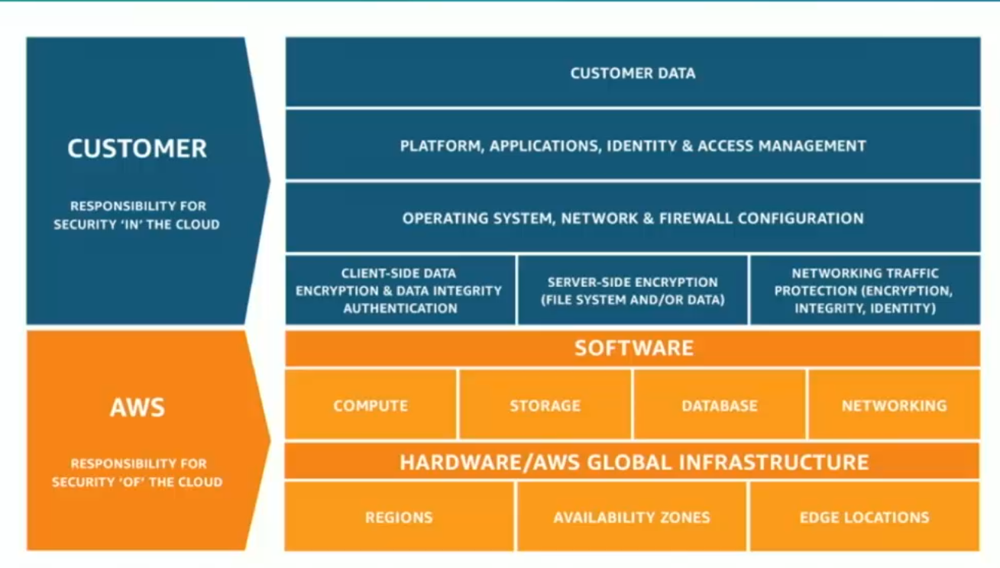
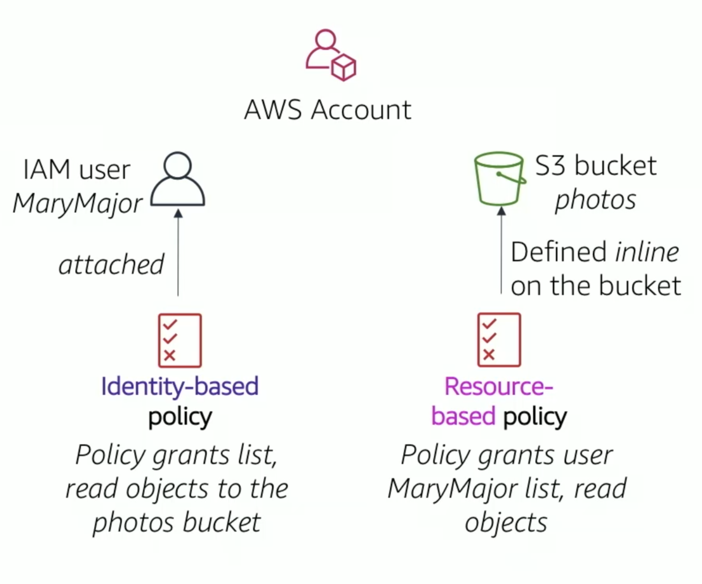
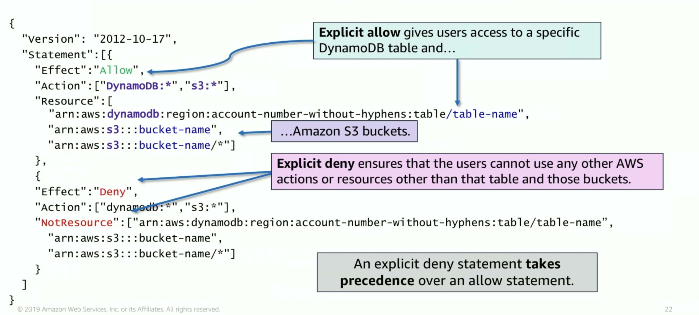
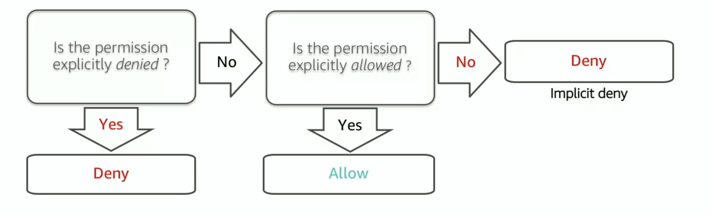
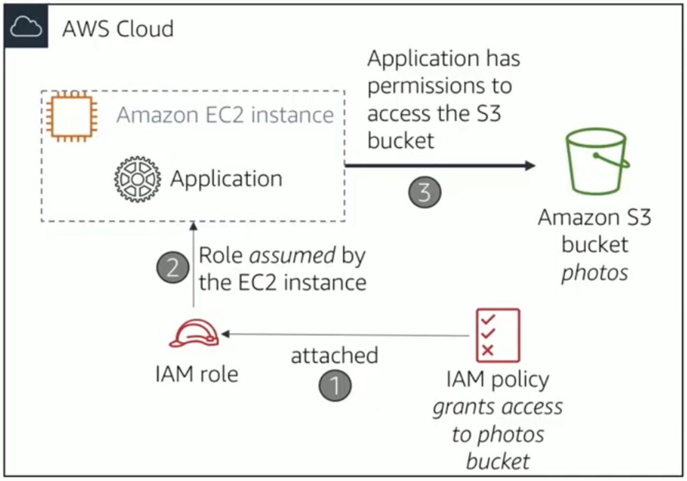
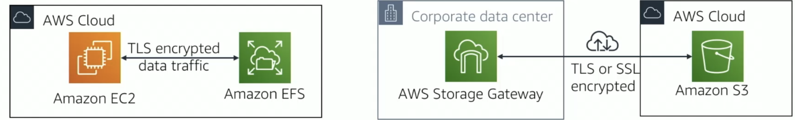

# Безопасность в облаке

<i>
Ночь выдалась на редкость тихой. Лаборатория спала, только серверы в углу гудели в полголоса, как будто шептались между собой. Эмма зевнула и взглянула на экран — строка логов не выглядела подозрительно, но что-то в глубине подсказывало ей: тишина бывает обманчива.

– Джон… ты это видишь? – тихо сказала она.

– Что?

– Кто-то вошёл в систему. Но не из наших.

Он резко поднял голову. Несколько окон на экране мигнули — в списке пользователей появилась новая сессия.

– Мы же никому не давали таких прав, – прошептал Джон. – Значит, кто-то нашёл ключ.

Он бросился к клавиатуре, проверяя IAM-политики. Эмма уже открывала журнал CloudTrail, отслеживая действия.

– Вот, – сказала она. – Подключение через старый ключ API. Мы забыли его удалить после тестов.

Джон сжал кулак:

— Принцип наименьших привилегий… Мы же сами об этом читали.

Всё происходило быстро: они отозвали ключ, заблокировали роль, включили MFA для всех пользователей. Система затихла. На экране снова замерли зелёные индикаторы.

Эмма сняла очки и устало улыбнулась:

— Иронично. Мы столько учили о безопасности, а забыли про самую простую вещь.

Джон усмехнулся, глядя на мерцающий экран:

— Теперь мы точно не забудем. В этом и есть урок облака: доверяй, но проверяй — особенно себя.

За окном шёл дождь. Капли стекали по стеклу, словно следы тех, кто пытался войти в их систему. Но теперь доступ был закрыт.
</i>

## Содержание

- [Безопасность в облаке](#безопасность-в-облаке)
  - [Содержание](#содержание)
  - [Вопросы для самопроверки](#вопросы-для-самопроверки)
  - [Определение безопасности в информационных технологиях](#определение-безопасности-в-информационных-технологиях)
    - [Определение безопасности](#определение-безопасности)
    - [Безопасность vs. Информационная безопасность](#безопасность-vs-информационная-безопасность)
    - [Кибербезопасность как современное направление ИБ](#кибербезопасность-как-современное-направление-иб)
  - [Почему безопасность критична?](#почему-безопасность-критична)
  - [Основные концепции информационной безопасности: CIA Triad](#основные-концепции-информационной-безопасности-cia-triad)
  - [Баланс между безопасностью и удобством использования](#баланс-между-безопасностью-и-удобством-использования)
  - [Принцип наименьших привилегий](#принцип-наименьших-привилегий)
  - [Информационная безопасность локальной инфраструктуры vs облака](#информационная-безопасность-локальной-инфраструктуры-vs-облака)
    - [Традиционный подход (On-Premises)](#традиционный-подход-on-premises)
    - [Облачный подход (Cloud)](#облачный-подход-cloud)
  - [Безопасность в AWS. AWS Shared Responsibility Model](#безопасность-в-aws-aws-shared-responsibility-model)
  - [Amazon Resource Names (ARN)](#amazon-resource-names-arn)
    - [Что такое ARN?](#что-такое-arn)
    - [Структура ARN](#структура-arn)
    - [Примеры ARN](#примеры-arn)
    - [Подстановочные символы](#подстановочные-символы)
  - [AWS Identity and Access Management (IAM)](#aws-identity-and-access-management-iam)
    - [Что такое IAM?](#что-такое-iam)
    - [Зачем нужен IAM?](#зачем-нужен-iam)
    - [Компоненты IAM](#компоненты-iam)
    - [Authentication (Аутентификация) в AWS](#authentication-аутентификация-в-aws)
      - [Доступ к консоли управления AWS (AWS Management Console)](#доступ-к-консоли-управления-aws-aws-management-console)
      - [Программный доступ через AWS CLI, SDK или API](#программный-доступ-через-aws-cli-sdk-или-api)
    - [Авторизация. Разрешения и политики в IAM](#авторизация-разрешения-и-политики-в-iam)
      - [Ключевые элементы политики IAM](#ключевые-элементы-политики-iam)
      - [Пример политики](#пример-политики)
      - [Явные запреты](#явные-запреты)
      - [Решение о разрешении](#решение-о-разрешении)
    - [Использование IAM Roles](#использование-iam-roles)
      - [Что такое роль?](#что-такое-роль)
      - [Сценарий использования IAM роли](#сценарий-использования-iam-роли)
    - [Лучшие практики безопасности IAM](#лучшие-практики-безопасности-iam)
  - [AWS Organizations](#aws-organizations)
    - [Основные концепции](#основные-концепции)
    - [Преимущества AWS Organizations](#преимущества-aws-organizations)
  - [AWS Secrets Manager](#aws-secrets-manager)
    - [Почему не просто хранить в коде?](#почему-не-просто-хранить-в-коде)
    - [Как работает Secrets Manager?](#как-работает-secrets-manager)
    - [Что можно хранить?](#что-можно-хранить)
    - [Пример использования](#пример-использования)
    - [Цена](#цена)
    - [Лучшие практики использования Secrets Manager](#лучшие-практики-использования-secrets-manager)
  - [Шифрование данных в AWS](#шифрование-данных-в-aws)
    - [Data at Rest (Данные в покое)](#data-at-rest-данные-в-покое)
    - [Data in Transit (Данные в пути)](#data-in-transit-данные-в-пути)
      - [TLS и SSL](#tls-и-ssl)
    - [AWS Key Management Service (KMS)](#aws-key-management-service-kms)
    - [Лучшие практики шифрования в AWS](#лучшие-практики-шифрования-в-aws)
  - [Другие сервисы безопасности AWS](#другие-сервисы-безопасности-aws)
  - [Как триада CIA достигается в AWS](#как-триада-cia-достигается-в-aws)
  - [Резюме](#резюме)

## Вопросы для самопроверки

После изучения данной темы вы должны уметь ответить на следующие вопросы:

1. В чем состоят основные цели информационной безопасности (_конфиденциальность_, _целостность_ и _доступность_) и почему они важны?
2. Как распределяется ответственность за безопасность между облачным провайдером и клиентом в модели совместной ответственности AWS (IaaS vs PaaS vs SaaS)?
3. Что означает _принцип наименьших привилегий_ и как он реализуется с помощью AWS IAM (пользователи, группы, роли, политики)?
4. Зачем нужна многофакторная аутентификация (MFA) и какие лучшие практики управления доступом и учетными записями следует соблюдать в AWS?
5. Что такое Amazon Resource Names (ARN) и как они используются для идентификации ресурсов в AWS?
6. Как работает сервис AWS Organizations для управления несколькими аккаунтами и какие преимущества он предоставляет?
7. Что такое AWS Secret Manager и как он помогает безопасно управлять секретами в облаке?
8. Какие сервисы реализуют триаду CIA (конфиденциальность, целостность, доступность) в AWS и как они работают?

## Определение безопасности в информационных технологиях

### Определение безопасности

_Безопасность_ — это состояние защищённости данных, систем и процессов от угроз, нарушающих их конфиденциальность, целостность и доступность. Иными словами, безопасность обеспечивает, чтобы информация оставалась достоверной, не изменялась посторонними и была доступна тем, кто имеет на это право [^7].

### Безопасность vs. Информационная безопасность

Понятие _безопасности_ само по себе шире — оно охватывает все виды защиты: физическую (например, защита оборудования и помещений), технологическую, организационную и правовую.
_Информационная безопасность (ИБ)_ — это частный случай безопасности, сфокусированный именно на защите информации и связанных с ней процессов.

_Информационная безопасность (ИБ)_ - это совокупность принципов и практик, направленных на защиту информации от несанкционированного доступа, изменения, уничтожения, раскрытия или использования. Она охватывает все формы информации - не только цифровые данные, но и бумажные документы, устные сведения, аудиозаписи и т.д.

Иными словами:

- _безопасность — это “зонтик”_, под которым находятся разные направления защиты (в том числе пожарная, физическая, экологическая и т. д.);
- _информационная безопасность_ — это сфера, обеспечивающая защиту данных и информационных систем.

### Кибербезопасность как современное направление ИБ

_Кибербезопасность_ — это применение принципов информационной безопасности в цифровом пространстве: сетях, интернете, облачных сервисах и устройствах.
Если ИБ охватывает любую форму информации (включая бумажные документы и устные сведения), то кибербезопасность защищает именно цифровые данные и инфраструктуру, подвергающиеся сетевым угрозам: вирусам, фишингу, DDoS-атакам и т. д.

_Таким образом_:

- _Безопасность_ — общее понятие защиты.
- _Информационная безопасность_ — защита всех видов информации.
- _Кибербезопасность_ — защита цифровой информации и сетевых систем.

## Почему безопасность критична?

По данным ежегодных отчётов о кибербезопасности, количество утечек данных растёт каждый год.

- Средняя стоимость утечки данных для компании составляет миллионы долларов
- Время обнаружения компрометации может занимать месяцы, что увеличивает ущерб
- Нарушения нормативно-правовых требований приводят к штрафам и репутационным потерям
- Утечки данных клиентов подрывают доверие и могут привести к потере бизнеса

Например, широко известны случаи утечек данных из облачных хранилищ, вызванных случайно открытым доступом к bucket в Amazon S3. В одном из исследований было подсчитано, что в 2018–2019 годах в результате неправильной настройки облачных сервисов (таких как открытые хранилища без паролей) по всему миру компрометировано более 33 миллиардов записей данных, а суммарный ущерб оценен в около 5 триллионов долларов1. Это показывает масштабы проблемы: одна-единственная ошибка конфигурации может привести к утечке данных миллионов пользователей [^1].

Еще одним из примеров является _трехчасовой сбой_ DynamoDB в регионе AWS US-EAST-1, который вызвал цепную реакцию отказов множества облачных сервисов. Причиной стал редкий race condition (состояние гонки) в системе автоматического управления DNS, что привело к тому, что около трёх часов сервисы не могли подключиться к DynamoDB, а полная восстановление заняла около 15 часов. Под удар попали такие компании и сервисы, как Snapchat, Roblox, Amazon, Reddit и другие, а также зависимые компоненты AWS вроде EC2, Lambda, ECS, Network Load Balancer и CloudWatch. Аналитическая компания CyberCube оценила застрахованные убытки в диапазоне от _38 миллионов до 581 миллиона долларов_ [^2].

Также стоит упомянуть инцидент связанный с Лувром. В 2025 году в Лувре произошёл крупный инцидент безопасности, в ходе которого была совершена кража ювелирных украшений. Расследование выявило, что система видеонаблюдения музея была защищена крайне слабыми паролями, такими как «Louvre», а используемое программное обеспечение было устаревшим. Эти уязвимости позволили злоумышленникам получить несанкционированный доступ к системам безопасности, что значительно усложнило оперативное реагирование на кражу. Инцидент подчёркивает важность современных стандартов кибербезопасности даже в таких известных учреждениях, как Лувр [^4][^5].

Эти примеры подчёркивают, насколько критична безопасность, особенно в облачных средах, где множество сервисов и данных взаимодействуют друг с другом.

Однако мотивация обеспечивать безопасность обусловлена _не только угрозой финансовых потерь_, но и необходимостью соблюдения законов и стандартов (например, GDPR, национальные законы о защите данных), поддержания доверия пользователей, сохранения непрерывности бизнеса. Кибератаки участились за последние годы – ежедневно по всему миру происходят тысячи инцидентов. Поэтому каждому специалисту, работающему с ИТ-системами и особенно с облачными ресурсами, важно понимать основы безопасности и уметь применять лучшие практики защиты.

Для структурированного понимания целей безопасности традиционно используют концепцию _CIA-триады_: конфиденциальность, целостность и доступность. Рассмотрим ее подробнее.

## Основные концепции информационной безопасности: CIA Triad

В информационной безопасности существует три фундаментальных принципа, которые образуют так называемую CIA Triad (триада CIA) [^8]:

- _C_ - Confidentiality (Конфиденциальность)
- _I_ - Integrity (Целостность)
- _A_ - Availability (Доступность)

_Конфиденциальность (confidentiality)_ – обеспечение того, что информация доступна только тем, кто имеет на нее право. Проще говоря, предотвращение несанкционированного доступа и разглашения данных.

- _Пример_: переписка в мессенджере должна быть видна только участникам, а персональные данные клиентов компании не должны утекать посторонним.
- _Меры для поддержки конфиденциальности_ включают шифрование данных, системы контроля доступа, аутентификацию пользователей.

_Integrity (Целостность)_. Данные не должны быть изменены неавторизованно. Когда информация хранится или передаётся, она должна оставаться неизменной и надёжной.

- _Пример_: финансовый отчет компании не должен быть подправлен после утверждения, а файл в облачном хранилище – испорчен вирусом. Для обеспечения целостности используются контрольные суммы, цифровые подписи, системы обнаружения вмешательства.
- _Для обеспечения целостности используются_ контрольные суммы, цифровые подписи, системы обнаружения вмешательства.

_Availability (Доступность)_. Данные и системы должны быть доступны для авторизованных пользователей, когда они им требуются. Система не должна быть недоступной из-за отказа или атаки.

- _Пример_: интернет-банк должен работать 24/7, а отказ в обслуживании из-за DDoS-атаки нарушает доступность.
- _Обеспечение доступности включает_ резервирование компонентов, отказоустойчивость, системы аварийного восстановления (disaster recovery), защиту от перегрузок (_например_, использование балансировщиков нагрузки, CDN, защиты от DDoS).

Все три элемента одинаково важны. Избыток внимания к одному за счёт других может привести к проблемам. Например, если вы сосредоточитесь только на конфиденциальности и сделаете систему невозможной в использовании, вы нарушите доступность.

Применяя триаду CIA к облачным решениям, стоит помнить: провайдеры облака (такие как AWS) предлагают инструменты для реализации каждой из этих целей (_например_, шифрование для конфиденциальности, контроль версий и журналы аудита для целостности, системы резервирования и распределения нагрузки для доступности). Но правильная настройка и использование этих средств лежит на клиенте облака.

## Баланс между безопасностью и удобством использования

Однако существует риск чрезмерного усложнения системы безопасности — это явление называют _OverSecurity_.

Безопасность безусловно важна, но необходимо сохранять баланс между защитой и удобством. Излишняя строгость мер может затруднить работу с приложением и отрицательно повлиять на его эффективность.

Представьте, что ваше приложение — это дом с множеством дверей, и каждая из них — элемент защиты. Пользователь с интересом откроет первую дверь, терпеливо — вторую, но уже у третьей начнёт задумываться, стоит ли продолжать. А если дверей окажется сотня, он попросту развернётся и уйдёт.

Поэтому важно соблюдать _золотую середину_: обеспечить достаточный уровень безопасности, не превращая взаимодействие с системой в испытание на выносливость.

## Принцип наименьших привилегий

Одним из краеугольных принципов кибербезопасности является принцип _least privilege_ (_принцип наименьших привилегий_).

_Этот принцип означает_: каждый пользователь, приложение и процесс должны иметь ровно столько доступа, сколько им необходимо для выполнения своей работы — и ничего больше [^9].

Представьте, что сотрудник отдела продаж получил администраторский доступ ко всей системе. Даже если этот сотрудник честен, его учётная запись может быть скомпрометирована. Если злоумышленник получит эти учётные данные, он получит полный контроль над системой. Данный пример иллюстрирует проблему перегруженности прав (over-privilege).

_Перегруженность правами (over-privilege)_ – ситуация, когда пользователям или приложениям предоставлено больше доступа, чем нужно. Это часто происходит из удобства – например, дают сразу роль администратора, чтобы “_наверняка хватило прав_” – но в дальнейшем такой подход создает бомбу замедленного действия.

Обратная ситуация – _недостаточные права (under-privilege)_ – тоже не идеальна, хотя и менее опасна с точки зрения безопасности. Если сотрудникам для работы постоянно не хватает каких-то прав, им приходится запрашивать доступ или искать обходные пути, что снижает эффективность работы и может привести к тому, что безопасность начнут обходить.

## Информационная безопасность локальной инфраструктуры vs облака

Сравним, как различаются вызовы информационной безопасности в облачной среде и традиционной инфраструктуре на месте (on-premises).

### Традиционный подход (On-Premises)

Когда компания владеет физическими серверами в собственном дата-центре (on-premises):

- компания отвечает за всё: от физической безопасности здания до управления сетевыми брандмауэрами
- компания контролирует каждый аспект инфраструктуры
- это требует больших капиталовложений и квалифицированного персонала

### Облачный подход (Cloud)

В облаке ответственность распределяется между поставщиком облачных услуг и клиентом:

- облачный провайдер (например, AWS) отвечает за безопасность инфраструктуры
- клиент отвечает за безопасность своих данных и приложений
- это позволяет компаниям сосредоточиться на своём бизнесе, а не на управлении физической инфраструктурой

Несмотря на многочисленные преимущества облака, оно также приносит новые вызовы безопасности, такие как управление доступом, защита данных в движении и покое, а также обеспечение соответствия нормативным требованиям. Поэтому многие организации не полностью переходят в облако, а используют гибридные модели, сочетая on-premises и облачные ресурсы.

## Безопасность в AWS. AWS Shared Responsibility Model

Одним из базовых принципов облачной безопасности является модель совместной (разделенной) ответственности (_Shared Responsibility Model_). Согласно этой модели, обязанности по обеспечению безопасности разделены между провайдером и клиентом.

_AWS Shared Responsibility Model_ (Модель общей ответственности AWS) — это концепция, которая объясняет, за какие аспекты безопасности отвечает AWS, а за какие отвечают клиенты [^10].

AWS часто выражает это как:

- AWS отвечает за безопасность облака (Security _of the_ Cloud)
- Клиенты отвечают за безопасность в облаке (Security _in the_ Cloud)

_AWS_ как поставщик услуги гарантирует:

- _Физическая безопасность дата-центров_. Здания защищены: контроль доступа, видеонаблюдение, охранники.
- _Безопасность оборудования и сети_. Серверы, маршрутизаторы, коммутаторы защищены и поддерживаются в надлежащем состоянии.
- _Виртуализация и изоляция_. AWS использует технологии гипервизора, чтобы убедиться, что ваша виртуальная машина полностью отделена от машин соседей.
- _Обнаружение вторжений_. AWS имеет системы мониторинга, которые обнаруживают подозрительную активность в инфраструктуре.
- _Версионирование и обновления оборудования_. AWS регулярно обновляет и заменяет оборудование.

_Клиент_, развёртывающий приложение в AWS, отвечает за:

- _Управление доступом и идентификацией_. Кто может получить доступ к вашим ресурсам и что они могут делать.
- _Данные_. Какие данные вы загружаете в облако, их классификация и обработка.
- _Приложения_. Код приложения должен быть безопасным и свободным от уязвимостей.
- _Операционная система_. Если вы используете виртуальную машину, вы отвечаете за установку патчей и обновления ОС.
- _Конфигурация сети и брандмауэра_. Какие порты открыты, кто может подключиться.
- _Шифрование данных_. Нужно ли зашифровать данные до отправки на AWS.

<center>



_Рисунок 1. AWS Shared Responsibility Model_

</center>

Часто, разделение ответственности зависит от типа облачной услуги (IaaS, PaaS, SaaS):

В случае IaaS (например, EC2) клиент получает больше всего контроля и, следовательно, больше ответственности:

- AWS отвечает: за физическую безопасность, оборудование, сетевую инфраструктуру, гипервизор.
- Клиент отвечает: за ОС (включая патчи), приложения, данные, конфигурацию сети и брандмауэра.

В случае PaaS (например, Lambda, RDS) AWS берет на себя больше обязанностей:

- AWS отвечает: за инфраструктуру, ОС, базовый софт (например, базу данных для RDS), сетевую конфигурацию.
- Клиент отвечает: за данные, приложения, которые он пишет, управление пользователями.

А в случае SaaS (например, S3) AWS берет на себя большую часть ответственности:

- AWS отвечает: за инфраструктуру, ОС, приложение, обновления, безопасность.
- Клиент отвечает: в основном за данные, которые он загружает, и конфигурацию доступа.

Непонимание границ ответственности может привести к серьёзным проблемам:

- Если вы думаете, что AWS отвечает за управление доступом в вашем приложении, но это не так, вы можете случайно предоставить доступ всем.
- Если вы не обновляете ОС на вашей EC2 машине, вы оставляете известные уязвимости открытыми.
- Если вы загружаете зашифрованные данные в облако, но теряете ключ, AWS не сможет вам помочь.

## Amazon Resource Names (ARN)

Прежде чем углубляться в управление доступом, нам нужно познакомиться с концепцией _ARN (Amazon Resource Name)_ — это уникальный идентификатор для любого ресурса в AWS [^11].

### Что такое ARN?

_ARN_ — это строка, которая однозначно идентифицирует конкретный ресурс в AWS. Она имеет стандартный формат, который позволяет легко ссылаться на ресурсы в политиках доступа.

### Структура ARN

ARN строится по следующей схеме:

```
arn:partition:service:region:account-id:resource-type/resource-id
```

- `arn`: фиксированная часть, обозначающая, что это ARN.
- `partition`: раздел AWS (обычно aws для стандартной AWS). Существуют также aws-cn для Китая и aws-us-gov для правительственных облаков.
- `service` — название сервиса (например, `s3`, `ec2`, `iam`, `rds`)
- `region` — регион AWS (например, `us-east-1`, `eu-west-1`). Для глобальных сервисов (например, S3) это поле может быть пустым
- `account-id` — 12-значный ID вашего AWS аккаунта
- `resource-type` и `resource-id` — тип и уникальный идентификатор ресурса

### Примеры ARN

Давайте посмотрим на реальные примеры:

- S3 bucket:

  ```
  arn:aws:s3:::my-bucket
  ```

  _Обратите внимание: для S3 buckets нет region и account-id_, так как они глобальны.

- Объект в S3 bucket:

  ```
  arn:aws:s3:::my-bucket/path/to/object.txt
  ```

- EC2 instance

  ```
  arn:aws:ec2:us-east-1:123456789012:instance/i-0123456789abcdef0
  ```

- RDS database

  ```
  arn:aws:rds:us-west-2:123456789012:db:mysql-db
  ```

- Lambda function:

  ```
  arn:aws:lambda:us-east-1:123456789012:function:my-function
  ```

### Подстановочные символы

В некоторых случаях вы можете использовать подстановочные символы (`*`) для обозначения нескольких ресурсов:

```bash
# Это означает: все объекты в bucket my-bucket
arn:aws:s3:::my-bucket/*
```

```bash
# Это означает: все EC2 instances в вашем аккаунте во всех регионах
arn:aws:ec2:*:123456789012:instance/*
```

## AWS Identity and Access Management (IAM)

Одним из ключевых сервисов для управления безопасностью в AWS является _AWS Identity and Access Management (IAM)_.

### Что такое IAM?

_AWS Identity and Access Management (IAM)_ – это центральный, глобальный сервис AWS для управления _аутентификацией_ (проверкой личности) и _авторизацией_ (разрешениями) пользователей и сервисов [^6][^12].

### Зачем нужен IAM?

Представьте, что вы создаёте облачное приложение для компании. К этому приложению будут обращаться:

- разработчики, которым нужен полный доступ для разработки
- тестировщики, которым нужен доступ только к тестовой базе данных
- операционная группа, которой нужно перезагружать серверы
- клиенты приложения, которым нужен доступ только к своим данным

Без IAM вы бы дали всем root credentials (учётные данные администратора) — это огромный риск безопасности. С IAM вы можете давать каждому ровно столько доступа, сколько ему нужно.

### Компоненты IAM

IAM состоит из нескольких ключевых компонентов:

- _IAM User_ — представляет конкретного субъекта, которому нужны доступы к AWS. Обычно это человек (например, разработчик нуждается в доступе к AWS-консоли и API) или сервис (например, приложение, которому нужны ключи доступа для вызова AWS API). Пользователь IAM имеет свои учетные данные для входа. По умолчанию новый IAM-пользователь не имеет никаких прав до тех пор, пока ему не назначены соответствующие разрешения.
- _IAM Group_ — логическое объединение пользователей для совместного управления их правами. Группы позволяют назначать политики доступа сразу на группу, а не на каждого пользователя отдельно. Пример: можно создать группу “Developers” и назначить ей политику с правами на разработческие ресурсы; затем добавить в эту группу всех разработчиков – каждый унаследует эти права.
- _IAM Policy_ — JSON-документ, описывающий набор разрешений. Политики отвечают на 3 вопроса: кто (пользователь или группа), что (какие действия) и на какие ресурсы (например, S3 bucket). Политика может применяться (прикрепляться) к пользователю, группе или роли – тем самым определяя их права.
- _IAM Role_ — особый вид идентификации в AWS, предназначенный для временного получения прав. Роль не привязана жестко к одному человеку или сервису, ее может “примерить” любой, кому эта возможность разрешена. Обычно роли используются в двух ситуациях:

  1. Для предоставления прав AWS-сервисам или приложениям. Например, вы запускаете приложение на EC2 и хотите дать ему доступ к S3-бакету – правильный подход создать роль с нужными правами к S3 и “прикрепить” эту роль к EC2-инстансу.
  2. Для организации доступа между аккаунтами или внешними пользователями. Например, у вас две учетные записи AWS и нужно, чтобы пользователь одной мог действовать в другой.

### Authentication (Аутентификация) в AWS

_Аутентификация_ — это процесс, когда вы доказываете, что вы действительно тот, за кого себя выдаёте [^13]. Аутентификация в AWS осуществляется с помощью сервиса IAM и включает два основных метода:

- Доступ через консоль управления AWS (AWS Management Console)
- Программный доступ через AWS CLI, SDK или API

#### Доступ к консоли управления AWS (AWS Management Console)

Интерактивный вход через веб-браузер. Пользователю задается имя (логин) и пароль.

Для входа в консоль IAM-пользователь указывает:

- ID аккаунта (или его alias)
- Имя пользователя (IAM-логин)
- Пароль

Если для пользователя или аккаунта включена MFA [^14], то после ввода пароля потребуетсya ввести одноразовый код. Консоль удобна для ручного управления ресурсами, визуального интерфейса.

> Данный метод подходит для администраторов и разработчиков, которые управляют ресурсами вручную.

#### Программный доступ через AWS CLI, SDK или API

Доступ для AWS API, CLI, SDK. В этом случае пользователю генерируется пара _Access Key ID_ и _Secret Access Key_ - строки, служащие аналогом логина и пароля для API-вызовов.

С этими ключами пользователь (или приложение) может выполнять команды AWS CLI, использовать SDK (например, boto3 для Python) для управления ресурсами.

_IAM-пользователь_ может иметь оба типа доступа или только один из них. _Например_, сервисным аккаунтам часто не нужен пароль для консоли – только ключи, и наоборот, людям бывает нужны только интерактивные доступы.

### Авторизация. Разрешения и политики в IAM

_Авторизация_ - это процесс определения, что именно пользователь или сервис может делать после успешной аутентификации. В AWS IAM авторизация осуществляется с помощью _политик_, которые можно прикреплять к пользователям, группам и ролям.

_IAM Policy_ – сердце системы авторизации AWS. Политика представляет собой документ в формате JSON, который описывает, какие действия разрешены или запрещены, для какого субъекта и над какими ресурсами [^15].

Политики бывают двух типов:

- Именные (Identity-based policies) – прикрепляются к пользователям, группам или ролям. Определяют, что этот субъект может делать.
- Ресурсные (Resource-based policies) – прикрепляются непосредственно к ресурсам (например, S3 bucket policy). Определяют, кто и что может делать с этим ресурсом.

<center>



_Рисунок 2. Типы политик IAM_

</center>

#### Ключевые элементы политики IAM

Политика IAM, это JSON-документ, который состоит из следующих ключевых элементов:

- `Version` – дата версии синтаксиса (актуальная – "2012-10-17").
- `Statement` – один или несколько объектов, каждый из которых задает отдельное правило (разрешение или запрет).
- В каждом `Statement` указываются:
  - `Effect`: значение `Allow` (разрешить) или `Deny` (запретить).
  - `Action` — какие действия разрешены (например, `s3:GetObject`, `ec2:TerminateInstances`)
  - `Resource` — к каким ресурсам применяется действие. Обычно это ARN ресурса. Например, ARN вида "arn:aws:s3:::my-bucket/\*" обозначает «все объекты внутри бакета my-bucket»
  - `Condition` (опционально) — дополнительные условия (например, IP адрес, время суток)

#### Пример политики

_Политика, которая позволяет пользователю читать объекты из конкретного S3 bucket_:

```json
{
  "Version": "2012-10-17",
  "Statement": [
    {
      "Effect": "Allow",
      "Action": ["s3:GetObject"],
      "Resource": ["arn:aws:s3:::my-bucket/*"]
    }
  ]
}
```

Разберем данный пример:

- `Version` — версия языка политик (почти всегда 2012-10-17)
- `Statement` — это массив выражений. Политика может содержать несколько выражений
- `Effect: Allow` — разрешить
- `Action: s3:GetObject` — действие чтения объекта из S3
- `Resource: arn:aws:s3:::my-bucket/*` — все объекты в bucket my-bucket

_Политика, которая позволяет читать и записывать в конкретный bucket, но запрещает удалять_:

```json
{
  "Version": "2012-10-17",
  "Statement": [
    {
      "Effect": "Allow",
      "Action": ["s3:GetObject", "s3:PutObject"],
      "Resource": "arn:aws:s3:::my-bucket/*"
    },
    {
      "Effect": "Deny",
      "Action": ["s3:DeleteObject"],
      "Resource": "arn:aws:s3:::my-bucket/*"
    }
  ]
}
```

Также AWS имеет множество управляемых (менеджерных) политик: например, `AmazonEC2FullAccess`, `AWSLambdaExecute`, `AdministratorAccess` и т.п. Эти политики поддерживаются AWS и обновляются по мере появления новых действий. Их удобно использовать, чтобы быстро дать стандартный набор прав. Например, чтобы дать разработчику полноуправление всеми EC2-сервисами, можно просто прикрепить `AWSManagedPolicy` с именем `AmazonEC2FullAccess`.

> Политики могут быть довольно сложными, с множеством действий и условий. Писать их вручную в JSON – возможно, но требует аккуратности. Поэтому AWS предоставляет удобный Visual Editor для политик в консоли. В визуальном редакторе вы последовательно выбираете сервис, нужные действия (из выпадающего списка), указываете ресурс (можно ARN подсказать, или для некоторых сервисов выбрать конкретный существующий ресурс), задаете условия, а система сама формирует JSON-политику. Можно переключаться между визуальным режимом и JSON-вкладкой. Визуальный редактор помогает избегать синтаксических ошибок и знакомит с доступными действиями.

<center>



_Рисунок 3. Пример политики AWS_

</center>

#### Явные запреты

По умолчанию, все запрещено, пока не разрешено. Однако IAM позволяет также явно запрещать (`"Effect": "Deny"`) что-то даже при наличии разрешающих политик. Так реализуются жесткие ограничения. Например, можно иметь общую политику, запрещающую всем пользователям удалять некий критичный ресурс – и даже администратор, случайно запустивший скрипт с удалением, _получит отказ_.

#### Решение о разрешении

AWS использует следующий алгоритм при разрешении и запрещении действия:

1. По умолчанию все действия запрещены (_implicit deny_).
2. Если существует явное разрешение (`Allow`), действие допускается.
3. Если существует явный запрет (`Deny`), действие блокируется при любых условиях, поскольку `Deny` имеет наивысший приоритет.

<center>



_Рисунок 4. Диаграмма решения о разрешении IAM_

</center>

### Использование IAM Roles

_IAM Role_ — это более специализированная концепция, которая позволяет делегировать доступ.

#### Что такое роль?

Роль похожа на IAM User, но с важным отличием: _роль не имеет постоянных учётных данных_. Вместо этого, когда нужно дать доступ, любая сущность (человек, приложение, или другой AWS сервис) может "взять" эту роль и получить права на ограниченное время.

_Аналогия_: если IAM User — это конкретный работник с именным значком, то IAM Role — это значок "Временный подрядчик", который может надеть любой, кому он нужен, на определённое время.

У ролей есть несколько преимуществ:

- _Временный доступ_. Роль выдаёт временные учётные данные, которые автоматически заканчиваются
- _Делегирование_. Одна сущность может передать роль другой
- _AWS сервисы_. Сервисы AWS могут использовать роли для выполнения действий
- _Cross-account доступ_. Роли позволяют пользователю из одного AWS аккаунта получить доступ к ресурсам другого

#### Сценарий использования IAM роли

Представьте реальный сценарий: у вас есть приложение на EC2 instance, которое должно читать файлы из S3 bucket.

Без ролей (_неправильно_):

- Вы создаёте IAM User с Access Keys
- Вы передаёте эти keys приложению
- Если кто-то скомпрометирует приложение, он получит постоянный доступ к AWS
- Ключи жёстко закодированы в коде или файлах конфигурации

С ролями (_правильно_):

- Вы создаёте IAM Role с политикой, позволяющей читать S3
- Вы прикрепляете роль к EC2 instance через Instance Profile
- EC2 instance автоматически получает временные учётные данные из AWS STS (Security Token Service)
- Эти учётные данные автоматически обновляются каждый час
- Если кто-то скомпрометирует приложение, доступ ограничен

<center>



_Рисунок 5. Пример использования IAM роли_

</center>

### Лучшие практики безопасности IAM

Ниже рассмотрены основные рекомендации по безопасности при использовании AWS IAM [^16]:

1. _Не используйте root user в повседневной работе_. Создайте IAM User для администратора и используйте его для логина.
2. _Используйте роли вместо пользователей для приложений_. Приложения должны использовать роли, а не Access Keys пользователей.
3. _Включайте MFA_. Обязательно включайте MFA для root user и всех пользователей с повышенными привилегиями.
4. _Управляйте ключами доступа_. Регулярно ротируйте Access Keys (меняйте их), старые ключи удаляйте.
5. _Следуйте принципу наименьших привилегий_. Давайте только необходимые разрешения, ничего больше.
6. _Используйте AWS managed policies_. AWS предоставляет готовые политики, которые охватывают типичные случаи.
7. _Мониторьте активность_. Используйте AWS CloudTrail для логирования всех действий IAM.
8. _Удаляйте ненужные сущности_. Удаляйте IAM Users, Groups, Roles и Policies, которые больше не используются.

## AWS Organizations

Когда компания растёт, у неё часто появляется несколько AWS аккаунтов:

- отдельный аккаунт для разработки
- отдельный аккаунт для тестирования
- отдельный аккаунт для production
- отдельные аккаунты для разных отделов

_AWS Organizations_ — это сервис, который позволяет вам управлять несколькими AWS аккаунтами централизованно [^17].

### Основные концепции

_Root_ — корневой аккаунт вашей организации.

_Organizational Unit (OU)_ — способ группировки аккаунтов. Например, вы можете создать OU "Development" и OU "Production".

_Service Control Policy (SCP)_ — политика, которая определяет максимальные разрешения для аккаунта в OU [^18].

SCPs очень схожи с IAM политиками, но важно понимать разницу:

- IAM Policies — говорят, что разрешено делать
- SCPs — говорят, что может быть максимально разрешено

Если SCP говорит, что максимум EC2 instances, которые вы можете создать на аккауте "Production" — 10, то IAM Policy на данном аккаунте не сможет дать разрешение создать 11-й, но может ограничить количество до 9.

> SCPs устанавливают "потолок" для разрешений, а IAM Policies работают в этих рамках.

### Преимущества AWS Organizations

- _Централизованное биллинговое управление_. Все аккаунты платят через один мастер-аккаунт.
- _Централизованное управление доступом_. Вы можете применить политики ко всем аккаунтам сразу.
- _Лучшая безопасность_. Разделение аккаунтов означает, что взлом одного аккаунта не повлияет на другие.
- _Упрощение управления_. Вы можете управлять множеством аккаунтов как одной единицей.

## AWS Secrets Manager

Современные приложения оперируют множеством _секретов_ – это могут быть пароли к базам данных, ключи API сторонних сервисов, приватные ключи для шифрования или OAuth-токены. Категорически небезопасно хранить такие секреты в коде, в открытом виде в репозиториях или в настройках, где к ним могут получить доступ посторонние.

_AWS Secrets Manager_ – это специализированный сервис для хранения и управления конфиденциальной информацией (секретами) в зашифрованном виде с контролем доступа и возможностью автоматической ротации [^19].

### Почему не просто хранить в коде?

Если вы жёстко закодируете пароль базы данных в коде:

- пароль будет видно всем, кто имеет доступ к коду
- если кто-то нашёл утечку кода на GitHub, пароль скомпрометирован
- если нужно изменить пароль, нужно изменить код и пересоздать приложение

### Как работает Secrets Manager?

1. Вы создаёте "секрет" (например, пароль БД) и сохраняете его в Secrets Manager
2. Secrets Manager шифрует его и хранит безопасно
3. Ваше приложение запрашивает секрет через API Secrets Manager
4. Secrets Manager проверяет, имеет ли приложение (или IAM Role приложения) разрешение на доступ к секрету
5. Если разрешено, Secrets Manager возвращает расшифрованный секрет

### Что можно хранить?

В AWS Secret Manager можно хранить различные типы секретов, включая, но не ограничиваясь:

- Пароли для баз данных
- API ключи
- Учётные данные OAuth
- SSH ключи
- Сертификаты

### Пример использования

Представьте приложение на EC2, которое подключается к базе данных RDS. Вместо того, чтобы хранить пароль базы данных в коде, вы:

1. Создаёте секрет в Secrets Manager с паролем базы данных
2. Настраиваете IAM Role для EC2 instance, которая имеет разрешение на чтение этого секрета
3. В коде приложения запрашиваете секрет из Secrets Manager
4. Используете полученный пароль для подключения к базе данных

_Пример получения секрета в Node.js_:

```javascript
import { SecretsManagerClient, GetSecretValueCommand } from '@aws-sdk/client-secrets-manager';

const client = new SecretsManagerClient({ region: 'us-east-1' });

async function getSecret(secretName) {
  const command = new GetSecretValueCommand({ SecretId: secretName });
  const response = await client.send(command);
  return response.SecretString;
}

(async () => {
  const secret = await getSecret('project-prod-db-password');
  console.log('Database Password:', secret);
})();
```

### Цена

Secrets Manager платный сервис (примерно $0.40 за секрет в месяц + $0.05 за 10 000 API вызовов), но его преимущества в безопасности и управлении часто оправдывают затраты.

### Лучшие практики использования Secrets Manager

1. _Используйте Secrets Manager для всех секретов_. Не храните секреты в коде или переменных окружения.
2. _Ограничивайте доступ_. Только то приложение или пользователь, которому нужен доступ, должен его получить
3. _Регулярно ротируйте секреты_. Периодически меняйте пароли.
4. _Включайте логирование_. Логируйте все обращения к секретам.

## Шифрование данных в AWS

Безопасность данных — это критическая часть облачной безопасности. AWS предоставляет несколько способов для защиты данных через шифрование [^20].

### Data at Rest (Данные в покое)

_Data at Rest_ — это данные, которые хранятся на диске, в базе данных или в другом хранилище. Они не перемещаются по сети.

Шифрование данных _at rest_ означает, что даже если кто-то получит физический доступ к жёсткому диску сервера, он не сможет прочитать данные без ключа.

Как работает шифрование at rest:

1. Ваши данные в открытом виде отправляются на AWS
2. AWS автоматически шифрует их перед сохранением на диск
3. Данные хранятся в зашифрованном виде
4. Когда вы запрашиваете данные, AWS расшифровывает их и отправляет вам

Сервисы AWS, поддерживающие шифрование at rest:

- Amazon S3
- Amazon EBS (диски для EC2)
- Amazon EFS (файловая система)
- Amazon RDS (базы данных)
- Amazon DynamoDB

### Data in Transit (Данные в пути)

_Data in Transit_ — это данные, которые перемещаются по сети: между вашим компьютером и облаком, между сервисами AWS, между облаком и локальным дата-центром.

Шифрование данных in transit означает, что если кто-то попытается перехватить данные, пока они перемещаются по сети, он не сможет их прочитать.

#### TLS и SSL

Для защиты данных in transit используется протокол _TLS_ (Transport Layer Security), который раньше называли _SSL_ (Secure Socket Layer) [^21].

_Как это работает_:

- Ваш браузер или приложение подключается к серверу AWS через HTTPS (HTTP over TLS)
- Они согласуют специальный шифровальный ключ
- Все данные, которые передаются, шифруются этим ключом
- Любой, кто перехватит данные, увидит только шифрованный поток, который невозможно прочитать

<center>



_Рисунок 6. Шифрование данных in transit с помощью TLS_

</center>

### AWS Key Management Service (KMS)

_AWS KMS_ – сервис для управления криптографическими ключами и выполнения криптоопераций [^22]. С его помощью вы можете создавать и безопасно хранить _Master Keys_ (основные ключи шифрования), а затем использовать их для шифрования данных, либо для генерации/шифрования других ключей.

_Примеры использования KMS_:

Представьте, что вы хотите зашифровать S3 bucket с помощью KMS:

1. Вы создаёте Customer Master Key (CMK) в KMS
2. Вы настраиваете S3 bucket, чтобы использовать этот CMK для шифрования
3. Когда вы загружаете объект в S3, AWS использует CMK для шифрования данных
4. Когда вы запрашиваете объект, AWS использует CMK для расшифровки
5. Вы можете управлять доступом к CMK через IAM политики

### Лучшие практики шифрования в AWS

Включайте шифрование для всех сервисов, которые его поддерживают. Это добавляет защиту с минимальными накладными расходами на производительность.
ф
## Другие сервисы безопасности AWS

1. _AWS Shield_. Это управляемый сервис защиты от DDoS атак (Distributed Denial of Service) [^23]. AWS Shield работает на разных уровнях:

   - на уровне сетевого уровня (Layer 3-4)
   - на уровне приложения (Layer 7)

   _AWS Shield Standard_ включён по умолчанию и бесплатен. Он защищает от типичных DDoS атак. _AWS Shield Advanced_ — платная услуга с дополнительной защитой от больших атак.

2. _Amazon Cognito_. Это сервис для управления пользователями и аутентификацией [^24]. Он позволяет легко добавлять регистрацию, вход и управление пользователями в ваши приложения.
3. _AWS Config_. Это сервис для мониторинга конфигурации ваших ресурсов AWS [^25]. Сервис отслеживает изменения и помогает обеспечивать соответствие политикам безопасности. _Например_:
   - имеет ли ваш S3 bucket публичный доступ (он не должен)?
   - все ли EC2 instances имеют необходимые теги безопасности?
   - какие изменения были сделаны в конфигурации ресурсов?
4. _AWS CloudTrail_. Это сервис логирования, который записывает все действия в вашем AWS аккаунте [^26]. CloudTrail логирует:

   - _кто_ выполнил действие (какой IAM пользователь или роль)
   - _какое_ действие было выполнено (какой API был вызван)
   - _когда_ это произошло (timestamp)
   - _где_ это произошло (регион, IP адрес)
   - _результат_ (успешно или ошибка)

   CloudTrail сохраняет логи в S3 bucket, который вы указываете.

> AWS Config полезен для соответствия нормативным требованиям (compliance) и аудита.

## Как триада CIA достигается в AWS

Триада _CIA_ достигается в AWS с помощью различных сервисов и практик:

- _Confidentiality (Конфиденциальность)_: Использование IAM для контроля доступа, шифрование данных at rest и in transit, использование Secrets Manager для управления секретами.
- _Integrity (Целостность)_: Использование AWS KMS для шифрования, контроль версий в S3, использование AWS Config для мониторинга изменений.
- _Availability (Доступность)_: Использование AWS Shield для защиты от DDoS атак, настройка резервного копирования и восстановления, использование нескольких Availability Zones для отказоустойчивости.

## Резюме

- _Безопасность_ — это основа облака. Триада CIA (Confidentiality, Integrity, Availability) определяет все аспекты безопасности.
- _Распределённая ответственность_. AWS отвечает за безопасность облака, а клиенты — за безопасность в облаке. Понимание границ критично.
- _IAM_ — это ваш инструмент управления доступом. Users, Groups, Policies, и Roles позволяют вам давать ровно нужный доступ каждому.
- _Принцип наименьших привилегий_ - это принцип, который означает, что каждый субъект должен иметь только те права, которые необходимы для выполнения его задач.
- _Аутентификация и авторизация_ — разные вещи. Аутентификация — это доказательство того, что вы тем, за кого себя выдаёте. Авторизация — это определение того, что вы можете делать.
- _Шифрование_ защищает данные. Как данные at rest (в хранилище), так и данные in transit (по сети).
- _AWS_ предоставляет инструменты, но вы отвечаете за их использование. IAM, KMS, Secrets Manager, CloudTrail — всё это уже в облаке. Ваша задача — использовать их правильно.
- _Безопасность — это процесс, а не продукт_. Регулярно проверяйте ваши политики, обновляйте разрешения, ротируйте ключи и следуйте лучшим практикам.

[^1]: _2020 Cloud Misconfigurations Report_. DivvyCloud [online]. Available at: https://www.rapid7.com/globalassets/_pdfs/whitepaperguide/cloud-misconfiguration-report.pdf
[^2]: _Reliability lessons from the 2025 AWS DynamoDB outage_. Gremlin [online]. Available at: https://www.gremlin.com/blog/reliability-lessons-from-the-2025-aws-dynamodb-outage
[^3]: _Amazon’s Outage Root Cause, $581M Loss Potential And ‘Apology:’ 5 AWS Outage Takeaways_. CRN [online]. Available at: https://www.crn.com/news/cloud/2025/amazon-s-outage-root-cause-581m-loss-potential-and-apology-5-aws-outage-takeaways
[^4]: _Louvre heist sparks cross-party ire amid reports of ‘persistent delays’ to security updates_. theartnewspaper.com [online]. Available at: https://www.theartnewspaper.com/2025/10/20/louvre-heist-sparks-ire-amid-reports-of-persistent-delays-security-updates
[^5]: _The Louvre Used Its Own Name as a Password. Here’s What to Learn From It_. McAfee [online]. Available at: https://www.mcafee.com/blogs/security-news/the-louvre-used-its-own-name-as-a-password-heres-what-to-learn-from-it/
[^6]: _What is IAM?_. docs.aws.amazon.com [online]. Available at: https://docs.aws.amazon.com/IAM/latest/UserGuide/introduction.html
[^7]: _Security pillar_. docs.aws.amazon.com [online]. Available at: https://docs.aws.amazon.com/wellarchitected/latest/security-pillar/welcome.html ↩
[^8]: _Confidentiality, integrity and availability (CIA triad)_. techtarget.com [online]. Available at: https://www.techtarget.com/searchsecurity/definition/The-CIA-triad ↩
[^9]: _Principle of Least Privilege_. owasp.org [online]. Available at: https://owasp.org/www-community/Least_Privilege ↩
[^10]: _Shared Responsibility Model_. aws.amazon.com [online]. Available at: https://aws.amazon.com/compliance/shared-responsibility-model/ ↩
[^11]: _AWS ARN - Amazon Resource Names_. docs.aws.amazon.com [online]. Available at: https://docs.aws.amazon.com/general/latest/gr/aws-arns-and-namespaces.html ↩
[^12]: _AWS Identity and Access Management (IAM)_. docs.aws.amazon.com [online]. Available at: https://docs.aws.amazon.com/IAM/latest/UserGuide/introduction.html ↩
[^13]: _IAM credentials_. docs.aws.amazon.com [online]. Available at: https://docs.aws.amazon.com/IAM/latest/UserGuide/id_credentials.html ↩
[^14]: _AWS Multi-factor authentication (MFA) in IAM_. docs.aws.amazon.com [online]. Available at: https://docs.aws.amazon.com/IAM/latest/UserGuide/id_credentials_mfa.html ↩
[^15]: _Policies and permissions in AWS IAM_. docs.aws.amazon.com [online]. Available at: https://docs.aws.amazon.com/IAM/latest/UserGuide/access_policies.html ↩
[^16]: _Security best practices in IAM_. docs.aws.amazon.com [online]. Available at: https://docs.aws.amazon.com/IAM/latest/UserGuide/best-practices.html ↩
[^17]: _AWS Organizations_. docs.aws.amazon.com [online]. Available at: https://docs.aws.amazon.com/organizations/latest/userguide/what-is-aws-organizations.html ↩
[^18]: _Service control policies (SCPs)_. docs.aws.amazon.com [online]. Available at: https://docs.aws.amazon.com/organizations/latest/userguide/orgs_manage_policies_scps.html ↩
[^19]: _AWS Secrets Manager_. docs.aws.amazon.com [online]. Available at: https://docs.aws.amazon.com/secretsmanager/latest/userguide/intro.html ↩
[^20]: _Encrypting Data at Rest and in Transit_. docs.aws.amazon.com [online]. Available at: https://docs.aws.amazon.com/encryption-sdk/latest/developer-guide/overview.html ↩
[^21]: _What is TLS/SSL and how does HTTPS secure data in transit_. designgurus.io [online]. Available at: https://designgurus.io/blog/tls-ssl-https ↩
[^22]: _AWS Key Management Service (KMS)_. docs.aws.amazon.com [online]. Available at: https://docs.aws.amazon.com/kms/latest/developerguide/overview.html ↩
[^23]: _AWS Shield_. aws.amazon.com [online]. Available at: https://aws.amazon.com/shield/ ↩
[^24]: _Amazon Cognito_. docs.aws.amazon.com [online]. Available at: https://docs.aws.amazon.com/cognito/latest/developerguide/what-is-amazon-cognito.html ↩
[^25]: _AWS Config_. docs.aws.amazon.com [online]. Available at: https://docs.aws.amazon.com/config/latest/developerguide/WhatIsConfig.html ↩
[^26]: _AWS CloudTrail_. docs.aws.amazon.com [online]. Available at: https://docs.aws.amazon.com/awscloudtrail/latest/userguide/cloudtrail-user-guide.html ↩
