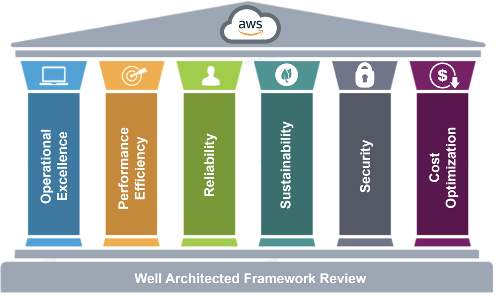
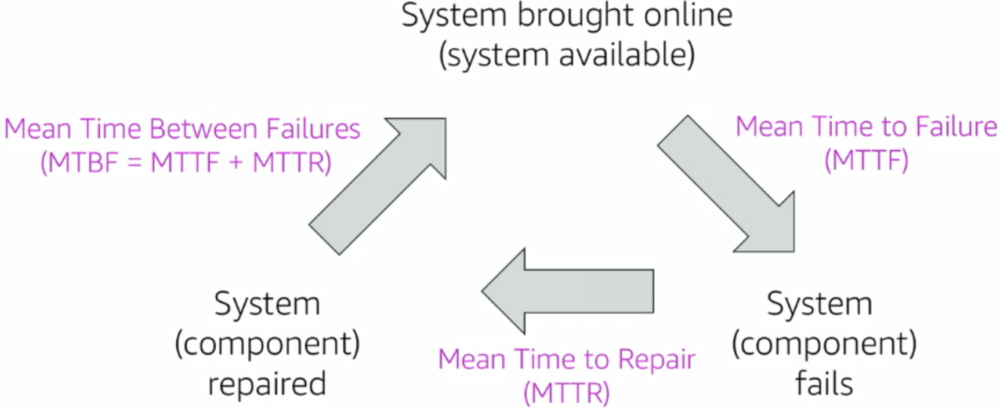

# Архитектура облачных систем. AWS Well-Architected Framework

<i>
Дождь шёл уже третий час подряд. Университет спал, а свет в их лаборатории всё ещё горел. На стене отражались строки диаграмм, словно мерцали окна небоскрёбов в ночном городе.

– Мы строим слишком быстро, – сказала Эмма, не отрываясь от монитора. – Но не думаем, на чём всё это стоит.

Джон отложил кружку остывшего кофе и задумчиво ответил:

– Как дом без фундамента. Вроде красиво, пока не подует ветер.

На экране медленно выстраивались схемы архитектуры: блоки, стрелки, связи. Эмма увеличила один из узлов.

– AWS называет это “Well-Architected Framework”. Шесть столпов — как опоры моста. Без хотя бы одной всё рушится.

– Значит, мы должны стать архитекторами, не просто программистами, – тихо произнёс Джон. – Не просто писать код, а проектировать то, что выдержит годы.

За окном раздался раскат грома. Молния осветила тетрадь, где на полях Эмма набросала слова: “Security. Reliability. Performance. Cost. Excellence. Sustainability.”

Она посмотрела на него и улыбнулась:

– Звучит почти как кодекс.

– И, пожалуй, как обещание, – ответил Джон. – Строить так, чтобы не стыдно было ни перед пользователями, ни перед будущим.

В тот вечер они впервые поняли: настоящая архитектура — это не схемы и не сервисы, а ответственность. Всё остальное — просто инструменты.
</i>

## Вопросы для самопроверки

1. Что такое облачная архитектура и почему она важна для компаний?
2. Какие обязанности выполняет _Cloud Architect_ и почему эта роль столь высоко ценится на рынке?
3. Какие пять столпов включает в себя AWS Well-Architected Framework?
4. Каковы ключевые принципы проектирования надежной и масштабируемой облачной архитектуры?
5. Как измеряется надежность системы, и какие метрики используются для оценки?
6. В чём разница между надежностью и доступностью системы в контексте облачной архитектуры?

## Введение: Что такое архитектура в облаке?

Когда мы говорим об архитектуре в облаке, мы имеем в виду процесс проектирования и создания масштабных, сложных систем, которые работают в облачной среде [^1]. Архитектура - это не просто выбор сервисов из каталога провайдера. Это комплексное мышление о том, как компоненты системы будут взаимодействовать, как данные будут течь, как система будет справляться с отказами и как она будет масштабироваться при увеличении нагрузки.

Архитектура в облаке — это _искусство_ и _наука проектирования_ и создания больших структур, которые [^1]:

- Управляют размером и сложностью системы
- Связывают бизнес-цели организации с технологическими решениями. То есть в зависимости от того, какие задачи стоят перед бизнесом, выбираются соответствующие архитектурные подходы
- Определяют, какие возможности нужны и где требуется улучшение
- Обеспечивают согласованность между тем, что обещает технология и тем, что требует бизнес

По сути, архитектура - это _«чертёж»_ или план, как именно разные части системы будут работать вместе в облаке. Грамотная облачная архитектура позволяет эффективно объединять ресурсы, масштабировать системы под нагрузку и обеспечивать надёжность и безопасность приложений [^2].

### Почему архитектура в облаке так важна?

Представьте строительство здания: если заложить слабый фундамент, всё строение будет под угрозой. Точно так же и в IT, плохая архитектура может привести к:

- _Высоким затратам_. Системы, которые не оптимизированы, будут потреблять ресурсы неэффективно. Например, запущенные 24/7 виртуальные машины, которые используются только несколько часов в день.
- _Недостаточной надежности_. Если система не спроектирована с учетом отказов, то одна ошибка может привести к полной потере сервиса.
- _Плохой производительности_. Система может быть медленной потому, что данные хранятся неправильно или сетевые соединения не оптимизированы.
- _Уязвимостями безопасности_. Если при проектировании не учесть угрозы безопасности, система будет подвержена атакам.

Хорошая архитектура в облаке помогает избежать простоев сервиса, утечек данных и неэффективного расходования денег на инфраструктуру.Она обеспечивает, что все технологические решения согласованы с бизнес-целями и могут адаптироваться под меняющиеся требования. Без чёткой архитектуры компания рискует столкнуться с серьёзными проблемами, которые могут негативно повлиять на её репутацию и финансовое состояние.

## Роль и задачи _Cloud Architect_, и почему эта профессия высокооплачиваемая

С развитием облачных технологий появилась новая ключевая роль - _Cloud Architect_ (облачный архитектор) - специалист, который отвечает за _проектирование облачных решений_, которые удовлетворяют бизнес-требования организации.

_Архитектор должен понимать_:

- Возможности и ограничения облачных сервисов
- Требования бизнеса и пользователей
- Принципы безопасности, надежности и оптимизации затрат
- Технологические тренды и новые возможности

Проще говоря, это специалист, который разрабатывает стратегию использования облака: какие сервисы использовать, _как связать их между собой_, чтобы система была _масштабируемой_, _надёжной_, _безопасной_ и _экономичной_.

В обязанности Cloud Architect’а входит [^3]:

- выбор между различными моделями обслуживания (IaaS, PaaS, SaaS)
- планирование миграции приложений в облако
- проектирование компонентов фронтенда и бэкенда системы в облачной среде
- определение требований к сети, хранению данных
- безопасности и мониторингу

Роль Cloud Architect’а очень востребована и высокооплачиваема. На рисунке 1 показаны средние годовые зарплаты Cloud Architect’ов в разных странах. Как видно, специалисты в этой области получают высокие доходы (начиная от $40,000 в год и выше).

_Рисунок 1. Годовая зарплата Cloud Architect в разных странах_

Данная профессия высоко ценится на рынке труда по нескольким причинам:

- Облачные технологии стали основой цифровой трансформации. Мировой рынок облачных услуг достиг _$600 млрд_ в 2023 году и продолжает расти более чем на 20% в год. Компании остро нуждаются в экспертных знаниях, чтобы эффективно перемещать свои системы в облако и использовать его преимущества.
- От решений архитектора зависит успех критически важных систем - ошибки могут стоить миллионы из-за простоев или утечек, поэтому квалификация и ответственность высоки.
- Навыки Cloud Architect’а требуют сочетания глубокой технической экспертизы (в сетях, БД, безопасности, разработке) и понимания бизнеса.

Таких специалистов относительно немного, поэтому они ценятся на вес золота. Высокая оплата отражает и большую ценность: облачный архитектор помогает компании экономить деньги, повышать скорость вывода продуктов на рынок и предотвращать катастрофические сбои.

## AWS Well-Architected Framework: Общий обзор

Когда организации переходят в облако, возникает вопрос: как убедиться, что мы строим всё правильно? В ответ на это компания Amazon, проанализировала архитектуры тысяч клиентов, обнаружил паттерны успешных и неудачных систем и на основе этого разработала руководство под названием _AWS Well-Architected Framework_ (хорошо продуманная архитектура AWS) [^4] - это набор лучших практик и рекомендаций для проектирования облачных систем.

С его помощью можно проверить, является ли ваша архитектура:

- Безопасной (Secure)
- Высокопроизводительной (High-performing)
- Надежной (Resilient)
- Эффективной (Efficient)
- Экономичной (Cost-effective)

Фреймворк организован вокруг _шести столпов_, каждый из которых представляет ключевую область, которую нужно учитывать при проектировании облачных решений [^4]:

1. Операционное совершенство (Operational Excellence)
2. Безопасность (Security)
3. Надежность (Reliability)
4. Эффективность производительности (Performance Efficiency)
5. Оптимизация затрат (Cost Optimization)
6. Устойчивость к окружающей среде (Sustainability) (_был добавлен в 2021 году_)

Каждый столп содержит:

- Вопросы, которые архитекторы должны задавать себе при проектировании
- Принципы проектирования, которые помогают достичь целей.

_Рисунок 2. Шесть столпов AWS Well-Architected Framework_

> Если пренебречь хотя бы одним столпом, архитектура может оказаться несбалансированной и уязвимой. Например, можно создать очень производительную систему, но если не учесть безопасность, она может стать лёгкой мишенью для атак.

Проще говоря, фреймворк - это шпаргалка облачного архитектора, позволяющая строить надёжные и оптимальные решения с первого раза.

Ниже мы рассмотрим каждый из столпов более подробно, каждый раздел будет включать:

- Определение столпа
- Фокус (основные задачи)
- Ключевые темы
- Принципы проектирования
- Фундаментальные вопросы, которые нужно задать себе при проектировании

## Столп 1: Operational Excellence (Операционное совершенство)

### Определение

_Операционное совершенство_ — это способность непрерывно улучшать процессы и процедуры, чтобы доставлять бизнес-ценность и улучшать поддержку систем [^5]. Речь идёт о том, насколько хорошо команда умеет управлять инфраструктурой и приложениями в рабочей эксплуатации и внедрять изменения без ущерба для бизнеса.

### Фокус

Обеспечить надёжное управление и мониторинг систем для достижения бизнес-результатов, и постоянно улучшать процессы и процедуры эксплуатации

### Ключевые темы

- Автоматизация и управление изменениями
- Реагирование на события
- Установление стандартов для повседневных операций

Проще говоря, этот столп фокусируется на культурe DevOps и практиках, позволяющих сделать операционные процессы предсказуемыми и подконтрольными.

### Принципы проектирования

- _Выполняйте операции как код_. Автоматизируйте рутинные операции, описывайте инфраструктуру в виде кода, чтобы минимизировать человеческий фактор.
- _Делайте частые, небольшие и обратимые изменения_. Вместо одного большого развертывания, вносите изменения маленькими шагами. Это снижает риск и позволяет быстро откатиться, если что-то пошло не так.
- _Аннотируйте документацию_. Автоматизируйте создание документации о вашей инфраструктуре. Это помогает команде быстро разобраться в том, как работает система. Например, используйте инструменты, которые генерируют документацию из кода инфраструктуры.
- _Регулярно улучшайте процедуры_. Часто пересматривайте и оптимизируйте операционные процессы; учитесь на опыте, устраняйте "узкие места".
- _Предвидьте отказы_. Думайте о том, что может пойти не так, и спланируйте заранее.
- _Учитесь на всех инцидентах_. После любых сбоев проводите разбор (post-mortem) и внедряйте улучшения, чтобы инцидент не повторился.

### Фундаментальные вопросы

1. _Подготовка_ (Prepare)
   1. Как вы определяете свои приоритеты?
   2. Как спроектировать систему, чтобы хорошо понимать её текущее состояние (метрики, логи)?
   3. Как вы снижаете количество ошибок при развертывании и облегчаете выпуск изменений в продакшен?
   4. Как вы знаете, что вы готовы поддерживать рабочую нагрузку?
2. _Операции_ (Operate)
   1. Как вы отслеживаете здоровье системы в реальном времени?
   2. Как управляете инцидентами и событиями в работе приложения?
3. _Эволюция_ (Evolve)
   1. Как вы улучшаете и развиваете операционные процессы со временем?
   2. Есть ли механизм регулярного обучения на опыте и внедрения улучшений?

> Ответы на эти вопросы помогают выявить пробелы в операционных практиках. Например, если компания не мониторит ключевые метрики или не проводит учебные аварийные восстановления, это указывает на риски для операционного совершенства.

## Столп 2: Security (Безопасность)

### Определение

Столп _Security_ охватывает способность системы защищать данные, инфраструктуру и сервисы от угроз, обеспечивая при этом бизнес-ценность. Архитектура должна быть спроектирована с учётом рисков безопасности и стратегий их смягчения [^6].

### Фокус

Столп безопасности сосредоточен на:

- Защите информации, систем и активов
- Использовании оценки рисков и стратегий смягчения
- Доставке бизнес-ценности
  - _Бизнес-ценность_ - это польза, которую технологии приносят компании
  - _Доставке бизнес-ценности_ - это процесс, когда IT не просто делает систему или функцию, а реально доводит её до того момента, когда бизнес получает от неё пользу.

### Ключевые темы

- Контроль доступа (определение и управление тем, кто может что делать)
- Обнаружение угроз (мониторинг и аудит)
- Защита систем и сервисов
- Защита конфиденциальности и целостности данных
- Готовность к инцидентам безопасности

### Принципы проектирования

- _Создайте прочную систему идентификации_. Применяйте принцип наименьших привилегий, разделение обязанностей; надёжно управляйте учетными записями и аутентификацией.
- _Включите отслеживаемость_. Логируйте все действия, чтобы вы могли увидеть, что произошло в случае инцидента безопасности.
- Применяйте безопасность на всех уровнях. Не полагайтесь только на одну линию защиты. Используйте многоуровневую защиту (_defense-in-depth_).
- _Автоматизируйте лучшие практики безопасности_. По возможности используйте _автоматизацию для проверок безопасности, развертывания обновлений, реагирования на распространённые события_. Это позволяет масштабировать безопасность и уменьшить влияние человеческого фактора.
- _Защитите данные при передаче и в покое_. Используйте шифрование для защиты данных как при хранении, так и при передаче по сети.
- _Держите людей подальше от данных_. Уменьшите вероятность потери или изменения конфиденциальных данных из-за ошибки человека. Используйте инструменты, которые снижают необходимость ручной обработки данных.
- _Будьте готовы к инцидентам безопасности_. Разработайте и регулярно тренируйте план реагирования на инциденты: кто что делает при обнаружении атаки, как восстанавливаются системы, как уведомляются пользователи.

### Фундаментальные вопросы

1. _Управление идентичностью и доступом_
   1. Как вы управляете учетными данными и аутентификацией пользователей?
   2. Как контролируете доступ людей (консоль, SSH и пр.) и программ к ресурсам (через ключи, роли IAM)?
   3. Реализован ли принцип наименьших прав для всех пользователей и сервисов?
2. _Средства обнаружения_
   1. Как вы обнаруживаете потенциальные инциденты безопасности?
   2. Как вы защищаетесь от возникающих угроз безопасности?
3. Защита инфраструктуры
   1. Как вы защищаете свою сеть (например, VPC, настройки брандмауэров, сети безопасности)?
   2. Как защищены ваши вычислительные ресурсы (EC2, контейнеры)?
4. _Защита данных_
   1. Как вы классифицируете данные по важности?
   2. Как вы защищаете свои данные в покое: на дисках, в базах данных, ... (применяется ли шифрование, надежно ли хранятся ключи)?
   3. Как вы защищаете свои данные при передаче (шифруется ли трафик, используются ли приватные каналы)?
5. _Реагирование на инциденты_
   1. Что вы будете делать, если произойдёт инцидент?
   2. Регулярно ли вы обучаете команду и проводите учения по инцидентам (например, имитация утечки ключа доступа и действия по его отзыву)?

## Столп 3: Reliability (Надежность)

### Определение

_Надежность_ — это способность системы выполнять свои функции корректно и последовательно в ожидаемые промежутки времени, а также способность восстанавливаться после сбоев и адаптироваться к изменениям нагрузки [^7]. Иными словами, надёжная система продолжает работать, когда нужна пользователю, и быстро восстанавливается при сбоях.

### Фокус

Предотвращение и быстрое восстановление после сбоев для выполнения требований бизнеса и клиентов. Как сказал технический директор Amazon Вернер Фогельс, Надёжная архитектура должна предвидеть, что "_всё выходит из строя, всё время_". Поэтому акцент делается на устойчивости системы к отказам и на механизмах автоматического восстановления.

### Ключевые темы

- Подготовка основы надежности (настройка ограничений, квот, топологии сети и др.)
- Планирование восстановления (резервное копирование, дублирование)
- Управление изменениями (чтобы изменения не нарушали работу)
- Архитектура, учитывающая отказ отдельных компонентов

### Принципы проектирования

- _Автоматическое восстановление при сбоях_. Система должна уметь сама обнаруживать сбой компонента и переключаться на резерв или запускать замену без ручного вмешательства. Например, настроить автоматическое перезапуск сервисов, использование Auto Scaling для замены упавших инстансов, или фейловер базы данных.
- _Тестирование процедур восстановления_. Регулярно симулируйте сбои и проверяйте, как система восстанавливается. Это выявит слабые места (например, неработающий бэкап) до реальных проблем. Практика "GameDays" или отключение ресурсов (chaos engineering) помогает убедиться в работоспособности плана восстановления.
- _Горизонтальное масштабирование для повышения доступности_. Вместо одной мощной машины используйте несколько небольших (кластеров).
- _Не гадать с емкостью_. Спроектируйте систему так, чтобы она автоматически адаптировалась к нагрузке. Постоянно мониторьте использование ресурсов и применяйте авто-масштабирование.
- _Управление изменениями через автоматизацию_. Любые изменения инфраструктуры (развёртывание, конфигурация) должны проводиться автоматизированно и по контролируемому процессу. Это снижает вероятность человеческих ошибок, приводящих к сбоям.

### Фундаментальные вопросы

1. _Базовые возможности_
   1. Как вы управляете лимитами сервисов и ресурсами (service limits)? Например, защищены ли вы от превышения квот AWS (количества запусков, объема хранилища и т.д.), что может неожиданно остановить систему?
   2. Как спроектирована сетевая топология, есть ли точки отказа в сети, достаточна ли пропускная способность, настроены ли резервные каналы?
2. _Управление изменениями_
   1. Как ваша система адаптируется к изменениям спроса? Например, способна ли она автоматически масштабироваться при росте трафика?
   2. Как вы мониторите ресурсы - узнаёте ли вы сразу о деградации компонента?
   3. Как вы внедряете изменения конфигурации или обновления кода - имеется ли процесс, исключающий хаотичные ручные правки?
3. _Управление отказами_
   1. Как вы делаете резервное копирование данных?
   2. Регулярно ли проверяется целостность бэкапов и возможность восстановления из них?
   3. Что произойдет при отказе отдельного компонента – выдержит ли система?
   4. Как вы тестируете устойчивость – например, отключаете ли намеренно компоненты, чтобы увидеть, выдержит ли остальная система?
   5. Есть ли у вас план аварийного восстановления (Disaster Recovery) на случай катастрофы – например, стратегии вроде Multi-AZ, мульти-регионального резервирования, использование standby-систем?

## Столп 4: Performance Efficiency (Эффективность производительности)

### Определение

Столп _Performance Efficiency_ описывает способность _эффективно использовать вычислительные ресурсы для удовлетворения требований системы_ и поддерживать эту эффективность по мере изменения спроса и развития технологий [^8].

### Фокус

Эффективное использование ИТ-ресурсов (CPU, память, сеть, хранилище и др.) для достижения нужной производительности системы, и сохранение эффективности при изменениях – например, при увеличении числа пользователей или появлении новых, более быстрых сервисов.

### Ключевые темы

- Правильный выбор типов и размеров ресурсов под конкретные задачи
- Мониторинг производительности и выявление узких мест
- Принятие обоснованных решений по оптимизации по мере эволюции требований
- Умение балансировать компромиссы ради повышения производительности (например, между скоростью отклика и стоимостью)

### Принципы проектирования

- _Демократизация передовых технологий_. Используйте технологии как сервис (PaaS / SaaS), вместо того чтобы управлять ими самостоятельно. Сосредоточьтесь на разработке продукта, а не на управлении инфраструктурой. _Например_, если вам нужен анализ больших данных или машинное обучение – берите готовые управляемые сервисы (Amazon EMR, Amazon SageMaker), а не разворачивайте всё с нуля.
- _Развёртывание глобально за минуты_. Облачная инфраструктура позволяет легко запускать системы в разных регионах. Если приложение требует минимальной задержки для пользователей по всему миру, архитектура должна поддерживать много-региональные схемы (CDN, репликация, географическое распределение). Это помогает и в производительности, и в устойчивости.
- _Использование безсерверных архитектур_. По возможности применяйте serverless-подходы (AWS Lambda, FaaS, управляемые базы данных, API Gateway и т.п.), при которых провайдер берёт на себя управление серверами. Это снимает часть операционной нагрузки и часто автоматически масштабируется под нагрузку, обеспечивая и производительность, и оптимальные затраты.
- _Экспериментирование и тестирование_. Постоянно пробуйте разные варианты конфигураций, сервисов, параметров – в облаке это легко, можно быстро создать тестовый стенд. Например, протестируйте разные типы инстансов EC2, разные базы данных, кэши – что даст наилучшее время отклика? Такой подход “через эксперименты” (often referred as AB-testing или сравнение альтернатив) позволяет найти оптимальную архитектуру.
- _Учёт особенностей рабочих нагрузок (mechanical sympathy)_. Это принцип о том, что архитектурные решения должны учитывать специфику задачи. Нет универсально лучших технологий – нужно выбирать инструменты, которые лучше всего подходят под ваши требования.

### Фундаментальные вопросы

1. _Выбор решений_
   1. Как вы выбираете оптимальную архитектуру и услуги для своей задачи?
   2. Как вы выбираете решение для вычислений?
   3. Как вы выбираете решение для хранилища?
   4. Как вы выбираете решение базы данных?
   5. Как вы выбираете решение для сети?
2. _Обзор и непрерывное улучшение_
   1. Как вы отслеживаете новые возможности и обновления AWS?
   2. Есть ли у вас процесс переоценки архитектуры, чтобы вовремя воспользоваться улучшениями (новыми сервисами, функциями)?
3. _Мониторинг производительности_
   1. Какие метрики производительности вы измеряете и как контролируете соответствие ожиданиям?
   2. Если производительность падает, как быстро вы это узнаете?
4. _Компромиссы_
   1. Какие компромиссы вы допускаете ради производительности? Вы балансируете между консистентностью и скоростью (CAP-теорема) (_консистентность_ - это когда все узлы системы видят одинаковые данные в одно и то же время, а _скорость_ - это время отклика системы)? Возможно, используете кэширование (например, Amazon ElastiCache) и тем самым снижаете нагрузку на БД ценой потенциальной устарелости данных на секунды? Или идёте на избыточность хранения (денормализация) ради быстрого чтения.

## Столп 5: Cost Optimization (Оптимизация затрат)

### Определение

Столп _Cost Optimization_ означает умение запускать и поддерживать системы с минимальными возможными расходами, но при этом _доставляя ценность для бизнеса_ [^9]. Речь идёт не о том, чтобы просто экономить деньги в ущерб качеству, а о том, чтобы исключить лишние траты и добиться наилучшего соотношения _цена/результат_.

### Фокус

Достижение бизнес-результатов по наименьшей цене. Это включает контроль того, _когда и на что тратятся деньги_, выбор оптимальных типов и количества ресурсов, постоянный анализ расходов и корректировку использования. Цель – избегать ситуаций, когда деньги “вытекают” в облаке впустую (например, работают неиспользуемые серверы, хранятся ненужные данные и т.д.).

### Ключевые темы

- Понимание и контроль расходов
- Выбор правильных ресурсов и их количество (не переплачивать за избыточную мощность)
- Анализ трендов затрат во времени; масштабирование по потребности (не платить за простаивающие ресурсы)

### Принципы проектирования

- _Внедрите практики финансового управления облаком_. Иногда это называют FinOps. Организация должна управлять бюджетом и расходами в облаке как важным процессом: устанавливать бюджеты, отслеживать отклонения, вовлекать команды разработки в ответственность за расходы. Инструменты вроде _AWS Cost Explorer_ и отчётов бюджета помогают прозрачно видеть, кто и сколько тратит.
- _Примите модель потребления_. В облаке лучше платить только за то, что используешь. Это подразумевает авто-выключение ресурсов, когда они не нужны (например, дев/тест окружения ночью), масштабирование до нуля, если сервис не востребован, и вообще переход от фиксированных затрат (CAPEX) к переменным (OPEX). Используйте Serverless и услуги с оплатой по запросам, где возможно, чтобы не платить за простой.
- _Измеряйте общую эффективность_. Важно понимать, за что вы платите и какую отдачу получаете. Например, измеряйте стоимость обработки одной транзакции или запроса. Это позволяет увидеть, улучшается ли экономичность с ростом нагрузки.
- _Не тратьте деньги на несовмещаемые с бизнес-ценностью задачи_. AWS называет это "_перестаньте платить за тяжелую работу, не приносущую различия_" (undifferentiated heavy lifting). _Идея_: вместо содержания собственных дата-центров, базовой инфраструктуры - используйте облачные сервисы. AWS берет на себя энергию, физический хостинг, базовое администрирование.
- _Анализируйте и атрибутируйте расходы_. Настройте разметку ресурсов тегами, разбивайте счета по проектам, подразделениям. Это позволит точно определить, кто генерирует какие расходы и зачем. Регулярно проводите анализ затрат – какие сервисы самые дорогие, не платите ли вы за “забытые” ресурсы (неиспользуемые EIP, старые большие EBS-диски, простоищие инстансы).

### Фундаментальные вопросы

1. _Осведомленность о расходах_.
   1. Как вы управляете использованием ресурсов? Есть ли у вас правила, кто и когда может запускать дорогие ресурсы? Мониторите ли вы в реальном времени расходы и использование (например, через AWS Budgets, алерты по счету)?
   2. Как вы избавляетесь от неиспользуемых ресурсов – есть ли регулярный аудит на "снести то, что не нужно"?
2. _Рентабельность ресурсов_.
   1. Учитываете ли вы стоимость при выборе сервисов? Например, сравниваете экономику разных решений (ECS vs Lambda vs EC2 для своего сервиса) – что будет дешевле при вашей нагрузке?
   2. Оптимизируете ли размер и типы инстансов под нагрузку (не работает ли ваш сервер на 5% CPU, впустую тратя деньги – может, есть тип поменьше)? Используете ли спотовые инстансы или резервирование для снижения затрат?
   3. Планируете ли расходы на передачу данных (внутри и между облаками) – часто про них забывают, а они могут быть существенными.
3. _Соответствие спросу_.
   1. Как вы сопоставляете поставляемые ресурсы и реальную потребность (простыми словами, не переплачиваете ли вы за избыточную мощность)?
   2. Автоматически ли масштабирутеся система вниз, когда нагрузка падает (освобождая ресурсы и экономя деньги)?
   3. Нет ли жёстко закреплённых избыточных ресурсов “на всякий случай” – в облаке лучше поднимать их по потребности.
4. _Оптимизация со временем_.
   1. Как вы пересматриваете свои решения с точки зрения стоимости? Проверяете ли новые сервисы или обновления цен, которые могут удешевить вашу работу?
   2. Периодически ли вы тестируете новые модели ценообразования, тарифы (как Savings Plans, Reserved Instances) для ваших длительно работающих ресурсов?

## Столп 6: Sustainability (Устойчивость к окружающей среде)

### Определение

Столп _Sustainability_ появился не так давно (в 2021 году) и фокусируется на способности систем минимизировать воздействие на окружающую среду, эффективно используя ресурсы и снижая углеродный след [^10]. Это отражает растущую важность экологической ответственности в ИТ-индустрии.

### Фокус

Проектирование и эксплуатация облачных систем с учётом их влияния на окружающую среду. Это включает оптимизацию использования энергии, снижение отходов и выбор устойчивых технологий.

### Ключевые темы

- Понимание воздействия облачных операций на окружающую среду
- Максимизация эффективности использования ресурсов
- Выбор энергоэффективных регионов и сервисов
- Измерение и отслеживание углеродного следа
- Использование управляемых сервисов для уменьшения операционной нагрузки

### Принципы проектирования

- _Измеряйте и отслеживайте воздействие_. Измеряйте влияние вашей облачной рабочей нагрузки на окружающую среду и моделируйте будущее воздействие. Это включает анализ всех источников воздействия, включая потребление энергии на клиентских устройствах и влияние на конечное утилизацию оборудования.
- _Оптимизируйте использование ресурсов_. Проектируйте системы так, чтобы они использовали минимально необходимое количество вычислительных ресурсов, снижая энергопотребление.
- _Выбирайте устойчивые сервисы_. Используйте облачные сервисы, которые спроектированы с учётом устойчивости и энергоэффективности.
- _Внедряйте лучшие практики устойчивого развития_. Следуйте рекомендациям по устойчивому развитию в ИТ, таким как оптимизация циклов работы, использование возобновляемых источников энергии и минимизация отходов.

### Фундаментальные вопросы

1. _Выбор региона и технологии_
   1. Как вы выбираете регион AWS с учётом его устойчивости и использования возобновляемых источников энергии?
   2. Как вы выбираете энергоэффективные сервисы и архитектуры?
   3. Как вы оптимизируете географическое размещение рабочих нагрузок для минимизации сетевых передач?
2. _Сопоставление спроса и предложения_
   1. Как вы масштабируете инфраструктуру рабочей нагрузки динамически?
   2. Как вы согласовываете соглашения об уровне обслуживания (SLA) с целями устойчивости?
   3. Как вы останавливаете создание и обслуживание неиспользуемых активов?
3. _Программное обеспечение и архитектура_
   1. Как вы оптимизируете код, который потребляет наибольшее время или ресурсы?
   2. Как вы минимизируете движение данных по сетям?

### Важна ли устойчивость в облачной архитектуре?

На первый взгляд, устойчивость может показаться менее критичной, чем безопасность или надежность. Однако это не так. С ростом масштабов облачных вычислений, их влияние на окружающую среду становится значительным. Компании всё чаще сталкиваются с требованиями по снижению углеродного следа и демонстрации экологической ответственности.

Хорошо спроектированная устойчивая архитектура помогает не только снизить воздействие на окружающую среду, но и оптимизировать затраты, повысить эффективность использования ресурсов и улучшить репутацию компании среди клиентов и партнеров.

## Надежность и доступность

> "Everything fails, all the time" – Werner Vogels, CTO Amazon

Данную подглаву стоит начать с цитаты CTO Amazon Вернера Фогелса: "_Everything fails, all the time_" (Все ломается, все время) [^11]. Это не просто пессимистическое утверждение, а признание реальности: в любой системе, особенно в распределённых облачных, компоненты неизбежно выходят из строя. Задача архитектора - спроектировать систему так, чтобы она могла _выдерживать_ эти сбои и _быстро восстанавливаться_. Для этого система должна быть _надежной_ и _доступной_.

Несмотря на то, что термины "надежность" и "доступность" часто используются вместе, они имеют разные значения в контексте облачной архитектуры.

_Надежность (reliability)_ – это вероятность того, что система будет выполнять свои функции без отказа в течение заданного периода. По сути, надежность описывает частоту отказов: если система работает без сбоев долго, она надёжная.

_Доступность (availability)_ – это доля времени, когда система находится в работоспособном состоянии и доступна для пользователей в нужный момент. Доступность учитывает не только факты сбоев, но и то, как быстро вы эти сбои устраняете.

_Например_, сервис, который падает раз в неделю, но перезагружается за минуту, может иметь невысокую надежность (частые сбои), но при этом довольно высокую доступность (простой всего ~7 минут в неделю). И _наоборот_, система может редко выходить из строя (высокая надежность), но если после сбоя требуется долгое восстановление, доступность пострадает.

Таким образом,

- надежность _стремится минимизировать сбои_,
- а доступность – _максимизировать время бесперебойной работы_

### Как измеряется надежность системы?

Надежность измеряется с использованием _MTBF_ (Mean Time Between Failures — среднее время между отказами)

$$ MTBF = \frac{Общее\ время\ работы}{Количество\ отказов} $$

_Пример_: Если система работала 1000 часов и было 10 отказов, то _MTBF_ = 1000 / 10 = 100 часов. Это означает, что в среднем система отказывает каждые 100 часов.

Однако MTBF используется редко в облачной инфраструктуре, потому что облачные сервисы обычно имеют очень высокую надежность благодаря резервированию и автоматическому восстановлению.

### Как измеряется доступность системы?

Доступность выражается в процентах от времени 100% доступности за определённый период (_обычно год_). _Например_, `99.9%` за определенный год.

$$ Availability\ (\%) = \left( \frac{Время\ работы}{Общее\ время} \right) \times 100 $$

Пример: Если система была недоступна 1 час в год, то доступность составляет:

$$ Availability\ (\%) = \left( \frac{8760 - 1}{8760} \right) \times 100 \approx 99.989\% $$

Доступность обычно выражается в виде "_количества девяток_" (number of nines):

| Количество девяток | Доступность (%) | Максимальное время простоя в год |
| ------------------ | --------------- | -------------------------------- |
| 1 девятка          | 90.0%           | 36.5 дней                        |
| 2 девятки          | 99.0%           | 3.65 дней                        |
| 3 девятки          | 99.9%           | 8.76 часов                       |
| 4 девятки          | 99.99%          | 52.56 минут                      |
| 5 девяток          | 99.999%         | 5.26 минут                       |
| 11 девяток         | 99.999999999%   | 31.5 миллисекунд                 |

Каждая дополнительная девятка требует экспоненциально больших инвестиций в резервирование, мониторинг и восстановление. На практике для разных приложений требуются разные уровни. Не каждое приложение должно иметь пять девяток доступности – зачастую достаточно `99.9%` для внутренних систем или бета-версий.

В AWS рекомендуют классифицировать приложения по Tier (уровням) доступности.

_Например_,

- `Tier-0` – самые критичные (целевой SLA ~99.99%)
- `Tier-1` – важные, но допускающие небольшие простои (например, 99.9-99.95%)
- `Tier-2` – вспомогательные сервисы (99%)
- `Tier-3` – не критичные, могут быть недоступны длительное время (90-95%)

Разбиение на уровни помогает сфокусировать усилия: для _Tier-0_ нужно инвестировать в максимальную отказоустойчивость, а _Tier-3_ можно упростить и сэкономить ресурсы.

### Дополнительные метрики надежности и доступности

Для более детального анализа надежности используются еще несколько метрик:

_MTTF_ (Mean Time To Failure — среднее время до отказа): Среднее время, в течение которого система будет работать перед первым отказом. Например, новый жесткий диск может иметь MTTF 100 000 часов.

_MTTR_ (Mean Time To Repair — среднее время восстановления): Среднее время, необходимое для восстановления системы после отказа. Например, если техник приезжает 1 час после уведомления об отказе и восстанавливает систему за 30 минут, MTTR составляет 1,5 часа.

$$ MTTR = \frac{Общее\ время\ восстановления}{Количество\ восстановлений} $$

_MTFB_, можно посчитать как сумму MTTF и MTTR:

$$ MTFB = MTTF + MTTR $$

_Рисунок 3. Взаимосвязь между MTTF, MTTR и MTFB_

### Высокая доступность

_Высокая доступность (High Availability, HA)_ — это способность системы оставаться доступной и функционировать даже при сбоях отдельных компонентов. В облачной архитектуре это достигается за счёт избыточности, автоматического восстановления и распределения нагрузки [^12].

#### Факторы, влияющие на доступность

- _Отказоустойчивость (Fault Tolerance)_. Встроенная избыточность приложения и его способность оставаться операционной. Например, система может продолжить работу, если один из трех сервисов откажет.
- _Восстанавливаемость (Recoverability)_. Процессы, политики и процедуры, связанные с восстановлением сервиса после катастрофического события. Это включает резервные копии данных и планы восстановления.
- _Масштабируемость (Scalability)_. Способность приложения удовлетворять растущие требования к емкости без изменения дизайна. Например, если трафик удваивается, система должна иметь возможность масштабироваться для обработки этого трафика.

## AWS Trusted Advisor

_AWS Trusted Advisor_ — это специальный онлайн-инструмент от AWS, который анализирует вашу облачную среду и в реальном времени выдаёт рекомендации, как её улучшить с точки зрения лучших практик [^13]. Trusted Advisor как бы выступает вашим автоматическим консультантом: просматривает конфигурации аккаунта, сервисов и сравнивает с эталонными правилами.

AWS Trusted Advisor проверяет ресурсы по пяти ключевым категориям рекомендаций:

| Категория                              | Описание                                                                                                                                                                                                                                                                                                                                                |
| -------------------------------------- | ------------------------------------------------------------------------------------------------------------------------------------------------------------------------------------------------------------------------------------------------------------------------------------------------------------------------------------------------------- |
| Cost Optimization (Оптимизация затрат) | Ищет невостребованные ресурсы, которые пожирают деньги впустую. Например, неиспользуемые EBS-томы, простаивающие EC2-инстансы, резервированные мощности без использования. Также советует использовать более дешёвые модели (например, перейти на spot-инстансы или зарезервировать инстансы для экономии).                                             |
| Performance (Производительность)       | Проверяет, не приближены ли вы к пределам по сервисам (например, почти выбраны все доступные IP-адреса в VPC, или нагрузка близка к лимиту). Подсказывает, где можно улучшить throughput – например, увеличить размер очереди, если она постоянно заполнена, или использовать CDN для ускорения раздачи контента                                        |
| Security (Безопасность)                | Выявляет грубые прорехи в безопасности: открытые всем доступы (например, S3 бакеты с публичным доступом или публичные снимки EBS), большие права у аккаунтов, отсутствие MFA у привилегированных пользователей, использование устаревших протоколов. Цель – помочь не пропустить риск, который можно легко устранить для повышения защищенности системы |
| Fault Tolerance (Отказоустойчивость)   | проверяет моменты, влияющие на надежность. Например, наличие ресурсов в нескольких зонах (или всё сконцентрировано в одной – риск); превышение лимитов AWS по сервисам (если вы используете > 80% лимита на что-то, это опасно, что скоро не сможете создать новый ресурс); указывает на отсутствие бэкапов важных данных                               |
| Service Limits (Ограничения сервисов)  | Отслеживает ваши текущие квоты (лимиты) AWS и предупреждает, если вы близки к исчерпанию. Например, “используется 90% лимита адресов EC2-VPC” или “осталось мало доступныхElastic IP”. Это даёт время поднять лимит через поддержку, пока новые ресурсы не отказали в запуске.                                                                          |

Trusted Advisor доступен через консоль AWS. В базовой бесплатной версии он показывает ограниченный набор проверок (главным образом по безопасности и лимитам). Клиентам с платной поддержкой (Business/Enterprise) открывается полный спектр из множеств проверок и рекомендаций.

В консоли можно сразу увидеть:

- "зелёные" (всё хорошо)
- "жёлтые" (нужно внимание) - например, ресурсы близки к лимитам
- "красные" (требуется срочное действие) - например, публичный доступ к S3 бакету

_Пример_: Trusted Advisor может обнаружить, что у вас запущен большой EC2-инстанс, загруженный лишь на 5%. Он порекомендует перевести его на меньший тип для экономии денег – это рекомендация из категории Cost Optimization. Одновременно он проверит, не открыт ли этот инстанс в Интернет через группу безопасности 0.0.0.0/0 на всех портах – если да, то в категории Security выдаст предупреждение, что это небезопасно.

## Резюме

1. Архитектура облачных систем - это не только схема компонентов, но и набор принципов, определяющих, как система должна работать в условиях роста, нагрузки и отказов.
2. Концепция _AWS Well-Architected Framework_ помогает инженерам проектировать системы, которые одновременно безопасны, надёжны, эффективны и экономичны.
3. Framework основан на шести “столпах” (pillars), каждый из которых представляет важную область проектирования:
   1. _Operational Excellence_ - способность управлять системой и улучшать её на основе наблюдений и обратной связи.
   2. _Security_ - защита данных, систем и активов через управление доступом, шифрование и мониторинг.
   3. _Reliability_ - устойчивость к сбоям и способность быстро восстанавливаться.
   4. _Performance Efficiency_ - эффективное использование вычислительных ресурсов, соответствующее текущим потребностям.
   5. _Cost Optimization_ - осознанное управление затратами, чтобы платить только за реально используемые ресурсы.
   6. _Sustainability_ - минимизация экологического следа ИТ-инфраструктуры и повышение энергоэффективности решений.
4. Well-Architected Framework учит видеть _архитектуру не как статичную конструкцию, а как живую систему_, которая должна развиваться, адаптироваться и учиться.
5. Главная идея - архитектура начинается не с выбора сервисов, а с понимания принципов: безопасности, надёжности, эффективности и устойчивости. Только тогда технологии становятся инструментом, а не самоцелью.
6. Для инженеров, архитекторов и студентов облачные принципы - это не просто набор рекомендаций, а своего рода “кодекс архитектора”, определяющий культуру проектирования в эпоху облаков.

[^1]: _AWS Architecture Center. (2024)_. Architecture: designing and building. Available at: https://aws.amazon.com/architecture/
[^2]: _What is cloud architecture?_. cloud.google.com [online]. Available at: https://cloud.google.com/learn/what-is-cloud-architecture
[^3]: _Cloud Architect Career Guide: 10 In-Demand Jobs and Skills in 2025_. coursera.org [online]. Available at: https://www.coursera.org/articles/cloud-architect
[^4]: _AWS. (2024). AWS Well-Architected Framework_. Available at: https://docs.aws.amazon.com/wellarchitected/latest/userguide/
[^5]: _AWS. (2024). Operational Excellence Pillar_. AWS Well-Architected Framework. Available at: https://docs.aws.amazon.com/wellarchitected/latest/operational-excellence-pillar/
[^6]: _AWS. (2024). Security Pillar_. AWS Well-Architected Framework. Available at: https://docs.aws.amazon.com/wellarchitected/latest/security-pillar/
[^7]: _AWS. (2024). Reliability Pillar_. AWS Well-Architected Framework. Available at: https://docs.aws.amazon.com/wellarchitected/latest/reliability-pillar/
[^8]: _AWS. (2024). Performance Efficiency Pillar_. AWS Well-Architected Framework. Available at: https://docs.aws.amazon.com/wellarchitected/latest/performance-efficiency-pillar/
[^9]: _AWS. (2024). Cost Optimization Pillar_. AWS Well-Architected Framework. Available at: https://docs.aws.amazon.com/wellarchitected/latest/cost-optimization-pillar/
[^10]: _AWS. (2024). Sustainability Pillar_. AWS Well-Architected Framework. Available at: https://docs.aws.amazon.com/wellarchitected/latest/sustainability-pillar/sustainability-pillar.html
[^11]: _Vogels, W. (2009). Eventually Consistent_. All Things Distributed. Available at: https://www.allthingsdistributed.com/2008/12/eventually_consistent.html
[^12]: _What is high availability?_. ibm.com [online]. Available at: https://www.ibm.com/think/topics/high-availability
[^13]: _AWS. (2024). AWS Trusted Advisor_. AWS Support. Available at: https://aws.amazon.com/premiumsupport/technology/trusted-advisor
