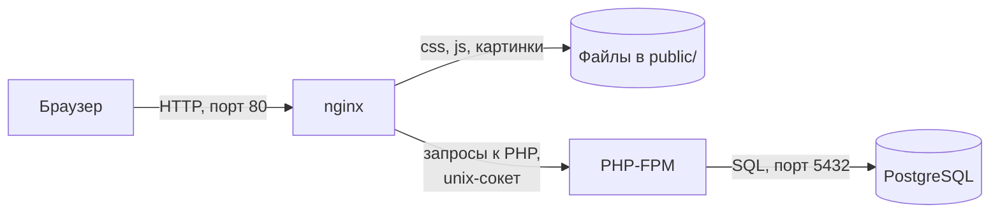
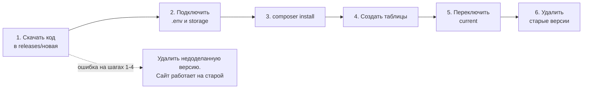

# Лабораторная работа №2. Облачные вычислительные сервисы. Amazon EC2

## Цель работы

Научиться запускать и настраивать виртуальные машины Amazon EC2, подключаться к ним по SSH, диагностировать их состояние и разворачивать на них веб-приложение: от статической страницы до настоящего приложения с базой данных, которое сервер сам забирает из репозитория GitHub.

## Как устроена работа

Работа состоит из двух частей. Вы сами выбираете, до какой из них дойти.

| Уровень     | Что нужно сделать               | Максимальная оценка |
| ----------- | ------------------------------- | ------------------- |
| Базовый     | Часть 1: задания 1-6            | 7                   |
| Продвинутый | Часть 1 и Часть 2: задания 1-15 | 10                  |

> [!NOTE]
> Всё, что понадобится для работы, разобрано в лекции 4 "Вычислительные сервисы. Amazon EC2 и machine identity" и в Hands-on 4.1 и 4.2. Если какой-то шаг непонятен, сначала загляните туда.

## Перед началом

- У вас есть аккаунт AWS и вы входите в консоль под пользователем IAM, а не под root (лекция 3).
- На компьютере есть терминал: Terminal в macOS и Linux или PowerShell в Windows 10 и 11. Программы `ssh` и `scp` в них уже установлены.
- Для Части 2 нужен аккаунт GitHub и установленный на компьютере `git`.

Все ресурсы создавайте в регионе `eu-central-1` (Frankfurt).

## Часть 1. Базовый уровень

### Задание 1. Подготовка аккаунта

1. Войдите в консоль AWS и в правом верхнем углу выберите регион `Europe (Frankfurt)`.
2. Если у вас до сих пор нет пользователя IAM, создайте его:
   1. Откройте `IAM` → `User groups` → `Create group`, назовите группу `Admins` и подключите к ней политику `AdministratorAccess`.
   2. Откройте `Users` → `Create user`, задайте имя (например, `cloudstudent`), включите доступ к консоли (`Provide user access to the AWS Management Console`) и добавьте пользователя в группу `Admins`.
   3. Выйдите из консоли и войдите снова, уже под этим пользователем.

   > Что разрешает политика `AdministratorAccess`? Почему для повседневной работы нельзя использовать root?

3. Настройте бюджет с нулевым порогом, чтобы получить письмо, как только аккаунт начнёт тратить деньги:
   1. Откройте `Billing and Cost Management` → `Budgets` → `Create budget`.
   2. Выберите шаблон `Zero spend budget`.
   3. Укажите имя `ZeroSpend` и свой email.
   4. Нажмите `Create budget`.

### Задание 2. Запуск экземпляра EC2

1. Откройте `EC2` → `Instances` → `Launch instances`.
2. Заполните параметры:
   1. _Name_: `webserver`.
   2. _AMI_: `Amazon Linux 2023`.
   3. _Instance type_: `t3.micro`.
   4. _Key pair_: `Create new key pair`, имя `yournickname-keypair`, тип `ED25519`, формат `.pem`. Файл скачается автоматически, второй раз скачать его нельзя. Переложите его в папку `.ssh` в домашней папке.
   5. _Network settings_: оставьте default VPC и включённый публичный IP. Создайте новую Security Group с именем `webserver-sg` и двумя правилами для входящего трафика:
      - `SSH` с источником `My IP`;
      - `HTTP` с источником `Anywhere` (`0.0.0.0/0`).
   6. _Configure storage_: оставьте значения по умолчанию.
   7. _Advanced details_ → _User data_: вставьте скрипт:

      ```bash
      #!/bin/bash
      dnf -y update
      dnf -y install htop nginx
      systemctl enable --now nginx
      ```

   > Что такое User data и когда выполняется этот скрипт? Выполнится ли он повторно после перезагрузки экземпляра?

3. Нажмите `Launch instance`. Дождитесь состояния `Running` и прохождения всех проверок в колонке `Status check`.
4. Откройте в браузере `http://<Public-IP>`, где `<Public-IP>` - публичный IP-адрес экземпляра. Вы должны увидеть приветственную страницу nginx.

### Задание 3. Мониторинг и диагностика

1. _Status checks_. Откройте экземпляр и вкладку `Status and alarms`. EC2 постоянно проверяет экземпляр:
   - _System status check_ проверяет инфраструктуру AWS: физический сервер и сеть, на которых работает экземпляр;
   - _Instance status check_ проверяет саму виртуальную машину: загрузилась ли операционная система и отвечает ли она;
   - _Attached EBS status check_ проверяет, доступны ли подключённые тома EBS.

   > Какая из проверок укажет на проблему, которую можете исправить вы, а какая на проблему на стороне AWS?

2. _Monitoring_. Откройте вкладку `Monitoring`. Здесь показаны метрики Amazon CloudWatch: загрузка процессора, сетевой трафик, операции с диском. По умолчанию включён базовый мониторинг, метрики приходят раз в 5 минут. Детальный мониторинг (`Detailed monitoring`) присылает их раз в минуту и оплачивается отдельно.

   > В каких случаях стоит включать детальный мониторинг?

3. _System log_. Выберите `Actions` → `Monitor and troubleshoot` → `Get system log`. Это вывод консоли экземпляра, как если бы к серверу был подключён монитор. Найдите строки, в которых устанавливается nginx из вашего скрипта User data. Если лог пуст, подождите пару минут.
4. _Instance screenshot_. Выберите `Actions` → `Monitor and troubleshoot` → `Get instance screenshot`. Снимок экрана помогает, когда подключиться по SSH не удаётся: по нему видно, загрузилась ли система вообще.

### Задание 4. Подключение по SSH

1. Откройте терминал на своём компьютере.
2. В macOS и Linux закройте файл ключа от других пользователей:

   ```bash
   chmod 400 ~/.ssh/yournickname-keypair.pem
   ```

   В Windows этот шаг обычно не нужен.

3. Подключитесь к экземпляру:

   ```bash
   ssh -i ~/.ssh/yournickname-keypair.pem ec2-user@<Public-IP>
   ```

   - `-i` указывает файл приватного ключа;
   - `ec2-user` - стандартное имя пользователя в Amazon Linux;
   - `<Public-IP>` - публичный IP-адрес экземпляра.

   В Windows PowerShell вместо `~` используйте `$HOME`: `ssh -i $HOME\.ssh\yournickname-keypair.pem ec2-user@<Public-IP>`.

4. При первом подключении ответьте `yes` на вопрос `Are you sure you want to continue connecting`. Приглашение терминала изменится примерно на такое:

   ```text
   [ec2-user@ip-172-31-xx-xx ~]$
   ```

5. Проверьте, что nginx работает:

   ```bash
   systemctl status nginx
   ```

   > Почему для входа на экземпляр EC2 используется ключ, а не пароль?

### Задание 5. Статический сайт

1. Создайте на своём компьютере три HTML-файла: `index.html` (главная страница), `about.html` («О нас») и `contact.html` («Контакты»). Страницы должны ссылаться друг на друга.
2. Скопируйте их на сервер командой `scp`. Её нужно выполнять в терминале на своём компьютере, а не на сервере:

   ```bash
   scp -i ~/.ssh/yournickname-keypair.pem index.html about.html contact.html ec2-user@<Public-IP>:~
   ```

   Файлы попадут в домашнюю папку пользователя `ec2-user` на сервере.

   > Что делает команда `scp` и чем она похожа на `ssh`?

3. Подключитесь к серверу по SSH и переложите файлы в папку, из которой nginx отдаёт страницы:

   ```bash
   sudo cp ~/*.html /usr/share/nginx/html/
   ls -l /usr/share/nginx/html
   ```

   Напрямую через `scp` положить файлы в `/usr/share/nginx/html` не получится: эта папка принадлежит пользователю `root`, а вы входите как `ec2-user`.

4. Откройте `http://<Public-IP>` и убедитесь, что ваш сайт открывается и ссылки между страницами работают.

### Задание 6. Остановка экземпляра через AWS CLI

Остановите экземпляр командой AWS CLI. Выполнить её можно двумя способами:

- на своём компьютере, если вы настроили AWS CLI с ключами своего пользователя IAM (лекция 3);
- в AWS CloudShell: это терминал прямо в консоли AWS, значок `>_` в верхней панели. В CloudShell AWS CLI уже установлен и работает от имени пользователя, под которым вы вошли в консоль, поэтому ключи настраивать не нужно.

```bash
aws ec2 stop-instances --instance-ids <ID-экземпляра> --region eu-central-1
```

Идентификатор экземпляра имеет вид `i-0...` и виден в списке `Instances`.

> Чем `Stop` отличается от `Terminate`? За что вы продолжаете платить, пока экземпляр остановлен?

Если вы выполняете только базовый уровень, на этом практическая часть закончена. Экземпляр не удаляйте, если преподаватель не сказал иначе. Переходите к разделам «Контрольные вопросы» и «Отчёт».

## Часть 2. Продвинутый уровень

### Зачем нужна эта часть

В Части 1 вы копировали файлы на сервер командой `scp`. Для трёх HTML-страниц это нормально, но для настоящего приложения этот способ быстро превращается в проблему:

- непонятно, какая версия кода сейчас работает на сервере;
- легко забыть скопировать один файл, и сайт сломается;
- если новая версия оказалась с ошибкой, вернуть старую можно только «как-нибудь»;
- код живёт на ноутбуке разработчика, а не в общем месте, где его видит команда.

Профессиональный подход строится на одной идее: _единственный источник кода - это репозиторий, а сервер забирает код оттуда сам_. В этой части вы реализуете её без специальных инструментов, только с помощью `git`, SSH и небольшого скрипта. Позже в курсе этот процесс будут выполнять автоматические системы (CI/CD), но устроены они точно так же: где-то запускается команда, которая берёт код из репозитория и выкладывает его на сервер.

### Что мы будем разворачивать

Выберите одно приложение:

- _Своё приложение_ из лабораторных работ прошлого года по веб-разработке.
- _Одно из учебных приложений_ из репозитория [msu-cloud-course/app-samples](https://github.com/msu-cloud-course/app-samples). Все они реализуют одно и то же приложение TimeCapsule: пользователь пишет письмо в будущее, прикрепляет фото или PDF и выбирает дату, когда письмо откроется.

| Папка                          | Стек                        | Сложность                    |
| ------------------------------ | --------------------------- | ---------------------------- |
| `open_capsules_php_functional` | PHP без фреймворка, функции | Самое простое, рекомендуется |
| `open_capsules_php_oop`        | PHP без фреймворка, классы  | Простое                      |
| `open_capsules_nodejs`         | Node.js, Express            | Среднее                      |
| `open_capsules_php_laravel`    | Laravel                     | Сложнее                      |

Приложение MiniBox (`dropbox_php_oop`) в этой работе использовать нельзя.

Дальше все команды приведены для `open_capsules_php_functional`. Для `open_capsules_php_oop` они полностью совпадают. Особенности Node.js и Laravel описаны в конце Части 2.

TimeCapsule - классическое монолитное приложение: один сервер приложения, база данных PostgreSQL и загруженные файлы на локальном диске. В этой работе всё это будет жить на одном экземпляре EC2. В следующих работах мы начнём распределять части приложения по отдельным сервисам AWS.

### Как проходит запрос

Прежде чем что-то настраивать, разберёмся, из каких программ будет состоять сервер и как они передают друг другу запрос.



_Рисунок 2.1. Путь HTTP-запроса внутри сервера_

Представьте ресторан.

1. Посетитель (браузер) приходит к администратору у входа (nginx).
2. Если посетитель просит то, что уже лежит готовым, например стакан воды, администратор отдаёт это сам.
3. Если нужно приготовить блюдо, администратор передаёт заказ на кухню (PHP-FPM).
4. Кухня берёт продукты со склада (PostgreSQL), готовит блюдо и отдаёт его администратору, а тот выносит его посетителю.

Теперь то же самое на техническом языке:

**Веб-сервер (web server)** - программа, которая принимает HTTP-запросы от клиентов и возвращает им ответы. В этой работе веб-сервером будет nginx. Он слушает порт 80 и умеет сам очень быстро отдавать готовые файлы: стили, скрипты, картинки. Выполнять PHP-код nginx не умеет.

**PHP-FPM (FastCGI Process Manager)** - программа, которая держит запущенными несколько процессов PHP и выполняет в них PHP-скрипты по запросу. nginx передаёт ей запрос, PHP-FPM выполняет нужный скрипт и возвращает nginx готовый HTML.

nginx и PHP-FPM работают на одном сервере и общаются через **unix-сокет** - специальный файл `/run/php-fpm/www.sock`. Это как сетевое соединение, только внутри одной машины и без номера порта.

**PostgreSQL** - реляционная база данных, в которой приложение хранит пользователей и капсулы. Она слушает порт 5432 только на самом сервере (`localhost`), из интернета её не видно.

### Задание 7. Организация и репозиторий на GitHub

**Организация GitHub (GitHub organization)** - общий аккаунт для команды или проекта. Репозитории в ней принадлежат не отдельному человеку, а организации, а участники получают к ним доступ по ролям.

Зачем она нужна, если можно держать код в личном аккаунте:

- _Проект отделён от человека_. Если разработчик уходит из команды, репозитории остаются в организации, их не нужно переносить.
- _Доступ раздаётся централизованно_. Одним действием можно дать участнику доступ к нужным репозиториям или забрать его.
- _Общие настройки_. Секреты, автоматические проверки и CI/CD, которые появятся позже в курсе, настраиваются на уровне организации и работают для всех её репозиториев.

Бесплатного плана GitHub Free для организаций достаточно для этой работы.

1. Создайте организацию. На GitHub нажмите на свою аватарку → `Your organizations` → `New organization` → план `Free`. Назовите её `<nickname>-cloud`, например `nnartea-cloud`.
2. Внутри организации создайте _публичный_ (`Public`) репозиторий `timecapsule`. Файлы README, `.gitignore` и лицензию не добавляйте: они уже есть в приложении.
3. Положите в репозиторий код приложения. Выполните на своём компьютере:

   ```bash
   git clone https://github.com/msu-cloud-course/app-samples.git
   mkdir timecapsule
   cp -r app-samples/open_capsules_php_functional/. timecapsule/
   cd timecapsule
   git init -b main
   git add .
   git commit -m "Initial import of TimeCapsule"
   git remote add origin https://github.com/<nickname>-cloud/timecapsule.git
   git push -u origin main
   ```

   В Windows PowerShell вместо `cp -r app-samples/open_capsules_php_functional/. timecapsule/` используйте `Copy-Item -Recurse app-samples\open_capsules_php_functional\* timecapsule\`, а затем отдельно скопируйте скрытые файлы `.gitignore` и `.env.example`.

   При первом `git push` git попросит войти в GitHub: откроется окно браузера или запрос логина и токена. Если на вашем компьютере уже настроен SSH-ключ для GitHub, можно использовать адрес вида `git@github.com:<nickname>-cloud/timecapsule.git`.

   Обратите внимание: в репозиторий попадает только одна папка, и её содержимое оказывается в корне репозитория. Файл `composer.json` должен лежать в корне, а не в подпапке.

4. Откройте репозиторий на GitHub и убедитесь, что в корне видны папки `public`, `src`, `views` и файл `composer.json`.

> Почему папка `vendor/` и файл `.env` не попали в репозиторий? Найдите ответ в файле `.gitignore`.

### Задание 8. Подготовка сервера

Используйте экземпляр `webserver` из Части 1.

1. Запустите экземпляр: `Instance state` → `Start instance`. Публичный IP-адрес после запуска изменится, возьмите новый.
2. Подключитесь по SSH.
3. Установите всё, что нужно приложению:

   ```bash
   sudo dnf -y install git composer postgresql16-server \
       php8.4-fpm php8.4-cli php8.4-pgsql php8.4-mbstring php8.4-xml
   ```

   | Пакет                           | Зачем он нужен                                                     |
   | ------------------------------- | ------------------------------------------------------------------ |
   | `git`                           | Скачивать код из репозитория                                       |
   | `composer`                      | Менеджер пакетов PHP, устанавливает библиотеки приложения          |
   | `postgresql16-server`           | Сервер базы данных PostgreSQL 16                                   |
   | `php8.4-fpm`                    | PHP-FPM, выполняет PHP-код по запросам nginx                       |
   | `php8.4-cli`                    | PHP для командной строки, нужен composer и скрипту создания таблиц |
   | `php8.4-pgsql`                  | Расширение PHP для работы с PostgreSQL                             |
   | `php8.4-mbstring`, `php8.4-xml` | Расширения PHP, которые использует приложение                      |

   nginx уже установлен скриптом User data из Части 1. Если он не установился, установите его вручную:

   ```bash
   sudo dnf -y install nginx
   sudo systemctl enable --now nginx
   ```

   > Почему мы устанавливаем эти пакеты вручную, а не добавляем их в User data?

4. Проверьте, что PHP видит драйвер PostgreSQL:

   ```bash
   php -v
   php -m | grep pdo_pgsql
   ```

### Задание 9. База данных PostgreSQL

1. Создайте файлы базы данных и посмотрите, как PostgreSQL проверяет подключения:

   ```bash
   sudo postgresql-setup --initdb
   sudo grep -v '^#' /var/lib/pgsql/data/pg_hba.conf | grep -v '^$'
   ```

   Файл `pg_hba.conf` решает, кому и каким способом разрешено подключаться к базе. Вы увидите примерно такие строки:

   ```text
   local   all   all                  peer
   host    all   all   127.0.0.1/32   ident
   host    all   all   ::1/128        ident
   ```

   Метод `ident` означает «пускать, только если имя пользователя в Linux совпадает с именем пользователя в базе». Наше приложение подключается к базе по адресу `localhost` с логином и паролем, поэтому с таким методом подключение не пройдёт. Заменим `ident` на `scram-sha-256`, то есть проверку по паролю:

   ```bash
   sudo sed -i 's/ident$/scram-sha-256/' /var/lib/pgsql/data/pg_hba.conf
   ```

   Команда `sed -i 's/было/стало/' файл` находит в файле текст и заменяет его прямо на месте.

2. Запустите PostgreSQL и включите его автозапуск:

   ```bash
   sudo systemctl enable --now postgresql
   ```

3. Создайте пользователя и базу данных для приложения. Придумайте свой пароль вместо `ваш-пароль`:

   ```bash
   sudo -u postgres psql -c "CREATE USER timecapsule WITH PASSWORD 'ваш-пароль';"
   sudo -u postgres psql -c "CREATE DATABASE timecapsule OWNER timecapsule;"
   ```

   > [!IMPORTANT]
   >
   > Для каждой базы данных рекомендуется создавать отдельного пользователя с уникальным паролем и ограничивать его права только на эту базу.

4. Проверьте, что подключение по паролю работает:

   ```bash
   psql -h localhost -U timecapsule -d timecapsule -c "SELECT 1;"
   ```

   Команда спросит пароль. Если в ответ вы видите таблицу с числом `1`, база готова.

### Задание 10. Папки приложения и файл настроек

Сначала создадим на сервере структуру папок, которая понадобится для деплоя:

```bash
sudo mkdir -p /var/www/timecapsule/releases
sudo mkdir -p /var/www/timecapsule/shared/storage/uploads /var/www/timecapsule/shared/storage/sessions
sudo chown -R ec2-user:ec2-user /var/www/timecapsule
sudo chown -R apache:apache /var/www/timecapsule/shared/storage
```

Две последние команды меняют владельцев папок. Код приложения принадлежит пользователю `ec2-user`, под которым вы работаете. А вот PHP-FPM в Amazon Linux работает от имени пользователя `apache`, и ему нужно право записывать загруженные файлы и файлы сессий. Поэтому папка `storage` принадлежит `apache`.

Теперь создадим файл настроек `.env`. В нём хранятся пароль к базе данных и другие параметры, которые нельзя класть в репозиторий. Откройте файл в редакторе `nano`:

```bash
nano /var/www/timecapsule/shared/.env
```

Вставьте в него содержимое, подставив свой IP-адрес и пароль:

```ini
APP_URL=http://<Public-IP>
APP_DEBUG=false

DB_HOST=localhost
DB_PORT=5432
DB_NAME=timecapsule
DB_USER=timecapsule
DB_PASSWORD=ваш-пароль

UPLOAD_DIR=storage/uploads
MAX_UPLOAD_MB=5
MAIL_DELAY_SECONDS=3
AUTH_ENABLED=true
```

Чтобы сохранить файл в `nano`, нажмите `Ctrl+O`, затем `Enter`. Чтобы выйти, нажмите `Ctrl+X`.

Закройте файл от посторонних: читать его должны только вы и PHP-FPM:

```bash
chmod 640 /var/www/timecapsule/shared/.env
sudo chgrp apache /var/www/timecapsule/shared/.env
```

> Почему пароль к базе данных хранится в файле `.env` на сервере, а не в коде в репозитории?

### Задание 11. Настройка PHP-FPM и nginx

1. Разрешите PHP принимать файлы размером до 6 МБ. По умолчанию лимит составляет 2 МБ, а приложение разрешает вложения до 5 МБ:

   ```bash
   sudo sed -i 's/^upload_max_filesize.*/upload_max_filesize = 6M/' /etc/php.ini
   ```

2. Создайте файл с настройками сайта для nginx:

   ```bash
   sudo nano /etc/nginx/conf.d/timecapsule.conf
   ```

   и вставьте в него:

   ```nginx
   server {
       listen 80 default_server;
       listen [::]:80 default_server;

       root /var/www/timecapsule/current/public;
       index index.php;

       client_max_body_size 8M;

       location / {
           try_files $uri /index.php?$query_string;
       }

       location ~ \.php$ {
           try_files $uri =404;
           fastcgi_pass unix:/run/php-fpm/www.sock;
           include fastcgi_params;
           fastcgi_param SCRIPT_FILENAME $realpath_root$fastcgi_script_name;
           fastcgi_param DOCUMENT_ROOT $realpath_root;
       }

       location ~ /\. {
           deny all;
       }
   }
   ```

3. Разберём этот файл построчно. Конфигурация nginx состоит из **директив**: каждая строка - это «название значение;», а фигурные скобки группируют директивы в блоки.

   | Директива                                  | Что она делает                                                                                                                                                                                                                                                  |
   | ------------------------------------------ | --------------------------------------------------------------------------------------------------------------------------------------------------------------------------------------------------------------------------------------------------------------- |
   | `server { ... }`                           | Описывает один сайт.                                                                                                                                                                                                                                            |
   | `listen 80 default_server;`                | Сайт принимает запросы на порту 80. `default_server` означает, что он отвечает на все запросы, для которых нет другого подходящего сайта. Вторая строка `listen [::]:80` делает то же для IPv6.                                                                 |
   | `root .../current/public;`                 | Папка, из которой берутся файлы. Из интернета доступна только папка `public`, поэтому код в `src`, библиотеки в `vendor` и файл `.env` никто снаружи открыть не сможет.                                                                                         |
   | `index index.php;`                         | Какой файл открывать, если запрошен адрес папки, например `/`.                                                                                                                                                                                                  |
   | `client_max_body_size 8M;`                 | Максимальный размер запроса. Без этой строки nginx не пропустит файл больше 1 МБ.                                                                                                                                                                               |
   | `location / { ... }`                       | Правило для всех адресов.                                                                                                                                                                                                                                       |
   | `try_files $uri /index.php?$query_string;` | Если запрошенный файл существует (например `/css/app.css`), nginx отдаёт его сам. Если нет, передаёт запрос в `index.php`. Так работает **front controller**: все страницы приложения обрабатывает один файл `public/index.php`, а он уже решает, что показать. |
   | `location ~ \.php$ { ... }`                | Правило для адресов, которые заканчиваются на `.php`. Знак `~` означает, что дальше идёт регулярное выражение.                                                                                                                                                  |
   | `try_files $uri =404;`                     | Если такого PHP-файла нет, сразу вернуть ошибку 404, не беспокоя PHP-FPM.                                                                                                                                                                                       |
   | `fastcgi_pass unix:/run/php-fpm/www.sock;` | Передать запрос в PHP-FPM через unix-сокет.                                                                                                                                                                                                                     |
   | `include fastcgi_params;`                  | Подключить стандартный набор параметров, которые nginx передаёт PHP: метод запроса, адрес, заголовки.                                                                                                                                                           |
   | `fastcgi_param SCRIPT_FILENAME ...;`       | Сообщить PHP-FPM полный путь к файлу, который нужно выполнить.                                                                                                                                                                                                  |
   | `location ~ /\. { deny all; }`             | Запретить доступ ко всем скрытым файлам, имя которых начинается с точки: `.env`, `.git`.                                                                                                                                                                        |

   > [!NOTE]
   > Вместо привычного `$document_root` здесь используется `$realpath_root`. Разница появится в варианте B задания 13, где `current` будет не папкой, а ссылкой на неё. `$realpath_root` раскрывает ссылку до настоящего пути, и после переключения версии PHP сразу начинает выполнять новый код, а не закэшированный старый.

4. Проверьте конфигурацию и запустите сервисы:

   ```bash
   sudo nginx -t
   sudo systemctl enable --now php-fpm
   sudo systemctl restart nginx
   ```

   Команда `nginx -t` проверяет конфигурацию на ошибки, ничего не запуская. Всегда выполняйте её перед перезапуском nginx: если в конфигурации ошибка, nginx после перезапуска просто не поднимется, и сайт перестанет работать.

   Если открыть сайт сейчас, вы увидите ошибку 404. Так и должно быть: папки `current` с кодом ещё нет.

### Задание 12. Доступ сервера к репозиторию

Репозиторий публичный, поэтому читать код может кто угодно, в том числе ваш сервер. Никаких ключей для этого не нужно: достаточно скачивать код по адресу HTTPS. А вот отправить изменения в репозиторий без входа в аккаунт GitHub нельзя, поэтому сервер может код только читать. Для сервера это правильно: даже если его взломают, злоумышленник не сможет изменить код в репозитории.

Проверьте, что сервер видит репозиторий:

```bash
git ls-remote https://github.com/<nickname>-cloud/timecapsule.git
```

Команда `git ls-remote` не скачивает код, а только показывает список веток и коммитов, на которые они указывают. Если вы видите строку с `refs/heads/main`, доступ есть.

> [!NOTE]
> Для приватного репозитория так не получится: GitHub попросит логин и пароль. В этом случае серверу выдают **deploy key** - SSH-ключ с доступом только к одному репозиторию, обычно только на чтение. В новых организациях GitHub deploy keys по умолчанию отключены политикой организации, их включают в настройках организации: `Settings` → `Deploy keys`. В этой работе они не нужны.

> Почему публичный репозиторий безопасен для этого приложения? Что никогда не должно попасть в публичный репозиторий?

### Задание 13. Деплой приложения

Есть два варианта деплоя:

- _Вариант A. Вручную через `git clone` и `git pull`_. Проще: папка приложения на сервере - это обычная копия репозитория, а обновление выполняется командой `git pull`.
- _Вариант B. Скриптом `deploy.sh` с отдельными версиями_. Интереснее: каждая версия кладётся в свою папку, переключение происходит мгновенно, а откат занимает меньше секунды.

Какой вариант выбрать, зависит от специальности:

| Специальность        | Вариант                          |
| -------------------- | -------------------------------- |
| Informatică          | Вариант B обязателен             |
| Informatică aplicată | Вариант A или вариант B на выбор |

На защите нужно объяснить, как работает выбранный вариант и чем он отличается от другого.

#### Вариант A. `git clone` и `git pull`

1. Скачайте код в папку `current`:

   ```bash
   cd /var/www/timecapsule
   git clone https://github.com/<nickname>-cloud/timecapsule.git current
   cd current
   ```

2. Подключите файл настроек и разрешите PHP-FPM писать в `storage`:

   ```bash
   ln -s /var/www/timecapsule/shared/.env .env
   sudo chown -R apache:apache storage
   ```

   Команда `ln -s` создаёт **символическую ссылку** - файл-указатель на другой файл. Приложение ищет `.env` в своей папке и через ссылку читает настоящий файл из `shared`.

3. Установите библиотеки и создайте таблицы:

   ```bash
   composer install --no-dev --optimize-autoloader
   php bin/init-db.php
   ```

   `composer install` читает файл `composer.lock` и скачивает ровно те версии библиотек, которые в нём записаны, в папку `vendor`. Флаг `--no-dev` пропускает библиотеки, нужные только при разработке. Скрипт `init-db.php` создаёт в базе недостающие таблицы.

4. Перезагрузите PHP-FPM:

   ```bash
   sudo systemctl reload php-fpm
   ```

5. Откройте `http://<Public-IP>` и `http://<Public-IP>/health`. Проверка `/health` должна вернуть `{"status":"ok","db":"ok",...}`.

Чтобы выпустить новую версию, на сервере выполняются команды:

```bash
cd /var/www/timecapsule/current
git pull
composer install --no-dev --optimize-autoloader
sudo systemctl reload php-fpm
```

#### Вариант B. `deploy.sh` и отдельные версии

Идея варианта B в том, чтобы никогда не менять работающую версию. Каждая новая версия скачивается в свою папку, полностью готовится, и только потом сайт мгновенно переключается на неё.

```text
/var/www/timecapsule/
├── current -> releases/20261005143012    ссылка на активную версию
├── releases/
│   ├── 20261005120501/                   предыдущая версия
│   └── 20261005143012/                   активная версия
└── shared/
    ├── .env                              настройки, общие для всех версий
    └── storage/                          загруженные файлы и сессии
```

Здесь:

- в `releases` каждая версия лежит в папке, названной по дате и времени деплоя;
- `current` - символическая ссылка на активную версию. nginx смотрит в `current/public`, поэтому переключить сайт на другую версию значит просто перенаправить ссылку;
- в `shared` лежит то, что должно переживать смену версий: настройки и файлы пользователей. Если бы загруженные фотографии лежали внутри папки версии, они пропадали бы после каждого деплоя.



_Рисунок 2.2. Шаги скрипта deploy.sh_

1. Создайте скрипт деплоя в домашней папке на сервере:

   ```bash
   nano ~/deploy.sh
   ```

   Вставьте в него текст и замените в строке `REPO` адрес на адрес своего репозитория:

   ```bash
   #!/bin/bash
   # Деплой новой версии приложения из GitHub.
   # Запуск на сервере:  ./deploy.sh            (ветка main)
   #                     ./deploy.sh my-branch  (другая ветка)
   set -euo pipefail

   REPO="https://github.com/ORG_NAME/REPO_NAME.git"   # адрес вашего репозитория
   BRANCH="${1:-main}"                            # ветка, которую деплоим
   APP_DIR="/var/www/timecapsule"                 # корневая папка приложения на сервере
   KEEP=5                                         # сколько старых версий хранить

   RELEASE="$APP_DIR/releases/$(date +%Y%m%d%H%M%S)"

   # Если любой шаг до переключения упадёт, удаляем недоделанную версию.
   # Сайт при этом продолжает работать на старой версии.
   trap 'echo "ОШИБКА. Удаляем недоделанную версию $RELEASE"; rm -rf "$RELEASE"' ERR

   echo "==> 1. Скачиваем ветку $BRANCH в $RELEASE"
   git clone --depth 1 --branch "$BRANCH" "$REPO" "$RELEASE"

   echo "==> 2. Подключаем общие файлы из shared/"
   ln -s "$APP_DIR/shared/.env" "$RELEASE/.env"
   rm -rf "$RELEASE/storage"
   ln -s "$APP_DIR/shared/storage" "$RELEASE/storage"

   echo "==> 3. Устанавливаем зависимости"
   cd "$RELEASE"
   composer install --no-dev --optimize-autoloader --no-interaction --quiet

   echo "==> 4. Создаём недостающие таблицы"
   php bin/init-db.php

   echo "==> 5. Переключаем current на новую версию"
   ln -sfn "$RELEASE" "$APP_DIR/current.tmp"
   mv -T "$APP_DIR/current.tmp" "$APP_DIR/current"
   trap - ERR
   sudo systemctl reload php-fpm

   echo "==> 6. Удаляем старые версии, оставляем $KEEP последних"
   ls -1d "$APP_DIR"/releases/* | sort | head -n -"$KEEP" | xargs -r rm -rf

   echo "Готово. Активная версия: $(readlink "$APP_DIR/current")"
   ```

2. Разберём, что происходит в скрипте:

   | Строки                                         | Что делают                                                                                                                                                                                                                                                                                    |
   | ---------------------------------------------- | --------------------------------------------------------------------------------------------------------------------------------------------------------------------------------------------------------------------------------------------------------------------------------------------- |
   | `set -euo pipefail`                            | Остановить скрипт при первой же ошибке. Без этой строки скрипт продолжил бы работу после сбоя и переключил бы сайт на сломанную версию.                                                                                                                                                       |
   | `BRANCH="${1:-main}"`                          | Взять имя ветки из первого аргумента команды, а если его нет, использовать `main`.                                                                                                                                                                                                            |
   | `RELEASE=...$(date +%Y%m%d%H%M%S)`             | Имя папки новой версии, например `20261005143012`. Благодаря такому формату папки сортируются по времени.                                                                                                                                                                                     |
   | `trap '...' ERR`                               | «Ловушка»: если любая команда завершится с ошибкой, выполнить указанный код, то есть удалить недоделанную версию.                                                                                                                                                                             |
   | `git clone --depth 1`                          | Скачать только последний коммит, без всей истории. Так быстрее.                                                                                                                                                                                                                               |
   | `ln -s .../shared/.env ...`                    | Подключить к версии общий файл настроек.                                                                                                                                                                                                                                                      |
   | `rm -rf storage` и `ln -s .../shared/storage`  | Заменить пустую папку `storage` из репозитория ссылкой на общую папку с файлами пользователей.                                                                                                                                                                                                |
   | `ln -sfn` и `mv -T`                            | Переключить `current` на новую версию. Сначала создаётся временная ссылка, затем она одной операцией заменяет старую. В любой момент времени `current` указывает либо на старую, либо на новую версию и никогда не пропадает, поэтому посетители сайта не видят ошибок во время переключения. |
   | `trap - ERR`                                   | Снять ловушку: версия уже активна, удалять её при ошибке нельзя.                                                                                                                                                                                                                              |
   | `systemctl reload php-fpm`                     | Перезапустить процессы PHP без обрыва текущих запросов, чтобы они начали выполнять новый код.                                                                                                                                                                                                 |
   | `ls ... \| sort \| head -n -5 \| xargs rm -rf` | Отсортировать версии по имени и удалить все, кроме пяти последних.                                                                                                                                                                                                                            |

3. Создайте скрипт отката:

   ```bash
   nano ~/rollback.sh
   ```

   ```bash
   #!/bin/bash
   # Откат на предыдущую версию приложения.
   # Запуск на сервере:  ./rollback.sh
   set -euo pipefail

   APP_DIR="/var/www/timecapsule"

   CURRENT=$(readlink -f "$APP_DIR/current")
   # Версии названы по дате, поэтому после сортировки предыдущая версия
   # стоит в списке прямо перед текущей.
   PREVIOUS=$(ls -1d "$APP_DIR"/releases/* | sort | grep -B1 -x "$CURRENT" | head -n 1 || true)

   if [ -z "$PREVIOUS" ] || [ "$PREVIOUS" = "$CURRENT" ]; then
       echo "Нет предыдущей версии для отката."
       exit 1
   fi

   ln -sfn "$PREVIOUS" "$APP_DIR/current.tmp"
   mv -T "$APP_DIR/current.tmp" "$APP_DIR/current"
   sudo systemctl reload php-fpm

   # Сломанную версию удаляем, чтобы следующий откат не вернул нас в неё.
   rm -rf "$CURRENT"

   echo "Откат выполнен: $CURRENT -> $PREVIOUS"
   ```

4. Сделайте скрипты исполняемыми и выполните первый деплой:

   ```bash
   chmod +x ~/deploy.sh ~/rollback.sh
   ~/deploy.sh
   ```

5. Откройте `http://<Public-IP>` и `http://<Public-IP>/health`. Посмотрите, куда указывает `current`:

   ```bash
   ls -l /var/www/timecapsule
   ```

Деплой можно запускать прямо со своего компьютера одной командой, не заходя на сервер:

```bash
ssh -i ~/.ssh/yournickname-keypair.pem ec2-user@<Public-IP> ./deploy.sh
```

> Что увидит посетитель сайта, если откроет страницу в тот момент, когда скрипт выполняет `composer install`?

### Задание 14. Новая версия, поломка и откат

Теперь проверим, что всё это работает в жизни.

1. _Проверьте приложение_. Зарегистрируйтесь, создайте капсулу с прикреплённым файлом. Для проверки можно выбрать дату открытия через пару минут.

2. _Выпустите новую версию_. На своём компьютере измените что-нибудь заметное, например добавьте в подвал страницы (файл `views/layout.php`) строку с номером версии или своим именем. Отправьте изменение в репозиторий:

   ```bash
   git add views/layout.php
   git commit -m "Show version in footer"
   git push
   ```

   Выполните деплой: в варианте A командами `git pull` и следующими, в варианте B запуском `./deploy.sh`. Обновите страницу и убедитесь, что изменение появилось, а ваша капсула с файлом никуда не делась.

3. _Сломайте сайт_. Добавьте в конец файла `views/layout.php` строку с синтаксической ошибкой, например `<?php broken(`, отправьте её в репозиторий и выполните деплой. Откройте главную страницу: вы увидите ошибку 500. Теперь откройте `/health`.

   > Почему `/health` отвечает `ok`, хотя главная страница не работает? Что на самом деле проверяет этот адрес? Чего не хватает такой проверке?

4. _Откатитесь_.
   - Вариант A. Верните предыдущий коммит на сервере:

     ```bash
     cd /var/www/timecapsule/current
     git log --oneline -3
     git reset --hard HEAD~1
     sudo systemctl reload php-fpm
     ```

   - Вариант B. Выполните откат и засеките время:

     ```bash
     time ~/rollback.sh
     ```

   Убедитесь, что сайт снова работает. Затем исправьте ошибку в репозитории, чтобы следующий деплой не вернул её обратно.

5. _Только для варианта B_. Отправьте в репозиторий ошибку, из-за которой скрипт создания таблиц не сможет запуститься, например строку `broken(` в конце файла `src/helpers.php`. Выполните `./deploy.sh`.

   > На каком шаге остановился скрипт? Какая версия сайта продолжает работать и почему? Что осталось в папке `releases`?

   После проверки исправьте ошибку в репозитории.

### Задание 15. Архитектура и решение

1. _Нарисуйте схему_ своего развёртывания по правилам AWS. Образец оформления архитектура в 4 лекции. Используйте официальные иконки [AWS Architecture Icons](https://aws.amazon.com/architecture/icons/) (например, в [draw.io](https://app.diagrams.net), где они уже есть в библиотеке). На схеме должны быть:
   - пользователи и их запросы к серверу по HTTP;
   - AWS Cloud, регион `eu-central-1`, default VPC, зона доступности, подсеть и Security Group;
   - экземпляр EC2 и программы на нём: nginx, PHP-FPM, PostgreSQL;
   - GitHub вне AWS и стрелка, показывающая, что сервер забирает код по HTTPS;
   - ваш компьютер: `git push` в GitHub и запуск деплоя по SSH.

   Рисуйте только те элементы, которые мы уже прошли. Например, Internet Gateway на схеме пока не нужен.

2. _Запишите архитектурное решение_. **Architecture Decision Record (ADR)** - короткий документ, в котором команда фиксирует одно важное решение: в какой ситуации его приняли, что выбрали, какие были альтернативы и к каким последствиям это приведёт. Через полгода по нему можно понять, почему система устроена именно так, даже если автора решения уже нет в команде.

   Создайте в репозитории файл `docs/adr/0001-deploy-method.md` про выбранный способ деплоя. Используйте шаблон:

   ```markdown
   # ADR-0001. <Название решения>

   - Статус: принято
   - Дата: <дата>

   ## Контекст

   Какую задачу решаем и какие есть ограничения.

   ## Решение

   Что выбрали.

   ## Рассмотренные альтернативы

   Какие ещё были варианты и почему от них отказались.

   ## Последствия

   Что становится лучше, что хуже, какие риски остаются.
   ```

   Вот пример, как может выглядеть заполненный ADR про другое решение этой работы. Не копируйте его, а напишите свой по образцу:

   ```markdown
   # ADR-0000. Операционная система сервера

   - Статус: принято
   - Дата: 2026-10-05

   ## Контекст

   Для TimeCapsule нужен один сервер EC2 с nginx, PHP 8.2 или новее и PostgreSQL.
   Инструкции по развёртыванию в README приложения написаны для Ubuntu,
   а в лекциях курса и Hands-on используется Amazon Linux 2023.

   ## Решение

   Используем Amazon Linux 2023.

   ## Рассмотренные альтернативы

   - Ubuntu 24.04. Команды из README подошли бы без изменений, но студентам
     пришлось бы работать с двумя разными дистрибутивами в одном курсе.

   ## Последствия

   - Плюс: одна система во всём курсе, образ поддерживается AWS и
     получает обновления безопасности.
   - Минус: команды из README приходится адаптировать. Отличаются имена
     пакетов, пользователь PHP-FPM (`apache` вместо `www-data`) и путь к сокету.
     Кроме того, PostgreSQL по умолчанию не принимает пароль на localhost
     (метод `ident`), это нужно исправлять вручную.
   ```

   В своём ADR обязательно сравните как минимум три способа доставки кода: копирование через `scp`, `git pull` на сервере и деплой отдельными версиями.

### Если вы выбрали Node.js, Laravel или своё приложение

Скрипт `deploy.sh` написан для приложений `open_capsules_php_functional` и `open_capsules_php_oop`. Студентам специальности Informatică, для которых вариант B обязателен, проще всего выбрать одно из этих двух приложений. Если вы разворачиваете своё PHP-приложение, адаптируйте шаги 3 и 4 скрипта: например, уберите `composer install`, если в проекте нет Composer, и замените `php bin/init-db.php` своим способом создания таблиц.

_Node.js_ (`open_capsules_nodejs`). Вместо PHP-FPM приложение само слушает порт 8080, а nginx передаёт ему запросы как **reverse proxy**, то есть посредник, который принимает запрос от клиента и пересылает его другой программе.

- Установка: `sudo dnf -y install nodejs22 git postgresql16-server`, затем `sudo npm install -g pm2`. **PM2** - менеджер процессов для Node.js: он держит приложение запущенным и перезапускает его после сбоя или перезагрузки сервера.
- После установки проверьте версии командами `node -v` и `npm -v`.
- Задания 9 и 12 выполняются так же. В задании 10 не меняйте владельца `storage` на `apache`: приложение под PM2 работает от имени `ec2-user`, пакеты PHP из задания 8 не нужны.
- Используйте вариант A: `git clone` в `/var/www/timecapsule/current`, затем `npm ci --omit=dev`, `npm run db:init`, `pm2 start ecosystem.config.cjs`, `pm2 save` и `pm2 startup`. Обновление: `git pull`, `npm ci --omit=dev`, `pm2 restart timecapsule`. Для варианта B скрипт пришлось бы переписать под PM2, это выходит за рамки работы.
- Конфигурация nginx для reverse proxy лежит в репозитории приложения: `deploy/nginx.conf`. Скопируйте её в `/etc/nginx/conf.d/timecapsule.conf`, проверьте командой `sudo nginx -t` и перезапустите nginx.

_Laravel_ (`open_capsules_php_laravel`). Используйте вариант A. Дополнительно установите `php8.4-intl php8.4-zip`, после `composer install` выполните `php artisan key:generate`, `php artisan migrate --force` и `php artisan config:cache`, а права на запись дайте папкам `storage` и `bootstrap/cache`. Точный список шагов есть в README приложения.

### Завершение работы

1. Остановите экземпляр: `Instance state` → `Stop instance`.
2. Не удаляйте экземпляр, если преподаватель не сказал иначе.

## Частые проблемы и их решения

| Симптом                                      | Что проверить                                                                                                                                                             |
| -------------------------------------------- | ------------------------------------------------------------------------------------------------------------------------------------------------------------------------- |
| Сайт не открывается совсем                   | В Security Group открыт порт 80 для `0.0.0.0/0`; вы используете новый IP после запуска экземпляра; в адресе стоит `http://`, а не `https://`.                             |
| Не удаётся подключиться по SSH               | В Security Group открыт порт 22 для вашего текущего IP; пользователь `ec2-user`; путь к файлу ключа верный.                                                               |
| `nginx -t` сообщает об ошибке                | Прочитайте номер строки в сообщении. Чаще всего не хватает `;` в конце строки или закрывающей `}`.                                                                        |
| Ошибка 404 на всех страницах                 | Папка `/var/www/timecapsule/current/public` существует? Проверьте `ls -l /var/www/timecapsule`.                                                                           |
| Ошибка 502 Bad Gateway                       | Не запущен PHP-FPM: `sudo systemctl status php-fpm`.                                                                                                                      |
| Ошибка 500                                   | Смотрите журнал ошибок: `sudo tail -n 30 /var/log/php-fpm/www-error.log` и `sudo tail -n 30 /var/log/nginx/error.log`.                                                    |
| `/health` возвращает `"db":"error"`          | Правильный ли пароль в `.env`; заменён ли `ident` на `scram-sha-256` в `pg_hba.conf`; перезапущен ли PostgreSQL после изменения (`sudo systemctl restart postgresql`).    |
| Не загружается файл, ошибка про права        | Владелец папки `storage` должен быть `apache`: `ls -l /var/www/timecapsule/shared/storage`.                                                                               |
| `git clone` на сервере просит логин и пароль | Репозиторий должен быть публичным (`Settings` → `General` → `Danger Zone` → `Change visibility`); проверьте адрес: `https://github.com/<nickname>-cloud/timecapsule.git`. |
| Страница показывает `vendor/ is missing`     | Не выполнен `composer install` в папке активной версии.                                                                                                                   |

## Контрольные вопросы

Контрольные вопросы указаны в заданиях. Ответьте на них письменно по ходу выполнения работы.

Для продвинутого уровня дополнительно подготовьте устные ответы на вопросы:

1. Как проходит запрос от браузера до базы данных в вашем развёртывании? Какую роль играет каждая программа?
2. Почему сервер может скачивать код из репозитория, но не может отправлять в него изменения? Почему для сервера это правильно?
3. Что произойдёт с загруженными пользователями файлами, если удалить экземпляр EC2? Как это связано с тем, что вы знаете об EBS?
4. Почему в варианте B файлы пользователей и `.env` лежат в `shared`, а не внутри папки версии?
5. Что общего у вашего `deploy.sh` или последовательности команд варианта A с тем, что делают системы CI/CD? Чего в вашем процессе ещё не хватает?

## Отчёт

Отчёт можно оформить в двух форматах:

- PDF (Word). Максимальная оценка за отчёт в этом формате - _8_.
- Файл `README.md` в формате Markdown. Максимальная оценка - _10_.

Итоговая оценка не может быть выше максимума выбранного уровня работы (7 для базового, 10 для продвинутого).

### Отчёт в формате Word (PDF)

1. Титульный лист.
2. Теоретическая часть:
   1. Постановка задачи.
   2. Цель и основные этапы работы.
3. Практическая часть:
   1. Пошаговое описание выполнения работы с пояснениями и скриншотами. Обязательные скриншоты те же, что в пунктах 2 и 3 отчёта в формате Markdown.
   2. Ответы на контрольные вопросы (можно прямо в описании шагов).
4. Для продвинутого уровня: ссылка на репозиторий, схема архитектуры и ADR из задания 15.
5. Вывод.
6. Список использованных источников.

### Отчёт в формате Markdown (README.md)

Подробно описывать каждый шаг не нужно. Отчёт в Markdown - это набор доказательств, что работа выполнена, и ваши ответы на вопросы. Для продвинутого уровня положите `README.md` в корень репозитория приложения в вашей организации GitHub.

1. Шапка:
   1. ФИО, группа, специальность.
   2. Выбранный уровень: базовый или продвинутый.
   3. Для продвинутого уровня: выбранное приложение, вариант деплоя (A или B) и ссылка на публичный репозиторий в вашей организации GitHub.
2. Скриншоты базового уровня. Под каждым скриншотом одна строка: что на нём видно.
   1. Задание 1: бюджет `ZeroSpend` в списке `Budgets`.
   2. Задание 2: экземпляр `webserver` в состоянии `Running` с пройденными проверками.
   3. Задание 2: страница nginx в браузере по публичному IP.
   4. Задание 3: вкладка `Monitoring` и фрагмент `System log` с установкой nginx.
   5. Задание 4: успешное подключение по SSH и вывод `systemctl status nginx`.
   6. Задание 5: ваш сайт в браузере и вывод `ls -l /usr/share/nginx/html`.
   7. Задание 6: команда `aws ec2 stop-instances` и её вывод.
3. Скриншоты продвинутого уровня:
   1. Задание 9: вывод `psql ... -c "SELECT 1;"`.
   2. Задание 11: вывод `sudo nginx -t`.
   3. Задание 13: работающее приложение в браузере и ответ `/health`. Для варианта B ещё вывод `./deploy.sh` и `ls -l /var/www/timecapsule`.
   4. Задание 14: новая версия с вашим изменением на странице.
   5. Задание 14: ошибка 500 после сломанного деплоя и работающий сайт после отката. Для варианта B ещё вывод `time ./rollback.sh`.
   6. Задание 14, только вариант B: вывод `./deploy.sh`, который остановился на ошибке.
4. Архитектура (продвинутый уровень):
   1. Схема из задания 15, вставленная в отчёт картинкой. Образец оформления - рисунок 4.11 «Первая версия архитектуры учебного проекта» в лекции 4. Нарисуйте схему своего развёртывания, а не копию образца.
   2. Ссылка на ADR: файл `docs/adr/0001-deploy-method.md` в вашем репозитории.
5. Ответы на контрольные вопросы:
   1. Вопросы, указанные в заданиях.
   2. Вопросы из раздела «Контрольные вопросы».

   Отвечайте своими словами, по два-четыре предложения на вопрос.

Там, где это возможно, на скриншоте должен быть виден публичный IP-адрес или идентификатор вашего экземпляра, чтобы было понятно, что это ваша работа.

> [!WARNING]
> Не публикуйте в отчёте и в репозитории приватные ключи, пароли и содержимое файла `.env`. Если они попали на скриншот, закройте их. Помните, что репозиторий публичный.

## Представление работы

Представление лабораторной работы обязательно. Без представления максимальная оценка составляет 7 при выполнении всех условий.

Для продвинутого уровня на защите нужно показать работающее приложение, выпустить при преподавателе небольшое изменение и объяснить, как код попал на сервер.

_Если при защите студент не отвечает на вопросы преподавателя, итоговая оценка может быть ниже 7._
