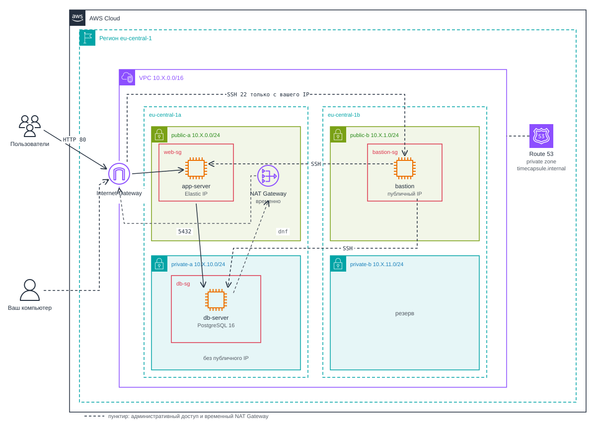

# Лабораторная работа №3. Облачные сети. Amazon VPC

## Цель работы

Научиться строить собственную сеть в AWS: разбивать адресное пространство на подсети, настраивать маршрутизацию, выход в интернет и фильтрацию трафика. Затем перенести в эту сеть приложение из лабораторной работы №2 так, чтобы база данных оказалась в приватной подсети, куда из интернета нет дороги.

## Как устроена работа

| Уровень     | Что нужно сделать               | Максимальная оценка |
| ----------- | ------------------------------- | ------------------- |
| Базовый     | Часть 1: задания 1-7            | 7                   |
| Продвинутый | Часть 1 и Часть 2: задания 1-14 | 10                  |

Часть 2 продолжает продвинутую часть ЛР2: вы переносите своё приложение TimeCapsule (или своё приложение) и его данные в новую сеть. Если в ЛР2 вы выполнили только базовый уровень, для Части 2 сначала выполните задания 7-12 ЛР2 и создайте в приложении пользователя и хотя бы одну капсулу.

Часть 2 рассчитана на PostgreSQL. Если ваше приложение использует MySQL или MariaDB, согласуйте замену с преподавателем: на `db-server` понадобятся `mariadb105-server`, порт 3306 в `db-sg`, настройка `bind-address` и перенос данных через `mysqldump`.

> [!NOTE]
> Всё, что понадобится для работы, разобрано в лекции 5 "Виртуальные сети в облаке. Amazon VPC" и в Hands-on 5.1. Если шаг непонятен, сначала загляните туда. Описание шагов в этой работе короче, чем в ЛР2: указаны разделы консоли и параметры, которые нужно заполнить, а очевидные действия вроде кнопок `Create` и `Save` опущены.

## Что вы построите



_Рисунок 3.1. Сеть, которую вы построите в этой работе_

- _VPC_ с четырьмя подсетями в двух зонах доступности. Публичные подсети выходят в интернет через Internet Gateway, приватные в интернет не выходят.
- _bastion_ в `public-b`. Единственный сервер, к которому разрешён SSH из интернета, и только с вашего адреса. На остальные серверы администратор заходит через него.
- _web-server_ в `public-a` (Часть 1). В Части 2 его заменит _app-server_ с вашим приложением и постоянным адресом Elastic IP.
- _db-server_ в `private-a`: PostgreSQL без публичного адреса. Принимает подключения к базе только от веб-сервера.
- _NAT Gateway_ создаётся временно, только чтобы установить пакеты на `db-server`, и сразу удаляется.
- _Приватная зона Route 53_ (Часть 2) даёт базе имя `db.timecapsule.internal`, которое работает только внутри VPC.

## Сколько это стоит

Часть ресурсов оплачивается почасово, даже когда вы ими не пользуетесь. Оценка для одного студента на три месяца, если серверы работают около 3 часов в день, а в остальное время остановлены:

| Ресурс                                   | Как оплачивается                                 | За 3 месяца |
| ---------------------------------------- | ------------------------------------------------ | ----------: |
| VPC, подсети, таблицы маршрутов, IGW, Security Group, Network ACL | Бесплатно                  | $0          |
| 3 экземпляра `t3.micro`                  | Только пока экземпляр запущен                     | ≈ $10       |
| Публичный IP bastion                     | $0,005 в час, только пока bastion запущен         | ≈ $1,4      |
| Elastic IP `app-server`                  | $0,005 в час _всегда_, даже у остановленного сервера | ≈ $11    |
| 3 диска по 8 ГБ                          | Всегда, пока диск существует                      | ≈ $7        |
| Приватная зона Route 53                  | $0,50 в месяц                                     | $1,5        |
| NAT Gateway на время установки пакетов   | Почасово и за каждый ГБ, пока существует          | центы       |
| **Итого**                                |                                                   | **≈ $31**   |

> [!WARNING]
> Забытый NAT Gateway стоит около $1,25 в сутки, это больше, чем всё остальное вместе. Создавайте его только на время установки пакетов и удаляйте в тот же день. После каждого занятия останавливайте экземпляры.

## Перед началом

- Выполнена ЛР2, у вас есть ключ `yournickname-keypair.pem` и настроенный AWS CLI.
- Все ресурсы создавайте в регионе `eu-central-1` (Frankfurt).

Во всех заданиях `X` означает число `k % 30`, то есть остаток от деления вашего номера на 30. Например, при `k = 12` диапазон VPC будет `10.12.0.0/16`, при `k = 31` будет `10.1.0.0/16`. `k` - ваш порядковый номер в группе.

## Имена и теги

В рабочем аккаунте AWS сотни ресурсов, и по идентификатору вида `sg-0a1b2c3d4e5f` не понять, чей это ресурс, к какому проекту он относится и можно ли его удалить. Поэтому команды заранее договариваются, как называть ресурсы и какие метки на них вешать. В этой работе вы следуете такому соглашению для _каждого_ ресурса, который создаёте.

**Тег (tag)** - метка вида `ключ = значение`, которую прикрепляют к ресурсу AWS. По тегам ищут ресурсы, считают расходы по проектам и находят, кто отвечает за ресурс. Тег с ключом `Name` консоль показывает как имя ресурса.

### Правило имени

Имя строится по шаблону `<проект>-<окружение>-<роль>[-<зона>]`: только строчные латинские буквы, цифры и дефисы. Проект `timecapsule`, окружение `dev`.

| Ресурс                        | Имя                                                                                                  | Как он называется в заданиях |
| ----------------------------- | ---------------------------------------------------------------------------------------------------- | ---------------------------- |
| VPC                           | `timecapsule-dev-vpc`                                                                                | VPC                          |
| Подсети                       | `timecapsule-dev-public-a`, `timecapsule-dev-public-b`, `timecapsule-dev-private-a`, `timecapsule-dev-private-b` | `public-a`, `public-b`, `private-a`, `private-b` |
| Internet Gateway              | `timecapsule-dev-igw`                                                                                | Internet Gateway             |
| Таблицы маршрутов             | `timecapsule-dev-public-rt`, `timecapsule-dev-private-rt`                                            | `public-rt`, `private-rt`    |
| Security Group                | `timecapsule-dev-bastion-sg`, `timecapsule-dev-web-sg`, `timecapsule-dev-db-sg`                      | `bastion-sg`, `web-sg`, `db-sg` |
| Экземпляры                    | `timecapsule-dev-bastion`, `timecapsule-dev-web`, `timecapsule-dev-db`, `timecapsule-dev-app`        | `bastion`, `web-server`, `db-server`, `app-server` |
| NAT Gateway и его Elastic IP  | `timecapsule-dev-nat-a`, `timecapsule-dev-nat-a-eip`                                                 | NAT Gateway                  |
| Elastic IP `app-server`       | `timecapsule-dev-app-eip`                                                                            | Elastic IP                   |
| Образ (AMI)                   | `timecapsule-dev-app-lab2`                                                                           | образ                        |

Приватная зона Route 53 называется `timecapsule.internal`: это доменное имя, к нему правило не применяется. Ключ `yournickname-keypair` остаётся с прежним именем из ЛР2.

Чтобы текст заданий читался легче, дальше ресурсы называются коротко, по роли: `web-sg` означает группу `timecapsule-dev-web-sg`, `db-server` означает экземпляр `timecapsule-dev-db`. В консоли всегда используйте полное имя.

### Обязательные теги

| Ключ          | Значение              | Зачем                                              |
| ------------- | --------------------- | -------------------------------------------------- |
| `Name`        | Имя по правилу выше   | Как ресурс называется в консоли                    |
| `Project`     | `timecapsule`         | К какому проекту относится ресурс                  |
| `Environment` | `dev`                 | Окружение: `dev`, `stage` или `prod`               |
| `Owner`       | Ваш `nickname`        | Кто отвечает за ресурс и кого спрашивать о нём      |
| `Lab`         | `lab3`                | В какой работе создан ресурс                       |

Почти в каждой форме создания ресурса в консоли есть раздел `Tags`. Несколько мест, где теги легко пропустить:

- _Security Group_. Поле `Security group name` задаёт имя группы, но не тег `Name`. Добавьте тег `Name` с тем же значением, иначе в списке групп колонка `Name` останется пустой.
- _Экземпляр EC2_. В разделе `Name and tags` нажмите `Add additional tags` и для каждого тега выберите типы ресурсов `Instances` и `Volumes`: так теги получат и диски.
- _Образ (AMI)_. При создании образа выберите `Tag image and snapshots together`, чтобы теги получил и снимок диска.
- _AWS CLI_. У большинства команд создания есть параметр `--tag-specifications`.

> [!TIP]
> Теги удобно проверять в `Resource Groups & Tag Editor` → `Tag Editor`: выберите регион `eu-central-1`, тип ресурсов `All supported resource types` и тег `Project` = `timecapsule`. В списке должны оказаться все ваши ресурсы. Если какого-то не хватает, у него нет тега.

## Часть 1. Базовый уровень

### Задание 1. План адресов

Прежде чем что-то создавать, распланируйте адреса. Сеть потом трудно переделать: диапазон VPC изменить нельзя, а подсеть с работающими серверами придётся удалять вместе с ними.

1. Вычислите своё число `X` по формуле из раздела "Перед началом" и подставьте его во все диапазоны.
2. Заполните в отчёте таблицу:

   | Подсеть     | Зона доступности | Диапазон        | Первый и последний адрес, доступный экземплярам | Сколько адресов доступно экземплярам |
   | ----------- | ---------------- | --------------- | ----------------------------------------------- | ------------------------------------ |
   | `public-a`  | `eu-central-1a`  | `10.X.0.0/24`   |                          |                                      |
   | `public-b`  | `eu-central-1b`  | `10.X.1.0/24`   |                          |                                      |
   | `private-a` | `eu-central-1a`  | `10.X.10.0/24`  |                          |                                      |
   | `private-b` | `eu-central-1b`  | `10.X.11.0/24`  |                          |                                      |

Обратите внимание на схему нумерации: публичные подсети начинаются с `10.X.0`, приватные с `10.X.10`. По третьему числу адреса сразу видно, в какой подсети находится сервер, а между группами остаётся место для новых подсетей.

> Почему доступных адресов не 256? Какие адреса подсети `10.X.0.0/24` занимает AWS и для чего? Сколько ещё подсетей `/24` поместится в вашу VPC?

### Задание 2. VPC и подсети

1. _Создайте VPC_. Откройте консоль `VPC` → `Your VPCs` → `Create VPC` и заполните форму:
   - `Resources to create`: `VPC only`. Вариант `VPC and more` создаст подсети, шлюзы и таблицы автоматически, но в этой работе вы собираете сеть вручную, чтобы увидеть каждую деталь.
   - `Name tag`: `timecapsule-dev-vpc`.
   - `IPv4 CIDR block`: `IPv4 CIDR manual input`, диапазон `10.X.0.0/16`.
   - `IPv6 CIDR block`: `No IPv6 CIDR block`.
   - `Tags`: поле `Name` уже заполнено из `Name tag`. Добавьте остальные обязательные теги: `Project`, `Environment`, `Owner`, `Lab`.
2. _Включите DNS-имена_. Выберите VPC → `Actions` → `Edit VPC settings`:
   - Убедитесь, что включён `Enable DNS resolution`. Он позволяет серверам пользоваться DNS-сервером VPC.
   - Включите `Enable DNS hostnames`. Без него не будет работать приватная зона Route 53 в Части 2.
3. _Создайте подсети_. Откройте `Subnets` → `Create subnet` и выберите `timecapsule-dev-vpc`. Для каждой подсети из таблицы задания 1 укажите:
   - `Subnet name`: полное имя, например `timecapsule-dev-public-a`.
   - `Availability Zone`: зону из таблицы.
   - `IPv4 subnet CIDR block`: диапазон из таблицы.
   - Обязательные теги.

   Кнопка `Add new subnet` добавляет в форму ещё одну подсеть, поэтому все четыре можно создать за один раз.

> [!NOTE]
> Вместе с VPC AWS автоматически создал три ресурса без имени: основную таблицу маршрутов (main route table), Network ACL и Security Group по умолчанию. Вы увидите их в списках. В этой работе основная таблица не используется: каждую подсеть вы явно свяжете со своей таблицей в задании 3.

> Является ли подсеть `public-a` сейчас публичной? Почему?

### Задание 3. Internet Gateway и таблицы маршрутов

Подсеть становится публичной не из-за названия, а из-за маршрута в интернет. Сейчас вы этот маршрут создадите.

1. _Создайте Internet Gateway_. `Internet gateways` → `Create internet gateway`, имя `timecapsule-dev-igw`, обязательные теги. Созданный шлюз находится в состоянии `Detached`: он ещё ни к чему не подключён.
2. _Подключите его к VPC_. `Actions` → `Attach to VPC` → `timecapsule-dev-vpc`. Состояние должно смениться на `Attached`.
3. _Создайте таблицу `public-rt`_. `Route tables` → `Create route table`: имя `timecapsule-dev-public-rt`, VPC `timecapsule-dev-vpc`, обязательные теги. Затем:
   - На вкладке `Routes` нажмите `Edit routes` → `Add route`: `Destination` `0.0.0.0/0`, `Target` `Internet Gateway` → `timecapsule-dev-igw`.
   - На вкладке `Subnet associations` нажмите `Edit subnet associations` и отметьте `public-a` и `public-b`.
4. _Создайте таблицу `private-rt`_. Имя `timecapsule-dev-private-rt`, обязательные теги. Маршрутов не добавляйте, свяжите с таблицей `private-a` и `private-b`.
5. _Включите публичные адреса_. Для `public-a` и `public-b` выберите `Actions` → `Edit subnet settings` и включите `Enable auto-assign public IPv4 address`. Теперь каждый экземпляр, запущенный в этих подсетях, по умолчанию получит публичный адрес. Без публичного адреса маршрут в Internet Gateway бесполезен: шлюзу не на что заменить приватный адрес.

> Какой маршрут есть в обеих таблицах, хотя вы его не добавляли? Что он даёт? Куда уйдёт пакет из `private-a`, адресованный `8.8.8.8`?

### Задание 4. Security Group

Security Group открывают порты для каждого сервера отдельно. Создайте в своей VPC три группы по таблице. Исходящие правила оставьте по умолчанию: они разрешают серверу любые исходящие соединения.

| Группа       | Входящее правило | Источник     | Зачем                                   |
| ------------ | ---------------- | ------------ | --------------------------------------- |
| `bastion-sg` | SSH (22)         | `My IP`      | Администратор заходит на bastion        |
| `web-sg`     | HTTP (80)        | `0.0.0.0/0`  | Пользователи открывают сайт             |
| `web-sg`     | SSH (22)         | `bastion-sg` | SSH на веб-сервер только через bastion  |
| `db-sg`      | PostgreSQL (5432)| `web-sg`     | К базе подключается только веб-сервер   |
| `db-sg`      | SSH (22)         | `bastion-sg` | SSH на сервер базы только через bastion |

1. Откройте `EC2` → `Security Groups` → `Create security group` (та же страница есть в консоли `VPC`).
2. Для каждой группы заполните:
   - `Security group name`: полное имя, например `timecapsule-dev-bastion-sg`.
   - `Description`: коротко, для чего группа, например `SSH access to bastion`. Поле обязательное.
   - `VPC`: `timecapsule-dev-vpc`. По умолчанию здесь выбрана default VPC, и группа из неё не подойдёт вашим серверам.
   - `Inbound rules`: правила из таблицы. В поле `Source` для правил с источником-группой начните вводить `sg-` или имя группы и выберите её из списка.
   - `Tags`: тег `Name` с тем же именем и остальные обязательные теги.
3. Создавайте группы по порядку: `bastion-sg`, `web-sg`, `db-sg`. Группу можно выбрать источником, только когда она уже существует.

В Hands-on 5.1 роль jump host выполнял сам веб-сервер. Здесь, как в рабочей архитектуре, это отдельный `bastion`, а SSH на веб-сервер из интернета закрыт.

> Почему в `db-sg` источником указана группа `web-sg`, а не адрес веб-сервера или диапазон `10.X.0.0/16`?

### Задание 5. Экземпляры

1. _Запустите три экземпляра_ по таблице:

   | Роль         | Имя в консоли             | Подсеть     | Публичный IP | Security Group |
   | ------------ | ------------------------- | ----------- | ------------ | -------------- |
   | `bastion`    | `timecapsule-dev-bastion` | `public-b`  | Enable       | `bastion-sg`   |
   | `web-server` | `timecapsule-dev-web`     | `public-a`  | Enable       | `web-sg`       |
   | `db-server`  | `timecapsule-dev-db`      | `private-a` | Disable      | `db-sg`        |

   Для каждого экземпляра в `EC2` → `Launch instances`:
   - `Name and tags`: имя из таблицы. Нажмите `Add additional tags` и добавьте остальные обязательные теги, для каждого выбрав `Resource types` `Instances` и `Volumes`.
   - `Application and OS Images`: Amazon Linux 2023. `Instance type`: `t3.micro`. `Key pair`: `yournickname-keypair`.
   - `Network settings`: нажмите `Edit` и укажите `VPC` `timecapsule-dev-vpc`, подсеть и `Auto-assign public IP` из таблицы, `Firewall` → `Select existing security group` и группу из таблицы. Если не нажать `Edit`, экземпляр окажется в default VPC.

   Bastion намеренно стоит в `public-b`, а остальные серверы в зоне `a`. Так в сети задействованы обе зоны доступности, и вы увидите, что серверы из разных зон связываются друг с другом через локальный маршрут VPC так же, как из одной зоны.

2. _Установите nginx на `web-server`_. При запуске `web-server` раскройте `Advanced details` и вставьте в поле `User data` скрипт. Он установит nginx и покажет на странице имя сервера и его адрес:

   ```bash
   #!/bin/bash
   dnf -y install nginx
   echo "<h1>$(hostname)</h1><p>$(hostname -I)</p>" > /usr/share/nginx/html/index.html
   systemctl enable --now nginx
   ```

3. _Проверьте сайт_. Через минуту-две после запуска откройте в браузере `http://<публичный IP web-server>`. На странице должно быть имя сервера и его приватный адрес из `10.X.0.0/24`.

#### Подключение через bastion

Подключаться к `web-server` и `db-server` напрямую нельзя: у `db-server` нет публичного адреса, а SSH на оба сервера разрешён только от `bastion-sg`. Весь SSH идёт через bastion.

4. _Опишите серверы в настройках SSH_. Чтобы не набирать длинные команды, создайте на своём компьютере файл `~/.ssh/config` (macOS и Linux) или `C:\Users\<имя>\.ssh\config` (Windows):

   ```text
   Host bastion
       HostName <публичный IP bastion>
       User ec2-user
       IdentityFile ~/.ssh/yournickname-keypair.pem

   Host web
       HostName <приватный IP web-server>
       User ec2-user
       IdentityFile ~/.ssh/yournickname-keypair.pem
       ProxyJump bastion

   Host db
       HostName <приватный IP db-server>
       User ec2-user
       IdentityFile ~/.ssh/yournickname-keypair.pem
       ProxyJump bastion
   ```

   - `Host` задаёт короткое имя, по которому вы будете подключаться.
   - `HostName` указывает настоящий адрес. Для `web` и `db` это приватные адреса: к ним подключается уже bastion изнутри VPC.
   - `ProxyJump bastion` означает "сначала подключись к bastion, а через него к этому серверу". Приватный ключ при этом остаётся на вашем компьютере: копировать его на bastion нельзя.

5. _Проверьте подключение_. Выполните по очереди `ssh bastion`, `ssh web` и `ssh db`. Каждый раз выходите командой `exit`.

> [!IMPORTANT]
> Публичный адрес bastion меняется после каждой остановки и запуска экземпляра. В начале каждого занятия обновляйте строку `HostName` у `bastion`. Приватные адреса `web-server` и `db-server` не меняются.

6. _Попробуйте установить пакет на `db-server`_. Подключитесь командой `ssh db` и выполните:

   ```bash
   sudo dnf -y install postgresql16-server
   ```

   Команда зависнет. Подождите минуту и прервите её клавишами `Ctrl+C`.

> Почему `db-server` не может скачать пакеты, хотя `web-server` это делает? Что нужно добавить в сеть, чтобы это стало возможно, и при этом `db-server` остался недоступным из интернета?

### Задание 6. Временный NAT Gateway

NAT Gateway даёт серверам приватной подсети выход в интернет, но не пускает соединения снаружи. Он оплачивается за каждый час работы, поэтому в этой работе вы создаёте его только на время установки пакетов.

1. _Создайте NAT Gateway_. `VPC` → `NAT gateways` → `Create NAT gateway`:
   - `Name`: `timecapsule-dev-nat-a`.
   - Режим `Zonal`, `Subnet`: `public-a`. NAT Gateway ставится в _публичную_ подсеть: сам он выходит в интернет через Internet Gateway.
   - `Connectivity type`: `Public`.
   - `Elastic IP allocation ID`: нажмите `Allocate Elastic IP`. Этот адрес станет общим внешним адресом всех серверов приватной подсети.
   - Обязательные теги.
2. _Подпишите Elastic IP шлюза_. Адрес, выделенный из формы NAT Gateway, тегов не получает. Найдите его в `Elastic IPs` и на вкладке `Tags` задайте `Name` `timecapsule-dev-nat-a-eip` и остальные обязательные теги.
3. _Добавьте маршрут_. Дождитесь состояния `Available` (обычно несколько минут). Затем в `private-rt` → `Routes` → `Edit routes` добавьте маршрут `0.0.0.0/0` с `Target` `NAT Gateway` → `timecapsule-dev-nat-a`.
4. _Установите PostgreSQL_. На `db-server` проверьте, с какого адреса сервер выходит в интернет, и установите пакеты:

   ```bash
   curl https://checkip.amazonaws.com
   sudo dnf -y update
   sudo dnf -y install postgresql16-server
   ```

   > Какой адрес вернула первая команда? Сравните его с Elastic IP NAT Gateway. Почему это не адрес `db-server`?

5. _Настройте PostgreSQL_ так, чтобы он принимал подключения по сети, но только из подсети `public-a`. Во всех командах замените `X` на своё число.
   1. Создайте служебные файлы и каталог данных:

      ```bash
      sudo postgresql-setup --initdb
      ```

   2. Разрешите PostgreSQL слушать сетевые интерфейсы. По умолчанию он принимает подключения только с `localhost`, то есть с этого же сервера:

      ```bash
      sudo sed -i "s/^#listen_addresses = 'localhost'/listen_addresses = '*'/" /var/lib/pgsql/data/postgresql.conf
      ```

   3. Разрешите вход по паролю с адресов подсети `public-a`. Файл `pg_hba.conf` решает, _кому_ и _куда_ можно войти: тип подключения, база, пользователь, диапазон адресов, способ проверки пароля:

      ```bash
      echo "host  all  all  10.X.0.0/24  scram-sha-256" | sudo tee -a /var/lib/pgsql/data/pg_hba.conf
      ```

   4. Запустите PostgreSQL и включите автозапуск:

      ```bash
      sudo systemctl enable --now postgresql
      ```

   5. Создайте пользователя и базу для проверки:

      ```bash
      sudo -u postgres psql -c "CREATE USER student WITH PASSWORD 'ваш-пароль';"
      sudo -u postgres psql -c "CREATE DATABASE lab3 OWNER student;"
      ```

   > Доступ к базе теперь ограничивают три механизма: отсутствие публичного адреса и маршрута в Internet Gateway, Security Group `db-sg` и файл `pg_hba.conf`. Что делает каждый из них? Что произойдёт, если ошибиться только в одном?

6. _Удалите NAT Gateway_. Выберите шлюз → `Actions` → `Delete NAT gateway`. Удаление занимает несколько минут.
7. _Удалите маршрут_. Когда шлюз перейдёт в состояние `Deleted`, откройте `private-rt`. Маршрут `0.0.0.0/0` теперь в состоянии `Blackhole`, то есть ведёт в несуществующий шлюз. Удалите его в `Edit routes`.
8. _Освободите Elastic IP шлюза_. `Elastic IPs` → адрес `timecapsule-dev-nat-a-eip` → `Actions` → `Release Elastic IP addresses`. Если консоль сообщает, что адрес ещё привязан, подождите минуту: шлюз отпускает адрес не сразу после перехода в `Deleted`.

> Почему PostgreSQL продолжает работать после удаления NAT Gateway? Что придётся сделать, когда на `db-server` понадобится установить обновления безопасности?

### Задание 7. Проверки

1. _Доступ к базе_. Подключитесь к `web-server` (`ssh web`), установите клиент PostgreSQL и подключитесь к базе:

   ```bash
   sudo dnf -y install postgresql16
   psql -h <приватный IP db-server> -U student -d lab3 -c "SELECT version();"
   ```

   Пакет `postgresql16` содержит только клиент `psql`, без сервера. Команда должна спросить пароль и вывести версию PostgreSQL.

2. _Security Group в действии_. Проверьте, открыт ли порт 5432 базы с `web-server` и с `bastion`:

   ```bash
   timeout 5 bash -c '</dev/tcp/<приватный IP db-server>/5432' && echo open || echo closed
   ```

   Эта команда пытается открыть TCP-соединение и через 5 секунд сдаётся.

   > Почему с `web-server` порт открыт, а с `bastion` нет, хотя оба сервера в одной VPC и маршрут между ними есть?

3. _Изоляция базы_. С `db-server` выполните `curl -m 5 https://github.com`. Параметр `-m 5` ограничивает ожидание пятью секундами.

   > Почему запрос не проходит? Можно ли из интернета подключиться к порту 5432 `db-server`? Объясните по цепочке из лекции: маршрут, адрес, фильтры.

4. _Network ACL_. Network ACL фильтрует трафик на границе подсети, до того как он дойдёт до Security Group сервера.
   1. Узнайте свой внешний адрес: он указан в правиле `bastion-sg` или на странице `https://checkip.amazonaws.com`.
   2. Откройте `VPC` → `Network ACLs` и выберите Network ACL по умолчанию вашей VPC (колонка `VPC` = `timecapsule-dev-vpc`).
   3. На вкладке `Inbound rules` → `Edit inbound rules` добавьте правило: `Rule number` `90`, `Type` `All traffic`, `Source` `<ваш IP>/32`, действие `Deny`.
   4. Проверьте `ssh bastion` и сайт в браузере.
   5. Откройте сайт с телефона через мобильный интернет, не через Wi-Fi.
   6. Удалите правило `90` и проверьте, что SSH и сайт снова работают.

   > Почему заблокировано и SSH, и сайт, хотя вы не меняли ни одной Security Group? Почему с телефона сайт открывается? Почему правило должно иметь номер меньше 100?

5. _Имена и теги_.
   1. Откройте `Resource Groups & Tag Editor` → `Tag Editor`.
   2. Выберите регион `eu-central-1`, `Resource types` `All supported resource types`, тег `Project` = `timecapsule` и нажмите `Search resources`.
   3. Сверьте список со схемой на рисунке 3.1: VPC, подсети, Internet Gateway, таблицы маршрутов, Security Group, экземпляры и их диски.
   4. Ресурсы, которых в списке нет, дополните тегами. Это можно сделать прямо в `Tag Editor`: найдите ресурс без фильтра по тегу, отметьте его и нажмите `Manage tags of selected resources`.

   > Как по тегам найти все ресурсы, которые нужно удалить после окончания проекта? Зачем нужен тег `Owner`, если аккаунт у вас личный?

6. _Остановите все три экземпляра_: `Instance state` → `Stop instance`. За остановленный экземпляр не платят за вычисления и публичный адрес, но его диск продолжает оплачиваться.

## Часть 2. Продвинутый уровень

### Что меняется

В ЛР2 приложение и база жили на одном сервере в default VPC. Теперь вы разнесёте их по разным подсетям:

| Что                       | ЛР2                                          | ЛР3                                                     |
| ------------------------- | -------------------------------------------- | ------------------------------------------------------- |
| Сеть                      | Default VPC, все подсети публичные           | Своя VPC, база в приватной подсети                       |
| Сервер приложения         | `webserver`, адрес меняется после запуска    | `app-server` с Elastic IP                               |
| База данных               | PostgreSQL на том же сервере, `localhost`    | Отдельный `db-server`, имя `db.timecapsule.internal`    |
| SSH                       | Прямо на сервер с вашего IP                  | Только через bastion                                    |
| Деплой                    | `ssh ... ./deploy.sh` или вручную            | Тот же способ, но через bastion                          |

### Задание 8. Перенос сервера ЛР2 в новую сеть

Экземпляр нельзя перенести из одной VPC в другую. Поэтому вы создадите из сервера ЛР2 образ и запустите из него новый сервер уже в своей сети.

Напомним: образ (AMI) - это снимок дисков экземпляра вместе с описанием, из которого можно запустить сколько угодно новых экземпляров с тем же содержимым.

1. _Подготовьте серверы_.
   - Запустите `bastion` и `db-server` и обновите `HostName` у `bastion` в `~/.ssh/config`.
   - Запустите `webserver` из ЛР2 и убедитесь, что приложение открывается в браузере.
2. _Создайте образ_. Выберите `webserver` → `Actions` → `Image and templates` → `Create image`:
   - `Image name`: `timecapsule-dev-app-lab2`.
   - `Tags`: выберите `Tag image and snapshots together` и добавьте обязательные теги.

   При создании образа экземпляр перезагрузится: так AWS получает согласованный снимок диска, в который не пишут в этот момент.
3. _Запустите `app-server` из образа_. Дождитесь, пока образ перейдёт в состояние `Available` (`EC2` → `AMIs`), и запустите экземпляр:
   - `Name`: `timecapsule-dev-app` и обязательные теги для `Instances` и `Volumes`.
   - `Application and OS Images`: вкладка `My AMIs` → `timecapsule-dev-app-lab2`.
   - `Instance type`: `t3.micro`, `Key pair`: `yournickname-keypair`.
   - `Network settings`: `timecapsule-dev-vpc`, подсеть `public-a`, группа `web-sg`.

   User data указывать не нужно: nginx, PHP и приложение уже есть в образе.
4. _Подключитесь к `app-server`_. Добавьте в `~/.ssh/config` запись `Host app` по образцу `web` с приватным адресом `app-server` и выполните `ssh app`.
5. _Завершите `web-server` из Части 1_ (`Instance state` → `Terminate instance`): его роль теперь выполняет `app-server`.

> Что содержит образ? Какие данные из ЛР2 оказались на `app-server` без всякой установки? Где сейчас хранится база данных приложения?

### Задание 9. Elastic IP

Публичный адрес `app-server` меняется после каждой остановки и запуска, и каждый раз пришлось бы править `APP_URL` и адрес в браузере. Elastic IP закрепляет за сервером постоянный адрес.

1. _Выделите Elastic IP_. `Elastic IPs` → `Allocate Elastic IP address`. В разделе `Tags` задайте `Name` `timecapsule-dev-app-eip` и остальные обязательные теги.
2. _Привяжите его к `app-server`_. Выберите адрес → `Actions` → `Associate Elastic IP address` → `Instance` `timecapsule-dev-app`. Автоматически выданный публичный адрес сервера при этом заменится на Elastic IP.
3. _Обновите адрес приложения_. На `app-server` замените в `/var/www/timecapsule/.env` значение `APP_URL` на `http://<Elastic IP>` и выполните `sudo systemctl reload php-fpm`.
4. _Проверьте_. Откройте приложение в браузере по Elastic IP и войдите под пользователем, которого вы создали в ЛР2.

> Почему Elastic IP нужен `app-server`, но не нужен bastion? Сколько стоит Elastic IP, пока сервер остановлен, и почему? Когда в следующих работах перед сервером появится балансировщик нагрузки, понадобится ли Elastic IP?

### Задание 10. База данных приложения на `db-server`

1. _Создайте пользователя и базу_. На `db-server` выполните, как в задании 9 ЛР2:

   ```bash
   sudo -u postgres psql -c "CREATE USER timecapsule WITH PASSWORD 'новый-пароль';"
   sudo -u postgres psql -c "CREATE DATABASE timecapsule OWNER timecapsule;"
   ```

   Пароль придумайте новый, не тот, что был в ЛР2.

2. _Ужесточите `pg_hba.conf`_. Строка из задания 6 разрешает вход _всем_ пользователям во _все_ базы из `public-a`. Откройте файл (`sudo nano /var/lib/pgsql/data/pg_hba.conf`) и замените её на строку, которая пускает только пользователя `timecapsule` в базу `timecapsule`. Формат строки тот же, меняются второе и третье поля.
3. _Перезапустите PostgreSQL_: `sudo systemctl restart postgresql`. Если сервис не запустился, посмотрите ошибку командой `sudo journalctl -u postgresql -n 20`.

> Зачем для базы в отдельной сети нужен новый сильный пароль, если порт 5432 и так закрыт Security Group?

### Задание 11. Приватная зона Route 53

Приложение может обращаться к базе по приватному IP, но если `db-server` пересоздадут, адрес изменится и придётся править `.env`. Дадим базе имя, которое будет работать только внутри вашей VPC.

1. _Создайте приватную зону_. `Route 53` → `Hosted zones` → `Create hosted zone`:
   - `Domain name`: `timecapsule.internal`.
   - `Type`: `Private hosted zone`.
   - `VPCs to associate with the hosted zone`: регион `eu-central-1`, VPC `timecapsule-dev-vpc`. Только серверы этой VPC будут видеть имена зоны.
   - `Tags`: обязательные теги.
2. _Создайте запись для базы_. В зоне нажмите `Create record`:
   - `Record name`: `db`. Полное имя получится `db.timecapsule.internal`.
   - `Record type`: `A`, то есть имя указывает на адрес IPv4.
   - `Value`: приватный IP `db-server`.
   - `TTL`: `60`. Столько секунд клиенты могут помнить ответ, прежде чем спросить снова.
3. _Проверьте имя_ с `app-server` и со своего компьютера:

   ```bash
   dig +short db.timecapsule.internal
   ```

   В Windows вместо `dig` используйте `nslookup db.timecapsule.internal`.

   > [!NOTE]
   > Новая запись начинает работать не сразу. Подождите одну-две минуты после создания записи, прежде чем проверять имя. Если проверить слишком рано, DNS запомнит ответ "такого имени нет" и может возвращать его ещё до 15 минут. В этом случае просто подождите.

> Почему с `app-server` имя находится, а с вашего компьютера нет? Что придётся изменить, если `db-server` пересоздадут с другим адресом?

### Задание 12. Перенос данных и переключение приложения

1. _Выгрузите данные из старой базы_. На `app-server` сохраните локальную базу ЛР2 в файл:

   ```bash
   pg_dump -h localhost -U timecapsule -d timecapsule -f timecapsule.sql
   ```

   `pg_dump` записывает в файл SQL-команды, которые создают таблицы и вставляют все строки. Команда спросит пароль от локальной базы из ЛР2.

2. _Загрузите данные в новую базу_ по приватной сети:

   ```bash
   psql -h db.timecapsule.internal -U timecapsule -d timecapsule -f timecapsule.sql
   ```

   Команда спросит пароль от новой базы из задания 10.

3. _Переключите приложение_. В `/var/www/timecapsule/.env` замените `DB_HOST=localhost` на `DB_HOST=db.timecapsule.internal` и укажите новый пароль в `DB_PASSWORD`. Перезапустите PHP-FPM: `sudo systemctl reload php-fpm`.

   > [!NOTE]
   > Для Laravel после правки `.env` выполните `php artisan config:cache`, иначе приложение продолжит использовать старые настройки. Для Node.js вместо перезапуска PHP-FPM выполните `pm2 restart timecapsule`.

4. _Выключите локальную базу_, чтобы приложение точно не могло к ней обратиться:

   ```bash
   sudo systemctl disable --now postgresql
   ```

   Если после этого приложение сломалось, значит, оно всё ещё обращалось к `localhost`: проверьте `.env`.

5. _Проверьте приложение_. Откройте `/health` (ответ `"db":"ok"`) и главную страницу. Капсулы, созданные в ЛР2, должны остаться на месте.
6. _Удалите образ_. Образ хранится как снимок диска и оплачивается, пока существует. Когда приложение заработало с новой базой:
   - `AMIs` → `timecapsule-dev-app-lab2` → `Actions` → `Deregister AMI`.
   - В `Snapshots` удалите снимок, в описании которого указан ID этого образа.

> Файлы, которые пользователи прикрепили к капсулам, переехали вместе с образом, а не вместе с базой. Где они лежат? Что с ними будет, если `app-server` удалить?

### Задание 13. Деплой и обслуживание

1. _Новая версия_.
   1. Внесите заметное изменение в приложение, например добавьте в подвал страницы строку "LR3".
   2. Отправьте изменение в репозиторий.
   3. Выпустите его своим способом из ЛР2. SSH на `app-server` теперь идёт через bastion, но благодаря `~/.ssh/config` команда выглядит просто. Вариант B: `ssh app ./deploy.sh`. Вариант A: `ssh app`, затем команды из ЛР2.

   > Почему в самом `deploy.sh` (или в командах варианта A) ничего менять не пришлось?

2. _Отказ базы_.
   1. Остановите `db-server`.
   2. Откройте `/health` и главную страницу. Ответ может прийти только через полминуты: приложение ждёт соединения с базой.
   3. Запустите `db-server` снова и дождитесь, пока приложение заработает, ничего не меняя на `app-server`.

   > Что показал `/health` и почему? Изменился ли приватный адрес `db-server` после остановки и запуска?

3. _Обновление пакетов на `db-server`_. Установите обновления безопасности на `db-server` (`sudo dnf -y update`). Для этого снова нужен временный NAT Gateway. Способ зависит от специальности:

   | Специальность        | Как поднять и убрать NAT Gateway                                               |
   | -------------------- | ------------------------------------------------------------------------------ |
   | Informatică aplicată | Вариант A: в консоли, как в задании 6                                         |
   | Informatică          | Вариант B: скрипты `nat-up.sh` и `nat-down.sh` на AWS CLI                    |

   _Вариант B_. Напишите в репозитории, в папке `scripts`, два скрипта.

   Скрипт `nat-up.sh`:
   1. Выделяет Elastic IP (`aws ec2 allocate-address`).
   2. Создаёт NAT Gateway в `public-a` (`aws ec2 create-nat-gateway`).
   3. Ждёт, пока шлюз станет доступен (`aws ec2 wait nat-gateway-available`).
   4. Добавляет маршрут `0.0.0.0/0` в `private-rt` (`aws ec2 create-route`).
   5. Сохраняет идентификаторы шлюза и Elastic IP в файл, чтобы их нашёл второй скрипт.

   Скрипт `nat-down.sh`:
   1. Удаляет маршрут (`aws ec2 delete-route`).
   2. Удаляет NAT Gateway (`aws ec2 delete-nat-gateway`).
   3. Ждёт его удаления (`aws ec2 wait nat-gateway-deleted`).
   4. Освобождает Elastic IP (`aws ec2 release-address`). Сразу после удаления шлюза команда может завершиться ошибкой, потому что адрес ещё не отпущен. Предусмотрите паузу или несколько повторных попыток.

   Требования к обоим скриптам:
   - Идентификаторы подсети и таблицы маршрутов задайте переменными в начале скрипта, регион переменной `AWS_REGION=eu-central-1`.
   - NAT Gateway и Elastic IP получают имена и обязательные теги по соглашению (параметр `--tag-specifications`).
   - В начале скрипта стоит `set -euo pipefail`, как в `deploy.sh`: скрипт остановится на первой ошибке, а не продолжит работу с пустыми переменными.
   - Файл с идентификаторами добавлен в `.gitignore`.
   - Запускайте скрипты в AWS CloudShell или в Git Bash.

   > Почему `nat-down.sh` должен освобождать Elastic IP только после того, как NAT Gateway удалён?

### Задание 14. Архитектура и решение

1. _Обновите схему_ из ЛР2. Образец оформления на рисунке 3.1. Если схемы из ЛР2 у вас нет, нарисуйте её с нуля. На схеме должны быть:
   - Пользователи, ваш компьютер и GitHub вне AWS.
   - AWS Cloud, регион и `timecapsule-dev-vpc`.
   - Две зоны доступности и четыре подсети.
   - Internet Gateway.
   - Три сервера с их Security Group.
   - Приватная зона Route 53.
   - Временный NAT Gateway, показанный пунктиром.

   Подпишите ресурсы полными именами по соглашению из раздела "Имена и теги".
2. _Запишите решение_ в файл `docs/adr/0002-database-placement.md` по шаблону ADR из ЛР2. Решение: где размещать базу данных. Сравните как минимум три варианта:
   - На одном сервере с приложением, как в ЛР2.
   - На отдельном сервере в публичной подсети.
   - На отдельном сервере в приватной подсети.

   В разделе "Последствия" обязательно укажите:
   - Как база получает обновления без постоянного выхода в интернет и сколько это стоит.
   - Почему у `app-server` Elastic IP и что изменится, когда перед ним появится балансировщик нагрузки.

## Завершение работы

1. _Продвинутый уровень_. Завершите `webserver` из ЛР2: приложение и данные теперь живут в `timecapsule-dev-vpc`. Остановите `bastion`, `app-server` и `db-server`.
2. _Базовый уровень_. Проверьте, что `bastion`, `web-server` и `db-server` остановлены. `webserver` из ЛР2 не трогайте.
3. Проверьте, что в `NAT gateways` нет шлюзов в состоянии `Available`, а в `Elastic IPs` остался только адрес `app-server` (или ни одного на базовом уровне).
4. VPC, подсети и Security Group не удаляйте: они бесплатны и понадобятся в следующих работах.

> [!TIP]
> Bastion нужен только тогда, когда вы заходите на серверы по SSH. Если вы закончили работу и не хотите платить даже за его диск, его можно завершить (`Terminate`). Когда bastion снова понадобится, запустите новый с теми же настройками из задания 5 и обновите `HostName` в `~/.ssh/config`.

## Частые проблемы и их решения

| Симптом                                                              | Что проверить                                                                                                                                                                  |
| -------------------------------------------------------------------- | ------------------------------------------------------------------------------------------------------------------------------------------------------------------------------ |
| `ssh bastion`: `Could not resolve hostname bastion`                  | Файл должен называться `config` без расширения. В Блокноте при сохранении выберите тип "Все файлы". |
| `ssh bastion` зависает                                               | Актуален ли `HostName` (адрес меняется после запуска); не изменился ли ваш IP (правило `My IP` в `bastion-sg`); запущен ли экземпляр.                                        |
| `ssh db` пишет `Permission denied (publickey)`                       | Путь в `IdentityFile` должен указывать на ваш ключ в записях обоих серверов: и `bastion`, и `db`.                                                                             |
| В Windows `ssh db` пишет ошибку про `ProxyJump` или `CreateProcessW` | Замените строку `ProxyJump bastion` на `ProxyCommand C:\Windows\System32\OpenSSH\ssh.exe -W %h:%p bastion`.                                                                  |
| Сайт не открывается, SSH на bastion работает                         | Маршрут `0.0.0.0/0` в `public-rt` и связь таблицы с `public-a`; есть ли у сервера публичный адрес; правило HTTP в `web-sg`.                                                   |
| `dnf` на `db-server` зависает                                        | Нормально, если NAT Gateway нет. Если есть: состояние `Available`, маршрут в `private-rt` на него, `private-a` связана с `private-rt`, сам NAT в `public-a`, а не в приватной подсети. |
| `psql` с веб-сервера: `timeout expired` или зависает                 | Правило 5432 в `db-sg` с источником `web-sg`; `listen_addresses = '*'` и PostgreSQL перезапущен (`sudo ss -ltn` должен показать `0.0.0.0:5432`).                             |
| `psql`: `no pg_hba.conf entry for host`                              | Строка в `pg_hba.conf` с диапазоном `10.X.0.0/24`, правильные имена пользователя и базы; после правки `sudo systemctl restart postgresql`.                                   |
| `dig db.timecapsule.internal` ничего не возвращает                   | Зона связана именно с вашей VPC; в настройках VPC включены `DNS resolution` и `DNS hostnames`; запрос выполняется с сервера внутри VPC, а не с вашего компьютера. Если всё верно, подождите до 15 минут: ранний пустой ответ мог закэшироваться. |
| `/health` отвечает `"db":"error"` после переключения                 | `DB_HOST` и `DB_PASSWORD` в `.env`; `sudo systemctl reload php-fpm` после изменения; с `app-server` работает `psql -h db.timecapsule.internal -U timecapsule -d timecapsule`. |
| Маршрут в `private-rt` в состоянии `Blackhole`                       | NAT Gateway, на который он указывал, удалён. Удалите маршрут.                                                                                                                |
| Ресурса нет в `Tag Editor`, хотя он создан                           | У ресурса нет тега `Project` или в значении опечатка (`TimeCapsule` и `timecapsule` для AWS разные значения). Добавьте тег во вкладке `Tags` ресурса. Диски экземпляра и снимок AMI теги отдельно не получат, если при создании не были выбраны `Volumes` или `Tag image and snapshots together`. |
| В списке Security Group колонка `Name` пустая                         | Задано только `Security group name`. Добавьте тег `Name` с тем же значением.                                                                                                   |
| Elastic IP не освобождается: адрес ещё привязан                      | NAT Gateway ещё удаляется или только что удалён. Дождитесь состояния `Deleted` и повторите через минуту.                                                                     |

## Контрольные вопросы

Контрольные вопросы указаны в заданиях. Ответьте на них письменно по ходу выполнения работы.

Для продвинутого уровня дополнительно подготовьте устные ответы на вопросы:

1. Как проходит запрос пользователя от браузера до базы данных? Какие маршруты и какие правила фильтрации он проходит на каждом шаге?
2. Злоумышленник знает приватный IP `db-server`. Что ему нужно получить, чтобы подключиться к базе?
3. Чем временный NAT Gateway лучше постоянного, и какие неудобства он создаёт?
4. Как изменится схема, если приложение должно пережить отказ зоны `eu-central-1a`? Каких ресурсов для этого не хватает?

## Отчёт

Требования к отчёту те же, что в ЛР2: `README.md` в формате Markdown (максимум 10) или PDF (максимум 8). Для продвинутого уровня положите отчёт в файл `docs/lab3/README.md` репозитория приложения, отчёт ЛР2 в корне не удаляйте. Подробно описывать шаги не нужно, отчёт это набор доказательств и ваши ответы.

1. Шапка: ФИО, группа, специальность, номер `k`, выбранный уровень, для продвинутого уровня ссылка на репозиторий.
2. Скриншоты базового уровня. Под каждым одна строка: что на нём видно.
   1. Задание 1: заполненная таблица адресов (можно таблицей Markdown).
   2. Задание 3: маршруты `public-rt` и `private-rt` и их связи с подсетями.
   3. Задание 4: входящие правила трёх Security Group.
   4. Задание 5: страница `web-server` в браузере и зависшая установка на `db-server`.
   5. Задание 6: вывод `curl https://checkip.amazonaws.com` на `db-server`, маршрут в состоянии `Blackhole` и список `NAT gateways`, где шлюз в состоянии `Deleted`. Этот скриншот сделайте сразу: удалённый шлюз виден в списке около часа.
   6. Задание 7: вывод `psql` с `web-server`, проверка порта 5432 с `web-server` и `bastion`, результат эксперимента с Network ACL, список ресурсов в `Tag Editor` с тегом `Project` = `timecapsule`.
3. Скриншоты продвинутого уровня:
   1. Задание 9: приложение в браузере по Elastic IP.
   2. Задание 11: запись `db` в зоне и вывод `dig` с `app-server` и `dig` или `nslookup` с вашего компьютера.
   3. Задание 12: вывод `psql -f`, ответ `/health` и капсулы из ЛР2 на странице.
   4. Задание 13: изменение "LR3" на странице, `/health` при остановленной базе, вывод `sudo dnf -y update` на `db-server` и вывод скриптов `nat-up.sh` и `nat-down.sh` (вариант B) или список `NAT gateways` со шлюзом (вариант A).
4. Архитектура (продвинутый уровень): схема и ссылка на ADR-0002.
5. Итог: скриншот `Elastic IPs` и `NAT gateways` после завершения работы.
6. Ответы на контрольные вопросы, по два-четыре предложения на вопрос.

> [!WARNING]
> Не публикуйте в отчёте и в репозитории приватные ключи, пароли и содержимое `.env`. Если они попали на скриншот, закройте их. Не публикуйте свой домашний IP-адрес целиком.

## Представление работы

Представление лабораторной работы обязательно. Без представления максимальная оценка составляет 7 при выполнении всех условий.

На защите преподаватель откроет ваши ресурсы в `Tag Editor`: ресурсы без имён и тегов по соглашению снижают оценку. Нужно подключиться к `db-server` через bastion, показать, почему к базе нельзя подключиться из интернета, и объяснить путь запроса по своей схеме. Для продвинутого уровня дополнительно показать работающее приложение и объяснить, как оно находит базу.

_Если при защите студент не отвечает на вопросы преподавателя, итоговая оценка может быть ниже 7._
