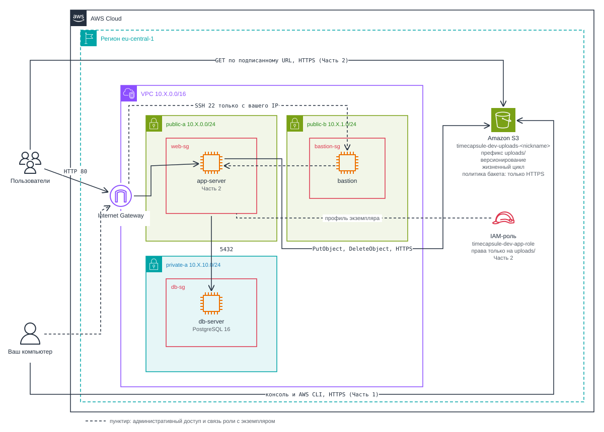

# Лабораторная работа №4. Облачные хранилища. Amazon S3

## Цель работы

Научиться хранить файлы в объектном хранилище Amazon S3 и управлять ими: создавать бакет и объекты в консоли и из командной строки, защищать данные версионированием, ограничивать рост хранилища правилами жизненного цикла и управлять доступом с помощью политик. Затем перенести загруженные файлы приложения из лабораторной работы №3 с диска сервера в S3, чтобы сервер приложения перестал хранить данные пользователей.

## Как устроена работа

| Уровень     | Что нужно сделать               | Максимальная оценка |
| ----------- | ------------------------------- | ------------------- |
| Базовый     | Часть 1: задания 1-6            | 7                   |
| Продвинутый | Часть 1 и Часть 2: задания 1-14 | 10                  |

## Что вы построите



_Рисунок 4.1. Хранилище, которое вы построите в этой работе_

- _Бакет S3_ для вложений приложения: закрыт для публичного доступа, с версионированием, правилом жизненного цикла и политикой, которая запрещает запросы без HTTPS.
- _Подписанные URL_. В Части 1 вы создаёте их из консоли и CLI. В Части 2 их выдаёт приложение, и браузер скачивает вложения напрямую из S3, минуя сервер.
- _Собственная политика IAM_ (Часть 2), которая разрешает работать только с объектами под префиксом `uploads/` и не даёт уничтожать историю версий. Сначала вы проверяете её через тестовую роль, затем ту же политику получает роль сервера, привязанная к `app-server`.

Сеть, bastion и `db-server` из ЛР3 нужны только в Части 2 и остаются без изменений.

## Сколько это стоит

Новых ресурсов с почасовой оплатой в этой работе нет.

| Ресурс                                                   | Как оплачивается                                       |  За 3 месяца |
| -------------------------------------------------------- | ------------------------------------------------------ | -----------: |
| Бакет S3 с несколькими мегабайтами файлов                | Объём хранения, количество запросов, трафик в интернет | меньше $0,05 |
| Политика и роли IAM (Часть 2)                            | Бесплатно                                              |           $0 |
| Экземпляры, диски, Elastic IP, Route 53 из ЛР3 (Часть 2) | Как в ЛР3                                              |    как в ЛР3 |

> [!TIP]
> Версионирование хранит каждую старую версию как отдельный объект. Для учебных файлов это копейки, но привычка ставить правило жизненного цикла для старых версий сразу после включения версионирования пригодится в реальных проектах.

## Перед началом

- Вы входите в консоль под IAM-пользователем из ЛР1, а не под root. В Части 2 вы будете брать на себя роль, а пользователь root этого сделать не может.
- Команды CLI выполняйте в AWS CloudShell. Можно и на своём компьютере с AWS CLI из ЛР2, но в Windows используйте Git Bash: некоторые команды написаны для bash.
- Все ресурсы создавайте в регионе `eu-central-1` (Frankfurt).
- Для Части 2: выполнена продвинутая часть ЛР3, у вас есть `app-server`, bastion и `db-server`.

## Имена и теги

Соглашение об именах и обязательных тегах из ЛР3 продолжает действовать. Тег `Lab` для новых ресурсов имеет значение `lab4`.

| Ресурс                   | Имя                                  | Как он называется в заданиях |
| ------------------------ | ------------------------------------ | ---------------------------- |
| Бакет S3                 | `timecapsule-dev-uploads-<nickname>` | бакет                        |
| Правило жизненного цикла | `timecapsule-dev-noncurrent`         | правило жизненного цикла     |
| Политика IAM (Часть 2)   | `timecapsule-dev-app-s3`             | политика приложения          |
| Тестовая роль (Часть 2)  | `timecapsule-dev-s3-tester`          | тестовая роль                |
| Роль сервера (Часть 2)   | `timecapsule-dev-app-role`           | роль сервера                 |

Имя бакета должно быть уникальным среди всех аккаунтов AWS в мире, поэтому в нём есть ваш `nickname`. Если имя занято, добавьте в конце цифру. Теги политики и ролей задаются на последнем шаге создания в консоли IAM: добавьте там обязательные теги.

## Часть 1. Базовый уровень

### Задание 1. Бакет и объекты в консоли

1. _Создайте бакет_ `timecapsule-dev-uploads-<nickname>`: тип `General purpose`, `ACLs disabled`, `Block all public access`, версионирование пока выключено, шифрование `SSE-S3`, обязательные теги.
2. _Загрузите файлы_. Создайте папку `uploads` и загрузите в неё любую картинку и любой PDF. Создайте папку `backups` и загрузите в неё любой текстовый файл.
3. _Посмотрите на объект_. Найдите у картинки ключ, `Content-Type`, `ETag` и `Object URL`. Попробуйте открыть `Object URL` в браузере.

> Какой ключ у картинки? Почему `Object URL` не открывается, хотя вы владелец бакета? Что на самом деле создала кнопка `Create folder`?

### Задание 2. Объекты из командной строки

Откройте CloudShell и сохраните имя бакета в переменную. Переменная живёт до закрытия CloudShell: в новом сеансе выполните эту строку ещё раз.

```bash
BUCKET=timecapsule-dev-uploads-<nickname>
```

1. _Создайте и загрузите файлы_:

   ```bash
   mkdir -p lab4/2026/10 && cd lab4
   echo "photo placeholder" > photo.txt
   echo "october report"    > 2026/10/report.txt
   echo "october report 2"  > 2026/10/report-2.txt
   aws s3 cp photo.txt s3://$BUCKET/uploads/photo.txt
   aws s3 sync 2026 s3://$BUCKET/uploads/2026
   ```

2. _Посмотрите содержимое бакета_ тремя способами и сравните вывод:

   ```bash
   aws s3 ls s3://$BUCKET
   aws s3 ls s3://$BUCKET/uploads/
   aws s3 ls s3://$BUCKET --recursive
   ```

3. _Прочитайте метаданные_ картинки из задания 1 и файла `uploads/2026/10/report.txt`, не скачивая их: `aws s3api head-object --bucket $BUCKET --key <ключ>`. Если в имени картинки есть пробелы, возьмите ключ в кавычки.
4. _Скачайте один объект и удалите другой_:

   ```bash
   aws s3 cp s3://$BUCKET/uploads/photo.txt downloaded.txt && cat downloaded.txt
   aws s3 rm s3://$BUCKET/uploads/2026/10/report-2.txt
   ```

> Почему первая команда `ls` показывает `PRE uploads/` и `PRE backups/`, а третья показывает полные ключи? Какой `Content-Type` получил `report.txt`, хотя вы его не указывали?

### Задание 3. Политика бакета: только HTTPS

1. _Добавьте политику бакета_ (`Permissions` → `Bucket policy`), которая запрещает (`Deny`) любому участнику (`"Principal": "*"`) любые действия с бакетом и его объектами, если запрос пришёл не по HTTPS. Используйте условие `"Bool": { "aws:SecureTransport": "false" }`. В `Resource` укажите два ARN: бакета и его объектов (`.../*`).
2. _Проверьте политику_ в CloudShell. Параметр `--endpoint-url` во второй команде заставляет CLI обращаться к S3 по `http://`:

   ```bash
   aws s3 ls s3://$BUCKET/uploads/
   aws s3 ls s3://$BUCKET/uploads/ --endpoint-url http://s3.eu-central-1.amazonaws.com
   ```

> Почему вторая команда получает `AccessDenied`, хотя у вас права администратора? Почему Block Public Access не помешал сохранить политику с `"Principal": "*"`?

### Задание 4. Версионирование и защита от удаления

Все шаги этого задания выполняются в консоли S3.

1. _Включите версионирование_: `Properties` → `Bucket Versioning` → `Edit` → `Enable` → `Save changes`. На вкладке `Objects` включите переключатель `Show versions` и посмотрите, какой идентификатор версии у файлов, загруженных до включения версионирования.
2. _Создайте историю_. Создайте на своём компьютере файл `notes.txt` с текстом `v1` и загрузите его в `uploads/`. Затем замените текст на `v2` и загрузите файл ещё раз под тем же именем.
3. _Удалите объект_ при выключенном `Show versions`. Файл `notes.txt` исчезнет из списка. Включите `Show versions` и посмотрите, что на самом деле произошло с объектом.
4. _Восстановите объект_. При включённом `Show versions` удалите маркер удаления (`Delete marker`) и проверьте, что `notes.txt` вернулся с текстом `v2`.
5. _Откатитесь к `v1`_. При включённом `Show versions` удалите версию `v2`. Обратите внимание, что консоль просит подтвердить это удаление иначе, чем в шаге 3. Проверьте, что текущей стала версия `v1`.

> Чем удаление в шаге 3 отличается от удаления в шаге 5? Какое из них можно отменить? Какой из двух способов защищает от случайного удаления, а какой нужно запрещать приложению?

### Задание 5. Правило жизненного цикла

Настройте правило, которое не даёт истории версий расти бесконечно. `Management` → `Create lifecycle rule`:

- `Lifecycle rule name`: `timecapsule-dev-noncurrent`.
- Область действия: только префикс `uploads/`. Объекты в `backups/` правило не затрагивает.
- Неактуальные версии переходят в `Standard-IA` через `30` дней.
- Неактуальные версии удаляются через `90` дней, кроме двух самых новых из них (`Number of newer versions to retain`: `2`).
- Незавершённые загрузки частями (`incomplete multipart uploads`) удаляются через `7` дней.

Проверьте схему в блоке `Review transition and expiration actions` и создайте правило.

> Как поведёт себя правило для файла, который перезаписывали 10 раз за неделю? Какие версии и когда окажутся в Standard-IA, какие будут удалены? Почему наши маленькие тестовые файлы в Standard-IA не попадут? Что такое незавершённая загрузка частями и почему за неё приходится платить?

### Задание 6. Подписанные URL

1. _Ссылка из консоли_. Создайте для картинки из задания 1 подписанную ссылку на 5 минут (`Object actions` → `Share with a presigned URL`) и откройте её в приватном окне браузера.
2. _Ссылка из CLI_. Создайте ссылку на `uploads/photo.txt` сроком 2 минуты и откройте её:

   ```bash
   aws s3 presign s3://$BUCKET/uploads/photo.txt --expires-in 120
   ```

3. _Измените ссылку_. Замените в адресе `photo.txt` на `notes.txt` (такой объект в бакете есть) и откройте получившийся адрес.
4. _Дождитесь окончания срока_. Через 2 минуты после создания откройте исходную ссылку из шага 2 ещё раз.

> Какие ошибки вернул S3 в шагах 3 и 4? Почему нельзя получить другой файл, просто поменяв ключ в ссылке? Обращалась ли команда `aws s3 presign` к S3, когда создавала ссылку?

После Части 1 удалите временные файлы: `cd ~ && rm -rf lab4`. Бакет не удаляйте: он нужен в Части 2.

## Часть 2. Продвинутый уровень

### Что меняется

В ЛР2 и ЛР3 вложения капсул хранились в папке `storage/uploads` на диске `app-server`. Пока сервер один, это работает. Но такой сервер нельзя просто заменить новым или запустить рядом второй: файлы пользователей есть только на нём.

| Что                               | ЛР3                                             | ЛР4                                                        |
| --------------------------------- | ----------------------------------------------- | ---------------------------------------------------------- |
| Где лежат вложения                | `storage/uploads` на диске `app-server`         | Бакет S3, префикс `uploads/`                               |
| Как браузер получает файл         | Приложение читает файл с диска и отправляет его | Приложение выдаёт подписанный URL, браузер скачивает из S3 |
| Права приложения на файлы         | Права пользователя ОС на папку                  | Роль сервера с политикой `timecapsule-dev-app-s3`          |
| Что потеряется при замене сервера | Все вложения                                    | Ничего: на сервере только код и настройки                  |

Во всех вариантах приложения из `app-samples` работа с файлами вынесена в один модуль. Вам нужно заменить только его:

| Вариант приложения             | Модуль хранения                                                                     |
| ------------------------------ | ----------------------------------------------------------------------------------- |
| `open_capsules_php_functional` | `src/storage.php`, функции `storage_save()`, `storage_delete()`, `storage_stream()` |
| `open_capsules_php_oop`        | `src/Storage.php`, класс `Storage`                                                  |
| `open_capsules_php_laravel`    | `app/Services/CapsuleStorage.php`                                                   |
| `open_capsules_nodejs`         | `src/services/storage.js`                                                           |

### Задание 7. Политика приложения

Опишите политикой IAM, что разрешено делать приложению. Требования:

| Что разрешено                                       | Действия                                          | Ресурс                         |
| --------------------------------------------------- | ------------------------------------------------- | ------------------------------ |
| Видеть список объектов, но только под `uploads/`    | `s3:ListBucket`                                   | Бакет                          |
| Читать, записывать и удалять объекты под `uploads/` | `s3:GetObject`, `s3:PutObject`, `s3:DeleteObject` | Объекты с префиксом `uploads/` |

Всё остальное запрещено неявно. В политике не должно быть `"Action": "*"`, `"s3:*"` и `"Resource": "*"`.

1. _Составьте документ политики_. Ограничить `s3:ListBucket` префиксом можно условием:

   ```json
   "Condition": {
     "StringLike": { "s3:prefix": ["uploads/*"] }
   }
   ```

   Команда `aws s3 ls s3://<бакет>/uploads/` передаёт `prefix=uploads/`, и запрос пройдёт. Команда `aws s3 ls s3://<бакет>` передаёт пустой префикс, и запрос будет отклонён.

2. _Создайте политику_ в консоли `IAM` → `Policies` → `Create policy`, в режиме редактора `JSON`. Имя `timecapsule-dev-app-s3`, обязательные теги.

> Почему `s3:ListBucket` относится к ресурсу "бакет", а `s3:GetObject` к ресурсу "объект"? Что произойдёт, если перепутать ARN в этих двух правилах?

### Задание 8. Проверка прав через тестовую роль

Чтобы проверить политику, нужен кто-то, у кого есть _только_ она. Ваш пользователь для этого не подходит: у него права администратора.

1. _Создайте тестовую роль_. `IAM` → `Roles` → `Create role`:
   - `Trusted entity type`: `AWS account`, вариант `This account`.
   - `Permissions policies`: только `timecapsule-dev-app-s3`.
   - `Role name`: `timecapsule-dev-s3-tester`, обязательные теги.
2. _Возьмите роль на себя_ в CloudShell. Команда `aws sts assume-role` выдаёт временные учётные данные роли, а вторая часть команды записывает их в переменные окружения, которые CLI использует вместо ваших:

   ```bash
   BUCKET=timecapsule-dev-uploads-<nickname>
   ROLE_ARN=arn:aws:iam::$(aws sts get-caller-identity --query Account --output text):role/timecapsule-dev-s3-tester
   eval $(aws sts assume-role --role-arn $ROLE_ARN --role-session-name lab4 \
     --query 'Credentials.[AccessKeyId,SecretAccessKey,SessionToken]' --output text \
     | awk '{print "export AWS_ACCESS_KEY_ID="$1" AWS_SECRET_ACCESS_KEY="$2" AWS_SESSION_TOKEN="$3}')
   aws sts get-caller-identity
   ```

   В поле `Arn` должна быть строка вида `arn:aws:sts::<аккаунт>:assumed-role/timecapsule-dev-s3-tester/lab4`. Учётные данные действуют один час: если команды начали получать `ExpiredToken`, выполните шаг 4 и возьмите роль заново.

3. _Проверьте права_. Прежде чем выполнять команды, заполните в отчёте колонку "Ожидаю": `разрешено` или `AccessDenied`. Затем выполните команды и заполните колонку "Получил". Если ожидание не совпало с результатом, объясните причину.

   Для команды 8 нужен идентификатор версии `uploads/test.txt`: после команды 1 найдите его в консоли S3 с включённым `Show versions`.

   ```bash
   echo "from tester" > test.txt
   ```

   | №   | Команда                                                                                    | Ожидаю | Получил | Какое правило сработало |
   | --- | ------------------------------------------------------------------------------------------ | ------ | ------- | ----------------------- |
   | 1   | `aws s3 cp test.txt s3://$BUCKET/uploads/test.txt`                                         |        |         |                         |
   | 2   | `aws s3 ls s3://$BUCKET/uploads/`                                                          |        |         |                         |
   | 3   | `aws s3 ls s3://$BUCKET`                                                                   |        |         |                         |
   | 4   | `aws s3 cp s3://$BUCKET/uploads/photo.txt -`                                               |        |         |                         |
   | 5   | `aws s3 ls s3://$BUCKET/backups/`                                                          |        |         |                         |
   | 6   | `aws s3 cp test.txt s3://$BUCKET/backups/test.txt`                                         |        |         |                         |
   | 7   | `aws s3api list-object-versions --bucket $BUCKET --prefix uploads/`                        |        |         |                         |
   | 8   | `aws s3api delete-object --bucket $BUCKET --key uploads/test.txt --version-id <VersionId>` |        |         |                         |
   | 9   | `aws s3 rm s3://$BUCKET/uploads/test.txt`                                                  |        |         |                         |
   | 10  | `aws s3 ls s3://$BUCKET/uploads/ --endpoint-url http://s3.eu-central-1.amazonaws.com`      |        |         |                         |

   В колонке "Какое правило сработало" укажите одно из трёх: разрешение в политике приложения, явный запрет в политике бакета или неявный запрет.

4. _Вернитесь к своим правам_: `unset AWS_ACCESS_KEY_ID AWS_SECRET_ACCESS_KEY AWS_SESSION_TOKEN`.

> Чем политика доверия роли отличается от политики прав? Что на самом деле произошло с `test.txt` после команды 9, и можно ли его восстановить? Сможет ли злоумышленник, получивший учётные данные приложения, уничтожить файлы пользователей без возможности восстановления? А если бы в политике было `"s3:*"`?

### Задание 9. Роль сервера

Теперь политику приложения получит настоящий сервер. Для этого нужна вторая роль: с той же политикой прав, но с другой политикой доверия.

1. _Создайте роль_ `timecapsule-dev-app-role`. Выберите `Trusted entity type`: `AWS service` и `Use case`: `EC2`, прикрепите только политику `timecapsule-dev-app-s3` и добавьте обязательные теги.
2. _Привяжите роль к `app-server`_. Запустите bastion, `db-server` и `app-server`, затем `EC2` → `Instances` → `timecapsule-dev-app` → `Actions` → `Security` → `Modify IAM role`. Перезапускать сервер не нужно.
3. _Проверьте_. Подключитесь к серверу (`ssh app`), сохраните имя бакета в `~/.bashrc`, чтобы переменная была доступна и в следующих сеансах, и выполните проверку:

   ```bash
   echo 'export BUCKET=timecapsule-dev-uploads-<nickname>' >> ~/.bashrc && source ~/.bashrc
   aws sts get-caller-identity
   aws s3 ls s3://$BUCKET/uploads/
   aws s3 ls s3://$BUCKET/backups/
   ```

> Где AWS CLI на сервере взял учётные данные, если вы не выполняли `aws configure` и не вызывали `assume-role`? Чем политика доверия этой роли отличается от тестовой? Почему такие учётные данные безопаснее ключа доступа в файле `.env`?

### Задание 10. Перенос существующих файлов

1. _Скопируйте файлы в бакет_. На `app-server` сначала запустите синхронизацию в режиме проверки, затем по-настоящему. Для Laravel вместо `storage/uploads` укажите `storage/app/uploads`.

   ```bash
   cd /var/www/timecapsule/current
   aws s3 sync storage/uploads s3://$BUCKET/uploads/ --dryrun
   aws s3 sync storage/uploads s3://$BUCKET/uploads/
   ```

   Параметр `--dryrun` показывает, что будет скопировано, ничего не копируя. Команда `sync` копирует только файлы, которых нет в бакете или которые изменились, поэтому её можно запускать повторно.

2. _Проверьте результат_. Повторите команду с `--dryrun`: пустой вывод означает, что все файлы уже в бакете. Проверьте `Content-Type` одного из перенесённых объектов.

> Хватило ли для `aws s3 sync` прав политики приложения? Какие из разрешённых действий использовала команда?

### Задание 11. Модуль хранения на S3

1. _Подключите SDK_ в репозитории приложения командой `composer require aws/aws-sdk-php`. Для Laravel дополнительно нужен адаптер `league/flysystem-aws-s3-v3`, для Node.js пакеты `@aws-sdk/client-s3` и `@aws-sdk/s3-request-presigner` (`npm install`). Если Composer установлен только на сервере, выполните команду там во временной копии репозитория и закоммитьте изменённые `composer.json` и `composer.lock`.
2. _Добавьте настройки_ в `.env.example` и в `/var/www/timecapsule/.env` на сервере:

   ```text
   S3_BUCKET=timecapsule-dev-uploads-<nickname>
   AWS_REGION=eu-central-1
   ```

   Ключей доступа (`AWS_ACCESS_KEY_ID`, `AWS_SECRET_ACCESS_KEY`) в `.env` быть не должно: SDK сам получит временные учётные данные роли, как это сделал AWS CLI в задании 9. В Laravel диск `s3` по умолчанию читает переменные `AWS_BUCKET` и `AWS_DEFAULT_REGION`: используйте их или поменяйте `config/filesystems.php`.

3. _Перепишите модуль хранения_ так, чтобы он работал только с S3. Кроме модуля, в приложении меняется только надпись в подвале страницы. Требования:

   | Функция (для `php_functional`) | Что должна делать                                                                                                                                                                                                | Вызов SDK                                                 |
   | ------------------------------ | ---------------------------------------------------------------------------------------------------------------------------------------------------------------------------------------------------------------- | --------------------------------------------------------- |
   | `storage_save()`               | Загрузить файл под ключом `uploads/<случайное имя>` с правильным `ContentType` и вернуть случайное имя, как раньше                                                                                               | `putObject` с параметром `SourceFile`                     |
   | `storage_delete()`             | Удалить объект `uploads/<имя>`                                                                                                                                                                                   | `deleteObject`                                            |
   | `storage_stream()`             | Вместо отправки файла перенаправить браузер (код 302) на подписанный URL сроком 5 минут. Ссылка задаёт тип содержимого, способ показа (`inline` или `attachment`) и исходное имя файла, как это делал старый код | `getCommand('GetObject', ...)` и `createPresignedRequest` |

   Подсказки:
   - Клиент достаточно создать один раз: `new Aws\S3\S3Client(['region' => ...])`.
   - Тип содержимого временного файла можно узнать функцией `mime_content_type($uploadedFile['tmp_name'])`.
   - Параметры `ResponseContentType` и `ResponseContentDisposition` команды `GetObject` попадают в подписанную ссылку, и S3 вернёт файл с этими заголовками.
   - Проверка прав пользователя на капсулу остаётся в приложении и выполняется до вызова `storage_stream()`. S3 о пользователях приложения ничего не знает.
   - В подвале страницы (`views/layout.php`, в других вариантах `layout.ejs` или `app.blade.php`) приложение пишет `Files: local disk (storage/uploads)`. Замените надпись на имя бакета.

> [!WARNING]
> Не создавайте ключи доступа IAM, чтобы проверить работу с S3 на своём компьютере, и тем более не кладите их в репозиторий: он публичный. Проверяйте код на `app-server`, где есть роль.

### Задание 12. Деплой и проверка

1. _Выпустите новую версию_ своим способом из ЛР2 и ЛР3. Не забудьте выполнить `composer install` (в проекте появилась новая библиотека) и перезапустить приложение, как в ЛР3, чтобы оно прочитало новые настройки из `.env`.
2. _Новые капсулы_. Создайте капсулу с картинкой и капсулу с PDF. Время открытия укажите через 2-3 минуты: приложение не принимает время в прошлом, а вложение запечатанной капсулы не показывает.
   - Найдите новые объекты под `uploads/` и проверьте их `Content-Type`.
   - Когда капсулы откроются, откройте картинку в новой вкладке: в адресной строке должен оказаться адрес `...s3.eu-central-1.amazonaws.com/uploads/...` с параметрами `X-Amz-*`. Скачайте PDF и проверьте, что он сохранился под исходным именем.
3. _Старые капсулы_. Откройте капсулу с вложением, созданную ещё в ЛР2, и убедитесь, что вложение тоже приходит из S3.
4. _Срок ссылки_. Скопируйте адрес картинки из адресной строки, подождите 5 минут и откройте его снова.
5. _Удаление_. Удалите капсулу с вложением и найдите её объект в консоли с включённым `Show versions`.

> Почему ссылку, которую пользователь переслал другу, не нужно специально отзывать? Что осталось в бакете после удаления капсулы и когда это исчезнет окончательно?

### Задание 13. Сервер без состояния

1. _Уберите локальные файлы_. На `app-server` переместите папку с вложениями во временное место: `sudo mv /var/www/timecapsule/current/storage/uploads ~/uploads-backup`. Для Laravel папка находится в `current/storage/app/uploads`.
2. _Проверьте приложение_. Откройте старые и новые капсулы, создайте ещё одну с вложением. Если всё работает, удалите копию: `sudo rm -rf ~/uploads-backup`. Если нет, верните папку на место и найдите, какая часть кода всё ещё обращается к диску.
3. _Уменьшите права_. Приложению не нужен список объектов: `s3:ListBucket` использовала только команда `aws s3 sync` в задании 10.
   1. Создайте новую версию политики `timecapsule-dev-app-s3` без правила с `s3:ListBucket`.
   2. Проверьте, что приложение по-прежнему работает, а команда `aws s3 ls s3://$BUCKET/uploads/` на сервере получает `AccessDenied`.
4. _Запросите несуществующий объект_ командой `aws s3 cp s3://$BUCKET/uploads/no-such-file.txt -` дважды: на сервере и в CloudShell под своим пользователем. Сравните ответы.

> Почему S3 ответил вам и серверу по-разному, хотя объекта нет в обоих случаях? Зачем S3 так поступает? Что теперь нужно сделать, чтобы заменить `app-server` новым сервером без потери данных?

### Задание 14. Архитектура и решение

1. _Обновите схему_ из ЛР3. Образец на рисунке 4.1. Добавьте на неё:
   - Бакет S3 вне VPC, внутри региона, с подписью имени и префикса `uploads/`.
   - Роль сервера, связанную с `app-server`.
   - Две стрелки: запросы приложения к S3 (`PutObject`, `DeleteObject`) и скачивание вложений браузером по подписанному URL.
2. _Запишите решение_ в файл `docs/adr/0003-attachment-storage.md` по шаблону ADR из ЛР2. Решение: где хранить вложения пользователей. Сравните как минимум три варианта: диск EBS сервера приложения, общую файловую систему Amazon EFS и бакет Amazon S3.

   В разделе "Последствия" обязательно укажите:
   - Как пользователь получает файл и что ограничивает срок подписанной ссылки.
   - Что защищает файлы от случайного удаления и что ограничивает рост стоимости хранения.
   - Что изменится, когда серверов приложения станет несколько и перед ними появится балансировщик нагрузки.

## Завершение работы

1. Продвинутый уровень: остановите bastion, `app-server` и `db-server`.
2. Бакет, политику и роли не удаляйте: они бесплатны или почти бесплатны и понадобятся в следующих работах.
3. Удалите временный файл в CloudShell: `rm -f ~/test.txt`.

## Частые проблемы и их решения

| Симптом                                                                      | Что проверить                                                                                                                                                                      |
| ---------------------------------------------------------------------------- | ---------------------------------------------------------------------------------------------------------------------------------------------------------------------------------- |
| `Create bucket`: имя уже существует                                          | Имя бакета уникально во всём мире. Добавьте к нему цифру.                                                                                                                          |
| Политика бакета не сохраняется: `Policy has invalid resource`                | В `Resource` указано имя другого бакета или опечатка. Политика бакета может ссылаться только на сам бакет и его объекты.                                                           |
| После удаления версии в консоли объект пропал совсем                         | Вы удалили единственную версию или удалили версию при включённом `Show versions` вместо маркера. Такое удаление окончательное.                                                     |
| `assume-role`: `not authorized to perform: sts:AssumeRole`                   | Вы вошли как root: root не может брать на себя роли, войдите под IAM-пользователем. Или в политике доверия тестовой роли указан другой аккаунт.                                    |
| После `assume-role` команды по-прежнему выполняются с правами администратора | Переменные не установились: проверьте `aws sts get-caller-identity`. Команду `eval $(...)` нужно выполнять в bash, а не в PowerShell.                                              |
| На сервере `Unable to locate credentials`                                    | К серверу не привязана роль (`Actions` → `Security` → `Modify IAM role`). После привязки подождите несколько секунд.                                                               |
| `aws s3 ls s3://<бакет>/uploads/` от имени роли получает `AccessDenied`      | Условие `s3:prefix` в правиле `s3:ListBucket`; ARN в этом правиле должен быть ARN бакета без `/*`.                                                                                 |
| `aws s3 cp` в `uploads/` от имени роли получает `AccessDenied`               | ARN в правиле для объектов должен заканчиваться на `/uploads/*`. Политика прикреплена к роли, а роль сервера привязана к `app-server`.                                             |
| После изменения политики ничего не поменялось                                | Изменения IAM применяются с задержкой в несколько секунд. Повторите запрос через полминуты.                                                                                        |
| `aws s3 sync`: `Permission denied` при чтении файлов                         | Файлы в `storage/uploads` принадлежат пользователю `apache` и недоступны для чтения `ec2-user`. Выполните `sudo aws s3 sync ...`: под `root` CLI тоже получит учётные данные роли. |
| Ошибка 500 после деплоя                                                      | `sudo tail -n 30 /var/log/php-fpm/www-error.log`. Частые причины: не выполнен `composer install`, нет `S3_BUCKET` в `.env`, приложение не перезапущено после изменения `.env`.     |
| Вложение открывается с ошибкой `SignatureDoesNotMatch`                       | Ссылку изменили после подписи. Подписанный URL нужно отдавать браузеру ровно в том виде, в каком его вернул SDK.                                                                   |
| PDF скачивается с именем вроде `3f9a...e1.pdf`                               | В `GetObject` не передан `ResponseContentDisposition` с исходным именем файла.                                                                                                     |
| Картинка скачивается, а не открывается в браузере                            | `ResponseContentType` не передан или объект загружен с `Content-Type: application/octet-stream`.                                                                                   |

## Контрольные вопросы

Контрольные вопросы указаны в заданиях. Ответьте на них письменно по ходу выполнения работы.

Для продвинутого уровня дополнительно подготовьте устные ответы на вопросы:

1. Как проходит запрос на скачивание вложения: от нажатия ссылки в браузере до получения файла? Где на этом пути проверяются права пользователя приложения, а где права роли?
2. Какие настройки бакета и какие свойства подписанного URL не дают постороннему открыть вложение по прямому адресу объекта?
3. Почему приложение отдаёт файлы через подписанный URL, а не открывает бакет для чтения всем?
4. Как изменится схема, если вложения должны пережить отказ всего региона `eu-central-1`?

## Отчёт

Требования к отчёту те же, что в ЛР2 и ЛР3: `README.md` в формате Markdown (максимум 10) или PDF (максимум 8). Для продвинутого уровня положите отчёт в файл `docs/lab4/README.md` репозитория приложения.

1. Шапка: ФИО, группа, специальность, выбранный уровень, для продвинутого уровня ссылка на репозиторий.
2. Базовый уровень:
   1. Задание 1: бакет с папками `uploads` и `backups` и свойства картинки.
   2. Задание 2: вывод трёх команд `aws s3 ls` и `head-object`.
   3. Задание 3: политика бакета и вывод двух команд проверки.
   4. Задание 4: список версий `notes.txt` с маркером удаления и после отката к `v1`.
   5. Задание 5: схема правила жизненного цикла.
   6. Задание 6: ответы S3 на испорченную и просроченную ссылки.
3. Продвинутый уровень:
   1. Задания 7-8: документ политики приложения, вывод `aws sts get-caller-identity` от имени тестовой роли и заполненная таблица проверки прав.
   2. Задание 9: вывод `aws sts get-caller-identity` и двух команд `aws s3 ls` на `app-server`.
   3. Задание 10: вывод `aws s3 sync` и повторной проверки с `--dryrun`.
   4. Задание 11: ссылка на изменения модуля хранения в репозитории.
   5. Задание 12: новые объекты в бакете, адресная строка с подписанным URL, ответ S3 через 5 минут.
   6. Задание 13: приложение с вложениями после удаления `storage/uploads` и два ответа на запрос несуществующего объекта: на сервере и в CloudShell.
4. Архитектура (продвинутый уровень): схема и ссылка на ADR-0003.
5. Ответы на контрольные вопросы, по два-четыре предложения на вопрос.

> [!WARNING]
> Не публикуйте в отчёте подписанные URL целиком: пока срок не истёк, по ним может скачать файл любой. Перед публикацией обрежьте параметр `X-Amz-Signature` или дождитесь окончания срока.

## Представление работы

Представление лабораторной работы обязательно. Без представления максимальная оценка составляет 7 при выполнении всех условий.

_Если при защите студент не отвечает на вопросы преподавателя, итоговая оценка может быть ниже 7._
